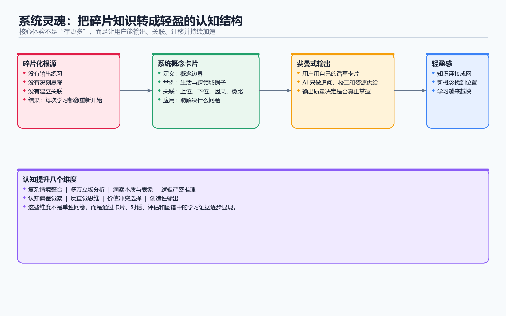

# 感觉文档

***

## 系统灵魂

**知识被串起来，系统化、清晰、高效；思考变得轻盈。**

之前学习是沉重的、断裂的、每次都重新开始；现在学习是流畅的、连贯的、不断积累。

***

## 核心价值：提升认知

**认知的定义：认识世界的方法与结果。**

学习的终极目的不是"知道"，而是"认知升级"。这个系统通过以下8个维度衡量认知是否真正提升：

1. **复杂情境整合** —— 能在复杂混乱的现实情境中，提取关键要素，整合多方信息，形成系统判断
2. **多方立场分析** —— 能跳出单一视角，理解不同立场，看到问题的多个面向
3. **洞察本质与表象** —— 能穿透表象，抓住事物本质，不被表面现象迷惑
4. **逻辑严密推理** —— 能进行严密的逻辑推理，从前提到结论环环相扣
5. **认知偏差觉察** —— 能觉察自己的认知偏差，知道自己什么时候在骗自己
6. **反直觉思维** —— 能发现并拥抱反直觉的真相，比如"婚姻中两个人的规模经济反而节省成本"
7. **价值冲突选择** —— 能在价值冲突中做出选择，并说明理由，比如电车难题
8. **创造性输出** —— 能将所学内化后，进行创造性输出，产生新的见解

***

## 核心痛点：碎片化

**学生学了很多，但都是碎片。**

碎片化的根源是三个"没有"：

1. **没有输出练习** —— 只输入不输出，以为自己懂了，其实只是"听过"
2. **没有深刻思考** —— 浅尝辄止，不求甚解，概念停留在"知道"层面
3. **没有建立关联** —— 每个知识点都是孤岛，无法整合，无法迁移

结果就是：知识无法串起来，学习无法加速，思考始终沉重。

***

## 核心解法：费曼学习法

**"我输出的才是我会的。"**

这个系统的本质，就是让用户通过**输出**来完成真正的学习。

### 学习的基本原子：系统概念

不是以"书"为单位，不是以"章节"为单位，而是以"清晰、准确、必要的概念"为单位。

每个概念卡片包含四个部分，缺一不可：

- **定义** —— 这个概念到底是什么？边界在哪里？
- **举例** —— 能举出生活中的例子吗？能跨领域举例吗？
- **关联** —— 这个概念与其他概念有什么关系？上位、下位、因果、类比？
- **应用** —— 这个概念能解决什么问题？能在什么情境中使用？

### 用户自主构建

卡片必须由用户**自己手写**，不是AI代劳。

为什么？

- 对话是碎片化的，可能随便说说；只有手写才是认真思考的
- 对话表达的是"我以为我知道的"；手写才是"我真正理解的"
- 只有自己输出的，才是真正内化的

AI的角色是**辅助引导**：

- 巨匠Agent生成个性化学习资料，填补知识盲区
- 卡片构建Agent引导用户打磨闪念内容，朝着"清晰、准确、必要"的标准努力
- AI评估卡片质量，基于巨匠Agent的标准（冯·诺依曼会怎么评价这张卡片？）

### 无质量损失的提速

学习是可以加速的，但前提是**质量不降低**。

加速的机制：

1. **概念积累** —— 概念越建越多，新概念可以直接连接旧概念，不用从零开始
2. **AI理解** —— AI根据用户手写的卡片内容建立画像，深度理解用户的学习进度和认知取向，推荐越来越精准
3. **系统闭环** —— 永久盒的知识体系越来越完整，新知识很容易找到位置，学习自然加速

***

## 系统运行体验

用户使用这个系统的完整体验是这样的：

### 1. 对话初识

选择一个领域，系统创建对应的巨匠Agent（比如学计算机科学，就是冯·诺依曼）。

与巨匠Agent自然聊天，AI探测你的知识边界、学习目标、认知水平，完成初始画像构建。

### 2. 文献生成

AI基于对话记录，分析你的知识盲区，生成专属学习资料（书单、视频、文档），存入文献盒。

### 3. 闪念记录

研读资料，结合与巨匠Agent的交流，将零散想法、瞬时思考、知识疑问录入闪念盒。

### 4. 卡片沉淀

AI引导你打磨闪念内容，朝着"清晰、准确、必要"的标准，最终形成标准化概念卡片（定义+举例+关联+应用），存入永久盒，建立双向关联。

### 5. 迭代加速

AI读取永久盒的卡片，深度理解你的知识体系，更新画像，优化巨匠Agent的对话逻辑，补充更精准的文献资料，引导你搭建更多关联概念。

**越学越快，越学越轻盈。**

***

## 最终改变

用户用完这个系统后，最大的变化是：

**思考变得轻盈了。**

知识不再是孤立的碎片，而是连接成网；学习不再是重复开始，而是持续积累；思考不再是沉重负担，而是流畅体验。

这就是因材施教的真正落地。
