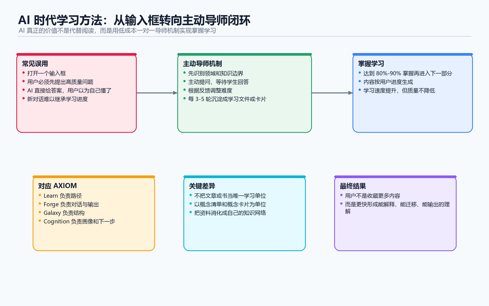

# AI 时代的高效学习方法

> 核心观点：AI 是人类历史上第一次以极低成本、几乎无限规模提供"一对一导师"体验的机会。



---

## 第一部分：如何正确看待 AI 生成内容

### 问题背景
- 微信公众号开始批量打击 AI 生成内容
- 评论区纷纷叫好，说要抵制 AI 生成的东西
- 大家认为："我们喜欢有人味的东西"

### 观点：我们搞错了矛头

**我们反感的不是 AI 生成这个事情本身，而是：**
- 没有品位的创作者
- 胡乱复制粘贴 AI 生成的内容就往网上发
- 污染我们的信息流

**历史告诉我们的答案：**

回顾人类历史，每一次思想工具变得更便宜、更普及时，低质量内容一定会泛滥：

| 时代 | 技术变革 | 反应 |
|------|----------|------|
| 几百年前 | 印刷术普及 | 书籍突然过剩，思想家抱怨"愚蠢的印刷品到处都是" |
| 现在 | AI 生成普及 | AI 生成的垃圾内容泛滥 |

**但历史的解决方案是：**
- 不是放一把火把印刷技术全烧了
- 而是提出了更好的**消化内容的方法**

**培根的解决方案：分层阅读**
- 有些书需要逐字逐句细细品尝（精读）
- 有些书大概翻一翻就可以了（泛读）

现在看来这是"正确的废话"，但如果没有经历过印刷术普及的时期，人类连这个废话都得不到。

---

## 第二部分：应对 AI 时代的个人学习策略

### 核心原则
> **作为读者，我们要有辨别内容、消化内容的能力，而不是无脑地去批判创作者那边。**

### 方法一：与"死人"对话

**具体操作：**
1. 遇到搞不清楚的事情，让 AI 识别：
   - 这个问题对应哪些领域？
   - 对应哪些学科？
2. 让 AI 推荐历史上与此相关的名人
3. 拉一个聊天组，一起聊天直到搞清楚问题

**为什么这样做？**
- 大部分事情在我们出生之前，已经被那些去世的人搞清楚了
- AI 推荐的这些名人都是被历史筛选过的最强的一批人
- 跟他们聊天是搞清楚事情的捷径

**个人实践：**
> "我有一个暴论（听起来很难听但我真的这么想）：我平时遇到什么事，我尽量去跟死人聊，我不太愿意跟活人聊了。"

---

### 方法二：概念清单学习法

**核心理念：**
> 不要把在网上找到的文章或书当成基本的学习单位。

**具体操作：**
1. 找到一本陌生的书时，意识到不了解的不只是这一本书，而是相关的一系列概念
2. 让 AI 带你**交互式学习**：
   - 先聊个三五分钟
   - 让 AI 了解你的知识边界在哪里
   - 你知道什么、不知道什么
3. 让 AI 推荐这个领域的**一系列书单/概念清单**
4. 带着清单去学习，而不是搞清楚某一本书

---

### 方法三：非必要不读书（AI 定制化学习）

**核心观点：**
> 从头到尾逐字看完一本书已经不是最高效的学习方法了。

**具体操作：**
1. 让 AI 基于感兴趣的领域，先产出一小部分内容
2. 在内容结尾写下**我的反馈**
3. AI 根据反馈再去产出下一部分内容
4. 不断循环

**优势：**
- 内容一直根据学习进度、学习取向定制
- 学习速度比逐字看完一本书快 10 倍以上
- 有意义的加快，没有损失质量

**适用场景：**
- 不是所有书都这样（如马斯克传记，仍选择逐字看英文原版）
- 那样做是因为享受，不是因为觉得更快

---

## 第三部分：Bloom 的 2 Sigma 问题与 AI 的解决方案

### Bloom 的 2 Sigma 研究

上世纪 80 年代，教育心理学家 Bloom 发表研究：

> **如果一个学生在学习时可以满足两个条件，就可以超过其他 98% 的学生。**

这两个条件：
1. **一对一导师**
2. **掌握学习法**（对现有知识达到 80%-90% 掌握率才进入下一部分）

**问题：一对一导师太贵了**
- 在一定程度上，富人形成了知识垄断/学习方法垄断
- 你的基因、认知机制决定了人类必须定制化学习才最快
- 但没有钱就雇不起老师，就没法用最快的方式学习

### AI 的历史性突破

**AI 大模型是：**
- 人类历史上第一次
- 以极低成本
- 几乎无限规模
- 提供"一对一导师"体验

### 但大多数人都用错了

**主流 AI 产品的问题：**
- 一打开就是一个输入框
- 通过对话驱动
- 要得到高质量回复，需要先提出高质量问题

**核心矛盾：**
> 人类接触陌生领域时，最大的困扰就是：**我不知道我不知道什么问题**

**为什么一对一导师管用？**
- 导师主动发起**定制化的提问**
- 根据学生的反馈来提问
- 学生只需要想办法回答问题

**结论：**
> 现在的主流 AI 产品的交互方式，和人类最适应的学习机制是**相反**的。

---

## 第四部分：实践方案——本地 Agent 交互式学习

### 为什么需要本地 Agent？

**写提示词的方案有这些问题：**
- 上下文不够长
- 聊久了对话框就不好用了
- 重新开对话框无法继承学习进度
- 新对话框无法理解你的学习程度

**解决方案：本地 Agent**

**推荐工具：**
- **Cursor**（最常用）
- **Claude Claude**
- **Cline**（国内做的，配置简单）

**核心能力：**
- 有能力读取你电脑里面的文件
- 可以操控文件系统
- 可以创建学习文件夹和递进式学习文件

### 实操案例：学习维特根斯坦《逻辑哲学论》

**Step 1：配置系统设定**

创建 `claude.md` 系统设定文件，定义交互式学习工作流程。

**Step 2：让 AI 创建学习文件夹**

```
你开一个新的文件夹，帮我学习维特根斯坦的《逻辑哲学论》
```

AI 会自动创建文件夹并生成第一个学习文件。

**Step 3：渐进式学习**

| 轮次 | 文件内容 | 你的反馈 |
|------|----------|----------|
| 第 1 轮 | 基础入门介绍 | "我稍微懂一点，不是纯小白" |
| 第 2 轮 | 触及核心内容（更激进） | 继续反馈 |
| 第 3 轮 | 根据反馈调整难度 | ... |

**类比传统读书：**
- 传统书是死的，不能智能对话
- 害怕跳过第 2-5 章会错过东西
- 不敢跳过，但第 1 章又太基础浪费时间

**AI 交互式学习的优势：**
- 第 1 章看完，可能直接跳到第 6 章
- 完全高度定制化
- 完美贴合你的理解能力和学习能力

---

## 总结

### 为什么这是 AI 对普通人最有价值的应用？

> **学习能力是所有能力的原能力。**
> **你学得比别人快，就什么都比别人快。**

### 现在的门槛

- 一台电脑
- 一个 AI 账号
- 非常少量的金钱

### 唯一的变量

> 你是准备现在就开始革新一下你的学习方式，还是先收藏一下，等到三五年后的某一天突然想起来这件事？

---

## 附录：快速行动指南

### 立即可做的三件事

1. **安装本地 AI 工具**（Cursor/Claude Desktop/Cline）
2. **选择一个你一直想学但没开始的领域**
3. **对 AI 说**："帮我创建一个交互式学习计划"

### 交互式学习提示词模板

```markdown
# 交互式学习导师

你是一位苏格拉底式的导师，你的目标是帮助我通过交互式对话掌握新知识。

## 工作流程
1. 先了解我的现有知识水平
2. 创建学习文件夹
3. 每个文件聚焦一个核心概念
4. 每个文件结尾向我提问
5. 根据我的反馈调整下一份内容的难度

## 交互规则
- 主动提问，等我来回答
- 如果我理解了，提高难度
- 如果我不懂，换角度解释
- 每 3-5 轮对话后，生成一份新的学习文件
```

---

*文档整理时间：2026年*
*来源：演讲转录稿整理*
