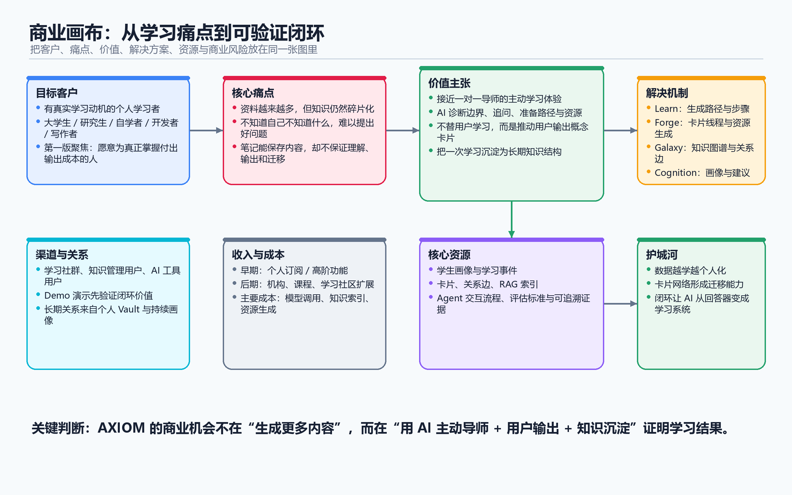

# 01 商业画布分析

## 1. 定位

**AXIOM Space 是一个 AI 掌握学习系统：它主动认识你、追问你、为你准备路径和资源，但坚持让你自己输出，直到资料真正变成你的知识。**

它的长期愿景是：

**让一对一导师，不再是少数人的特权。**

## 2. 产品信念

AXIOM 的出发点不是“用 AI 生成更多资料”，而是解决一个更根本的问题：今天的信息和内容已经太多了，真正稀缺的是把内容消化成能力的学习机制。

我们相信两件事：

- **AI 不应该只是一个空白输入框。** 学生面对陌生领域时，最大的问题往往不是没有答案，而是不知道自己该问什么。真正的导师应该主动提问、诊断和追问。
- **AI 不能替用户学习。** 资料不是知识，回答不是掌握。真正的学习必须经过用户自己的表达、判断、关联和输出。

所以 AXIOM 不把 AI 当成代写工具，而是当成一个会观察、会引导、会追问、会调整路径的学习导师。

## 3. 它不是什么

AXIOM 不是普通的 AI 聊天工具。普通聊天工具等待用户提问，而 AXIOM 会主动识别用户的知识边界。

AXIOM 不是资料生成器。资料只是学习燃料，不是学习结果。

AXIOM 不是普通笔记软件。保存笔记不是目的，把知识变成可理解、可关联、可迁移的结构才是目的。

AXIOM 也不是传统课程平台。课程平台通常给所有人同一套内容，而 AXIOM 希望让学习路径跟着每一个具体的人变化。

## 4. 商业画布概览



| 模块 | 当前判断 |
|------|----------|
| 客户细分 | 有真实学习动机、想深度掌握知识，但被碎片化信息和低效自学困住的人 |
| 价值主张 | 提供接近一对一导师的学习体验，让用户从“看过资料”走向“真正掌握” |
| 渠道通路 | 初期可从大学生、自学者、AI 工具用户、知识管理用户和学习型社群切入 |
| 客户关系 | 长期陪伴式关系；系统越了解用户，越能提供精准的学习引导 |
| 收入来源 | 可探索个人订阅、高级 Agent、课程学习包、教育机构版本等模式 |
| 核心资源 | 学习方法论、多智能体系统、用户画像、知识卡片、知识图谱和长期记忆 |
| 关键业务 | 主动教学、画像更新、资源准备、卡片锻造、掌握评估、路径调整 |
| 重要伙伴 | 大模型服务商、教育内容提供方、学习社群、学校或培训机构 |
| 成本结构 | 模型调用成本、知识检索与索引成本、内容审核成本、产品研发与运维成本 |

## 5. 客户细分

AXIOM 最优先服务的用户，不是只想让 AI 代写、代学、快速交差的人，而是那些真的想把一件事学明白的人。

核心用户可以包括：

- 被碎片化学习困住的大学生。
- 想长期自学、跨领域成长的人。
- 需要把学习转化成论文、项目、写作或研究输出的人。
- 对传统课程学习不满意，希望获得更个性化学习路径的人。
- 已经在使用 AI 工具，但发现普通问答无法支撑长期学习的人。

这些用户的共同点是：他们不是缺资料，而是缺一个能持续理解自己、推动自己、帮助自己真正掌握的学习系统。

## 6. 核心痛点

用户今天遇到的问题，可以概括为三句话：

**内容很多，但消化不了。** 用户能找到大量文章、视频、课程和 AI 回答，但这些内容很容易变成新的信息负担。

**AI 很强，但用户不知道怎么用。** 普通 AI 产品给用户一个输入框，可是新手面对陌生领域时，往往不知道自己不知道什么，也就不知道该问什么。

**学了很多，但没有变成自己的东西。** 很多人看过、听过、收藏过很多内容，但缺少输出、缺少反馈、缺少关联，最后知识仍然是碎片。

AXIOM 要解决的不是“没有内容”，而是“内容没有被真正掌握”。

## 7. 价值主张

AXIOM 给用户的核心价值，是让学习从“自己摸索”变成“被理解、被追问、被引导”。

它会主动了解用户当前的知识基础、认知风格、薄弱环节和学习节奏；然后根据这些信息准备合适的资料、问题和路径。

但 AXIOM 不替用户完成学习。它会引导用户把理解写出来，把概念讲清楚，把例子补完整，把知识和已有认知连接起来。

最终，用户得到的不只是一堆资料，而是一套逐渐生长的个人知识结构。

## 8. 解决方案机制

AXIOM 的学习闭环可以概括为：

```text
主动诊断
  -> 定制提问
  -> 个性化资源
  -> 用户输出
  -> 卡片锻造
  -> 掌握评估
  -> 路径重写
  -> 知识网络沉淀
```

这个闭环里，AI 负责引导和加速，用户负责真正的理解和输出。

一轮学习结束后，系统不会让对话消失在聊天记录里，而是把有价值的内容沉淀成卡片、画像、路径和知识连接。用户学得越多，系统越懂用户；系统越懂用户，下一轮学习就越精准。

## 9. 渠道通路

早期渠道应优先面向已经有学习焦虑和自我提升需求的人群。

可切入的渠道包括：

- 高校学生社群和课程学习场景。
- 自学者、研究生、开发者、写作者等深度学习人群。
- AI 工具用户和知识管理工具用户。
- 学习方法、效率工具、第二大脑相关内容社区。
- 与具体课程、学习营或训练营结合的场景。

早期传播不宜只强调“功能很多”，而应强调一句清楚的话：**AXIOM 帮你把资料真正学成自己的。**

## 10. 客户关系

AXIOM 与用户之间不应该是一次性工具关系，而应该是长期学习伙伴关系。

普通工具越用越熟练，AXIOM 应该是越用越懂你。它会持续积累用户的学习记录、知识卡片、薄弱环节、偏好和成长轨迹。

这种长期关系的核心不是情感陪伴，而是学习质量：系统必须让用户感觉到“它真的知道我现在懂什么、不懂什么、下一步该学什么”。

## 11. 收入来源

收入模式可以在后续阶段继续细化，当前可以保留几种方向：

- 个人订阅：面向长期学习者，提供完整的学习空间、Agent 能力和知识记忆。
- 高级能力付费：如更强模型、更长上下文、更深度的知识图谱和学习评估。
- 课程学习包：围绕一门课或一个领域，提供可直接启动的学习路径和资料包。
- 教育机构版本：面向学校、培训机构或学习社区，支持多人学习和教学分析。

商业化不能破坏产品底线：AXIOM 卖的不是“替你完成”，而是“帮助你真正掌握”。

## 12. 核心资源

AXIOM 的核心资源包括：

- 一套清晰的学习方法论：主动提问、掌握学习、费曼输出、概念卡片和长期沉淀。
- 多智能体教学系统：前台教学、后台分析、画像、路径、资源、评估等角色协作。
- 用户长期画像：系统对用户知识基础、认知风格、薄弱环节和学习节奏的理解。
- 个人知识结构：用户自己的卡片、关联、路径、资料和学习历史。
- 内容质量机制：事实核查、引用验证、防幻觉和资源审核。

这些资源共同构成 AXIOM 的壁垒：它不是一次性的 AI 回复，而是一个随用户学习持续生长的系统。

## 13. 关键业务

AXIOM 必须持续做好几件事：

- 让 AI 能主动提问，而不是被动回答。
- 从对话中稳定更新用户画像。
- 根据画像生成合适的资料和学习路径。
- 引导用户输出，而不是替用户输出。
- 判断用户是否真正掌握，并据此调整下一步。
- 把学习过程沉淀为长期知识结构。

如果这些事情做不好，AXIOM 就会退化成普通聊天工具或资料生成器。

## 14. 重要伙伴

AXIOM 可能需要的伙伴包括：

- 大模型与多模态模型服务商。
- 高质量课程、教材、论文和开放教育资源提供方。
- 高校、培训机构、学习社区和内容创作者。
- 知识管理、开源工具、检索增强和向量数据库相关生态。

伙伴关系的目标不是堆内容，而是帮助用户获得更可靠、更适合自己的学习材料。

## 15. 成本结构

主要成本包括：

- 大模型调用与多智能体协作成本。
- 知识库索引、检索和存储成本。
- 内容审核、事实核查和防幻觉机制成本。
- 产品研发、交互设计和系统运维成本。
- 后续面向教育场景时的课程适配和服务成本。

成本控制的重点，是避免无意义地生成大量内容。AXIOM 应该生成“刚好对用户有用”的内容，而不是更多内容。
