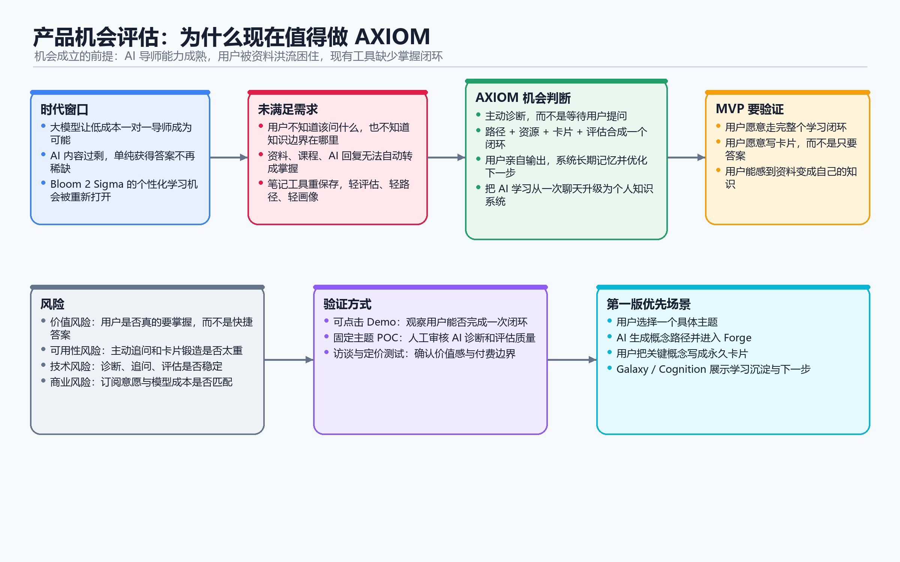

# 02 产品机会评估

## 1. 机会概述

AI 正在让“一对一导师”第一次有机会变成普通人也能获得的学习体验。AXIOM Space 的机会，是把这种能力做成一个真正的掌握学习系统：主动认识用户、追问用户、准备路径和资源，并通过用户自己的输出，把资料变成真正掌握的知识。

## 2. 目标客户

- 客户类型：有真实学习动机、希望深度掌握知识的个人学习者。
- 行业 / 场景：高等教育、自学成长、研究学习、职业技能提升、写作与项目输出。
- 付费决策人：早期以个人用户自己付费为主；后期可以扩展到学校、培训机构、学习社区负责人。
- 使用者：大学生、自学者、研究生、开发者、写作者、需要长期学习新领域的人。
- 影响者：老师、学习博主、知识管理用户、AI 工具用户、学习社群组织者。

## 3. 核心问题

- 用户当前遇到什么问题？

用户不缺资料，缺的是把资料真正消化成能力的方法。大量学习者看了很多文章、课程、视频和 AI 回答，但知识仍然是碎片，难以输出、关联和迁移。

- 这个问题发生在什么场景？

常见于学习一门新课、进入一个陌生领域、准备论文或项目、阅读复杂材料、用 AI 辅助自学但不知道怎么问的时候。

- 这个问题造成什么损失？

用户花了很多时间收集和浏览资料，却没有形成真正理解；学习容易反复从零开始，缺少长期积累；遇到复杂问题时，仍然无法清晰判断和表达。

- 用户现在怎么解决？

用户通常会看网课、收藏资料、问 ChatGPT、做笔记、使用 Notion/Obsidian 等知识管理工具。但这些方案大多依赖用户自己规划问题、判断路径和完成内化。对新手来说，最难的恰恰是“不知道自己不知道什么”。

## 4. 价值主张

- 我们提供什么核心价值？

AXIOM 提供接近一对一导师的学习体验。它不是等用户提问，而是主动诊断用户的知识边界；不是替用户学习，而是引导用户通过输出完成真正掌握。

- 这个价值为什么重要？

因为 AI 时代内容会越来越多，单纯获得答案已经不稀缺。真正稀缺的是辨别、消化、表达、关联和迁移知识的能力。

- 和现有方案相比好在哪里？

普通 AI 聊天工具给用户一个输入框，用户要先知道问什么。AXIOM 会主动追问、更新画像、准备资源、评估掌握程度，并把学习过程沉淀成长期知识结构。

普通笔记工具帮助用户保存内容，AXIOM 关注的是用户是否真的理解，是否能把内容变成自己的概念卡片和知识网络。

## 5. 目标用户与核心场景

- 用户角色：认真学习者。这个用户不一定是成绩最好的人，但他真的想把一件事学明白。
- 高频场景：学习新概念、阅读复杂资料、整理课堂内容、用 AI 辅助自学、把零散想法写成卡片。
- 高价值场景：准备一门难课、跨领域入门、做研究或项目、写文章或论文、形成长期个人知识体系。
- 第一版优先场景：用户选择一个具体主题或课程，AXIOM 通过对话了解用户水平，生成概念学习路径，并引导用户把关键概念锻造成永久知识卡片。

## 6. 竞争与替代方案

- 直接竞品：AI 学习助手、AI Tutor、基于大模型的学习产品、个性化学习平台。
- 间接竞品：ChatGPT、Claude、Kimi、通义等通用 AI 聊天工具；Notion、Obsidian、Logseq 等知识管理工具；网课平台和学习 App。
- 用户当前替代方案：自己搜索资料、看课、问 AI、做笔记、整理知识库、找老师或同学讨论。
- 我们的差异化：

AXIOM 的差异不在于“能生成更多内容”，而在于学习机制不同。

它有两条底线：

- AI 主动提问，而不是只等用户提问。
- AI 不替用户学习，而是引导用户自己输出。

它把对话、资源、画像、路径、卡片和知识图谱放在同一个闭环里，让每次学习都能沉淀下来，而不是停留在一次聊天或一份资料里。

## 7. MVP 假设

第一版要验证的核心问题是：

**用户是否愿意用 AXIOM 完成一次“从资料到掌握”的学习闭环。**

具体假设包括：

- 用户愿意让 AI 先了解自己的水平，而不是直接索要答案。
- 用户愿意接受 AI 的主动追问和学习路径安排。
- 用户愿意亲自输出概念卡片，而不是只让 AI 代写。
- 用户能感受到“资料变成自己的知识”的差异。
- 用户完成几张高质量卡片后，会愿意继续使用系统学习下一个主题。

第一版不需要证明所有商业模式成立，但必须证明一件事：这个学习闭环对真实用户有吸引力，并且用户愿意为“真正掌握”付出一点主动输出的成本。

## 8. 风险判断

| 风险 | 问题 | 如何验证 |
|---|---|---|
| 价值风险 | 用户真的需要“掌握学习”，还是只想要快速答案？ | 用户访谈、可点击 Demo、观察用户是否愿意完成卡片输出 |
| 可用性风险 | 主动提问、卡片锻造、路径调整会不会让用户觉得复杂？ | 原型测试、首次使用流程测试、记录用户卡在哪一步 |
| 技术风险 | AI 能否稳定诊断用户水平、生成合适问题、评估掌握程度？ | 小范围 POC、固定主题测试、人工审核 AI 判断质量 |
| 商业风险 | 用户是否愿意为长期学习系统付费？模型成本是否可控？ | 定价访谈、早期订阅实验、模型调用成本测算 |

## 9. 结论

- 是否值得继续推进？

值得继续推进。这个机会不只是做一个 AI 功能，而是把 AI 时代新的学习方法产品化。它有清晰痛点，也有足够大的长期空间。

- 优先做哪个用户群？

优先做有强学习动机的个人学习者，尤其是大学生、自学者、研究生、开发者和需要持续学习新领域的人。

- 优先做哪个场景？

优先做“学习一个具体主题，并把关键概念锻造成自己的永久知识卡片”的场景。这个场景足够小，但能验证 AXIOM 最核心的价值。

- 下一步做什么？

下一步应明确 MVP 的第一条完整用户旅程：用户从选择主题开始，经过 AI 诊断、概念路径、资源准备、卡片输出、掌握评估，最终沉淀出第一组个人知识卡片。
