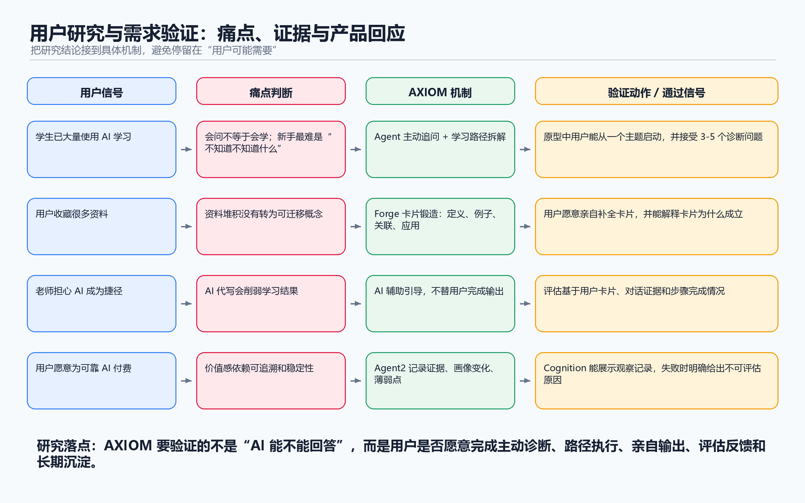

# 03 用户研究与需求验证

## 1. 报告结论

本轮公开资料研究验证了 AXIOM Space 的核心机会：

**AI 学习已经是高频需求，但用户真正缺的不是更多答案，而是一个能帮助自己完成“理解、输出、评估、沉淀”的掌握学习系统。**

AXIOM 的机会不在于再做一个 ChatGPT 外壳，也不在于生成更多资料。真正的机会在于把 AI 从“答案机器”推进到“学习导师”：它主动认识用户、追问用户、准备合适的路径和资源，同时坚持让用户自己输出，直到资料真正变成自己的知识。

本轮研究得出四个关键判断：

1. **需求真实存在。** 多项公开调研显示，学生已经大规模使用 AI 辅助学习，AI 学习不是未来概念，而是已经发生的日常行为。
2. **现有方案存在缺口。** 通用 AI 容易给答案，但不一定让用户学会；知识管理工具能保存内容，但不能主动推动用户理解；课程平台提供内容，但很难跟着每个用户变化。
3. **AXIOM 的产品原则有依据。** 主动提问、用户输出、自我解释、主动回忆、概念关联、智能导师系统等方向，都有公开研究和真实用户反馈支持。
4. **仍需真实原型验证。** 用户是否愿意写概念卡片、是否觉得卡片锻造比普通聊天更有价值、是否愿意为长期学习系统付费，仍需要 Demo 测试和真实访谈。

最终判断：

**值得继续推进，但 MVP 必须围绕一个小闭环验证：用户能否在 AXIOM 中完成一次“从资料到掌握”的真实学习过程。**

## 2. 研究范围与方法

本轮研究属于公开资料研究，不等同于正式用户访谈。

研究目标是验证《02 产品机会评估》中的核心判断：

- 用户是否真的需要 AI 掌握学习系统。
- 用户现在是否已经使用 AI、网课、笔记工具等解决学习问题。
- “内容很多但没有掌握”的痛点是否高频、严重。
- 用户是否愿意接受 AI 主动追问和输出型学习。
- 用户、老师或机构是否可能为更好的学习支持付费或投入资源。

资料来源包括：

- 公开调研：Chegg、Inside Higher Ed、Digital Education Council、Anthropic、Quizlet 等。
- 学术与研究资料：Stanford SCALE、World Bank、retrieval practice、自我解释、concept map、intelligent tutoring systems、LLM 自动评分综述等。
- 真实社区反馈：Reddit 学习、编程、知识管理、教师与教育技术社区。
- 国内公开内容：少数派、B 站、知乎等。

本报告会区分三类结论：

- **已较强验证：** 有公开调研、研究或多类用户反馈支撑。
- **部分验证：** 方向有证据，但 AXIOM 的具体产品形态仍需测试。
- **仍需验证：** 必须通过原型、访谈或付费实验确认。

## 3. 机会是否真实存在

### 3.1 学生已经大规模使用 AI 学习

Chegg 2025 Global Student Survey 调研了 15 个国家的 11,706 名本科生。报告显示，全球 80% 的学生已经用过 GenAI 支持大学学习；29% 的学生在卡在概念或作业上时，会第一时间使用 GenAI；56% 的 AI 使用者主要用它理解概念或学科；50% 的学生希望出现专门为教育设计的 GenAI 工具。来源：[Chegg Global Student Survey 2025](https://www.chegg.com/about/newsroom/press-release/chegg-global-student-survey-2025-80-of-undergraduates-worldwide-have-used-genai-to-support-their-studies-but-accuracy-a-top-concern?snoball_referral=9z4s)。

Inside Higher Ed 2025 Student Voice 调研显示，85% 的学生过去一年在课程中使用过生成式 AI，主要用途包括头脑风暴、像导师一样提问、备考和测验学习。来源：[Inside Higher Ed Student Voice Survey 2025](https://www.insidehighered.com/news/students/academics/2025/08/29/survey-college-students-views-ai)。

Digital Education Council 2024 Global AI Student Survey 覆盖 16 个国家 3,839 名学生，显示 AI 已经成为高等教育中的主流议题。来源：[DEC Global AI Student Survey 2024](https://www.digitaleducationcouncil.com/resource-library-items/digital-education-council-global-ai-student-survey-2024)。

Anthropic 2025 Education Report 分析了约 100 万条使用 Claude 的学生对话，其中 574,740 条被识别为与学习、课程或学术相关。报告指出，学生使用 AI 的方式包括直接解题、直接产出、协作解题和协作产出；其中直接型对话约占 47%。来源：[Anthropic Education Report: How University Students Use Claude](https://www.anthropic.com/research/anthropic-education-report-how-university-students-use-claude)。

这些数据说明：AI 学习需求已经发生，不需要 AXIOM 再去教育市场“为什么要用 AI 学习”。真正的问题是：用户正在怎么用 AI，以及这种用法是否真的促进掌握。

### 3.2 行业正在从“给答案”转向“引导学习”

OpenAI 在 2025 年推出 ChatGPT Study Mode，官方描述是帮助用户一步步解决问题，而不是直接给答案。来源：[OpenAI Study Mode](https://openai.com/index/chatgpt-study-mode/)。

Axios 对该功能的报道中提到，Study Mode 使用苏格拉底式方法，通过问题、提示和自我反思来促进批判性思维。来源：[Axios](https://www.axios.com/2025/07/29/openai-chatgpt-study-mode)。

OpenAI 的 Kevin Weil 也在 X 上把 Study Mode 称为迈向 “free, personalized 1:1 tutor” 的一步。来源：[Kevin Weil on X](https://x.com/kevinweil/status/1950353306209128750)。

这说明 AXIOM 的方向不是孤立判断。行业也已经意识到，教育 AI 不能只做“直接回答”，而必须引导用户思考。

### 3.3 机会判断

机会真实存在，但边界也很清楚：

AXIOM 不应该把自己定位成“更强的 AI 搜索”或“更多资料生成”，而应该定位成“掌握学习流程”。它要解决的是：用户已经有 AI 和资料，但仍然没有真正学会。

## 4. 用户真实痛点

### 4.1 痛点一：学了很多，但仍然是碎片

Reddit 编程学习社区里，一个用户总结自己如何离开 “tutorial hell”：

> I am on this subreddit often, and I see so many posts about "tutorial hell" and not feeling like you know programming, even after days/weeks/months of learning.
>
> After you get a few tutorials under your belt, the best thing you can do to build confidence is to set up your own challenge.
>
> This is going to teach you:
>
> - How to figure out where to start
> - How to find answers to problems when there isn't a guide
> - How to CREATE rather than COPY
>
> 来源：[Reddit / r/learnprogramming](https://us.reddit.com/r/learnprogramming/comments/1e40e8g/leave_tutorial_hell_heres_how_i_did/)

另一个评论更直接：

> I watched a 6 hour video on node.js where they coded a project and I remembered barely anything from it, and learnt way more from creating a mini project based on the topics.
>
> Watching tutorials is like making notes, projects are like doing past paper questions. Tutorials help you learn, but practice helps you understand and remember.
>
> 来源：[Reddit / r/learnprogramming](https://us.reddit.com/r/learnprogramming/comments/1e40e8g/leave_tutorial_hell_heres_how_i_did/)

这类反馈验证了 AXIOM 的核心判断：用户的问题不是没有教程，而是缺少从输入到输出、从模仿到掌握的机制。

### 4.2 痛点二：用户想用 AI 当导师，但不知道怎么用对

Reddit 上一名学生问 ChatGPT 是否可以当导师：

> So would telling chatgpt to mark my work, give me questions, feedback, etc be helpful?
>
> Also, I made a ChatGPT project where i inserted the Study Design and 2-3 past exams with answers.
>
> If anyone has tips for studying alone please tell me I'm stuck.
>
> 来源：[Reddit / r/vce](https://www.reddit.com/r/vce/comments/1t4c778/using_chatgpt_as_a_tutor/)

评论区里有教育从业者指出，通用 AI 不够贴合具体学生：

> They do not inherently understand the actual pain points of VCE students.
>
> The raw web versions still aren’t designed specifically for personalised VCE learning.
>
> The memory they build about you, and the way information/knowledge is being presented, are not intentionally optimised for improving your understanding.
>
> 来源：[Reddit / r/vce](https://www.reddit.com/r/vce/comments/1t4c778/using_chatgpt_as_a_tutor/)

这说明用户已经在尝试把 ChatGPT 配置成导师，但缺少三个东西：

- 对具体学习目标的理解。
- 对用户长期画像的积累。
- 对学习内容呈现方式的优化。

这正是 AXIOM 可以切入的空间。

### 4.3 痛点三：知识管理工具能存东西，但容易增加负担

Obsidian 社区里，一个用户说：

> I tried getting into Obsidian a few times but always bounced off.
>
> I was so overwhelmed with trying to do it "perfectly" – learning backlinks, all the complex features... it was just too much and too confusing when you're busy.
>
> 来源：[Reddit / r/ObsidianMD](https://www.reddit.com/r/ObsidianMD/comments/1o2yfhw/obsidian_advice_for_beginners_or_the_overwhelmed/)

另一个用户表达了类似感受：

> The thought about making notes about everything I ever interact with makes me feel so overwhelmed.
>
> 来源：[Reddit / r/ObsidianMD](https://www.reddit.com/r/ObsidianMD/comments/1c0dy9k)

这说明知识管理工具有价值，但如果把“如何组织知识”的负担全部交给用户，很多人会被工具本身压垮。AXIOM 不能只做卡片盒；它必须像导师一样主动组织下一步学习。

### 4.4 痛点四：用户愿意为 AI 学习付费，但要求可靠

Reddit 上一名大学生询问 ChatGPT Plus 是否值得用于大学学习，并明确提到 20 美元/月的成本：

> I believe it charges you $20 (in USD) every month for ChatGPT to upgrade to the plus plan.
>
> Will the upgraded ChatGPT be the same, or will it be more accurate, precise, and closer to helping me get better grades on my college work?
>
> 来源：[Reddit / r/ChatGPTPro](https://www.reddit.com/r/ChatGPTPro/comments/1h4mnsy/is_chatgpt_plus_very_accurate_and_helpful_on/)

正向评论：

> From my experience as a university student, it can really help improve your learning because gptplus summarizes the subjects in any way you want.
>
> 来源：[Reddit / r/ChatGPTPro](https://www.reddit.com/r/ChatGPTPro/comments/1h4mnsy/is_chatgpt_plus_very_accurate_and_helpful_on/)

强付费意愿：

> The way I see it: this degree has a real chance of exponentially increasing my annual and overall lifetime earnings, why not spend $40 a month to help me get there?
>
> 来源：[Reddit / r/ChatGPTPro](https://www.reddit.com/r/ChatGPTPro/comments/1h4mnsy/is_chatgpt_plus_very_accurate_and_helpful_on/)

但也有明显担忧：

> You have to double check any piece of information. It invents facts and sources.
>
> But realistically it's more work than doing it yourself.
>
> 来源：[Reddit / r/ChatGPTPro](https://www.reddit.com/r/ChatGPTPro/comments/1h4mnsy/is_chatgpt_plus_very_accurate_and_helpful_on/)

结论：用户并非不愿意为 AI 学习付费，但他们会关心准确性、可靠性、是否真的减少学习成本。AXIOM 的付费理由不能是“我们也有 AI”，而必须是“我们帮你真的学会”。

## 5. 付费决策人与影响者

### 5.1 老师和机构正在使用 AI，但更关注风险

Anthropic 2025 教育者报告分析了约 74,000 条来自高等教育邮箱的 Claude 对话，发现教育者最常见用途是课程开发、学术研究和学生表现评估。来源：[Anthropic Education Report: How Educators Use Claude](https://www.anthropic.com/news/anthropic-education-report-how-educators-use-claude)。

Digital Education Council 2025 Faculty Survey 调研了 28 个国家 52 所机构的 1,681 名教师。其公开摘要显示，83% 的教师担心学生批判性评估 AI 生成内容的能力，80% 的教师认为机构对 AI 如何用于教学缺乏清晰说明。来源：[DEC Faculty Survey](https://www.digitaleducationcouncil.com/dec-insights/what-faculty-want-key-results-from-the-global-ai-faculty-survey-2025)。

这说明老师和学校不是完全拒绝 AI，而是在寻找可控、可信、能增强教学而不是替代教学的 AI。

### 5.2 老师担心 AI 变成捷径

Reddit 教育科技社区里，一个 AI 个性化学习创业者提出了典型担忧：

> The dream we're sold is amazing, right? A world where every learner gets a perfect, patient tutor.
>
> But the flip side is what keeps me up at night.
>
> Are we just engineering the struggle out of learning?
>
> Are we just making a super-crutch that stops people from learning how to learn on their own?
>
> 来源：[Reddit / r/edtech](https://www.reddit.com/r/edtech/comments/1nf8wj8/is_the_ai_personal_tutor_dream_a_trap_need_a_gut/)

Reddit 教授社区中，一位教师写道：

> I have a gen ed course full of first year students, many of who have no idea what to do when they can't AI their way through an assignment.
>
> Some submit an AI assignment that it can do that absolutely is not what was in the prompt and say "I was confused."
>
> 来源：[Reddit / r/Professors](https://www.reddit.com/r/Professors/comments/1niuanm)

这对 AXIOM 非常重要：如果 AXIOM 看起来像代写工具，老师会抵触；如果它能展示学生如何思考、如何输出、哪里没懂、如何修正，老师反而可能支持。

## 6. 现有替代方案与缺口

### 6.1 用户现在怎么解决

从公开资料和社区反馈看，用户目前主要靠这些方案：

- ChatGPT / Claude / Gemini / Kimi / DeepSeek 等通用 AI。
- ChatGPT Plus、Chegg、NotebookLM、Perplexity 等 AI 学习辅助工具。
- Notion、Obsidian、Logseq、Roam Research 等知识管理工具。
- YouTube / B 站教程、网课、课程资料、PDF、老师 PPT。
- 同学、社群、Discord、论坛、Reddit、老师答疑。
- 线下家教、培训班或学校提供的学习支持。

### 6.2 替代方案的主要缺口

通用 AI 的缺口：

- 需要用户自己知道怎么问。
- 容易直接给答案。
- 容易幻觉，需要用户自己核查。
- 长期学习画像和路径不稳定。

知识管理工具的缺口：

- 需要用户自己建立结构。
- 容易陷入工具配置和方法论焦虑。
- 保存内容和真正掌握之间还有距离。

课程平台的缺口：

- 主要是统一内容和统一进度。
- 个性化反馈不足。
- 学习者很难知道自己到底哪里没懂。

AXIOM 的差异化应当放在这里：它不是替代所有工具，而是把学习过程组织成“主动诊断、输出、评估、沉淀”的闭环。

## 7. AXIOM 核心假设验证

### 7.1 验证矩阵

| 核心判断 | 公开资料验证 | 当前结论 |
|---|---|---|
| 用户已经大量使用 AI 学习 | Chegg 80%、Inside Higher Ed 85%、Anthropic 百万对话分析 | 已较强验证 |
| 用户痛点不是缺内容，而是缺掌握机制 | Reddit tutorial hell、知识管理焦虑、国内“不会问 AI”讨论 | 已较强验证 |
| AI 需要从给答案转向引导学习 | OpenAI Study Mode、Axios、Stanford SCALE 研究 | 已较强验证 |
| 用户输出是学习发生的关键 | 主动回忆、自我解释、项目学习、费曼输出等证据 | 已较强验证 |
| 用户愿意写 AXIOM 的概念卡片 | 只有间接证据，卡片形态仍需测试 | 部分验证 |
| 知识图谱 / 概念关联有学习价值 | concept map 元分析支持，但图谱 UI 可能增加复杂度 | 部分验证 |
| 长期画像有价值 | ITS 元分析、个性化学习研究支持，但可感知性需测试 | 部分验证 |
| 用户愿意为 AXIOM 付费 | ChatGPT Plus、Chegg、Quizlet 等说明市场存在，但 AXIOM 定价需验证 | 部分验证 |
| 老师或机构愿意推荐 / 采购 | 教师在用 AI，但对诚信和能力退化有强顾虑 | 部分验证 |
| AI 掌握评估可信 | LLM 自动评分有潜力，但必须有人类基准和透明评分标准 | 部分验证 |

### 7.2 主动追问是否成立

支持证据：

- OpenAI Study Mode 的方向是逐步引导，而不是直接给出完整答案。来源：[OpenAI Study Mode](https://openai.com/index/chatgpt-study-mode/)。
- Stanford SCALE 介绍的研究《Generative AI Can Harm Learning》显示，没有保护机制的 GPT Base 会提升练习表现，但学生在后续无 AI 测试中表现更差；带有 tutor 保护机制的版本能缓解这种负面影响。来源：[Stanford SCALE](https://scale.stanford.edu/publications/generative-ai-can-harm-learning)。
- World Bank 在 Nigeria AI tutor RCT 中发现，经过设计的 AI tutoring program 能在六周干预中带来显著学习收益。来源：[World Bank Blog](https://blogs.worldbank.org/en/education/From-chalkboards-to-chatbots-Transforming-learning-in-Nigeria)。

判断：

主动追问方向成立，但节奏必须谨慎。如果追问太多、太慢，用户会觉得麻烦。AXIOM 第一版需要证明“追问让我更懂了”，而不是“追问拖慢了我”。

### 7.3 用户输出与卡片锻造是否成立

支持证据：

- Retrieval practice / testing effect 研究表明，主动回忆比单纯重复阅读更能促进长期保持。来源：[Roediger & Karpicke, 2006](https://pubmed.ncbi.nlm.nih.gov/16507066/)。
- 自我解释研究认为，学习者在学习过程中主动解释材料，有助于形成更深理解。来源：[Chi et al., 1989](https://psycnet.apa.org/record/1990-11536-001)。
- 编程学习社区也反复强调“做项目 / 输出”比只看教程更有效。

判断：

“用户输出是有效学习机制”成立；“用户愿意写 AXIOM 的四要素概念卡片”仍需验证。关键不在卡片形式本身，而在用户是否感觉这张卡片真的帮他学会了。

### 7.4 知识图谱是否成立

支持证据：

- 概念图元分析综合了 142 个效应量、11,814 名样本，发现使用 concept maps 对学习有中等且显著的积极效果。来源：[Concept Mapping Meta-analysis](https://link.springer.com/article/10.1007/s10648-017-9403-9)。
- 知识图谱和概念图在教育场景中的研究通常强调“关系”和“结构”对理解复杂知识有帮助。来源：[Knowledge Graphs in Education Survey](https://arxiv.org/abs/2403.10213)。
- Obsidian 社区反馈也提醒，图谱、双链和复杂功能会让用户感到压力。

判断：

“建立知识关联”是核心价值；“图谱 UI 本身”不一定是核心需求。AXIOM 第一版应让图谱服务于回顾、发现关联和路径调整，而不是让用户手动维护复杂网络。

### 7.5 长期画像是否成立

支持证据：

- Intelligent Tutoring Systems 的元分析研究显示，智能导师系统整体能带来学习收益，关键能力包括个性化反馈、分步指导和根据学习者状态调整。来源：[Effectiveness of Intelligent Tutoring Systems: A Meta-Analytic Review](https://eric.ed.gov/?id=EJ1090502)。
- Chegg 调研显示，学生使用 GenAI 的重要用途之一是理解概念和获得学习支持。来源：[Chegg Global Student Survey 2025](https://www.chegg.com/about/newsroom/press-release/chegg-global-student-survey-2025-80-of-undergraduates-worldwide-have-used-genai-to-support-their-studies-but-accuracy-a-top-concern?snoball_referral=9z4s)。

判断：

长期画像方向成立，但“系统懂我”必须变成可感知体验。AXIOM 不能只在后台存画像，而要在推荐理由、路径调整、薄弱点提示里让用户看到它为什么这么判断。

### 7.6 付费意愿是否成立

支持证据：

- Reddit 学生明确讨论 ChatGPT Plus 的 $20/月是否值得用于大学学习。
- Chegg、Quizlet、ChatGPT Plus 等产品说明学生学习工具付费市场存在。
- Quizlet 2025 How America Learns Report 显示，AI、数字学习和学生成功正在成为学习平台的重要方向。来源：[Quizlet How America Learns Report](https://www.prnewswire.com/news-releases/quizlets-how-america-learns-report-explores-the-future-of-education-through-the-lens-of-ai-digital-learning-and-student-success-302506174.html)。

判断：

付费意愿部分成立。用户愿意为“提升学习结果”付费，但不一定愿意为“知识图谱 / 卡片 / 画像”这些功能名词付费。AXIOM 的定价叙事应围绕“帮你学会一个主题 / 一门课”，而不是围绕功能模块。

### 7.7 机构接受度是否成立

支持证据：

- Anthropic 教育者报告显示，高等教育工作者已经用 Claude 做课程开发、研究和评估相关工作。
- DEC Faculty Survey 显示，教师关注 AI 对教学、评价和学生批判性能力的影响。
- 教师社区的核心担忧是 AI 让学生绕过学习过程。

判断：

机构机会存在，但 AXIOM 必须强调“过程证据”和“用户自己输出”。如果产品看起来像代写、代答或绕过学习过程，老师会抵触；如果它能展示学生如何思考、哪里卡住、如何修正，老师更可能接受。

### 7.8 AI 掌握评估是否成立

支持证据：

- Anthropic 教育者报告显示，教育者已经把 Claude 用于学生表现评估等工作，说明评估场景存在真实需求。
- LLM 自动评分综述提醒，模型评分会受到题型、评分标准、提示词和答案长度影响，需要与人工评分进行一致性验证。来源：[Large Language Model-Powered Automated Assessment: A Systematic Review](https://www.mdpi.com/2076-3417/15/10/5683)。
- Stanford SCALE 的 AI 学习研究也提醒，练习中的高表现不一定代表无辅助测试中的真实掌握。

判断：

AI 评估可以作为辅助诊断，但第一版不能把它包装成绝对判断。更稳妥的表达是：AI 提供“掌握迹象”和“薄弱点建议”，用户或老师可以复核。

## 8. 剩余风险与验证计划

### 8.1 剩余风险

| 风险 | 当前判断 | 需要怎么验证 |
|---|---|---|
| 用户只想快速拿答案，不想被追问 | 真实存在 | 做直接回答 vs 追问引导 A/B 测试 |
| 用户不愿意写卡片 | 仍需验证 | 观察用户能否在 20 分钟内完成第一张卡片 |
| 卡片锻造不一定比聊天有感知价值 | 仍需验证 | 同主题对照测试，比较次日复述和应用能力 |
| 图谱可能增加复杂度 | 真实存在 | 测试学习路径、卡片列表、图谱三种结果页 |
| 长期画像用户感知不强 | 仍需验证 | 连续 3 次学习后比较通用推荐和画像推荐 |
| 付费意愿不稳定 | 仍需验证 | 测试订阅、单主题学习包、课程包三种价格 |
| 老师担心代写和诚信 | 真实存在 | 访谈老师，展示过程证据和用户输出机制 |
| AI 评估可能误判 | 真实存在 | 与人工老师评分做一致性测试 |

### 8.2 原型测试通过标准

第一版原型测试建议设定这些通过标准：

- 超过 60% 的目标用户能接受追问式流程，并认为自己理解更深。
- 超过 70% 的目标用户能完成第一张概念卡片。
- 超过 50% 的目标用户愿意继续做下一张卡片。
- 用户能清楚说出 AXIOM 和普通 ChatGPT 的不同。
- 用户能感受到“它知道我哪里薄弱”。
- 至少一种付费模型获得明确承诺信号，例如预约试用、加入等待名单或小额预付。

### 8.3 访谈对象

建议做 8-12 个真实访谈：

- 4 名大学生或研究生。
- 3 名长期自学者或开发者。
- 2 名老师、助教或教育产品从业者。
- 2 名已经为 ChatGPT Plus、Chegg、Notion AI、课程或知识管理工具付费的人。

访谈重点不是问“你喜欢 AXIOM 吗”，而是让他们回忆最近一次真实学习困难：他们卡在哪里、怎么解决、花了多少钱、最后有没有真的学会。

### 8.4 访谈问题

面向学生和自学者：

- 最近一次你想学懂一个东西，但最后没学明白，是什么时候？
- 你当时用了哪些资料或工具？ChatGPT、网课、笔记、同学、老师分别怎么用？
- 你怎么判断自己到底学会了没有？
- 你有没有出现“看懂了，但写不出来 / 用不出来”的情况？
- 如果 AI 不直接给答案，而是先问你问题，你会觉得有帮助还是麻烦？
- 如果系统要求你亲自写一张短卡片，证明你理解了，你愿意吗？为什么？
- 你现在有没有为学习工具付费？多少钱？为什么愿意或不愿意？

面向老师、助教和教育产品从业者：

- 你现在最担心学生怎样使用 AI？
- 哪些 AI 使用是你可以接受的？哪些是不能接受的？
- 如果一个工具能记录学生的思考过程、卡片输出和掌握评估，你会更愿意推荐吗？
- 你是否愿意把它放进课程作业或自学任务里？
- 你需要看到什么证据，才会相信它不是代写工具？

面向已经为 AI 或知识管理工具付费的人：

- 你为什么愿意付费？是为了模型能力、效率、资料处理，还是学习效果？
- 现在的付费工具哪里还不够好？
- 如果一个产品比 ChatGPT 更慢，但能逼你真正输出和掌握，你会不会用？
- 你更愿意为订阅付费，还是为一个具体主题 / 课程包付费？

## 9. 最终结论

AXIOM 的产品机会成立。

它对应的是一个真实变化：AI 已经进入学习场景，但多数产品仍停留在问答、资料生成和内容整理层面。用户真正需要的是更可靠的掌握学习机制：知道自己哪里不会，被合适地追问，拿到适合自己的资料，完成自己的输出，被评估和纠正，并把学习结果沉淀下来。

AXIOM 的核心差异应该坚持三点：

- **AI 主动诊断和追问，而不是只等用户提问。**
- **用户自己输出，而不是 AI 替用户学习。**
- **学习过程沉淀为长期知识结构，而不是消失在聊天记录里。**

下一步不应该继续扩展功能，而应该验证一个最小闭环：

**用户选择一个具体主题，AXIOM 通过对话诊断水平，生成概念路径，引导用户完成 1-3 张概念卡片，并通过评估告诉用户哪里真正掌握、哪里还需要补。**

如果这个闭环能让用户明显感到“我不是只拿到了答案，而是真的更懂了”，AXIOM 就有继续做大的基础。
