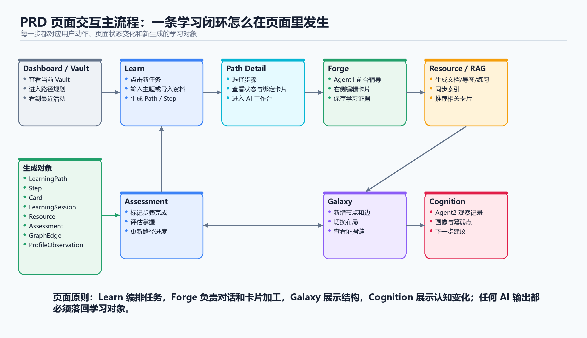

# 05 PRD

## 1. 文档信息

| 项目 | 内容 |
|---|---|
| 产品名称 | AXIOM Space |
| 文档类型 | 产品需求文档 |
| 版本 | v0.2 |
| 对应阶段 | Web MVP |
| 目标读者 | 产品、设计、前端、后端、测试、答辩材料编写者 |
| 上游文档 | `01-商业画布分析.md`、`02-产品机会评估.md`、`03-用户研究与需求验证.md`、`04-MVP定义.md` |
| 下游文档 | `06-对象模型与契约.md` |

本文档描述 AXIOM Space Web MVP 的产品需求：面向谁、解决什么问题、用户怎样使用、页面承载什么能力，以及做到什么程度算验收通过。

对象拆解、对象边界和代码契约见 `06-对象模型与契约.md`。

## 2. MVP 结论引用

### 2.1 本版本服务谁

本版本服务个人学习者。

优先用户是：

- 大学生、研究生。
- 长期自学者。
- 开发者、写作者、研究型学习者。
- 已经在用 AI、网课、笔记软件或知识管理工具学习，但觉得学习结果没有真正沉淀的人。

### 2.2 解决什么问题

用户不缺资料，缺的是把资料真正学成自己的机制。

当前用户常见问题是：

- 面对资料和 AI 回答时，不知道下一步该学什么。
- 看过内容，但没有被追问、输出和评估。
- 聊天得到答案，但不知道自己是否真正掌握。
- 笔记保存了内容，但没有变成持续生长的知识结构。
- 学习过程散落在对话、网页、视频、笔记和脑子里，无法形成稳定闭环。

### 2.3 验证什么假设

本版本验证一个核心假设：

**用户是否愿意在 AI 的引导下，围绕一个具体主题完成学习路径、卡片输出、掌握评估和知识沉淀。**

拆开来看，本版本要验证：

- 用户是否愿意从主题或资料开始，让系统生成学习路径。
- 用户是否愿意进入每个学习任务，和 AI 围绕一张卡片深入讨论。
- 用户是否愿意亲自编辑卡片，而不是只复制 AI 的答案。
- 用户是否认为卡片沉淀、图谱和认知反馈比普通聊天更有学习价值。
- 用户是否能理解 AXIOM 与 ChatGPT、Obsidian、网课平台的区别。

### 2.4 本期范围

本期范围是 Web 端个人掌握学习闭环：

```text
登录 / 选择 Vault
  -> 输入主题或导入资料
  -> 生成学习路径
  -> 打开学习任务
  -> 进入 Forge 卡片线程
  -> AI 引导、追问、解释和资源生成
  -> 用户编辑卡片
  -> 标记完成并接受评估
  -> Galaxy / Cognition 展示沉淀结果
```



### 2.5 本期不做什么

本期不做：

- 移动端 App。
- 桌面端 App。
- 浏览器插件。
- Obsidian / Notion / VS Code 插件。
- 教师后台、班级管理、机构管理。
- 社交社区、公开知识库广场。
- 支付、订阅、套餐后台。
- 重型视频生成、动画生成、PPT 自动生成。
- 复杂知识管理模板市场。

这些内容可以是后续产品形态，但不作为 Web MVP 的验收范围。

## 3. 产品定位

AXIOM Space 是一个 AI 掌握学习系统。

它不是一个“问答机器人”，也不是一个“更漂亮的笔记软件”。它的核心目标是让用户从资料、问题和想法出发，在 AI 引导下完成：

- 学习路径。
- 主动输出。
- 卡片沉淀。
- 知识关联。
- 掌握反馈。
- 下一步学习建议。

一句话定位：

**AXIOM Space 让用户在 AI 的陪伴下，把外部信息真正转化成自己的知识。**

## 4. 用户角色

### 4.1 个人学习者

个人学习者是 MVP 的唯一核心用户。

他们需要：

- 选择一个学习主题。
- 导入一段资料。
- 获得可执行的学习路径。
- 在 AI 引导下理解概念。
- 亲自输出和修改卡片。
- 查看自己已经沉淀了什么。
- 知道下一步该学什么。

### 4.2 AI 学习导师

AI 学习导师不是独立用户，但它是用户体验中的核心角色。

它需要：

- 根据主题和已有知识生成学习路径。
- 围绕卡片进行解释、追问和提示。
- 避免替用户完成全部思考。
- 在用户标记完成时帮助评估掌握程度。
- 在合适的时候生成辅助资源。
- 根据卡片、路径和图谱提供下一步建议。

### 4.3 系统

系统负责把用户行为沉淀为长期结构。

它需要：

- 保存 Vault、卡片、路径、步骤、会话和图谱。
- 保证数据只属于当前用户和当前 Vault。
- 在关键操作后刷新相关页面状态。
- 在卡片升级、路径完成、资料导入等动作发生后同步相关结果。

## 5. 用户场景剧本

### 5.1 场景 1：从一个主题开始学习

用户想学习“第一性原理”，但不知道从哪里开始。

1. 用户进入 AXIOM，选择当前 Vault。
2. 用户进入 Learn，输入主题“第一性原理”。
3. 系统根据主题、已有卡片和用户能力生成学习路径。
4. 用户看到多个学习步骤，例如“概念起源”“和类比思维的区别”“在工程判断中的应用”。
5. 用户点击当前可学习的步骤。
6. 系统打开对应卡片，并切换到 Forge。
7. AI 围绕该卡片解释、追问、举例。
8. 用户把自己的理解写入卡片。
9. 用户标记步骤完成。
10. 系统更新路径进度，并在 Galaxy / Cognition 中体现沉淀结果。

用户得到的不是一段回答，而是一张可以继续生长的知识卡片。

### 5.2 场景 2：从一份资料进入学习

用户看了一段文章、课程笔记或资料，希望 AXIOM 帮自己拆成学习任务。

1. 用户进入 Learn，选择导入资料。
2. 用户粘贴资料文本，并填写主题。
3. 系统把资料转成学习路径和若干概念卡片。
4. 用户选择第一个任务进入 Forge。
5. AI 基于资料和用户已有知识追问关键概念。
6. 用户补全卡片中的定义、例子、关联和应用。
7. 系统将资料从“外部内容”转化为用户自己的知识结构。

这个场景验证 AXIOM 不是收藏夹，而是资料消化系统。

### 5.3 场景 3：围绕一张卡片继续深入

用户在 Galaxy 或 Forge 中看到一张尚未沉淀的卡片。

1. 用户打开卡片。
2. 系统在 Forge 中显示卡片内容和相关会话。
3. 用户向 AI 提问，或者让 AI 继续追问自己。
4. AI 结合卡片内容、相关卡片和 RAG 结果回应。
5. 用户修改卡片内容。
6. 当用户认为理解足够稳定时，将卡片升级为 permanent。
7. 系统归档这张卡片绑定的活动线程。

这个场景验证“学习不是一次性聊天”，而是围绕知识对象持续推进。

### 5.4 场景 4：学习后查看沉淀与下一步

用户完成一轮学习后，需要知道自己掌握了什么、哪里还薄弱。

1. 用户进入 Galaxy，查看新卡片及其关联。
2. 用户能看到卡片类型，如 fleeting、literature、permanent。
3. 用户打开某张卡片，查看相关卡片、RAG 状态或资源内容。
4. 用户进入 Cognition，查看永久卡数量、知识缺口、薄弱方向和下一步建议。
5. 用户回到 Learn，继续下一个学习任务。

这个场景验证学习过程不会消失在聊天记录里，而是会沉淀为长期结构。

## 6. 页面承载需求

### 6.1 页面列表

| 页面 | 主要职责 |
|---|---|
| Landing / 首页 | 介绍产品定位，引导登录或进入应用 |
| Dashboard | 展示概览、最近学习、快捷入口 |
| Learn | 创建学习路径、导入资料、执行学习步骤、管理任务组 |
| Forge | 围绕卡片进行 AI 对话、编辑卡片、查看资源和引用 |
| Galaxy | 展示卡片、星团、关系边和知识结构 |
| Cognition | 展示用户学习画像、知识缺口、观察和下一步建议 |

### 6.2 Learn 页面需求

Learn 页面需要支持：

- 输入主题生成学习路径。
- 粘贴资料并导入为学习任务。
- 查看 active / all / archived 任务组。
- 查看路径进度、步骤状态和当前可学习步骤。
- 点击步骤进入 Forge。
- 标记步骤完成。
- 删除或归档路径。

页面状态：

- 空状态：当前没有学习路径。
- 生成中：系统正在生成路径。
- 导入中：系统正在解析资料。
- 可学习：有 available 或 learning 步骤。
- 已完成：路径进度为 100%。
- 已归档：路径不再作为当前学习任务。
- 错误：生成、导入、执行或评估失败。

### 6.3 Forge 页面需求

Forge 页面需要支持：

- 显示当前卡片内容。
- 显示与卡片绑定的 AI 会话。
- 支持普通会话，但核心学习场景应绑定卡片。
- 支持流式 AI 回复。
- 支持 Markdown、代码、LaTeX 等学习内容展示。
- 支持资源生成进度展示。
- 支持 RAG 引用展示。
- 支持编辑并保存卡片。
- 支持将卡片升级为 permanent。
- 支持删除卡片。

页面状态：

- 未选择卡片。
- 已选择 fleeting / literature 卡片。
- 已选择 permanent 卡片。
- 对话流式生成中。
- 保存中。
- 保存失败。
- 卡片已删除。
- 线程已归档。

### 6.4 Galaxy 页面需求

Galaxy 页面需要支持：

- 展示当前 Vault 中的卡片节点。
- 展示卡片之间的关系边。
- 展示知识簇。
- 支持不同图谱布局。
- 支持查看卡片类型、标题、标签、簇信息。
- 支持创建、编辑、删除知识簇。
- 支持将卡片分配到知识簇或移出知识簇。

页面状态：

- 没有卡片。
- 有卡片但没有关系。
- 图谱加载中。
- 图谱加载失败。
- 正在操作知识簇。

### 6.5 Cognition 页面需求

Cognition 页面需要支持：

- 展示学习者基本画像。
- 展示永久卡、待处理卡、聊天轮次等统计。
- 展示知识结构和学习分布。
- 展示知识缺口。
- 展示系统观察。
- 给出下一步建议。

页面状态：

- 没有足够数据。
- 有基础统计。
- 有知识缺口。
- 有观察记录。
- 数据加载失败。

## 7. 功能需求详情

### 7.1 创建学习路径

| 项目 | 需求 |
|---|---|
| 功能名称 | 创建学习路径 |
| 用户角色 | 个人学习者 |
| 前置条件 | 用户已登录，并且已选择 Vault |
| 输入 | 主题、可选资料、学习水平、生成模式 |
| 输出 | 学习路径、步骤、进度、必要卡片 |
| 业务规则 | 路径必须属于当前用户和当前 Vault；步骤需要有顺序；第一批可学习步骤应处于 available 或 learning 状态 |
| 异常规则 | 主题为空、Vault 缺失、AI 生成失败、数据库写入失败时需要给出明确错误 |
| 验收标准 | 用户输入主题后能看到一条可执行学习路径，并能进入第一个学习步骤 |

### 7.2 导入资料并生成学习任务

| 项目 | 需求 |
|---|---|
| 功能名称 | 导入资料 |
| 用户角色 | 个人学习者 |
| 前置条件 | 用户已登录，并且已选择 Vault |
| 输入 | 资料正文、主题、可选资料标题 |
| 输出 | 文献卡、概念卡、关系边、可选学习路径 |
| 业务规则 | 资料不能只停留在收藏层面，必须尽量拆成可学习对象 |
| 异常规则 | 文本为空、解析失败、路径生成失败时需要保留已成功创建的卡片结果 |
| 验收标准 | 用户导入一段资料后，能在 Learn 看到任务，在 Galaxy 看到新增卡片和关系 |

### 7.3 打开学习步骤

| 项目 | 需求 |
|---|---|
| 功能名称 | 执行学习步骤 |
| 用户角色 | 个人学习者 |
| 前置条件 | 已存在学习路径和步骤 |
| 输入 | 路径 ID、步骤 ID |
| 输出 | 绑定卡片、绑定会话、当前学习上下文 |
| 业务规则 | 如果步骤没有卡片，需要创建或绑定卡片；打开步骤后应进入 Forge |
| 异常规则 | 路径不存在、步骤不存在、步骤不属于该路径、Vault 不匹配时禁止执行 |
| 验收标准 | 用户点击步骤后，Forge 能打开对应卡片和对话线程 |

### 7.4 Forge 卡片线程对话

| 项目 | 需求 |
|---|---|
| 功能名称 | 卡片线程对话 |
| 用户角色 | 个人学习者 |
| 前置条件 | 用户已选择卡片或已创建普通会话 |
| 输入 | 用户消息 |
| 输出 | AI 回复、资源进度、RAG 引用、消息记录 |
| 业务规则 | 学习场景下对话应绑定卡片；permanent 卡片的旧线程应只读或归档 |
| 异常规则 | 无 Vault、线程已归档、请求失败、流式响应中断时需要提示 |
| 验收标准 | 用户能围绕卡片和 AI 多轮讨论，刷新后仍能看到会话记录 |

### 7.5 编辑和升级卡片

| 项目 | 需求 |
|---|---|
| 功能名称 | 编辑卡片 |
| 用户角色 | 个人学习者 |
| 前置条件 | 用户已打开卡片 |
| 输入 | 标题、内容、卡片类型 |
| 输出 | 更新后的卡片、相关图谱和画像刷新 |
| 业务规则 | 卡片属于当前 Vault；卡片路径不能在同一 Vault 内重复；升级为 permanent 表示这张卡片已经沉淀 |
| 异常规则 | 卡片不存在、权限不匹配、保存失败时保留编辑内容并提示 |
| 验收标准 | 用户能保存卡片，升级 permanent 后绑定线程被归档 |

### 7.6 标记步骤完成并评估

| 项目 | 需求 |
|---|---|
| 功能名称 | 步骤完成评估 |
| 用户角色 | 个人学习者 |
| 前置条件 | 步骤已进入学习状态，并且最好绑定卡片和会话 |
| 输入 | 步骤状态、掌握度、会话 ID |
| 输出 | 步骤进度、路径进度、评估反馈、可能的卡片升级 |
| 业务规则 | 完成或 mastered 状态应更新路径 doneSteps；评估通过后可推动卡片沉淀 |
| 异常规则 | 评估失败时仍允许保存基础进度，但需要提示评估结果不可用 |
| 验收标准 | 用户标记完成后，路径进度变化，Cognition 和 Galaxy 能反映新的沉淀结果 |

### 7.7 查看知识图谱

| 项目 | 需求 |
|---|---|
| 功能名称 | 查看 Galaxy |
| 用户角色 | 个人学习者 |
| 前置条件 | 当前 Vault 中有卡片 |
| 输入 | Vault、布局方式、筛选或选中节点 |
| 输出 | 卡片节点、关系边、知识簇 |
| 业务规则 | 图谱只展示当前 Vault 的数据；卡片和簇操作需要同步刷新 |
| 异常规则 | 图谱加载失败时给出错误，不影响 Forge 和 Learn |
| 验收标准 | 用户能看到卡片之间的关系，并能打开某张卡片继续学习 |

### 7.8 查看认知反馈

| 项目 | 需求 |
|---|---|
| 功能名称 | 查看 Cognition |
| 用户角色 | 个人学习者 |
| 前置条件 | 当前 Vault 中有学习数据 |
| 输入 | Vault |
| 输出 | 统计、画像、知识缺口、观察、下一步建议 |
| 业务规则 | 认知反馈来自用户真实学习数据，不应凭空生成 |
| 异常规则 | 数据不足时显示空状态或基础建议 |
| 验收标准 | 用户能理解自己已经沉淀了什么，以及下一步应该补什么 |

### 7.9 导出 Vault

| 项目 | 需求 |
|---|---|
| 功能名称 | 导出知识库 |
| 用户角色 | 个人学习者 |
| 前置条件 | 用户已登录，并且当前 Vault 有卡片 |
| 输入 | Vault |
| 输出 | Markdown 文件压缩包 |
| 业务规则 | 只导出当前 Vault 的卡片内容 |
| 异常规则 | 没有卡片或导出失败时给出提示 |
| 验收标准 | 用户可以获得自己的知识内容，不被平台锁死 |

## 8. 数据与指标需求

### 8.1 关键数据

本期需要关注的数据不是为了“好看”，而是为了验证学习闭环是否成立。

关键数据包括：

- 用户是否创建了 Vault。
- 用户是否生成学习路径。
- 用户是否导入资料。
- 用户是否进入学习步骤。
- 用户是否完成 Forge 对话。
- 用户是否编辑卡片。
- 用户是否将卡片升级为 permanent。
- 用户是否完成步骤。
- 用户是否返回 Galaxy / Cognition 查看沉淀结果。

### 8.2 建议埋点

| 事件 | 触发时机 | 主要字段 |
|---|---|---|
| `vault_selected` | 用户选择 Vault | vaultId |
| `learning_path_created` | 学习路径创建成功 | pathId, topic, source, stepCount |
| `document_imported` | 资料导入成功 | topic, cardCount, edgeCount, pathId |
| `learning_step_opened` | 用户打开步骤 | pathId, stepId, cardId |
| `forge_message_sent` | 用户发送消息 | sessionId, cardId, pathId, stepId |
| `card_saved` | 用户保存卡片 | cardId, type, contentLength |
| `card_upgraded` | 卡片升级为 permanent | cardId, fromType, toType |
| `learning_step_completed` | 用户标记步骤完成 | pathId, stepId, mastery |
| `galaxy_viewed` | 用户进入 Galaxy | nodeCount, edgeCount |
| `cognition_viewed` | 用户进入 Cognition | permanentCount, gapCount |
| `vault_exported` | 用户导出 Vault | cardCount |

### 8.3 成功指标

MVP 的成功指标：

- 新用户能在 10 分钟内完成一次“主题 -> 路径 -> 步骤 -> Forge -> 卡片保存”的闭环。
- 至少 60% 的测试用户能说清 AXIOM 与普通 AI 聊天的区别。
- 至少 40% 的测试用户会主动编辑卡片，而不是只看 AI 回复。
- 至少 30% 的测试用户会完成一次步骤评估。
- 至少 30% 的测试用户会进入 Galaxy 或 Cognition 查看学习结果。

## 9. 权限与边界条件

### 9.1 权限边界

- 未登录用户不能进入个人 Vault。
- 用户只能访问自己的 Vault。
- 卡片、路径、步骤、会话、图谱和画像都必须限定在当前 Vault 内。
- 删除、编辑、归档等操作都必须检查用户身份和 Vault 归属。

### 9.2 状态边界

- archived 路径不应出现在默认 active 列表中。
- deleted 路径和卡片不应继续被前端选中。
- permanent 卡片绑定的旧线程应被归档或只读。
- 流式对话中切换会话时，旧流需要被中断。
- RAG 索引失败不能阻断卡片保存，但需要展示状态。

### 9.3 产品边界

- AXIOM 不承诺替用户完成学习。
- AXIOM 不把 AI 回答等同于掌握。
- AXIOM 不把收藏资料等同于知识沉淀。
- AXIOM 不在 MVP 阶段提供多人协作、教师管理和商业支付。

## 10. 验收标准

### 10.1 场景级验收

- 用户能从一个主题创建学习路径，并进入第一个学习步骤。
- 用户能导入一段资料，并看到卡片、关系和任务生成。
- 用户能在 Forge 中围绕卡片和 AI 对话，并保存自己的理解。
- 用户能标记步骤完成，并看到路径进度更新。
- 用户能在 Galaxy 或 Cognition 中看到学习沉淀结果。

### 10.2 页面级验收

- Learn 页面能展示路径、步骤、进度、归档和空状态。
- Forge 页面能展示卡片、会话、AI 回复、资源进度和编辑器。
- Galaxy 页面能展示节点、边、簇和布局切换。
- Cognition 页面能展示统计、画像、知识缺口和建议。

### 10.3 功能级验收

- 创建路径成功后，数据库中存在路径和步骤。
- 执行步骤成功后，能打开或创建对应卡片和会话。
- 保存卡片成功后，刷新页面仍能看到新内容。
- 卡片升级 permanent 后，绑定旧线程不再作为活动线程。
- 删除路径或卡片后，相关前端状态不应继续指向已删除对象。
- 导出 Vault 后，用户能得到 Markdown 内容压缩包。
