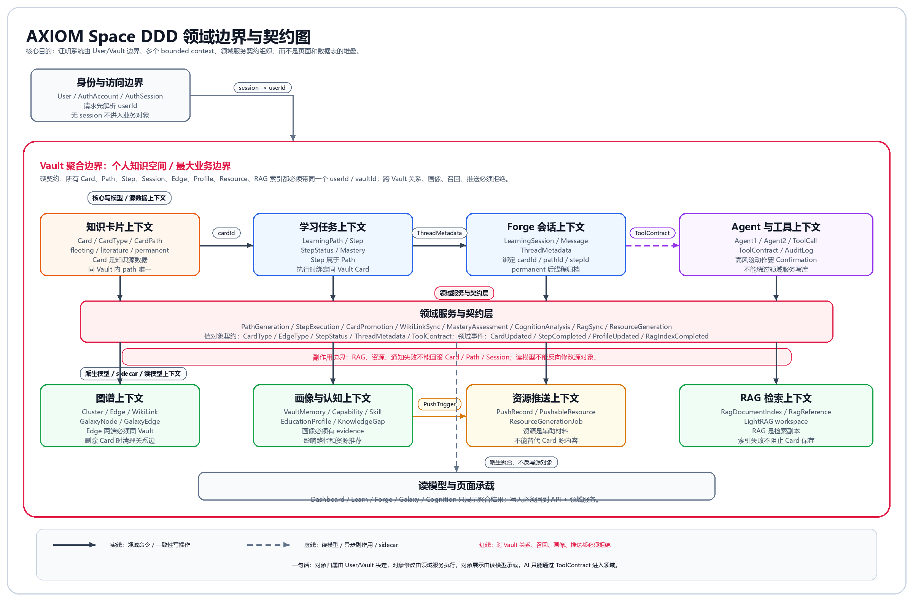

# 06 对象模型与契约

## 1. 对象范围

这里说的“对象”，不是代码里的每一个 class，也不是页面组件。

这里说的是 AXIOM 这个产品里真实存在的领域对象：

- 用户看得见、能操作的对象。
- 系统必须长期保存的对象。
- 对象之间有明确归属、状态、生命周期和边界的对象。
- 即使以后换成桌面端、移动端或插件，也仍然会存在的对象。

数据库是最重要的参考。当前 `prisma/schema.prisma` 已经说明了很多真实对象：

```text
user / account / session / verification
vault
card / cluster / edge / ragDocumentIndex
learningPath / learningPathStep
learningSession / learningMessage
vaultMemory / vaultCapability / vaultSkill
EducationProfileHistory / PathAdjustmentHistory / PushRecord
agentSession / agentAuditLog
```

在这些数据库对象之上，还存在一些产品层面的子对象和派生对象，例如：

- `fleeting / literature / permanent` 不是三张表，但它们是 Card 的三种领域子类型。
- Cluster 是卡片的星团分组对象。
- LearningPath 是任务路径对象。
- LearningPathStep 是路径里的单个任务对象。
- Session metadata 里保存的 `cardId / pathId / stepId / threadStatus` 是会话线程契约。
- Cognition 页面看到的画像、知识缺口、观察，是从多个底层对象聚合出来的派生对象。

所以本文档按“领域语义”来拆，不只照表名照抄。

## 2. 全量领域对象地图

### 2.1 身份与账户对象

| 对象 | 含义 | 当前实现 |
|---|---|---|
| User | 产品中的用户主体 | `user` |
| AuthAccount | 用户登录方式，如邮箱、第三方账号、密码凭据 | `account` |
| AuthSession | 登录态，用于判断当前请求属于谁 | `session` |
| VerificationToken | 邮箱验证、登录验证等短期凭据 | `verification` |

这些对象不直接承载学习内容，但它们决定所有学习数据属于谁。

### 2.2 知识库对象

| 对象 | 含义 | 当前实现 |
|---|---|---|
| Vault | 用户的个人知识库，也是所有学习数据的边界 | `vault` |
| VaultProfileCache | Vault 上的画像缓存，避免每次重新计算 Cognition | `vault.profileCache` |

Vault 是最重要的根对象。Card、Cluster、Edge、Path、Session、Memory、Skill、Profile、PushRecord 都必须落在 Vault 或 User 下面。

### 2.3 卡片系统对象

| 对象 | 含义 | 当前实现 |
|---|---|---|
| Card | 知识沉淀的基本单位 | `card` |
| FleetingCard | 灵感卡、临时理解、正在打磨的知识 | `card.type = fleeting` |
| LiteratureCard | 文献卡、资料卡、外部来源记录 | `card.type = literature` |
| PermanentCard | 永久卡，已经被用户整理过、可长期复用 | `card.type = permanent` |
| CardPath | 卡片在 Vault 中的路径，如 `permanent/概念.md` | `card.path` |
| CardContent | 卡片的 Markdown 内容 | `card.content` |
| CardTitle | 卡片标题 | `card.title` |
| CardTags | 卡片标签集合 | `card.tags` JSON |
| CardClusterMembership | 卡片属于哪个星团 | `card.clusterId` |
| CardLinks | 卡片的入链、出链、悬空链接 | `edge` + WikiLink 解析 |
| CardRagState | 卡片是否进入 RAG 索引 | `ragDocumentIndex` |

Card 不是只有“三类”这么简单。它至少有五个维度：

| 维度 | 可能值 | 说明 |
|---|---|---|
| 类型维度 | fleeting / literature / permanent | 卡片在学习沉淀中的阶段 |
| 星团维度 | 属于某个 Cluster / 未分组 | 卡片在知识空间中的领域分组 |
| 任务维度 | 绑定某个 Step / 未绑定路径 | 卡片是否属于某条学习路径任务 |
| 图谱维度 | 有关系边 / 孤立节点 / 有悬空 WikiLink | 卡片在知识网络中的连接情况 |
| RAG 维度 | pending / indexing / indexed / failed / disabled | 卡片是否能被 AI 稳定召回 |

这意味着同一张卡片可以同时是：

```text
一张 fleeting 卡
属于“操作系统”星团
绑定“进程调度学习路径”的第 2 步
通过 Edge 连接到“进程”和“线程”
RAG 状态是 indexed
```

这些不是多个对象互相替代，而是同一个 Card 在不同维度上的状态。

### 2.4 星团与图谱对象

| 对象 | 含义 | 当前实现 |
|---|---|---|
| Cluster | 星团，知识领域分组，如“数据结构”“操作系统” | `cluster` |
| Edge | 卡片之间的关系边 | `edge` |
| EdgeType | 关系类型 | `edge.type` |
| WikiLink | Markdown 中的 `[[概念名]]`，可同步为 Edge | `card.content` + `lib/wiki-links.ts` |
| GalaxyNode | Galaxy 中展示的卡片节点 | Card 派生 |
| GalaxyEdge | Galaxy 中展示的关系连线 | Edge 派生 |
| GalaxyCluster | Galaxy 中展示的星团 | Cluster 派生 |

Cluster 和 CardType 是两套完全不同的分类。

CardType 回答：

```text
这张卡在学习沉淀中处于什么阶段？
```

Cluster 回答：

```text
这张卡属于哪个知识领域？
```

所以一个 Cluster 里面可以同时有三类卡：

```text
Cluster: 操作系统
  -> permanent: 进程
  -> permanent: 线程
  -> fleeting: 时间片轮转的疑问
  -> literature: 操作系统课程笔记
```

Edge 回答的是另一件事：

```text
两张卡之间是什么关系？
```

当前已经出现或应被承认的关系类型包括：

| 类型 | 含义 |
|---|---|
| `related` | 一般相关 |
| `prerequisite` | 前置依赖 |
| `derived` | 推导、派生 |
| `counter` | 对比、反例 |
| `wikilink` | 由 Markdown WikiLink 自动同步出的链接 |
| `suggests` | 推荐学习关系，部分工具层已有语义 |
| `extends` / `extension` | 扩展关系，部分工具层已有语义 |
| `contrast` | 对比关系，部分工具层已有语义 |
| `application` | 应用关系，推荐工具中已有语义 |
| `analogy` | 类比关系，推荐工具中已有语义 |

数据库没有 enum 限制，所以文档里要把这些关系收敛成清楚的领域枚举。

### 2.5 学习任务对象

| 对象 | 含义 | 当前实现 |
|---|---|---|
| LearningPath | 学习路径，也可以理解为任务组 | `learningPath` |
| LearningPathStep | 路径中的一个学习任务 | `learningPathStep` |
| PathTopic | 路径主题 | `learningPath.topic` |
| PathDifficulty | 路径难度 | `learningPath.difficulty` |
| PathSource | 路径来源，如 AI、图谱、手动、导入资料 | `learningPath.source` |
| PathStatus | 路径状态 | `learningPath.status` |
| PathProgress | 路径进度 | `totalSteps / doneSteps` |
| StepOrder | 步骤顺序 | `learningPathStep.order` |
| StepConcept | 步骤对应概念 | `learningPathStep.concept` |
| StepChapter | 步骤所属章节或概念组 | `learningPathStep.chapter` |
| StepStatus | 步骤状态 | `learningPathStep.status` |
| StepMastery | 步骤掌握度 | `learningPathStep.mastery` |
| StepPrerequisites | 步骤前置依赖 | `learningPathStep.prerequisites` JSON |
| PathAdjustment | 路径调整建议或调整记录 | `PathAdjustmentHistory.adjustment` JSON |
| LearningStage | 路径调整引擎里的阶段对象 | `server/core/learning/path-adjustment-engine.ts` |

LearningPath 是“任务层”的对象，不是卡片的另一种分类。

一条路径可以绑定多张卡：

```text
LearningPath: 第一性原理入门
  Step 1: 什么是第一性原理 -> Card A
  Step 2: 第一性原理 vs 类比思维 -> Card B
  Step 3: 编程中的第一性原理 -> Card C
```

同一张 Card 也可以被多个路径复用。例如“递归”这张卡，既可能出现在“数据结构入门”路径，也可能出现在“算法复杂度”路径里。

### 2.6 Forge 与会话对象

| 对象 | 含义 | 当前实现 |
|---|---|---|
| LearningSession | Forge / Agent 学习会话 | `learningSession` |
| LearningMessage | 会话中的消息 | `learningMessage` |
| SessionKind | 会话类型，如普通聊天、卡片线程 | `learningSession.metadata.sessionKind` |
| ThreadMetadata | 线程绑定上下文 | `learningSession.metadata` JSON |
| ThreadStatus | 线程状态，如 active / archived | `learningSession.metadata.threadStatus` |
| MessageRole | 消息角色 | `learningMessage.role` |
| AgentSession | 旧 Agent 会话存储，替代 `.axiom/sessions` | `agentSession` |
| AgentAuditLog | Agent 审计日志 | `agentAuditLog` |

Forge 里的会话不是单纯聊天记录。它可能绑定：

```text
普通会话：
  sessionKind = conversation

卡片线程：
  sessionKind = card-thread
  cardId = 某张 Card

路径步骤线程：
  cardId = 某张 Card
  pathId = 某条 LearningPath
  stepId = 某个 LearningPathStep
```

所以 `LearningSession.metadata` 虽然现在只是 JSON 字符串，但它在领域上是一个很重要的对象，应该被显式建模。

### 2.7 记忆、能力、技能与画像对象

| 对象 | 含义 | 当前实现 |
|---|---|---|
| VaultMemory | Vault 级长期记忆 | `vaultMemory` |
| MemoryCategory | 记忆分类：preference / style / context / fact | `vaultMemory.category` |
| VaultCapability | 用户对某个概念的能力状态 | `vaultCapability` |
| CapabilityStatus | known / learning / mastered | `vaultCapability.status` |
| VaultSkill | 用户表现出来的技能 | `vaultSkill` |
| SkillEvidence | 技能证据 | `vaultSkill.evidence` |
| EducationProfile | 六维学习画像 | `EducationProfileHistory.profile` JSON |
| DimensionScore | 某一画像维度的分数、置信度和证据 | `server/core/learning/education-profile.ts` |
| EducationProfileHistory | 画像历史快照 | `EducationProfileHistory` |
| CognitionData | Cognition 页面聚合出来的学习反馈 | API 派生 |
| KnowledgeGap | 知识缺口 | Cognition 派生 |
| Observation | 系统观察 | Cognition 派生 |

这些对象回答：

```text
系统通过用户的学习行为，已经认识了用户什么？
```

它们不能替代 Card 和 Path，但会影响后续路径生成、资源推荐和学习反馈。

### 2.8 资源与推送对象

| 对象 | 含义 | 当前实现 |
|---|---|---|
| PushRecord | 一次资源推送记录 | `PushRecord` |
| PushableResource | 可推送资源 | `PushRecord.resources` JSON |
| ResourceType | 资源类型，如 document / mindmap / quiz / code / video / ppt | `ResourceGenerationState.ts` |
| ResourceGenerationEntry | 某类资源的生成状态 | `ResourceGenerationState.ts` |
| ResourceProgress | 资源生成进度 | Agent SSE / 前端展示 |
| GeneratedResourceItem | Forge 中展示的生成资源项 | `components/resources/resource-cards.tsx` |
| ResourceManifestItem | literature 卡片关联的资源清单项 | `vault.ts` / `forge-editor.tsx` |

资源不是 Card 的替代物。

更准确的关系是：

```text
Card 是知识对象。
Resource 是围绕某个学习目标或卡片生成的辅助材料。
PushRecord 是系统把资源推荐给用户的一次记录。
```

资源最终可以保存成 literature 卡，也可以作为某张卡的补充材料。

### 2.9 RAG 与检索对象

| 对象 | 含义 | 当前实现 |
|---|---|---|
| RagDocumentIndex | Card 在 RAG 系统里的索引状态 | `ragDocumentIndex` |
| RagWorkspace | 某个 Vault 对应的 LightRAG 工作区 | `workspace` |
| RagDocumentId | Card 在 RAG 中的文档 ID | `documentId` |
| RagContentHash | 当前索引内容的 hash | `contentHash` |
| RagTrackId | 后台索引任务 ID | `trackId` |
| RagReference | AI 回复时引用的卡片或文献 | Agent / RAG 返回 |
| RagQueryContext | RAG 查询结果上下文 | `server/core/rag/lightrag-service.ts` |

RAG 是 sidecar，不是源数据。

源数据仍然是 Card。

```text
Card 保存成功 != RAG 索引成功
```

这两个状态要分开理解。

### 2.10 前端承载对象

这些不是数据库对象，但它们是产品交互里的对象。

| 对象 | 含义 | 当前实现 |
|---|---|---|
| AppMode | 当前模式：dashboard / forge / galaxy / cognition / learn | `stores/mode-store.ts` |
| SelectedNode | 当前选中的卡片节点 | `stores/mode-store.ts` |
| SelectedPath | 当前选中的学习路径 | `selectedPathId` |
| ActiveLearningStep | 当前正在学习的步骤 | `activeLearningStepId` |
| PanelLayout | Forge 面板布局 | `panelLayout` |
| GraphLayoutMode | Galaxy 布局模式 | `graphLayoutMode` |
| SessionSummary | Forge 侧边栏会话摘要 | `stores/agent-store.ts` |
| AppNotification | 前端通知 | `hooks/use-notifications.ts` |
| DashboardStats | Dashboard 聚合统计 | `types/dashboard.ts` |
| RecentActivity | 最近活动 | `types/dashboard.ts` |
| GrowthPoint | 成长曲线上的一个点 | `types/dashboard.ts` |

它们负责“用户当前看到什么、选中了什么”，但不能替代后端对象关系。

### 2.11 DDD 视角下还要承认的对象

如果按 DDD 来看，前面列出的很多对象属于实体；但领域模型不只有实体，还应该包含值对象、聚合、领域服务、领域事件和过程对象。

这些对象不一定都有单独的数据表，但它们在业务上真实存在。

#### 2.11.1 值对象

值对象没有独立生命周期，通常依附在实体上。

| 值对象 | 依附对象 | 含义 |
|---|---|---|
| CardType | Card | fleeting / literature / permanent |
| CardPath | Card | 卡片在 Vault 内的唯一路径 |
| MarkdownContent | Card | 卡片正文内容 |
| CardTitle | Card | 卡片标题 |
| CardTags | Card | 标签集合 |
| ClusterColor | Cluster | 星团颜色 |
| ClusterPosition | Cluster | 星团排序 |
| EdgeType | Edge | related / prerequisite / derived 等关系类型 |
| EdgeWeight | Edge | 关系强度 |
| LearningPathStatus | LearningPath | active / completed / archived |
| LearningPathSource | LearningPath | ai / graph / manual / import-document |
| Difficulty | LearningPath / Resource | beginner / intermediate / advanced |
| StepStatus | LearningPathStep | locked / available / learning / completed / mastered |
| MasteryScore | LearningPathStep / Capability | 掌握度分数 |
| EstimatedMinutes | LearningPathStep / Resource | 预计耗时 |
| PrerequisiteSet | LearningPathStep | 前置依赖集合 |
| SessionKind | LearningSession | conversation / card-thread / path-step-thread |
| ThreadStatus | LearningSession | active / archived |
| MessageRole | LearningMessage | system / user / assistant / tool_result |
| DimensionScore | EducationProfile | score + confidence + evidence |
| CapabilityStatus | VaultCapability | known / learning / mastered |
| MemoryCategory | VaultMemory | preference / style / context / fact |
| PushTrigger | PushRecord | stage_completion / assessment_pass / low_dimension / scheduled |
| ResourceType | PushableResource | document / mindmap / quiz / code / video / ppt |
| RagSyncStatus | RagDocumentIndex | pending / indexing / indexed / failed / disabled |
| ContentHash | RagDocumentIndex | RAG 内容 hash |

这些值对象现在很多还是字符串或 JSON。后续应该收敛成共享类型。

#### 2.11.2 聚合与聚合根

聚合回答的是“哪些对象应该被一起维护一致性”。

| 聚合根 | 聚合内对象 | 需要保护的规则 |
|---|---|---|
| User | AuthAccount、AuthSession、Vault 引用 | 用户只能访问自己的数据 |
| Vault | Card、Cluster、Edge、Path、Session、Memory、Capability、Skill 的归属边界 | 不能跨 Vault 读写、关联、检索 |
| Card | CardType、CardPath、Content、Tags、RagDocumentIndex 引用 | 同 Vault 内路径唯一；升级 permanent 后线程归档 |
| KnowledgeGraph | Card 节点、Edge、Cluster | Edge 两端必须属于同一 Vault；删除 Card 清理 Edge |
| LearningPath | LearningPathStep、PathAdjustmentHistory | Step 必须属于 Path；Path 进度来自 Step |
| LearningSession | ThreadMetadata、LearningMessage | Message 必须属于 Session；归档线程不能继续写入 |
| CognitionProfile | VaultMemory、VaultCapability、VaultSkill、EducationProfileHistory | 画像必须来自证据，不能凭空生成 |
| ResourcePush | PushRecord、PushableResource、用户反馈 | 推送必须有触发原因、过期时间和反馈记录 |
| RagIndex | RagDocumentIndex、RagReference | RAG 是 Card 的检索副本，不是源数据 |

严格来说，Vault 不应该在代码里一次性加载和修改所有子对象；但从领域边界上看，它是最大的数据边界。

#### 2.11.3 领域服务

有些业务动作不属于单个实体，而是跨多个对象协作，这类应该叫领域服务。

| 领域服务 | 操作对象 | 职责 |
|---|---|---|
| PathGenerationService | LearningPath、Step、Card、Edge | 根据主题或资料生成学习路径 |
| DocumentImportService | LiteratureCard、FleetingCard、PermanentCard、Edge、Path | 把外部资料拆成卡片和路径 |
| StepExecutionService | Step、Card、Session | 点击步骤后创建卡片和会话上下文 |
| CardPromotionService | Card、Session、Edge、RAG、Cognition | 将 fleeting 升级为 permanent，并归档线程 |
| WikiLinkSyncService | Card、Edge | 根据 `[[WikiLink]]` 同步关系边 |
| MasteryAssessmentService | Step、Card、Session、Capability | 判断用户是否真正掌握 |
| CognitionAnalysisService | Card、Edge、Session、Profile | 生成 Cognition 画像和知识缺口 |
| ResourceGenerationService | Card、Path、Resource、PushRecord | 生成讲解文档、题目、导图等资源 |
| RagSyncService | Card、RagDocumentIndex | 同步卡片到 RAG |
| VaultExportService | Vault、Card | 导出用户自己的 Markdown 内容 |

这些服务现在分散在 API route、Agent tools 和 core service 中。后续系统设计可以把它们作为更清晰的领域服务抽出来。

#### 2.11.4 领域事件

领域事件表示“系统里发生了一件有业务意义的事”。

| 领域事件 | 发生时机 | 可能影响 |
|---|---|---|
| VaultCreated | 创建知识库 | 初始化默认空间 |
| CardCreated | 创建卡片 | 刷新 Galaxy / Dashboard |
| CardUpdated | 保存卡片 | 同步 WikiLink / RAG |
| CardPromotedToPermanent | 卡片升级永久卡 | 归档线程、更新 Cognition |
| CardDeleted | 删除卡片 | 清理 Edge / RAG / Session / UI 选中 |
| ClusterCreated | 创建星团 | 刷新 Galaxy |
| CardAssignedToCluster | 卡片归入星团 | 更新 Galaxy 分组 |
| EdgeCreated | 建立卡片关系 | 更新图谱和知识缺口 |
| DocumentImported | 导入资料完成 | 新增 literature / fleeting / permanent 卡 |
| LearningPathCreated | 路径创建 | Learn 展示新任务 |
| StepStarted | 步骤开始 | 创建或打开 Forge 线程 |
| StepCompleted | 步骤完成 | 更新 Path 进度和画像 |
| PathArchived | 路径归档 | 从默认任务列表移除 |
| SessionMessageAdded | 新增对话消息 | 更新会话历史和画像输入 |
| SessionArchived | 会话归档 | 阻止继续写入 |
| RagIndexRequested | 请求索引 | 创建或更新 RAG 状态 |
| RagIndexCompleted | 索引完成 | AI 可召回该卡 |
| RagIndexFailed | 索引失败 | 生成知识缺口或提示 |
| ProfileUpdated | 画像更新 | 影响路径推荐和资源推送 |
| ResourcePushed | 资源推送 | 用户收到推荐 |

当前代码主要通过 React Query invalidate、SSE、数据库更新来间接处理这些事件。文档层面应该把它们命名出来。

#### 2.11.5 过程对象

过程对象不是最终内容，但它描述一次业务过程。

| 过程对象 | 含义 |
|---|---|
| DocumentImportJob | 一次资料导入过程 |
| DocumentChunk | 资料被切分后的片段 |
| ExtractedConcept | 从资料中抽出的核心概念，通常变成 permanent |
| ExtractedFleeting | 从资料中抽出的细节、疑问、例子，通常变成 fleeting |
| ImportResult | 导入结果统计，如 permanent / fleeting / literature / edges 数量 |
| AssessmentResult | 一次评估结果 |
| AssessmentQuestion | 评估中的题目 |
| FeynmanAssessment | 费曼式掌握评估 |
| ResourceGenerationJob | 一次资源生成过程 |
| RagIndexJob | 一次 RAG 索引任务 |
| OperationConfirmation | 高风险操作前的确认 |

这些对象很多现在没有表，而是藏在 JSON、工具返回值或前端状态里。它们仍然是领域设计中应该承认的对象。

#### 2.11.6 Agent 与工具对象

AXIOM 的 AI 不是一个纯文本输入框，因此 Agent 相关对象也应该进入领域模型，但要和用户知识对象分开。

| 对象 | 含义 |
|---|---|
| OracleAgent | 主对话与协调者 |
| ProfileAgent | 画像分析 Agent |
| ForgeAgent | 卡片打磨和资源生成 Agent |
| GuideAgent | 路径规划 Agent |
| AssessAgent | 评估 Agent |
| AgentRole | Agent 的角色值对象 |
| ToolDefinition | 工具定义 |
| ToolContract | 工具风险、能力和边界 |
| ToolCall | 一次工具调用 |
| ToolResult | 工具返回结果 |
| ToolRisk | read / write / destructive / network / llm 等风险等级 |
| AgentAuditLog | 工具、模型、拦截、错误的审计记录 |

这些对象不是 Card、Path 的替代物。它们属于“AI 执行层”，服务于学习领域对象。

#### 2.11.7 学习引导对象

还有一组对象不是数据库主表，但它们描述“怎么教用户”。

| 对象 | 含义 |
|---|---|
| LearningPhase | check / motivation / assessment / generate / learn / verify |
| TeachingMethod | analogy / example / contrast / formal / visual / socratic 等 |
| LearningStrategy | 某阶段采用什么教学方法 |
| UserResponse | 用户是否理解、尝试次数、困惑点、aha moment |
| LearningPattern | 对用户有效的学习模式 |
| ExplanationPattern | 哪些解释方式有效 |
| ExamplePattern | 用户偏好的例子类型 |
| RemedialPattern | 补救学习策略 |

这些对象是 AXIOM 从“聊天工具”变成“学习系统”的关键。当前代码里已经有类型定义，但还没有完全产品化。

## 3. 数据库模型到领域对象映射

| Prisma model | 领域对象 | 说明 |
|---|---|---|
| `user` | User | 产品用户 |
| `account` | AuthAccount | 登录方式和凭据 |
| `session` | AuthSession | 登录态 |
| `verification` | VerificationToken | 验证凭据 |
| `vault` | Vault | 知识库 / 数据边界 |
| `card` | Card / FleetingCard / LiteratureCard / PermanentCard | 卡片及三种子类型 |
| `cluster` | Cluster | 星团分组 |
| `edge` | Edge / WikiLinkEdge / PrerequisiteEdge | 卡片关系 |
| `ragDocumentIndex` | RagDocumentIndex | RAG 索引状态 |
| `learningPath` | LearningPath | 学习路径 / 任务组 |
| `learningPathStep` | LearningPathStep | 学习步骤 / 单个任务 |
| `learningSession` | LearningSession / CardThread / PathStepThread | Forge 学习会话 |
| `learningMessage` | LearningMessage | 会话消息 |
| `vaultMemory` | VaultMemory | 长期记忆 |
| `vaultCapability` | VaultCapability | 概念能力状态 |
| `vaultSkill` | VaultSkill | 用户技能 |
| `EducationProfileHistory` | EducationProfileSnapshot | 教育画像历史 |
| `PathAdjustmentHistory` | PathAdjustmentRecord | 路径调整历史 |
| `PushRecord` | PushRecord | 资源推送记录 |
| `agentSession` | AgentRuntimeSession | 旧 Agent 会话持久化 |
| `agentAuditLog` | AgentAuditLog | Agent 审计事件 |

## 4. 核心关系图



这张图表达的是 DDD 视角下的组织架构：`User / Vault` 先确定数据归属边界，`Card`、`LearningPath`、`LearningSession`、`Graph`、`Cognition`、`Resource`、`RAG`、`Agent` 分别是不同的 bounded context。它们之间不能随意互相改数据，必须通过领域服务、值对象契约、领域事件和工具契约发生协作。

```text
User
  -> AuthAccount
  -> AuthSession
  -> Vault
    -> Card
      -> CardType: fleeting / literature / permanent
      -> CardPath
      -> CardTags
      -> ClusterMembership
      -> Edge(source / target)
      -> RagDocumentIndex
    -> Cluster
      -> Card[]
    -> LearningPath
      -> LearningPathStep
        -> Card?
      -> PathAdjustmentHistory
    -> LearningSession
      -> ThreadMetadata(cardId/pathId/stepId/threadStatus)
      -> LearningMessage[]
    -> VaultMemory
    -> VaultCapability
    -> VaultSkill
    -> EducationProfileHistory
    -> PushRecord
    -> AgentSession
```

再换成产品语言：

- User 拥有一个或多个 Vault。
- Vault 是知识空间。
- Card 是知识空间里的基本内容。
- Card 分为 fleeting、literature、permanent 三类。
- Cluster 是 Card 的星团分组。
- Edge 是 Card 之间的关系。
- LearningPath 是学习任务组。
- LearningPathStep 是任务组里的一个任务。
- Step 可以绑定 Card。
- LearningSession 是 Forge 对话线程。
- Session 可以绑定 Card、Path、Step。
- Message 是 Session 里的对话消息。
- VaultMemory、Capability、Skill、Profile 是系统对用户学习状态的认识。
- PushRecord 是系统给用户推荐资源的记录。
- RagDocumentIndex 是 Card 进入 RAG 的索引状态。

## 5. 卡片对象的完整拆解

### 5.1 Card 是基础对象

Card 的基础字段：

| 字段 | 领域含义 |
|---|---|
| `id` | 卡片唯一 ID |
| `vaultId` | 属于哪个知识库 |
| `clusterId` | 属于哪个星团，可为空 |
| `path` | 在 Vault 中的路径 |
| `content` | Markdown 内容 |
| `type` | 卡片类型 |
| `title` | 标题 |
| `tags` | 标签 |
| `createdAt` | 创建时间 |
| `updatedAt` | 更新时间 |

Card 的基本契约：

- 必须属于一个 Vault。
- 同一个 Vault 内 `path` 唯一。
- 可以没有 Cluster。
- 可以没有 PathStep 绑定。
- 可以有多条入边和出边。
- 可以有 RAG 索引状态。

### 5.2 三类卡片

| 类型 | 中文 | 核心含义 | 常见来源 | 常见下一步 |
|---|---|---|---|---|
| `fleeting` | 灵感卡 | 临时想法、疑问、学习中的不稳定理解 | 主题生成、Step 执行、用户随手写、从 literature 抽取 | 进入 Forge 打磨，补定义/例子/关联/应用 |
| `literature` | 文献卡 | 外部资料、文章、课程、网页、视频、插件采集内容 | 导入资料、后续浏览器插件、资源生成 | 拆成 fleeting / permanent，作为引用来源 |
| `permanent` | 永久卡 | 用户已经整理过、可长期复用的知识 | Forge 升级、资料导入出的核心概念 | 参与 Cognition 统计、RAG 召回、路径规划 |

三类卡片不是三个互斥空间，而是一条学习沉淀链路：

```text
literature 提供资料
  -> fleeting 承载临时理解
  -> permanent 形成稳定知识
```

但它们也可以独立存在。例如：

- 用户可以直接创建 fleeting。
- 导入资料时可以直接产生 permanent。
- literature 不一定立刻拆解完成。

### 5.3 星团分组

Cluster 是卡片的领域分组。

它不是卡片类型，也不是学习路径。

```text
Cluster: 数据结构
  -> permanent: 栈
  -> permanent: 队列
  -> fleeting: 为什么递归能用栈理解
  -> literature: 数据结构课程笔记
```

Cluster 的契约：

- Cluster 必须属于 Vault。
- 一个 Card 最多直接属于一个 Cluster。
- 删除 Cluster 不删除 Card，只让 Card 失去分组。
- Cluster 可以包含不同类型的 Card。
- Cluster 可以用于 Galaxy 展示、统计和 Cognition 分析。

### 5.4 卡片与路径的关系

Card 和 LearningPath 不是同一种对象。

Path 是学习任务组织方式。

Card 是知识沉淀内容。

它们通过 Step 关联：

```text
LearningPath
  -> LearningPathStep
    -> cardId
      -> Card
```

一个 Step 可以绑定一张 Card。

同一张 Card 可以被多个 Step 或多个 Path 复用。

例如：

```text
Card: 递归

Path: 数据结构入门
  Step: 理解递归调用栈 -> Card: 递归

Path: 算法复杂度
  Step: 分析递归算法复杂度 -> Card: 递归
```

### 5.5 卡片与会话的关系

Forge 的理想会话是围绕 Card 展开的。

Session 通过 metadata 绑定 Card：

```text
LearningSession.metadata:
  sessionKind: card-thread
  cardId: xxx
  cardTitle: 第一性原理
  cardType: fleeting
  threadStatus: active
```

如果这张 Card 来自某个学习任务，还会绑定：

```text
pathId: xxx
stepId: xxx
```

当 Card 升级为 permanent 后：

```text
Card.type = permanent
LearningSession.metadata.threadStatus = archived
LearningSession.status = completed
```

也就是说，永久卡的旧打磨线程会归档。

### 5.6 卡片与图谱的关系

Card 在 Galaxy 里表现为 Node。

Card 之间通过 Edge 连接。

Edge 可以来自：

- 用户或 AI 显式创建关系。
- 导入资料时抽取关系。
- 学习路径生成时建立前置关系。
- Markdown 中的 `[[WikiLink]]` 自动同步。

### 5.7 卡片与 RAG 的关系

Card 是源数据。

RAG 是检索副本。

```text
Card.content
  -> formatCardForRag
  -> LightRAG workspace
  -> RagDocumentIndex
```

Card 可以保存成功，但 RAG 索引失败。

所以卡片对象和 RAG 对象必须分开看。

## 6. 学习路径对象的完整拆解

### 6.1 LearningPath 是任务组

LearningPath 字段：

| 字段 | 领域含义 |
|---|---|
| `id` | 路径 ID |
| `userId` | 所属用户 |
| `vaultId` | 所属 Vault |
| `name` | 路径名称 |
| `topic` | 学习主题 |
| `description` | 路径说明 |
| `difficulty` | 难度 |
| `totalSteps` | 总步骤数 |
| `doneSteps` | 已完成步骤数 |
| `status` | 状态 |
| `source` | 来源 |

Path 的状态：

| 状态 | 含义 |
|---|---|
| `active` | 当前可继续学习 |
| `completed` | 已完成 |
| `archived` | 已归档 |

Path 的来源：

| 来源 | 含义 |
|---|---|
| `ai` | AI 根据主题生成 |
| `graph` | 从已有知识图谱推导 |
| `manual` | 用户手动创建 |
| `import-document` | 从资料导入生成，建议后续显式化 |
| `unassigned` | 未归入正式路径的任务视图，当前前端有派生概念 |

### 6.2 LearningPathStep 是任务

Step 字段：

| 字段 | 领域含义 |
|---|---|
| `id` | 步骤 ID |
| `pathId` | 所属 Path |
| `cardId` | 绑定 Card |
| `order` | 顺序 |
| `title` | 任务标题 |
| `description` | 任务说明 |
| `concept` | 对应概念 |
| `chapter` | 所属章节或组 |
| `status` | 任务状态 |
| `mastery` | 掌握度 |
| `estimatedMinutes` | 预计时间 |
| `prerequisites` | 前置依赖 |

Step 状态：

| 状态 | 含义 |
|---|---|
| `locked` | 前置未满足，暂时不可学 |
| `available` | 可以开始 |
| `learning` | 正在学习 |
| `completed` | 已完成 |
| `mastered` | 已掌握 |

Step 的关键契约：

- Step 必须属于 Path。
- Step 可以没有 Card，但执行时必须创建或绑定 Card。
- Step 的 Card 必须属于同一个 Vault。
- Step 完成后要推动 Path 进度变化。
- Step 的 mastery 不能只等于内容长度，应该逐步接入评估信号。

### 6.3 PathAdjustment 是路径变化记录

PathAdjustmentHistory 记录路径为什么被调整。

它不是路径本身，而是路径演化的历史。

典型触发：

- 会话结束。
- 评估结果。
- 用户手动反馈。

典型变化：

- 增加复习步骤。
- 跳过已掌握内容。
- 调整难度。
- 增加练习。
- 推荐休息或放缓节奏。

## 7. Forge 会话对象的完整拆解

### 7.1 LearningSession

LearningSession 是对话线程。

它可能有三种语义：

| 类型 | 含义 |
|---|---|
| conversation | 普通对话 |
| card-thread | 围绕一张 Card 的打磨线程 |
| path-step-thread | 围绕某条 Path 的某个 Step 的学习线程 |

当前这些类型主要藏在 metadata 里，应该被显式建模。

建议的 ThreadMetadata：

```typescript
type SessionKind = 'conversation' | 'card-thread' | 'path-step-thread'
type ThreadStatus = 'active' | 'archived'

interface ThreadMetadata {
  sessionKind?: SessionKind
  cardId?: string
  cardTitle?: string
  cardType?: 'fleeting' | 'literature' | 'permanent'
  threadStatus?: ThreadStatus
  pathId?: string
  pathTitle?: string
  stepId?: string
  stepTitle?: string
  archivedAt?: string
}
```

### 7.2 LearningMessage

LearningMessage 是 Session 下的消息。

角色包括：

| role | 含义 |
|---|---|
| `system` | 系统消息 |
| `user` | 用户消息 |
| `assistant` | AI 回复 |
| `tool_result` | 工具结果 |

Message 的 metadata 可以继续承载：

- 工具调用信息。
- RAG 引用。
- 资源生成进度。
- 压缩信息。
- 评估结果。

### 7.3 AgentAuditLog

AgentAuditLog 是 Agent 的运行审计对象。

它记录：

- 工具调用。
- 安全拦截。
- 重试。
- LLM 调用。
- 关键错误。

它不直接出现在用户主界面，但对调试、风控、复盘很重要。

## 8. 画像、记忆、能力对象

### 8.1 VaultMemory

VaultMemory 是系统记住的用户偏好、风格、上下文和事实。

分类：

| category | 含义 |
|---|---|
| `preference` | 用户偏好 |
| `style` | 学习或表达风格 |
| `context` | 当前长期上下文 |
| `fact` | 已确认事实 |

### 8.2 VaultCapability

VaultCapability 是用户对某个概念的掌握状态。

字段语义：

| 字段 | 含义 |
|---|---|
| `concept` | 概念名 |
| `masteryLevel` | 掌握度 |
| `status` | known / learning / mastered |
| `weakAreas` | 薄弱点 |
| `strongAreas` | 强项 |
| `accessCount` | 访问次数 |

### 8.3 VaultSkill

VaultSkill 表示用户表现出的技能。

它和 Card 不同：

- Card 是知识内容。
- Skill 是用户能力。

例如：

```text
Card: 递归
Skill: 能用递归解决树遍历问题
```

### 8.4 EducationProfile

EducationProfile 是六维学习画像。

维度包括：

| 维度 | 含义 |
|---|---|
| depth | 理解深度 |
| breadth | 覆盖广度 |
| connection | 知识连接能力 |
| expression | 表达能力 |
| application | 应用能力 |
| learning_pace | 学习节奏 |

每个维度不是一个裸分数，而是：

```text
score + confidence + evidence
```

所以画像必须有证据，不应该凭空判断。

### 8.5 CognitionData

CognitionData 是前端看到的认知反馈聚合对象。

它来自：

- Card 数量和类型分布。
- Edge 和 Cluster 结构。
- LearningSession 和 Message。
- RagDocumentIndex 状态。
- VaultCapability / EducationProfile 等画像对象。

CognitionData 不应该单独成为源数据。它是派生结果。

## 9. 资源与推送对象

### 9.1 PushRecord

PushRecord 表示一次资源推送。

字段语义：

| 字段 | 含义 |
|---|---|
| `userId` | 推给谁 |
| `vaultId` | 基于哪个 Vault |
| `resources` | 推送了哪些资源 |
| `trigger` | 为什么推送 |
| `reason` | 推送理由 |
| `sentAt` | 推送时间 |
| `expiresAt` | 过期时间 |
| `viewedAt` | 用户是否看过 |
| `engagedCount` | 用户互动次数 |
| `feedback` | 用户反馈 |

trigger 语义：

| trigger | 含义 |
|---|---|
| `stage_completion` | 阶段完成后推送 |
| `assessment_pass` | 评估通过后推送 |
| `low_dimension` | 某个画像维度偏低 |
| `scheduled` | 定时推送 |

### 9.2 PushableResource

PushableResource 是可以被推给用户的资源。

典型字段：

- `resourceId`
- `type`
- `title`
- `topic`
- `difficulty`
- `estimatedMinutes`
- `concepts`
- `tags`

### 9.3 ResourceType

当前资源类型已经不止一种：

| 类型 | 含义 |
|---|---|
| `document` | 讲解文档 |
| `mindmap` | 思维导图 |
| `quiz` | 练习题 |
| `code` | 代码案例 |
| `video` | 视频或动画脚本 |
| `svg` | 图解 |
| `diagram` | Mermaid 或结构图 |
| `docx` | Word 文档 |
| `pdf` | PDF |
| `ppt` | 演示文稿 |

这些资源可以服务 Path、Step、Card 或用户画像中的缺口。

## 10. RAG 对象

### 10.1 RagDocumentIndex

RagDocumentIndex 是 Card 的检索索引记录。

状态：

| 状态 | 含义 |
|---|---|
| `pending` | 等待索引 |
| `indexing` | 正在索引 |
| `indexed` | 已索引 |
| `failed` | 索引失败 |
| `disabled` | RAG 未启用或该卡不参与 |

契约：

- 它依附于 Card。
- 它不能替代 Card。
- 它失败时不能阻止 Card 保存。
- 它成功时说明 AI 可以更稳定地召回该卡。

### 10.2 RagReference

RagReference 是 AI 回复中的引用对象。

它应该能指回：

- 哪个 Vault。
- 哪张 Card。
- 哪个 title。
- 哪种 card type。
- 哪个文件路径。

这样用户才能知道 AI 的回答依据来自哪里。

## 11. 页面承载对象

| 页面 | 承载对象 |
|---|---|
| Dashboard | Vault、DashboardStats、RecentActivity、GrowthPoint |
| Learn | LearningPath、LearningPathStep、PathAdjustment、PushRecord |
| Forge | Card、LearningSession、LearningMessage、RagReference、ResourceProgress |
| Galaxy | Card、Cluster、Edge、GalaxyNode、GalaxyEdge、GalaxyCluster |
| Cognition | CognitionData、KnowledgeGap、Observation、EducationProfile、VaultCapability |

页面只负责承载对象，不负责定义对象。

真正的对象边界仍然在：

- Vault。
- Card。
- Path。
- Step。
- Session。
- Cluster。
- Edge。
- Profile。

## 12. 当前最需要收紧的契约

### 12.1 CardType

现在 `card.type` 是字符串。

应该收敛为：

```typescript
type CardType = 'fleeting' | 'literature' | 'permanent'
```

### 12.2 EdgeType

现在 Edge 类型在不同工具里有些分散。

建议收敛为：

```typescript
type EdgeType =
  | 'related'
  | 'prerequisite'
  | 'derived'
  | 'counter'
  | 'wikilink'
  | 'suggests'
  | 'extends'
  | 'contrast'
  | 'application'
  | 'analogy'
```

### 12.3 PathStatus 与 StepStatus

```typescript
type LearningPathStatus = 'active' | 'completed' | 'archived'

type LearningStepStatus =
  | 'locked'
  | 'available'
  | 'learning'
  | 'completed'
  | 'mastered'
```

### 12.4 ThreadMetadata

这是当前最应该从 JSON 字符串中抽出来的对象。

```typescript
type SessionKind = 'conversation' | 'card-thread' | 'path-step-thread'
type ThreadStatus = 'active' | 'archived'

interface ThreadMetadata {
  sessionKind?: SessionKind
  cardId?: string
  cardTitle?: string
  cardType?: CardType
  threadStatus?: ThreadStatus
  pathId?: string
  pathTitle?: string
  stepId?: string
  stepTitle?: string
  archivedAt?: string
}
```

### 12.5 Profile 与 Capability

画像和能力对象也需要显式契约：

```typescript
interface DimensionScore {
  score: number
  confidence: number
  evidence: string[]
}

type CapabilityStatus = 'known' | 'learning' | 'mastered'
```

## 13. 补充对象的边界与契约

前面已经把主干对象说清楚了：Vault、Card、Cluster、Edge、Path、Step、Session、Profile、Resource、RAG。

但如果要把 AXIOM 真的按 DDD 落实，下面这些对象也要承认。它们不一定都要建表，有些是值对象，有些是过程对象，有些是读模型，有些是领域服务的输入输出。关键不是“有没有表”，而是它们有没有清楚的业务边界。

### 13.1 总边界原则

| 原则 | 说明 |
|---|---|
| Vault 是最大业务边界 | 任何知识、路径、会话、画像、资源、索引都不能跨 Vault 混用 |
| Card 是知识源数据 | 资料、评估、RAG、推荐、画像都可以引用 Card，但不能替代 Card |
| Session 是交互过程 | Session 记录学习和打磨过程，不应该成为永久知识本身 |
| Profile 是证据结果 | 画像、能力、技能必须来自证据，不能凭空生成 |
| RAG 是检索副本 | RAG 失败不能阻止 Card 保存，RAG 成功也不能反向篡改 Card |
| ReadModel 只负责展示 | Dashboard、Galaxy、Cognition 的聚合数据不能成为新的源数据 |
| Agent 只通过工具改对象 | Agent 不能绕过契约直接写数据库或随意跨对象修改 |

一个对象只要进入领域模型，就至少要回答四个问题：

```text
它归属于谁？
它负责什么？
它通过什么契约和别人交互？
它绝对不能直接做什么？
```

### 13.2 评估与测验对象

评估对象属于学习验证边界。它回答的是：

```text
用户是真的掌握了，还是只是看过、聊过、写过？
```

| 对象 | 边界 | 职责 | 契约 |
|---|---|---|---|
| Assessment | Vault / Step / Card | 一次评估的定义 | 必须有评估目标、评估类型、关联对象 |
| AssessmentAttempt | Session / User | 用户的一次作答尝试 | 必须记录 answer、startedAt、finishedAt |
| AssessmentQuestion | Assessment | 题目 | 必须有题干、类型、评分规则 |
| AssessmentResult | Attempt | 评估结果 | 必须输出 score、pass、feedback、evidence |
| Rubric | Assessment | 评分标准 | 必须说明什么算通过、什么算缺陷 |
| CriticalGap | Result | 暴露出的关键薄弱点 | 必须能指向 concept、Card 或 Step |
| QualityCheckRecord | Card / Session | 内容质量检查记录 | 必须说明检查项、结论和建议 |

评估对象不能越界：

- 不能直接把 Step 改成 mastered，必须通过 MasteryAssessmentService。
- 不能直接修改 Card 内容，只能给出 feedback 或 suggestion。
- 不能凭一次低分永久降低用户画像，只能作为证据进入 Profile 分析。
- 不能只存一个分数，必须保留可解释的证据。

建议契约：

```typescript
type AssessmentType = 'quiz' | 'feynman' | 'code' | 'debate' | 'quality-check'

interface AssessmentResult {
  assessmentId: string
  attemptId: string
  score: number
  passed: boolean
  feedback: string
  criticalGaps: CriticalGap[]
  evidence: string[]
}
```

### 13.3 文档导入对象

文档导入对象属于资料转知识边界。它回答的是：

```text
一份外部资料如何进入个人知识库，并被拆成可学习、可连接、可复用的对象？
```

| 对象 | 边界 | 职责 | 契约 |
|---|---|---|---|
| ImportedDocument | Vault | 一次被导入的完整资料 | 必须有来源、标题、内容 hash |
| SourceDocument | 外部来源 | 原始网页、PDF、视频稿、笔记 | 必须保留 sourceUrl 或 sourceName |
| DocumentChunk | ImportJob | 切分后的片段 | 必须能回溯到原文位置 |
| ExtractedConcept | ImportJob | 抽出的核心概念 | 可以转成 permanent 或 Step concept |
| ExtractedFleeting | ImportJob | 抽出的疑问、例子、临时理解 | 可以转成 fleeting |
| ExtractedRelation | ImportJob | 概念之间的关系 | 可以转成 Edge |
| ImportBatch | Vault | 一批导入任务 | 必须记录成功、失败、跳过 |
| ImportStats | ImportResult | 导入统计 | 输出生成了多少卡片、边、路径 |
| SourceCitation | Card / Resource | 引用来源 | 必须能回到原始资料 |

文档导入不能越界：

- 不能把外部资料直接等同于 permanent 知识。
- 不能生成没有来源的 literature 卡。
- 不能创建跨 Vault 的 Card 或 Edge。
- 不能覆盖用户已有 Card，只能新建、合并或给出冲突提示。

建议契约：

```typescript
interface ImportResult {
  literatureCardId?: string
  createdCardIds: string[]
  createdEdgeIds: string[]
  createdPathId?: string
  skippedItems: string[]
  errors: string[]
}
```

### 13.4 WikiLink 与链接解析对象

WikiLink 对象属于知识连接边界。它回答的是：

```text
Markdown 里的 [[概念]] 如何变成稳定、可维护的知识关系？
```

| 对象 | 边界 | 职责 | 契约 |
|---|---|---|---|
| WikiLink | CardContent | Markdown 中的 `[[title]]` | 必须记录 rawText、targetTitle |
| ResolvedWikiLink | Vault | 已找到目标 Card 的链接 | 必须有 sourceCardId、targetCardId |
| DanglingLink | Vault | 暂时找不到目标的链接 | 必须保留 targetTitle |
| IncomingLink | Card | 指向当前 Card 的链接 | 从 Edge 或解析结果派生 |
| OutgoingLink | Card | 当前 Card 指向外部的链接 | 从内容解析 |
| LinkSyncResult | Card | 同步结果 | 输出新增、删除、悬空链接 |

WikiLink 不能越界：

- 不能跨 Vault 自动解析。
- 不能因为目标不存在就静默创建 permanent 卡。
- 不能把用户手写的普通文本误认为关系。
- 不能让 Edge 和 Markdown 内容长期不一致。

建议契约：

```typescript
interface LinkSyncResult {
  sourceCardId: string
  createdEdges: string[]
  removedEdges: string[]
  danglingLinks: string[]
}
```

### 13.5 卡片质量与升级对象

卡片质量对象属于知识沉淀边界。它回答的是：

```text
一张 fleeting 卡什么时候有资格成为 permanent 卡？
```

| 对象 | 边界 | 职责 | 契约 |
|---|---|---|---|
| CardSection | CardContent | 定义、例子、关联、应用等结构段落 | 必须能从 Markdown 中识别或生成 |
| CardQualityScore | Card | 卡片质量评分 | 必须包含完整性、清晰度、连接度 |
| PromotionCriteria | CardType | 升级规则 | 说明从 fleeting 到 permanent 的最低条件 |
| PromotionAttempt | Card / Session | 一次升级尝试 | 记录是否成功、失败原因 |
| PolishingSuggestion | Card / Session | 打磨建议 | 只能建议，不能强制覆盖用户内容 |
| CardRevision | Card | 卡片版本记录 | 用于追踪内容演化，当前可以先不落表 |
| AIContributionRatio | Card | AI 贡献占比 | 用于判断是否仍需用户确认 |

卡片质量对象不能越界：

- 不能只因为 AI 生成得很长就升级 permanent。
- 不能跳过用户确认直接覆盖用户卡片。
- 不能把 literature 直接当成已消化知识。
- 不能把质量评分当成用户掌握度，质量和掌握是两件事。

建议契约：

```typescript
interface PromotionAttempt {
  cardId: string
  fromType: 'fleeting'
  toType: 'permanent'
  passed: boolean
  missingSections: string[]
  suggestions: string[]
}
```

### 13.6 认知差距对象

认知差距对象属于画像分析边界。它回答的是：

```text
系统从用户的知识结构里看见了哪些缺口、偏差和下一步机会？
```

| 对象 | 边界 | 职责 | 契约 |
|---|---|---|---|
| KnowledgeGap | Vault / Profile | 一个知识缺口 | 必须有 gapType、severity、evidence |
| GapType | KnowledgeGap | 缺口类型 | no_permanent / isolated / rag_pending / weak_mastery |
| GapSeverity | KnowledgeGap | 严重程度 | low / medium / high |
| CognitiveDimension | Profile | 画像维度 | depth、breadth、connection、expression、application、pace |
| ThinkingPattern | Profile | 用户思维模式 | 必须来自会话、卡片或评估证据 |
| Strength | Profile | 用户强项 | 必须说明证据 |
| GrowthEdge | Profile | 可成长点 | 必须能转成建议动作 |
| NextAction | Cognition | 下一步建议 | 必须指向具体 Path、Step、Card 或 Resource |

认知差距不能越界：

- 不能把推测当事实。
- 不能没有 evidence。
- 不能直接创建学习路径，只能提出建议或调用路径服务。
- 不能把 Dashboard 统计数字直接等同于认知判断。

### 13.7 仪表盘读模型对象

仪表盘对象属于展示读模型边界。它回答的是：

```text
用户今天打开产品时，应该快速看到自己现在处在什么状态？
```

| 对象 | 边界 | 职责 | 契约 |
|---|---|---|---|
| DashboardStats | Vault | 汇总统计 | 只能从 Card、Path、Session、Profile 派生 |
| GrowthPoint | Vault | 成长曲线点 | 必须有时间、指标和值 |
| RecentActivity | User / Vault | 最近活动 | 必须能指回真实对象 |
| ActivityType | Activity | 活动类型 | card_created / step_completed / session_updated 等 |
| ReviewRate | Vault | 复习或回访比例 | 派生指标，不是源数据 |
| OrphanCardCount | Vault | 孤立卡数量 | 从 Card + Edge 派生 |

仪表盘读模型不能越界：

- 不能作为源数据被其他核心服务依赖。
- 不能为了展示方便修改领域对象。
- 不能跨 Vault 聚合用户私有数据。

### 13.8 通知与事件流对象

通知对象属于用户触达边界。它回答的是：

```text
系统什么时候、为什么、以什么方式告诉用户有事情发生？
```

| 对象 | 边界 | 职责 | 契约 |
|---|---|---|---|
| AppNotification | User | 一条前端通知 | 必须有 type、title、message、createdAt |
| NotificationType | Notification | 通知类型 | profile / card / skill / graph / resource / system |
| UnreadCount | User | 未读数量 | 从通知状态派生 |
| EventStreamConnection | Session / Agent | SSE 连接状态 | 只传递事件，不承载业务真相 |
| NotificationDismissal | User | 用户关闭通知 | 必须记录 notificationId、dismissedAt |

通知不能越界：

- 不能替代领域事件。
- 不能因为通知失败就回滚核心业务。
- 不能把敏感内容推到不该出现的页面。

### 13.9 Agent 安全与确认对象

Agent 安全对象属于执行安全边界。它回答的是：

```text
AI 想执行一个动作时，系统如何判断它能不能做、需不需要确认、做完如何审计？
```

| 对象 | 边界 | 职责 | 契约 |
|---|---|---|---|
| AgentConfirmationRequest | User / Session | 高风险操作确认 | 必须说明 action、risk、payload、expiresAt |
| ConfirmationToken | Confirmation | 确认凭据 | 必须短期有效、一次性使用 |
| ConfirmationStatus | Confirmation | pending / approved / rejected / expired | 状态只能单向变化 |
| ToolRisk | ToolContract | 工具风险等级 | read / write / destructive / network / llm |
| AgentAuditEntry | AgentAuditLog | 审计条目 | 必须记录 who、tool、input摘要、result、time |
| SecretRedactionRule | Safety | 密钥脱敏规则 | 不允许把 secret 写入日志或模型上下文 |
| ShellHookRule | Safety | 命令执行规则 | 必须区分允许、拒绝、需要确认 |

Agent 安全对象不能越界：

- Agent 不能绕过 Confirmation 直接执行危险写操作。
- AuditLog 不能保存完整密钥、token、隐私原文。
- ToolResult 不能直接信任，必须经过契约校验。
- Confirmation 不能永久有效。

### 13.10 Agent 技能对象

AgentSkill 属于 AI 能力边界，VaultSkill 属于用户能力边界。两者必须分开。

```text
AgentSkill = 系统会什么
VaultSkill = 用户会什么
```

| 对象 | 边界 | 职责 | 契约 |
|---|---|---|---|
| AgentSkill | AgentRuntime | Agent 可调用的能力 | 必须有名称、触发条件、输入输出 |
| SkillEntry | SkillRegistry | 技能注册项 | 必须能被检索、启用、禁用 |
| SkillSource | SkillEntry | 技能来源 | built-in / local / imported |
| SkillSnapshot | Runtime | 一次运行时技能快照 | 防止执行中技能漂移 |
| SkillFilter | Runtime | 技能筛选条件 | 根据任务、模式、风险选择技能 |
| SkillAssessment | Skill | 技能适配性判断 | 输出是否适合当前任务 |

Agent 技能不能越界：

- 不能和 VaultSkill 混为一谈。
- 不能让未启用或高风险技能自动执行。
- 不能在运行中悄悄改变 ToolContract。

### 13.11 多 Agent 编排对象

多 Agent 编排对象属于运行时协作边界。它回答的是：

```text
多个 Agent 如何分工，而不是互相抢职责？
```

| 对象 | 边界 | 职责 | 契约 |
|---|---|---|---|
| SubagentRole | Runtime | 子 Agent 角色 | Oracle / Profile / Forge / Guide / Assess |
| SubagentMode | Runtime | 子 Agent 模式 | plan / execute / review / summarize |
| SubagentStatus | Runtime | 当前状态 | idle / running / failed / completed |
| SubagentConfig | Runtime | 子 Agent 配置 | 模型、工具、风险边界 |
| SubagentRunRecord | AgentAudit | 一次子 Agent 运行记录 | 必须记录输入、输出、耗时、失败原因 |
| SubagentEvent | Runtime | 编排事件 | started / streamed / completed / failed |
| FlowStep | Orchestration | 编排中的一步 | 必须有前置条件和输出 |
| OrchestrationState | Runtime | 当前编排状态 | 不能成为长期知识源数据 |

编排对象不能越界：

- ProfileAgent 不能直接写 Card。
- AssessAgent 不能直接改 Step 状态。
- ForgeAgent 不能绕过 CardPromotionService 升级卡片。
- OracleAgent 可以协调，但不能成为所有领域规则的黑箱。

### 13.12 资源生成与渲染对象

资源生成对象属于学习辅助材料边界。它回答的是：

```text
围绕某个学习目标，系统生成了什么材料，它来自哪里，服务哪个对象？
```

| 对象 | 边界 | 职责 | 契约 |
|---|---|---|---|
| ResourceArtifact | Vault / Card / Step | 一份生成资源 | 必须有 type、title、source、target |
| ResourceFile | Artifact | 资源文件 | 必须有路径、格式、大小或内容引用 |
| ResourceManifest | ArtifactSet | 资源清单 | 必须列出生成了哪些文件 |
| GeneratedResourceItem | UI / Session | 前端展示项 | 必须能指向真实 Artifact 或 Card |
| HyperFramesScene | Render | 可视化场景 | 只负责表达，不负责知识真相 |
| VideoGenerationResult | Render | 视频生成结果 | 必须说明成功、失败、输出文件 |
| RenderOptions | Render | 渲染参数 | 不应污染领域对象 |
| GuardrailReport | Safety | 生成内容安全检查 | 必须输出风险和处理建议 |

资源对象不能越界：

- 不能替代 Card。
- 不能没有来源地进入知识库。
- 不能把渲染配置写进核心 Card 契约。
- 不能把生成失败当成学习失败。

### 13.13 后台任务对象

后台任务对象属于异步执行边界。它回答的是：

```text
哪些事情不是用户点击后立刻完成，而是要排队、重试、记录状态？
```

| 对象 | 边界 | 职责 | 契约 |
|---|---|---|---|
| AxiomJob | Queue | 通用任务 | 必须有 name、status、payload、createdAt |
| RagIndexCardJob | RAG | 索引单张卡 | 输入 cardId，输出 RagDocumentIndex 状态 |
| RagReindexVaultJob | RAG | 重建整个 Vault 索引 | 必须有范围和进度 |
| DocumentImportJob | Import | 导入文档任务 | 输出 ImportResult |
| ResourceGenerationJob | Resource | 生成资源任务 | 输出 ResourceManifest |
| JobStatus | Job | queued / running / succeeded / failed / cancelled | 状态必须可追踪 |
| QueueName | Job | 任务队列名称 | 区分 rag、import、resource 等 |

后台任务不能越界：

- 不能没有幂等策略。
- 不能无限重试。
- 不能静默失败。
- 不能让任务状态替代业务对象状态。

### 13.14 文件、存储与导出对象

这些对象属于基础设施边界，但会影响 Vault 的可迁移性。

| 对象 | 边界 | 职责 | 契约 |
|---|---|---|---|
| FileEntry | Storage | 一个文件条目 | 必须有 path、type、updatedAt |
| ReadResult | Storage | 读取结果 | 成功时返回内容，失败时返回原因 |
| WriteResult | Storage | 写入结果 | 必须说明是否成功和最终路径 |
| SearchResult | Storage / Search | 搜索结果 | 必须能指回 Card 或文件 |
| VaultExportPackage | Vault | 导出包 | 必须包含 cards、metadata、manifest |
| ExportArchive | Export | 最终压缩包 | 必须有格式、路径、校验信息 |

存储对象不能越界：

- 不能让文件路径成为唯一领域身份。
- 不能把本地文件系统实现泄漏到核心领域层。
- 导出不能包含其他用户或其他 Vault 的数据。

### 13.15 搜索与推荐对象

搜索推荐对象属于发现边界。它回答的是：

```text
系统如何从已有知识、记忆、路径、画像中找出当前最相关的东西？
```

| 对象 | 边界 | 职责 | 契约 |
|---|---|---|---|
| SearchQuery | Vault | 搜索请求 | 必须有 query、scope、limit |
| SearchResult | Vault | 搜索结果 | 必须有 targetType、targetId、score、reason |
| MemorySearchResult | Memory | 记忆检索结果 | 必须说明 category 和 relevance |
| Recommendation | Profile / Path | 推荐项 | 必须有 target、reason、confidence |
| RecommendationReason | Recommendation | 推荐理由 | 必须可解释 |
| LearningRecommendation | Learning | 学习建议 | 应指向 Step、Card、Resource 或 Path |
| SuggestedRelation | Graph | 建议关系 | 需要用户确认或服务校验后才能变 Edge |

搜索推荐不能越界：

- 不能把推荐直接当事实。
- 不能未经确认创建强关系。
- 不能跨 Vault 检索。
- 不能只给结果，不给理由。

### 13.16 对话压缩与记忆沉淀对象

这些对象属于长期上下文边界。它回答的是：

```text
一段对话里哪些内容应该被保留，哪些应该被压缩，哪些应该沉淀为记忆？
```

| 对象 | 边界 | 职责 | 契约 |
|---|---|---|---|
| Checkpoint | Session | 会话检查点 | 记录压缩前后的上下文 |
| ReviewableMessage | Session | 值得复盘的消息 | 必须有原因 |
| FlushableMessage | Session | 可被沉淀的消息 | 可以转为 VaultMemory |
| SummarizedMemory | Memory | 压缩后的记忆 | 必须保留来源 |
| CompressionConfig | Runtime | 压缩配置 | 只影响运行时 |
| CompressResult | Runtime | 压缩结果 | 输出摘要、保留项、丢弃项 |
| DialogueContext | Session | 当前对话上下文 | 不等于永久记忆 |

压缩对象不能越界：

- 不能把用户一句临时表达直接当长期事实。
- 不能丢失关键决策和来源。
- 不能让压缩摘要覆盖原始 Card。

### 13.17 模型配置与外部工具对象

这些对象属于系统运行边界，不属于学习核心领域，但它们决定系统能力。

| 对象 | 边界 | 职责 | 契约 |
|---|---|---|---|
| ModelConfig | AI | 模型配置 | provider、model、temperature、limits |
| ResolvedModelConfig | Runtime | 运行时最终配置 | 必须可追踪来源 |
| AIProviderConfig | AI | Provider 配置 | 不应暴露 secret |
| OracleProfile | Agent | 主 Agent 行为配置 | 不能直接替代用户画像 |
| LLMUsageRecord | Billing / Audit | 模型使用记录 | 记录 token、cost、model |
| CredentialPool | Security | 凭据池 | 必须有权限和轮换策略 |
| MCPServerConfig | Connector | 外部工具服务配置 | 必须说明可用工具和风险 |
| MCPToolDefinition | Connector | 外部工具定义 | 必须转成 ToolContract 才能执行 |
| ExternalConnector | Connector | 外部数据源或工具 | 必须声明读写范围 |

模型和外部工具不能越界：

- 不能把 provider 配置写进领域对象。
- 不能让外部工具绕过 ToolContract。
- 不能把外部返回结果不加校验地写入 Vault。

### 13.18 UI 承载与交互状态对象

UI 状态对象属于表现层边界。它回答的是：

```text
用户当前看见什么、选中了什么、正在操作什么？
```

| 对象 | 边界 | 职责 | 契约 |
|---|---|---|---|
| AppMode | UI | 当前主模式 | dashboard / forge / galaxy / cognition / learn |
| PanelLayout | UI | 面板布局 | 只影响展示 |
| PanelId | UI | 面板身份 | 不能替代领域对象 ID |
| GraphLayoutMode | UI | 图谱布局模式 | 不改变 Edge 语义 |
| SelectedNode | UI | 当前选中节点 | 必须能指回 Card |
| CanvasAction | UI | 画布交互动作 | 通过 API 或 Store 触发 |
| TypeFilter | UI | 卡片类型筛选 | 不改变 CardType |
| SortMode | UI | 排序方式 | 不改变源数据 |

UI 对象不能越界：

- 不能直接写 Prisma。
- 不能把展示筛选结果保存成领域事实。
- 不能让 selected 状态影响权限判断。

### 13.19 推荐的限界上下文

为了后续系统设计更清楚，建议把对象按限界上下文理解：

| 限界上下文 | 核心对象 | 不能越界做什么 |
|---|---|---|
| Identity | User、AuthAccount、AuthSession | 不承载学习业务 |
| Vault Knowledge | Vault、Card、Cluster、Edge、WikiLink | 不处理 Agent 执行细节 |
| Learning Task | LearningPath、Step、Assessment、PathAdjustment | 不直接篡改 Card 内容 |
| Forge Thread | Session、Message、ThreadMetadata | 不替代永久知识 |
| Cognition Profile | Memory、Capability、Skill、Profile、KnowledgeGap | 不凭空生成判断 |
| Resource | ResourceArtifact、PushRecord、Manifest | 不替代 Card |
| RAG Search | RagDocumentIndex、RagReference、SearchResult | 不作为源数据 |
| Agent Runtime | AgentSkill、ToolCall、Confirmation、AuditLog | 不绕过领域服务写对象 |
| Read Model | DashboardStats、CognitionData、GalaxyNode | 不成为业务真相 |

这张表后续可以直接作为系统设计和模块边界的基础。

## 14. 对象级验收清单

### 14.1 卡片对象

- Card 必须属于 Vault。
- Card 必须有明确 type。
- type 只能是 fleeting / literature / permanent。
- Card 可以属于 Cluster。
- Card 可以不属于 Cluster。
- Card 可以绑定 Step。
- Card 可以不绑定 Step。
- Card 可以有 Edge。
- Card 可以没有 Edge。
- Card 可以有 RAG 状态。
- permanent 卡升级后，绑定活动线程必须归档。

### 14.2 星团对象

- Cluster 必须属于 Vault。
- Cluster 可以包含三类 Card。
- 删除 Cluster 不删除 Card。
- Card 移出 Cluster 后仍然存在。

### 14.3 路径对象

- Path 必须属于 User 和 Vault。
- Path 下有多个 Step。
- Step 有顺序。
- Step 可以绑定 Card。
- Path 进度来自 Step 状态。
- Path 归档后不出现在默认 active 列表。
- 删除 Path 不应误删已经沉淀的 Card。

### 14.4 会话对象

- Session 必须属于 User。
- 学习 Session 应属于 Vault。
- Card Thread 必须绑定 Card。
- Path Step Thread 应绑定 Path 和 Step。
- archived 线程不能继续写入新学习消息。
- Message 必须属于 Session。

### 14.5 图谱对象

- Edge 两端必须是同一 Vault 的 Card。
- 删除 Card 时相关 Edge 必须清理。
- WikiLink 变化后 Edge 要同步。
- GalaxyNode 来自 Card，不是独立源数据。

### 14.6 画像对象

- EducationProfile 必须有证据。
- CognitionData 是派生结果，不是源数据。
- VaultCapability 必须绑定具体 concept。
- VaultSkill 必须有 evidence 或 source。

## 15. 总结

AXIOM 的领域对象不是只有页面上的 Learn、Forge、Galaxy。

更准确的结构是：

```text
User
  -> Vault
    -> CardSystem
      -> FleetingCard / LiteratureCard / PermanentCard
      -> Cluster
      -> Edge
      -> RagDocumentIndex
    -> LearningTaskSystem
      -> LearningPath
      -> LearningPathStep
      -> PathAdjustment
    -> ForgeThreadSystem
      -> LearningSession
      -> LearningMessage
      -> ThreadMetadata
    -> CognitionSystem
      -> VaultMemory
      -> VaultCapability
      -> VaultSkill
      -> EducationProfile
      -> KnowledgeGap
    -> ResourceSystem
      -> PushRecord
      -> PushableResource
      -> ResourceGeneration
```

其中最核心的闭环仍然是：

```text
Path 组织任务
Step 推动行动
Card 承载知识
Cluster 和 Edge 形成结构
Session 承载 AI 引导
Cognition 从沉淀结果中反馈用户状态
```

后续不管写系统设计、API 契约还是测试用例，都应该围绕这些领域对象展开。
