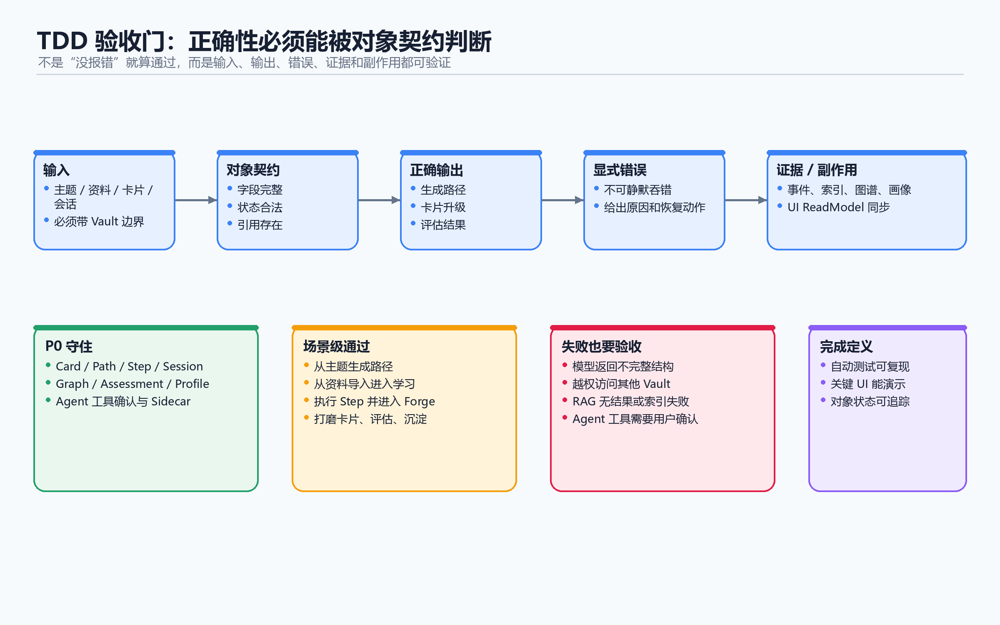

# 07 TDD 验收标准

## 1. 文档目的

这个文档不是普通的功能验收清单。

它的作用是把 `06-DDD-对象模型与契约.md` 里的领域对象，转换成可以判断对错、可以防止系统跑偏的验收标准。

也就是说，后续开发时不是先写页面、再凭感觉点一点，而是先问清楚：

```text
这个对象接收什么输入？
它应该输出什么结果？
输出结果怎样才算正确？
怎样一定是错误？
我们预设它最可能在哪里出问题？
```

这里不规定具体怎么测试，也不规定测试框架、测试用例写法或执行方式。

这里只写清楚一件事：

```text
做到什么程度，才算这个对象、这个环节、这个输出是对的。
```

## 2. 验收原则

### 2.1 每个对象都要有可判断的契约

每个领域对象至少要说清楚五件事：

| 问题 | 说明 |
|---|---|
| 输入是什么 | 用户输入、系统输入、AI 输入、其他对象输入 |
| 输出是什么 | 新对象、状态变化、派生结果、错误结果 |
| 什么是正确 | 满足边界、状态、权限、证据、来源和一致性 |
| 什么是错误 | 跨边界、状态非法、静默失败、无来源、无证据、错改对象 |
| 预设问题在哪 | 我们提前假设它会出 bug 的地方 |

### 2.2 正确不等于“没有报错”

一个动作没有报错，不代表它正确。

在 AXIOM 里，正确通常意味着：

- 数据属于正确的 User 和 Vault。
- 对象状态是合法的。
- 输出能追溯到输入。
- 派生对象不能反向污染源数据。
- AI 不能绕过领域服务直接修改核心对象。
- 画像、评估、推荐必须有证据。
- UI 展示状态不能变成业务真相。

### 2.3 错误要被显式暴露

错误不能静默吞掉。

如果系统无法完成某个动作，应该输出明确错误，而不是假装成功。

常见错误类型：

| 错误类型 | 含义 |
|---|---|
| BoundaryError | 跨 User、跨 Vault、跨对象边界 |
| ValidationError | 输入字段缺失、枚举非法、状态非法 |
| ConflictError | 路径重复、对象已存在、状态冲突 |
| NotFoundError | 目标对象不存在 |
| PermissionError | 当前用户无权访问 |
| ContractError | 工具返回、AI 输出、JSON 结构不符合契约 |
| StateTransitionError | 不允许的状态流转 |
| SideEffectError | 主对象成功，但副作用失败，如 RAG 索引失败 |

## 3. 核心学习闭环验收

AXIOM MVP 的主链路是：

```text
Vault
  -> 输入主题或资料
  -> 生成 Path
  -> 执行 Step
  -> 创建或绑定 Card
  -> 打开 Forge Session
  -> AI 引导学习
  -> 用户编辑 Card
  -> 评估掌握
  -> 更新 Graph / RAG / Cognition
```



### 3.1 主链路输入输出

| 环节 | 输入 | 输出 | 正确标准 | 错误标准 |
|---|---|---|---|---|
| 选择 Vault | 当前 User、vaultId | CurrentVault | Vault 属于当前 User | 能访问别人的 Vault |
| 输入主题 | topic、difficulty、userId、vaultId | LearningPath | Path 属于当前 Vault，步骤顺序清楚 | 生成空 Path、跨 Vault 引用 Card |
| 导入资料 | title、content、source | LiteratureCard、Concept、Path、Edge | 有来源、有 hash、能回溯原文 | 无来源、直接伪造成 permanent |
| 生成路径 | topic / document / graph context | Path + Step[] | Step 有顺序、概念、状态、可执行 | Step 无 concept、无顺序、状态乱 |
| 执行步骤 | pathId、stepId | Card、Session、ThreadMetadata | Step 绑定 Card，打开正确线程 | Step 属于别的 Path 或 Vault |
| Forge 学习 | sessionId、message | Message、ToolCall、AI 回复 | Message 顺序正确，工具受契约限制 | AI 直接写库、线程上下文错 |
| 编辑卡片 | cardId、content、title、tags | UpdatedCard | 只更新同 Vault Card，保留 type | 覆盖错卡、改坏 type |
| 升级卡片 | cardId、PromotionAttempt | PermanentCard、ArchivedSession | 满足质量标准，线程归档 | 无质量判断直接升级 |
| 掌握评估 | stepId、cardId、answer | AssessmentResult | 有 score、feedback、evidence | 只有分数，无证据 |
| 完成步骤 | stepId、AssessmentResult | StepStatus、PathProgress | 状态合法，进度正确 | 不通过也标 mastered |
| 同步图谱 | Card、WikiLink、Edge | Graph | Edge 两端同 Vault | 跨 Vault 建边 |
| 同步 RAG | Card content | RagDocumentIndex | RAG 是副本，失败不影响 Card | RAG 失败导致 Card 保存失败 |
| 更新 Cognition | Card、Session、Assessment、Graph | CognitionData、KnowledgeGap | 有证据、可解释 | 凭空生成画像 |

### 3.2 主链路必须守住的错误标准

出现下面任何情况，都应该判定为不通过：

- 当前用户不能读取或修改其他用户的 Vault。
- 同一个 Vault 内不能创建重复 `card.path`。
- Step 不能绑定其他 Vault 的 Card。
- archived Session 不能继续追加学习消息。
- Edge 两端不能来自不同 Vault。
- AI 工具不能绕过确认执行高风险写操作。
- AssessmentResult 没有 evidence 时不能更新 mastery。
- RAG 索引失败不能回滚 Card 保存。
- CognitionData 不能作为源数据被写回数据库。
- DashboardStats 不能影响真实 Path 进度。

## 4. 对象级验收标准

### 4.1 User / Vault

| 对象 | 输入 | 输出 | 正确 | 错误 | 预设问题 |
|---|---|---|---|---|---|
| User | 登录凭据、session | userId、身份信息 | session 能解析到唯一用户 | 未登录也能访问数据 | auth 与业务 API 边界松 |
| Vault | userId、vaultId | Vault 对象 | Vault 必须属于 User | 访问其他用户 Vault | 多处 API 忘记校验 userId |
| VaultProfileCache | Vault 数据变化 | profileCache | 缓存可失效、可重建 | 缓存变成唯一真相 | 缓存过期后仍展示旧判断 |

验收重点：

- 所有核心对象都必须能追溯到 Vault。
- Vault 是最大业务边界。
- 没有 Vault 的 Card、Path、Session、Profile 都是非法对象。

### 4.2 Card

| 对象 | 输入 | 输出 | 正确 | 错误 | 预设问题 |
|---|---|---|---|---|---|
| Card | vaultId、path、title、content、type | 新卡片或更新后卡片 | 同 Vault 内 path 唯一，type 合法 | path 重复、type 非法、无 vaultId | 页面和工具各自造 type |
| FleetingCard | 临时理解、问题、例子 | `type = fleeting` | 可以继续打磨 | 被当成已掌握知识 | AI 生成内容直接变 permanent |
| LiteratureCard | 外部资料、来源 | `type = literature` | 必须有 source 或 citation | 无来源资料卡 | 插件采集内容丢来源 |
| PermanentCard | 用户整理后的稳定知识 | `type = permanent` | 有清楚标题、内容、关联或证据 | 空内容永久卡 | 升级门槛过低 |
| CardPath | title、type、vault | 唯一路径 | 同 Vault 唯一、可读 | 跨 Vault 冲突或重复 | 标题变化导致路径失控 |
| CardTags | 用户输入或 AI 建议 | tags[] | 去重、可搜索 | 非数组、脏数据 | JSON 字段无校验 |

Card 正确标准：

- Card 必须属于 Vault。
- CardType 只能是 `fleeting / literature / permanent`。
- Card 保存成功不要求 RAG 同步成功。
- Card 可以不属于 Cluster，但不能属于其他 Vault 的 Cluster。
- Card 的内容更新应触发 WikiLink / RAG / Cognition 的后续动作，但这些是副作用，不是 Card 保存的前置条件。

Card 错误标准：

- 没有 Vault 的 Card。
- 同 Vault 内重复路径。
- 用 UI 筛选状态修改 CardType。
- 把 literature 当作用户已掌握知识。
- AI 未经用户确认覆盖用户写过的内容。

### 4.3 Cluster / Edge / WikiLink / Graph

| 对象 | 输入 | 输出 | 正确 | 错误 | 预设问题 |
|---|---|---|---|---|---|
| Cluster | vaultId、name、color | Cluster | 属于 Vault，可包含三类 Card | 删除 Cluster 同时删 Card | 星团和类型混淆 |
| Edge | sourceCardId、targetCardId、type | Edge | 两端 Card 同 Vault，type 合法 | 跨 Vault 建边 | AI 建关系没校验两端 |
| EdgeType | 字符串 | 枚举值 | 收敛在约定类型内 | 任意字符串污染图谱 | 工具层各自发明类型 |
| WikiLink | Card content | link list | 能解析 `[[title]]` | 误识别普通文本 | Markdown 解析过粗 |
| ResolvedWikiLink | source、targetTitle | Edge | 找到同 Vault Card 后建 wikilink edge | 跨 Vault 解析 | 同名卡片歧义 |
| DanglingLink | targetTitle | 悬空链接 | 保留但不乱建卡 | 静默创建 permanent | 自动化过度 |
| GalaxyNode | Card | 展示节点 | 只从 Card 派生 | 节点变成源数据 | UI 拖拽误改领域 |

正确标准：

- Cluster 是知识领域分组，不是 CardType。
- Edge 是 Card 之间的关系，不是 Path 顺序。
- WikiLink 可以生成 Edge，但必须可重算、可回滚。
- Galaxy 只展示图谱，不保存第二套知识真相。

错误标准：

- 删除 Cluster 时误删 Card。
- 删除 Card 后遗留孤儿 Edge。
- EdgeType 无限膨胀。
- WikiLink 和 Edge 长期不一致。

### 4.4 LearningPath / Step / PathAdjustment

| 对象 | 输入 | 输出 | 正确 | 错误 | 预设问题 |
|---|---|---|---|---|---|
| LearningPath | topic、vaultId、userId、source | Path | 属于 User 和 Vault，有 name、topic、status | 无步骤或无主题 | AI 输出结构不稳定 |
| LearningPathStep | pathId、concept、order | Step | 属于 Path，顺序唯一，可绑定 Card | Step 跨 Path 或乱序 | 前端重排后状态错 |
| StepStatus | 用户动作、评估结果 | locked / available / learning / completed / mastered | 状态按规则流转 | 跳过评估直接 mastered | 状态变成按钮文案 |
| StepMastery | AssessmentResult、行为证据 | mastery score | 有证据、有来源 | 单纯点击完成就高分 | 掌握度被滥用 |
| PathProgress | Step[] | doneSteps / totalSteps | 从 Step 状态计算 | 手动写错进度 | 冗余字段不同步 |
| PathAdjustment | session、assessment、profile | 调整建议 | 有原因，可追溯 | 凭空插入新路径 | 调整覆盖用户选择 |

正确标准：

- Path 是任务组，Card 是知识内容，两者不能混用。
- Step 执行时可以创建或绑定 Card。
- Step 绑定的 Card 必须属于同一个 Vault。
- Path 进度来自 Step 状态，不应该由 UI 直接手写。

错误标准：

- 删除 Path 误删已经沉淀的 Card。
- Step 完成但 Path 进度不变。
- Assessment 未通过仍然标记 mastered。
- PathAdjustment 没有理由和来源。

### 4.5 LearningSession / Message / ThreadMetadata

| 对象 | 输入 | 输出 | 正确 | 错误 | 预设问题 |
|---|---|---|---|---|---|
| LearningSession | userId、vaultId、sessionKind | Session | 属于 User 和 Vault，kind 清楚 | 无 Vault 的学习线程 | 普通聊天和卡片线程混淆 |
| ThreadMetadata | cardId、pathId、stepId、status | 线程上下文 | 能指回真实对象 | 指向不存在对象 | JSON 字段无类型约束 |
| LearningMessage | sessionId、role、content | Message | 属于 Session，role 合法 | archived 线程继续写入 | SSE 重试造成重复消息 |
| AgentAuditLog | tool、risk、result | 审计记录 | 可追踪、脱敏 | 记录 secret 或隐私原文 | 日志过度暴露 |

正确标准：

- Card Thread 必须绑定 Card。
- Path Step Thread 应绑定 Path 和 Step。
- permanent 卡升级后，原 active 打磨线程应归档。
- archived 线程不能继续写入学习消息。

错误标准：

- Message 脱离 Session。
- ThreadMetadata 指向其他 Vault 的 Card。
- 工具调用失败却写成成功消息。
- 审计日志保存完整密钥。

### 4.6 Assessment / Mastery

| 对象 | 输入 | 输出 | 正确 | 错误 | 预设问题 |
|---|---|---|---|---|---|
| Assessment | cardId / stepId / concept | 评估定义 | 有目标、类型、规则 | 只说“测一下” | 评估目标不清 |
| AssessmentQuestion | Assessment | 题目 | 题目能对应概念和 Rubric | 题目和目标无关 | AI 出题跑偏 |
| AssessmentAttempt | answer、userId、sessionId | 作答记录 | 记录用户原始回答 | 覆盖历史作答 | 多次作答无版本 |
| AssessmentResult | attempt、rubric | score、passed、feedback、evidence | 有可解释证据 | 只有分数 | LLM 判断不可复查 |
| CriticalGap | result | gap | 指向 concept / Card / Step | 泛泛而谈 | 不能转为下一步行动 |

正确标准：

- 评估结果必须能解释。
- Mastery 不能只靠用户点击完成。
- 评估可以影响 Step 和 Profile，但必须通过领域服务。
- 评估失败应该产生下一步建议，而不是只给挫败反馈。

错误标准：

- 没有 evidence 的评估更新 mastery。
- 一次评估结果永久定义用户能力。
- AssessAgent 直接修改 Step 状态。

### 4.7 DocumentImport

| 对象 | 输入 | 输出 | 正确 | 错误 | 预设问题 |
|---|---|---|---|---|---|
| ImportedDocument | title、content、source | 导入记录 | 有 source、hash、vaultId | 无来源 | 粘贴内容无法追溯 |
| DocumentChunk | ImportedDocument | chunks | 能回到原文片段 | 切分丢上下文 | 长文处理错位 |
| ExtractedConcept | chunk | concept | 可转为 Card 或 Step | 概念重复无合并策略 | AI 抽取过多 |
| ExtractedFleeting | chunk | fleeting idea | 保留疑问、例子、细节 | 全部升成 permanent | 消化过程被跳过 |
| ExtractedRelation | concept pair | relation | 可转成 Edge，需同 Vault | 关系两端不存在 | 幻觉关系 |
| ImportResult | import job | 统计和对象 ID | 成功、失败、跳过都清楚 | 部分失败但提示成功 | 异步任务吞错 |

正确标准：

- 原始资料先进入 literature。
- 抽取出的知识可以成为 fleeting 或 permanent，但必须说明来源。
- 导入资料可以生成 Path，但不能强制覆盖用户已有路径。

错误标准：

- 外部资料直接成为无来源 permanent。
- 导入失败后留下半截脏数据。
- 重复导入同一资料无法识别。

### 4.8 Profile / Memory / Capability / Skill / Cognition

| 对象 | 输入 | 输出 | 正确 | 错误 | 预设问题 |
|---|---|---|---|---|---|
| VaultMemory | 用户偏好、事实、上下文 | Memory | 有 category、source、confidence | 临时短句变长期事实 | 记忆污染 |
| VaultCapability | concept、assessment、行为 | capability | 有 mastery、status、weakAreas | 无证据更新 | 概念命名不一致 |
| VaultSkill | 行为证据 | skill | 有 evidence | 把 AgentSkill 当用户技能 | 技能边界混乱 |
| EducationProfile | 多源证据 | 六维画像 | score + confidence + evidence | 裸分数 | LLM 主观判断过强 |
| CognitionData | Card、Edge、Session、Profile | 页面聚合 | 派生、可重算 | 被当作源数据保存 | 读模型污染领域 |
| KnowledgeGap | 结构缺口、评估缺口 | gap | 有类型、严重度、证据 | 空泛建议 | 不可行动 |

正确标准：

- 画像必须来自证据。
- Cognition 是派生结果，不是源数据。
- VaultSkill 表示用户会什么，AgentSkill 表示系统会什么，不能混淆。

错误标准：

- 没有证据的画像更新。
- Dashboard 统计影响真实能力判断。
- 一个失败评估永久判定用户不会。

### 4.9 Resource / PushRecord

| 对象 | 输入 | 输出 | 正确 | 错误 | 预设问题 |
|---|---|---|---|---|---|
| ResourceArtifact | card / step / profile gap | resource | 有 target、type、source | 无归属资源 | 资源散落 |
| ResourceFile | artifact | 文件引用 | 格式、路径、大小清楚 | 文件丢失仍展示成功 | 渲染和业务状态混淆 |
| ResourceManifest | generation job | 清单 | 列出所有产物 | 只给一个文案 | 多文件资源不可追踪 |
| PushRecord | trigger、resources | 推送记录 | 有 reason、expiresAt、feedback | 无理由打扰用户 | 推送泛滥 |
| PushableResource | topic、type、difficulty | 可推送项 | 能服务具体缺口 | 与用户当前任务无关 | 推荐噪声 |

正确标准：

- Resource 服务 Card、Step、Path 或 KnowledgeGap。
- Resource 不是 Card 的替代物。
- PushRecord 必须说明为什么推、推给谁、什么时候过期。

错误标准：

- 资源生成失败却展示为成功。
- 资源没有目标对象。
- 推送理由不可解释。

### 4.10 RAG / Search / Recommendation

| 对象 | 输入 | 输出 | 正确 | 错误 | 预设问题 |
|---|---|---|---|---|---|
| RagDocumentIndex | cardId、contentHash | index state | pending / indexing / indexed / failed 清楚 | 索引失败影响 Card 保存 | 副作用污染主流程 |
| RagReference | query result | 引用 | 能指回 Card / title / path | 引用不存在对象 | AI 引用幻觉 |
| SearchQuery | query、scope、limit | 搜索请求 | 限定 Vault 和 scope | 全库乱搜 | 权限泄漏 |
| SearchResult | query | target + score + reason | 能指向真实对象 | 只有文本片段 | 结果不可追踪 |
| Recommendation | profile / graph / path | 推荐项 | 有 reason 和 confidence | 直接当事实执行 | 推荐未经确认改图谱 |

正确标准：

- RAG 是 sidecar。
- SearchResult 必须能回到真实对象。
- Recommendation 只是建议，不是领域事实。

错误标准：

- RAG 返回内容无法追溯 Card。
- 推荐关系直接写成 Edge。
- Search 跨用户数据。

### 4.11 Agent Runtime / Tool / Confirmation

| 对象 | 输入 | 输出 | 正确 | 错误 | 预设问题 |
|---|---|---|---|---|---|
| ToolDefinition | name、schema、risk | tool | 输入输出结构明确 | 任意 JSON | 工具契约漂移 |
| ToolCall | toolName、input | result | 先校验权限和风险 | 直接执行 | AI 越权 |
| ToolResult | raw result | structured result | 通过契约校验 | 错误结构当成功 | LLM 输出不稳定 |
| AgentConfirmationRequest | risky action | pending confirmation | 说明风险、过期时间 | 高风险无确认 | 确认流缺失 |
| ConfirmationStatus | 用户选择 | approved / rejected | 状态单向变化 | 过期后仍可用 | token 复用 |
| AgentSkill | task context | 可用能力 | 与 VaultSkill 区分 | 把系统能力当用户能力 | 命名混乱 |
| SubagentRunRecord | subagent input | run record | 有输入摘要、输出、失败原因 | 黑箱调用 | 难以复盘 |

正确标准：

- Agent 只能通过工具和领域服务修改对象。
- 高风险操作必须确认。
- ToolResult 必须结构化校验。
- AuditLog 必须脱敏。

错误标准：

- AI 直接写数据库。
- 工具执行跨 Vault 操作。
- 子 Agent 互相抢职责。
- Confirmation 永久有效。

### 4.12 BackgroundJob / Storage / Export

| 对象 | 输入 | 输出 | 正确 | 错误 | 预设问题 |
|---|---|---|---|---|---|
| AxiomJob | name、payload | job state | queued / running / succeeded / failed | 静默失败 | 异步不可观测 |
| RagIndexCardJob | cardId | RagDocumentIndex | 幂等，可重试 | 重复索引污染状态 | hash 没用好 |
| DocumentImportJob | document | ImportResult | 部分失败可解释 | 成功失败混在一起 | 长任务断开 |
| ResourceGenerationJob | target | Manifest | 进度清楚 | 文件生成了但无记录 | 状态不同步 |
| FileEntry | path | file metadata | path 可控、不可越界 | 路径穿越 | 本地 FS 泄漏 |
| VaultExportPackage | vaultId | export package | 只导出当前 Vault | 导出其他用户数据 | 权限遗漏 |

正确标准：

- 异步任务必须有状态。
- 任务失败必须可见。
- Export 只能导出当前用户当前 Vault。
- Storage 不能把本地文件实现泄漏到核心领域。

错误标准：

- 无限重试。
- 没有幂等。
- 导出包含无权限数据。

### 4.13 UI ReadModel

| 对象 | 输入 | 输出 | 正确 | 错误 | 预设问题 |
|---|---|---|---|---|---|
| DashboardStats | 源对象集合 | 统计 | 可重算 | 当源数据写回 | 读模型污染 |
| RecentActivity | 领域事件或更新时间 | 活动列表 | 能指回对象 | 活动指向已删对象 | 删除同步不完整 |
| GrowthPoint | 时间序列指标 | 曲线点 | 指标来源明确 | 图好看但无业务意义 | 指标定义漂移 |
| AppMode | 用户导航 | 当前模式 | 只影响 UI | 改变业务状态 | UI 和领域混用 |
| SelectedNode | 用户选择 | cardId | 必须能指回 Card | 指向不存在节点 | 图谱刷新后选中失效 |
| PanelLayout | 用户布局 | UI 布局 | 不影响领域 | 布局影响权限和数据 | 前端状态过重 |

正确标准：

- UI 状态只负责用户当前看什么。
- ReadModel 可以缓存，但必须能从源对象重算。
- UI 不能直接绕过 API 改核心对象。

错误标准：

- DashboardStats 被后端当成真实进度。
- SelectedNode 影响权限判断。
- 前端 Store 保存长期业务真相。

### 4.14 身份、登录态与验证凭据

| 对象 | 输入 | 输出 | 正确 | 错误 | 通过程度 |
|---|---|---|---|---|---|
| AuthAccount | userId、provider、providerAccountId、credential | 登录方式记录 | 账号只绑定一个 User，provider 信息清楚 | 同一外部账号绑定多个 User | 登录方式可追溯，不能串号 |
| AuthSession | userId、sessionToken、expiresAt | 登录态 | 未过期且能解析到唯一 User | 过期 session 仍能访问业务数据 | 所有业务请求都能确认当前 User |
| VerificationToken | identifier、token、expiresAt | 短期验证凭据 | 一次性、短期有效、用途清楚 | token 可重复使用或长期有效 | 验证成功后 token 失效 |
| CurrentUserContext | session、request | 当前用户上下文 | 所有后续对象创建都能带上 userId | API 在无用户上下文时继续执行业务 | 没有 User 就不能进入学习数据操作 |

### 4.15 卡片值对象与质量对象

| 对象 | 输入 | 输出 | 正确 | 错误 | 通过程度 |
|---|---|---|---|---|---|
| CardType | 字符串 | fleeting / literature / permanent | 只允许三种类型 | 任意字符串进入 Card | 所有入口统一收敛到同一枚举 |
| CardContent / MarkdownContent | Markdown 文本 | 卡片正文 | 可为空间整理，但 permanent 不能空洞 | 乱码、非法结构、AI 覆盖用户内容 | 内容可保存、可渲染、可被解析 |
| CardTitle | 用户标题、AI 建议标题 | 标题 | 可读、可搜索、能生成路径 | 空标题或标题和路径冲突无人处理 | 标题变化不破坏卡片身份 |
| CardClusterMembership | cardId、clusterId | 归属关系 | Card 和 Cluster 同 Vault | Card 归入其他 Vault 的 Cluster | 分组变化不改变 CardType |
| CardLinks | CardContent、Edge | 入链、出链、悬空链接 | 能区分已解析和未解析链接 | 链接变化后图谱长期不同步 | 链接结果可重算 |
| CardRagState | cardId、RAG 状态 | 索引状态 | RAG 状态独立于 Card 保存 | RAG 失败导致 Card 保存失败 | Card 保存和 RAG 同步互不污染 |
| ClusterColor | 用户选择或默认值 | 颜色值 | 可展示、可恢复默认 | 非法颜色导致界面异常 | 颜色只影响展示 |
| ClusterPosition | 排序或坐标 | 位置值 | 只影响展示顺序或布局 | 位置变化改变知识语义 | 布局变化不改变 Card / Edge |
| EdgeWeight | 关系强度 | 数值权重 | 有范围、有含义 | 任意数字污染关系 | 权重不替代 EdgeType |
| CardSection | CardContent | 定义、例子、关联、应用等段落 | 能识别哪些段落已具备 | 没有结构也判定为高质量 | permanent 至少满足必要结构 |
| CardQualityScore | Card、CardSection、Edge | 质量评分 | 说明评分依据 | 只给分数不解释 | 评分能指出缺口 |
| PromotionCriteria | CardType、CardQualityScore | 升级门槛 | 说明什么条件能升级 permanent | 没有门槛直接升级 | 升级前能判断通过或不通过 |
| PromotionAttempt | cardId、criteria、用户确认 | 升级尝试结果 | 记录成功、失败和原因 | 失败原因丢失 | 每次升级都有可追溯记录 |
| PolishingSuggestion | Card、Session、质量缺口 | 打磨建议 | 只建议，不强制覆盖 | AI 建议直接替换用户内容 | 用户能选择采纳或拒绝 |
| CardRevision | cardId、旧内容、新内容 | 版本记录 | 能说明卡片如何变化 | 重要修改不可追溯 | 关键变更能回看 |
| AIContributionRatio | 用户内容、AI 建议内容 | AI 贡献占比 | 用于判断是否需要用户确认 | AI 内容过高却直接 permanent | 高 AI 占比必须显式确认 |

### 4.16 图谱、链接与展示细对象

| 对象 | 输入 | 输出 | 正确 | 错误 | 通过程度 |
|---|---|---|---|---|---|
| GalaxyEdge | Edge | 展示连线 | 完全来自真实 Edge | 展示连线成为第二套关系 | 删除 Edge 后展示连线消失 |
| GalaxyCluster | Cluster | 展示星团 | 完全来自真实 Cluster | 展示星团改变领域分组 | UI 布局不改变 Cluster 语义 |
| IncomingLink | Edge / WikiLink | 入链列表 | 能指回 source Card | 指向不存在 Card | 当前 Card 的来源关系清楚 |
| OutgoingLink | CardContent / Edge | 出链列表 | 能指向目标或悬空标题 | 把悬空链接当真实 Edge | 已解析和悬空分开展示 |
| LinkSyncResult | CardContent 变化 | 新增、删除、悬空链接 | 每次同步有明确结果 | 同步失败静默吞掉 | WikiLink 和 Edge 最终一致 |
| KnowledgeGraph | Card、Cluster、Edge | 图谱对象 | 只由同 Vault 对象组成 | 混入其他 Vault 节点 | 图谱能完整反映当前 Vault |

### 4.17 路径与步骤值对象

| 对象 | 输入 | 输出 | 正确 | 错误 | 通过程度 |
|---|---|---|---|---|---|
| PathTopic | 用户主题或资料主题 | 路径主题 | 清楚表达学习目标 | 空主题、泛主题 | 用户能看懂这条路径学什么 |
| PathDifficulty / Difficulty | 用户选择、画像、内容难度 | 难度 | beginner / intermediate / advanced 等值稳定 | 难度随意字符串 | 难度能影响步骤和资源 |
| PathSource / LearningPathSource | ai / graph / manual / import-document | 来源 | 来源可追溯 | 来源缺失导致无法解释路径 | 用户知道路径从哪里来 |
| PathStatus / LearningPathStatus | 用户动作、Step 状态 | active / completed / archived | 状态按规则变化 | archived 后仍作为 active 学习 | 路径列表和状态一致 |
| StepOrder | Path 内排序 | 顺序值 | 同 Path 内唯一、稳定 | 重复 order 或负数 | 步骤按预期顺序展示 |
| StepConcept | Step 标题和内容 | 概念 | 能指向学习对象 | Step 没有概念 | 每个 Step 都知道学哪个概念 |
| StepChapter | 章节或概念组 | 分组 | 只辅助组织 | 章节替代 Path 或 Cluster | 分组不改变任务状态 |
| StepPrerequisites / PrerequisiteSet | 前置概念或 Step | 前置集合 | 指向同 Path 或同 Vault 对象 | 指向不存在对象 | locked / available 可解释 |
| EstimatedMinutes | 内容复杂度、资源长度 | 预计时长 | 只作为预估 | 时长决定是否掌握 | 用户能据此安排学习 |
| MasteryScore | 评估和行为证据 | 掌握分 | 有证据、有范围 | 点击完成直接高分 | 分数能解释并可更新 |
| LearningStage | 当前路径阶段 | 阶段 | 影响建议，不直接改源对象 | 阶段判断凭空生成 | 阶段变化有依据 |

### 4.18 会话、消息与线程细对象

| 对象 | 输入 | 输出 | 正确 | 错误 | 通过程度 |
|---|---|---|---|---|---|
| SessionKind | 创建入口 | conversation / card-thread / path-step-thread | 类型和上下文一致 | 普通聊天误当卡片线程 | 线程行为由类型决定 |
| ThreadStatus | 用户归档、卡片升级 | active / archived | archived 不能继续学习写入 | archived 仍能追加学习消息 | 线程状态能约束写入 |
| MessageRole | 消息来源 | system / user / assistant / tool_result | role 合法且语义清楚 | 任意 role 污染历史 | 消息能按角色渲染和处理 |
| AgentSession | Agent 运行上下文 | runtime session | 与用户业务 Session 边界清楚 | AgentSession 替代 LearningSession | 运行状态不污染学习线程 |
| SessionSummary | Session、Message | 会话摘要 | 派生、可重算、能指回 Session | 摘要成为源数据 | 侧栏展示和真实会话一致 |

### 4.19 画像、能力与认知细对象

| 对象 | 输入 | 输出 | 正确 | 错误 | 通过程度 |
|---|---|---|---|---|---|
| MemoryCategory | 记忆来源 | preference / style / context / fact | 分类清楚 | 偏好被当事实 | 记忆使用前能判断类别 |
| SkillEvidence | 用户行为、评估、输出 | 技能证据 | 能指向来源 | 技能无证据 | VaultSkill 可解释 |
| DimensionScore | 维度证据 | score + confidence + evidence | 三者同时存在 | 裸分数 | 画像维度可解释 |
| EducationProfileHistory | Profile 更新 | 历史快照 | 记录何时为何变化 | 覆盖旧画像无历史 | 画像演化可追溯 |
| Observation | Session、Card、Assessment | 系统观察 | 说明观察来源 | 把观察当事实 | 观察能进入或不进入画像 |
| CapabilityStatus | Capability 变化 | known / learning / mastered | 状态来自行为或评估证据 | 无证据直接 mastered | 能解释用户为什么处于该状态 |
| GapType | KnowledgeGap | 缺口类型 | 类型能指导下一步 | 类型泛化无意义 | 缺口可分类处理 |
| GapSeverity | KnowledgeGap | 严重程度 | 严重度有依据 | 高低随意 | 优先级可解释 |
| CognitiveDimension | Profile | 画像维度 | 维度固定且含义稳定 | 新维度随意扩张 | 页面和服务定义一致 |
| ThinkingPattern | 用户输出和对话 | 思维模式 | 来自多个证据 | 单条证据就下结论 | 模式判断有置信度 |
| Strength | 用户表现 | 强项 | 能说明证据 | 空泛夸奖 | 强项能影响推荐 |
| GrowthEdge | 缺口和强项 | 成长点 | 能转成下一步行动 | 泛泛建议 | 用户知道该做什么 |
| NextAction | Profile / Gap / Path | 下一步动作 | 指向 Path、Step、Card 或 Resource | 没有落点 | 建议可执行 |

### 4.20 资源、推送与渲染细对象

| 对象 | 输入 | 输出 | 正确 | 错误 | 通过程度 |
|---|---|---|---|---|---|
| PushTrigger | 学习事件、画像缺口、定时规则 | 触发原因 | stage_completion / assessment_pass / low_dimension / scheduled 等值清楚 | 无触发原因推送 | 推送可以解释为什么出现 |
| ResourceType | 资源生成请求 | document / quiz / mindmap / code 等 | 类型稳定、可渲染 | 任意类型导致前端无法展示 | 每种类型有明确承载方式 |
| ResourceGenerationEntry | resourceType、target | 单项生成状态 | pending / running / done / failed 清楚 | 失败仍显示完成 | 资源生成过程可观察 |
| ResourceProgress | 生成过程事件 | 进度 | 只表示过程 | 进度替代最终结果 | 用户能看到是否还在生成 |
| GeneratedResourceItem | Artifact / Manifest | 前端资源项 | 能指向真实资源或卡片 | 展示无来源资源 | 点击能回到真实对象 |
| ResourceManifestItem | literature / resource | 清单项 | 说明文件、类型、来源 | 多文件资源丢项 | 资源集合完整 |
| HyperFramesScene | ResourceArtifact | 可视化场景 | 只表达内容，不改变知识对象 | 场景结果写回 Card 语义 | 渲染失败不影响学习状态 |
| VideoGenerationResult | 资源生成任务 | 视频结果 | 说明成功、失败、输出位置 | 文件失败但结果成功 | 用户知道视频是否可用 |
| RenderOptions | 渲染请求 | 渲染参数 | 只影响生成样式 | 参数污染领域对象 | 同一知识可用不同方式渲染 |
| GuardrailReport | 生成内容、外部工具结果 | 安全报告 | 输出风险和处理建议 | 风险内容直接发布 | 高风险资源必须被拦截或标记 |

### 4.21 RAG 与检索细对象

| 对象 | 输入 | 输出 | 正确 | 错误 | 通过程度 |
|---|---|---|---|---|---|
| RagWorkspace | vaultId | RAG 工作区 | 一个 Vault 对应清楚 workspace | 多 Vault 混用 workspace | 检索边界不越过 Vault |
| RagDocumentId | cardId、workspace | RAG 文档 ID | 能反查 Card | 文档 ID 指向未知内容 | 引用可追溯 |
| RagContentHash / ContentHash | CardContent | 内容 hash | 内容变化 hash 变化 | hash 不变导致旧索引 | 能判断是否需要重建索引 |
| RagTrackId | 索引任务 | 任务追踪 ID | 能查看索引进度 | 任务丢失无法查状态 | 失败和完成都可追踪 |
| RagQueryContext | query、workspace、references | 查询上下文 | 只包含当前 Vault 结果 | 混入其他用户内容 | AI 引用来源可信 |
| RagSyncStatus | 同步动作 | pending / indexing / indexed / failed / disabled | 状态和真实同步一致 | indexed 但无法召回 | 状态能指导页面提示 |
| MemorySearchResult | query、memory | 记忆检索结果 | 有 category、relevance、source | 记忆片段无来源 | 检索结果可解释 |
| RecommendationReason | Recommendation | 推荐理由 | 说明为什么推荐 | 只给推荐不解释 | 用户能判断是否采纳 |
| LearningRecommendation | Profile / Gap / Path | 学习建议 | 指向具体可执行对象 | 建议无目标 | 推荐能转成行动 |
| SuggestedRelation | Card / Graph | 建议关系 | 需要确认后才能成为 Edge | 直接写入强关系 | 推荐和事实分开 |

### 4.22 聚合对象验收标准

| 聚合对象 | 输入 | 输出 | 正确 | 错误 | 通过程度 |
|---|---|---|---|---|---|
| User 聚合 | AuthAccount、AuthSession、Vault 引用 | 用户边界 | 用户只能访问自己的账号、会话和 Vault | 一个 session 操作其他用户数据 | 身份边界稳定 |
| Vault 聚合 | Card、Cluster、Edge、Path、Session、Memory、Skill | 知识库边界 | 所有学习数据都在 Vault 下闭合 | 跨 Vault 读写、关联、检索 | Vault 是最大业务边界 |
| Card 聚合 | CardType、CardPath、Content、Tags、RAG 引用 | 卡片一致性 | 路径唯一、类型合法、升级归档线程 | 卡片保存影响错误对象 | Card 是知识源数据 |
| KnowledgeGraph 聚合 | Card、Edge、Cluster | 图谱一致性 | Edge 两端同 Vault，删除 Card 清 Edge | 图谱保留孤儿关系 | 图谱能从源对象重建 |
| LearningPath 聚合 | Step、PathAdjustment | 路径一致性 | Step 属于 Path，进度来自 Step | Path 进度手写失真 | 学习任务状态可信 |
| LearningSession 聚合 | ThreadMetadata、Message | 线程一致性 | Message 属于 Session，归档后不写入 | 消息脱离会话 | 会话历史可信 |
| CognitionProfile 聚合 | Memory、Capability、Skill、ProfileHistory | 画像一致性 | 画像来自证据 | 凭空生成能力判断 | Cognition 可解释 |
| ResourcePush 聚合 | PushRecord、PushableResource、feedback | 推送一致性 | 推送有原因、资源、过期和反馈 | 无理由推送或无法关闭 | 推送不骚扰用户 |
| RagIndex 聚合 | RagDocumentIndex、RagReference | 检索一致性 | RAG 是 Card 副本 | RAG 成为源数据 | 检索可信但不污染知识 |

### 4.23 领域服务验收标准

| 服务 | 输入 | 输出 | 正确 | 错误 | 通过程度 |
|---|---|---|---|---|---|
| PathGenerationService | topic / document / graph、Vault | LearningPath、Step[] | 生成路径属于当前 Vault，步骤可执行 | 空路径、跨 Vault 引用 | 用户能按路径开始学习 |
| DocumentImportService | SourceDocument、Vault | LiteratureCard、ExtractedConcept、Path、Edge | 来源清楚，失败可解释 | 无来源 permanent、静默失败 | 资料能转成可学习对象 |
| StepExecutionService | pathId、stepId、User | Card、Session、ThreadMetadata | 只执行当前 Vault Step | 打开错卡或重复造卡 | Step 能稳定进入 Forge |
| CardPromotionService | Card、criteria、用户确认 | PermanentCard、ArchivedSession | 满足质量后升级并归档线程 | 空卡或无确认升级 | 升级结果可解释 |
| WikiLinkSyncService | CardContent | Edge、DanglingLink、LinkSyncResult | 同 Vault 解析，可重算 | 跨 Vault 建边 | 内容和图谱最终一致 |
| MasteryAssessmentService | Step、Card、AssessmentResult | StepStatus、Capability | 有证据才更新掌握 | 无证据更新 mastery | 掌握变化可信 |
| CognitionAnalysisService | Card、Edge、Session、Assessment | Profile、KnowledgeGap、NextAction | 画像有证据、缺口可行动 | 凭空判断用户状态 | Cognition 可解释 |
| ResourceGenerationService | Card / Path / Gap | ResourceArtifact、Manifest、PushRecord | 资源有目标、来源和类型 | 无归属资源 | 资源能服务学习动作 |
| RagSyncService | Card、contentHash | RagDocumentIndex | 副作用独立，失败可见 | RAG 失败回滚 Card | 检索状态可信 |
| VaultExportService | userId、vaultId | VaultExportPackage | 只导出当前用户当前 Vault | 导出其他用户数据 | 导出内容完整且合规 |

### 4.24 领域事件验收标准

| 事件 | 输入 | 输出 | 正确 | 错误 | 通过程度 |
|---|---|---|---|---|---|
| VaultCreated | Vault 创建成功 | 初始化事件 | 只在成功创建后发出 | 创建失败也发事件 | 默认空间可初始化 |
| CardCreated | Card 创建成功 | 新卡事件 | cardId、vaultId 清楚 | 事件缺少对象 ID | Dashboard / Galaxy 可刷新 |
| CardUpdated | Card 保存成功 | 更新事件 | 能触发 WikiLink / RAG 副作用 | 保存失败仍触发 | 副作用基于真实更新 |
| CardPromotedToPermanent | 升级成功 | 升级事件 | 只在 type 真变为 permanent 后发出 | 升级失败也发出 | 线程归档和 Cognition 更新有依据 |
| CardDeleted | 删除成功 | 删除事件 | 关联 Edge / RAG / UI 选中可清理 | 删除失败先清副作用 | 删除后一致性可恢复 |
| ClusterCreated | Cluster 创建成功 | 星团事件 | 属于当前 Vault | 跨 Vault 通知刷新 | Galaxy 分组可刷新 |
| CardAssignedToCluster | Card 分组成功 | 分组事件 | Card 和 Cluster 同 Vault | 分组失败也发事件 | 图谱分组一致 |
| EdgeCreated | Edge 创建成功 | 关系事件 | 两端 Card 同 Vault | 跨 Vault Edge 事件 | 图谱关系可刷新 |
| DocumentImported | ImportResult 完成 | 导入事件 | 说明成功、失败、跳过 | 部分失败假装全成功 | Learn / Vault 可展示结果 |
| LearningPathCreated | Path 创建成功 | 路径事件 | Path 有 Step | 空路径发事件 | Learn 可展示新任务 |
| StepStarted | Step 进入学习 | 开始事件 | 绑定正确 Step / Card / Session | 打开错线程 | Forge 上下文正确 |
| StepCompleted | Step 完成 | 完成事件 | 状态合法，进度更新 | 未完成也发完成事件 | Path 进度可信 |
| PathArchived | Path 归档 | 归档事件 | archived 后不进入 active 默认列表 | active Path 被隐藏 | 任务列表一致 |
| SessionMessageAdded | Message 保存成功 | 消息事件 | Message 属于 Session | 保存失败仍推送 | 会话流和历史一致 |
| SessionArchived | Session 归档 | 归档事件 | 归档后阻止写入 | 归档失败仍禁止用户操作 | 线程状态一致 |
| RagIndexRequested | 请求索引 | 索引开始事件 | cardId、contentHash 清楚 | 无 Card 请求索引 | RAG 任务可追踪 |
| RagIndexCompleted | 索引成功 | 完成事件 | documentId、hash 对得上 | 旧内容索引标完成 | AI 可召回当前内容 |
| RagIndexFailed | 索引失败 | 失败事件 | 失败原因可见 | 失败静默 | 页面能提示或重试 |
| ProfileUpdated | 画像更新 | 更新事件 | evidence 清楚 | 无证据画像更新 | 推荐和资源推送有依据 |
| ResourcePushed | 推送成功 | 推送事件 | reason、resources、expiresAt 清楚 | 无理由推送 | 用户知道为什么收到资源 |

### 4.25 文档导入与评估细对象

| 对象 | 输入 | 输出 | 正确 | 错误 | 通过程度 |
|---|---|---|---|---|---|
| SourceDocument | url / title / rawContent | 原始资料对象 | 来源、标题、内容完整 | 来源缺失 | literature 可追溯 |
| ImportBatch | 多个 SourceDocument | 批量导入结果 | 每份资料状态独立 | 一份失败导致全部不可解释 | 批量结果清楚 |
| ImportStats | ImportResult | 统计 | permanent / fleeting / literature / edges 数量准确 | 统计和实际对象不一致 | 用户能理解导入产出 |
| SourceCitation | SourceDocument、Card | 引用 | 能回到原始资料 | 引用断裂 | Card 的来源可信 |
| Rubric | Assessment 目标 | 评分标准 | 通过和不通过条件清楚 | 评分凭感觉 | 评估结果可复核 |
| FeynmanAssessment | 用户解释、Rubric | 费曼评估结果 | 判断表达、理解和缺口 | 只看回答长度 | 能判断是否讲明白 |
| QualityCheckRecord | CardContent、Criteria | 质量检查记录 | 检查项、结论、建议清楚 | 只有“好/不好” | 用户知道怎么改卡片 |

### 4.26 通知与事件流对象

| 对象 | 输入 | 输出 | 正确 | 错误 | 通过程度 |
|---|---|---|---|---|---|
| AppNotification | 领域事件、系统提示 | 通知 | type、title、message、createdAt 清楚 | 通知无来源或无类型 | 用户知道发生了什么 |
| NotificationType | 通知语义 | 类型 | profile / card / skill / graph / resource / system 等稳定 | 任意类型导致 UI 失效 | 通知能正确展示 |
| UnreadCount | 未读通知集合 | 数量 | 从通知状态派生 | 手写数量和列表不一致 | 数字和列表一致 |
| EventStreamConnection | Session / Agent 流 | 连接状态 | 只传递事件，不承载业务真相 | SSE 消息当数据库事实 | 断线不破坏业务状态 |
| NotificationDismissal | notificationId、userId | 关闭记录 | 只影响当前用户展示 | 关闭影响其他用户 | 通知关闭可追踪 |

### 4.27 Agent、工具、安全与确认细对象

| 对象 | 输入 | 输出 | 正确 | 错误 | 通过程度 |
|---|---|---|---|---|---|
| OracleAgent | 用户目标、上下文 | 协调决策 | 只协调，不绕过领域服务 | 成为所有规则黑箱 | 每次关键动作可解释 |
| ProfileAgent | 证据集合 | 画像建议 | 只分析 Profile | 直接写 Card | 画像更新有证据 |
| ForgeAgent | Card、Session | 打磨建议、资源请求 | 服务卡片打磨 | 覆盖用户内容 | 用户保持最终控制权 |
| GuideAgent | topic、graph、profile | 路径建议 | 生成可执行 Path | 生成空任务 | 学习路径可开始 |
| AssessAgent | Assessment、Answer | 评估判断 | 输出 evidence | 直接修改 Step | 掌握更新受服务约束 |
| AgentRole | Agent 配置 | 角色 | 角色能力边界清楚 | 角色互相抢职责 | 每个 Agent 知道能做什么 |
| ToolContract | ToolDefinition、risk、schema | 工具契约 | 输入输出、风险、权限清楚 | 工具无边界 | 工具可被安全调用 |
| ToolRisk | ToolContract | 风险等级 | read / write / destructive / network / llm 清楚 | 高风险标低风险 | 是否确认可判断 |
| AgentAuditEntry | ToolCall、ToolResult | 审计条目 | 脱敏、可追踪 | 记录 secret | 关键动作可复盘 |
| OperationConfirmation | 高风险动作 | 确认流程 | action、risk、payload 清楚 | 模糊确认 | 用户知道在批准什么 |
| ConfirmationToken | 确认请求 | 短期凭据 | 一次性、过期失效 | 可复用 | 确认不能被重放 |
| SecretRedactionRule | 日志、上下文 | 脱敏结果 | secret 不进入日志和模型上下文 | token 原文泄露 | 敏感信息不外泄 |
| ShellHookRule | 命令或工具动作 | 允许 / 拒绝 / 确认 | 规则明确 | 危险动作默认允许 | 高风险动作被拦截 |

### 4.28 Agent 技能与多 Agent 编排对象

| 对象 | 输入 | 输出 | 正确 | 错误 | 通过程度 |
|---|---|---|---|---|---|
| SkillEntry | skill manifest | 注册项 | 名称、能力、来源清楚 | 技能不可追溯 | 技能可启用和禁用 |
| SkillSource | skill | 来源 | built-in / local / imported 清楚 | 来源不明 | 风险和信任可判断 |
| SkillSnapshot | 当前运行技能集合 | 快照 | 执行中不漂移 | 运行中技能变化 | 复盘时知道用了哪些技能 |
| SkillFilter | task、risk、mode | 可用技能列表 | 根据任务选择 | 高风险技能自动进入 | 技能选择可解释 |
| SkillAssessment | task、skill | 是否适合 | 输出适配理由 | 不适合也强行用 | 技能调用合理 |
| SubagentRole | 子 Agent 配置 | 角色 | Oracle / Profile / Forge / Guide / Assess 清楚 | 角色职责混乱 | 子 Agent 分工稳定 |
| SubagentMode | 当前任务阶段 | 模式 | plan / execute / review / summarize 清楚 | 模式与动作不符 | 编排行为可预测 |
| SubagentStatus | 运行过程 | idle / running / failed / completed | 状态真实 | failed 伪装 completed | 用户和系统能知道进度 |
| SubagentConfig | 模型、工具、风险边界 | 配置 | 能限制工具和风险 | 配置缺失导致越权 | 子 Agent 不能越界 |
| SubagentEvent | 子 Agent 生命周期 | 事件 | started / streamed / completed / failed 清楚 | 事件乱序无人处理 | 编排流可追踪 |
| FlowStep | 编排步骤 | 步骤输出 | 有前置条件和输出 | 无前置直接执行 | 编排可解释 |
| OrchestrationState | FlowStep 状态集合 | 当前编排状态 | 只作为运行时状态 | 成为长期知识源数据 | 编排结束后不污染领域 |

### 4.29 学习引导对象

| 对象 | 输入 | 输出 | 正确 | 错误 | 通过程度 |
|---|---|---|---|---|---|
| LearningPhase | 用户状态、路径阶段 | 当前学习阶段 | check / motivation / assessment / generate / learn / verify 清楚 | 阶段混乱 | AI 引导符合当前阶段 |
| TeachingMethod | 概念、用户偏好 | 教学方法 | analogy / example / contrast / formal / visual / socratic 等有选择理由 | 随机讲解 | 方法服务理解 |
| LearningStrategy | phase、profile、gap | 策略 | 说明用什么方法推进 | 策略无目标 | 用户得到合适引导 |
| UserResponse | 用户回答、行为 | 反馈对象 | 记录理解、困惑、尝试次数、aha moment | 只存原文无结构 | 后续引导能引用反馈 |
| LearningPattern | 多次学习记录 | 有效模式 | 来自多个证据 | 一次行为形成模式 | 系统知道什么对用户有效 |
| ExplanationPattern | AI 解释和用户反馈 | 解释偏好 | 有证据 | 主观猜测偏好 | 后续解释更贴合用户 |
| ExamplePattern | 用户偏好和成功案例 | 例子偏好 | 能说明适合哪些例子 | 滥用同一种例子 | 示例选择可解释 |
| RemedialPattern | 失败评估、薄弱点 | 补救策略 | 指向下一步练习或资源 | 只说“再学一下” | 补救动作可执行 |

### 4.30 对话压缩与记忆沉淀对象

| 对象 | 输入 | 输出 | 正确 | 错误 | 通过程度 |
|---|---|---|---|---|---|
| Checkpoint | Session、Message | 检查点 | 记录压缩前后上下文 | 压缩后无法追溯 | 长会话可恢复 |
| ReviewableMessage | Message | 可复盘消息 | 有复盘原因 | 任意消息都复盘 | 复盘对象有价值 |
| FlushableMessage | Message | 可沉淀消息 | 可以转为 Memory 且有来源 | 临时话语直接成事实 | 记忆沉淀受约束 |
| SummarizedMemory | 多条 Message | 摘要记忆 | 保留来源和置信度 | 摘要覆盖原始 Card | 长期记忆可信 |
| CompressionConfig | 运行配置 | 压缩规则 | 只影响运行时 | 改变领域对象 | 配置不污染业务 |
| CompressResult | Message、Config | 摘要、保留项、丢弃项 | 说明保留和丢弃 | 关键内容丢失无说明 | 压缩结果可解释 |
| DialogueContext | 当前 Session、Memory、Card | 对话上下文 | 不等于永久记忆 | 上下文直接写入 Memory | 对话有连续性但不污染长期事实 |

### 4.31 模型配置、凭据与外部连接对象

| 对象 | 输入 | 输出 | 正确 | 错误 | 通过程度 |
|---|---|---|---|---|---|
| ModelConfig | provider、model、参数 | 模型配置 | 参数合法、用途清楚 | 配置缺失还调用模型 | AI 调用可控 |
| ResolvedModelConfig | 默认配置、用户配置、运行上下文 | 最终配置 | 来源可追踪 | 实际使用模型不可知 | 审计能知道用了什么模型 |
| AIProviderConfig | provider、credential 引用 | Provider 配置 | 不暴露 secret | secret 进入日志或前端 | Provider 可用且安全 |
| OracleProfile | Agent 行为配置 | 主 Agent 配置 | 约束 Oracle 行为 | 替代用户画像 | Agent 行为稳定 |
| LLMUsageRecord | 模型调用 | 用量记录 | token、model、cost 可追踪 | 用量丢失 | 成本和调试可复盘 |
| CredentialPool | 多个 credential | 可用凭据 | 权限、轮换、失效清楚 | 过期或越权凭据继续用 | 凭据使用可控 |
| MCPServerConfig | server、tools、权限 | 外部服务配置 | 工具和风险清楚 | 未知工具可调用 | 外部服务边界明确 |
| MCPToolDefinition | 外部工具定义 | ToolContract 候选 | 必须转成 ToolContract 才能执行 | 外部定义直接执行 | 外部工具受同一安全规则约束 |
| ExternalConnector | 外部来源或工具 | 连接对象 | 声明读写范围 | 外部结果直接写 Vault | 外部数据进入系统前可校验 |

### 4.32 后台任务、存储与导出细对象

| 对象 | 输入 | 输出 | 正确 | 错误 | 通过程度 |
|---|---|---|---|---|---|
| JobStatus | job 生命周期 | 状态 | queued / running / succeeded / failed / cancelled 真实 | 状态和实际结果不一致 | 用户能理解任务结果 |
| QueueName | job 类型 | 队列名 | rag / import / resource 等清楚 | 队列混乱导致错处理 | 任务进入正确队列 |
| RagReindexVaultJob | vaultId | 全量索引任务 | 范围和进度清楚 | 误重建其他 Vault | 重建不越界 |
| RagIndexJob | cardId、hash | 索引任务 | 幂等、可追踪 | 重复任务污染索引 | 同内容不重复索引 |
| ReadResult | path / objectId | 读取结果 | 成功返回内容，失败返回原因 | 失败当空内容 | 调用方能区分空和失败 |
| WriteResult | path、content | 写入结果 | 成功说明最终路径 | 写入失败仍返回成功 | 文件状态可信 |
| StorageSearchResult | query、scope | 文件搜索结果 | 能指回文件或 Card | 路径越界 | 搜索不泄露数据 |
| ExportArchive | VaultExportPackage | 压缩包 | 格式、路径、校验信息清楚 | 导出包损坏无人知道 | 用户拿到可用导出 |

### 4.33 UI 细对象与页面状态

| 对象 | 输入 | 输出 | 正确 | 错误 | 通过程度 |
|---|---|---|---|---|---|
| SelectedPath | 用户选择 | pathId | 能指回真实 Path | 指向已删 Path | Learn 选中状态可信 |
| ActiveLearningStep | 用户进入 Step | stepId | 能指回当前 Path 下 Step | 激活其他 Path 的 Step | 当前学习任务明确 |
| GraphLayoutMode | 用户布局选择 | 布局模式 | 只影响展示 | 改变 Edge 语义 | 图谱布局和关系分离 |
| PanelId | UI 面板 | 面板身份 | 不替代领域对象 ID | 用 PanelId 查业务数据 | 面板只负责界面 |
| CanvasAction | 用户画布操作 | UI 动作 | 通过 API 或 Store 转成合法操作 | 画布直接写库 | 交互动作受契约约束 |
| TypeFilter | 用户筛选 | filter | 不改变 CardType | 筛选结果被保存成类型 | 筛选只影响展示 |
| SortMode | 用户排序 | sort | 不改变源数据 | 排序改变业务顺序 | 排序只影响视图 |
| ActivityType | RecentActivity | 活动类型 | card_created / step_completed 等稳定 | 任意类型导致展示错误 | 活动能正确归类 |
| ReviewRate | Card / Session 访问 | 回访比例 | 从源对象派生 | 手写成真实能力 | 指标只用于展示和参考 |
| OrphanCardCount | Card、Edge | 孤立卡数量 | 从当前图谱派生 | 数量和图谱不一致 | 知识缺口判断有依据 |

## 5. 场景级验收标准

### 5.1 从主题生成学习路径

输入：

- 当前 User。
- 当前 Vault。
- 学习主题。
- 可选难度。
- 可选已有 Card / Capability 上下文。

输出：

- 一个 LearningPath。
- 多个 LearningPathStep。
- 可选预绑定 Card。

正确标准：

- Path 属于当前 User 和 Vault。
- Step 顺序稳定。
- Step 至少有 title、concept、status。
- 第一个可学 Step 状态正确。
- Path 不引用其他 Vault 的 Card。

错误标准：

- 生成空路径。
- Step 没有概念。
- Step 状态都是 completed。
- Path 没有 Vault。
- AI 输出 JSON 不合法却被保存。

### 5.2 从资料导入进入学习

输入：

- 资料标题。
- 资料正文。
- 来源信息。
- 当前 Vault。

输出：

- LiteratureCard。
- ExtractedConcept。
- ExtractedFleeting。
- ExtractedRelation。
- LearningPath。
- ImportResult。

正确标准：

- LiteratureCard 保留来源。
- 生成的卡片都属于当前 Vault。
- ImportResult 说明创建、跳过、失败。
- 概念关系只有在两端存在时才转成 Edge。

错误标准：

- 无来源资料直接变 permanent。
- 导入失败后用户看到成功。
- 部分对象创建成功但没有回滚或说明。

### 5.3 执行 Step 并进入 Forge

输入：

- pathId。
- stepId。
- 当前 User / Vault。

输出：

- Step 进入 learning。
- 创建或绑定 Card。
- 创建或打开 LearningSession。
- ThreadMetadata 绑定 pathId / stepId / cardId。

正确标准：

- Step、Path、Card、Session 都属于同一 Vault。
- 已有 active card-thread 时复用或明确创建新线程。
- Forge 打开的是正确卡片。

错误标准：

- 打开了其他 Step 的卡片。
- Session metadata 丢失。
- 重复点击生成多张重复卡。

### 5.4 打磨卡片并升级 permanent

输入：

- fleeting card。
- 用户编辑内容。
- AI 建议。
- PromotionAttempt。

输出：

- UpdatedCard。
- PermanentCard。
- ArchivedSession。
- 可选 Edge / RAG 更新。

正确标准：

- 用户内容被保留。
- 升级有质量判断。
- 升级后 type 正确。
- 原打磨线程归档。

错误标准：

- AI 建议覆盖用户内容。
- 空卡升级 permanent。
- threadStatus 仍然 active。

### 5.5 评估掌握并更新路径

输入：

- Step。
- Card。
- 用户回答。
- Rubric。

输出：

- AssessmentResult。
- StepStatus。
- PathProgress。
- Capability 更新证据。

正确标准：

- Result 有 score、passed、feedback、evidence。
- 只有通过评估才可以进入 mastered。
- Capability 更新能追溯到评估结果。

错误标准：

- 只要点击完成就 mastered。
- 不通过也增加掌握度。
- 画像没有证据。

### 5.6 Galaxy / Cognition 展示沉淀结果

输入：

- Card。
- Cluster。
- Edge。
- Session。
- Assessment。
- Profile。

输出：

- GalaxyNode / GalaxyEdge。
- CognitionData。
- KnowledgeGap。
- DashboardStats。

正确标准：

- 展示对象都能指回源对象。
- Cognition 判断有证据。
- ReadModel 可重算。

错误标准：

- GalaxyNode 成为第二套 Card。
- CognitionData 被当作源数据。
- 统计数字和真实对象对不上。

## 6. P0 验收标准

P0 是没有它们系统就不可信的验收标准。

### 6.1 数据边界

- User 只能访问自己的 Vault。
- Vault 下的 Card / Path / Session / Edge 不能跨用户。
- API 层和领域服务层都要校验 Vault 边界。

### 6.2 Card 契约

- CardType 只能是 fleeting / literature / permanent。
- 同 Vault 内 CardPath 唯一。
- literature 必须保留来源。
- permanent 不能是空内容。

### 6.3 Path / Step 契约

- Path 必须有 Step。
- Step 必须属于 Path。
- Step 绑定 Card 时必须同 Vault。
- PathProgress 从 Step 状态计算。

### 6.4 Session 契约

- Card Thread 必须绑定 Card。
- Path Step Thread 必须绑定 Path 和 Step。
- archived Session 不能继续写学习消息。
- Message 必须属于 Session。

### 6.5 Graph 契约

- Edge 两端必须同 Vault。
- 删除 Card 后 Edge 必须清理。
- WikiLink 同步不能跨 Vault。

### 6.6 Assessment / Profile 契约

- AssessmentResult 必须有 evidence。
- 没有 evidence 不能更新 mastery。
- EducationProfile 必须有 confidence 和 evidence。
- KnowledgeGap 必须能指向具体原因。

### 6.7 Agent 安全契约

- ToolCall 输入必须校验。
- 高风险 ToolCall 必须确认。
- ToolResult 结构错误不能当成功。
- AuditLog 必须脱敏。

### 6.8 Sidecar 契约

- RAG 失败不能影响 Card 保存。
- Resource 失败不能影响 Step 状态。
- Notification 失败不能回滚主业务。
- DashboardStats 不能成为源数据。

## 7. P1 验收标准

P1 是让系统变得稳定、可维护的验收标准。

- 导入同一份资料时能识别重复。
- ImportResult 能报告部分成功和部分失败。
- WikiLink 修改后 Edge 能同步更新。
- PromotionAttempt 能指出缺失的 CardSection。
- PathAdjustment 有原因、有来源。
- SearchResult 能指回真实对象。
- Recommendation 有 reason 和 confidence。
- BackgroundJob 可重试、可失败、可观察。
- VaultExportPackage 不包含其他 Vault 数据。

## 8. P2 验收标准

P2 是体验完善和未来扩展的验收标准。

- DashboardStats 定义稳定。
- RecentActivity 指向的对象被删除后能降级展示。
- PanelLayout 不影响领域状态。
- SubagentRunRecord 可复盘。
- AgentSkill 和 VaultSkill 永远不混用。
- ResourceManifest 能覆盖多文件产物。
- HyperFramesScene 不污染 Card 契约。
- MCPToolDefinition 必须转换成 ToolContract 才能执行。

## 9. 验收完成定义

一个对象或功能只有同时满足下面条件，才算完成：

- 它的输入契约清楚。
- 它的输出契约清楚。
- 正确路径是什么清楚。
- 错误路径是什么清楚。
- 边界条件是什么清楚。
- 如果涉及 AI 或 Agent，必须有契约校验标准。
- 如果涉及异步副作用，必须说明副作用失败时主流程是否仍正确。
- 如果涉及画像、推荐、评估，必须有 evidence 标准。
- 如果涉及页面，必须说明页面展示对象能否指回源对象。

最终验收不是看“功能有没有做出来”，而是看：

```text
对象是否守住了边界；
状态是否只能合法流转；
输出是否可判断、可追溯、可解释；
错误是否被明确暴露；
AI 是否被限制在契约内工作。
```

这就是 AXIOM 的验收标准。
