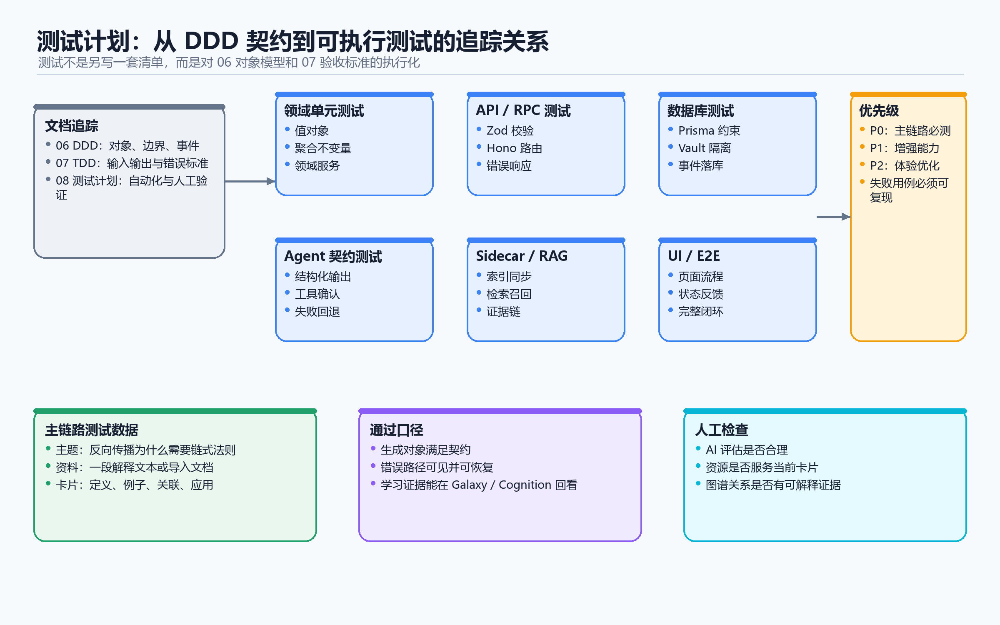

# 08 测试计划

## 1. 文档目的

本文档接在 `06-DDD-对象模型与契约.md` 和 `07-TDD-验收标准.md` 后面。

第六篇回答：

```text
系统里有哪些领域对象，它们的边界和契约是什么？
```

第七篇回答：

```text
什么算对，什么算错，做到什么程度算通过？
```

第八篇回答：

```text
具体怎么测？
用什么测试方式？
输入什么？
应该得到什么结果？
怎样判定通过？
```

本文档按第六篇和第七篇逐项对照，不只测页面按钮，也不只测主流程，而是把对象、场景、边界、副作用、AI 工具、异步任务和 UI 读模型都纳入测试计划。

## 2. 测试方式定义

| 测试方式 | 用途 | 适合对象 |
|---|---|---|
| 领域单元测试 | 不经过 UI 和 API，直接验证领域规则 | 值对象、状态流转、对象契约、领域服务 |
| API / RPC 集成测试 | 验证路由、权限、参数校验和数据库结果 | Vault、Card、Path、Session、Graph、RAG 状态 |
| 数据库约束测试 | 验证唯一性、归属关系、级联清理 | CardPath、Edge、Session、User / Vault 边界 |
| Agent 契约测试 | 验证工具输入输出、风险等级、确认流、审计 | ToolCall、ToolResult、Confirmation、AuditLog |
| 异步 / Sidecar 测试 | 验证主流程和副作用分离 | RAG、Resource、Notification、BackgroundJob |
| UI / E2E 测试 | 验证用户真实路径和页面承载 | Learn、Forge、Galaxy、Cognition、Dashboard |
| 回归测试 | 验证修复后核心链路不再破坏 | P0 主链路和历史 bug |
| 手工探索验收 | 验证体验是否符合产品意图 | AI 引导、学习节奏、复杂交互 |

测试计划只规定怎么测和怎么算通过，不规定必须使用哪一个具体测试框架。



### 2.1 通过标准的统一判定口径

后面表格里的“通过标准”有些会写成“可追溯”“可解释”“不污染源数据”“副作用不回滚主流程”等短句。为了避免这些短句变成空话，统一按下面口径判断。

| 标准短句 | 具体判定方式 |
|---|---|
| 属于当前 User / Vault | 输出对象里的 `userId` / `vaultId` 必须等于登录上下文或输入参数；用其他用户或其他 Vault 访问时返回权限或边界错误 |
| 能指回源对象 | 输出里必须包含源对象 ID，或能通过 ID 查回 Card / Path / Step / Session / Resource / SourceDocument |
| 可追溯 | 能从结果回到输入来源、触发事件、用户动作、AI 工具调用或外部资料 citation |
| 可解释 | 不能只有结果值，必须有 reason、feedback、evidence、source、missingItems 或 error message |
| 有 evidence | `evidence.length > 0`，且每条 evidence 必须带 `sourceObjectType/sourceObjectId` 或可定位的用户行为记录 |
| 状态真实 | 状态值必须和实际对象一致，例如 `indexed` 后能查到 RAG 文档，`archived` 后不能继续写入 |
| 不污染源数据 | ReadModel、UI 状态、RAG、Resource、Notification、Recommendation 的变化不能反向改 Card / Path / Session / Profile 源对象 |
| 副作用不回滚主流程 | Card / Path / Session 等主对象保存成功后，RAG、通知、资源生成失败只改变自己的状态，不撤销主对象 |
| 错误可见 | 错误输入不能返回成功；响应或任务状态必须包含 `ValidationError / PermissionError / BoundaryError / ConflictError / failed` 之一和原因 |
| AI 受控 | Agent 只能通过 ToolContract 和领域服务改对象，高风险动作必须确认，审计日志必须脱敏 |
| UI 只影响展示 | AppMode、PanelLayout、SelectedNode、Filter、Sort 等变化不能改变领域对象状态 |

如果一个测试只满足“页面没有崩”“接口返回 200”“AI 回复看起来合理”，但无法满足上表对应判定，就不算通过。

## 3. 对照关系

| 本文档部分 | 对照第六篇 | 对照第七篇 |
|---|---|---|
| 4 主链路测试计划 | 06 第 4 章核心关系图、第 5-10 章对象拆解 | 07 第 3 章核心学习闭环验收 |
| 5 对象级测试计划 | 06 第 2 章、第 5-13 章 | 07 第 4.1-4.33 |
| 6 场景级测试计划 | 06 第 5-11 章 | 07 第 5 章 |
| 7 优先级测试计划 | 06 第 14 章对象级验收清单 | 07 第 6-8 章 P0/P1/P2 |
| 8 通过定义 | 06 全文对象契约 | 07 第 9 章验收完成定义 |

## 4. 主链路测试计划

### 4.1 Web MVP 完整闭环

| 项 | 内容 |
|---|---|
| 对照 06 | 第 4 章核心关系图；第 5-10 章 |
| 对照 07 | 第 3.1 主链路输入输出 |
| 测试方式 | UI / E2E + API 集成 |
| 怎么测 | 使用一个新用户和一个新 Vault，从输入主题开始，完成路径生成、Step 执行、Forge 对话、卡片编辑、评估、图谱和 Cognition 展示 |
| 输入 | userA、vaultA、topic=`第一性原理`、difficulty=`beginner`、一条用户回答、一段卡片编辑内容 |
| 预期结果 | 产生 LearningPath、LearningPathStep、Card、LearningSession、LearningMessage、AssessmentResult、Edge / RagDocumentIndex / CognitionData 派生结果 |
| 通过标准 | Path、Step、Card、Session、Message、AssessmentResult 的 `userId / vaultId` 都等于 userA / vaultA；Path 至少有 1 个 Step；点击 Step 后返回的 ThreadMetadata 含同一组 `cardId / pathId / stepId`；评估结果的 `evidence.length > 0`；Galaxy / Cognition 中每个展示项都有可查询的源对象 ID |

### 4.2 从资料导入进入学习

| 项 | 内容 |
|---|---|
| 对照 06 | 13.3 文档导入对象；5.2 三类卡片 |
| 对照 07 | 5.2 从资料导入进入学习 |
| 测试方式 | API 集成 + UI / E2E |
| 怎么测 | 粘贴一段带标题、来源和正文的资料，触发导入，检查 literature、概念、关系、路径和结果统计 |
| 输入 | title=`操作系统笔记`、source=`课程笔记 URL`、content=`包含进程、线程、调度的资料`、vaultId |
| 预期结果 | LiteratureCard、ExtractedConcept、ExtractedFleeting、ExtractedRelation、LearningPath、ImportResult |
| 通过标准 | LiteratureCard 的 `source` 或 `citation` 非空；所有新建 Card / Edge / Path 的 `vaultId` 等于输入 vaultId；ImportResult 至少包含 created / skipped / errors 统计；当 source 为空时返回 ValidationError，且不创建 permanent 卡 |

### 4.3 Step 执行进入 Forge

| 项 | 内容 |
|---|---|
| 对照 06 | 6.2 LearningPathStep；7.1 LearningSession；5.5 卡片与会话 |
| 对照 07 | 5.3 执行 Step 并进入 Forge |
| 测试方式 | API 集成 + UI / E2E |
| 怎么测 | 点击某个 available Step，检查是否创建或绑定 Card，并打开接口返回的 Session |
| 输入 | pathId、stepId、userId、vaultId |
| 预期结果 | Step 状态进入 learning；Card 创建或绑定；LearningSession 创建或复用；ThreadMetadata 含 cardId / pathId / stepId |
| 通过标准 | 返回的 Step、Path、Card、Session 的 `vaultId` 完全一致；同一 stepId 连续点击两次后绑定 Card 数量不增加，第二次返回第一次的 cardId；Forge 当前打开的 `cardId / sessionId` 等于接口返回值 |

### 4.4 卡片打磨与升级

| 项 | 内容 |
|---|---|
| 对照 06 | 5.2 三类卡片；5.5 卡片与会话；13.5 卡片质量与升级对象 |
| 对照 07 | 5.4 打磨卡片并升级 permanent |
| 测试方式 | 领域单元 + API 集成 + UI / E2E |
| 怎么测 | 创建 fleeting 卡，补定义、例子、关联、应用，发起升级，检查 PromotionAttempt 和线程归档 |
| 输入 | fleetingCardId、用户编辑后的 Markdown、PromotionCriteria、用户确认 |
| 预期结果 | Card.type 变为 permanent；PromotionAttempt 记录成功；原 card-thread archived；CardUpdated / CardPromotedToPermanent 事件可触发 |
| 通过标准 | content 为空或缺少必要 CardSection 时返回失败 PromotionAttempt；升级前后的用户原文片段仍存在于 CardContent；升级成功后 Card.type=`permanent`，原 Session.threadStatus=`archived`，继续写入该 Session 返回 StateTransitionError |

### 4.5 掌握评估与路径更新

| 项 | 内容 |
|---|---|
| 对照 06 | 6.2 StepMastery；13.2 评估与测验对象；8.2 VaultCapability |
| 对照 07 | 5.5 评估掌握并更新路径 |
| 测试方式 | 领域单元 + API 集成 |
| 怎么测 | 对 Step 进行评估，输入用户回答，检查 AssessmentResult、StepStatus、PathProgress、Capability |
| 输入 | stepId、cardId、answer=`用自己的话解释第一性原理`、Rubric |
| 预期结果 | AssessmentResult 含 score、passed、feedback、evidence；通过时 Step 可 completed / mastered；Capability 有证据 |
| 通过标准 | AssessmentResult.evidence 为空时 Step.mastery 和 Capability 不变化；`passed=false` 时 StepStatus 不能变为 `mastered`；Path.doneSteps 等于 status 为 completed / mastered 的 Step 数量 |

### 4.6 Galaxy / Cognition 展示沉淀结果

| 项 | 内容 |
|---|---|
| 对照 06 | 2.4 星团与图谱对象；8.5 CognitionData；11 页面承载对象 |
| 对照 07 | 5.6 Galaxy / Cognition 展示沉淀结果 |
| 测试方式 | UI / E2E + API 集成 |
| 怎么测 | 创建若干 Card、Cluster、Edge、Assessment，打开 Galaxy 和 Cognition 页面检查展示和来源 |
| 输入 | cards、clusters、edges、profile evidence |
| 预期结果 | GalaxyNode / GalaxyEdge / GalaxyCluster、CognitionData、KnowledgeGap、DashboardStats |
| 通过标准 | 每个 GalaxyNode 含 cardId，每个 GalaxyEdge 含 edgeId；每个 KnowledgeGap 含 evidence 和 sourceObjectId；重新请求聚合接口得到的 DashboardStats 与页面展示一致；展示过程中不写入 Card / Edge / Profile 源表 |

## 5. 对象级测试计划

以下测试逐项对照第七篇 `4.1-4.33`，并回到第六篇对应对象。

### 5.1 User / Vault

| 对象 | 对照 06 | 对照 07 | 测试方式 | 怎么测 | 输入 | 预期结果 | 通过标准 |
|---|---|---|---|---|---|---|---|
| User | 2.1 / 3 | 4.1 | API 集成 | 用有效 session 请求业务接口 | sessionToken | 返回唯一 userId | 返回 userId 必须等于 session 绑定用户；无 session 或过期 session 返回 PermissionError，且响应体不含任何 Vault 数据 |
| Vault | 2.2 / 4 | 4.1 | API 集成 | userA 请求 vaultA 和 vaultB | userA、vaultA、vaultB | 只返回 vaultA | 请求 vaultA 返回 200 且 `vault.userId=userA`；请求 vaultB 返回 PermissionError / BoundaryError；不能返回 vaultB 的 id、name、profileCache |
| VaultProfileCache | 2.2 | 4.1 | 领域单元 + API | 修改 Card 后读取缓存 | vaultId、profileCache | 缓存可失效或重建 | Card / Assessment / Profile 变化后缓存必须标记 stale 或重算；缓存缺失时系统能从源对象重新生成 CognitionData |

### 5.2 Card

| 对象 | 对照 06 | 对照 07 | 测试方式 | 怎么测 | 输入 | 预期结果 | 通过标准 |
|---|---|---|---|---|---|---|---|
| Card | 2.3 / 5.1 | 4.2 | API 集成 | 创建和更新卡片 | vaultId、path、title、content、type | Card 保存成功 | 保存后返回 Card.id；`vaultId/path/type/title/content` 与输入一致；同 Vault 重复 path 返回 ConflictError；type 不是三类枚举时返回 ValidationError |
| FleetingCard | 5.2 | 4.2 | 领域单元 | 创建临时理解卡 | type=fleeting、content | fleeting 卡 | 返回 Card.type=`fleeting`；不会更新 Step.mastery、Capability.status 或 EducationProfile；不会出现在 permanent 统计中 |
| LiteratureCard | 5.2 | 4.2 | API 集成 | 导入有来源资料 | source、content | literature 卡 | 返回 Card.type=`literature`；metadata 或 content 中保留 source/citation；source 为空时不能创建 literature |
| PermanentCard | 5.2 / 13.5 | 4.2 | 领域单元 + API | 试图升级空卡和合格卡 | cardId、criteria | 空卡失败，合格卡成功 | 成功时 Card.type=`permanent` 且 content 非空并满足 PromotionCriteria；失败时 Card.type 保持原值并返回 missingSections 或 reason |
| CardPath | 5.1 / 12.1 | 4.2 | 数据库约束 | 同 Vault 创建重复 path | vaultId、samePath | 第二次失败 | 同一 vaultId + path 只能存在一张 Card；不同 Vault 可使用相同 path；冲突时返回 ConflictError |
| CardTags | 2.3 | 4.2 | 领域单元 | 输入重复和非法 tags | tags | 去重或拒绝非法值 | 输出 tags 必须是字符串数组、去重、无空字符串；非法类型返回 ValidationError |

### 5.3 Cluster / Edge / WikiLink / Graph

| 对象 | 对照 06 | 对照 07 | 测试方式 | 怎么测 | 输入 | 预期结果 | 通过标准 |
|---|---|---|---|---|---|---|---|
| Cluster | 2.4 / 5.3 | 4.3 | API 集成 | 创建星团并分配卡片 | vaultId、name、cardId | Cluster 和 membership | Cluster.vaultId 等于输入 vaultId；Card.clusterId 指向该 Cluster；删除 Cluster 后 Card 仍存在且 clusterId 为空 |
| Edge | 2.4 / 5.6 | 4.3 | API 集成 | 创建同 Vault 和跨 Vault Edge | sourceCardId、targetCardId | 同 Vault 成功，跨 Vault 失败 | sourceCard.vaultId 和 targetCard.vaultId 相同时创建 Edge；不同 Vault 返回 BoundaryError，数据库不新增 Edge |
| EdgeType | 12.2 | 4.3 | 领域单元 | 输入合法和非法关系类型 | type | 合法通过，非法失败 | type 必须属于约定枚举；非法 type 返回 ValidationError；不会把未知字符串写入 Edge.type |
| WikiLink | 2.4 / 13.4 | 4.3 | 领域单元 | 解析 Markdown `[[概念]]` | CardContent | link list | 只解析 `[[...]]` 语法；普通括号、代码块和 URL 不生成 WikiLink；输出包含 rawText 和 targetTitle |
| ResolvedWikiLink | 13.4 | 4.3 | API 集成 | 同 Vault 中存在目标卡 | source、targetTitle | wikilink Edge | 只有当前 Vault 内存在唯一目标 Card 时生成 `type=wikilink` Edge；目标在其他 Vault 时返回 DanglingLink 或 BoundaryError |
| DanglingLink | 13.4 | 4.3 | 领域单元 | 目标卡不存在 | targetTitle | dangling link | 输出 DanglingLink.targetTitle；Card 表不新增 permanent / fleeting / literature；Edge 表不新增关系 |
| GalaxyNode | 2.4 / 11 | 4.3 | UI / E2E | 打开 Galaxy | Card | 展示节点 | 节点数量等于当前筛选条件下的 Card 数；每个节点都有 cardId；删除 Card 后对应节点消失 |

### 5.4 LearningPath / Step / PathAdjustment

| 对象 | 对照 06 | 对照 07 | 测试方式 | 怎么测 | 输入 | 预期结果 | 通过标准 |
|---|---|---|---|---|---|---|---|
| LearningPath | 2.5 / 6.1 | 4.4 | API 集成 | 根据主题生成路径 | topic、vaultId | Path + Step[] | 返回 Path.userId / vaultId 与请求一致；Path.topic 非空；至少 1 个 Step；空 topic 返回 ValidationError |
| LearningPathStep | 2.5 / 6.2 | 4.4 | API 集成 | 创建和读取 Step | pathId、concept、order | Step | Step.pathId 等于输入 pathId；concept 非空；同 Path 内 order 不重复；连续两次读取列表时 Step 顺序都按 order 升序 |
| StepStatus | 6.2 / 12.3 | 4.4 | 领域单元 | 模拟状态流转 | locked -> available -> learning | 合法流转成功 | 只允许约定流转；未满足 prerequisites 时不能 available；无通过评估时不能 mastered |
| StepMastery | 6.2 | 4.4 | 领域单元 | 用有无 evidence 的结果更新 mastery | AssessmentResult | mastery 更新或失败 | evidence 非空且 result.passed=true 时才允许增加 mastery；否则 mastery 保持不变并返回原因 |
| PathProgress | 6.1 | 4.4 | 领域单元 | 修改 Step 状态后计算进度 | Step[] | doneSteps / totalSteps | totalSteps 等于 Step 总数；doneSteps 等于 completed/mastered 数；手动传入不一致进度时以 Step 计算结果为准 |
| PathAdjustment | 6.3 | 4.4 | API 集成 | 生成路径调整建议 | session、assessment、profile | adjustment | adjustment 必须包含 reason、sourceObjectId、suggestedChange；缺少 reason 或 source 时不保存 |

### 5.5 LearningSession / Message / ThreadMetadata

| 对象 | 对照 06 | 对照 07 | 测试方式 | 怎么测 | 输入 | 预期结果 | 通过标准 |
|---|---|---|---|---|---|---|---|
| LearningSession | 2.6 / 7.1 | 4.5 | API 集成 | 创建 conversation、card-thread、path-step-thread | userId、vaultId、sessionKind | Session | 学习型 Session 必须包含 vaultId；card-thread 必须包含 cardId；path-step-thread 必须同时包含 pathId 和 stepId |
| ThreadMetadata | 7.1 / 12.4 | 4.5 | 领域单元 | 校验 metadata 指向对象 | cardId、pathId、stepId | valid metadata | metadata 中每个 ID 都能查到同 Vault 对象；任一对象不存在或跨 Vault 时校验失败 |
| LearningMessage | 7.2 | 4.5 | API 集成 | 向 active 和 archived Session 写消息 | sessionId、role、content | active 成功，archived 失败 | active Session 写入后 Message.sessionId 等于输入；role 合法；archived Session 写入返回 StateTransitionError |
| AgentAuditLog | 7.3 | 4.5 | Agent 契约 | 执行工具后查审计 | tool、risk、result | audit log | 每次 ToolCall 产生 auditId、toolName、risk、status；日志不含 API key/token 原文；失败工具也有记录 |

### 5.6 Assessment / Mastery

| 对象 | 对照 06 | 对照 07 | 测试方式 | 怎么测 | 输入 | 预期结果 | 通过标准 |
|---|---|---|---|---|---|---|---|
| Assessment | 13.2 | 4.6 | 领域单元 | 创建评估定义 | cardId / stepId / concept | Assessment | Assessment 必须包含 targetId、targetType、assessmentType、rubricId；任一目标不存在时返回 NotFoundError |
| AssessmentQuestion | 13.2 | 4.6 | 领域单元 | 生成题目并校验对应概念 | Assessment | question | question.concept 必须等于 Assessment 目标概念或其子概念；无关题目被拒绝并返回 reason |
| AssessmentAttempt | 13.2 | 4.6 | API 集成 | 保存用户回答 | answer、sessionId | attempt | attempt.answer 保存用户原文；同一用户多次作答生成多个 attemptId，不覆盖旧 attempt |
| AssessmentResult | 13.2 | 4.6 | 领域单元 | 用 Rubric 评估回答 | attempt、rubric | score、passed、feedback、evidence | Result 必须同时包含 score、passed、feedback、evidence[]；evidence 为空时 result 不能用于更新 mastery |
| CriticalGap | 13.2 / 13.6 | 4.6 | 领域单元 | 从失败评估生成 gap | result | concept / Card / Step gap | gap 必须包含 concept 或 targetId、severity、nextAction；不能只返回一句泛泛建议 |

### 5.7 DocumentImport

| 对象 | 对照 06 | 对照 07 | 测试方式 | 怎么测 | 输入 | 预期结果 | 通过标准 |
|---|---|---|---|---|---|---|---|
| ImportedDocument | 13.3 | 4.7 | API 集成 | 导入资料 | title、content、source | imported document | 返回对象必须含 title、source、contentHash、vaultId；content 为空或 source 缺失时不创建导入对象 |
| DocumentChunk | 13.3 | 4.7 | 领域单元 | 长文切分 | imported document | chunks | 每个 chunk 必须含 chunkIndex、text、sourceDocumentId、start/end 或可定位字段；chunk 合并后不丢原文主要内容 |
| ExtractedConcept | 13.3 | 4.7 | 领域单元 | 从 chunk 抽概念 | chunk | concepts | 每个 concept 必须含 name、sourceChunkId；重复 name 要合并或标记 duplicate，不能生成多个同名 permanent |
| ExtractedFleeting | 13.3 | 4.7 | 领域单元 | 抽疑问和例子 | chunk | fleeting ideas | 每条 fleeting 必须保留 sourceChunkId；导入不能把所有 chunk 直接生成 permanent 而没有 fleeting / review 过程 |
| ExtractedRelation | 13.3 | 4.7 | API 集成 | 抽关系并建 Edge | concept pair | relation / Edge | 只有 source / target 都能解析到同 Vault Card 时创建 Edge；否则输出 skippedRelation 或 error |
| ImportResult | 13.3 | 4.7 | API 集成 | 导入完成后读取结果 | import job | result stats | result.created、result.skipped、result.errors 三类字段都存在；实际创建对象数量必须等于 result 统计 |

### 5.8 Profile / Memory / Capability / Skill / Cognition

| 对象 | 对照 06 | 对照 07 | 测试方式 | 怎么测 | 输入 | 预期结果 | 通过标准 |
|---|---|---|---|---|---|---|---|
| VaultMemory | 8.1 | 4.8 | API 集成 | 写入偏好、事实、上下文 | category、content、source | memory | memory.category 属于枚举；sourceObjectId 或 sourceText 非空；confidence 在约定范围内；缺来源时不写入长期记忆 |
| VaultCapability | 8.2 | 4.8 | 领域单元 | 用评估结果更新能力 | concept、evidence | capability | evidence 非空才更新 masteryLevel/status；更新后 weakAreas / strongAreas 能指向具体 Assessment 或 Card |
| VaultSkill | 8.3 | 4.8 | 领域单元 | 从行为证据生成技能 | evidence | skill | 生成 VaultSkill 时必须含 user evidence；AgentSkill 的 name/source 不能写入 VaultSkill 作为用户能力 |
| EducationProfile | 8.4 | 4.8 | 领域单元 | 汇总多源证据 | evidence[] | six dimensions | 六个维度都返回 score、confidence、evidence；任一维度没有 evidence 时 confidence 必须低或不更新 |
| CognitionData | 8.5 | 4.8 | API 集成 | 请求 Cognition 页面数据 | vaultId | cognition data | 连续两次基于相同源对象计算得到相同结果；请求 Cognition 不新增或修改 Card / Path / Profile 源对象 |
| KnowledgeGap | 13.6 | 4.8 | 领域单元 | 从孤立卡和弱掌握生成缺口 | Card、Edge、Capability | gap | gap.type、severity、evidence、sourceObjectId 至少四项存在；无 evidence 时不生成 gap |

### 5.9 Resource / PushRecord

| 对象 | 对照 06 | 对照 07 | 测试方式 | 怎么测 | 输入 | 预期结果 | 通过标准 |
|---|---|---|---|---|---|---|---|
| ResourceArtifact | 13.12 | 4.9 | 异步 / Sidecar | 基于 Card 生成资源 | cardId、type | artifact | artifact 必须含 targetType、targetId、type、source；targetId 查不到对象时生成失败 |
| ResourceFile | 13.12 | 4.9 | 异步 / Sidecar | 生成文件后读取文件引用 | artifact | file metadata | file.path / format / size 或 contentRef 存在；文件不存在时 Resource 状态为 failed 而不是 done |
| ResourceManifest | 13.12 | 4.9 | 异步 / Sidecar | 生成多文件资源 | generation job | manifest | manifest.items 数量等于实际产物数；每个 item 含 type、path/ref、status |
| PushRecord | 9.1 | 4.9 | API 集成 | 触发资源推送 | trigger、resources | push record | PushRecord 必须含 trigger、reason、resources、expiresAt；resources 为空或 reason 为空时不推送 |
| PushableResource | 9.2 | 4.9 | 领域单元 | 生成可推送资源 | topic、difficulty | resource | resource 必须指向 Card / Step / Path / KnowledgeGap 中至少一个目标；无目标时不进入推送列表 |

### 5.10 RAG / Search / Recommendation

| 对象 | 对照 06 | 对照 07 | 测试方式 | 怎么测 | 输入 | 预期结果 | 通过标准 |
|---|---|---|---|---|---|---|---|
| RagDocumentIndex | 10.1 | 4.10 | 异步 / Sidecar | 保存 Card 后索引 | cardId、contentHash | index state | Card 已保存时即使索引失败也能读取 Card；RagDocumentIndex.status=`failed` 且含 error；成功时 status=`indexed` 且 hash 匹配 |
| RagReference | 10.2 | 4.10 | Agent 契约 | AI 回复带引用 | query result | reference | reference 必须含 cardId、title、path 或 source；cardId 查不到时引用不展示或标记 invalid |
| SearchQuery | 13.15 | 4.10 | API 集成 | 当前 Vault 内搜索 | query、scope、limit | query object | 搜索请求必须带 vaultId/scope/limit；结果集中所有 target.vaultId 都等于当前 vaultId |
| SearchResult | 13.15 | 4.10 | API 集成 | 搜索卡片和记忆 | query | target + score + reason | 每条结果含 targetType、targetId、score、reason；targetId 查不到时该结果无效 |
| Recommendation | 13.15 | 4.10 | 领域单元 | 生成学习建议 | profile、graph、path | recommendation | Recommendation 不直接创建 Edge / Path / Card；必须含 target、reason、confidence，等待用户或服务确认 |

### 5.11 Agent Runtime / Tool / Confirmation

| 对象 | 对照 06 | 对照 07 | 测试方式 | 怎么测 | 输入 | 预期结果 | 通过标准 |
|---|---|---|---|---|---|---|---|
| ToolDefinition | 2.11.6 | 4.11 | Agent 契约 | 注册工具并校验 schema | name、schema、risk | tool | tool 必须含 name、inputSchema、outputSchema、risk；缺任一字段时注册失败 |
| ToolCall | 2.11.6 | 4.11 | Agent 契约 | 调用读工具和写工具 | toolName、input | result or confirmation | 执行前校验 inputSchema、userId/vaultId 权限和 risk；高风险返回 confirmation 而不是直接执行 |
| ToolResult | 2.11.6 | 4.11 | Agent 契约 | 返回正确和错误结构 | raw result | structured result | 结果必须符合 outputSchema；不符合时 status=`failed`，不能写入领域对象 |
| AgentConfirmationRequest | 13.9 | 4.11 | Agent 契约 | 调用高风险工具 | risky action | pending confirmation | confirmation 必须含 action、risk、payloadSummary、expiresAt；expiresAt 为空时不允许创建 |
| ConfirmationStatus | 13.9 | 4.11 | 领域单元 | approve / reject / expire | confirmationId | status | 状态只能从 pending 到 approved/rejected/expired；终态不能再变化 |
| AgentSkill | 13.10 | 4.11 | Agent 契约 | 选择 Agent 技能 | task context | skill | 返回对象必须含 `skillType=agent`、source、risk；不会写入 VaultSkill；禁用技能不出现在 `availableSkills[]` |
| SubagentRunRecord | 13.11 | 4.11 | Agent 契约 | 运行子 Agent | subagent input | run record | run record 必须含 subagentRole、inputSummary、outputSummary/status、duration 或 error；失败时 status=`failed` |

### 5.12 BackgroundJob / Storage / Export

| 对象 | 对照 06 | 对照 07 | 测试方式 | 怎么测 | 输入 | 预期结果 | 通过标准 |
|---|---|---|---|---|---|---|---|
| AxiomJob | 13.13 | 4.12 | 异步 / Sidecar | 创建、执行、失败任务 | name、payload | job state | Job 创建后可查询到 id、name、status、createdAt；失败时 status=`failed` 且 error 非空 |
| RagIndexCardJob | 13.13 | 4.12 | 异步 / Sidecar | 重复索引同一 Card | cardId、hash | one stable index | 同一 cardId + hash 重复执行不生成重复索引；失败后重试能更新同一索引记录 |
| DocumentImportJob | 13.13 | 4.12 | 异步 / Sidecar | 导入成功和失败资料 | document | ImportResult | 部分失败时 ImportResult.errors 非空，成功部分的对象 ID 仍可查询 |
| ResourceGenerationJob | 13.13 | 4.12 | 异步 / Sidecar | 生成资源并中断一次 | target | manifest or failed state | 任务中断时 job.status=`failed` 或 `cancelled`；不会留下 status=`done` 但文件缺失的资源 |
| FileEntry | 13.14 | 4.12 | 数据库 / 存储 | 读取合法和越界路径 | path | file metadata or error | 合法路径返回 FileEntry；`../` 或跨 Vault 路径返回 PermissionError / ValidationError |
| VaultExportPackage | 13.14 | 4.12 | API 集成 | userA 导出 vaultA / vaultB | userId、vaultId | export package or permission error | 导出包只包含 vaultA 的 cards/metadata/manifest；请求 vaultB 返回 PermissionError |

### 5.13 UI ReadModel

| 对象 | 对照 06 | 对照 07 | 测试方式 | 怎么测 | 输入 | 预期结果 | 通过标准 |
|---|---|---|---|---|---|---|---|
| DashboardStats | 13.7 | 4.13 | UI / E2E + API | 创建对象后打开 Dashboard | source objects | stats | stats 值等于源对象重新计算结果；请求 Dashboard 不新增或修改 Card / Path / Session |
| RecentActivity | 13.7 | 4.13 | UI / E2E | 创建、更新、删除对象 | domain events | activity list | 每条 activity 含 targetType/targetId；target 删除后显示 deleted/fallback 状态而不是断链报错 |
| GrowthPoint | 13.7 | 4.13 | API 集成 | 生成时间序列指标 | time、metric | point | point 必须含 timestamp、metricName、value、source；source 缺失时不生成指标 |
| AppMode | 2.10 | 4.13 | UI / E2E | 切换模式 | dashboard / forge / galaxy | UI mode | 切换只改变 store 中 mode；数据库中 Card / Path / Session 不发生写入 |
| SelectedNode | 2.10 | 4.13 | UI / E2E | 选择和删除节点 | cardId | selected or cleared | selectedNode.cardId 必须存在于当前 GalaxyNode 列表；Card 删除后 selectedNode 自动清空 |
| PanelLayout | 2.10 | 4.13 | UI / E2E | 改变面板布局 | layout | layout state | layout 变化只写 UI 状态；不会改变权限、Card 内容、Path 状态或 Session metadata |

## 6. 补充对象逐项测试计划

以下对照第七篇 `4.14-4.33`，用于防止细对象漏测。

### 6.1 身份、登录态与验证凭据

| 对象 | 测试方式 | 怎么测 | 输入 | 预期结果 | 通过标准 |
|---|---|---|---|---|---|
| AuthAccount | API 集成 | 同一 providerAccountId 绑定两个 User | provider、providerAccountId | 第二次绑定失败或返回合并结果 | 同一 provider + providerAccountId 只能指向一个 userId；冲突时返回 ConflictError，或返回包含 targetUserId 的合并结果 |
| AuthSession | API 集成 | 用过期 session 请求 Card API | expired session | PermissionError | expired session 请求任何业务 API 都返回 PermissionError，且不返回任何 Card / Vault 数据 |
| VerificationToken | 领域单元 | 同一 token 使用两次 | token | 第一次成功，第二次失败 | token 第一次验证后状态变为 used/expired；第二次使用返回 ValidationError |
| CurrentUserContext | API 集成 | 无 session 调用创建 Card | no session | PermissionError | request 中没有 currentUser 时不调用领域服务，不创建 Card，不写审计之外的业务数据 |

### 6.2 卡片值对象与质量对象

| 对象 | 测试方式 | 怎么测 | 输入 | 预期结果 | 通过标准 |
|---|---|---|---|---|---|
| CardType | 领域单元 | 输入非法 type | `note` | ValidationError | 输入不是 `fleeting/literature/permanent` 时返回 ValidationError，且不创建或更新 Card |
| CardContent / MarkdownContent | 领域单元 | 保存含 WikiLink 的 Markdown | markdown | content saved + links parsable | 保存后读取 content 与输入一致；Markdown 渲染不报错；WikiLink 解析结果包含预期 targetTitle |
| CardTitle | API 集成 | 修改标题导致路径冲突 | title | ConflictError 或生成新路径 | 标题为空返回 ValidationError；标题改动不会改变 Card.id；路径冲突时返回 ConflictError，或返回 generatedPath 且该 path 在同 Vault 内不存在冲突 |
| CardClusterMembership | API 集成 | Card 归入其他 Vault Cluster | cardId、clusterId | BoundaryError | card.vaultId 必须等于 cluster.vaultId；不相等时 Card.clusterId 保持原值 |
| CardLinks | 领域单元 | 修改 WikiLink 后重算链接 | old/new content | links updated | 新增 WikiLink 出现在 outgoing；删除 WikiLink 后对应自动 Edge 被移除或标记 removed；结果含 danglingLinks |
| CardRagState | 异步 / Sidecar | 模拟 RAG 失败 | cardId | Card 保存成功，RAG failed | Card 可正常读取；RagDocumentIndex.status=`failed` 且 error 非空；Card.content 不回滚 |
| ClusterColor | UI / E2E | 输入非法颜色 | color | fallback or validation error | 非法颜色不会写入 Cluster.color；系统使用默认色或返回 ValidationError；Card / Edge 不变化 |
| ClusterPosition | UI / E2E | 拖动星团位置 | position | layout updated | position 只改变展示坐标或排序；Cluster.id、Card.clusterId、Edge 不变化 |
| EdgeWeight | 领域单元 | 输入越界 weight | weight | ValidationError | weight 超出约定范围时返回 ValidationError；合法值保存后读取一致 |
| CardSection | 领域单元 | 检查卡片是否包含必要段落 | markdown | missing sections | 输出 missingSections 数组；缺失必要 section 时 PromotionCriteria.passed=false |
| CardQualityScore | 领域单元 | 评分完整和空洞卡片 | card | score + reasons | 输出 score 时必须同时输出 reasons；空洞卡片 score 低于升级阈值且 reasons 指出缺口 |
| PromotionCriteria | 领域单元 | 合格和不合格卡片升级 | card、criteria | pass / fail | 每个 criteria 返回 pass/fail；任一必需 criteria=false 时整体不能升级 |
| PromotionAttempt | API 集成 | 升级失败后读取记录 | cardId | attempt with reason | 无论成功失败都产生 attemptId；失败 attempt 含 reason/missingSections；Card.type 保持原值 |
| PolishingSuggestion | UI / E2E | AI 给建议但用户拒绝 | suggestion | card unchanged | 用户拒绝后 Card.content 与建议前一致；只有用户确认采纳后才写入建议 |
| CardRevision | API 集成 | 修改卡片内容 | old/new content | revision record | revision 记录 oldHash、newHash、updatedAt；能按 cardId 查到至少一条变更记录 |
| AIContributionRatio | 领域单元 | AI 内容占比过高 | content diff | require confirmation | AI 贡献比例超过阈值时返回 requireConfirmation；未确认前不能升级 permanent |

### 6.3 图谱、链接与展示细对象

| 对象 | 测试方式 | 怎么测 | 输入 | 预期结果 | 通过标准 |
|---|---|---|---|---|---|
| GalaxyEdge | UI / E2E | 删除 Edge 后刷新 Galaxy | edgeId | line disappears | UI 中不存在该 edgeId 对应连线；数据库 Edge 删除前后 UI 数量差为 1 |
| GalaxyCluster | UI / E2E | 修改 Cluster 名称 | clusterId、name | UI 更新 | UI 展示名称等于 Cluster.name；不存在额外的 UI-only clusterId |
| IncomingLink | API 集成 | 创建 A -> B | edge | B incoming contains A | B 的 incomingLinks 含 sourceCardId=A；删除 Edge 后 incomingLinks 不再含 A |
| OutgoingLink | 领域单元 | 解析 A 的 WikiLink | content | outgoing links | resolvedLinks 和 danglingLinks 分开返回；没有目标 Card 的链接不能进入 resolvedLinks |
| LinkSyncResult | API 集成 | 保存含新增和删除链接的内容 | card content | created / removed / dangling | 结果必须含 createdEdges、removedEdges、danglingLinks 三个数组；数组内容和实际 Edge 变化一致 |
| KnowledgeGraph | API 集成 | 请求图谱数据 | vaultId | cards + edges + clusters | 返回 cards/edges/clusters 的 vaultId 全部等于输入 vaultId；跨 Vault 对象数量为 0 |

### 6.4 路径与步骤值对象

| 对象 | 测试方式 | 怎么测 | 输入 | 预期结果 | 通过标准 |
|---|---|---|---|---|---|
| PathTopic | API 集成 | 空主题生成路径 | empty topic | ValidationError | topic 为空或只有空白时不创建 Path；错误信息指出 topic 必填 |
| PathDifficulty / Difficulty | 领域单元 | 输入非法难度 | difficulty | ValidationError | difficulty 不在枚举内时返回 ValidationError；合法 difficulty 会写入 Path 或 Resource |
| PathSource / LearningPathSource | API 集成 | 从主题和导入分别生成路径 | source | ai / import-document | 主题生成 Path.source=`ai`；资料导入生成 Path.source=`import-document`；source 为空时不保存 |
| PathStatus / LearningPathStatus | 领域单元 | active -> archived | status change | archived | status=`archived` 后默认 active 列表不返回该 Path；归档不删除 Step |
| StepOrder | API 集成 | 同 Path 重复 order | pathId、order | ConflictError | 同一 pathId 下 order 唯一；重复 order 返回 ConflictError |
| StepConcept | API 集成 | 创建无 concept Step | step | ValidationError | concept 为空时不创建 Step；创建成功的 Step.concept 可被评估和搜索引用 |
| StepChapter | UI / E2E | 按章节展示步骤 | chapter | grouped steps | chapter 只影响分组展示；修改 chapter 后 Step.status、order、pathId 不变 |
| StepPrerequisites / PrerequisiteSet | 领域单元 | 前置未完成时检查 Step | prerequisites | locked | prerequisites 中未完成项存在时 Step.status=`locked`；完成后可变 `available`，并返回原因 |
| EstimatedMinutes | 领域单元 | 生成资源预计时长 | resource | minutes | estimatedMinutes 是正数或为空；它不参与 mastery / completed 判定 |
| MasteryScore | 领域单元 | 无 evidence 更新分数 | score request | rejected | 没有 AssessmentResult.evidence 时 score 不变化；合法更新后 score 在约定范围内 |
| LearningStage | 领域单元 | 根据状态判断阶段 | path/session | stage | stage 输出必须能由 PathStatus、StepStatus 或 AssessmentResult 推导；缺输入时不生成 stage |

### 6.5 会话、消息与线程细对象

| 对象 | 测试方式 | 怎么测 | 输入 | 预期结果 | 通过标准 |
|---|---|---|---|---|---|
| SessionKind | API 集成 | 创建三类 session | kind | metadata matched | kind=`card-thread` 时 metadata.cardId 必填；kind=`path-step-thread` 时 pathId/stepId 必填；缺字段返回 ValidationError |
| ThreadStatus | API 集成 | archived 后写消息 | sessionId | StateTransitionError | threadStatus=`archived` 后写消息返回 StateTransitionError，LearningMessage 数量不增加 |
| MessageRole | 领域单元 | 输入非法 role | role | ValidationError | role 不在 system/user/assistant/tool_result 内时返回 ValidationError |
| AgentSession | Agent 契约 | 创建 Agent runtime session | task | runtime session | AgentSession 有 runtime id；不会创建 LearningMessage；不会替换 LearningSession.id |
| SessionSummary | UI / E2E | 会话消息变化后看侧栏 | messages | summary updated | 新增 Message 后 summary 更新时间或内容变化；删除/归档 Session 后 summary 降级或移除 |

### 6.6 画像、能力与认知细对象

| 对象 | 测试方式 | 怎么测 | 输入 | 预期结果 | 通过标准 |
|---|---|---|---|---|---|
| MemoryCategory | 领域单元 | preference 和 fact 混用 | memory | category preserved | category 原值必须保留；preference 不进入 fact 检索结果；fact 必须有更高来源要求 |
| SkillEvidence | 领域单元 | 创建无证据技能 | skill | ValidationError | evidence 数组为空时不创建 VaultSkill；创建成功时每条 evidence 有 sourceObjectId |
| DimensionScore | 领域单元 | 画像维度缺 confidence | score | ValidationError | 每个 DimensionScore 必须含 score、confidence、evidence；缺一项返回 ValidationError |
| EducationProfileHistory | API 集成 | 更新画像两次 | profile | history snapshots | 两次更新后至少有两个 history 记录；每条记录含 createdAt 和 evidence 摘要 |
| Observation | 领域单元 | 从对话生成观察 | message | observation with source | Observation 必须含 sourceMessageId；不会直接写入 VaultMemory，除非经过沉淀流程 |
| CapabilityStatus | 领域单元 | 无评估直接 mastered | status | rejected | status 变为 mastered 必须有通过的 AssessmentResult 或等价 evidence；否则保持原状态 |
| GapType | 领域单元 | 生成孤立卡缺口 | card without edge | isolated gap | 孤立卡产生 gap.type=`isolated`；RAG 失败产生 `rag_pending/failed` 类缺口；类型不能为空 |
| GapSeverity | 领域单元 | 不同证据强度 | evidence | severity | severity 必须由 evidence 数量、频率或评分规则得出；同一输入重复计算结果一致 |
| CognitiveDimension | 领域单元 | 输入未知维度 | dimension | ValidationError | 维度名必须属于固定集合；未知维度不写入 EducationProfile |
| ThinkingPattern | 领域单元 | 单条消息判断模式 | message | low confidence or no pattern | 单条 evidence 只能生成低置信观察或不生成模式；高置信 pattern 至少需要多条 evidence |
| Strength | 领域单元 | 从多次成功评估生成强项 | evidence | strength | Strength 必须含 concept/skill、evidenceIds、confidence；没有 evidence 不生成 |
| GrowthEdge | 领域单元 | 从 gap 生成成长点 | gap | growth edge | GrowthEdge 必须含 gapId 和 suggestedAction；无法产生行动时不返回 GrowthEdge |
| NextAction | 领域单元 | 从 gap 生成下一步 | gap | action with target | NextAction.targetType 必须是 Path/Step/Card/Resource 之一，targetId 能查到对象 |

### 6.7 资源、推送与渲染细对象

| 对象 | 测试方式 | 怎么测 | 输入 | 预期结果 | 通过标准 |
|---|---|---|---|---|---|
| PushTrigger | 领域单元 | 无 trigger 推送 | push request | ValidationError | trigger 为空时不创建 PushRecord；合法 trigger 写入 PushRecord.trigger |
| ResourceType | 领域单元 | 输入未知资源类型 | type | ValidationError | type 不在资源枚举中时返回 ValidationError；前端不会收到未知 type |
| ResourceGenerationEntry | 异步 / Sidecar | 模拟生成失败 | resource job | failed entry | 失败时 entry.status=`failed` 且 error 非空；不能显示为 done |
| ResourceProgress | UI / E2E | 长任务流式进度 | events | progress UI | progress 只显示百分比/阶段；最终资源必须以后续 Manifest / Artifact 为准 |
| GeneratedResourceItem | UI / E2E | 点击资源项 | item | opens artifact/card | item 必须含 artifactId 或 cardId；点击后能打开对应对象；目标不存在时显示 unavailable |
| ResourceManifestItem | 异步 / Sidecar | 多文件产物 | files | manifest items | manifest.items 数量等于 files 数量；每项含 type、path/ref、status |
| HyperFramesScene | 异步 / Sidecar | 渲染失败场景 | scene | render failed | 渲染失败时返回 failed result；Card / Path / Step 状态不变 |
| VideoGenerationResult | 异步 / Sidecar | 视频生成失败 | job | failed result | 输出文件不存在时 status 不能为 success；必须含 error 或 failedReason |
| RenderOptions | 领域单元 | 改渲染参数 | options | render only | 改 options 只改变输出样式；不会写入 CardContent、Edge、Profile |
| GuardrailReport | Agent 契约 | 生成高风险内容 | content | guardrail report | report 必须含 riskLevel 和 action；riskLevel 高于阈值时资源不发布或被标记 blocked |

### 6.8 RAG 与检索细对象

| 对象 | 测试方式 | 怎么测 | 输入 | 预期结果 | 通过标准 |
|---|---|---|---|---|---|
| RagWorkspace | API 集成 | userA / userB 各索引 | vaultId | separate workspace | userA 的 RAG 查询结果不含 userB/vaultB 的 documentId；workspace 名或 ID 与 vaultId 绑定 |
| RagDocumentId | 异步 / Sidecar | 用 documentId 反查 | documentId | card reference | documentId 能反查到唯一 cardId；反查失败时引用标记 invalid |
| RagContentHash / ContentHash | 领域单元 | 修改内容后算 hash | old/new content | different hash | 内容变化后 hash 必须变化；内容不变时 hash 保持一致 |
| RagTrackId | 异步 / Sidecar | 查询索引任务 | trackId | task status | trackId 能查到 pending/running/indexed/failed 状态；未知 trackId 返回 NotFoundError |
| RagQueryContext | Agent 契约 | RAG 查询当前 Vault | query | context refs | context.references 中每个 cardId 的 vaultId 等于当前 vaultId；不满足则过滤或失败 |
| RagSyncStatus | API 集成 | 索引失败和成功 | cardId | failed / indexed | status=`indexed` 时能查到 documentId；status=`failed` 时 error 非空 |
| MemorySearchResult | API 集成 | 搜索 memory | query | memory refs | 每条结果含 memoryId、category、source、relevance；source 缺失的 memory 不返回 |
| RecommendationReason | 领域单元 | 生成推荐 | recommendation | reason | reason 非空且引用至少一个 evidenceId、gapId 或 sourceObjectId |
| LearningRecommendation | 领域单元 | 从 gap 生成学习建议 | gap | target action | targetType/targetId 必填且能查到对象；没有目标时不返回 recommendation |
| SuggestedRelation | API 集成 | AI 建议关系 | source、target | suggestion | 只生成 suggestion，不新增 Edge；用户确认或服务校验后才允许写 Edge |

### 6.9 聚合对象

| 对象 | 测试方式 | 怎么测 | 输入 | 预期结果 | 通过标准 |
|---|---|---|---|---|---|
| User 聚合 | API 集成 | 跨用户访问所有子对象 | userA、userB data | PermissionError | userA 不能读写 userB 的 AuthSession、Vault、Card、Path、Session；响应不包含 userB 对象 ID |
| Vault 聚合 | API 集成 | 跨 Vault 读写 Card / Edge / Path | vaultA、vaultB | BoundaryError | 所有子对象写入前校验 vaultId；跨 Vault 关联返回 BoundaryError |
| Card 聚合 | 领域单元 | 保存、升级、归档线程 | card aggregate | consistent state | Card.type/path/content/RAG 引用变化后保持一致；升级 permanent 同时归档相关 active thread |
| KnowledgeGraph 聚合 | API 集成 | 删除 Card 后检查 Edge | cardId | related edges removed | 删除 Card 后 source/target 包含该 cardId 的 Edge 数量为 0；Graph 可由剩余 Card/Edge/Cluster 重建 |
| LearningPath 聚合 | 领域单元 | Step 状态变化计算 Path | steps | progress | PathProgress 与 Step 状态计算结果一致；Step 不属于 Path 时不参与计算 |
| LearningSession 聚合 | API 集成 | archived 后写入 | sessionId | error | archived Session 写入失败；已有 Message 保留且可读取 |
| CognitionProfile 聚合 | 领域单元 | 无证据更新画像 | profile update | rejected | 没有 evidence 的 Profile 更新被拒绝；有 evidence 时写入 ProfileHistory |
| ResourcePush 聚合 | API 集成 | 无 reason 推送 | push request | rejected | reason/resources/expiresAt 任一缺失时不创建 PushRecord |
| RagIndex 聚合 | 异步 / Sidecar | RAG 索引和引用 | cardId | index + reference | RagDocumentIndex 和 RagReference 都能指回 Card；RAG 内容不会覆盖 Card.content |

### 6.10 领域服务

| 服务 | 测试方式 | 怎么测 | 输入 | 预期结果 | 通过标准 |
|---|---|---|---|---|---|
| PathGenerationService | 领域单元 + API | 用主题、资料、图谱分别生成路径 | topic / document / graph | Path + Step[] | 返回 Path.vaultId 等于输入 Vault；Step 数量 > 0；每个 Step.title/concept/order 非空 |
| DocumentImportService | API 集成 | 导入正常资料和无来源资料 | SourceDocument | cards / path / ImportResult 或错误 | 有来源资料生成 ImportResult；无来源资料返回 ValidationError；所有产物都含同一 vaultId |
| StepExecutionService | API 集成 | 执行合法 Step 和其他 Vault Step | pathId、stepId | Card + Session 或 BoundaryError | 合法 Step 返回 cardId/sessionId；其他 Vault Step 返回 BoundaryError 且不创建 Card/Session |
| CardPromotionService | 领域单元 + API | 升级合格卡和空卡 | card、criteria、confirmation | PermanentCard 或失败原因 | 合格卡返回 type=permanent 和 archived session；空卡返回 missingSections，type 不变 |
| WikiLinkSyncService | 领域单元 + API | 修改 WikiLink 后同步 | CardContent | Edge / DanglingLink / LinkSyncResult | LinkSyncResult 中 created/removed/dangling 与 Edge 表变化一致 |
| MasteryAssessmentService | 领域单元 | 有 evidence 和无 evidence 的评估 | Step、AssessmentResult | Capability 更新或拒绝 | evidence 非空且 passed=true 才更新 Step/Capability；否则返回 rejected reason |
| CognitionAnalysisService | 领域单元 + API | 用 Card / Edge / Session / Assessment 生成画像 | evidence objects | Profile / Gap / NextAction | 输出 Profile/Gap/NextAction 均含 evidence/sourceObjectId；无 evidence 不输出高置信判断 |
| ResourceGenerationService | 异步 / Sidecar | 为 Card、Path、Gap 生成资源 | target、type | Artifact / Manifest / PushRecord | targetId 必须存在；Artifact/Manifest/PushRecord 都含 targetType/targetId/source |
| RagSyncService | 异步 / Sidecar | 同步成功和失败 Card | cardId、contentHash | RagDocumentIndex | 失败只更新 RagDocumentIndex.status/error；Card.updatedAt/content 不被回滚 |
| VaultExportService | API 集成 | userA 导出 vaultA 和 vaultB | userId、vaultId | ExportPackage 或 PermissionError | 导出 vaultA 时 manifest 只列 vaultA 对象；导出 vaultB 返回 PermissionError |

### 6.11 领域事件

| 事件 | 测试方式 | 怎么测 | 输入 | 预期结果 | 通过标准 |
|---|---|---|---|---|---|
| VaultCreated | API 集成 | 创建成功和失败 Vault | vault payload | success 时有事件 | 只有创建成功后发事件，事件含 vaultId/userId；创建失败事件数为 0 |
| CardCreated | API 集成 | 创建 Card | card payload | CardCreated(cardId,vaultId) | 事件 cardId/vaultId 等于新 Card；失败创建不发事件 |
| CardUpdated | API 集成 | 保存 Card 成功和失败 | card update | 成功触发更新事件 | 成功事件含 cardId/newHash；保存失败不触发 RAG/WikiLink 后续事件 |
| CardPromotedToPermanent | API 集成 | 升级成功和失败卡片 | cardId | 成功触发升级事件 | 只有 Card.type 从 fleeting/literature 变为 permanent 时发事件；失败不发 |
| CardDeleted | API 集成 | 删除 Card | cardId | CardDeleted + 清理信号 | 删除成功后发事件并清理关联 Edge；删除失败时不清理 Edge |
| ClusterCreated | API 集成 | 创建 Cluster | vaultId、name | ClusterCreated | 事件含 clusterId/vaultId；vaultId 必须等于请求 Vault |
| CardAssignedToCluster | API 集成 | 同 Vault 和跨 Vault 分组 | cardId、clusterId | success event 或 BoundaryError | 只有同 Vault 分组成功才发事件；跨 Vault 返回 BoundaryError 且不发 |
| EdgeCreated | API 集成 | 创建同 Vault 和跨 Vault Edge | source、target | EdgeCreated 或 BoundaryError | 只有 Edge 成功入库才发事件；事件含 edgeId/sourceCardId/targetCardId |
| DocumentImported | API 集成 | 导入成功、部分失败 | ImportResult | DocumentImported with stats | 事件 stats 与 ImportResult.created/skipped/errors 一致 |
| LearningPathCreated | API 集成 | 创建有 Step 和空 Path | path payload | success event 或 validation error | Path 至少有 1 个 Step 时才发事件；空 Path 返回 ValidationError |
| StepStarted | API 集成 | 执行 Step | pathId、stepId | StepStarted | 事件含 stepId/pathId/cardId/sessionId；任一绑定失败则不发 |
| StepCompleted | API 集成 | 完成 Step | stepId、result | StepCompleted | StepStatus 成功变为 completed/mastered 后才发；评估失败不发 completed |
| PathArchived | API 集成 | 归档 Path | pathId | PathArchived | Path.status=`archived` 后发事件；事件后 active 列表不返回该 Path |
| SessionMessageAdded | API 集成 | 写入消息成功和失败 | sessionId、message | Message event or error | Message 入库后才发事件；写入失败不推送成功事件 |
| SessionArchived | API 集成 | 归档 Session | sessionId | SessionArchived | Session.status/threadStatus 成功 archived 后才发；事件后继续写入失败 |
| RagIndexRequested | 异步 / Sidecar | 请求索引存在和不存在 Card | cardId | requested event or error | cardId 存在时事件含 cardId/contentHash；不存在时返回 NotFoundError 且不发 |
| RagIndexCompleted | 异步 / Sidecar | 索引完成当前 hash | trackId、hash | completed event | completed 事件的 hash 等于当前 Card contentHash；旧 hash 完成不能标当前 indexed |
| RagIndexFailed | 异步 / Sidecar | 模拟索引失败 | trackId、error | failed event | failed 事件含 trackId、cardId、error；RagDocumentIndex.status=`failed` |
| ProfileUpdated | API 集成 | 有 evidence 和无 evidence 更新画像 | profile update | event or rejected | evidence 非空且 Profile 写入成功后才发；无 evidence 返回 rejected |
| ResourcePushed | API 集成 | 推送有 reason 和无 reason 资源 | push request | event or validation error | reason/resources/expiresAt 都存在时才发事件；缺 reason 返回 ValidationError |

### 6.12 文档导入与评估细对象

| 对象 | 测试方式 | 怎么测 | 输入 | 预期结果 | 通过标准 |
|---|---|---|---|---|---|
| SourceDocument | API 集成 | 导入无来源资料 | title、content | ValidationError or source required | title/content/source 三项齐全才创建 SourceDocument；缺 source 时返回 ValidationError |
| ImportBatch | API 集成 | 批量导入一成一败 | documents[] | per-item status | 每个 document 都有独立 status；一个失败不覆盖其他成功项 |
| ImportStats | API 集成 | 导入后比对实际对象数 | ImportResult | stats | stats 中各数量等于实际创建的 Card/Edge/Path 数量 |
| SourceCitation | API 集成 | 从 Card 回到来源 | cardId | citation | citation.sourceDocumentId 能查到 SourceDocument；查不到时显示引用失效 |
| Rubric | 领域单元 | 缺少通过条件 | rubric | ValidationError | Rubric 必须含 criteria 和 passThreshold；缺任一项不能用于 Assessment |
| FeynmanAssessment | 领域单元 | 输入长但空泛解释 | answer | gap feedback | 长度不能单独决定通过；必须命中 rubric 中的概念、例子或推理标准 |
| QualityCheckRecord | 领域单元 | 检查低质量卡片 | card | checklist + suggestions | record 必须含 checklist、passed、suggestions；失败项指出对应 CardSection |

### 6.13 通知与事件流对象

| 对象 | 测试方式 | 怎么测 | 输入 | 预期结果 | 通过标准 |
|---|---|---|---|---|---|
| AppNotification | UI / E2E + API | 触发卡片、资源、画像通知 | domain event | notification | notification 必须含 type、title、message、createdAt、sourceEventId；缺 sourceEventId 时不创建 |
| NotificationType | 领域单元 | 输入未知通知类型 | type | ValidationError | type 不在枚举内时返回 ValidationError；前端不会收到未知 type |
| UnreadCount | API 集成 | 创建、读取、关闭通知 | notifications | count | unreadCount 等于未 dismissed/read 的通知数量；关闭后数量减少 1 |
| EventStreamConnection | UI / E2E | SSE 断线重连 | stream events | reconnect or graceful stop | 断线不改变数据库对象；重连后不重复写入已处理 Message/Notification |
| NotificationDismissal | API 集成 | userA 关闭自己的通知 | notificationId、userId | dismissal | dismissal.userId=userA；userB 的同类通知不变化 |

### 6.14 Agent、工具、安全与确认细对象

| 对象 | 测试方式 | 怎么测 | 输入 | 预期结果 | 通过标准 |
|---|---|---|---|---|---|
| OracleAgent | Agent 契约 | 让 Oracle 协调 Path、Card、Assessment | user goal | tool plan / response | Oracle 输出 tool plan 或 response；任何写操作都通过 ToolCall/领域服务记录，不能直接改数据库 |
| ProfileAgent | Agent 契约 | 给证据集合生成画像建议 | evidence | profile suggestion | 输出只包含 profile suggestion 和 evidenceIds；不产生 CardUpdated / CardCreated |
| ForgeAgent | Agent 契约 | 围绕 Card 生成打磨建议 | card、session | suggestion | suggestion 单独返回；Card.content 只有用户确认采纳后才变化 |
| GuideAgent | Agent 契约 | 根据主题生成路径建议 | topic、profile | path plan | path plan 至少含 1 个 step；空 topic 返回需要补充输入，不创建 Path |
| AssessAgent | Agent 契约 | 评估用户回答 | answer、rubric | AssessmentResult | 输出 AssessmentResult.evidence 非空；不会直接写 StepStatus，必须交给 MasteryAssessmentService |
| AgentRole | 领域单元 | 给 Agent 分配错误角色能力 | role config | ValidationError | role 只能使用已定义能力集合；越权工具不进入该 Agent 的 `availableTools[]` |
| ToolContract | Agent 契约 | 注册工具缺 schema 或 risk | tool | validation error | 缺 inputSchema/outputSchema/risk 任一项时工具不可注册、不可调用 |
| ToolRisk | Agent 契约 | 高风险工具标为 read | tool | rejected | 工具实际能力包含写入/删除/外部访问时 risk 不能是 read；错误标注被拒绝 |
| AgentAuditEntry | Agent 契约 | 调用工具并查审计 | ToolCall | audit entry | audit 含 toolName、risk、status、timestamp；敏感字段以 `[REDACTED]` 存储 |
| OperationConfirmation | Agent 契约 | 执行危险写操作 | action、payload | confirmation required | confirmation UI/对象展示 action、risk、payloadSummary；没有批准前 ToolCall 不执行 |
| ConfirmationToken | 领域单元 | token 过期和重复使用 | token | expired / rejected | token 过期或已使用时返回 rejected；pending token 只能使用一次 |
| SecretRedactionRule | Agent 契约 | 输入含 API key 的日志内容 | secret text | redacted output | 输出中不出现原始 key/token；日志和模型上下文只出现 `[REDACTED]` |
| ShellHookRule | Agent 契约 | 高风险命令动作 | command/action | require confirmation or deny | 匹配高风险规则时返回 require_confirmation 或 deny；不会直接执行 |

### 6.15 Agent 技能与多 Agent 编排对象

| 对象 | 测试方式 | 怎么测 | 输入 | 预期结果 | 通过标准 |
|---|---|---|---|---|---|
| SkillEntry | Agent 契约 | 注册技能并读取 | manifest | skill entry | skill entry 必须含 name、description/capability、source；缺字段时注册失败 |
| SkillSource | Agent 契约 | 加载 built-in / local / imported 技能 | skill | source | source 必须是 built-in/local/imported；imported 技能默认按更高风险处理 |
| SkillSnapshot | Agent 契约 | 执行中修改技能注册表 | running task | snapshot unchanged | task 开始后的 skillSnapshot 不随注册表变化；run record 能看到 snapshotId |
| SkillFilter | Agent 契约 | 高风险任务筛选技能 | task、risk | filtered skills | filtered skills 不含 risk 高于任务允许范围的技能 |
| SkillAssessment | Agent 契约 | 判断技能是否适合任务 | task、skill | fit / not fit | 输出 fit 布尔值和 reason；reason 为空时不能自动选择该技能 |
| SubagentRole | Agent 契约 | 创建不同角色子 Agent | role | subagent | 子 Agent role 必须在枚举内；role 对应工具列表不含越权工具 |
| SubagentMode | Agent 契约 | plan / execute / review 模式下执行 | mode | allowed actions | mode=plan 时不执行写工具；mode=execute 才允许经确认的写操作 |
| SubagentStatus | Agent 契约 | 子 Agent 成功和失败 | run | completed / failed | 失败 run.status=`failed` 且 error 非空；不能返回 completed |
| SubagentConfig | Agent 契约 | 禁用工具后运行子 Agent | config | tool unavailable | 被禁用工具不出现在 subagent.availableTools；调用时返回 ToolUnavailable |
| SubagentEvent | Agent 契约 | 模拟 started / streamed / failed | events | ordered stream | 事件顺序必须是 started 在前、completed/failed 在后；同 runId 可串联 |
| FlowStep | Agent 契约 | 缺少前置条件执行步骤 | flow step | rejected | prerequisites 未满足时 step 不执行，返回 missingPrerequisites |
| OrchestrationState | Agent 契约 | 编排结束后检查持久化对象 | state | runtime only | OrchestrationState 不写入 Card/Path/Profile；结束后只保留 run record 或 audit |

### 6.16 学习引导对象

| 对象 | 测试方式 | 怎么测 | 输入 | 预期结果 | 通过标准 |
|---|---|---|---|---|---|
| LearningPhase | 领域单元 | 根据学习状态判断阶段 | path、session、assessment | phase | phase 必须属于枚举；输入相同状态时输出相同 phase；缺必要状态时返回 unknown/need_input |
| TeachingMethod | 手工探索 + 领域单元 | 对同一概念选择不同教学法 | concept、profile | method | method 必须含 methodType 和 reason；reason 引用 profile/gap/phase |
| LearningStrategy | 领域单元 | 根据 phase / profile / gap 生成策略 | phase、gap | strategy | strategy 必须含 goal、method、nextAction；nextAction 有目标对象 |
| UserResponse | API 集成 | 记录困惑、尝试、aha moment | response | structured response | response 结构含 rawText、understood/confused、attemptCount 或 signal；不能只存 rawText |
| LearningPattern | 领域单元 | 多次学习记录生成模式 | sessions | pattern | 至少基于多条 session/assessment evidence；单条记录只能生成 observation |
| ExplanationPattern | 领域单元 | 用户反馈解释有效性 | explanations、feedback | pattern | pattern 含 evidenceIds 和 preferredMethod；没有反馈不生成高置信 pattern |
| ExamplePattern | 领域单元 | 记录用户偏好的例子 | examples、feedback | pattern | pattern 含 exampleType 和 evidenceIds；后续推荐能引用该 type |
| RemedialPattern | 领域单元 | 从失败评估生成补救策略 | assessment | remedial action | remedial action 必须含 target Step/Card/Resource；不能只返回文本建议 |

### 6.17 对话压缩与记忆沉淀对象

| 对象 | 测试方式 | 怎么测 | 输入 | 预期结果 | 通过标准 |
|---|---|---|---|---|---|
| Checkpoint | 领域单元 | 长会话压缩前后保存检查点 | session、messages | checkpoint | checkpoint 含 sessionId、beforeMessageIds、summary、createdAt；能用 sessionId 查回 |
| ReviewableMessage | 领域单元 | 从消息中筛复盘项 | messages | reviewable list | 每条 ReviewableMessage 含 messageId 和 reason；reason 为空的不进入列表 |
| FlushableMessage | 领域单元 | 选择可沉淀消息 | messages | flushable list | FlushableMessage 含 messageId、categorySuggestion、source；临时语气词或无来源内容不进入 |
| SummarizedMemory | 领域单元 | 多条消息压缩为记忆 | messages | summarized memory | memory 含 summary、sourceMessageIds、confidence；不覆盖 Card.content |
| CompressionConfig | 领域单元 | 改压缩配置 | config | runtime behavior | config 只改变 CompressResult；Card/Session/Message 原文不被修改 |
| CompressResult | 领域单元 | 压缩包含关键决策的对话 | messages | summary / kept / dropped | result 含 summary、keptMessageIds、droppedMessageIds；关键决策必须在 kept 或 summary 中出现 |
| DialogueContext | 领域单元 | 构建当前对话上下文 | session、memory、card | context | context 含 sessionId 和 source IDs；构建 context 不新增 VaultMemory |

### 6.18 模型配置、凭据与外部连接对象

| 对象 | 测试方式 | 怎么测 | 输入 | 预期结果 | 通过标准 |
|---|---|---|---|---|---|
| ModelConfig | Agent 契约 | 输入合法和非法模型参数 | provider、model、params | config or error | provider/model 必填；参数越界返回 ValidationError；合法配置进入 ResolvedModelConfig |
| ResolvedModelConfig | Agent 契约 | 默认配置和运行时覆盖合并 | config layers | resolved config | 输出含 provider、model、params、sourceLayer；无法说明来源的配置不生效 |
| AIProviderConfig | Agent 契约 | provider 配置含 secret | provider config | secret hidden | secret 只以引用或脱敏形式出现；响应和日志不含原文 secret |
| OracleProfile | Agent 契约 | 修改 Oracle 行为配置 | profile | constrained behavior | OracleProfile 只影响 Agent 行为参数；不会修改 EducationProfile / VaultCapability |
| LLMUsageRecord | Agent 契约 | 调用模型后记录用量 | llm call | usage record | 每次模型调用生成 usage record，必须含 provider、model、inputTokens、outputTokens；若记录 cost，cost 必须是数字且不含 secret |
| CredentialPool | Agent 契约 | 过期凭据和可用凭据 | credentials | usable / rejected | 过期 credential 不被选中；日志只记录 credentialId，不记录 secret |
| MCPServerConfig | Agent 契约 | 配置外部 MCP 服务 | server config | available tools | server config 必须声明 serverId、tools、permissions/risk；缺权限声明时 `availableTools[]` 为空 |
| MCPToolDefinition | Agent 契约 | 直接执行外部工具定义 | tool definition | rejected until ToolContract | 外部 tool definition 未转换成 ToolContract 前不能执行；转换后按 ToolRisk 规则处理 |
| ExternalConnector | Agent 契约 | 外部结果写入 Vault | connector result | validation before write | 外部数据必须经过 schema、source、vaultId 校验；校验失败不写入 Vault |

### 6.19 UI 细对象与页面状态

| 对象 | 测试方式 | 怎么测 | 输入 | 预期结果 | 通过标准 |
|---|---|---|---|---|---|
| SelectedPath | UI / E2E | 选择和删除 Path | pathId | selected or cleared | selectedPathId 必须存在于 Path 列表；Path 删除后 selectedPathId 为空 |
| ActiveLearningStep | UI / E2E | 进入当前 Path 的 Step 和其他 Path Step | stepId | active step or rejected | activeLearningStepId 必须属于 selectedPath；其他 Path 的 Step 不能被设为 active |
| GraphLayoutMode | UI / E2E | 切换图谱布局 | layout mode | layout changed | layoutMode 改变后 Edge 数据数量、类型、source/target 不变 |
| PanelId | UI / E2E | 切换面板 | panelId | panel active | panelId 只用于 UI；不能作为 Card/Path/Session id 发送到业务 API |
| CanvasAction | UI / E2E | 拖拽、选择、创建关系 | action | API / Store action | 拖拽只写 UI layout；创建关系必须调用 Edge API 并通过领域校验 |
| TypeFilter | UI / E2E | 筛选三类卡片 | filter | visible cards | filter 只改变 `visibleCards[]`；Card.type 字段不变化 |
| SortMode | UI / E2E | 排序卡片和路径 | sort | ordered view | sort 只改变显示顺序；Card.path、Step.order 不变化；只有调用 reorder API 时 Step.order 才允许变化 |
| ActivityType | UI / E2E | 展示不同活动类型 | activity | icon / label | 每种 activity.type 显示对应 label/icon；未知 type 显示 fallback label，页面无 uncaught error |
| ReviewRate | API + UI | 计算回访比例 | source objects | review rate | reviewRate 等于回访次数 / 应回访对象数的约定公式；不写入 Capability.mastery |
| OrphanCardCount | API + UI | 创建孤立卡和连接卡 | cards / edges | count | count 等于没有任何入边/出边的 Card 数；新增 Edge 后 count 对应减少 |

## 7. 场景级测试计划

| 场景 | 对照 06 | 对照 07 | 测试方式 | 输入 | 预期结果 | 通过标准 |
|---|---|---|---|---|---|---|
| 从主题生成路径 | 6.1 / 6.2 | 5.1 | UI / E2E + API | topic、difficulty | Path + Step[] | Path.topic 等于输入 topic；每个 Step 都含 concept/order/status；空 topic 返回 ValidationError |
| 从资料导入学习 | 13.3 / 5.2 | 5.2 | UI / E2E + API | title、content、source | literature + path + import result | LiteratureCard.source 非空；ImportResult 统计与实际创建对象数量一致 |
| 执行 Step 进 Forge | 6.2 / 7.1 | 5.3 | UI / E2E | pathId、stepId | Card + Session | ThreadMetadata.cardId/pathId/stepId 与点击对象一致；重复点击不生成重复 Card |
| 打磨并升级卡片 | 13.5 / 5.5 | 5.4 | UI / E2E + API | card、content、criteria | permanent + archived session | PromotionAttempt.passed=true 后 Card.type=permanent；原 Session archived；失败时 Card.type 不变 |
| 评估并更新路径 | 13.2 / 8.2 | 5.5 | API + 领域单元 | answer、rubric | assessment + progress | AssessmentResult.evidence 非空时才更新 mastery；PathProgress 等于 Step 状态计算结果 |
| 展示图谱和认知 | 2.4 / 8.5 / 11 | 5.6 | UI / E2E | cards、edges、profile | Galaxy / Cognition | 每个展示节点/边/缺口都含源对象 ID；请求展示页不写入源表 |

## 8. P0 / P1 / P2 执行计划

### 8.1 P0 必测

| 范围 | 测试方式 | 输入 | 预期结果 | 通过标准 |
|---|---|---|---|---|
| 数据边界 | API 集成 | userA 访问 userB 数据 | PermissionError | 返回 PermissionError，响应体不含 userB 的对象 ID 或内容 |
| Card 契约 | API + 数据库 | 重复 path、非法 type | Validation / Conflict | 重复 path 返回 ConflictError；非法 type 返回 ValidationError；都不写入 Card |
| Path / Step | API + 领域单元 | path、step、card | consistent state | Step.pathId 指向 Path；Step 绑定 Card 时三者 vaultId 相同 |
| Session | API 集成 | archived session 写消息 | StateTransitionError | archived Session 写入失败，LearningMessage 数量不增加 |
| Graph | API 集成 | 跨 Vault Edge | BoundaryError | 跨 Vault Edge 请求返回 BoundaryError，Edge 表不新增记录 |
| Assessment / Profile | 领域单元 | 无 evidence 结果 | rejected | evidence 为空时 Step.mastery、Capability、EducationProfile 均不变化 |
| Agent 安全 | Agent 契约 | high risk tool | confirmation required | 高风险 ToolCall 返回 confirmation，未批准前不执行写操作 |
| Sidecar | 异步 / Sidecar | RAG / Resource / Notification 失败 | main object still saved | 副作用 failed 时 Card / Path / Session 主对象仍可读取且状态不回滚 |

### 8.2 P1 必测

| 范围 | 测试方式 | 输入 | 预期结果 | 通过标准 |
|---|---|---|---|---|
| 重复导入 | API 集成 | same document twice | duplicate handled | 第二次导入返回 duplicate/skipped 或合并结果；不会创建重复 literature/permanent |
| WikiLink 同步 | API + 领域单元 | update content | edges changed | 新增/删除 WikiLink 后 Edge 表变化与 LinkSyncResult 一致 |
| PromotionAttempt | 领域单元 | low quality card | missing sections | 返回 missingSections/reason；Card.type 不变 |
| Search / Recommendation | API + 领域单元 | query、profile | result + reason | 每条结果/推荐都有 targetId 和 reason；targetId 查不到则不通过 |
| BackgroundJob | 异步 | failed job | failed state | failed job 可查到 status=`failed` 和 error；不会静默消失 |
| VaultExport | API 集成 | export vault | package | export manifest 中所有 card.vaultId 都等于请求 vaultId |

### 8.3 P2 必测

| 范围 | 测试方式 | 输入 | 预期结果 | 通过标准 |
|---|---|---|---|---|
| Dashboard 指标 | API + UI | source objects | stats | 相同源对象重复计算得到相同 stats；请求 Dashboard 不写源表 |
| RecentActivity 降级 | UI / E2E | deleted target | fallback display | target 删除后 activity 显示 deleted/fallback，不出现空白崩溃 |
| Subagent 复盘 | Agent 契约 | subagent failure | run record | 失败 run record 含 role、inputSummary、error、status=`failed` |
| ResourceManifest | 异步 | multi-file output | manifest | manifest.items 数量等于产物文件数，每项有 path/ref 和 status |
| MCP 工具 | Agent 契约 | external tool | ToolContract | MCPToolDefinition 未转 ToolContract 前不能执行；执行时遵守 risk/confirmation |
| UI 布局 | UI / E2E | layout changes | UI only | layout 改变后 Card/Path/Session/Edge 数据不变化 |

## 9. 通用测试数据

| 名称 | 内容 | 用途 |
|---|---|---|
| userA | 正常用户 | 正向业务流程 |
| userB | 另一个用户 | 权限和边界测试 |
| vaultA | userA 的知识库 | 主测试空间 |
| vaultB | userB 的知识库 | 跨用户隔离 |
| topicA | `第一性原理` | 主题生成路径 |
| documentA | 有标题、有来源、有正文的资料 | 文档导入 |
| cardFleetingA | 临时理解卡 | 卡片打磨 |
| cardLiteratureA | 文献卡 | 来源和导入 |
| cardPermanentA | 永久卡 | 图谱、RAG、Cognition |
| pathA | 学习路径 | Step 和进度 |
| sessionA | card-thread | Forge 学习线程 |
| answerGood | 有解释、有例子、有应用的回答 | 通过评估 |
| answerWeak | 空泛、背诵式回答 | 失败评估 |

## 10. 通过定义

一个测试项只有同时满足下面条件，才算通过：

- 输入对象必须带够必要字段；属于业务对象的输入必须能确定 `userId / vaultId`。
- 输出对象必须返回 id；如果是派生对象，还必须返回 `sourceObjectType/sourceObjectId`、citation、eventId 或 toolCallId 中至少一种来源指针。
- 正向输入必须得到约定对象、约定字段和约定状态；不能只用 HTTP 200 或页面无报错判断通过。
- 错误输入必须返回错误类型和原因；同时数据库中相关对象数量、状态和内容不能发生成功路径的变化。
- 跨 User / Vault 的读写必须失败；响应体不能包含越界对象的 id、title、content、profileCache 或 metadata。
- UI ReadModel、筛选、排序、布局和图谱展示只能改变 UI 状态或派生结果；不能修改 Card、Path、Session、Profile、Edge 源对象。
- Agent 写操作必须经过 ToolContract、risk 校验、权限校验和领域服务；高风险动作没有确认时不能执行。
- 异步副作用失败时，主对象仍然可读取；失败对象必须有 `status=failed` 和 error，主对象不能被回滚成旧内容。
- 画像、推荐、评估、能力更新必须有 `evidence.length > 0`；没有 evidence 时只能返回 rejected、draft、low confidence 或不生成对象。
- 外部来源、文档导入、资源生成、RAG 引用必须有 source、citation、contentHash、documentId 或 fileRef；缺来源时不能进入长期知识库或正式资源。

最终判断标准：

```text
不是页面没有报错就通过。
必须能拿出字段、状态、数量、错误类型或来源指针来证明：边界没有越界，输入输出匹配，错误路径没有写入成功数据，副作用失败没有回滚主对象，AI 没有绕过工具契约。
```
