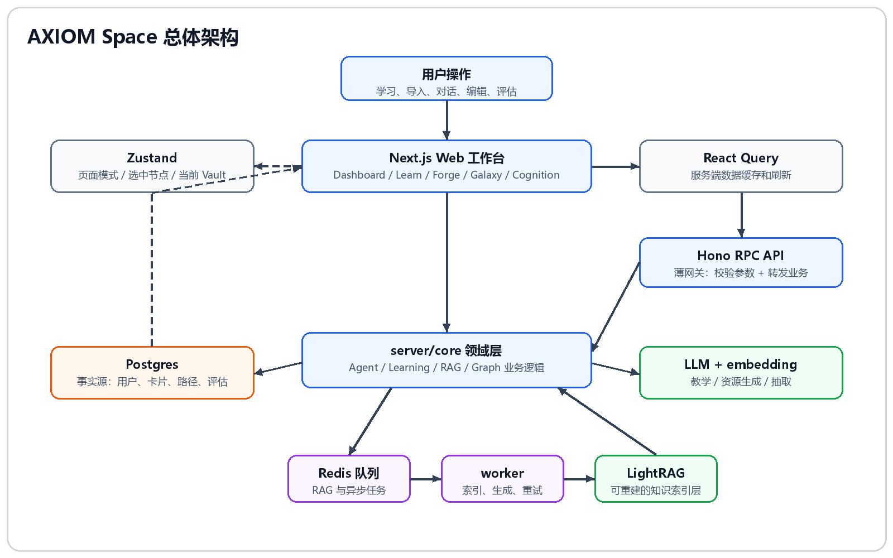

# 01-技术选型

## 这次决策要解决什么

A3 赛题要求的不是单一问答页面，而是一个“基于大模型的个性化资源生成与学习多智能体系统”。结合 SDD，系统必须跑通一条完整学习闭环：

```text
输入主题 / 导入资料
    -> 生成学习路径
    -> 打开步骤进入 Forge
    -> AI 围绕卡片辅导
    -> 用户编辑卡片
    -> 资源生成
    -> 评估掌握情况
    -> Galaxy / Cognition 展示沉淀
```

所以技术选型的核心问题不是“用什么框架更流行”，而是：

1. 如何让页面交互稳定承载 Learn、Forge、Galaxy、Cognition 这些复杂工作台。
2. 如何让卡片、路径、会话、评估、图谱这些对象长期保存并相互关联。
3. 如何让 Agent 的流式输出、工具调用和资源生成进入同一个业务闭环。
4. 如何处理 RAG 索引、资源生成这类耗时任务，不阻塞用户保存和点击。
5. 如何让前后端接口在快速迭代时不失控。

## 最终决策

AXIOM Space 采用 Web 优先的全栈架构：

| 层级 | 技术 | 作用 |
|---|---|---|
| 前端应用 | Next.js + React | 承载 Dashboard、Learn、Forge、Galaxy、Cognition 五个核心页面 |
| API 网关 | Hono RPC | 统一前后端类型推导，避免散乱 fetch 调用 |
| 服务端业务 | TypeScript + Clean Architecture | 把 Agent、学习路径、卡片、图谱、RAG 等业务逻辑放在领域层 |
| 数据库 | Prisma + Postgres | 保存用户、Vault、卡片、路径、会话、评估、图谱等真实数据 |
| 前端服务状态 | React Query | 管理服务端数据缓存和页面刷新 |
| 前端 UI 状态 | Zustand | 管理当前页面模式、选中节点、当前 Vault、图谱布局等交互状态 |
| 后台任务 | Redis + worker | 承接 RAG 索引、资源生成、异步处理等耗时任务 |
| 知识增强 | LightRAG | 将卡片和资料加工成可召回、可关联的知识索引 |
| AI 能力 | LLM + embedding | 支撑教学对话、资源生成、实体关系抽取和知识召回 |

## 总体架构图



图中展示最终边界：页面只通过 Hono RPC 进入业务层；Postgres 保存真实数据；Redis 和 worker 处理耗时任务；LightRAG 只作为可重建的知识索引返回给 Agent 和页面。

## 决策过程

### 方案一：普通 Next.js API + fetch

一开始最直接的做法是：前端页面直接 `fetch('/api/...')`，后端用普通 route handler 返回 JSON。

这个方案实现快，但有几个问题：

1. Learn、Forge、Galaxy、Cognition 都会共享卡片、路径、会话、图谱等类型，接口字段一改，多个页面容易同时坏。
2. Agent 流式消息、资源生成进度、RAG 状态、评估结果这些返回结构比较复杂，纯手写 fetch 容易出现字段不一致。
3. 项目会快速增长，API 如果没有统一薄层，很容易把校验、业务逻辑和数据库操作混在一起。

因此放弃“页面直接 fetch + 后端随写随改”的方式，改用 Hono RPC 做统一 API 边界。

### 方案二：把业务逻辑直接写在 API route 里

第二个可行方案是：Hono route 里直接写路径生成、卡片保存、评估、图谱更新等逻辑。

短期能跑，但长期问题明显：

1. Agent 工具、学习路径、资源生成、RAG 同步都不是单个接口的逻辑，它们会被多个入口复用。
2. 如果业务逻辑依赖 Hono 或 Next.js，上层框架一变，核心能力难迁移。
3. SDD 里很多对象是领域对象：LearningPath、Step、Card、Assessment、Cognition，不应该散落在 API 文件里。

所以最终采用 Clean Architecture：`server/api` 只做校验和转发，核心业务放 `server/core`，具体数据库和外部服务放 `server/infra`。

### 方案三：只用数据库，不接 RAG / worker

如果只保存 Postgres，系统可以完成卡片和路径管理，但 AI 很难稳定“想起”用户之前写过什么。

问题是：

1. 用户保存了卡片，后续问 AI 时，AI 不一定知道这张卡。
2. 导入资料后，资料只是被保存，不能自然参与召回、推荐和图谱增强。
3. 语义相关、隐含关系、知识缺口发现都很难只靠普通 SQL 完成。

因此需要知识增强层。但这里没有把 LightRAG 当主数据库，而是把它放在 Postgres 之后作为派生索引。

### 方案四：把 LightRAG 当主数据源

这个方案也被排除。原因是 LightRAG 适合检索和关系抽取，不适合承担业务事实源。

AXIOM 的真实对象包括：

- 用户和 Vault。
- 卡片原文、类型、标题、星团。
- 学习路径和步骤状态。
- Agent 会话与消息。
- AssessmentResult、PromotionAttempt、DomainEvent。
- Galaxy 边和 Cognition 画像。

这些都需要可审计、可迁移、可重新计算。LightRAG 索引失败或重建时，不应该影响用户真实数据。因此最终确定：

> Postgres 是事实源，LightRAG 是可重建的知识索引层。

### 方案五：所有耗时任务同步执行

如果保存卡片时直接等待 LightRAG 完整索引，用户会遇到明显卡顿。资源生成、文档解析、实体关系抽取也一样。

所以引入 Redis + worker，把耗时任务放到后台：

```text
页面保存卡片
    -> Postgres 立即保存
    -> Redis 入队 rag.indexCard
    -> worker 后台同步 LightRAG
    -> 页面通过 RAG 状态看到结果
```

这个设计让用户操作保持流畅，同时保留失败重试和状态可见性。

## 关键边界

### Postgres 是事实源

用户真实数据只以 Postgres 为准，包括卡片原文、路径步骤、对话记录、评估结果和图谱边。LightRAG、向量库或其他索引层都只是派生数据，可以重建，不能替代主数据库。

### Hono RPC 是唯一 API 入口

页面和 hooks 通过 Hono RPC 访问后端。这样可以保证接口类型和路由定义一致，减少前端直接拼接口造成的错误。

### React Query 管服务端数据，Zustand 管交互状态

React Query 负责 `learning-paths`、`galaxy`、`cognition`、`rag-card-status` 等服务端数据。Zustand 负责当前页面模式、选中卡片、图谱布局、活动学习步骤等 UI 状态。

### Redis 只做后台任务，不存长期知识

Redis 用来排队和重试耗时任务，例如卡片同步到 LightRAG、资源生成状态恢复等。长期知识仍回到 Postgres。

## 落到页面上的具体效果

1. 在 Learn 点击“生成任务路径”，页面出现真实路径、步骤状态、进度条和卡片绑定。
2. 点击“进入 AI 工作台处理”，Forge 自动绑定同一张卡片和同一个 Agent session。
3. 在 Forge 保存卡片后，右侧 Card Editor 显示 RAG 状态：等待同步、索引中、已进入知识库或同步失败。
4. 资源生成时，聊天区显示 Resource Generation 进度，不让用户长时间无反馈。
5. 卡片升级、步骤完成、资料导入后，Dashboard、Galaxy、Cognition 会刷新对应数据。

## 总结

AXIOM Space 的技术选型围绕“学习闭环”展开。Next.js 承载多页面交互，Hono RPC 保证前后端类型一致，Postgres 保存真实学习数据，Redis 处理后台任务，LightRAG 负责知识增强。这样系统不是一次性生成资料，而是能把用户的操作持续沉淀为路径、卡片、图谱和画像。
