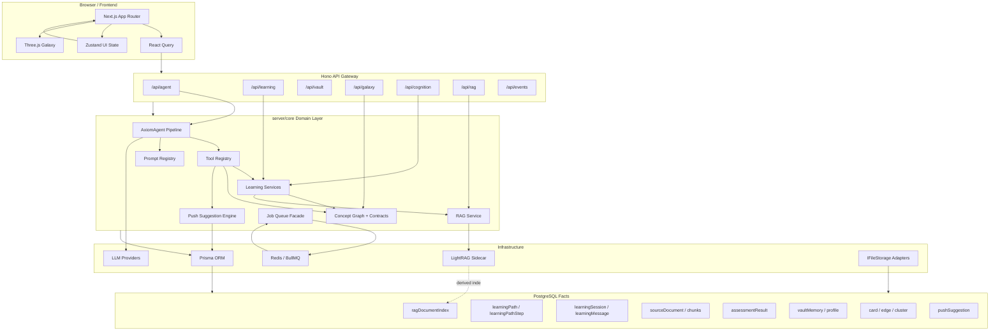

# 01-技术架构说明

本文档面向技术评审和软件工程人员，说明 AXIOM Space 的技术架构、数据链路、运行时边界和关键技术选型。它不是产品介绍文档，而是回答一个工程问题：

> 系统底层数据如何被保存、索引、推理、编排，并最终形成前端可操作的学习工作台？

## 1. 系统定位

AXIOM Space 不是单页 AI Chat，也不是单纯的资料生成器。它是一个围绕“学习对象”运行的 Web 工作台：

```text
资料 / 对话 / 用户操作
  -> 卡片、路径、会话、图谱、画像、资源、评估
  -> Agent 读取和操作这些对象
  -> 页面把对象状态重新展示给用户
```

核心工程目标：

1. 所有学习数据必须可持久化、可追溯、可重新计算。
2. Agent 不能只生成文本，必须能调用工具操作系统数据。
3. RAG 只能作为知识增强层，不能替代业务数据库。
4. 前端页面必须能承载复杂工作流：路径规划、卡片编辑、AI 对话、图谱、画像、资源推送。
5. 长耗时任务不能阻塞用户主交互。

## 2. 技术栈总览

| 层级 | 技术 | 职责 |
|---|---|---|
| 前端框架 | Next.js 14 + React | App Router 页面、工作台 UI、客户端交互 |
| UI 组件 | Tailwind CSS + shadcn/radix + lucide-react | 工作台布局、控件、图标、弹窗、表单 |
| 3D/图谱渲染 | Three.js | Galaxy 知识图谱可视化 |
| 服务端 API | Hono | `/api/*` 统一路由、RPC 类型推导、薄网关 |
| 服务端语言 | TypeScript | 前后端共享类型习惯，降低接口漂移 |
| ORM | Prisma | 数据模型、查询、事务、关系约束 |
| 主数据库 | PostgreSQL | 业务事实源：用户、Vault、卡片、路径、会话、评估、图谱 |
| 前端服务端状态 | React Query | API 数据缓存、失效刷新、后台同步 |
| 前端 UI 状态 | Zustand | 当前模式、选中节点、会话、图谱布局、面板状态 |
| 认证 | Better Auth | 登录态、用户身份、会话鉴权 |
| AI 模型接入 | AIManager + pi-ai | LLM 调用、模型配置、流式输出、资源生成 |
| Agent 运行时 | pi-agent-core + AXIOM Agent Pipeline | 消息循环、工具调用、上下文注入、守卫、子 Agent |
| RAG | LightRAG | 卡片/资料的派生知识索引和语义召回 |
| 后台任务 | BullMQ + Redis | RAG 索引、重建、异步任务、失败重试 |
| 资源生成 | HTML/PPT/PDF/DOCX/视频渲染相关库 | 多类型学习资源产物 |

## 3. 从底层到应用的架构分层

系统按依赖方向分层：越底层越接近事实和基础设施，越上层越接近用户交互。

```text
浏览器 UI
  -> React hooks / Zustand / React Query
  -> Hono API
  -> server/core 领域服务
  -> Prisma / Redis / LightRAG / LLM
  -> PostgreSQL 事实源
```

### 3.1 基础设施层

基础设施层负责外部系统和持久化能力：

- PostgreSQL：保存所有业务事实。
- Redis：作为 BullMQ 队列后端。
- LightRAG：作为可重建的知识索引服务。
- LLM Provider：提供对话、抽取、规划、评估、资源生成能力。
- 本地/DB 文件存储适配器：通过 `IFileStorage` 抽象卡片式文件读写。

对应代码：

- `lib/db.ts`
- `prisma/schema.prisma`
- `server/infra/storage/*`
- `server/infra/rag/lightrag-client.ts`
- `server/core/jobs/*`

### 3.2 数据事实层

PostgreSQL 是系统唯一事实源。所有可被用户看到、编辑、追踪、审计的对象都必须落在数据库中。

主要模型：

| 数据对象 | Prisma 模型 | 说明 |
|---|---|---|
| 知识库 | `vault` | 用户工作空间 |
| 卡片 | `card` | 文献卡、灵感卡、永久卡的统一实体 |
| 图谱边 | `edge` | 卡片之间的 contains/related/prerequisite 等关系 |
| 星团 | `cluster` | Galaxy 中的知识域分组 |
| 学习路径 | `learningPath` | 一条可推进路径 |
| 路径步骤 | `learningPathStep` | 绑定卡片、状态、掌握度和前置条件 |
| Agent 会话 | `learningSession` | 普通对话、卡片线程、路径步骤线程 |
| 会话消息 | `learningMessage` | 用户/AI 消息持久化 |
| 来源资料 | `sourceDocument` / `sourceDocumentChunk` | 导入资料原文和分块追溯 |
| RAG 索引状态 | `ragDocumentIndex` | LightRAG 同步状态，不是事实源 |
| 学习评估 | `assessmentResult` | 练习、费曼、测评结果 |
| 用户观察 | `vaultMemory` | 画像观察、系统通知、提示词摘要等 |
| 推送建议 | `pushSuggestion` | 连接推送、资源/任务推送 |
| 路径调整 | `PathAdjustmentHistory` | 基于评估或进度的路径调整记录 |

关键原则：

```text
PostgreSQL 保存事实。
LightRAG 保存可重建索引。
Redis 保存任务队列状态。
前端缓存不能作为事实源。
```

### 3.3 领域层

领域层放在 `server/core`，它不应该依赖 React，也不应该把业务规则写死在 API route 中。

主要领域模块：

| 模块 | 位置 | 职责 |
|---|---|---|
| Agent 引擎 | `server/core/agent` | 对话循环、工具调用、上下文注入、子 Agent、守卫 |
| AI Prompt 系统 | `server/core/ai/prompts` | 任务提示词、契约、输出格式约束 |
| 学习路径 | `server/core/learning` | 文档导入、路径调整、画像上下文、费曼记录 |
| 图谱/概念 | `server/core/domain/concept-graph.ts` | 根节点、contains 边、概念卡创建 |
| 质量契约 | `server/core/domain/contracts.ts` | 卡片质量、步骤状态、清晰准确必要标准 |
| 资源推送 | `server/core/push` | 连接建议、资源建议、任务组建议 |
| RAG 服务 | `server/core/rag` | LightRAG 同步、查询、生成上下文 |
| 后台任务 | `server/core/jobs` | BullMQ 队列和 worker |

领域层的目标是：同一套业务能力可以被页面、Agent 工具、后台任务共同复用。

### 3.4 API 网关层

API 层使用 Hono。它的职责是鉴权、参数校验、调用领域服务、返回 JSON 或 SSE。

路由分组：

| Route | 职责 |
|---|---|
| `/api/agent` | Agent 对话、会话列表、卡片线程、工具确认、SSE 流 |
| `/api/learning` | 学习路径、资料导入、进度更新、评估、推送建议 |
| `/api/galaxy` | 知识图谱数据、卡片关系 |
| `/api/cognition` | 认知画像、观察记录、画像反馈 |
| `/api/rag` | RAG 状态、同步、重建 |
| `/api/vault` / `/api/vaults` | Vault 和卡片管理 |
| `/api/events` | 服务端通知事件流 |
| `/api/dashboard` | 工作台统计 |

前端不直接访问数据库，也不绕过 Hono route。

### 3.5 前端应用层

前端是一个多面板工作台，而不是传统网页表单。

主要页面/组件：

| UI 区域 | 组件 | 技术职责 |
|---|---|---|
| Learn 路径规划 | `components/learn/learn-workspace.tsx` | 路径生成、资料导入、步骤推进、推送箱 |
| Forge 工作台 | `components/forge/forge-chat.tsx` / `forge-editor.tsx` | Agent 对话、卡片编辑、资源预览、自动保存 |
| Galaxy 图谱 | `components/three/galaxy-canvas.tsx` | Three.js 知识图谱 |
| Cognition 画像 | `components/cognition/*` | 六维画像、观察证据、用户反馈 |
| 资源展示 | `components/resources/resource-cards.tsx` | 文档、思维导图、测验、视频、PPT 等预览 |
| 全局布局 | `app/page.tsx` / `app/providers.tsx` | 模式切换、Provider、面板布局 |

状态分工：

```text
React Query:
  learning-paths / galaxy / cognition / rag status / push suggestions

Zustand:
  selectedNode / selectedPathId / activeLearningStepId / sessionId / layout state
```

## 4. 关键运行时链路

### 4.1 资料导入链路

```text
用户粘贴文本或选择文件
  -> 前端转换为 Markdown 或内嵌附件 Markdown
  -> POST /api/learning/import-document
  -> document-import-service
  -> sourceDocument/sourceDocumentChunk 保存原始资料
  -> card(type=literature) 保存文献 MD 节点
  -> AI 尽力抽取概念和关系
  -> card(type=fleeting) 生成灵感草稿
  -> edge 写入 contains/related 等关系
  -> learningPath + learningPathStep 生成学习路径
  -> React Query 失效刷新 Learn/Galaxy/Cognition
```

工程边界：

- 文献卡必须先保存，AI 抽取失败不能导致原文丢失。
- 文件能转成 Markdown 就转；不能转则以内嵌附件形式保存到 Markdown。
- `sourceDocument` 保存可追溯原文，`card(type=literature)` 是用户可见节点。

### 4.2 学习路径生成链路

```text
用户输入主题
  -> /api/learning/generate
  -> 读取已有 card/edge/capability/profile
  -> 可选读取 LightRAG 上下文
  -> AI 生成概念拆解和步骤
  -> 创建 cluster/card/edge
  -> 创建 learningPath/learningPathStep
  -> 触发 pushSuggestionEngine 扫描
  -> 前端刷新路径和图谱
```

学习路径不是纯文本结果，它会落成数据库对象。

### 4.3 Agent 对话链路

```text
ForgeChat 发送消息
  -> POST /api/agent/chat
  -> 校验 learningSession
  -> hydrate 历史 learningMessage
  -> 注入画像、卡片、RAG、工具上下文
  -> AxiomAgent.runStream
  -> 工具调用 / LLM 流式输出
  -> SSE 返回 text/tool/resource/rag/profile_question
  -> learningMessage 持久化
  -> BackgroundAnalyzer 更新画像观察
  -> 前端刷新相关查询
```

Agent 的关键能力不是“回答”，而是“在受控工具系统内操作业务对象”。

### 4.4 卡片保存与 RAG 同步链路

```text
用户编辑卡片
  -> /api/vault/cards/:id
  -> card.content 更新到 PostgreSQL
  -> enqueue rag.indexCard
  -> BullMQ/Redis
  -> worker 调用 syncCardToLightRAG
  -> LightRAG 建索引
  -> ragDocumentIndex 更新状态
  -> 前端显示 pending/indexing/indexed/failed
```

RAG 同步失败不会影响卡片保存。RAG 可重建，数据库不可丢。

### 4.5 资源生成链路

```text
用户请求资源
  -> Agent 调用 push_resource 工具
  -> resource-generation orchestrator
  -> 读取用户画像、当前卡片、RAG 上下文
  -> 按资源类型调用对应 prompt/render pipeline
  -> 生成 document/mindmap/quiz/code/video/svg/ppt/pdf/docx 等
  -> 保存资源 manifest 和 literature/card 记录
  -> SSE resource_progress 推送进度
```

资源生成由 Agent 工具触发，结果必须能回到工作台，而不是只存在于对话文本里。

### 4.6 画像与主动追问链路

```text
每轮 Agent 对话结束
  -> BackgroundAnalyzer 分析用户表达
  -> vaultMemory 写入 profile_* observation
  -> profile-context 聚合六维画像
  -> profile-questioner 判断是否必须追问
  -> 若当前是卡片线程：问题写入普通 Agent 会话
  -> 若当前是普通对话：问题追加在当前会话
```

主动追问的边界：

- 概念解释不追问。
- 路径、资源、推送、评估等高个性化任务才追问。
- 卡片会话不被画像问题污染。

### 4.7 评估与路径调整链路

```text
Agent 工具生成测验 / 费曼评估
  -> assessmentResult 保存结果
  -> path-adjustment-engine 判断是否需要复习、跳过、降难度
  -> PathAdjustmentHistory 记录调整
  -> learningPathStep 状态和 mastery 更新
  -> 推送建议重新扫描
```

评估结果是路径调整和资源推送的输入，不只是一次性反馈。

## 5. AI 子系统结构

AI 子系统由五部分组成：

1. `AIManager`：统一 LLM 调用入口。
2. Prompt Registry：所有任务 prompt 有 ID、契约、输入、输出、正确/错误标准。
3. AxiomAgent Pipeline：负责消息循环、上下文构造、工具调用、压缩、守卫。
4. Tool Registry：把业务能力暴露给 Agent，例如卡片、路径、资源、评估、推送。
5. Guardrails：文件安全、输出结构、事实校验、工具确认。

Agent 工具不是前端按钮的替代品，而是让 LLM 在后端受控地调用系统能力。

## 6. RAG 的技术边界

RAG 在 AXIOM 中只解决“知识召回和上下文增强”。

它参与：

- Agent 回答时检索已有卡片和资料。
- 学习路径生成时提供参考上下文。
- 资源生成时提供用户已有知识和资料片段。
- 导入资料后作为后续问答的知识索引。

它不负责：

- 保存卡片事实。
- 保存路径状态。
- 保存用户画像。
- 判断步骤是否完成。
- 替代 PostgreSQL 查询。

因此 LightRAG 可以关闭、失败、重建；系统的主数据仍然完整。

## 7. 异步任务设计

异步任务使用 BullMQ + Redis。当前主要用于 RAG 索引：

```text
enqueueRagIndexCard(cardId)
  -> queue: axiom
  -> worker: rag.indexCard
  -> syncCardToLightRAG
  -> update ragDocumentIndex
```

设计原因：

- 卡片保存必须快速完成。
- RAG 索引可能慢、失败、重试。
- 用户需要看到索引状态，而不是等待一个长请求。

后续资源渲染、批量导入、全库重建也可以进入同一队列模型。

## 8. API 和类型边界

前端数据访问集中在 `hooks/*`：

- `use-learning.ts`
- `use-agent.ts`
- `use-galaxy.ts`
- `use-cognition.ts`
- `use-dashboard.ts`

这些 hook 通过 `lib/api-client.ts` 访问 Hono RPC。这样可以控制：

1. 页面不直接拼裸 fetch。
2. API 返回结构集中处理。
3. React Query 失效策略集中管理。
4. 前端组件只消费业务对象，不关心底层 API 细节。

## 9. 技术架构图草案

下面是用于后续生成技术架构图的结构草案：



## 10. 当前架构判断

AXIOM Space 的核心技术取舍是：

- 用 PostgreSQL 承担事实源，保证学习对象真实可追溯。
- 用 Hono RPC 管住 API 边界，避免前端和后端接口漂移。
- 用 `server/core` 承载领域逻辑，避免业务散落在 UI 或 route 中。
- 用 Agent 工具系统把 AI 接入真实数据操作。
- 用 LightRAG 增强召回，但不让它成为主数据库。
- 用 Redis/BullMQ 承接长耗时任务，保护用户交互流畅性。
- 用 React Query + Zustand 分开服务端数据和 UI 状态。

从技术角度看，系统是一个“数据库事实源 + Agent 工具编排 + RAG 派生索引 + 多面板前端工作台”的组合架构。
