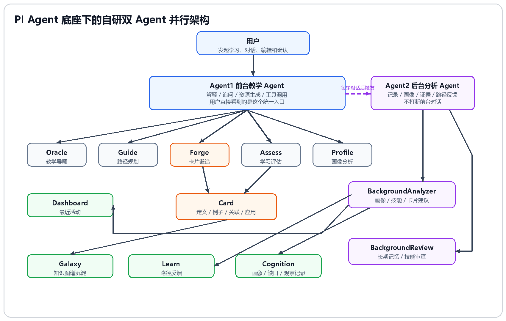
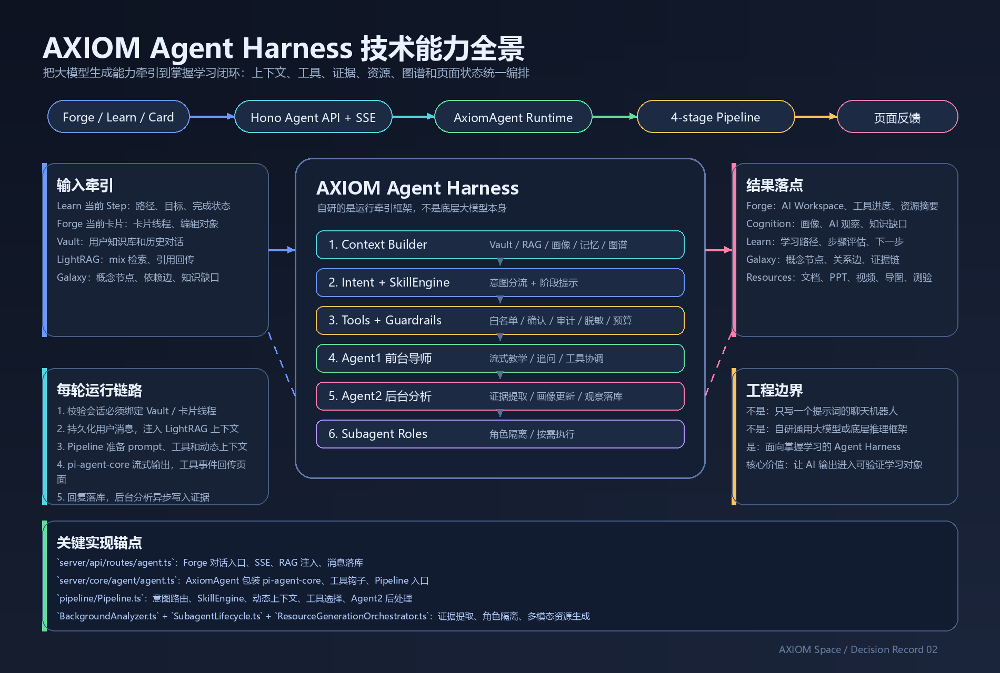

# 02-自研垂直领域 Agent

> 文件名保留原始命名。本文档说明 AXIOM Space 为什么没有只做一个普通聊天 Agent，而是设计成面向学习场景的 AXIOM Agent Harness。

## 这次决策要解决什么

A3 赛题要求的是“个性化资源生成与学习多智能体系统”，不是普通 AI 问答。系统至少要覆盖：

1. 对话式学习画像构建。
2. 多智能体协同资源生成。
3. 个性化学习路径规划。
4. 智能辅导。
5. 学习效果评估。

如果只做一个聊天机器人，它可以回答问题，但很难稳定完成这些任务。AXIOM 的目标是让用户从“看过资料”走向“真正掌握”，所以 Agent 必须参与路径、卡片、资源、评估、画像和图谱的持续更新。

## 最终决策

AXIOM Space 在 PI Agent 底座思路下实现自研 AXIOM Agent Harness，并在其中组织双 Agent 并行机制和教育场景专用子 Agent。

AXIOM Space 在 PI Agent 底座上自研了一套面向掌握学习场景的 Agent Harness。Agent1 负责前台教学对话，Agent2 负责后台记录、画像更新、证据分析和路径反馈，系统统一编排工具、知识库、路径、卡片和页面状态。

这里的 Agent Harness 指智能体编排与运行框架，不是大模型本身，也不是单个 Agent。它负责把 Agent、工具调用、RAG、知识图谱、长期画像、学习路径、卡片状态和页面反馈串成一个可运行、可追踪、可验证的学习系统。

## Harness 到底怎么“牵引”

`Harness` 的原意是马具或牵引装置。放在 AXIOM Space 里，它的意思不是“多放几个 Agent”，而是把大模型原本发散的生成能力牵引到掌握学习流程里。

AXIOM Agent Harness 牵引的不是模型参数，而是模型的行为边界、任务方向和结果落点。

具体体现在七个环节：

| 牵引环节 | 系统做法 | 页面证据 |
|---|---|---|
| 入口牵引 | 用户不是空白聊天，而是从 Learn 的任务步骤、Forge 的当前卡片或某个知识节点进入对话 | `Current Focus` 显示当前任务组、步骤、卡片 |
| 上下文牵引 | Harness 为 Agent 装配当前 Vault、任务、卡片、历史对话、RAG 召回和相关知识节点 | 回复围绕当前学习对象，不是泛泛回答 |
| 角色牵引 | Agent1 只负责前台教学和工具协调；Agent2 只负责后台证据提取、画像更新和路径反馈 | 用户只看到一个前台导师，后台变化体现在 Cognition / Dashboard |
| 工具牵引 | AI 不能直接改写系统事实，必须通过卡片保存、资源生成、路径评估、图谱链接等工具或领域对象落地 | 保存卡片、生成资源、建立链接、标记完成都有明确按钮和状态 |
| 证据牵引 | Agent2 把对话转成结构化观察：本轮摘要、薄弱点、掌握证据、画像变化、下一步建议 | `AI 观察记录`、知识缺口、认知维度变化 |
| 反馈牵引 | 观察结果反过来影响 Guide、Assess、Forge 和下一轮 Agent1 回复 | Learn 路径、评估结果、资源推荐随学习证据调整 |
| 知识牵引 | 用户保存的卡片进入 RAG 和知识图谱，成为后续回答和路径规划的长期依据 | RAG 状态、Galaxy 节点、关系边、相关卡片推荐 |

所以这套 Harness 的核心不是“两个 Agent 并行”这个表述，而是一条持续运行的牵引链路：

```text
用户意图 / Learn 当前步骤 / Forge 当前卡片
    -> Harness 装配任务上下文、学习证据和知识召回
    -> Agent1 前台教学、追问、解释、调用工具
    -> 用户输出卡片、回答或资源需求
    -> Agent2 后台提取证据、更新画像、识别薄弱点
    -> 写入 Cognition / Dashboard / Learn / Galaxy
    -> Guide、Assess、Forge 读取新状态
    -> 下一轮对话、路径和资源推荐被重新约束
```

简要说明：

> AXIOM Agent Harness 像一套智能体马具：它把大模型的生成能力牵引到具体学习对象上，用任务、卡片、工具、证据、RAG 和图谱约束它的方向，让 AI 的每次输出都进入可追踪的学习闭环，而不是停留在一次性聊天。

## Agent 架构图



架构图展示一个关键决策：用户只直接面对 Agent1；Agent2 在后台工作，通过 Cognition、Dashboard、Learn、Galaxy 的状态变化体现价值。



能力全景图补充技术实现层：AXIOM 不是把两个聊天机器人并排放在页面上，而是在一个 Agent Harness 里完成会话约束、上下文装配、意图判断、工具治理、后台证据分析、多模态资源生成和页面状态反馈。

## 用户视角：这些设计实际解决什么

Agent Harness 的每个设计都必须对应到学生的具体学习收益。下面这张表不按代码模块解释，而是按用户真实使用时遇到的问题解释：这个技术设计为什么存在，它最后在页面上帮助用户完成什么。

| 功能 / 技术设计 | 用户原本遇到的问题 | AXIOM 的设计 | 用户得到的具体帮助 | 页面落点 |
|---|---|---|---|---|
| 学习对象绑定 | 普通 AI 聊天每次都要重新交代背景，问答容易跑题 | 对话必须绑定 Vault、Session、Card Thread 或 Learn 当前步骤 | 用户在某个知识点、任务步骤或卡片中提问时，AI 自动知道当前讨论对象，回答不会脱离正在学的内容 | Forge `Current Focus`、Learn 步骤、卡片线程 |
| Agent1 前台教学 | 用户需要即时解释、追问、举例和纠错，不希望被后台分析打断 | Agent1 专注前台对话和教学工具调用 | 用户看到的是一个连续的学习导师，可以围绕当前概念一边问、一边写、一边修正 | Forge `AI Workspace`、流式回复、工具状态 |
| Agent2 后台分析 | 用户不会主动维护画像，也很难自己整理薄弱点 | Agent2 在每轮对话后提取证据、更新画像、识别知识缺口 | 用户不需要填表，系统会从真实表达中整理出薄弱点、学习偏好和下一步建议 | Cognition `AI 观察记录`、知识缺口、认知维度 |
| LightRAG 检索增强 | AI 只凭通用知识回答，容易忽略用户自己的资料和卡片 | 回答前检索当前 Vault 中的卡片、文件和知识上下文 | 用户问问题时，回答能引用自己保存过的内容，学习不会被割裂成一次次孤立聊天 | RAG 引用、相关卡片、资料来源 |
| 动态上下文装配 | 同一个问题对不同基础的学生应该有不同解释方式 | 每轮注入画像、最近活动、已掌握概念、到期复习、图谱路径 | 用户不用反复说明“我学到哪里了”，系统会按当前水平调整解释深度和例子 | Forge 回复、Learn 下一步、复习提醒 |
| 意图识别与工具筛选 | 用户一条输入里可能是提问、生成资料、创建卡片或调整路径 | `IntentRouter` 判断意图，并只开放本轮需要的工具集合 | 用户用自然语言表达需求即可；系统减少误操作，也避免把简单提问变成错误写入 | 工具执行状态、确认提示、资源生成入口 |
| 工具治理与写入前检查 | AI 如果直接改知识库，容易产生错误卡片、误删内容或污染长期记忆 | 工具调用经过 guardrail、checkpoint、脱敏、结果截断和审计 | 用户可以让 AI 协助整理资料，但关键写入有边界，知识库更稳定 | 保存按钮、工具结果、卡片质量检查 |
| 多模态资源生成管线 | 学生围绕一个知识点需要讲解、导图、练习、代码和脚本，不想分别找工具 | `push_resource` 统一进入资源编排、生成、校验、保存和预览流程 | 用户输入一个主题后，可以得到多种学习材料，并能直接预览、下载或沉淀为卡片 | Resource 进度、预览文件、资源摘要 |
| 学习路径与 Guide | 用户知道要学一个主题，但不知道先学什么、后学什么 | Guide 读取画像、已有知识、图谱关系和薄弱点来组织路径 | 用户得到的是可执行的学习顺序，而不是一堆散乱资料 | Learn 路径、步骤状态、下一步 |
| Assess 学习评估 | 用户点了完成不代表真的掌握，系统也不能只靠 AI 口头判断 | Assess 要求用户解释、做题或完成检查，再结合 Agent2 证据更新状态 | 用户能看到自己哪里会、哪里模糊，路径推进有依据 | Learn 评估结果、掌握状态、薄弱点 |
| GraphIntegration / Galaxy | 用户保存了很多卡片后，很难看清知识之间的关系 | 卡片、路径、RAG 关系和证据进入知识图谱 | 用户能看到当前概念周围有哪些前置、后续、证据和相关卡片，知道下一步往哪里走 | Galaxy 节点、关系边、证据视图 |
| Memory / Profile | 长期学习中，用户的目标、偏好和薄弱点会变化 | MemoryManager、BackgroundAnalyzer、Profile 共同维护长期画像 | 用户越用系统，后续解释、推荐和评估越贴近自己的学习状态 | Cognition 画像、Dashboard 活动、个性化推荐 |
| SSE 与页面同步刷新 | AI 生成耗时任务时，如果页面没反馈，用户不知道系统在做什么 | 流式输出 `text`、`tool_start`、`tool_end`、`resource_progress`，结束后刷新相关查询 | 用户能看到系统正在搜索、生成、保存还是评估；完成后其他页面同步更新 | 流式消息、资源进度、Dashboard / Learn / Galaxy 刷新 |
| 子 Agent 角色系统 | 讲解、路径、资源、画像、评估混在一个提示词里，结果容易不稳定 | Oracle、Profile、Forge、Guide、Assess 按能力边界分工，按需调用 | 用户仍然只面对一个工作台，但背后不同任务由对应能力处理，输出更稳定 | Forge、Learn、Cognition、Resources、Galaxy |

因此，AXIOM 的 Agent 设计不是为了展示复杂架构，而是为了让学生在一个连续流程里完成四件事：知道自己学到哪里、得到合适的解释和资源、把理解沉淀成卡片、用证据推动下一步学习。

## 实现链路：我们具体设计了什么

AXIOM 的 Agent 设计可以按一次真实交互来理解。用户在 Learn 打开一个步骤，或在 Forge 选中一张卡片后发问，系统并不是直接把当前输入丢给大模型，而是先把它放进一个可追踪的学习现场。

```text
页面学习对象
    -> Hono Agent API 校验 Vault / Session / Card Thread
    -> LightRAG 检索增强
    -> AxiomAgent Runtime 装配服务、工具、上下文
    -> AgentPipeline 判断意图、选择工具、注入记忆与图谱
    -> PI Agent 底座流式输出与执行工具
    -> Agent2 后台分析证据
    -> DB / Cognition / Dashboard / Learn / Galaxy / Resources 更新
```

这条链路就是 AXIOM Agent Harness 的真实边界。PI Agent 提供底层 Agent 运行能力；AXIOM 自研的是外层掌握学习 Harness，也就是把模型能力牵引到学习对象、系统工具、长期证据和页面闭环上的那一层。

### 1. 页面入口：先绑定学习对象，再进入对话

前端入口在 `hooks/use-agent.ts`。它做的第一件事不是发送消息，而是确认这次对话属于哪个 Vault、哪个会话、哪个卡片线程。

关键设计：

| 设计点 | 实现方式 | 为什么这样做 |
|---|---|---|
| 必须有当前 Vault | 没有 `currentVaultId` 时直接提示用户选择知识库 | 防止 AI 输出无法落到任何知识库 |
| 卡片线程优先 | 选中节点后调用 `openCardThread(selectedNode)` | 让 Forge 对话围绕当前学习对象，不变成普通闲聊 |
| 永久卡片不可继续写旧线程 | 选中 permanent 卡片时提示新建 Fleeting 卡片继续讨论 | 避免已沉淀知识被随意改写 |
| SSE 逐步回放 | 前端手动读取 `/api/agent/chat` 流 | 页面可以同时展示文本、工具状态、资源进度和 RAG 引用 |
| 交互后刷新工作台 | 对话完成后 invalidate `galaxy`、`dashboard-stats`、`learning-paths`、`learning-profile`、`cognition`、`observations`、`knowledge-gaps` | Agent2 的后台结果能立刻反映到其他页面 |

这也是页面需要明确体现的交互：用户不是进一个空白 ChatGPT，而是从 Learn 的步骤、Forge 的卡片、Galaxy 的知识节点进入同一个 Agent 工作台。

### 2. API 入口：会话、Vault 和 LightRAG 先行

后端入口在 `server/api/routes/agent.ts` 的 `/chat`。这里是 Harness 的第一道硬约束。

具体流程：

1. `requireAuth` 确认用户身份。
2. Zod 校验 `message`、`sessionId`、`oracleId`、`vaultId`。
3. `resolveAgentVaultId` 解析用户当前 Vault。
4. `runWithAgentContext({ userId, vaultId })` 把用户和知识库上下文绑定到本轮工具执行环境。
5. 如果没有显式 `sessionId`，直接拒绝：`Forge 对话必须绑定到具体卡片线程。请先选择一张卡片。`
6. 读取 `learningSession`，检查会话归属、状态和卡片线程合法性。
7. `hydrateAgentFromDb(agent, dbSessionId)` 读取最近 40 条历史消息，恢复上下文。
8. `persistMessage(dbSessionId, 'user', message)` 先落库用户消息。
9. `buildRagEnhancedMessage(message, vaultId)` 在环境变量 `LIGHTRAG_CHAT_CONTEXT=true` 时调用 LightRAG `mix` 检索，把召回内容注入到用户问题前。
10. `agent.runStream(ragEnhanced.message, callbacks)` 进入 AxiomAgent 主循环。
11. 将 `text`、`tool_start`、`tool_end`、`resource_progress`、`rag_context` 等事件用 SSE 回传前端。
12. 回复完成后把 assistant 消息落库，并对普通会话尝试自动命名。

这个入口决定了 AXIOM 的回答不是“只看当前输入”，而是同时被用户身份、Vault、会话线程、LightRAG 召回和历史消息约束。

### 3. Runtime 组合根：Agent 不是一个类，而是一组服务

`server/core/agent/pipeline/AgentServices.ts` 的 `createAgentServices` 是 AXIOM Agent Harness 的组合根。它把一次 Agent 运行所需的能力装配到同一个服务对象中。

| 服务 | 具体能力 | 作用 |
|---|---|---|
| Config | 默认 system prompt、模型、thinkingLevel、toolExecution、maxRetries、maxIterations、contextLength | 统一运行参数 |
| StateMachine | `IDLE / PLANNING / EXECUTING / REFLECTING / DONE` 等状态流转 | 页面调试和审计可观测 |
| AuditLogger | 状态、工具、守卫日志 | 证明系统不是黑箱调用 |
| CheckpointManager | 写入前快照 | 降低文件/卡片写入风险 |
| UsageTracker / CredentialPool | 用量追踪、密钥池、辅助模型 | 支撑长会话和后台任务 |
| IterationBudget | 最大迭代和 grace call | 防止 Agent 无限循环 |
| ContextCompressor | 上下文压缩 | 处理长上下文 |
| MemoryManager | 记忆、能力追踪、知识图谱 provider | 让对话结果进入长期学习记忆 |
| PrismaLearningAdapter | 学习轨迹、路径、画像、图谱相关 DB 操作 | 让 Agent 结果可落库 |
| PatternExtractorAdapter | 学习模式提取 | 用用户行为反向影响后续教学 |
| GraphIntegrationManager | 概念图谱与学习路径推荐 | 把知识点连接关系注入下一轮对话 |
| LearningFacade | 学习系统统一门面 | 让 Agent 访问路径、评估、图谱能力 |

默认配置也体现了 Harness 的方向：`toolExecution` 是 `parallel`，`enableMemory`、`enableBudget`、`enableCompression`、`enableTrajectory` 默认开启，`contextLength` 默认按长上下文设计。这说明它不是一次性问答，而是面向持续学习过程。

### 4. AxiomAgent：PI Agent 底座外的自研包装层

`server/core/agent/agent.ts` 里的 `AxiomAgent` 继承 `Interruptible`，内部创建 `@mariozechner/pi-agent-core` 的 `Agent`。PI Agent 负责底层消息循环和工具执行，AXIOM 在外面加了掌握学习所需的运行规则。

自研包装点包括：

| 包装点 | 代码位置 | 技术含义 |
|---|---|---|
| PromptService | `convertToLlm`、`transformContext` | 把 AXIOM 的 system prompt、项目上下文、画像、记忆整理成模型可用上下文 |
| Context-bound tools | `_getContextBoundTools()` | 工具执行时携带当前用户和 Vault，避免跨知识库写入 |
| beforeToolCall | `_onBeforeToolCall` | 执行工具前先经过 plugin hook、guardrail 和写入前 checkpoint |
| afterToolCall | `_onAfterToolCall` | 工具结果脱敏、截断、审计、错误重试 |
| BackgroundAnalyzer | `_backgroundAnalyzer` | 每轮之后异步抽取画像、技能、卡片和观察 |
| BackgroundReview | `_backgroundReview` | 每 N 轮 fork 一个后台审查过程，整理长期记忆和技能 |
| Subagent spawn | `spawnRoleAgent`、`sessions_spawn` | 在需要隔离上下文或并行处理时启动角色子 Agent |
| Pipeline 主循环 | `runStream()` | 不直接调用模型，而是先走四阶段 Pipeline |

所以 AXIOM 不是说“我们训练了一个新模型”，而是说“我们自研了一套垂直学习场景的 Agent Harness”，它包住 PI Agent 底座，把底层 Agent 牵引到业务闭环里。

### 5. 四阶段 Pipeline：每轮怎么思考和决策

`server/core/agent/pipeline/Pipeline.ts` 把一次 Agent 回复拆成四个阶段。这个设计集中体现了系统的运行细节。

| 阶段 | 做什么 | 关键决策 |
|---|---|---|
| `prepareMessages` | 状态机进入 `PLANNING`，重置本轮 checkpoint 和空回复处理器 | 每轮都重新规划，不沿用上一轮的临时状态 |
| `prepareMessages` | 读取最近 3 条消息，调用 `classifyIntentSmart` 判断 `chat / learn / create / analyze / manage / profile` | 用规则快速判断，模糊时用辅助 LLM 仲裁并抽取 slots |
| `prepareMessages` | 低置信破坏性意图注入确认提示 | 创建、删除、写入类动作不能直接执行 |
| `prepareMessages` | 激活 `SkillEngine`：学习意图进入 `axiom-learning`，PPT/资源生成进入 `axiom-ppt` | 让 Agent 有阶段性任务意识，而不是每轮从零开始 |
| `prepareMessages` | `buildSystemPrompt()` 注入 active skill、项目上下文、用户画像和用户技能 | 前台导师会继承后台画像和历史技能 |
| `prepareMessages` | `selectToolsForTurn()` 按意图筛工具 | 学习、生成、分析、管理看到的工具不同，降低误调用 |
| `prepareMessages` | 预算检查、轨迹模式提取、记忆预取、动态上下文、图谱路径推荐 | 把“用户正在学什么、已经懂什么、哪里薄弱”放进本轮输入 |
| `callLLM` | 订阅 PI Agent 事件并流式输出 | 文本、思考、工具开始、工具结束都能被页面接收 |
| `executeTools` | 工具由 PI Agent 底座执行，但被 AXIOM 的工具钩子治理 | Harness 负责边界，底座负责执行循环 |
| `postTurnProcessing` | 同步记忆、触发自动评估、记录轨迹、更新图谱、启动 Agent2 | 本轮对话结束后立即进入后台证据沉淀 |

这一段可以解释“Agent 怎么思考”：它不是只有一个 prompt，而是先判断意图，再决定是否需要确认，再决定启用哪个 Skill 阶段，再决定给模型哪些工具，再把记忆、RAG、图谱和画像注入进去，最后才调用底层模型。

### 6. 上下文装配：让模型进入学习现场

AXIOM 的上下文分三层装配。

第一层是 API 层 LightRAG。`buildRagEnhancedMessage` 会在 `LIGHTRAG_CHAT_CONTEXT=true` 时使用 `queryLightRAGContext`，以 `mix` 模式检索知识库，并把结果包进：

```text
【LightRAG 检索上下文】
...

【用户问题】
...
```

同时后端把 `references` 通过 `rag_context` SSE 事件发给前端，所以页面可以展示“这次回答参考了哪些卡片/文件”。

第二层是稳定 system prompt。`SystemPromptBuilder` 会装配：

- 基础 persona。
- active skill 内容。
- 项目上下文文件。
- BackgroundAnalyzer 产生的用户画像。
- 用户技能库。

第三层是每轮动态上下文。`ContextBuilder` 会装配：

| 动态块 | 内容 | 目的 |
|---|---|---|
| `<knowledge-overview>` | 卡片数量、知识域、图谱边、最近活跃卡片 | 让 Agent 知道用户知识库整体状态 |
| `<learning-context>` | 最近 7 天卡片活动、活跃知识域、学习节奏 | 让 Agent 感知学习进度 |
| `<user-profile>` | 学习目标、领域进展、困难区域、交互特点 | 个性化解释深度和例子 |
| review reminders | 到期 fleeting card | 提醒复习 |
| mastered concepts | 已掌握 permanent 概念 | 避免重复讲已掌握内容 |
| `<memory-context>` | MemoryManager 预取结果 | 让短期/长期记忆进入本轮 |
| `<learning-path>` | 图谱推荐的后续概念 | 让回答和 Learn 路径一致 |

因此前台 Agent1 的回复不是凭空生成，而是在“当前任务 + 当前卡片 + RAG 文献 + 学习画像 + 图谱路径 + 记忆证据”的约束下生成。

### 7. 工具治理：工具不是外挂，而是能力边界

`server/core/agent/builtin-tools.ts` 注册了 AXIOM 的工具模块，包括文件、卡片、记忆、资源、会话、子 Agent、内容分析、图谱分析、学习路径、评估、推荐、学习管理、内容质量、Vault 维护和文档导入。

这些工具不只是“让 AI 能做更多事”，而是把 AI 的行动限制在可审计的领域对象里。

| 工具域 | 代表能力 | Harness 的约束 |
|---|---|---|
| Card | `create_fleeing_card`、`create_permanent_card`、`search_cards`、`add_graph_node`、`add_graph_edge` | 知识沉淀必须成为卡片或图谱对象 |
| Memory | `memory_search`、`write_memory`、`edit_memory`、`search_history` | 长期偏好和历史不能只留在聊天文本中 |
| Resource | `push_resource`、`extract_cards`、`generate_ppt` | 多模态资源走统一生成管线 |
| Learning Path | `create_learning_path`、`suggest_next_topic`、`set_learning_goal` | 路径规划落到 Learn 数据结构 |
| Assessment | `assess_understanding`、`feynman_test`、`generate_mcq`、`batch_assess` | 完成学习必须有评估证据 |
| Graph Analysis | `find_learning_path`、`detect_graph_gaps`、`suggest_links` | 图谱不是静态展示，而是参与路径推荐 |
| Content Quality | `check_card_quality`、`validate_markdown`、`detect_duplicates` | 防止低质量卡片直接进入知识库 |
| Subagent | `sessions_spawn`、`subagents` | 复杂任务可以隔离给角色子 Agent |

工具治理有三层：

1. 意图层：`IntentRouter` 为不同意图提供不同工具集合。
2. 本轮选择层：`selectToolsForTurn()` 在低置信或需要确认时只保留安全确认工具。
3. 执行钩子层：`beforeToolCall` 和 `afterToolCall` 做 guardrail、checkpoint、脱敏、结果截断、重试和审计。

还有一个很重要的学习边界：`update_learning_progress` 不能直接把步骤标记为 `completed` 或 `mastered`。它会要求用户先在 Learn 打开 Step，进入 Forge 留下解释，再通过 Learn 完成评估更新进度。这保证了“完成”不是 AI 口头判断，而是有用户表达和评估证据。

### 8. Agent2：后台怎么记录、分析和落库

Agent2 不是一个可见聊天窗口，而是在 `postTurnProcessing` 里自动发生的后台分析链路。

每轮回复结束后，Pipeline 会做这些事：

1. `memoryService.syncAll()` 同步用户消息和 assistant 回复。
2. `queuePrefetchAll()` 为下一轮预取记忆。
3. `trySummarizeMemory()` 尝试摘要长记忆。
4. 对学习相关意图检查是否需要自动评估，必要时注入 `assess_understanding` 提示。
5. 把本轮对话写入学习轨迹。
6. `patternExtractor.addTrajectory()` 提取学习模式。
7. 根据用户消息更新图谱中正在学习的节点进度。
8. 启动 `BackgroundAnalyzer.analyze()`。
9. 更新教育画像快照。
10. 通知 `BackgroundReview`，每 N 轮进行更长上下文审查。

`BackgroundAnalyzer` 的具体做法是：

| 步骤 | 技术细节 |
|---|---|
| 增量分析 | 只取 `lastAnalyzedIndex` 之后的新消息，避免重复分析 |
| 证据采样 | 从最近用户消息中保留最多 3 条证据，每条截断到 300 字 |
| LLM 结构化输出 | 用后台分析 prompt 提取 `profile`、`skills`、`cards`、`observations` |
| 画像写入 | 通过 `profile-manager` 合并到用户画像，并发出 `profile` 通知 |
| 技能写入 | 写入 `prisma.vaultSkill`，来源为 `conversation`，保留 evidence |
| 卡片写入 | 对 permanent 卡片做定义、例子、链接、应用场景质量检查，通过后写入 `prisma.card` |
| 观察写入 | 写入 `prisma.vaultMemory`，category 为 `background-analysis` |

Agent2 的页面呈现不需要第二个聊天框。完整链路是：在 Forge 里问一个问题，让 Agent1 追问或解释；然后切到 Cognition 看 `AI 观察记录`、知识缺口、认知维度变化；再回到 Dashboard 或 Learn 看近期活动和下一步建议变化。

### 9. 子 Agent：角色系统是按需隔离，不是页面上五个机器人

AXIOM 定义了五类教育子 Agent：

| 角色 | 职责 | 典型工具边界 |
|---|---|---|
| Oracle | 教学协调、苏格拉底式对话、专家结果汇总 | 可读卡片、搜索记忆、评估理解、必要时搜索 |
| Profile | 画像构建和更新 | 记忆、历史、技能读取和写入 |
| Forge | 资源生成 | `push_resource`、`generate_ppt`、`extract_cards`、卡片创建 |
| Guide | 路径规划和资源推荐 | 学习路径、推荐、图谱路径工具 |
| Assess | 学习评估和薄弱点分析 | 理解度评估、Feynman 测试、题目生成、质量检查 |

`SubagentLifecycle` 负责创建子 Agent、分配角色工具集、开启心跳、设置超时、收集输出、完成后清理。默认还会套一层工具沙箱，禁止 `bash`、`delete_file`、`rename_file`、`delete_card`、`cleanup_broken_links`、`merge_duplicate_cards`、`rebuild_index` 等高风险工具。

需要注意边界：代码里有 `SubagentRouter` 的意图到角色映射，但主循环不是每轮强制自动分派五个 Agent。当前真实运行机制是主 Agent 通过 `sessions_spawn` 或 `spawnRoleAgent` 在需要隔离上下文、并行处理或角色化任务时启动子 Agent。

### 10. 多模态资源生成：从需求到可预览资源

多模态生成主要通过 `push_resource` 工具进入 `ResourceGenerationOrchestrator`。

#### 10 种资源类型

| 类型 | LLM 产出 | 渲染引擎 | 最终格式 | 前端展示 |
|------|---------|---------|---------|---------|
| document | HTML body | html-to-docx | `.docx` | 下载 |
| mindmap | Mermaid 代码 | 无（自描述） | Mermaid 文本 | 内嵌渲染 |
| quiz | JSON 题目 | 无（自描述） | JSON | 交互卡片 |
| code | JSON 题目 | 无（自描述） | JSON | 代码高亮 |
| video | HyperFrames JSON | hyperframesHTMLBuilder + Puppeteer | `.html` + `.mp4` | VideoCard 播放/下载/全屏 |
| svg | SVG 代码 | 无（自描述） | SVG | 内嵌渲染 |
| diagram | Mermaid 代码 | 无（自描述） | Mermaid 文本 | 内嵌渲染 |
| docx | HTML body | html-to-docx | `.docx` | 下载 |
| pdf | HTML body | Puppeteer | `.pdf` | 下载 |
| ppt | slide spec JSON | mckinsey-pptx (Python 桥接) | `.pptx` | 下载（deep-navy McKinsey 主题） |

#### 完整管线（每种类型）

1. **LLM 生成原始内容** — 每种类型有专用 prompt（`resource-generation.ts`），产出格式各不相同。
2. **内容校验**（`validateContent`）— 检查长度、格式、结构完整性。
3. **安全审查**（`FactualCheckGuardrail` + `ContentSafety` + `FileSafetyGuardrail`）。
4. **后处理 & 渲染** — 自描述格式（Mermaid / SVG / JSON）直接保存；需转换的格式（video / ppt / docx / pdf）走对应渲染器。
5. **保存到 Vault** — 写入 `resources/<topic>/` 目录，生成文献卡片（type: literature），内容嵌入 `<!-- axiom-resources:[...] -->` manifest 标记。
6. **进度通知** — `resource_progress` SSE 事件实时推送前端（generating → validating → rendering → saving → ready）。
7. **前端渲染** — ForgeEditor 检测 `axiom-resources` 标记 → `LearningResourcePanel` 分类渲染（内嵌 / 下载 / 播放）。

#### 视频生成（完整链路，非脚本）

LLM 产出 HyperFrames JSON（场景、动画、时长配置）→ `hyperframesHTMLBuilder.buildHTML()` 生成可预览 HTML 动画 → 保存到 Vault → Puppeteer 后台渲染 MP4 → ForgeEditor 检测标记 → `VideoCard` 组件播放。

#### PPT 生成（McKinsey 主题，2026-07-10 更新）

LLM 产出 slide spec JSON → `renderPptx()` 通过 `spawn` 调用 Python 桥接脚本 → `mckinsey-pptx` 引擎（40 模板，deep-navy 主题）渲染真实 `.pptx` 二进制。旧 PptxGenJS 方案已移除。

### 11. 页面反馈：技术细节最后要落到可见证据

Agent Harness 的每个动作都要能在页面上证明。

| 技术动作 | 页面证据 | 用户得到的帮助 |
|---|---|---|
| API 绑定 session/card | Forge 的 Current Focus、卡片线程 | 用户知道当前对话服务于哪个任务或卡片，不需要在聊天里反复解释上下文 |
| SSE 流式输出 | AI Workspace 中逐字回复、工具执行状态 | 用户能看到系统正在思考、检索、调用工具还是生成资源，等待过程可理解 |
| LightRAG 注入 | RAG 引用、相关卡片/文件 | 用户能确认回答参考了自己的资料，而不是只给通用答案 |
| `push_resource` | 资源生成进度、资源摘要、可预览文件 | 用户能围绕同一知识点获得讲解、导图、练习、代码和教学视频等材料 |
| BackgroundAnalyzer | Cognition 的 AI 观察记录、画像变化、知识缺口 | 用户能看到系统根据真实对话更新了哪些学习判断 |
| Graph update | Galaxy 节点、关系边、证据链 | 用户能看到卡片之间的关系和证据来源，知道一个知识点如何连接到其他知识 |
| Learning path | Learn 路径步骤、评估状态、下一步 | 用户能把“我要学某个主题”变成可执行的步骤，并按掌握情况推进 |
| Query invalidation | 对话结束后 Dashboard / Cognition / Learn / Galaxy 同步刷新 | 用户结束一轮对话后，其他页面能立刻呈现新的学习状态 |

用户在 Learn 中进入一个学习步骤后，Forge 会绑定当前卡片线程。Agent1 前台解释并追问；系统同时把 Vault、LightRAG、画像、图谱和记忆注入上下文。回复结束后，Agent2 在后台提取用户真实表达，把画像、技能、观察和卡片建议写入数据库。页面上可以看到 Cognition 观察记录变化、Learn 下一步变化、Galaxy 关系变化，以及资源生成进度。

### 12. 自研边界

准确边界是：

| 层级 | 是否自研 | 说明 |
|---|---|---|
| 底层大模型 | 否 | 使用外部模型能力 |
| PI Agent 底座 | 否，作为底层运行思路/库 | 提供 Agent 消息循环和工具执行能力 |
| AXIOM Agent Harness | 是 | 自研会话约束、上下文装配、意图路由、工具治理、后台证据分析、资源管线、页面反馈 |
| 教育领域能力 | 是 | 画像、路径、资源、辅导、评估都绑定到 AXIOM 的学习对象和页面 |
| 双 Agent 并行机制 | 是，属于 Harness 的一部分 | Agent1 前台教学，Agent2 后台分析，不是两个独立聊天窗口 |
| 子 Agent 角色系统 | 是，按需调用 | Oracle / Profile / Forge / Guide / Assess 作为角色化能力边界 |

总结：

> AXIOM 的自研点不是替代底层模型，而是把通用 Agent 能力改造成面向学习闭环的 Harness：它让每一次对话都被学习对象牵引、被工具边界约束、被后台证据记录，并最终反馈到路径、画像、图谱和资源生成结果里。

## 决策过程

### 方案一：单 Agent 全包

最简单的方案是让一个 Agent 同时负责：

- 跟用户聊天。
- 更新画像。
- 生成资源。
- 判断掌握情况。
- 生成卡片。
- 规划路径。

这个方案实现成本低，但问题很快出现：

1. 前台对话必须保持流畅，如果它同时做后台分析，用户会感觉慢。
2. 教学回复和画像提取的目标不同。前者要自然、可读，后者要结构化、可追溯。
3. 单 Agent 容易把“给答案”当成完成任务，缺少对用户真实输出的约束。
4. 背景记忆、技能检测、卡片建议不应该打断当前对话。

所以单 Agent 不能满足“边教边记录、边记录边更新画像”的要求。

### 方案二：多个独立 Agent 各做各的

另一种方案是每个能力都做成独立 Agent：画像 Agent、路径 Agent、资源 Agent、评估 Agent、图谱 Agent。

问题是：

1. 用户会被多个入口打散，不知道应该跟谁交互。
2. 多个 Agent 如果没有统一上下文，会产生重复判断和不一致结论。
3. 页面交互会变复杂，用户看到的可能是很多模块，而不是一个学习闭环。

因此需要一个统一前台入口，让用户只感知一个学习工作台；后台再进行分工。

### 最终方案：Agent Harness + 双 Agent 底座 + 子 Agent 角色

最终采用三层结构：

```text
第一层：AXIOM Agent Harness / 双 Agent 底座
    Agent1：前台教学
    Agent2：后台分析

第二层：教育子 Agent
    Oracle / Profile / Forge / Guide / Assess

第三层：赛题业务能力
    画像构建 / 资源生成 / 路径规划 / 智能辅导 / 学习评估
```

这样做的好处是：

1. 用户只需要和 Agent1 对话，交互简单。
2. Agent2 在后台分析，不打断学习。
3. 子 Agent 只在需要时被调用，避免把所有逻辑塞进一个提示词。
4. 每个业务能力都能落到真实页面和真实数据对象。

## Agent1：前台教学 Agent

Agent1 是用户直接看到的 AI 工作台。

它负责：

- 围绕当前卡片解释概念。
- 进行苏格拉底式追问。
- 生成例子、关联建议和学习资源。
- 在 Forge 中流式回复。
- 调用工具完成资源生成、卡片建议、路径推进等任务。

页面表现：

- Forge 的 `AI Workspace`。
- `Current Focus` 显示当前任务组、当前步骤或当前卡片线程。
- 用户点击“发送”后出现流式状态：正在搜索记忆、正在分析关联、正在生成回复。

## Agent2：后台分析 Agent

Agent2 不表现为另一个聊天窗口，而是在后台持续记录和分析。

它实际包含两类后台机制：

### BackgroundAnalyzer：每轮对话后触发

每次用户和 Agent1 完成一轮对话后，系统读取刚刚的对话，并分析：

- 用户画像：水平、偏好、薄弱点是否变化。
- 技能检测：用户是否展现出某种能力。
- 卡片建议：刚才的内容是否值得沉淀成卡片。
- 学习证据：这轮对话中有哪些用户真实表达可以作为评估依据。

### BackgroundReview：每 N 轮触发

当对话积累到一定轮数后，系统 fork 一个独立分析过程，审查更长的对话历史：

- 是否有值得写入长期记忆的偏好、目标或行为模式。
- 是否形成了可复用的学习方法或技能。
- 是否需要反馈给路径规划或后续资源推荐。

关键点是：Agent2 完全不打断 Agent1。用户感觉不到后台分析，但页面里的画像、观察记录、知识缺口和下一步建议会变化。

页面表现：

- Cognition 中的 `AI 观察记录`。
- 认知维度变化。
- 知识缺口变化。
- Dashboard 最近活动中的 `ProfileUpdated`、`StepCompleted`、`CardUpdated` 等记录。

## 子 Agent 角色

| 子 Agent | 决策理由 | 页面对应 |
|---|---|---|
| Oracle | 学习不是直接给答案，需要解释、追问、换角度讲解 | Forge 聊天区 |
| Profile | 个性化必须来自结构化画像，而不是临时感觉 | Cognition 画像和维度 |
| Guide | 路径规划要根据用户已有知识和薄弱点动态安排 | Learn 任务路径 |
| Forge | 知识必须被用户输出并打磨成卡片 | Forge 编辑器 |
| Assess | 点击完成不等于掌握，需要评估用户回答和证据 | Learn 完成评估 |

这五个角色对应赛题要求的核心能力：画像构建、资源生成、路径规划、智能辅导和学习评估。

## 页面闭环

```text
Learn 输入主题
    -> Guide 生成路径
    -> 用户点击步骤进入 Forge
    -> Agent1 前台教学
    -> Agent2 后台记录与画像更新
    -> 用户编辑卡片
    -> Assess 判断掌握情况
    -> Galaxy / Cognition 展示沉淀结果
```

这个闭环体现了 AXIOM 和普通 AI 聊天的区别：AI 不只是说话，而是在推动学习对象从“任务”变成“卡片”，再变成“长期知识”。

## 展示细节

不要只放一张 Agent 架构图。页面流程需要展示：

1. Forge 中 Agent1 正在解释当前步骤。
2. 用户发出一条学习相关问题。
3. AI 流式回复，并追问用户。
4. 切到 Cognition 的 AI 观察记录，展示 Agent2 记录了本轮观察。
5. 展示认知维度或知识缺口发生变化。
6. 回到 Learn 或 Forge，继续推进当前步骤。

Agent1 是用户能看见的前台导师，Agent2 是用户看不见但持续工作的后台助教。

## 保留边界

1. Agent2 不是另一个聊天窗口，不要把它做成并排聊天。
2. Agent2 的价值要通过页面状态变化证明：观察记录、画像、缺口、活动事件。
3. 子 Agent 是能力分工，不是让用户手动切换五个机器人。
4. AI 不替用户完成学习，Forge 卡片仍需要用户亲自编辑和保存。

## 原始 Agent 架构文档接入细节

以下内容整合自早期非编号 Agent 架构文档，用于保留原始架构精度。

### 从赛题要求反推 Agent 能力

赛题要求可以拆成 5 个能力：

| # | 赛题要求 | 产品化理解 | AXIOM 对应能力 |
|---|---|---|---|
| 1 | 对话式学习画像构建 | 通过聊天识别水平，不要求用户填复杂表单 | Agent1 对话 + Agent2 分析 + Profile 画像 |
| 2 | 多智能体协同资源生成 | 多个 AI 分工生成学习资料 | Agent1 协调，Oracle / Guide / Forge / Assess 等角色分工 |
| 3 | 个性化学习路径规划 | 根据已有知识和薄弱点安排学习顺序 | Guide 读取画像和知识库，生成 Learn 路径 |
| 4 | 智能辅导 | 学习过程中随时解释、追问、举例 | Oracle / Agent1 在 Forge 中实时辅导 |
| 5 | 学习效果评估 | 判断用户是否真的理解 | Assess 出题或评估，Agent2 分析回答质量 |

这也是三层 Agent Harness 的来源：底层解决运行编排方式，中层解决角色分工，上层对应赛题能力。

### 三层 Agent 体系

```text
第三层：赛题业务能力
    画像构建 / 资源生成 / 路径规划 / 智能辅导 / 学习评估
        ↑
第二层：子 Agent 角色系统
    Oracle / Profile / Forge / Guide / Assess
        ↑
第一层：AXIOM Agent Harness / 双 Agent 底座
    Agent1 前台教学
    Agent2 后台分析
        ↑
底层支撑
    Tool System：文件、卡片、记忆、资源、会话、网络
    Cognitive Layer：记忆管理、上下文压缩、知识图谱、模式检测
```

三层关系：

- 第一层是 Agent Harness，保证前台教学、后台分析、工具调用和页面状态可以被统一编排。
- 第二层是专业角色系统，避免一个提示词承担所有任务。
- 第三层是业务能力映射，确保每个赛题要求都有实际 Agent 组合支撑。

### Agent1 的真实职责

Agent1 对应原文中的 Agent A，代码位置指向 `server/core/agent/agent.ts`。

它承担用户能感知的前台教学：

1. 跟用户进行苏格拉底式教学对话。
2. 保持完整对话上下文，不因为后台分析被打断。
3. 调用工具系统读写卡片、查记忆、生成资源。
4. 在需要时召唤子 Agent 完成画像、路径、评估、资源等专业任务。

页面上体现为 Forge 的 `AI Workspace`、`Current Focus`、流式回复和工具调用结果。

### Agent2 的真实职责

Agent2 对应原文中的 Agent B，它不是单个聊天窗口，而是两个后台机制：

#### BackgroundAnalyzer：每轮对话后触发

流程：

```text
Agent2 读取刚刚的对话
    -> 分析用户画像：水平变化、偏好、薄弱点
    -> 检测技能：是否表现出某种能力
    -> 判断卡片建议：是否值得沉淀成卡片
    -> 输出结构化 JSON
    -> 更新数据库或后续页面状态
```

它的关键价值是“每轮对话后画像都在悄悄更新”。用户不需要手动填画像表，系统从真实对话中提取证据。

#### BackgroundReview：每 N 轮对话后触发

流程：

```text
独立 AI 实例启动
    -> 审查更长历史对话
    -> 判断是否有值得记住的偏好、目标、行为模式
    -> 判断是否形成可复用技能或方法
    -> 有价值则写入长期记忆
    -> 无价值则不写入，避免污染记忆
```

这个机制不干扰 Agent1，因此前台体验仍是连续教学。

### 双 Agent 时间线

```text
用户发消息
    -> Agent1 回复并教学
        -> Agent2 启动，分析本轮对话
        -> Agent2 更新画像 / 检测技能 / 建议卡片
用户发下一条消息
    -> Agent1 带着更新后的上下文继续回复
        -> Agent2 再次后台分析
每 N 轮
    -> BackgroundReview 审查更长历史对话
```

关键点：

- Agent2 完全不打断 Agent1。
- 用户在使用中感知不到 Agent2 作为独立窗口。
- 但用户能在 Cognition、Dashboard、Learn 推荐和资源推送中看到后台分析结果。

### 子 Agent 与场景联动

| 角色 | 中文名 | 专业能力 | 触发场景 |
|---|---|---|---|
| Oracle | 巨匠导师 | 苏格拉底式教学对话 | 用户开始学习或需要解释时 |
| Profile | 画像分析师 | 从对话中提取用户特征 | 需要更新画像或比较画像时 |
| Forge | 卡片锻造师 | 引导用户打磨知识卡片 | 用户有闪念、文献或任务卡片时 |
| Guide | 学习向导 | 规划学习路径、推荐资源 | Learn 创建路径或路径调整时 |
| Assess | 评估专家 | 出题测试理解程度 | 标记步骤完成或检查掌握时 |

典型联动示例：

```text
用户学完一个概念
    -> Agent1 召唤 Assess
    -> Assess 要求用户用自己的话解释
    -> 用户回答
    -> Assess 判断掌握 / 模糊 / 不懂
    -> 结果返回 Agent1
    -> 掌握：进入下一个概念
    -> 模糊：召唤 Forge 打磨卡片
    -> 不懂：Oracle 换角度重新讲解
```

### 五项赛题要求的 Agent 映射

#### 1. 对话式画像构建

组合：Agent1 + Agent2 + Profile。

```text
Agent1 跟用户聊天
    -> Agent2 分析对话
    -> Profile 整理为结构化画像
```

画像至少包含：知识基础、认知风格、学习偏好、薄弱环节、兴趣方向、理解深度。

#### 2. 多智能体协同资源生成

组合：Agent1 协调多个子 Agent。

原始文档中的资源分工示例：

```text
用户提出“我想学习神经网络”
    -> Agent1 理解需求并拆解任务
    -> Forge / Oracle 生成讲解文档
    -> Guide 生成知识点思维导图或路径
    -> Assess 生成练习题
    -> Oracle 推荐拓展阅读
    -> Forge 准备代码实操案例
    -> 汇总资源并写入 Vault / 文献盒
```

在当前页面流程中，对应资源类型可以落到：讲解文档、思维导图、练习题、代码案例、教学视频或动画。早期文档中的 Literature 角色能力，在当前实现中已经并入 Forge 资源生成专家与 `push_resource` / `ResourceGenerationOrchestrator` 管线。

#### 3. 个性化学习路径规划

组合：Guide + Agent2。

```text
Guide 读取画像和已有知识
    -> 判断已掌握概念和薄弱环节
    -> 规划学习顺序
    -> Agent1 按路径教学
    -> Agent2 监控学习效果
    -> 反馈给 Guide 调整路径
```

#### 4. 智能辅导

组合：Agent1 / Oracle。

这是日常 Forge 对话：解释、追问、举例、纠错、换角度讲解。

#### 5. 学习效果评估

组合：Assess + Agent2。

```text
Assess 出题或检查用户解释
    -> Agent2 分析回答质量
    -> 判断掌握程度
    -> 更新画像
    -> 反馈给路径和下一步建议
```

### 用户实际看到的流程

原始文档强调：用户不需要理解三层架构。用户看到的应该是：

```text
打开网页
    -> 选择或创建学习主题
    -> Oracle / Agent1 开始辅导
    -> 每次对话后画像悄悄更新
    -> 系统生成学习资料
    -> Forge 引导打磨卡片
    -> Assess 检查掌握情况
    -> 越学越了解用户，推荐越精准
```

这条流程在当前 Web 页面中对应：

```text
Learn 输入主题
    -> Forge 对话
    -> Cognition 观察记录
    -> Forge 卡片编辑
    -> Learn 评估
    -> Galaxy / Cognition 沉淀
```

## 总结

AXIOM Space 的 Agent 系统不是单个大模型接口，而是一套面向学习场景设计的 AXIOM Agent Harness。它的核心运行机制是双 Agent 并行：Agent1 在前台承担教学、解释、资源生成和追问；Agent2 在后台提取证据、更新画像、识别薄弱点并反馈给路径和评估模块。Harness 的价值在于把这两类 Agent、工具、RAG、知识图谱和页面状态统一编排起来，让系统可以在不打断用户操作的情况下持续理解用户，让学习路径和资源推送越来越个性化。
