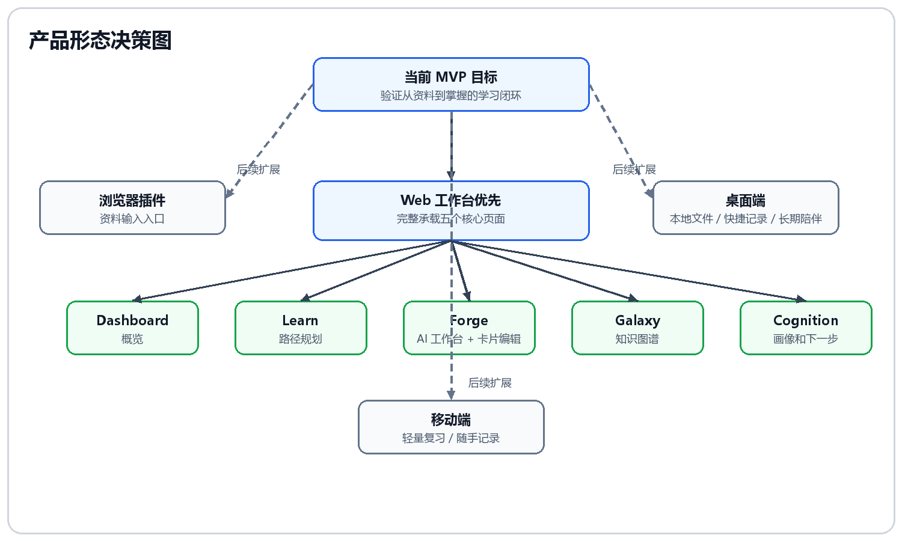

# 03-桌面优先还是 Web 优先？

## 这次决策要解决什么

AXIOM Space 的长期形态可以有很多种：Web、桌面端、浏览器插件、移动端。但 MVP 阶段必须先回答一个问题：

> 哪种形态最适合验证“从资料到掌握”的学习闭环？

SDD 已经把核心闭环定义清楚：

```text
输入主题或导入资料
    -> 生成学习路径
    -> 进入 Forge 卡片线程
    -> AI 引导、追问、资源生成
    -> 用户亲自编辑卡片
    -> 标记任务完成并评估
    -> Galaxy / Cognition 展示沉淀结果
```

因此这次决策不是否定桌面端，而是判断第一阶段应该把研发和演示重心放在哪里。

## 最终决策

当前 MVP 选择 Web 优先，不做桌面端优先。

原因不是桌面端不重要，而是 A3 赛题和当前 SDD 的核心验证目标是：

> 用户能否在一个可运行系统中完成“主题 / 资料 -> 路径 -> Forge -> 卡片输出 -> 评估 -> Galaxy / Cognition 沉淀”的学习闭环。

这个闭环最适合先用 Web 工作台承载。

## 产品形态决策图



这张图表示：插件、桌面端、移动端都不是被否定，而是后置；当前阶段先用 Web 把完整学习闭环跑通。

## 决策过程

### 方案一：桌面端优先

桌面端的优势很明显：

1. 更像长期学习伙伴，可以常驻本机。
2. 更容易和本地文件、资料夹、快捷键、剪贴板结合。
3. 对知识管理用户来说，桌面端有 Obsidian、Notion Desktop 这类心理模型。
4. 后续可以支持本地模型、本地索引和离线资料处理。

但桌面端也会放大第一版风险：

1. 需要处理安装包、更新、平台兼容和本地权限。
2. Electron / Tauri 会引入额外工程复杂度。
3. 桌面端并不会自动解决 Learn、Forge、Galaxy、Cognition 的业务复杂度。
4. 赛题评审关注系统流程、核心功能、多模态资源生成和 AI 技术成果，不会因为有桌面壳就加分。
5. 如果桌面端先行，容易把精力花在客户端工程，而不是学习闭环本身。

结论：桌面端适合后续增强，不适合作为当前 MVP 主路径。

### 方案二：浏览器插件优先

插件很适合“资料输入”：

- 用户看论文、博客、课程时，可以一键保存到 Vault。
- 页面内容可以直接变成 literature 卡片。
- 插件可以成为 AXIOM 的外部输入入口。

但插件无法完整承载学习闭环：

1. 插件适合收集，不适合复杂路径规划。
2. Forge 的卡片编辑和 AI 多轮对话需要更大的工作区。
3. Galaxy 的 3D 图谱和 Cognition 的画像面板也不适合塞进插件。

结论：插件是很好的后续输入入口，但不是第一版主产品。

### 方案三：移动端优先

移动端适合轻量复习、随手记录、碎片化学习，但不适合第一版主流程。

原因：

1. Forge 需要一边聊天、一边编辑卡片，手机屏幕不够。
2. Galaxy 图谱在移动端很难展示复杂关系。
3. Learn 的路径地图和任务详情需要较大的横向空间。

结论：移动端适合复习和提醒，不适合作为核心学习工作台。

### 最终方案：Web 工作台优先

Web 端最适合当前阶段，因为它能同时承载：

- Dashboard：学习和知识概览。
- Learn：任务路径、资料导入、步骤推进。
- Forge：AI 工作台、卡片编辑、资源生成、RAG 状态。
- Galaxy：3D 知识图谱和多布局视角。
- Cognition：画像、知识缺口、观察记录和下一步建议。

这些页面构成一个完整工作台，能清楚展示系统不是单点功能，而是一个学习闭环。

## Web 优先的具体理由

### 1. 更适合演示完整流程

评委可以从一个浏览器窗口看到完整路径：

```text
Dashboard
    -> Learn 新建任务
    -> 生成任务路径
    -> 点击 AI 工作台
    -> Forge 对话和编辑卡片
    -> 资源生成
    -> Learn 标记完成
    -> Galaxy 查看图谱
    -> Cognition 查看画像
```

这个流程和 A3 视频要求高度一致。

### 2. 更适合多面板复杂交互

Forge 需要左侧会话 / 文件树，中间 AI 聊天，右侧 Card Editor。Learn 需要左侧任务组，中间 PATH MAP，右侧 TASK DETAIL。Galaxy 需要大画布和控制面板。这些都更适合 Web 大屏。

### 3. 更适合后台 AI 能力串联

Web 端可以自然连接 Hono API、Postgres、Redis worker、LightRAG 和 AI 服务。用户在页面点击保存、生成、进入任务时，后端可以持续处理异步任务并刷新状态。

### 4. 更适合快速迭代

当前系统仍在验证“学习闭环是否成立”。Web 端可以更快调整页面、路由、Agent 工具和数据模型，不需要被桌面端发布成本拖慢。

## 形态规划

| 阶段 | 产品形态 | 重点 |
|---|---|---|
| 当前 MVP | Web 工作台 | 证明学习闭环成立 |
| 后续扩展 | 浏览器插件 | 从网页、论文、课程中快速收集资料 |
| 后续扩展 | 桌面端 | 本地文件、快捷记录、长期陪伴、本地索引 |
| 后续扩展 | 移动端 | 轻量复习、随手记录、碎片化学习 |

当前不做桌面优先，并不否定这些形态的价值。它们应该在 Web 闭环被验证后再扩展。

## 对演示视频的影响

视频脚本应该按 Web 页面交互来拍，不要用“产品愿景”替代操作流程。

必须让评委看到：

1. 用户点击了哪个入口。
2. 页面状态发生了什么变化。
3. 系统生成了什么对象。
4. 这个对象如何进入下一个页面。

例如：

- Learn 点击“生成任务路径”，中间出现 PATH MAP。
- 点击“进入 AI 工作台处理”，页面自动切到 Forge。
- Forge 保存卡片后，RAG 状态变化。
- Galaxy 出现新增节点和关系。
- Cognition 出现画像、缺口和下一步。

## 答辩口径

AXIOM Space 当前选择 Web 优先，是因为 Web 工作台最适合承载学习路径、AI 工作台、知识图谱和认知画像的完整闭环。桌面端、插件和移动端是后续输入入口和陪伴形态，但第一阶段必须先证明核心学习机制成立。
