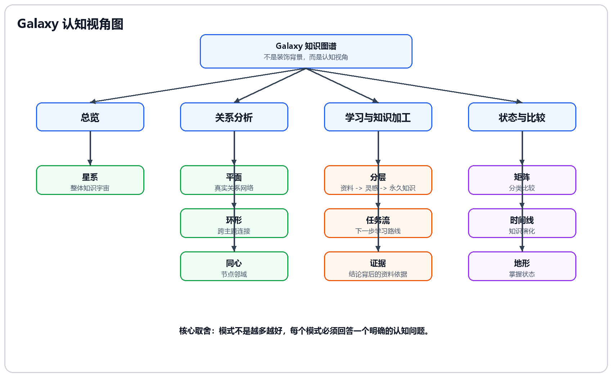

# 04-知识图谱创新

## 这次决策要解决什么

AXIOM 的学习结果不是一段聊天记录，而是一组持续变化的对象：

- 用户导入的文献资料。
- 学习路径中的步骤。
- Forge 中被打磨的卡片。
- 卡片之间的显式和隐式关系。
- 评估结果、知识缺口和下一步建议。

如果这些结果只用列表展示，用户很难感受到“资料正在变成自己的知识结构”。所以需要 Galaxy 知识图谱。

但 Galaxy 也有一个风险：如果只是做成酷炫 3D 动画，它会变成装饰，而不是学习功能。因此本次决策要解决的是：

> Galaxy 到底是视觉效果，还是学习系统中的认知工具？

## 最终决策

AXIOM Space 的 Galaxy 不是装饰性 3D 背景，而是一套面向学习的知识观察系统。

它的核心价值不是“把点画得很酷”，而是让用户在不同学习情景下看见不同结构：

- 我整体学了什么。
- 哪些概念真正有关联。
- 当前概念周围有哪些一跳、二跳邻域。
- 下一步学习路线是什么。
- 某个结论背后有哪些资料和证据。

## 自研技术设计点

这里的自研重点不是 Three.js 本身，而是我们如何把学习对象设计成一套可计算、可反馈的知识图谱契约。

### 1. Card / Edge / Cluster 三对象契约

Galaxy 的图谱不是从前端临时拼出来的，而是由三个领域对象稳定支撑：

| 对象 | 设计含义 | 为什么是自研点 |
|---|---|---|
| `Card` | 所有知识节点的统一载体，区分 `fleeting`、`literature`、`permanent` | 把“灵感、资料、稳定理解”纳入同一套知识生命周期 |
| `Edge` | 卡片之间的关系，包含 `wikilink`、`related`、`prerequisite`、`derived`、`supports`、`contradicts` 等类型 | 不只画线，而是把关系类型作为后续路径、证据和评估的输入 |
| `Cluster` | 用户知识域 / 星团，承载主题归属、颜色和排序 | 让图谱既能看全局主题，也能看某个领域内部结构 |

这个设计让 AXIOM 的知识图谱有明确边界：节点不是任意 UI 点，边也不是视觉装饰，都是可以被 Agent、Learn、Cognition 和 RAG 复用的业务对象。

### 1.1 三类卡片的视觉契约

三类卡片不仅有不同的数据类型，也在 Forge、相关卡片、WikiLink 建议和 Galaxy 中使用同一套颜色。颜色表达的是知识对象所处的阶段，不是装饰，也不代表学生是否已经掌握。

| 卡片类型 | 中文含义 | 固定颜色 | Galaxy 中的意义 |
|---|---|---|---|
| `literature` | 文献证据 | 粉色 `#f472b6` | 外部资料、课程、网页、视频和生成资源的来源节点 |
| `fleeting` | 灵感草稿 | 青色 `#22d3ee` | 用户正在形成、仍可修改和否定的理解节点 |
| `permanent` | 永久知识 | 紫色 `#a855f7` | 通过知识质量审核、可以长期关联和复用的知识节点 |

颜色与空间位置承担不同信息：

```text
节点颜色回答：这是什么阶段的卡片？
星团位置回答：它属于哪个知识主题？
关系边回答：它与其他知识是什么关系？
掌握状态回答：学生是否已用独立评估证明会用？
```

因此，紫色永久卡只说明知识对象达到长期保存标准，不能被解释为学生能力已经 `mastered`。Galaxy 的星团中心仍使用各自的主题色，根节点使用白色；三类卡片节点则始终保持粉、青、紫三种类型色，图例和筛选器也使用同一映射。

### 2. WikiLink 到 Edge 的自动同步

用户在 Forge 卡片里写 `[[概念名]]` 时，系统会解析 WikiLink，并同步为数据库里的 `wikilink` 边。

设计原则：

1. 只在同一个 Vault 内解析，避免跨知识库误连。
2. 只连接真实存在的目标卡片，不创建 dangling edge。
3. 卡片更新时先删除该卡片旧的 `wikilink` 出边，再根据最新内容重建。
4. 保存卡片和同步边应尽量保持同一业务动作，避免内容和图谱状态不一致。

因此用户写下的文本链接会自动变成 Galaxy 可视关系，也会成为 Cognition 计算关联能力、Graph 工具分析前置依赖、RAG 相关卡片推荐的可靠输入。

### 3. 布局不是换皮肤，而是认知投影

Galaxy 的布局模式不是为了展示“很多动画”，而是把同一份图谱数据投影到不同认知问题上。

| 视角 | 自研投影逻辑 | 回答的问题 |
|---|---|---|
| 星系 | 按星团和节点类型展示整体知识宇宙 | 我整体学了什么 |
| 平面 | 基于真实边做关系展开，强连接更靠近 | 哪些知识点真的有关联 |
| 同心 | 以选中节点做中心，按一跳、二跳、三跳邻域展开 | 从这个概念出发，周围有什么 |
| 任务流 | 把学习路径步骤投影到图谱中，旁支显示相关资料和概念 | 下一步应该怎么走 |
| 证据 | 按文献、灵感、永久卡分层，突出资料如何支撑结论 | 这个知识凭什么可信 |
| 地形 / 掌握度 | 用学习路径状态和 mastery 影响高度 | 哪些知识已经站起来，哪些还在低处 |

这部分真正重要的是“图谱视角设计”：同一个数据结构被用来支持总览、关系分析、学习路径、证据链和掌握状态，而不是每个页面各自发明一套展示方式。

### 4. 显式关系和系统发现关系分层

AXIOM 不把所有 AI 发现的关系都直接当成事实边。

当前正式沉淀优先使用：

- 用户写下的 `[[WikiLink]]`。
- Learn 生成学习路径时创建的步骤关系。
- 文档导入或卡片工具明确创建的 `related / prerequisite / derived` 边。

LightRAG 或 Agent 发现的隐含关系，可以作为“推荐关联”或“淡色辅助边”，但需要和显式边分层展示。这样可以避免图谱关系来源不清，也避免用户误以为系统推测就是事实。

### 5. 图谱反哺 Cognition 和 Learn

知识图谱不是终点，它会反过来参与认知分析和路径规划。

Cognition 会基于真实图谱数据计算：

| 指标 | 计算依据 | 页面意义 |
|---|---|---|
| 理解深度 | permanent 卡比例、卡片内容长度 | 是否把资料沉淀成稳定理解 |
| 知识广度 | 星团数量、跨主题连接 | 是否覆盖多个知识域 |
| 关联能力 | 边密度、每个节点平均连接 | 是否形成网络而不是孤立笔记 |
| 表达清晰度 | 有内容且内容较丰富的卡片比例 | 用户是否能用自己的话表达 |
| 知识应用 | 标签使用、`prerequisite / derived` 等实践关系 | 是否能把知识用于结构化推理 |

知识缺口也来自图谱：

- 某个星团有多张 fleeting / literature，但没有 permanent，说明还没沉淀。
- 某张卡没有入边或出边，说明仍是孤立节点。
- 某张卡 RAG 状态失败或仍在索引，说明后续 AI 暂时召回不了它。

这就是 Galaxy 的自研价值：它不是“看起来酷”，而是把卡片、关系、路径、RAG 状态和认知指标连接成一个学习反馈系统。

## Galaxy 认知视角图



图中展示 Galaxy 的核心取舍：模式不是越多越好，必须按认知任务分组，每个模式回答一个明确问题。

## 决策过程

### 方案一：普通卡片列表

最稳妥的方案是只做卡片列表、标签、搜索和过滤。

优点：

- 实现简单。
- 可读性强。
- 不容易出现 3D 性能和交互问题。

但它无法表达 AXIOM 的核心差异：

1. 用户看不到知识之间的连接。
2. 文献、灵感、永久卡之间的沉淀关系不明显。
3. 学习路径和知识结构是割裂的。
4. “个人知识宇宙”的产品气质无法建立。

因此列表可以存在，但不能替代 Galaxy。

### 方案二：单一 3D 星系图

第二个方案是只做一个默认星系视图，让所有节点围绕星团分布。

优点：

- 第一眼效果强。
- 很适合呈现整体学习图景。
- 能表达知识库整体感。

问题是：

1. 星系视图适合看整体，不适合精确分析某条关系。
2. 用户想知道“这个节点为什么连接那个节点”时，星系图不够清晰。
3. 学习路径、证据关系、邻域关系需要不同布局表达。

因此不能只做一个星系图。

### 方案三：很多布局平铺

当前实现中存在多种布局：星系、平面、环形、同心、分层、矩阵、任务流、时间线、地形、证据。

一开始把这些模式都放进 LAYOUTS 面板，看起来功能丰富，但审视后发现问题：

1. 模式边界不清，用户不知道为什么要切换。
2. 有些模式需要真实数据支撑，否则只是换一种摆放。
3. 矩阵如果没有横纵坐标，会像随机排布。
4. 时间线如果没有真实创建 / 更新时间，就不能叫时间线。
5. 地形如果不接掌握度、复习记录或路径进度，就不像学习状态。

所以最终不是“展示越多模式越好”，而是筛选能回答明确问题的模式。

## 最终保留的核心模式

页面展示优先覆盖 5 个模式。

| 模式 | 回答的问题 | 页面呈现 |
|---|---|---|
| 星系 | 我的知识库整体长什么样 | 默认进入 Galaxy，展示星团和整体结构 |
| 平面 | 哪些节点真正有关系 | 切换平面，观察连接清晰的关系网络 |
| 同心 | 当前概念周围有什么 | 选中“反向传播”，看一跳、二跳邻域 |
| 任务流 | 下一步应该怎么走 | 展示学习路径在图谱中的顺序 |
| 证据 | 结论凭什么可信 | 展示文献卡、资源卡和永久卡之间的支撑关系 |

其他模式作为扩展能力处理：

- 环形：适合跨主题连接，可选展示。
- 矩阵：需要补足横纵坐标含义。
- 时间线：必须接入真实创建 / 更新时间。
- 地形：必须接入真实掌握度、复习记录或路径进度。

## 节点和关系设计

### 节点类型

| 类型 | 含义 | 用户感知 |
|---|---|---|
| fleeting | 灵感 / 待整理卡片 | 还没有完全沉淀，需要继续打磨 |
| literature | 文献 / 资料卡片 | 外部输入来源，可作为证据 |
| permanent | 永久知识卡片 | 用户已经输出并沉淀的理解 |

### 关系来源

关系边可以来自：

- 用户手动建立的 WikiLink。
- 学习路径中的前后步骤。
- 文献导入时抽取出的概念关系。
- LightRAG 后续发现的语义相关或实体关系。

页面优先显示显式可靠的边，再叠加 RAG 隐含关系。

## 关键交互决策

### 1. 星系是默认入口

首次进入 Galaxy 时，应该先看到整体知识宇宙，而不是一张复杂关系网。

### 2. 切换模式不是换皮肤

每个模式都必须回答不同问题。用户切换模式时，要能明显感受到观察目标变化。

### 3. 连线必须跟随节点

图谱的可信度来自关系稳定。切换布局时节点和连线必须同步变化，不能出现连线滞后。

原始审视里发现：节点位置动画和连线几何刷新是两套机制，如果每帧重建 geometry，节点多时会造成性能和同步风险。后续优化方向是使用动态 buffer 或动画期间轻量直线，保证关系不断裂。

### 4. 装饰元素要有模式边界

银河带表达“知识宇宙”的背景氛围，不应该变成用户需要思考的开关。彗星适合星系模式，但在平面、任务流、证据等分析视图里会干扰阅读。

### 5. 相机行为要按模式适配

星系这类 3D 视图可以靠近节点；平面、同心、任务流这类分析视图更适合保持全局视角，用高亮表达选中关系，而不是每次点击都大幅移动相机。

### 6. 从图谱回到学习对象

用户点击节点后，应该能回到 Forge 继续处理对应卡片。Galaxy 不是终点，而是学习闭环中的沉淀视角。

## 和页面流程的关系

Galaxy 应该出现在学习闭环后半段：

```text
Learn 生成路径
    -> Forge 编辑并保存卡片
    -> RAG 索引和相关卡片推荐
    -> 建立链接 / 提炼为永久
    -> Galaxy 出现新增节点和关系
    -> Cognition 根据图谱结构给出缺口和下一步
```

## 展示检查项

需要展示：

1. Forge 保存或升级卡片后，Galaxy 出现新增节点。
2. 反向传播节点和链式法则、梯度下降、损失函数建立关系。
3. 左侧 LAYOUTS 切换星系、平面、同心、任务流、证据。
4. 右侧或控制栏展示永久 / 灵感 / 文献过滤。
5. 点击节点后能回到 Forge 继续学习。

## 原始知识图谱文档接入细节

以下内容整合自非编号文档 `知识图谱布局模式说明.md` 和 `知识图谱布局优化审视报告.md`，用于保留布局语义、当前问题、实现建议和验收标准。

### 相关实现文件

原始审视报告明确关联这些实现文件：

| 文件 | 作用 |
|---|---|
| `components/three/galaxy-canvas.tsx` | Three.js 场景、节点、连线、布局算法、相机和交互 |
| `components/galaxy/galaxy-layout-panel.tsx` | `LAYOUTS` 按钮列表 |
| `components/galaxy/galaxy-controls.tsx` | 旋转、Bloom、彗星、银河带、过滤等控制 |
| `stores/mode-store.ts` | `GraphLayoutMode` 状态和持久化 |
| `server/api/routes/galaxy.ts` | 图谱节点、边、星团数据来源 |
| `types/galaxy.ts` | 前端图谱数据类型 |

这说明 Galaxy 决策不是单纯视觉文案，而是同时影响 Three.js 渲染、状态管理、API 数据结构和控件设计。

### 当前实现的核心问题

原始审视报告把当前问题归纳为三类：

1. 布局模式产品边界不清。总览、关系分析、学习路径、状态比较被平铺成同一层级按钮。
2. 布局动画和连线渲染没有形成稳定一体化机制。节点位置由 GSAP 动画驱动，连线是独立几何体，需要手动刷新。
3. 相机交互没有按模式适配。点击节点后统一进入 3D focus，导致 2D / 2.5D 视图里视角不自然。

当前可观察的问题包括：

- 切换布局时，节点先变，线条慢半拍。
- 星系、平面、环形、同心、矩阵之间边界感不足。
- 矩阵看起来像“奇怪地排开”，而不是可理解的分析视图。
- 点击节点后，相机在某些模式中不该靠近却靠近。
- 银河带、彗星被做成开关，增加用户负担。

### 当前场景对象

Three.js 场景大致包含：

- 背景星云 `nebulaGroup`。
- 远处星空 `starField`。
- 银河带 `milkyWay`。
- 彗星粒子。
- 节点组 `nodesGroup`。
- 连线组 `linksGroup`。
- 学习路径 `learningPath.group`。
- HTML 标签层 `labelOverlay`。

节点和连线不是同一个对象层级下的动态绑定关系。节点移动后，连线必须重新计算几何体。

### 当前布局切换流程

```text
applyGraphLayout(mode)
    -> computeLayoutTargets(mode)
    -> animateNodesTo(targets, duration)
    -> layoutAnimating = true
    -> 每帧 refreshLinkGeometry()
    -> 动画结束后再刷新一次连线
```

这个方向是对的，但当前刷新方式代价高。每次刷新连线可能重新生成曲线点、dispose 旧 geometry、创建新的 `BufferGeometry`、`setFromPoints(points)`，如果有 flow 还要更新 flow points。节点多、边多时会造成 GC 压力和帧率下降。

### 连线同步的技术建议

连线应该进入动态缓冲模式，而不是每帧销毁重建：

1. 每条线创建时固定一份 `BufferGeometry`。
2. 动画时只更新 position attribute 数组。
3. 不在动画循环里 dispose / create geometry。
4. 布局切换开始时，把需要显示的线立即切换为动态刷新状态。
5. 布局稳定后，再决定是否重算高质量曲线。

可以分两级：

- 动画期间：使用轻量直线或低分段曲线，保证贴合。
- 动画结束：重建更漂亮的曲线，用于静态展示。

### 旋转策略

不能继续用一个 `PLANAR_LAYOUT_MODES` 集合粗暴决定是否旋转。原始建议是引入：

```ts
type RotationPolicy = 'camera-orbit' | 'graph-spin' | 'none'
```

建议策略：

| 模式 | 旋转策略 |
|---|---|
| 星系 | 缓慢 camera orbit 或整体场景展示旋转 |
| 平面 | 不旋转 |
| 环形 | 轻微围绕中心旋转 |
| 同心 | 围绕当前中心轻微旋转 |
| 分层 | 不旋转 |
| 矩阵 | 不旋转 |
| 任务流 | 不旋转 |
| 时间线 | 不旋转 |
| 地形 | 默认不旋转，可手动斜视 |
| 证据 | 不旋转 |

如果采用旋转 `nodesGroup` 和 `linksGroup` 的方式，标签渲染必须使用 `getWorldPosition()`，不能只读 `node.position`，否则节点转了，HTML 标签会留在旧位置。

### 点击节点后的 focus 策略

当前 `focusNode()` 会统一调用 `frameSelection(selection, node, duration)`，计算包围盒后移动 `controls.target` 和 `camera.position`。这对 3D 星系合理，但对平面、任务流、时间线等视图不合理。

建议引入 `focusBehaviorByMode`：

| 模式 | 点击节点后的主行为 |
|---|---|
| 星系 | 相机靠近选中节点和邻居 |
| 平面 | 保持俯视，高亮一跳 / 二跳关系 |
| 环形 | 暂停旋转，高亮节点所在扇区和跨区连线 |
| 同心 | 以该节点为新中心，重新展开圈层 |
| 分层 | 保持视角，高亮上下层链路 |
| 矩阵 | 保持视角，高亮当前格子和相关节点 |
| 任务流 | 保持视角，高亮前置 / 后续步骤 |
| 时间线 | 保持视角，高亮前后时间上下文 |
| 地形 | 可轻微靠近，但保留高度视角 |
| 证据 | 保持视角，高亮证据链 |

实现方向：

```ts
handleNodeFocus(node, layoutMode)
    -> focusNodeIn3D()
    -> focusNodeInPlanar()
    -> recenterConcentricLayout()
    -> highlightEvidenceChain()
    -> highlightTaskContext()
```

### 重置视角的边界

“重置视角”不应该总是回星系。需要拆成两个动作：

1. 重置当前视角：回到当前模式默认相机。
2. 返回星系总览：切回星系模式。

如果用户正在平面、矩阵或同心中，只是想回到当前模式默认视角，不应该被强制带回星系。

### 十种模式的完整语义和边界

| 模式 | 使用场景 | 观察对象 | 使用边界 | 运动规则 | 视角说明 |
|---|---|---|---|---|---|
| 星系 | 刚进入图谱，看整体印象 | 星团、核心节点、游离节点、节点类型和星团归属 | 适合整体，不适合精读每条关系 | 默认慢速自转，点击或拖动后暂停；彗星只在此模式出现，银河带一直存在 | 我的知识库整体长什么样 |
| 平面 | 想认真看节点关系、孤立节点、关系密度 | 所有节点压到平面，强关系更靠近 | 不适合展示美感和星团氛围，节点多时需要过滤 | 默认不自转，拖拽平移、滚轮缩放，点击只高亮邻居 | 哪些知识点真正有关系 |
| 环形 | 看跨主题连接、桥接节点、闭环或断裂 | 节点围绕中心成环，跨扇区连线穿过圆内 | 适合跨区域关系，不适合局部细节 | 可轻微旋转，点击后暂停并高亮扇区和跨区关系 | 知识之间有没有形成跨主题闭环 |
| 同心 | 围绕一个节点看上下文 | 中心节点、一跳、二跳、外层关系 | 必须有中心节点，不适合比较多个星团 | 可围绕中心轻微旋转，点击节点后切换中心并重排 | 从这个知识点出发，它周围一圈圈是什么 |
| 分层 | 看知识如何从材料变成结论 | 上层永久卡，中层灵感，下层文献证据 | 适合知识加工过程，不适合自然聚类 | 默认静止 | 知识怎么从材料、灵感沉淀成结论 |
| 矩阵 | 做分类比较 | 星团、节点类型、连接强度构成格子 | 必须有坐标轴、格子、标签，否则像乱排 | 默认静止，点击只高亮当前格子 | 不同类别之间怎么比较 |
| 任务流 | 看下一步怎么学 | 主线节点按顺序排开，旁边是辅助资料 | 必须有学习路径、目标任务或先修关系；没有路径不应伪造队列 | 默认静止，点击高亮前置和后续 | 我接下来应该怎么走 |
| 时间线 | 回看知识积累过程 | 节点按创建 / 更新时间排列，不同类型分轨 | 必须有真实 `createdAt/updatedAt`，不能用 hash 伪装时间 | 默认静止，点击高亮前后上下文 | 我的知识是怎样一点点长出来的 |
| 地形 | 看掌握程度、成熟度或状态差异 | 高度、颜色、亮度表示掌握状态 | 必须接真实学习记录、测验、复习或路径进度 | 默认不自转，可手动斜视 | 哪些知识站起来了，哪些还在低处 |
| 证据 | 检查结论背后依据 | 结论在上，文献、引用、证据在下，连线表示支撑 | 必须区分观点和证据，不适合快速浏览全局 | 默认静止，点击突出证据链 | 这个知识为什么可信 |

### 平面模式的边类型边界

平面模式应该优先使用真实语义边，而不是星团装饰边。适合参与平面关系的边包括：

- `wikilink`
- `related`
- `prerequisite`
- `derived`
- `counter`

星团归属可以影响初始位置或颜色，但不应该主导力导向。

### 证据模式的边类型边界

证据模式必须重点使用 edge type：

- `prerequisite`
- `derived`
- `counter`
- `wikilink`
- `citation`
- `evidence`

点击永久卡时，只突出支撑它的文献和证据。点击文献时，突出它支撑的结论。

### LAYOUTS 分组

布局 UI 不应该平铺 10 个按钮，而应该按用途分组：

```text
总览
- 星系

关系
- 平面
- 环形
- 同心

学习
- 分层
- 任务流
- 证据

分析
- 矩阵
- 时间线
- 地形
```

每个按钮最好有一句解释：

- 星系：看整体结构。
- 平面：看真实连接。
- 同心：看一个点的邻域。
- 任务流：看下一步路线。
- 证据：看结论依据。

### 推荐默认行为

| 行为 | 推荐规则 |
|---|---|
| 初次进入 | 默认星系模式 |
| 银河带 | 永远显示，不放开关 |
| 彗星 | 默认开启，只在星系模式显示 |
| 自动旋转 | 星系、环形、同心可默认轻微旋转 |
| 分析视图 | 平面、矩阵、分层、任务流、时间线、证据默认静止 |
| 点击节点 | 3D 模式可移动相机，2D / 2.5D 模式以高亮为主 |
| 切换布局 | 节点和连线同步动画 |
| 重置视角 | 回到当前模式默认视角，不一定强制回星系 |

### 建议的技术重构方向

#### 1. 引入布局配置表

```ts
const LAYOUT_PROFILES = {
  galaxy: {
    projection: '3d',
    motion: 'camera-orbit',
    atmosphere: { milkyWay: true, comets: true },
    focus: 'camera-selection',
    linkPolicy: 'overview',
  },
  flat: {
    projection: '2d',
    motion: 'none',
    atmosphere: { milkyWay: true, comets: false },
    focus: 'highlight-neighborhood',
    linkPolicy: 'semantic',
  },
}
```

每种模式同时定义：

- 布局算法。
- 相机默认位置。
- 点击行为。
- 旋转策略。
- 连线显示策略。
- 装饰元素规则。
- 是否需要真实业务数据。

#### 2. 把连线更新改成动态 buffer

目标：

- 动画期间不 dispose / create geometry。
- 节点和连线同一帧贴合。
- 大图切换时不掉帧。

建议实现：

1. 创建线时保留固定长度 points buffer。
2. 每帧只写 `position.array`。
3. `position.needsUpdate = true`。
4. 动画结束后再做高质量曲线。

#### 3. 把 focus 从相机逻辑里拆出来

当前 `focusNode()` 同时做停止旋转、计算选中集合、移动相机、设置高亮、设置标签。建议拆成：

- `selectNode(node)`。
- `highlightSelection(node, mode)`。
- `updateLabels(node, mode)`。
- `applyFocusCamera(node, mode)`。
- `maybeRecomputeLayoutFromSelection(node, mode)`。

#### 4. 视觉装饰进入模式规则

- 删除银河带开关。
- 删除彗星开关或放到高级设置。
- `applyGraphLayout()` 内统一控制彗星显示。
- 彗星默认只在星系模式显示。

#### 5. 布局 UI 按用途分组

把 `LAYOUTS` 从技术列表变成认知视角列表：总览、关系、学习、分析。

### 推荐实施顺序

#### 第一阶段：先修用户马上能感知的问题

1. 连线和节点同步动画。
2. 彗星只在星系显示。
3. 银河带常开并移除开关。
4. 平面 / 任务流 / 时间线点击节点不再相机俯冲。
5. 环形 / 同心默认允许轻微中心旋转。

#### 第二阶段：修模式边界

1. LAYOUTS 按用途分组。
2. 同心模式点击节点后重新以该节点为中心排布。
3. 矩阵补坐标轴、格子边界和标签。
4. 时间线接入真实 `createdAt/updatedAt`。
5. 任务流没有路径时不伪造队列。

#### 第三阶段：修数据可信度

1. 地形接入真实掌握度。
2. 证据模式使用更明确的边类型。
3. 平面模式区分真实语义边和展示辅助边。
4. 每个模式提供对应 tooltip 或简短说明。

### 验收标准

#### 布局切换

- 切换任意布局时，节点和连线必须同步移动。
- 不应出现线条明显滞后、断开或最后才跳到正确位置。
- 大于 100 个节点时，切换动画仍应保持可接受帧率。

#### 装饰元素

- 银河带始终存在。
- 彗星默认只在星系模式出现。
- 分析模式中没有彗星干扰。

#### 旋转

- 星系默认慢速自转。
- 环形和同心默认轻微中心旋转。
- 平面、矩阵、分层、任务流、时间线、证据默认静止。

#### 点击节点

- 星系点击节点可以相机靠近。
- 平面点击节点只高亮关系，不打乱俯视结构。
- 同心点击节点后，该节点成为新中心。
- 任务流点击节点高亮前后步骤。
- 证据点击节点高亮证据链。

#### 模式理解

- 用户能在 3 秒内理解当前模式是用来干什么的。
- 每个模式有明确的使用场景和边界。
- 矩阵、时间线、地形如果数据或视觉边界不完整，不应作为重点展示内容。

## 总结

AXIOM Space 的知识图谱不是静态展示，而是一套认知视角。星系视图展示整体知识宇宙，平面和同心视图帮助分析概念关系，任务流视图连接学习路径，证据视图展示资料如何支撑结论。用户不是在看一堆笔记，而是在观察自己的知识如何从资料、灵感逐步沉淀为永久理解。
