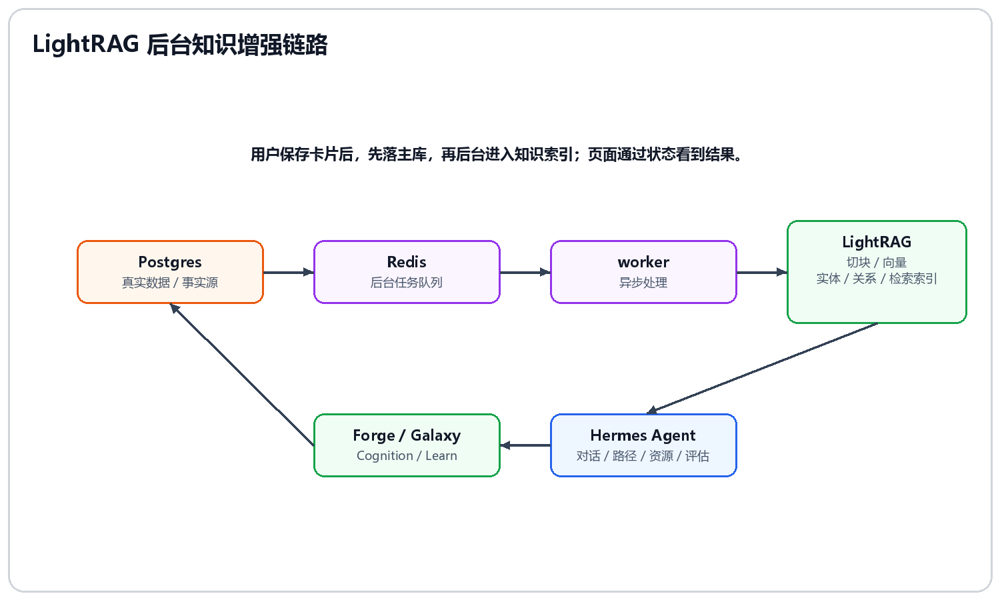
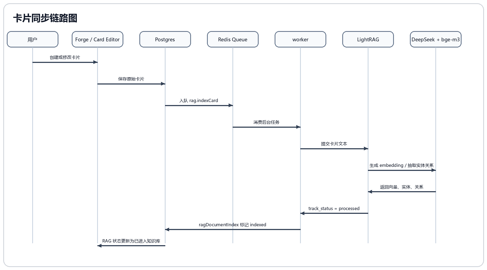
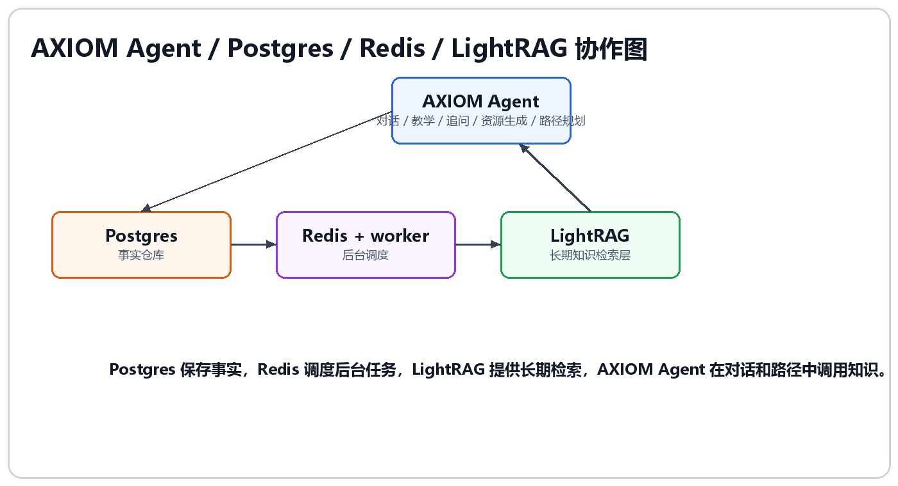

# 05-RAG 增强体验

## 这次决策要解决什么

AXIOM 的用户会不断创建卡片、导入资料、编辑理解、生成资源。如果这些内容只是存进数据库，系统仍然会遇到三个断点：

1. 用户明明写过某个概念，后续问 AI 时，AI 仍然像第一次见到。
2. 资料导入后只是被保存，没有真正进入问答、路径、图谱和画像。
3. 卡片之间的隐含关系只能靠用户手工写 WikiLink，系统不会主动发现。

因此需要 RAG 增强。但这里要明确：AXIOM 接入 LightRAG 不是为了做普通知识库问答，而是为了让用户写下的卡片和导入资料进入长期学习闭环。

## 最终决策

采用 Postgres + Redis + worker + LightRAG 的分层架构：



用户体验上的结果是：

> 用户写过的卡片，后续 AI 能想起来；用户导入的资料，能进入图谱和路径；用户更新卡片后，知识库也会重新同步。

## 卡片同步链路图



图中链路来自原始 LightRAG 架构文档的“真实链路”，重点是：保存卡片先落 Postgres，索引任务后台完成，页面通过状态看到结果。

## 自研技术设计点

AXIOM 的 RAG 自研点不在于“接了一个向量库”，而在于我们为学习系统设计了主数据、派生索引、引用回映射和页面反馈之间的契约。

### 1. 事实源和派生索引分离

我们没有把 LightRAG 当成主数据库。AXIOM 的真实学习对象仍然保存在 Postgres：Card、Edge、Cluster、LearningPath、LearningSession、Assessment、DomainEvent 等。

LightRAG 只保存可重建的派生索引：

```text
Postgres Card / Edge / Cluster
    -> 格式化为 AXIOM RAG 文档
    -> LightRAG 切块、向量、实体、关系
    -> 检索时回映射到真实 Card
```

这个边界很关键：

| 设计问题 | AXIOM 的处理 |
|---|---|
| 用户改了卡片，旧向量怎么办 | 用内容 hash 判断变化，变化后删除旧派生文档再重新插入 |
| RAG 服务挂了怎么办 | Postgres 原文仍在，索引状态标记为 `disabled / failed / indexing`，可重建 |
| AI 引用了什么来源 | LightRAG reference 必须回映射到真实 Card，页面才能跳转 |
| 是否把聊天流水都入库 | 不直接进入 RAG，必须先被卡片化、记忆化或观察化 |

这使得 RAG 是学习系统的增强层，而不是另一个不可控的数据黑箱。

### 2. AXIOM 文档身份设计

每张卡片进入 LightRAG 前，都会被转换成带 AXIOM 元数据的文档。

核心身份设计：

```text
workspace  = axiom_<vaultId>
documentId = axiom:<vaultId>:card:<cardId>
```

文档内容不是只丢原文，而是带上结构化头部：

```text
# 卡片标题

AXIOM_CARD_ID: ...
AXIOM_CARD_TYPE: fleeting / literature / permanent
AXIOM_CARD_PATH: ...
AXIOM_CLUSTER: ...
AXIOM_TAGS: ...

卡片正文
```

这几个字段是我们自己加的桥接协议。它们解决三件事：

1. 多 Vault 隔离：不同用户/知识库进入不同 workspace。
2. 引用可追踪：RAG 返回 `file_path` 时可以解析回 `vaultId` 和 `cardId`。
3. 检索有语义上下文：模型不仅看到正文，也知道这段内容是灵感卡、文献卡还是永久卡，属于哪个星团。

### 3. 可重建、可跳过、可追踪的同步机制

卡片同步不是简单调用一次 LightRAG API。AXIOM 做了三层保护：

| 保护层 | 设计 |
|---|---|
| 幂等跳过 | 对格式化后的 RAG 文档计算 `contentHash`，如果内容没变且状态已 `indexed`，直接跳过 |
| 旧索引清理 | 内容变化时先查找旧 LightRAG 文档并删除，等待 pipeline 空闲后再插入新文档 |
| 真实状态追踪 | 插入后读取 `trackId`，轮询 `track_status`，只有文档状态进入 `processed` 才标记 indexed |

所以页面上看到的“已进入知识库”不是保存成功，也不是 LightRAG 返回 200，而是后台处理真正完成后的状态。

状态表 `ragDocumentIndex` 保存：

- provider。
- vaultId。
- cardId。
- workspace。
- documentId。
- contentHash。
- status。
- trackId。
- lastError。
- indexedAt / lastSyncedAt。

这个表让 RAG 变成可观察的系统，而不是看不见的后台副作用。

### 4. 检索结果必须回到业务对象

AXIOM 查询 LightRAG 后，不直接把原始结果扔给前端，而是做一次回映射。

```text
LightRAG raw result
    -> extract answer
    -> extract references
    -> parse axiom:<vaultId>:card:<cardId>
    -> 校验属于当前 Vault
    -> 查询 Postgres 补 title / type
    -> 合并本地 indexed 卡片 fallback
    -> 返回 Agent / 前端
```

这也是为什么 Forge 对话可以展示 `rag_context` 引用，而不是只给一段无法追溯的增强文本。

设计重点：

1. reference 不属于当前 Vault 时丢弃。
2. reference 指向的 card 不存在时丢弃。
3. LightRAG 没返回足够引用时，用本地已 indexed 卡片做标题/正文匹配 fallback。
4. 多来源引用按 cardId 去重。

这使 RAG 的输出能回到 AXIOM 的真实卡片、Galaxy 节点和 Forge 编辑对象。

### 5. 相关卡片推荐的三段式策略

Forge 中的“相关卡片”不是单靠向量相似度。

推荐顺序是：

```text
当前卡片标题 + 正文
    -> LightRAG mix 检索，找语义相关卡片
    -> 如果不足，再查显式 Edge，补已有图谱关系
    -> 如果还不足，再查同 Cluster 卡片，补主题上下文
```

这样做的原因是：RAG 擅长找语义相近，Edge 擅长表达用户明确建立的关系，Cluster 擅长表达主题归属。三者合起来，推荐结果既有 AI 发现，也不会脱离用户已经整理出的知识结构。

### 6. RAG 进入学习闭环，而不是只做问答

AXIOM 的 RAG 输出会进入多个模块：

| 模块 | 如何使用 RAG |
|---|---|
| Agent 对话 | `buildRagEnhancedMessage` 把 LightRAG 结果注入前台 Agent 回复，并把引用通过 SSE 传给前端 |
| Learn 路径 | 生成学习路径前检索用户已有知识，避免从通用大纲开始 |
| Forge 推荐 | 打开卡片时推荐相关卡片，引导用户建立 WikiLink |
| Galaxy | RAG 发现的关系可以作为隐含关系层，但和显式边分开 |
| Cognition | RAG 索引失败、待同步会成为知识缺口的一部分 |
| 资源生成 | 资源不脱离当前卡片和知识库，生成后也可以继续进入 RAG |

因此 RAG 的价值不是“问资料库问题”，而是让用户写下的内容持续参与 Agent、图谱、路径、资源和认知反馈。

## 决策过程

### 方案一：只用 Postgres 全文搜索

最简单的做法是把卡片内容保存在 Postgres，然后用标题搜索、全文搜索或关键词匹配。

优点：

- 数据统一。
- 实现简单。
- 容易审计和调试。

但问题是：

1. 关键词搜索无法稳定发现语义相近的卡片。
2. 很难抽取实体和关系。
3. 对话时只能找到字面匹配内容，不能真正增强“AI 想起我的知识”。
4. 知识图谱如果只靠手动链接，会变成用户维护负担。

所以仅靠 Postgres 不够。

### 方案二：把所有内容直接丢进向量库

另一个方案是把卡片、资料、聊天记录全部直接向量化。

这个方案看起来强，但风险很大：

1. 聊天记录噪音高，很多临时想法不应该成为长期知识。
2. 每句话都入库，会污染检索结果。
3. 用户修改卡片后，旧向量如果没清干净，会造成 AI 回答旧内容。
4. 向量库如果承担事实源，后续迁移和审计都会困难。

所以不能“什么都进 RAG”。

### 方案三：把 LightRAG 当主数据库

LightRAG 能做实体、关系和向量索引，但它不适合承担 AXIOM 的业务主数据。

AXIOM 的真实对象包括：

- Card：标题、内容、类型、Vault、星团。
- LearningPath / Step：路径、状态、顺序、掌握度。
- AgentSession / Message：对话和工具调用。
- AssessmentResult：评估结果和证据。
- PromotionAttempt：卡片升级尝试。
- DomainEvent：关键业务事件。
- Galaxy Edge：显式关系和图谱展示。

这些对象需要权限、审计、回滚、迁移和页面状态同步。LightRAG 更适合作为索引层，而不是业务事实源。

最终确定：

> Postgres 保存真实数据，LightRAG 保存可重建的派生索引。

### 方案四：保存时同步等待 LightRAG 完成

如果用户点击保存卡片后，系统立即等待 LightRAG 完整处理，会造成明显卡顿。LightRAG 处理涉及：

- 文本切块。
- embedding 生成。
- 实体抽取。
- 关系抽取。
- 索引状态追踪。

这些都可能很慢。因此最终引入 Redis + worker，把 RAG 同步变成后台任务。

## 数据职责

| 组件 | 职责 | 边界 |
|---|---|---|
| Postgres | 保存卡片、路径、会话、评估、图谱等真实数据 | 唯一事实源 |
| Redis | 保存后台任务队列和处理状态 | 不保存长期知识 |
| LightRAG | 保存切块、向量、实体、关系和检索索引 | 派生索引，可重建 |
| Agent | 在对话、资源生成、路径规划中调用知识索引 | 不直接替代数据库 |

## 当前链路

卡片创建或更新后：

1. Postgres 保存卡片原文。
2. 系统触发 `rag.indexCard` 后台任务。
3. Redis 保存任务。
4. worker 消费任务。
5. LightRAG 接收卡片文本。
6. embedding 模型生成向量。
7. LLM 抽取实体和关系。
8. LightRAG 完成 processed。
9. Postgres 中的 `ragDocumentIndex` 状态更新为 indexed。

这条链路保留几个关键细节：

- 统一触发：所有 `card.create/update/upsert` 都应该进入 RAG 队列，不依赖某个页面。
- 后台执行：保存卡片不会被 RAG 阻塞。
- 状态可见：不是收到 200 就算完成，而是等待处理状态真正完成。
- 可重建：卡片更新时可以删除旧派生文档并重新插入，避免旧知识污染。

## 页面体验

### 1. Forge 中显示 RAG 状态

在 Card Editor 状态栏显示：

- 等待同步。
- 索引中。
- 已进入知识库。
- 同步失败。

用户保存卡片后，可以看到知识库同步状态，而不是黑盒等待。

### 2. Forge 中推荐相关卡片

当前卡片进入知识库后，系统可以推荐相关卡片。

页面表现：

- 展开“可能关联”。
- 显示 3-8 张相关卡片。
- 显示相关原因或所属星团。
- 点击“建立链接”后，在当前卡片插入 WikiLink。
- Galaxy 中出现显式关系边。

### 3. AI 对话引用个人知识

Agent 回复前可以查询 LightRAG，将相关卡片作为上下文注入。

页面体现：

- AI 能引用自己写过的卡片。
- 回答不再像第一次见到这个主题。
- 学得越多，系统越懂自己。

### 4. Galaxy 叠加隐含关系

LightRAG 抽取的实体和关系可以补充图谱：

- 显式链接：用户写下的 WikiLink。
- 语义相关：LightRAG 发现的相似概念。
- 前置关系：某概念是另一概念的基础。
- 同主题关系：属于同一知识簇的内容。

正式展示时优先显示显式边，隐含边作为辅助关系层，避免关系来源混在一起。

### 5. Cognition 发现知识缺口

RAG 和图谱数据可以帮助系统发现：

- 只有文献卡，没有永久卡的区域。
- 只有灵感卡，还没有打磨的概念。
- 孤立节点。
- 某主题缺少前置概念。

这些缺口会回到 Cognition 的“知识缺口”和“建议下一步”。

## 和资源生成的关系

资源生成不应该脱离当前学习对象。

正确链路是：

```text
Forge 当前卡片
    -> Agent 读取卡片内容和相关知识
    -> 生成讲解文档、思维导图、练习题、代码案例、教学视频或动画
    -> 资源保存到 Vault
    -> 资源引用回当前卡片
    -> 后续可被 RAG 和图谱继续使用
```

这样资源不是一次性素材，而是进入用户个人知识系统。

## 为什么不把所有聊天流水直接写入 RAG

这是一个重要边界。

对话当然有价值，但原始聊天流水不等于知识。很多聊天内容只是：

- 临时提问。
- 重复确认。
- 错误理解。
- 未经用户确认的 AI 草稿。
- 上下文中的过渡语句。

如果全部写入 RAG，会导致后续 AI 检索到噪音甚至错误理解。

所以策略是：

```text
聊天先进入会话记录
    -> Agent2 判断是否有价值
    -> 用户确认或卡片化
    -> 保存为结构化卡片 / 观察 / 记忆
    -> 再进入长期知识索引
```

这符合 AXIOM 的学习理念：知识不是自动堆积，而是经过用户理解和打磨后的结构。

## 展示检查项

需要展示：

1. Forge 保存卡片后，RAG 状态显示等待同步 / 索引中 / 已进入知识库。
2. 用户让 Agent 基于当前卡片生成多类型资源。
3. Resource Generation 面板显示生成进度。
4. 资源生成后在卡片或资源预览区出现。
5. 展开“可能关联”，点击“建立链接”。
6. 切到 Galaxy，看到新关系边。
7. 切到 Cognition，看到知识缺口或下一步建议。

## 保留边界

1. Postgres 是事实源，LightRAG 只是索引层。
2. RAG 不替代用户输出，卡片仍要经过 Forge 打磨。
3. RAG 不直接决定用户掌握，评估仍要看会话证据和卡片内容。
4. 隐含关系可以辅助 Galaxy，但正式沉淀仍应区分显式链接和系统发现关系。

## 原始 LightRAG 文档接入细节

以下内容整合自非编号文档 `LightRAG 与后台知识增强架构.md` 和 `LightRAG 体验增强实施清单.md`，用于保留数据职责、当前链路、体验增强、接口和验收标准。

### 结论

AXIOM 的主数据库负责保存用户真实数据，LightRAG 负责把卡片加工成可检索的知识索引，Redis 负责把耗时索引任务放到后台执行。

页面和流程变化：

> 用户写下的卡片和导入的资料，不只是被保存起来，而是会被系统理解、索引、关联，并在后续 AI 对话、路径规划、知识图谱和推荐中被重新调用。

### 为什么需要增强层

传统笔记系统的问题是：资料存进去了，但系统不真正理解它。

原始文档明确列出三个断点：

1. 存了很多，但 AI 想不起来。用户明明写过某个概念，之后问 AI 时，AI 仍然像第一次见到这个主题。
2. 资料很多，但关系靠用户手工连。只有用户显式写了 `[[链接]]`，图谱才出现边；隐含关系难以被发现。
3. 导入资料后，没有真正进入学习闭环。文档只是被保存，不能稳定参与路径规划、个性化问答和知识缺口分析。

LightRAG 的作用就是补上这个断点：把 AXIOM 中的卡片和资料加工成可以被 AI 检索和推理的知识索引。

### 三层数据职责细化

#### Postgres：主数据库

Postgres 是 AXIOM 的事实源。

保存内容：

- 用户、认证、Vault。
- 卡片原文、标题、类型、颜色、星团归属。
- 学习路径、学习步骤、学习消息。
- AI 对话记录。
- RAG 同步状态。

原则：

> Postgres 里的数据才是原始数据，LightRAG 可以重建。

#### LightRAG：知识索引层

LightRAG 保存派生数据。

加工和保存：

- 文本切块。
- embedding 向量。
- 实体。
- 关系。
- 检索索引。
- 文档处理状态。

它不是 AXIOM 的主数据库，而是 AI 用来“想起相关知识”的增强记忆层。

#### Redis：后台任务层

Redis 不存长期知识。

它保存临时任务：

- 哪张卡片需要同步到 LightRAG。
- 哪个 Vault 需要重新索引。
- 任务是否完成、失败、重试。

用户保存卡片时，不需要等待 LightRAG 完整抽取完成；任务进入 Redis，由后台 worker 处理。

### 当前已经接入的真实链路

```text
用户创建 / 修改卡片
    -> Postgres 保存原始卡片
    -> Prisma card.create/update/upsert 自动触发 RAG 入队
    -> Redis 保存 rag.indexCard 后台任务
    -> worker 消费任务
    -> LightRAG 接收卡片文本
    -> Ollama bge-m3 生成向量
    -> DeepSeek 执行实体 / 关系抽取
    -> LightRAG 完成 processed
    -> Postgres ragDocumentIndex 标记 indexed
```

关键特性：

- 统一触发：所有 `card.create/update/upsert` 都会自动进入 RAG 队列，不依赖某一个前端页面。
- 后台执行：保存卡片不会被 RAG 处理阻塞。
- 真实完成状态：不是收到 LightRAG 200 就标记完成，而是等待 `track_status` 变成 processed。
- 更新可重建：卡片内容更新时，会删除旧 LightRAG 派生文档，再重新插入，避免旧知识污染。
- 对话可召回：AI 对话前可以查询 LightRAG，并把检索结果注入 Agent prompt。

### 页面变化

#### 1. AI 对话更懂我的知识库

用户问“我之前写过的进程和线程的区别是什么？”时，系统不再只靠模型记忆或当前对话，而是先到 LightRAG 中查相关卡片，再带着检索结果回答。

页面体现：

- AI 能引用自己写过的卡片。
- AI 回答更贴近个人知识库。
- 学得越多，AI 越懂自己。

#### 2. 导入资料不只是保存，而是进入知识网络

用户导入文档后，系统可以把文档生成的卡片同步进 LightRAG。

后续可以支持：

- 问这份资料里的内容。
- 让 AI 找资料之间的共同概念。
- 从资料中发现适合打磨成永久卡的点。

#### 3. 卡片更新后，AI 会使用新内容

用户修改卡片后，旧索引会被替换，避免“用户明明改了卡片，但 AI 仍然回答旧内容”。

#### 4. 图谱不只靠手写链接

当前 AXIOM 图谱主要依赖数据库里的显式边，比如 `[[WikiLink]]` 和学习路径边。

LightRAG 后续可以提供隐含关系：

- 两张卡片讲同一个概念。
- 某个概念是另一个概念的前置知识。
- 某些卡片属于同一个主题簇。
- 某些资料之间存在冲突或互补。

这可以增强 2D / 3D 知识图谱，让它更像一个活的知识网络。

### 可以继续增强的体验

| 体验 | 页面能力 | 用户价值 |
|---|---|---|
| 知识库问答 | 用户直接问整个 Vault；回答显示引用来源；引用跳回具体卡片 | 不需要记得资料放在哪里，系统从自己的知识库里找证据 |
| 相关卡片推荐 | 打开卡片时自动显示相关卡片；区分显式关联和语义关联；一键建立 WikiLink | 写卡片时系统主动提示“这张卡可能和哪些知识有关” |
| 知识缺口发现 | 检测某主题缺少关键概念；检测只有资料卡没有永久卡；检测孤立节点 | 系统不只展示已有知识，还指出哪里没学完整 |
| 路径规划增强 | Path 生成前读取已有知识；跳过已掌握概念；根据薄弱区域补复习步骤 | 路径不再像通用课程大纲，而是根据用户知识库生成 |
| 图谱增强 | 2D / 3D 图谱叠加隐含边；支持显式链接、语义相关、前置关系、同主题关系切换；按关系强度筛选 | 用户看到的不只是自己手动连出的图，也是系统发现的结构 |
| 对话沉淀 | 不把所有聊天流水直接进 RAG；只把重要对话总结为卡片或记忆；用户确认后沉淀 | 聊天不会变成噪音，真正重要的内容进入长期知识 |
| 重复与冲突检测 | 检测两张卡片是否表达相同概念；检测观点冲突；提供合并或保留差异建议 | 知识库越来越干净，而不是越写越乱 |

### 和 AXIOM Agent 架构的关系

LightRAG 不是替代 AXIOM Agent，而是增强 AXIOM Agent 的长期知识能力。



AXIOM Agent 是智能体运行层，Postgres 是事实仓库，LightRAG 是长期知识检索层，Redis 是后台调度系统。四者组合后，系统不是一次性聊天工具，而是一个会随用户学习持续成长的认知系统。

### 关键设计

#### 1. 主数据和派生索引分离

好处：

- 用户原始数据安全、可控。
- RAG 索引坏了可以重建。
- 不会被第三方索引结构锁死。
- 业务数据和 AI 检索数据边界清晰。

#### 2. 后台异步索引

RAG 处理涉及 LLM 抽取和向量生成，耗时较长。Redis + worker 带来的好处：

- 前端保存不卡顿。
- 任务失败可重试。
- 批量导入可以逐步处理。
- 后续可以扩展文档解析、图谱重算、画像更新。

#### 3. 本地免费 embedding

当前使用：

- DeepSeek 负责 LLM 抽取。
- Ollama + bge-m3 负责本地 embedding。

好处：

- embedding 不消耗外部 API 费用。
- 数据向量化在本地完成。
- 后续可替换更强的本地模型。

#### 4. RAG 不是简单向量搜索

LightRAG 不只是做 embedding 相似度搜索，还会抽取实体和关系。

这和 AXIOM 的知识图谱目标天然匹配：

- 卡片是知识节点。
- 链接是显式关系。
- LightRAG 可以补充隐含关系。
- 图谱可以成为学习路径和认知画像的基础。

### 体验增强实施清单

#### P0：可见状态

##### 1. 卡片 RAG 状态

位置：Forge 编辑器右侧或卡片信息区。

显示：

- 未同步。
- 索引中。
- 已进入知识库。
- 同步失败。

交互：

- 失败时显示错误摘要。
- 支持手动重试。

涉及接口：

- `GET /api/rag/status`。
- `POST /api/rag/card/:id/sync`。

验收标准：

- 新建卡片后能看到状态从索引中变成已进入知识库。
- 更新卡片后状态会重新变化。
- LightRAG 失败时用户能看到失败，而不是静默失效。

##### 2. AI 对话知识库引用提示

位置：Forge AI 对话消息区域。

显示：

- 本次回答是否参考了知识库。
- 引用了哪些卡片。
- 点击引用跳转到卡片。

涉及改动：

- `buildRagEnhancedMessage` 不只拼接文本，还要保留 RAG 原始 references。
- SSE 返回中增加 `rag_context`，或在最终 `done` 事件中附带引用。
- 前端消息模型支持引用列表。

验收标准：

- 用户问知识库中存在的问题，AI 回复旁边能看到引用来源。
- 用户点击引用可以打开对应卡片。

#### P1：相关卡片推荐

##### 3. Forge 相关卡片面板

位置：Forge 编辑器侧边栏。

能力：

- 根据当前卡片内容查询 LightRAG。
- 返回语义相关卡片。
- 区分已经显式链接和只是语义相关。
- 一键插入 `[[WikiLink]]`。

涉及接口：

- 新增 `POST /api/rag/related-cards`。
- 输入：`cardId`。
- 输出：相关卡片列表、相关原因、相似度或关系类型。

验收标准：

- 打开一张卡片时，能看到 3-8 张相关卡片。
- 点击“建立链接”后，当前卡片内容出现 WikiLink，Galaxy 显示显式边。

#### P2：知识缺口发现

##### 4. Cognition 知识缺口面板

位置：Cognition 页面。

能力：

- 找出只有 fleeting / literature，没有 permanent 的主题。
- 找出孤立卡片。
- 找出某主题缺少前置概念。

涉及数据：

- Postgres 中 card / cluster / edge。
- LightRAG 检索和关系抽取结果。

验收标准：

- 页面能列出“建议打磨的卡片”。
- 页面能列出“建议补充的概念”。
- 建议可以跳转到 Forge 或 Path。

#### P3：图谱增强

##### 5. Galaxy 关系来源筛选

位置：Galaxy 控制栏。

模式：

- 显式链接。
- LightRAG 语义相关。
- LightRAG 实体关系。
- 学习路径关系。

体验：

- 默认显示显式链接。
- 用户可以叠加 LightRAG 隐含关系。
- 隐含关系用更细、更淡的边表示。

验收标准：

- 用户能看见“系统发现的关系”和“自己写下的关系”是不同层。
- 切换筛选不会造成明显卡顿。

#### P4：路径规划增强

##### 6. Path 生成前读取用户已有知识

位置：Path 页面生成学习路径流程。

能力：

- 生成路径前查询 LightRAG。
- 找出用户已经有的相关卡片。
- 找出缺失概念。
- 路径从缺口开始，而不是从通用大纲开始。

验收标准：

- 同一个主题，在空知识库和有知识库时生成路径不同。
- 已掌握概念不会重复作为起点。
- 每一步可以关联已有卡片或待创建卡片。

#### P5：对话沉淀

##### 7. 重要对话转卡片

位置：Forge 对话区。

能力：

- Agent 检测本轮对话是否值得沉淀。
- 生成卡片草稿。
- 用户确认后写入 Postgres。
- 自动进入 LightRAG。

设计原则：

- 不把所有聊天流水直接进 RAG。
- 只沉淀用户确认的结构化知识。

验收标准：

- 用户完成一次高价值对话后，系统建议生成卡片。
- 用户确认后，卡片进入 Forge 和 Galaxy。
- 后续 AI 能通过 LightRAG 召回这张卡。

### 推荐开发顺序

1. 卡片 RAG 状态可视化。
2. AI 回答引用来源。
3. Forge 相关卡片推荐。
4. Galaxy 隐含关系叠加。
5. Path 路径规划增强。
6. 对话沉淀。

理由：

> 先证明 RAG 已经生效，再让 RAG 参与用户每天都会用到的工作流，最后再把它扩展到图谱和路径规划。

## 总结

AXIOM Space 的 RAG 增强不是简单向量搜索，而是把卡片和资料变成可召回、可关联、可持续更新的个人知识索引。Postgres 保存真实原文，Redis 负责后台任务，LightRAG 抽取实体关系和向量索引，Agent 在对话、资源生成、图谱和路径规划中调用这些结果。这样系统会随着用户学习不断积累上下文，形成真正个性化的学习智能体。
