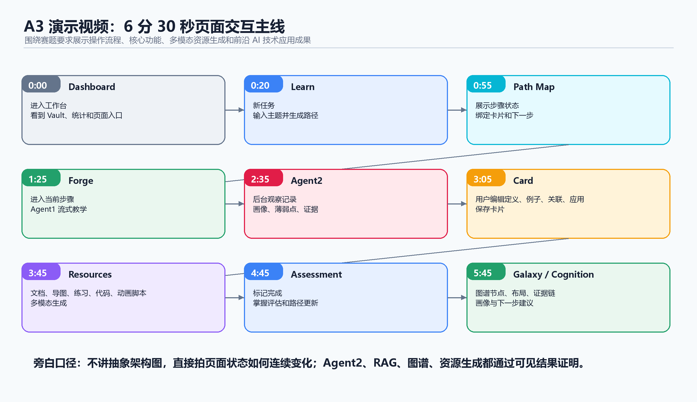

# AXIOM Space A3 演示视频脚本

版本：SDD 页面交互版

核心拍法：不要先讲概念，直接录用户怎么操作页面。每一段都要回答四件事：

1. 用户点了哪里。
2. 页面发生了什么变化。
3. 系统生成了什么学习对象。
4. 这个对象如何进入下一步学习闭环。

对应赛题要求：

> 须清晰展示系统的操作流程、核心功能、多模态资源生成效果及前沿 AI 技术的应用成果。

建议时长：6 分 30 秒左右，不超过 7 分钟。

---

## 主线

本视频只拍一条 SDD 闭环：

进入 Vault -> Learn 创建任务路径 -> 点击步骤进入 Forge -> AI 工作台围绕卡片辅导 -> 用户编辑并保存卡片 -> 生成多类型资源 -> 标记任务完成并评估 -> Galaxy 查看知识沉淀 -> Cognition 查看画像和下一步。

演示主题建议使用：

`反向传播为什么需要链式法则`

这个主题适合同时展示公式、图、练习题、代码案例和动画脚本。

---

## 分镜脚本

| 时间 | 页面交互 | 屏幕重点 | 旁白 |
|---|---|---|---|
| 0:00 - 0:20 | 进入 AXIOM Space，停留在 Dashboard。展示当前 Vault、最近活动、知识节点统计，再扫一下顶部 / 底部 5 个页面入口：仪表板、AI 工作台、知识图谱、认知洞察、路径规划。 | 画面先展示这是一个完整 Web 工作台，不是单页聊天。 | 这是 AXIOM Space 的学习工作台。下面不做功能堆砌，只演示一个学生如何从一个课程概念开始，完成从任务路径、AI 辅导、卡片输出到知识沉淀的完整流程。 |
| 0:20 - 0:55 | 切到“路径规划 / Learn”。点击“新任务”，选择“AI 生成”，输入主题“反向传播为什么需要链式法则”，选择“基础”，点击“生成任务路径”。 | 左侧 PATH PLANNER；按钮从“生成任务路径”变成“生成路径中...”。 | 第一步在 Learn 创建学习任务。用户只输入学习主题和水平，系统开始把这个主题拆成可执行的学习路径。 |
| 0:55 - 1:25 | 等待生成完成。点击左侧新出现的任务组。中间 PATH MAP 出现多个步骤，右侧 TASK DETAIL 显示当前步骤、状态、卡片绑定。 | 展示任务组进度条、步骤状态“可进入 / 处理中 / 已完成”、下一任务、卡片绑定。 | 生成结果不是一段回答，而是一条可执行路径。每个步骤都有状态，并且会绑定到一张卡片，后续所有对话和评估都围绕这张卡片进行。 |
| 1:25 - 1:55 | 在当前步骤上点击“AI 工作台”，或在右侧 TASK DETAIL 点击“进入 AI 工作台处理”。 | 页面自动切到 Forge；Current Focus 显示正在处理当前任务组和当前步骤；右侧 Card Editor 加载绑定卡片。 | 第二步，用户不是复制答案，而是把一个学习步骤送入 Forge。Learn 负责编排任务，Forge 负责真正的对话、编辑和知识加工。 |
| 1:55 - 2:35 | 在 AI 工作台输入：“先解释链式法则在反向传播里的作用，然后问我一个检查理解的问题。”点击“发送”。 | 聊天区出现流式状态：“正在搜索记忆 / 正在分析关联 / 正在生成回复”；AI 回复包含 Markdown、公式、代码块或步骤解释。 | 这里展示前台 Agent，也就是 Agent1。它负责实时教学，对当前卡片进行解释、举例、追问，而不是脱离学习对象的普通聊天。 |
| 2:35 - 3:05 | 不切架构图，直接展示 Agent2 的记录结果：切到 Cognition 的“AI 观察记录”，或展示预置的后台记录面板。内容包括本轮对话摘要、画像变化、薄弱点、学习证据。再切回 Forge。 | 重点拍“AI 观察记录 / 可追溯认知观察”，以及一条新增记录。 | 在 PI Agent 底座上，AXIOM 自研了一套 Agent Harness，也就是智能体编排与运行框架。它让 Agent1 在前台教学，让 Agent2 在后台记录证据、分析薄弱点、更新画像。用户感觉不到打断，但页面里的观察记录和画像会同步变化。 |
| 3:05 - 3:45 | 在右侧 Card Editor 编辑卡片，补全四块内容：定义、例子、关联、应用。点击“保存”。 | 右侧显示 Type: 灵感；保存后出现“已保存”；RAG 状态显示“等待同步 / 索引中 / 已进入知识库”。 | 第三步，学生必须把理解写进卡片。AXIOM 的核心不是让 AI 替学生完成学习，而是推动学生用自己的话输出定义、例子、关联和应用。 |
| 3:45 - 4:15 | 在 Forge 继续输入：“基于这张卡片生成学习资源：讲解文档、思维导图、练习题、代码案例、教学动画脚本。”点击发送。 | 聊天区展示 Resource Generation 进度：等待、生成中、校验、保存、完成。 | 第四步展示多模态资源生成。资源不是独立素材，而是服务当前卡片和当前路径，生成过程有进度反馈。 |
| 4:15 - 4:45 | 在右侧资源预览区或卡片内容中依次展示生成结果。 | 画面需要覆盖五类资源：讲解文档、Mermaid 思维导图、练习题、Python / 伪代码案例、教学视频或动画脚本。 | 系统可以围绕同一个知识点生成多类型学习材料：文字讲解帮助理解，导图展示结构，练习题检测掌握，代码案例连接实践，视频脚本用于可视化讲解。 |
| 4:45 - 5:10 | 回到 Learn，当前步骤状态变为“处理中”。点击“标记当前任务完成”。 | 页面出现评估反馈 toast 或评估结果；路径进度条更新；步骤状态变为“已完成”或提示“尚未通过评估”。 | 第五步是掌握评估。系统不会只因为用户看过 AI 回复就算完成，而是根据会话、卡片内容和学习证据判断是否掌握。 |
| 5:10 - 5:45 | 切到 Forge，展示卡片状态和 RAG。若卡片已满足质量要求，点击“提炼为永久”。展开“可能关联”，点击“建立链接”。 | Type 从“灵感”推进到“永久”；RAG 显示已进入知识库；相关卡片区出现可建立链接的卡片。 | 这一步展示前沿 AI 技术的落地：卡片保存后进入知识库索引，AI 后续回答可以召回学生自己的内容，并推荐相关卡片建立显式链接。 |
| 5:45 - 6:20 | 切到 Galaxy。先展示星系视图，再在 LAYOUTS 中依次点击“平面”“同心”“任务流”“证据”。选中“反向传播”节点，观察连线和邻域变化。 | 画面需要覆盖新增节点、关系边、布局切换、节点类型过滤：永久 / 灵感 / 文献。 | Galaxy 不是装饰动画，而是学习结果的结构化视图。星系看整体知识宇宙，平面看真实关系，同心看当前概念邻域，任务流看下一步学习路线，证据视图看结论背后的资料支撑。 |
| 6:20 - 6:40 | 切到 Cognition。展示认知维度、知识状态、知识缺口、建议下一步。点击“开始学习”或“查看完整图谱”，让页面回到 Learn / Galaxy。 | 看到永久卡数量、待整理卡、知识缺口、建议下一步。 | 最后，学习结果回到 Cognition。系统根据真实学习数据更新画像、薄弱点和下一步建议，形成从学习输入到长期知识沉淀的闭环。 |

---

## 页面交互清单

1. Dashboard：当前 Vault、最近活动、知识统计。
2. Learn：点击“新任务”。
3. Learn：选择“AI 生成”或“导入资料”。
4. Learn：输入主题、选择基础 / 进阶 / 高级。
5. Learn：点击“生成任务路径”。
6. Learn：任务组卡片、PATH MAP、TASK DETAIL。
7. Learn：点击“AI 工作台”或“进入 AI 工作台处理”。
8. Forge：Current Focus 显示当前任务组和当前步骤。
9. Forge：Agent1 流式教学回复。
10. Cognition / 后台记录面板：Agent2 记录对话摘要、画像变化、薄弱点、学习证据。
11. Forge：右侧 Card Editor 编辑定义、例子、关联、应用。
12. Forge：点击“保存”，显示“已保存”。
13. Forge：Resource Generation 进度。
14. Forge：展示五类资源：文档、导图、练习题、代码案例、视频 / 动画脚本。
15. Learn：点击“标记当前任务完成”，展示评估反馈和路径进度变化。
16. Forge：RAG 状态、可能关联、建立链接、提炼为永久。
17. Galaxy：新增节点和关系边。
18. Galaxy：切换星系、平面、同心、任务流、证据视图。
19. Cognition：认知维度、知识缺口、建议下一步。

---

## Agent2 的页面呈现

不要把 Agent2 讲成另一个聊天窗口。它的演示方式是：

Agent1 回复学生问题后，页面里出现可追溯变化：

1. Cognition 的 AI 观察记录新增一条观察。
2. 认知维度或知识缺口发生变化。
3. Dashboard 最近活动出现 ProfileUpdated / StepCompleted / CardUpdated 等记录。
4. 后续 Learn 路径和资源推荐会使用这些记录。

旁白：

在 PI Agent 底座上，AXIOM 自研了一套 Agent Harness：Agent1 负责前台教学，Agent2 在后台记录证据、更新画像和反馈路径规划；用户看到的不是架构图，而是页面状态被持续更新。

---

## 结尾

AXIOM Space 把一次学习拆成可操作的页面闭环：路径规划、AI 辅导、卡片输出、资源生成、评估反馈、图谱沉淀和认知画像更新，帮助学生把资料真正转化成自己的知识。
