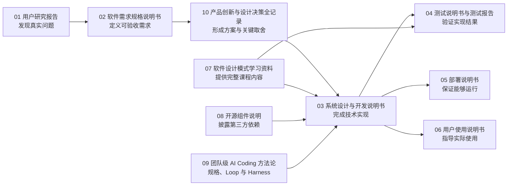

# AXIOM Space 参赛提交文档索引

> 文档编号：00  
> 文档性质：提交文档总索引  
> 适用项目：AXIOM Space  
> 适用赛题：第十五届中国软件杯 A3「基于大模型的个性化资源生成与学习多智能体系统开发」

## 1. 文档目的

本索引用于向评审明确 AXIOM Space 最终提交文档的组成、职责边界、证据关系和阅读顺序。

每份文档只承担一种主要责任。相同事实只在一份文档中完整说明，其他文档通过编号或链接引用，避免重复叙述、内容冲突和版本失真。

本索引只负责导航，不代替任何需求、设计、测试、部署或合规证据。

本套提交文档共同证明四项核心价值：

| 评审维度 | AXIOM Space 的核心结论 | 主要证据 |
|---|---|---|
| 需求价值 | 大学生真正缺少的不是更多内容，而是持续、个性化、可验证的掌握过程 | 01、02 |
| 产品创新 | 以 Agent Harness 为牵引，将画像、路径、卡片、资源、RAG、图谱与评估组成同一学习闭环 | 10、03 |
| 工程能力 | 从领域对象、接口、状态和权限到部署、测试均形成可追溯实现 | 03、04、05 |
| 交付完整性 | 课程内容、用户操作、开源来源和 AI 开发过程分别具有独立文档 | 06、07、08、09 |

## 2. 编排原则

1. **单一职责：** 每份文档只回答一个核心问题。
2. **证据归位：** 调研证据进入用户研究报告，验收结果进入测试文档，第三方信息进入开源说明。
3. **需求可追溯：** 用户问题应能依次追溯到系统需求、技术实现和测试结果。
4. **事实优先：** 只记录已经完成、能够运行或有数据支撑的内容；规划能力和已实现能力必须明确区分。
5. **减少重复：** 采用职责化文档体系，避免泛化“项目说明书”和综合汇编造成信息冲突。

## 3. 提交文档总表

| 编号 | 文档名称 | 核心责任 | 它要回答的问题 |
|---|---|---|---|
| 00 | [提交文档索引](./00-提交文档索引.md) | 文档导航与职责定义 | 全部材料如何组织、应该先看什么？ |
| 01 | [用户研究报告](./01-用户研究报告.md) | 还原目标用户及真实学习问题 | 新时代大学生究竟遇到了什么学习困难？ |
| 02 | [软件需求规格说明书](./02-软件需求规格说明书.md) | 把用户问题转化为可验收的软件需求 | 系统必须做什么，做到什么程度才算完成？ |
| 03 | [系统设计与开发说明书](./03-系统设计与开发说明书.md) | 说明技术方案及其实际实现 | 系统如何设计，又是怎样被开发出来的？ |
| 04 | [测试说明书与测试报告](./04-测试说明书与测试报告.md) | 定义并执行系统验证 | 系统如何被验证，实际测试结果是什么？ |
| 05 | [部署说明书](./05-部署说明书.md) | 使系统能够被独立安装和运行 | 在新的环境中怎样把系统可靠地运行起来？ |
| 06 | [用户使用说明书](./06-用户使用说明书.md) | 指导用户完成核心学习任务 | 学生或评委怎样正确使用系统？ |
| 07 | [《软件设计模式》系统化学习资料](./07-软件设计模式系统化学习资料.md) | 提供一门可直接学习和导入系统的完整课程资料 | 学习者如何从基础到实践掌握软件设计模式？ |
| 08 | [开源组件使用与合规说明](./08-开源组件使用与合规说明.md) | 披露第三方开源依赖及许可证责任 | 项目借用了哪些开源成果，分别怎样合规使用？ |
| 09 | [团队级 AI Coding 方法论与 AI 辅助开发流程说明](./09-AI工具使用与AI辅助开发流程说明.md) | 完整呈现团队研究并实践的 AI Coding、Loop 与 Harness 方法 | 怎样把 AI 从代码生成工具变成受规格、测试和证据驾驭的工程执行单元？ |
| 10 | [产品创新与设计决策全记录](./10-产品创新与设计决策全记录.md) | 完整呈现产品创新形成过程与关键取舍 | 团队为什么这样设计，每一步如何比较、推导并形成最终决策？ |

## 4. 各文档职责

### 00-提交文档索引

**用途：** 为评审提供统一入口，说明每份文档的用途、边界、证据位置和相互关系。

**不承担：** 不在本文件中展开需求、技术方案、测试结论或产品宣传。

### 01-用户研究报告

**用途：** 用访谈、问卷、观察、学习任务或其他可追溯材料，证明目标学生的学习需求和痛点真实存在。

**主要内容：**

- 研究目标、对象、样本和方法；
- 原始问题、典型表达与统计结果；
- 学习资源、个性化指导、知识掌握和学习反馈方面的真实痛点；
- 用户分层、典型场景和关键发现；
- 调研限制及不能由现有数据推出的结论。

**职责边界：** 本文档陈述“用户发生了什么”，不设计系统功能，也不解释技术实现。

### 02-软件需求规格说明书

**用途：** 将用户研究结论和赛题要求转化为明确、可编号、可测试的软件需求。

**主要内容：**

- 产品范围、目标用户和使用场景；
- 功能需求、非功能需求、数据需求和约束条件；
- 多智能体、动态画像、多类型资源、学习路径、精准推送及加分能力的需求定义；
- 前沿 AI 技术与具体需求的对应关系；
- 每项需求的优先级、验收标准和追溯编号；
- 不在本次交付范围内的能力。

**职责边界：** 本文档只规定“系统必须做什么”，不写架构、代码实现或测试结果。

### 03-系统设计与开发说明书

**用途：** 说明 AXIOM Space 的系统架构、技术方案和实际开发实现，是系统技术全貌的主要文档。

**主要内容：**

- 总体架构、领域边界、数据流和技术栈；
- 多智能体角色、协作协议、工具调用和状态流转；
- 动态画像、学习路径、资源生成、推送、评估、RAG 与知识图谱设计；
- 用户界面、核心交互和多模态内容呈现设计；
- 数据模型、接口契约、系统集成和关键实现；
- 前沿 AI 技术的融合思路与实现方法；
- 防幻觉、内容安全、权限、错误处理和稳定性设计；
- 性能优化、开发过程及创新设计的工程落地；
- 需求编号到实现模块和关键代码的追溯关系。

**职责边界：** 本文档负责“怎样设计和实现”，不重复用户调研，不记录测试执行结果，也不承担安装操作教程。

### 04-测试说明书与测试报告

**用途：** 在同一份验证文档中先规定测试方法和通过标准，再记录真实执行结果。

**主要内容：**

- 测试范围、环境、数据、策略和退出条件；
- 需求编号与测试用例的追溯矩阵；
- 核心功能、接口、智能体协作和端到端流程测试；
- 性能、响应时间、生成进度、兼容性和稳定性测试；
- 防幻觉、内容安全、异常输入和失败恢复测试；
- 用户体验与学习效果验证；
- 实际执行记录、通过率、失败项、缺陷、复测结果和验收结论；
- 当前已知限制与未覆盖风险。

**职责边界：** 本文档只负责“如何验证以及验证结果”，不重新解释系统设计。

### 05-部署说明书

**用途：** 让未参与开发的人能够在常规环境中完成安装、配置、初始化、启动和健康检查。

**主要内容：**

- 推荐环境、最低环境和依赖条件；
- 环境变量、模型服务、数据库及外部服务配置；
- 依赖安装、数据库迁移和初始数据导入；
- 开发模式与生产模式的启动步骤；
- 服务状态、健康检查和部署成功判定；
- 常见部署故障、定位方法和恢复步骤；
- 敏感配置与数据安全注意事项。

**职责边界：** 本文档只负责“把系统运行起来”，不讲解产品业务操作。

### 06-用户使用说明书

**用途：** 指导学生、教师或评委完成 AXIOM Space 的主要学习流程。

**主要内容：**

- 账号进入、课程选择和初始画像；
- 学习资料导入及学习路径生成；
- 对话学习、主动追问和卡片沉淀；
- 多类型资源生成、查看与使用；
- 学习评估、路径调整和资源推送；
- 画像、知识图谱和历史学习记录查看；
- 常见操作问题和用户侧错误处理。

**职责边界：** 本文档只讲“怎样使用”，不提供安装部署、架构原理或开发细节。

### 07-《软件设计模式》系统化学习资料

**用途：** 提供一份真正面向学习者的完整课程资料，同时作为 AXIOM Space 可导入、可生成路径、可开展评估的高校课程内容样本。

**内容方向：**

- 面向对象基础与设计模式产生的问题背景；
- SOLID 等核心设计原则；
- 创建型、结构型和行为型设计模式；
- 每个模式的适用场景、结构、实现、反例和常见误区；
- 模式之间的区别、组合方式和选择依据；
- 分章节练习、代码实践、复习问题和综合项目；
- 从“能识别模式”到“能在真实问题中选择和实现模式”的递进学习路径。

每章应具有学习目标、前置知识、核心讲解、示例、反例、练习和章节检查点，形成可连续学习的课程，而不是设计模式名词汇编。

**职责边界：** 本资料只承担课程教学，不介绍 AXIOM Space 项目，也不承担数据集清单或技术说明书的职责。

### 08-开源组件使用与合规说明

**用途：** 集中披露项目直接使用或修改的开源组件，明确来源、用途、许可证义务和自主开发边界。

**主要内容：**

- 开源组件名称、版本、官方网站和代码仓库；
- 组件在项目中的具体用途；
- 许可证名称、版权声明和再分发要求；
- 是否修改源码以及修改范围；
- 需要随作品保留的许可证或声明；
- 开源实现与团队自主开发代码的边界。

**职责边界：** 本文档只负责开源来源与合规，不描述 AI 辅助开发过程。

### 09-团队级 AI Coding 方法论与 AI 辅助开发流程说明

**用途：** 以团队内部研究成果《团队级 AI Coding 简明手册 v0.2》为主体，系统说明从 Rules、Specification、Skills 到 Loop Engineering、Harness Engineering 的完整方法、具体流程、验证结果与项目实践。

**主要内容：**

- AI 编程思想从原始交互、Rule、SDD、Loop Engineering 到 Harness Engineering 的演进；
- 需求规格、原型、上下文、技术 DSL、打样工程和多任务隔离的具体做法；
- 研发自测核心 Loop、E2E 超级 Loop 和 Browser Use→Playwright 固化流程；
- Agent as Code 的仓库组织、工具共享、权限与证据治理；
- 团队具体设计、检验并实践出的项目级 Harness 方法论；
- 30 页方法论材料的逐页研究与执行说明；
- AXIOM 使用的 Codex、Claude Code、Browser Use、Playwright 及运行时 AI 能力，仅作为方法落地旁证。

**职责边界：** 本文档以团队级 AI Coding 方法论为唯一主体；项目架构、运行时模型和工具清单只用于证明方法怎样落地，不重复系统设计，也不承担开源许可证清单。

### 10-产品创新与设计决策全记录

**用途：** 以 2 号目录的 10 份原始设计记录为主体，完整呈现 AXIOM Space 从问题定义、候选方案比较、约束分析到最终产品与技术决策形成的全过程。

**主要内容：**

- 技术架构、事实源和系统分层的选型依据；
- 自研垂直领域 Agent Harness、双 Agent 与按需子 Agent 的形成过程；
- Web 工作台优先的产品形态取舍；
- 知识图谱、RAG、知识准入、画像闭环、主动推送和学习评估的创新设计；
- 每项决策比较过的方案、否决理由、数据契约、交互规则和成功标准；
- 工程目录治理与长期可维护性要求；
- 决策记录与需求、实现和测试文档之间的对应关系。

**职责边界：** 本文档负责“为什么这样设计以及决策怎样形成”，不重复 03 的实现细节，也不替代 04 的当前测试结论。

## 5. 文档之间的证据链



最重要的主证据链是：

```text
用户研究发现
  → 软件需求
  → 产品创新与设计决策
  → 系统设计与实现
  → 测试用例
  → 测试结果
```

所有重要能力均应沿这条链完成追溯。版本级能力认定以需求编号、设计依据、实现位置和测试结果共同构成。

## 6. 文档体系结构

1. `03-系统设计与开发说明书`统一承担技术方案与实际实现说明。
2. `04-测试说明书与测试报告`统一承担验证设计、执行记录与验收结论。
3. `07-《软件设计模式》系统化学习资料`作为可直接学习、可导入系统和可开展评估的完整课程内容。
4. `08-开源组件使用与合规说明`承担第三方软件合规；`09-AI工具使用与AI辅助开发流程说明`独立承担团队级 AI Coding、Loop 与 Harness 方法论，边界清晰。
5. `10-产品创新与设计决策全记录`独立承担方案比较、设计推导和创新形成证据，完整保留 2 号目录原始记录。
6. 演示 PPT、演示视频、项目源码、运行配置和课程资源文件属于赛事总提交物，与本说明书体系共同组成完整交付。

## 7. 阅读路径

- **项目综合评审：** 00 → 01 → 02 → 10 → 03 → 04。
- **产品创新评审：** 01 → 02 → 10。
- **技术实现与复现：** 03 → 05 → 04。
- **用户体验与课程内容：** 06 → 07。
- **AI 工程方法与验证：** 09 → 03 → 04。
- **第三方开源来源与合规：** 08。
