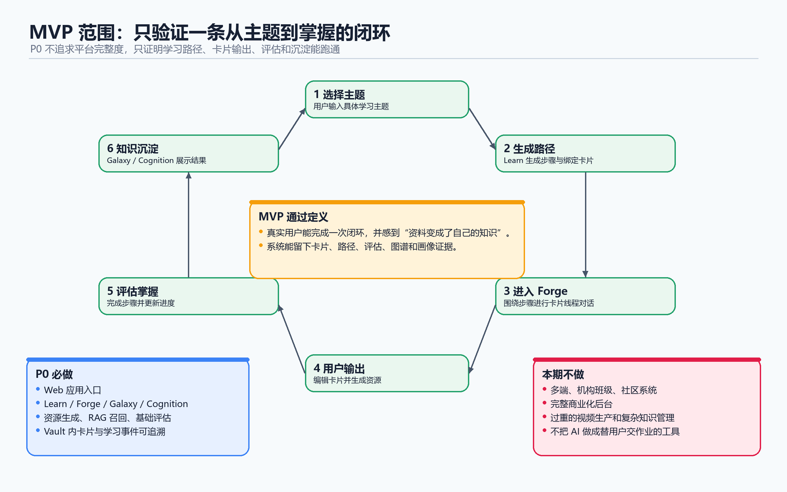

# AXIOM Space 软件需求规格说明书

> 文档编号：02  
> 文档性质：Software Requirements Specification，SRS  
> 核心职责：回答“系统必须做什么，做到什么程度才算满足赛题与用户需求？”  
> 上游文档：[01-用户研究报告](./01-用户研究报告.md)  
> 下游文档：[10-产品创新与设计决策全记录](./10-产品创新与设计决策全记录.md)、[03-系统设计与开发说明书](./03-系统设计与开发说明书.md)、[04-测试说明书与测试报告](./04-测试说明书与测试报告.md)

## 需求基线摘要

**AXIOM Space 不是以“生成一段答案”为完成，而是以“学生形成可验证、可积累、可继续的掌握证据”为完成。**

| 需求层级 | AXIOM Space 必须交付的结果 |
|---|---|
| 认识学生 | 通过自然对话建立不少于 6 个维度的动态画像，并保留来源、置信度和更新历史 |
| 组织学习 | 将主题或完整课程资料转化为可执行、可调整的个性化学习路径 |
| 推动掌握 | AI 主动提问，学生亲自解释、举例、关联和应用；系统不能把 AI 回复直接当作学生掌握 |
| 多智能体协同 | 前台教学、后台分析、质量审核及资源角色围绕同一学习对象协作，并留下状态和证据 |
| 个性化资源 | 至少生成 5 类可真实打开、与当前缺口相关的学习资源，并展示生成进度 |
| 长期沉淀 | 卡片、关系、画像、评估、路径、资源和会话在下一次学习中继续发挥作用 |
| 可信边界 | 来源引用、内容检查、权限隔离、失败恢复和审计机制共同降低错误进入长期知识的风险 |

本说明书把赛题要求转换为三种可检查对象：

1. **功能需求 FR：** 用户或系统必须完成的行为。
2. **非功能需求 NFR：** 性能、安全、可靠性、可用性和可信度约束。
3. **验收条件 AC：** 测试时能够明确判断“通过或不通过”的结果。

## 目录

- [1. 文档目的与适用范围](#1-文档目的与适用范围)
- [2. 产品目标与边界](#2-产品目标与边界)
- [3. 用户角色与核心场景](#3-用户角色与核心场景)
- [4. 需求来源与优先级](#4-需求来源与优先级)
- [5. 功能需求](#5-功能需求)
- [6. 非功能需求](#6-非功能需求)
- [7. 数据与课程资料需求](#7-数据与课程资料需求)
- [8. AI 技术与需求结合点](#8-ai-技术与需求结合点)
- [9. 权限、状态与产品边界](#9-权限状态与产品边界)
- [10. 总体验收与追溯](#10-总体验收与追溯)
- [附录 A：A3 赛题原始要求](#附录-aa3-赛题原始要求)
- [附录 B：MVP 定义真源](#附录-bmvp-定义真源)
- [附录 C：PRD 真源](#附录-cprd-真源)

## 1. 文档目的与适用范围

本文档描述 AXIOM Space 面向第十五届中国软件杯 A3 赛题的系统需求。它规定目标用户、业务场景、功能、非功能约束、数据要求和验收边界，不规定具体代码结构。

适用范围为 Web 端个人掌握学习闭环：

~~~text
登录并进入个人 Vault
  → 通过对话建立或更新画像
  → 输入主题或导入课程资料
  → 生成并执行个性化学习路径
  → 在 Forge 中接受主动提问并亲自输出
  → 生成或接收个性化资源
  → 完成卡片审核与学习评估
  → 更新路径、画像、图谱和下一步建议
  → 下次进入时从已有证据继续
~~~

## 2. 产品目标与边界

### 2.1 产品目标

AXIOM Space 是一个 AI 掌握学习系统。它主动认识用户、追问用户、准备路径和资源，但坚持让用户自己输出，直到外部资料变成用户能够解释、关联、应用和迁移的知识。

系统需要解决五个根本问题：

1. 学生面对陌生领域时不知道自己该问什么。
2. 学生看过很多资料，却没有输出、反馈和掌握判断。
3. 学习记录散落在对话、网页、课程、笔记和脑中，无法积累。
4. 通用内容和统一路径无法适应不同基础、目标、节奏和认知偏好。
5. AI 内容可能流畅但错误，不能未经检查进入长期知识结构。

### 2.2 产品底线

- AI 主动诊断和追问，而不是只等待高质量问题。
- 用户自己输出，而不是 AI 替用户完成学习。
- 资料不是知识，AI 回复不是掌握，保存卡片也不自动等于能力掌握。
- 个性化必须实际改变问题、路径、资源或推送，不能只展示画像标签。
- 系统可以降低幻觉和错误污染风险，但不得宣称彻底消除大模型幻觉。
- 学习过程必须沉淀为可追溯对象，而不是只保留一段聊天历史。

### 2.3 本期非范围

本期不要求：

- 移动端、桌面端、小程序、浏览器插件或其他多端形态；
- 教师后台、班级管理、机构多租户和教务系统集成；
- 社区、好友、排行榜、公开知识广场；
- 支付、订单、发票和完整商业化后台；
- 让用户手工维护复杂的知识管理系统；
- 用 AI 替学生完成作业、论文或最终学习输出。

## 3. 用户角色与核心场景

### 3.1 个人学习者

MVP 的核心用户是有真实学习动机、愿意为了掌握而进行主动输出的大学生、研究生、自学者、开发者、写作者和研究型学习者。

个人学习者需要：

- 选择主题或导入一份课程资料；
- 获得适合当前基础的学习路径；
- 接受 AI 的解释、提示、追问和反馈；
- 用自己的话形成卡片、回答和迁移结果；
- 查看自己掌握了什么、哪里仍然薄弱；
- 在下一次学习中继承已有知识和学习状态。

### 3.2 AI 学习导师

AI 学习导师不是独立终端用户，而是用户体验中的核心角色。它需要根据主题、画像、已有卡片、当前路径和评估证据采取教学行动，并避免直接替用户完成全部思考。

### 3.3 系统

系统负责身份与 Vault 隔离、对象持久化、智能体编排、事件与状态同步、资源交付、检索引用、评估记录和审计追踪。

### 3.4 核心场景

- 从一个主题开始学习。
- 从一份或一门完整课程资料进入学习。
- 围绕一张尚未掌握的卡片继续深入。
- 根据画像和当前缺口主动获得资源建议。
- 完成一次输出、审核、迁移和路径调整。
- 学习结束后查看图谱、画像、评估证据和下一步。

## 4. 需求来源与优先级

### 4.1 需求来源

| 来源 | 作用 |
|---|---|
| A3 赛题 | 规定动态画像、多智能体、至少 5 类资源、路径推送、可信性、运行与文档要求 |
| 用户研究 | 证明“不知道怎么问、看懂却不会、知识碎片化、AI 不可靠”等真实问题 |
| 产品信念 | 坚持 AI 引导、用户输出和长期沉淀 |
| MVP / PRD | 定义 Web 闭环、页面、状态、业务规则和验收条件 |
| DDD 与 TDD | 将需求落实为领域对象、契约、测试和错误边界 |
| 决策记录 | 解释 Web、Harness、图谱、RAG、画像、推送和评估方案的选择 |

### 4.2 优先级

- **P0：** 缺失即无法形成完整参赛闭环。
- **P1：** 显著增强个性化、可信度和工程完整性。
- **P2：** 后续产品扩展，不作为当前闭环通过条件。

## 5. 功能需求

### FR-001 身份、用户与 Vault 隔离

**优先级：P0**

系统必须支持用户进入 Web 应用、登录并选择或创建个人 Vault。卡片、路径、步骤、会话、画像、图谱、资源、评估和推送必须归属于当前用户及当前 Vault。

**验收条件：**

- 未登录用户不能访问个人 Vault。
- 用户不能通过修改标识访问其他用户的 Vault 数据。
- 所有写操作必须检查身份和 Vault 归属。
- 切换 Vault 后，页面、查询缓存和当前对象不得残留上一个 Vault 的数据。

### FR-002 完整课程资料导入

**优先级：P0**

系统必须能够接收至少一门完整高校专业课程的初始知识库或文档集，并将资料转化为可继续学习的对象，而不是只保存一个文件。

**输入：** 课程资料、主题、标题及必要元数据。  
**输出：** 文献卡、概念卡、关系、星团和可选学习路径。

**验收条件：**

- 空资料被明确拒绝。
- 导入结果能够在 Learn、Forge 或 Galaxy 中继续使用。
- 某一后续步骤失败时，已经成功生成的合法对象不会被无提示地全部丢弃。
- 提交包中存在一份完整的《软件设计模式》系统化学习资料。

### FR-003 对话式初始画像

**优先级：P0**

系统必须通过自然语言对话建立初始学习画像，不得要求用户先完成繁琐静态表单。画像维度不少于 6 个，并覆盖知识基础、学习目标、认知或表达偏好、易错点、学习节奏、资源偏好等信息。

**验收条件：**

- 用户完成一轮有效对话后能够看到不少于 6 个画像维度。
- 每个关键判断能够关联用户原话、行为或其他来源证据。
- 数据不足时明确显示未知、低置信或待观察，不凭空补齐。
- 用户可以理解画像是可更新假设，而不是不可更改的标签。

### FR-004 画像随学随新并参与决策

**优先级：P0**

画像必须随对话、卡片、路径、资源使用和评估结果更新，并实际影响下一轮教学行为。

**验收条件：**

- 系统保留画像更新前后差异、来源和时间。
- 画像至少能够改变提问方式、解释方式、资源形式、路径安排或推送建议之一。
- 前端能够向用户展示系统为什么做出该建议。
- 画像更新失败不得破坏当前对话和既有画像事实。

### FR-005 个性化学习路径

**优先级：P0**

系统必须根据主题或资料、学习者画像、已有知识、当前进度和掌握证据生成有顺序、可执行的学习路径。

**验收条件：**

- 路径包含若干有顺序的步骤和明确状态。
- 第一个合法步骤可被打开并进入学习工作台。
- 已掌握前置内容可以跳过，当前缺口可以插入或调整。
- 步骤完成或评估发生后，路径进度和下一步随之更新。
- archived、deleted 或不属于当前 Vault 的路径不得继续作为活动路径。

### FR-006 多智能体协同

**优先级：P0**

系统必须体现真实的多智能体架构。不同智能体或隔离角色需要围绕同一学习对象分工协作，而不是只在界面上展示多个角色名称。

**最低职责：**

- 前台教学与对话；
- 后台观察、画像或卡片处理；
- 独立质量审核；
- 按需资源生成角色。

**验收条件：**

- 能够展示一轮学习中不同职责的输入、输出和状态变化。
- 多智能体协作修改的是可持久化业务对象。
- 任一子任务失败时，系统能够识别失败来源，不把部分失败伪装成整体成功。
- 写入、删除、升级等高风险动作受到工具契约和确认机制约束。

### FR-007 Forge 学习工作台与用户输出

**优先级：P0**

Forge 必须围绕具体卡片或学习步骤组织对话、资源、引用和编辑。AI 可以解释、提示、追问和举例，但学习结果需要由用户自己的表达形成。

**验收条件：**

- 对话支持流式输出以及 Markdown、代码和必要学习内容渲染。
- 卡片线程在刷新后仍可恢复。
- 用户可以亲自编辑并保存标题和内容。
- 卡片能够承载定义、举例、关联和应用等掌握要素。
- AI 回复不会自动冒充用户理解写入“我的掌握证据”。

### FR-008 三类卡片与质量升级

**优先级：P0**

系统必须区分 fleeting、literature、permanent 三种知识状态：

- fleeting：用户的零散想法、疑问和未完成理解；
- literature：来自课程、资料或外部来源的内容；
- permanent：经过用户输出和质量审核后可长期复用的理解。

**验收条件：**

- 三类卡片的语义、来源和状态在界面中可区分。
- 卡片升级 permanent 前必须经过明确审核门槛。
- 审核失败必须给出具体缺口并保留失败证据。
- permanent 表示内容达到长期知识准入要求，不自动等于所有相关能力已经掌握。

### FR-009 个性化多类型资源生成

**优先级：P0**

系统必须由不同角色协作生成至少 5 种与当前课程、知识缺口、画像或路径相关的个性化学习资源。

目标资源类型包括：

1. 讲解文档；
2. 思维导图；
3. 练习题或题库；
4. 代码实操案例；
5. 拓展阅读；
6. 图示或多模态视频 / 动画。

**验收条件：**

- 至少 5 种资源存在真实内容并可以打开或预览。
- 每份资源记录类型、标题、状态及与当前学习对象的关系。
- 不能用 DOCX、PDF、PPTX 等不同附件格式重复计算同一种教学资源。
- 资源内容需要通过类型检查、基本质量检查和必要的来源或风险提示。

### FR-010 资源进度、失败隔离与交付

**优先级：P0**

资源生成属于可能耗时的任务，系统必须提供真实可理解的进度、状态和失败反馈。

**验收条件：**

- 生成过程中出现阶段、进度或流式内容，避免长时间白屏。
- 单个资源失败不影响其他已成功资源的交付。
- 用户能够区分排队、生成、校验、渲染、完成和失败。
- 若视频等重资源需要后台转码，应先提供可用预览并持续更新最终状态。

### FR-011 个性化资源推送

**优先级：P0**

系统必须结合画像、路径、学习进度、知识关系和掌握证据提出资源建议，支持用户主动请求和系统主动建议两种路径。

**验收条件：**

- 推送显示“为什么推、补什么、与什么证据有关”。
- 系统建议在用户确认后才转化为真实生成或学习任务。
- 不重复推送已经掌握、已经拒绝或缺乏足够证据的内容。
- 推送状态和用户反馈能够被记录。

### FR-012 个人知识召回与 RAG

**优先级：P1**

系统必须能够检索用户真实卡片和课程资料，为当前对话、路径、资源或关联建议提供上下文。

**验收条件：**

- 检索结果能够回到真实业务对象并展示来源。
- 数据库是事实源，向量或图检索索引属于可重建派生层。
- 索引失败不能阻断卡片事实保存，但必须显示状态。
- 删除或修改事实对象后，派生索引能够重建或失效，不能反向覆盖事实源。

### FR-013 知识图谱与认知视图

**优先级：P1**

系统必须基于卡片、关系和星团展示用户知识结构。不同布局应回答不同学习问题，而不只是视觉换皮肤。

**验收条件：**

- 图谱只展示当前 Vault 的合法数据。
- 用户能够查看节点、关系、来源和所属星团。
- 用户可以从图谱节点返回相应学习对象。
- 显式关系和系统发现关系在来源与可信度上可以区分。
- 无数据、无关系、加载中和加载失败状态均被明确处理。

### FR-014 智能辅导

**优先级：P1，加分能力**

用户在学习中遇到问题时，系统应结合画像、当前卡片、课程资料和相关旧知识提供即时辅导。辅导优先通过问题、提示、反例和换角度解释帮助用户自己完成判断。

**验收条件：**

- 辅导与当前学习对象相关，不是脱离上下文的通用回答。
- 系统能够在用户理解不足时换角度解释或降低步长。
- 能在适当场景提供文字、图解、代码或视频等不同形式。
- 用户仍需完成自己的输出或迁移任务。

### FR-015 学习效果评估

**优先级：P1，加分能力**

系统应根据用户回答、卡片质量、练习、迁移任务和历史结果提供多层评估，并用评估结果调整路径和资源。

**验收条件：**

- 评估保留输入、量规、分项判断、结果和时间。
- “卡片写得清楚”和“能力已经掌握”可以被区分。
- 至少保留一次失败或不足结果，不以黄金数据伪造全会。
- 评估通过后能改变路径、画像、推送或掌握记录。
- AI 评估被表述为可复核判断，不包装成绝对真理。

### FR-016 Cognition 认知反馈

**优先级：P1**

系统应展示画像、知识缺口、观察、学习进展、证据来源和下一步建议。

**验收条件：**

- 认知反馈来自真实学习数据。
- 数据不足时显示空状态或待观察，不凭空生成完整画像。
- 用户能够查看关键结论的来源或变化历史。
- 页面提供能够返回学习行动的入口。

### FR-017 Vault 导出与数据可带走

**优先级：P1**

用户应能导出当前 Vault 的个人知识内容，避免被平台锁定。

**验收条件：**

- 只导出当前用户当前 Vault 的合法内容。
- 导出结果至少包含可读取的 Markdown 或等价开放格式。
- 无内容或导出失败时给出明确提示。
- 导出中不得泄露密钥、其他用户数据或内部敏感配置。

### FR-018 事件、通知、审计和确认

**优先级：P1**

系统必须对关键业务事件、后台进度、高风险工具调用和失败状态提供可追踪记录。

**验收条件：**

- 资源、画像、路径、卡片升级等关键状态变化能够触发页面更新或通知。
- 高风险写入、删除或外部调用具有确认或风险等级。
- 失败错误被显式暴露并可定位到阶段。
- 审计信息不得包含明文密钥和不必要的敏感数据。

## 6. 非功能需求

### NFR-001 可用性与现代 AI 交互

- 界面简洁、状态清楚，符合流式输出、Markdown 渲染和多模态卡片化展示习惯。
- 用户始终知道当前学习对象、系统正在做什么以及下一步是什么。
- 空状态、加载、成功、失败和部分成功不得共用模糊提示。
- 长任务必须提供进度或阶段反馈。

### NFR-002 性能

- 普通页面操作应保持可交互。
- 智能体核心响应应在合理时间内开始返回流式结果。
- 多模态生成较慢时必须展示进度，不能长期白屏。
- 性能指标必须在测试文档中记录真实环境和测量方法，不写无法验证的绝对数字。

### NFR-003 可靠性与一致性

- 写入业务事实和更新派生索引需要分清成功边界。
- 后台任务应支持失败状态、重试或人工恢复。
- 页面刷新、会话切换和网络中断后，不应产生重复对象或错误归属。
- 数据库事实不得被向量索引、缓存或模型输出反向覆盖。

### NFR-004 安全与隐私

- 所有个人学习数据按用户和 Vault 隔离。
- 环境变量、API 密钥、密码和令牌不得出现在前端、日志、导出或提交文档中。
- 外部输入需要防止提示注入、危险文件和越权工具调用。
- 删除、导出和高风险工具调用必须进行身份及权限检查。

### NFR-005 防幻觉与内容安全

- 课程事实和关键断言优先保留来源引用。
- AI 生成内容进入长期知识前需要用户输出、结构检查或独立审核。
- 学术内容应避免无依据的事实、伪造来源和敏感违规内容。
- 系统只能声称降低风险，不能声称彻底消除幻觉。

### NFR-006 可维护性

- 系统遵守外层依赖内层的分层架构。
- API 使用 Hono RPC 类型推导，不允许页面绕过统一客户端直接散落 fetch / axios。
- 服务端数据由 React Query 封装，全局 UI 状态由 Zustand 管理。
- 核心业务逻辑与框架、数据库和外部模型实现保持清晰边界。

### NFR-007 可追溯性

- 重要画像判断、路径调整、评估、推送和资源均应记录来源或证据。
- 需求、实现和测试之间使用稳定编号或明确映射。
- 已实现、部分实现、规划中和不可验证状态必须区分。

### NFR-008 兼容性与可部署性

- 项目文件、依赖、数据集和模型配置应整理规范。
- 在文档规定的常规环境中能够完成安装、初始化和启动。
- 外部 AI 或 RAG 服务不可用时，需要明确错误或降级边界。
- Web 应用是当前交付形态，其他终端不作为验收前提。

## 7. 数据与课程资料需求

### 7.1 初始课程资料

系统输入必须包含至少一门完整高校专业课程。本项目选择《软件设计模式》作为课程样本，资料应覆盖：

- 面向对象基础和设计原则；
- 创建型、结构型、行为型设计模式；
- 每个模式的问题、结构、适用边界、实现、反例与误区；
- 模式比较、组合、代码实践和综合项目；
- 章节目标、练习、检查点和迁移任务。

该资料本身由 07-《软件设计模式》系统化学习资料 交付。

### 7.2 核心数据对象

系统至少需要管理：

- User、Account、Session、Vault；
- Card、Cluster、Edge、WikiLink；
- LearningPath、LearningPathStep、PathAdjustment；
- LearningSession、LearningMessage、ThreadMetadata；
- EducationProfile、Observation、ProfileSnapshot、Capability、Skill；
- Assessment、Mastery、Evidence；
- Resource、ResourceManifest、PushRecord；
- RagDocumentIndex、RagReference；
- BackgroundJob、Notification、AuditLog。

对象的字段、关系、不变量和状态机由系统设计与开发说明书继续定义。

### 7.3 数据质量要求

- 每个对象具有稳定身份和 Vault 归属。
- 枚举状态使用统一契约，不允许前后端各自解释。
- 来源、时间、置信度和证据在需要判断可信度的对象上不可被随意丢失。
- 删除、归档和失效状态必须与前端选中状态、缓存和派生索引同步。

## 8. AI 技术与需求结合点

| 用户需求或风险 | AI / 系统能力 | 需求落点 |
|---|---|---|
| 陌生领域中不知道该问什么 | 对话式画像、主动提问、苏格拉底式引导 | FR-003、FR-004、FR-014 |
| 统一课程无法适配个人 | 画像编译、动态路径、个性化资源与推送 | FR-005、FR-009、FR-011 |
| 看懂但不会输出和迁移 | 费曼式输出、卡片审核、陌生任务评估 | FR-007、FR-008、FR-015 |
| 知识碎片无法关联 | 卡片、RAG、知识图谱和长期记忆 | FR-012、FR-013 |
| AI 生成可能错误 | 来源引用、独立审核、工具确认、审计与边界声明 | FR-018、NFR-005 |
| 资源生成等待时间长 | 流式输出、状态机、后台任务和进度事件 | FR-010、NFR-001、NFR-002 |
| AI 无法长期理解用户 | 画像历史、会话、卡片、评估和路径持久化 | FR-004、FR-016 |

AI 技术的使用必须跟随具体学习需求。仅仅接入大模型、向量库或多智能体框架，不构成需求完成。

## 9. 权限、状态与产品边界

### 9.1 权限边界

- 未登录用户不能进入个人 Vault。
- 用户只能访问自己的 Vault。
- 卡片、路径、步骤、会话、图谱、画像、资源和评估都必须限定在当前 Vault。
- 删除、编辑、归档、导出和高风险工具调用必须检查身份和归属。

### 9.2 状态边界

- archived 路径不出现在默认 active 列表。
- deleted 对象不再被前端选中或检索。
- permanent 卡片的旧活动线程被归档或只读。
- 流式对话切换会话时，旧流被中断。
- RAG 索引失败不阻断事实保存，但必须展示状态。
- 部分资源失败不得把整个资源包显示为全部成功。

### 9.3 产品边界

- AXIOM 不替用户完成学习。
- AXIOM 不把 AI 回答等同于掌握。
- AXIOM 不把收藏资料等同于知识沉淀。
- AXIOM 不把画像和 AI 评估当作不可复核的绝对判断。
- AXIOM 当前不承诺宏观教育公平、班级管理或商业化能力已经实现。

## 10. 总体验收与追溯

### 10.1 P0 场景验收

一个完整 P0 验收必须证明：

1. 用户进入自己的 Vault。
2. 系统通过对话建立不少于 6 维初始画像。
3. 用户导入完整课程资料或选择课程主题。
4. 系统生成学习对象和可执行路径。
5. 用户打开一个具体学习任务进入 Forge。
6. 前台 Agent 主动提问，用户亲自回答，后台 Agent 形成可追溯记录。
7. 用户完成卡片打磨，至少经历一次可解释的审核结果。
8. 系统生成或交付不少于 5 类个性化资源，并展示进度。
9. 评估或学习结果改变路径、画像、图谱或推送。
10. 刷新或重新进入后，学习状态能够继续。

### 10.2 需求—实现—测试追溯

| 需求组 | 设计与开发责任 | 测试责任 |
|---|---|---|
| FR-001—FR-004 | 身份、Vault、画像协议与画像更新 | 权限隔离、六维画像、证据与更新测试 |
| FR-005—FR-008 | 路径、Harness、Forge、卡片审核 | 主闭环、状态机、失败与升级测试 |
| FR-009—FR-011 | 资源编排、进度、推送引擎 | 五类资源、失败隔离、推送依据测试 |
| FR-012—FR-013 | RAG、索引、图谱与认知视图 | 来源回映射、索引一致性、图谱边界测试 |
| FR-014—FR-016 | 辅导、评估、Cognition | 追问、量规、迁移、画像反馈测试 |
| FR-017—FR-018 | 导出、事件、通知、审计与确认 | 数据导出、事件更新、风险确认测试 |
| NFR-001—NFR-008 | 横跨架构与基础设施 | 性能、安全、可靠性、可部署性测试 |

### 10.3 完成定义

本需求说明书的完成，不以“章节已经写完”为标准，而以以下条件为准：

- 每项 P0 需求具有稳定编号、明确输入输出和可否证验收条件。
- 每项 P0 需求能在设计文档中找到实现责任。
- 每项 P0 需求能在测试文档中找到测试用例和执行结果。
- 不在范围内的能力不会被宣传材料写成已实现。
- 用户研究中的“仍需验证”不会在本说明书中被偷换为已验证事实。


## 附录 A：A3 赛题原始要求

> 本附录保留赛题真源，正文中的每项要求均应能够回到这里复核。

### 第十五届中国软件杯大赛--A组赛题

**赛题名称：** 基于大模型的个性化资源生成与学习多智能体系统开发
**组类：** A组（本科、研究生、高职）
**出题企业：** 科大讯飞股份有限公司
**答疑QQ群：** 1072584310

---

#### 赛题简介

在数字化与智能化深度融合的时代，高等教育的个性化变革成为核心发展方向，同时也面临传统教学模式适配性不足的挑战。不同学生在知识基础、学习能力、兴趣方向上的显著差异，使得标准化教学难以满足个性化学习需求，部分学生存在知识吸收效率低的问题。当前大模型技术迎来高速发展新阶段，以通用大模型、多模态生成大模型(如SeeDance等)、AI辅助编程工具(如Claude Code等)为代表的技术体系，具备强大的自然语言理解、多模态内容生成、代码辅助开发及实时推理能力，为高等教育领域的创新升级带来全新契机。本赛题旨在借助大模型技术体系，融合前沿AI技术，突破传统教育的技术与模式局限，要求参赛团队构建高等教育个性化学习资源体系，开发智能学习智能体系统，切实满足学生的个性化、多模态学习需求。

---

#### 赛题业务场景

在高等教育学习过程中，学生普遍面临学习资源繁杂无序、难以精准匹配自身需求且缺乏智能化、个性化学习指导的核心问题。不同专业、不同学历水平的学生在面对海量课程资料、学术文献、学习辅助工具时，难以快速筛选出契合自身学习进度和能力的资源；同时课堂集体讲授模式无法兼顾每位学生的学习节奏与特点，导致学生在知识掌握和能力提升上存在明显差距。传统学习模式及基础的智能辅助系统，因缺乏多模态生成、多智能体协同等前沿AI技术的支撑，难以满足现代高等教育对培养创新型、个性化人才的要求。基于此，本赛题要求参赛团队构建多智能体系统，为学生打造专属的个性化资源学习智能体，并借助多智能体协作实现智能化、精准化的学习引导。系统需依托各类高等教育资源，融合多模态生成、代码辅助开发等技术，以某一具体专业课程(如人工智能、计算机、电子信息相关等)为切入点，实现个性化资源的自动化生成与建设，根据学生个体情况提供定制化、多模态的学习内容，全方位辅助学生开展自主学习，真正实现"因材施教"的数字化落地。

---

#### 基本功能需求

参赛团队需深入调研和研究新时代大学生的学习需求和痛点，融合前沿AI技术和工具，开发出能够高效生成个性化、多模态学习资源(如资源设计方案、PPT、题库、多模态视频/动画、实操案例、实践项目学习材料等)的智能体系统，实现提升学生学习效率、优化学习资源利用、增强学习效果的核心目标。该系统应包含以下核心功能：

1. **对话式学习画像自主构建：** 摒弃传统繁琐表单，支持通过自然语言对话(结合学生的专业、学习目标、学习历史等)自动抽取特征，构建包含不少于6个维度(如知识基础、认知风格、易错点偏好等)的动态学生画像，并支持画像的随学随新。

2. **多智能体协同的资源生成：** 系统须体现"多智能体"架构设计；通过与学生的智能交互，大模型结合AI前沿技术和工具，依据学生提供的专业、课程内容、知识短板、学习需求等信息，生成针对性的多模态学习资料，须由不同角色的智能体协作完成至少5种类型的个性化资源生成，如专业课程讲解文档、知识点思维导图、不同类型练习题目、拓展阅读材料、多模态教学视频/动画、代码类实操案例等，为学生提供全方位学习参考。

3. **个性化学习路径规划和资源推送：** 依托多智能体协同工作机制，整合系统生成的个性化资源，结合大模型对学生专业、学习进度、知识掌握情况及学习偏好的深度分析，为学生规划科学、动态的个性化学习路径，明确学习步骤和顺序；同时基于画像实现学习资源的精准推送，涵盖文档、视频、题库、实操案例等多类型内容。

4. **智能辅导（可选加分项）：** 当学生在学习过程中遇到问题时，系统提供即时、多模态的答疑解惑服务，通过智能体的数据分析、大模型的知识支持，结合多模态生成技术，为学生提供详细的文字解答、图解说明、短视频讲解等多样化解答形式，实现针对性学习引导。

5. **学习效果评估（可选加分项）：** 通过实时跟踪学生的学习行为、练习测试情况、资源使用反馈等数据，依托大模型的数据分析能力实现对学生学习效果的多维度、精准评估；并根据评估结果及时动态调整学习资源推送策略和学习计划，实现学习方案的持续优化。

---

#### 非功能性需求

1. 系统界面美观大方、简洁明了，交互逻辑清晰，符合现代AI产品交互规范(如流式输出、Markdown渲染、多模态内容卡片化展示)，无明显功能与界面错误，可结合AI技术实现交互体验的智能优化；
2. 若开发过程中使用开源项目、前沿AI工具/框架，需在提交文档的显著位置标注名称、来源及相关协议要求；
3. 系统需具备完善的"防幻觉"与内容安全过滤机制，确保生成的学术内容无事实性错误、无敏感违规信息；
4. 智能体核心功能的响应时间控制在合理范围内，保障学生的日常使用体验，多模态资源生成的响应效率需满足实际学习场景需求，如提供"生成进度追踪"或"流式呈现"机制，避免长时间白屏等待。

---

#### 实现条件

本赛题对开发环境、编程语言、数据库、编辑器、硬件平台等均不做限制，参赛团队可结合等前沿AI技术/工具，借助各类开源工具完成开发工作，需明确系统中"多智能体协同框架"，但须严格遵循开源协议及相关工具的使用要求，确保智能体程序可稳定、正常运行；智能体开发框架不做限制；开发过程中使用的其他AI辅助工具，需选用科大讯飞相关工具。

---

#### 测试数据或平台

参赛团队需自行构造至少一门完整高校专业课程(如人工智能、计算机、电子信息相关等)的初始知识库/文档集作为系统输入。

---

#### 文档及其他要求

参赛团队提交的文档需参考软件系统的标准文档规范，包括但不限于系统开发说明书、测试说明书等，且须满足以下核心要求：

1. **需求层面：** 需深入了解和研究新时代大学生的学习需求，结合前沿AI技术的应用场景完成系统性的需求分析，明确技术与需求的结合点；
2. **技术开发层面：** 详细阐述智能体的设计、开发、测试、部署全流程，包括用户界面设计、功能实现、系统集成及优化等方面的工作；重点说明前沿AI技术在系统中的融合应用思路、实现方法，同时指出系统开发过程中采纳的创新实践和用户体验提升策略。

参赛团队须确保以上两个层面的内容在文档中条理清晰、逻辑连贯，并且有充分的数据与案例支撑，以便能够全面体现系统的深度与广度。此外，鼓励参赛团队通过图表、流程图、架构图等视觉工具增强文档的可读性和说服力。

---

#### 各评分项及大致占比

| 评分项 | 占比 |
|--------|------|
| 创新价值与实用性 | 35% |
| 功能实现及技术要求 | 45% |
| 配套文档的丰富度 | 10% |
| 演示视频、PPT效果 | 10% |

---

#### 初赛作品提交要求

1. **演示PPT：** 须清晰展示智能体应用价值、前沿AI技术融合思路与实现方法、创新价值、核心功能等内容，逻辑清晰、重点突出；
2. **可完整运行的多智能体相关文件：** 包含但不限于项目源码、数据集、模型部署配置文件等，文件整理规范，可在常规环境下正常运行；
3. **智能体演示视频：** 时长控制在7分钟之内，须清晰展示系统的操作流程、核心功能、多模态资源生成效果及前沿AI技术的应用成果；
4. **智能体开发类型：** 不限，包括但不限于Web应用、移动端开发、小程序端开发等；
5. **配套文档：** 需满足上文"文档及其他要求"中的所有规范，文档格式统一、内容完整。
6. **如若使用AI Coding工具，给出相关说明。**

---

#### 附注

参赛团队作品中团队自主开发部分的软件作品著作权归参赛团队所有，其中具有市场应用及拓展的优秀作品，出题企业具有优先权，可以优先合作开发或者优先购买。另如基于该作品的任何合作升级开发、市场拓展等活动，以及在这一过程中所获得的任何商业费用，出题企业应与参赛团队协商解决。

## 附录 B：MVP 定义真源

> 本附录保留 Web MVP 的原始范围、成功指标、验证方式与后续边界。

### 04 MVP 定义

#### 1. MVP 目标

第一版 MVP 要验证一件事：

**用户是否愿意用 AXIOM 完成一次“从资料到掌握”的学习闭环。**

这个闭环不是让 AI 直接给答案，也不是让用户单纯保存笔记，而是：

```text
选择主题 / 导入资料
  -> 生成学习路径
  -> 进入具体学习任务
  -> 通过 Forge 与 AI 对话
  -> 用户亲自补全概念卡片
  -> 系统评估掌握情况
  -> 卡片进入知识网络
  -> 画像和下一步路径更新
```



MVP 的核心验证点是：

- 用户是否接受 AI 主动引导，而不是只要答案。
- 用户是否愿意亲自输出概念卡片。
- 用户是否能感受到“资料变成自己的知识”。
- 用户是否认为 AXIOM 和普通 ChatGPT / 笔记工具有明显区别。

#### 2. 目标用户

第一版优先服务个人学习者，而不是学校、班级或机构。

目标用户是：

- 有真实学习动机的人。
- 想把一门课、一个主题或一个复杂概念学明白的人。
- 已经会使用 AI 或愿意尝试 AI 学习工具的人。
- 愿意为了真正掌握而进行少量主动输出的人。

第一版重点用户可以是：

- 大学生或研究生。
- 长期自学者。
- 开发者、写作者、研究型学习者。
- 已经在用 ChatGPT、Claude、Kimi、Obsidian、Notion 等工具学习，但觉得学习结果不够沉淀的人。

第一版暂不优先服务：

- 只想让 AI 代写、代做、快速交差的人。
- 需要班级管理、作业批改、教师后台的机构用户。
- 只需要轻量问答或搜索答案的用户。

#### 3. 核心场景

第一版只解决一个核心场景：

**用户围绕一个具体主题或一份学习资料，完成一组关键概念的掌握。**

典型流程：

1. 用户输入一个学习主题，或导入一段学习资料。
2. AXIOM 生成一条学习路径，把主题拆成若干任务。
3. 用户选择当前任务，进入 Forge 工作台。
4. AI 围绕当前卡片进行引导、解释、追问和资源生成。
5. 用户在卡片中写下自己的定义、例子、关联和应用。
6. 用户标记任务完成，系统评估掌握情况。
7. 卡片进入永久知识，Galaxy 展示知识结构，Cognition 展示画像变化。

这个场景足够小，但能覆盖 AXIOM 的核心价值：

- 主动路径。
- 卡片输出。
- AI 引导。
- 掌握评估。
- 长期沉淀。

#### 4. P0 功能

P0 功能必须服务于“从资料到掌握”的闭环。

##### 4.1 Web 应用入口

- 用户可以进入 Web 端 AXIOM。
- 支持登录和基础用户会话。
- 支持创建或进入个人 Vault。
- 不要求移动端、桌面端或浏览器插件。

##### 4.2 学习路径 Learn

- 用户可以输入主题生成学习路径。
- 用户可以导入学习资料，并将资料转成学习任务。
- 学习路径包含若干可执行步骤。
- 每个步骤可以绑定一张卡片。
- 用户可以从 Learn 打开当前任务并进入 Forge。
- 用户可以标记步骤完成，系统更新路径进度。

##### 4.3 卡片工作台 Forge

- Forge 对话必须绑定具体卡片或学习任务。
- AI 可以围绕当前卡片进行流式对话。
- 支持 Markdown / LaTeX / 代码块等学习内容展示。
- AI 可以追问、解释、生成例子、给出关联建议。
- 用户可以编辑卡片内容。
- 卡片至少需要承载概念学习的基本结构：定义、举例、关联、应用。
- 用户完成任务后，系统可以根据进度与评估结果将卡片沉淀为永久知识。

##### 4.4 资源生成与推送

- AI 可以根据当前主题或卡片生成学习资源。
- 第一版资源形态优先包括：讲解文档、思维导图、练习题、代码案例、拓展阅读。
- 资源必须服务当前卡片或当前学习路径。
- 资源生成需要有进度反馈，避免长时间无响应。
- 资源不能成为最终目标，最终仍要回到用户输出和卡片沉淀。

##### 4.5 知识结构 Galaxy

- 用户可以看到自己的卡片和关联。
- 卡片可以区分 fleeting、literature、permanent 等状态。
- 用户能从图谱或节点进入对应卡片。
- 第一版图谱重点用于展示学习沉淀和发现关联，不要求复杂图谱编辑。

##### 4.6 认知反馈 Cognition

- 系统可以根据卡片、关联、学习会话等数据生成基础画像。
- 画像可以展示用户的学习进度、永久卡数量、薄弱方向或下一步建议。
- 第一版画像是辅助反馈，不作为绝对评判。

##### 4.7 基础知识记忆与召回

- 用户创建或修改的卡片应进入个人知识库。
- AI 对话可以参考用户已有卡片和相关知识。
- 打开卡片时，可以看到相关卡片或知识库状态。
- 第一版不要求做到完美长期记忆，但需要体现“学得越多，系统越懂你”的方向。

#### 5. 非范围

下面内容不属于第一版 MVP。

##### 5.1 不做多端形态

- 不做移动端 App。
- 不做桌面端 App。
- 不做 Electron 客户端。
- 不做小程序。
- 不做浏览器插件。
- 不做 Obsidian / Notion / VS Code 插件。

第一版只做 Web 端。

##### 5.2 不做机构和班级系统

- 不做教师后台。
- 不做班级管理。
- 不做学生名单管理。
- 不做作业发布与批改系统。
- 不做多租户学校管理。
- 不做教务系统集成。

第一版先验证个人学习者闭环。

##### 5.3 不做社交和社区

- 不做好友关系。
- 不做公开知识库广场。
- 不做排行榜。
- 不做评论、点赞、关注。
- 不做多人协作学习空间。

AXIOM 第一版是个人掌握学习系统，不是社交学习社区。

##### 5.4 不做完整商业化系统

- 不做支付。
- 不做套餐管理。
- 不做发票、订单、机构合同。
- 不做复杂权限分级。

第一版可以验证付费意愿，但不需要完整商业化后台。

##### 5.5 不做过重的多模态生产

- 不强制做视频生成。
- 不强制做动画生成。
- 不强制做 PPT 自动生成。
- 不追求一次性生成大量资源。

第一版资源生成要克制，优先服务概念理解和卡片输出。

##### 5.6 不做复杂知识管理系统

- 不要求用户手动维护复杂双链网络。
- 不做高级标签系统。
- 不做复杂模板市场。
- 不做完整文件系统替代品。

卡片和图谱只服务学习掌握，不把用户变成知识管理工具管理员。

#### 6. 成功指标

MVP 是否成功，不看功能数量，而看学习闭环是否成立。

##### 6.1 行为指标

- 用户能在 20-30 分钟内完成第一次学习闭环。
- 超过 60% 的目标用户能完成至少一个学习路径步骤。
- 超过 70% 的目标用户能完成第一张概念卡片。
- 超过 50% 的目标用户愿意继续做下一张卡片。
- 用户能从 Learn 进入 Forge，再回到 Galaxy / Cognition 看到沉淀结果。

##### 6.2 价值感指标

- 用户能清楚说出 AXIOM 和普通 ChatGPT 的区别。
- 用户认为 AI 的追问对理解有帮助，而不是单纯增加麻烦。
- 用户认为自己写完卡片后，对概念理解更清楚。
- 用户能清楚说明“资料堆”和“我的知识结构”的区别。
- 用户愿意把 AXIOM 用在另一个主题上。

##### 6.3 学习结果指标

- 用户能用自己的话复述本次学习的关键概念。
- 用户能给出至少一个自己的例子。
- 用户能说明该概念和已有知识的一个关联。
- 用户能说出这个概念可以用在什么场景。

##### 6.4 付费和持续使用信号

第一版不要求直接收费成功，但需要观察付费意愿信号：

- 用户愿意留下邮箱或加入内测。
- 用户愿意预约下一次使用。
- 用户愿意为单主题学习包、个人订阅或课程包表达明确兴趣。
- 用户愿意推荐给同学、朋友或学习社群。

#### 7. 验证方式

第一版建议采用“可运行 Demo + 小范围内测”的方式验证。

##### 7.1 可运行 Demo

用当前 Web 应用作为 Demo，展示完整路径：

1. 创建或进入一个 Vault。
2. 输入主题或导入资料。
3. 生成学习路径。
4. 打开一个学习步骤。
5. 进入 Forge 卡片线程。
6. AI 引导用户完善卡片。
7. 用户标记任务完成，系统根据进度与评估结果更新卡片状态。
8. 查看 Galaxy 中的卡片沉淀。
9. 查看 Cognition 中的画像或统计变化。

Demo 重点不是展示所有功能，而是展示 AXIOM 如何让用户从“看资料”走向“自己掌握”。

##### 7.2 原型测试

找 5-8 名目标用户做可用性测试。

观察：

- 用户是否理解第一步该做什么。
- 用户是否愿意接受 AI 追问。
- 用户是否能完成卡片编辑。
- 用户是否理解 fleeting、literature、permanent 的意义。
- 用户是否能看懂学习路径和图谱反馈。
- 用户在哪一步最容易卡住。

##### 7.3 小范围内测

找 8-12 名用户进行 3-7 天内测。

要求每位用户完成：

- 至少 1 个主题。
- 至少 1 条学习路径。
- 至少 3 张卡片。
- 至少 1 张永久知识卡片。

内测后访谈用户：

- 哪一步最有价值？
- 哪一步最麻烦？
- 是否真的比普通 ChatGPT 更像学习？
- 是否愿意继续使用？
- 是否愿意为这个能力付费？

##### 7.4 技术 POC

MVP 中需要重点验证几个技术点：

- Agent 流式对话是否稳定。
- Forge 会话是否稳定绑定卡片。
- 学习路径生成是否足够合理。
- 卡片升级和路径进度是否同步。
- RAG / 相关卡片召回是否能提供有用上下文。
- Cognition 画像是否能给出可信反馈。

技术 POC 的目标不是证明系统完美，而是证明核心闭环可以稳定运行。

#### 8. MVP 结论

AXIOM 第一版 MVP 应被定义为：

**一个 Web 端个人掌握学习闭环。**

它不追求多端覆盖，不追求机构管理，不追求社交传播，也不追求一次性生成大量资料。

它只验证一件核心事情：

**用户是否愿意在 AI 的引导下，亲自输出自己的概念卡片，并因此感到自己真的更懂了。**

如果这个闭环成立，AXIOM 才值得继续扩展更多端形态、课程包、机构版本、插件生态和商业化能力。

#### 9. MVP 之后的产品打算

MVP 阶段先把 Web 端个人掌握学习闭环跑通。后续如果验证成立，产品会沿着三个方向继续扩展。

##### 9.1 内容采集插件

后续准备做一个浏览器插件，解决“学习资料从哪里进入 AXIOM”的问题。

这个插件的目标是让用户可以从各种外部内容源快速截取内容，并添加到自己的知识库中，作为文献资料进入后续学习流程。

可能支持的来源包括：

- 普通网页文章。
- 博客、文档、论文页面。
- 视频网站中的课程、讲座、访谈内容。
- 社交平台、论坛、问答社区中的高价值片段。
- 其他用户正在阅读或观看的学习材料。

插件的定位不是单纯收藏夹，而是 AXIOM 的“输入入口”。用户看到有价值的内容后，可以直接收进 Vault，作为 literature 文献材料，再由 AXIOM 帮助拆解概念、生成路径、锻造成自己的知识。

##### 9.2 极简桌面端

后续准备做一个更简洁的桌面端应用。

桌面端可以参考 Codex 的产品感觉：干净、直接、以对话和任务为中心，不追求复杂视觉效果，也不需要完整复刻 Web 端的 3D Galaxy。

桌面端的核心能力和 Web 版一致：

- AI 主动引导学习。
- 用户围绕资料和主题进行对话。
- 用户亲自输出概念卡片。
- 系统帮助整理路径、沉淀知识、给出下一步建议。

但桌面端会更克制：

- 不做复杂 3D 知识图谱。
- 最多保留一个清晰的 2D 知识结构视图。
- 不做花哨动效。
- 不追求展示感，而追求每天可用、稳定、轻量。

桌面端更像 AXIOM 的极简工作台，适合长时间学习、写作和研究。

##### 9.3 移动端

后续也准备做移动端。

移动端的定位和极简桌面端一致，不追求完整复刻 Web 端的大屏体验，而是服务更轻量、更随手的学习场景。

移动端重点可以包括：

- 快速查看学习路径。
- 随手记录闪念卡片。
- 阅读和复习文献材料。
- 接收 AI 给出的下一步学习建议。
- 在碎片时间补全例子、关联和应用。

移动端不适合承载复杂知识图谱和重型编辑体验。它更适合作为 AXIOM 的随身学习入口，让用户在离开电脑后也能继续积累和复习。

##### 9.4 路线关系

这三个方向的关系是：

```text
Web MVP
  -> 验证完整掌握学习闭环

浏览器插件
  -> 扩大资料输入入口

极简桌面端
  -> 提供长期学习和深度工作的主力工作台

移动端
  -> 提供随手记录、复习和轻量学习入口
```

因此，MVP 当前不做这些端形态，并不代表它们不重要。只是第一阶段必须先证明最核心的学习闭环成立。只有当“AI 引导 + 用户输出 + 知识沉淀”这件事被验证有效后，插件、桌面端和移动端才有扩展价值。

## 附录 C：PRD 真源

> 本附录保留页面需求、功能规则、异常边界、数据指标与原始验收标准。

### 05 PRD

#### 1. 文档信息

| 项目 | 内容 |
|---|---|
| 产品名称 | AXIOM Space |
| 文档类型 | 产品需求文档 |
| 版本 | v0.2 |
| 对应阶段 | Web MVP |
| 目标读者 | 产品、设计、前端、后端、测试、宣传材料编写者 |
| 上游文档 | `01-商业画布分析.md`、`02-产品机会评估.md`、`03-用户研究与需求验证.md`、`04-MVP定义.md` |
| 下游文档 | `06-对象模型与契约.md` |

本文档描述 AXIOM Space Web MVP 的产品需求：面向谁、解决什么问题、用户怎样使用、页面承载什么能力，以及做到什么程度算验收通过。

对象拆解、对象边界和代码契约见 `06-对象模型与契约.md`。

#### 2. MVP 结论引用

##### 2.1 本版本服务谁

本版本服务个人学习者。

优先用户是：

- 大学生、研究生。
- 长期自学者。
- 开发者、写作者、研究型学习者。
- 已经在用 AI、网课、笔记软件或知识管理工具学习，但觉得学习结果没有真正沉淀的人。

##### 2.2 解决什么问题

用户不缺资料，缺的是把资料真正学成自己的机制。

当前用户常见问题是：

- 面对资料和 AI 回答时，不知道下一步该学什么。
- 看过内容，但没有被追问、输出和评估。
- 聊天得到答案，但不知道自己是否真正掌握。
- 笔记保存了内容，但没有变成持续生长的知识结构。
- 学习过程散落在对话、网页、视频、笔记和脑子里，无法形成稳定闭环。

##### 2.3 验证什么假设

本版本验证一个核心假设：

**用户是否愿意在 AI 的引导下，围绕一个具体主题完成学习路径、卡片输出、掌握评估和知识沉淀。**

拆开来看，本版本要验证：

- 用户是否愿意从主题或资料开始，让系统生成学习路径。
- 用户是否愿意进入每个学习任务，和 AI 围绕一张卡片深入讨论。
- 用户是否愿意亲自编辑卡片，而不是只复制 AI 的答案。
- 用户是否认为卡片沉淀、图谱和认知反馈比普通聊天更有学习价值。
- 用户是否能理解 AXIOM 与 ChatGPT、Obsidian、网课平台的区别。

##### 2.4 本期范围

本期范围是 Web 端个人掌握学习闭环：

```text
登录 / 选择 Vault
  -> 输入主题或导入资料
  -> 生成学习路径
  -> 打开学习任务
  -> 进入 Forge 卡片线程
  -> AI 引导、追问、解释和资源生成
  -> 用户编辑卡片
  -> 标记完成并接受评估
  -> Galaxy / Cognition 展示沉淀结果
```


##### 2.5 本期不做什么

本期不做：

- 移动端 App。
- 桌面端 App。
- 浏览器插件。
- Obsidian / Notion / VS Code 插件。
- 教师后台、班级管理、机构管理。
- 社交社区、公开知识库广场。
- 支付、订阅、套餐后台。
- 重型视频生成、动画生成、PPT 自动生成。
- 复杂知识管理模板市场。

这些内容可以是后续产品形态，但不作为 Web MVP 的验收范围。

#### 3. 产品定位

AXIOM Space 是一个 AI 掌握学习系统。

它不是一个“问答机器人”，也不是一个“更漂亮的笔记软件”。它的核心目标是让用户从资料、问题和想法出发，在 AI 引导下完成：

- 学习路径。
- 主动输出。
- 卡片沉淀。
- 知识关联。
- 掌握反馈。
- 下一步学习建议。

定位：

**AXIOM Space 让用户在 AI 的陪伴下，把外部信息真正转化成自己的知识。**

#### 4. 用户角色

##### 4.1 个人学习者

个人学习者是 MVP 的唯一核心用户。

他们需要：

- 选择一个学习主题。
- 导入一段资料。
- 获得可执行的学习路径。
- 在 AI 引导下理解概念。
- 亲自输出和修改卡片。
- 查看自己已经沉淀了什么。
- 知道下一步该学什么。

##### 4.2 AI 学习导师

AI 学习导师不是独立用户，但它是用户体验中的核心角色。

它需要：

- 根据主题和已有知识生成学习路径。
- 围绕卡片进行解释、追问和提示。
- 避免替用户完成全部思考。
- 在用户标记完成时帮助评估掌握程度。
- 在合适的时候生成辅助资源。
- 根据卡片、路径和图谱提供下一步建议。

##### 4.3 系统

系统负责把用户行为沉淀为长期结构。

它需要：

- 保存 Vault、卡片、路径、步骤、会话和图谱。
- 保证数据只属于当前用户和当前 Vault。
- 在关键操作后刷新相关页面状态。
- 在卡片升级、路径完成、资料导入等动作发生后同步相关结果。

#### 5. 用户场景剧本

##### 5.1 场景 1：从一个主题开始学习

用户想学习“第一性原理”，但不知道从哪里开始。

1. 用户进入 AXIOM，选择当前 Vault。
2. 用户进入 Learn，输入主题“第一性原理”。
3. 系统根据主题、已有卡片和用户能力生成学习路径。
4. 用户看到多个学习步骤，例如“概念起源”“和类比思维的区别”“在工程判断中的应用”。
5. 用户点击当前可学习的步骤。
6. 系统打开对应卡片，并切换到 Forge。
7. AI 围绕该卡片解释、追问、举例。
8. 用户把自己的理解写入卡片。
9. 用户标记步骤完成。
10. 系统更新路径进度，并在 Galaxy / Cognition 中体现沉淀结果。

用户得到的不是一段回答，而是一张可以继续生长的知识卡片。

##### 5.2 场景 2：从一份资料进入学习

用户看了一段文章、课程笔记或资料，希望 AXIOM 帮自己拆成学习任务。

1. 用户进入 Learn，选择导入资料。
2. 用户粘贴资料文本，并填写主题。
3. 系统把资料转成学习路径和若干概念卡片。
4. 用户选择第一个任务进入 Forge。
5. AI 基于资料和用户已有知识追问关键概念。
6. 用户补全卡片中的定义、例子、关联和应用。
7. 系统将资料从“外部内容”转化为用户自己的知识结构。

这个场景验证 AXIOM 不是收藏夹，而是资料消化系统。

##### 5.3 场景 3：围绕一张卡片继续深入

用户在 Galaxy 或 Forge 中看到一张尚未沉淀的卡片。

1. 用户打开卡片。
2. 系统在 Forge 中显示卡片内容和相关会话。
3. 用户向 AI 提问，或者让 AI 继续追问自己。
4. AI 结合卡片内容、相关卡片和 RAG 结果回应。
5. 用户修改卡片内容。
6. 当用户认为理解足够稳定时，将卡片升级为 permanent。
7. 系统归档这张卡片绑定的活动线程。

这个场景验证“学习不是一次性聊天”，而是围绕知识对象持续推进。

##### 5.4 场景 4：学习后查看沉淀与下一步

用户完成一轮学习后，需要知道自己掌握了什么、哪里还薄弱。

1. 用户进入 Galaxy，查看新卡片及其关联。
2. 用户能看到卡片类型，如 fleeting、literature、permanent。
3. 用户打开某张卡片，查看相关卡片、RAG 状态或资源内容。
4. 用户进入 Cognition，查看永久卡数量、知识缺口、薄弱方向和下一步建议。
5. 用户回到 Learn，继续下一个学习任务。

这个场景验证学习过程不会消失在聊天记录里，而是会沉淀为长期结构。

#### 6. 页面承载需求

##### 6.1 页面列表

| 页面 | 主要职责 |
|---|---|
| Landing / 首页 | 介绍产品定位，引导登录或进入应用 |
| Dashboard | 展示概览、最近学习、快捷入口 |
| Learn | 创建学习路径、导入资料、执行学习步骤、管理任务组 |
| Forge | 围绕卡片进行 AI 对话、编辑卡片、查看资源和引用 |
| Galaxy | 展示卡片、星团、关系边和知识结构 |
| Cognition | 展示用户学习画像、知识缺口、观察和下一步建议 |

##### 6.2 Learn 页面需求

Learn 页面需要支持：

- 输入主题生成学习路径。
- 粘贴资料并导入为学习任务。
- 查看 active / all / archived 任务组。
- 查看路径进度、步骤状态和当前可学习步骤。
- 点击步骤进入 Forge。
- 标记步骤完成。
- 删除或归档路径。

页面状态：

- 空状态：当前没有学习路径。
- 生成中：系统正在生成路径。
- 导入中：系统正在解析资料。
- 可学习：有 available 或 learning 步骤。
- 已完成：路径进度为 100%。
- 已归档：路径不再作为当前学习任务。
- 错误：生成、导入、执行或评估失败。

##### 6.3 Forge 页面需求

Forge 页面需要支持：

- 显示当前卡片内容。
- 显示与卡片绑定的 AI 会话。
- 支持普通会话，但核心学习场景应绑定卡片。
- 支持流式 AI 回复。
- 支持 Markdown、代码、LaTeX 等学习内容展示。
- 支持资源生成进度展示。
- 支持 RAG 引用展示。
- 支持编辑并保存卡片。
- 支持将卡片升级为 permanent。
- 支持删除卡片。

页面状态：

- 未选择卡片。
- 已选择 fleeting / literature 卡片。
- 已选择 permanent 卡片。
- 对话流式生成中。
- 保存中。
- 保存失败。
- 卡片已删除。
- 线程已归档。

##### 6.4 Galaxy 页面需求

Galaxy 页面需要支持：

- 展示当前 Vault 中的卡片节点。
- 展示卡片之间的关系边。
- 展示知识簇。
- 支持不同图谱布局。
- 支持查看卡片类型、标题、标签、簇信息。
- 支持创建、编辑、删除知识簇。
- 支持将卡片分配到知识簇或移出知识簇。

页面状态：

- 没有卡片。
- 有卡片但没有关系。
- 图谱加载中。
- 图谱加载失败。
- 正在操作知识簇。

##### 6.5 Cognition 页面需求

Cognition 页面需要支持：

- 展示学习者基本画像。
- 展示永久卡、待处理卡、聊天轮次等统计。
- 展示知识结构和学习分布。
- 展示知识缺口。
- 展示系统观察。
- 给出下一步建议。

页面状态：

- 没有足够数据。
- 有基础统计。
- 有知识缺口。
- 有观察记录。
- 数据加载失败。

#### 7. 功能需求详情

##### 7.1 创建学习路径

| 项目 | 需求 |
|---|---|
| 功能名称 | 创建学习路径 |
| 用户角色 | 个人学习者 |
| 前置条件 | 用户已登录，并且已选择 Vault |
| 输入 | 主题、可选资料、学习水平、生成模式 |
| 输出 | 学习路径、步骤、进度、必要卡片 |
| 业务规则 | 路径必须属于当前用户和当前 Vault；步骤需要有顺序；第一批可学习步骤应处于 available 或 learning 状态 |
| 异常规则 | 主题为空、Vault 缺失、AI 生成失败、数据库写入失败时需要给出明确错误 |
| 验收标准 | 用户输入主题后能看到一条可执行学习路径，并能进入第一个学习步骤 |

##### 7.2 导入资料并生成学习任务

| 项目 | 需求 |
|---|---|
| 功能名称 | 导入资料 |
| 用户角色 | 个人学习者 |
| 前置条件 | 用户已登录，并且已选择 Vault |
| 输入 | 资料正文、主题、可选资料标题 |
| 输出 | 文献卡、概念卡、关系边、可选学习路径 |
| 业务规则 | 资料不能只停留在收藏层面，必须尽量拆成可学习对象 |
| 异常规则 | 文本为空、解析失败、路径生成失败时需要保留已成功创建的卡片结果 |
| 验收标准 | 用户导入一段资料后，能在 Learn 看到任务，在 Galaxy 看到新增卡片和关系 |

##### 7.3 打开学习步骤

| 项目 | 需求 |
|---|---|
| 功能名称 | 执行学习步骤 |
| 用户角色 | 个人学习者 |
| 前置条件 | 已存在学习路径和步骤 |
| 输入 | 路径 ID、步骤 ID |
| 输出 | 绑定卡片、绑定会话、当前学习上下文 |
| 业务规则 | 如果步骤没有卡片，需要创建或绑定卡片；打开步骤后应进入 Forge |
| 异常规则 | 路径不存在、步骤不存在、步骤不属于该路径、Vault 不匹配时禁止执行 |
| 验收标准 | 用户点击步骤后，Forge 能打开对应卡片和对话线程 |

##### 7.4 Forge 卡片线程对话

| 项目 | 需求 |
|---|---|
| 功能名称 | 卡片线程对话 |
| 用户角色 | 个人学习者 |
| 前置条件 | 用户已选择卡片或已创建普通会话 |
| 输入 | 用户消息 |
| 输出 | AI 回复、资源进度、RAG 引用、消息记录 |
| 业务规则 | 学习场景下对话应绑定卡片；permanent 卡片的旧线程应只读或归档 |
| 异常规则 | 无 Vault、线程已归档、请求失败、流式响应中断时需要提示 |
| 验收标准 | 用户能围绕卡片和 AI 多轮讨论，刷新后仍能看到会话记录 |

##### 7.5 编辑和升级卡片

| 项目 | 需求 |
|---|---|
| 功能名称 | 编辑卡片 |
| 用户角色 | 个人学习者 |
| 前置条件 | 用户已打开卡片 |
| 输入 | 标题、内容、卡片类型 |
| 输出 | 更新后的卡片、相关图谱和画像刷新 |
| 业务规则 | 卡片属于当前 Vault；卡片路径不能在同一 Vault 内重复；升级为 permanent 表示这张卡片已经沉淀 |
| 异常规则 | 卡片不存在、权限不匹配、保存失败时保留编辑内容并提示 |
| 验收标准 | 用户能保存卡片，升级 permanent 后绑定线程被归档 |

##### 7.6 标记步骤完成并评估

| 项目 | 需求 |
|---|---|
| 功能名称 | 步骤完成评估 |
| 用户角色 | 个人学习者 |
| 前置条件 | 步骤已进入学习状态，并且最好绑定卡片和会话 |
| 输入 | 步骤状态、掌握度、会话 ID |
| 输出 | 步骤进度、路径进度、评估反馈、可能的卡片升级 |
| 业务规则 | 完成或 mastered 状态应更新路径 doneSteps；评估通过后可推动卡片沉淀 |
| 异常规则 | 评估失败时仍允许保存基础进度，但需要提示评估结果不可用 |
| 验收标准 | 用户标记完成后，路径进度变化，Cognition 和 Galaxy 能反映新的沉淀结果 |

##### 7.7 查看知识图谱

| 项目 | 需求 |
|---|---|
| 功能名称 | 查看 Galaxy |
| 用户角色 | 个人学习者 |
| 前置条件 | 当前 Vault 中有卡片 |
| 输入 | Vault、布局方式、筛选或选中节点 |
| 输出 | 卡片节点、关系边、知识簇 |
| 业务规则 | 图谱只展示当前 Vault 的数据；卡片和簇操作需要同步刷新 |
| 异常规则 | 图谱加载失败时给出错误，不影响 Forge 和 Learn |
| 验收标准 | 用户能看到卡片之间的关系，并能打开某张卡片继续学习 |

##### 7.8 查看认知反馈

| 项目 | 需求 |
|---|---|
| 功能名称 | 查看 Cognition |
| 用户角色 | 个人学习者 |
| 前置条件 | 当前 Vault 中有学习数据 |
| 输入 | Vault |
| 输出 | 统计、画像、知识缺口、观察、下一步建议 |
| 业务规则 | 认知反馈来自用户真实学习数据，不应凭空生成 |
| 异常规则 | 数据不足时显示空状态或基础建议 |
| 验收标准 | 用户能理解自己已经沉淀了什么，以及下一步应该补什么 |

##### 7.9 导出 Vault

| 项目 | 需求 |
|---|---|
| 功能名称 | 导出知识库 |
| 用户角色 | 个人学习者 |
| 前置条件 | 用户已登录，并且当前 Vault 有卡片 |
| 输入 | Vault |
| 输出 | Markdown 文件压缩包 |
| 业务规则 | 只导出当前 Vault 的卡片内容 |
| 异常规则 | 没有卡片或导出失败时给出提示 |
| 验收标准 | 用户可以获得自己的知识内容，不被平台锁死 |

#### 8. 数据与指标需求

##### 8.1 关键数据

本期需要关注的数据不是为了“好看”，而是为了验证学习闭环是否成立。

关键数据包括：

- 用户是否创建了 Vault。
- 用户是否生成学习路径。
- 用户是否导入资料。
- 用户是否进入学习步骤。
- 用户是否完成 Forge 对话。
- 用户是否编辑卡片。
- 用户是否将卡片升级为 permanent。
- 用户是否完成步骤。
- 用户是否返回 Galaxy / Cognition 查看沉淀结果。

##### 8.2 建议埋点

| 事件 | 触发时机 | 主要字段 |
|---|---|---|
| `vault_selected` | 用户选择 Vault | vaultId |
| `learning_path_created` | 学习路径创建成功 | pathId, topic, source, stepCount |
| `document_imported` | 资料导入成功 | topic, cardCount, edgeCount, pathId |
| `learning_step_opened` | 用户打开步骤 | pathId, stepId, cardId |
| `forge_message_sent` | 用户发送消息 | sessionId, cardId, pathId, stepId |
| `card_saved` | 用户保存卡片 | cardId, type, contentLength |
| `card_upgraded` | 卡片升级为 permanent | cardId, fromType, toType |
| `learning_step_completed` | 用户标记步骤完成 | pathId, stepId, mastery |
| `galaxy_viewed` | 用户进入 Galaxy | nodeCount, edgeCount |
| `cognition_viewed` | 用户进入 Cognition | permanentCount, gapCount |
| `vault_exported` | 用户导出 Vault | cardCount |

##### 8.3 成功指标

MVP 的成功指标：

- 新用户能在 10 分钟内完成一次“主题 -> 路径 -> 步骤 -> Forge -> 卡片保存”的闭环。
- 至少 60% 的测试用户能说清 AXIOM 与普通 AI 聊天的区别。
- 至少 40% 的测试用户会主动编辑卡片，而不是只看 AI 回复。
- 至少 30% 的测试用户会完成一次步骤评估。
- 至少 30% 的测试用户会进入 Galaxy 或 Cognition 查看学习结果。

#### 9. 权限与边界条件

##### 9.1 权限边界

- 未登录用户不能进入个人 Vault。
- 用户只能访问自己的 Vault。
- 卡片、路径、步骤、会话、图谱和画像都必须限定在当前 Vault 内。
- 删除、编辑、归档等操作都必须检查用户身份和 Vault 归属。

##### 9.2 状态边界

- archived 路径不应出现在默认 active 列表中。
- deleted 路径和卡片不应继续被前端选中。
- permanent 卡片绑定的旧线程应被归档或只读。
- 流式对话中切换会话时，旧流需要被中断。
- RAG 索引失败不能阻断卡片保存，但需要展示状态。

##### 9.3 产品边界

- AXIOM 不承诺替用户完成学习。
- AXIOM 不把 AI 回答等同于掌握。
- AXIOM 不把收藏资料等同于知识沉淀。
- AXIOM 不在 MVP 阶段提供多人协作、教师管理和商业支付。

#### 10. 验收标准

##### 10.1 场景级验收

- 用户能从一个主题创建学习路径，并进入第一个学习步骤。
- 用户能导入一段资料，并看到卡片、关系和任务生成。
- 用户能在 Forge 中围绕卡片和 AI 对话，并保存自己的理解。
- 用户能标记步骤完成，并看到路径进度更新。
- 用户能在 Galaxy 或 Cognition 中看到学习沉淀结果。

##### 10.2 页面级验收

- Learn 页面能展示路径、步骤、进度、归档和空状态。
- Forge 页面能展示卡片、会话、AI 回复、资源进度和编辑器。
- Galaxy 页面能展示节点、边、簇和布局切换。
- Cognition 页面能展示统计、画像、知识缺口和建议。

##### 10.3 功能级验收

- 创建路径成功后，数据库中存在路径和步骤。
- 执行步骤成功后，能打开或创建对应卡片和会话。
- 保存卡片成功后，刷新页面仍能看到新内容。
- 卡片升级 permanent 后，绑定旧线程不再作为活动线程。
- 删除路径或卡片后，相关前端状态不应继续指向已删除对象。
- 导出 Vault 后，用户能得到 Markdown 内容压缩包。

## 资料真源

- docs/00-灵感文档/0-A3赛题.md
- docs/00-灵感文档/1-基本灵感构建.md
- docs/00-灵感文档/2-感觉文档.md
- docs/00-灵感文档/3-学习方法文档.md
- docs/01-SDD-文档驱动开发流程/01-商业画布分析.md
- docs/01-SDD-文档驱动开发流程/02-产品机会评估.md
- docs/01-SDD-文档驱动开发流程/03-用户研究与需求验证.md
- docs/01-SDD-文档驱动开发流程/04-MVP定义.md
- docs/01-SDD-文档驱动开发流程/05-PRD.md
