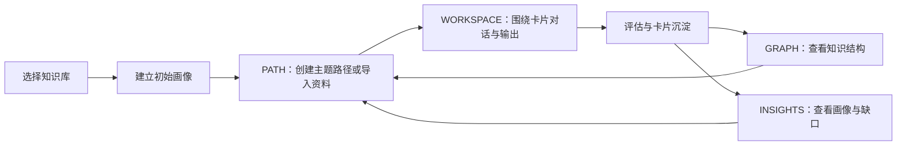

# AXIOM Space 用户使用说明书

> 文档编号：06  
> 文档性质：用户操作与评委体验指南  
> 适用对象：参赛评委、大学生学习者、演示人员  
> 对应系统：AXIOM Space  
> 文档口径：以当前产品界面和已实现交互为准

## 产品定位与标准体验路径

AXIOM Space 是面向高校学生的 AI 学习软件。它不以生成更多内容为终点，而是让学生围绕一个真实知识点完成“进入知识库—建立可修正画像—导入或创建学习任务—接受追问—亲自输出—保存卡片—接受掌握审核—查看知识结构与下一步”的完整闭环。

本说明书以完整学习闭环为标准体验主线，按下列顺序操作：

| 顺序 | 操作 | 应当看到的价值证据 |
|---|---|---|
| 1 | 登录并进入一个知识库 | 资料、画像、卡片、路径和会话被限定在同一学习空间内 |
| 2 | 完成初始画像对话 | 系统一次只问一个必要问题，初始画像是一组可继续修正的教学假设 |
| 3 | 导入课程资料或创建主题路径 | 文件或主题被转成可以继续提问、关联和推进的知识对象 |
| 4 | 从路径步骤或知识卡进入 AI 工作台 | AI 围绕当前知识对象解释、追问和调用已有上下文 |
| 5 | 用自己的话回答并编辑卡片 | 学习结果不是 AI 的回复，而是学习者可继续打磨的输出 |
| 6 | 完成评估并处理未通过项 | 掌握不是按钮或颜色；系统要求回答中的可追溯证据 |
| 7 | 查看知识图谱和认知洞察 | 同一份学习证据继续改变卡片、画像、知识缺口和下一步 |

> **核心闭环：** AXIOM 让学生输出，用证据确认掌握，再让证据改变下一步。

## 目录

1. [文档目的与使用边界](#1-文档目的与使用边界)
2. [使用前准备](#2-使用前准备)
3. [界面地图](#3-界面地图)
4. [首次进入：登录、选择知识库与建立画像](#4-首次进入登录选择知识库与建立画像)
5. [主线一：从一个主题开始学习](#5-主线一从一个主题开始学习)
6. [主线二：从一份课程资料开始学习](#6-主线二从一份课程资料开始学习)
7. [在 AI 工作台中完成一次真实学习](#7-在-ai-工作台中完成一次真实学习)
8. [理解和管理三类知识卡片](#8-理解和管理三类知识卡片)
9. [完成步骤、接受评估与沉淀永久知识](#9-完成步骤接受评估与沉淀永久知识)
10. [主动请求与确认系统建议的学习资源](#10-主动请求与确认系统建议的学习资源)
11. [使用知识图谱查看结构、关系、路径和证据](#11-使用知识图谱查看结构关系路径和证据)
12. [使用认知洞察检查画像、证据和下一步](#12-使用认知洞察检查画像证据和下一步)
13. [搜索、切换知识库与日常管理](#13-搜索切换知识库与日常管理)
14. [典型完整案例](#14-典型完整案例)
15. [状态、异常与恢复方法](#15-状态异常与恢复方法)
16. [使用边界与真实性提醒](#16-使用边界与真实性提醒)
17. [评审核验表](#17-评审核验表)
18. [术语表](#18-术语表)
19. [资料来源](#19-资料来源)

---

## 1. 文档目的与使用边界

本文档只回答一个问题：**学生或评委怎样正确使用 AXIOM Space，完成一次可观察、可追溯的个性化学习闭环。**

本文档负责：

- 说明登录、知识库选择和首次画像流程；
- 说明仪表板、AI 工作台、知识图谱、认知洞察和路径规划五个主工作区；
- 说明如何从主题或课程资料创建学习任务；
- 说明如何围绕卡片对话、输出、编辑、评估和沉淀；
- 说明主动资源请求、系统资源建议、搜索和故障恢复；
- 给出评委可以逐项核验的操作路径和可见结果。

本文档不负责：

- 不解释系统内部架构、数据库、接口和算法，相关内容见《03-系统设计与开发说明书》；
- 不说明安装、环境变量和服务启动，相关内容见《05-部署说明书》；
- 不把预期行为当作已通过测试的结果，实际测试状态见《04-测试说明书与测试报告》；
- 不用界面颜色代替掌握证据，也不把 AI 生成内容等同于学生已经学会。

## 2. 使用前准备

### 2.1 基本条件

开始使用前，应确认：

1. AXIOM Space 已按照《05-部署说明书》启动；
2. 浏览器能够打开系统地址；
3. 数据库和 AI 模型服务可用；
4. 如需导入、检索和多类型资源能力，对应的对象存储、向量检索、嵌入和后台任务服务应处于可用状态；
5. 演示人员准备了可登录账号，或允许评委现场注册；
6. 演示知识库中可以使用真实课程材料，也可以新建独立知识库进行从零体验。

### 2.2 评审体验材料

为了让前后证据保持一致，建议只选择一个具体、可被追问的课程知识点。例如：

- Java Web 中的“并发库存超卖”；
- 软件设计模式中的“Visitor 双重分派”；
- 一个能够给出定义、反例和迁移场景的专业概念。

材料最好包含：

- 一份课程 PDF、DOCX、PPTX、Markdown 或纯文本资料；
- 一个学生尚未完全掌握、但已有少量背景知识的知识点；
- 一个可用于检验迁移的不同情境；
- 一条学生愿意亲自回答而不是让 AI 代答的问题。

### 2.3 数据隔离提醒

知识库（Vault）是系统中的主要学习空间。卡片、路径、步骤、会话、图谱和画像均应限定在当前知识库内。切换知识库后，当前聚焦卡片、活动会话和路径选择会被重置，以避免把一个课程空间的上下文误带到另一个空间。

## 3. 界面地图

进入系统后，顶部主导航包含五个工作区：

| 界面显示 | 英文标识 | 主要职责 | 典型进入时机 |
|---|---|---|---|
| 仪表板 | DASHBOARD | 查看知识统计、最近活动和系统状态 | 刚进入知识库，或完成一轮学习后看总览 |
| AI 工作台 | WORKSPACE | 继续任务、普通对话、卡片加工和资源预览 | 围绕某张卡片学习、向 AI 提问、编辑输出 |
| 知识图谱 | GRAPH | 可视化浏览和整理知识网络 | 查结构、关联、来源、掌握和路径 |
| 认知洞察 | INSIGHTS | 查看学习画像、观察证据、知识缺口和下一步建议 | 检查系统为何这样判断自己 |
| 路径规划 | PATH | 创建、整理和推进学习任务路径 | 从主题或资料启动一轮学习 |

核心操作关系如下：

这五个工作区不是五套互不相关的功能。它们读取的是同一知识库中的学习状态：路径安排当前任务，工作台承载学习过程，卡片保存学习结果，图谱组织长期结构，认知洞察解释学生状态和下一步。

## 4. 首次进入：登录、选择知识库与建立画像

### 4.1 登录或注册

1. 打开 AXIOM Space 首页。
2. 未登录时，按照页面提示注册或登录。
3. 已登录且会话仍有效时，系统会恢复登录状态。
4. 登录完成后，点击“进入知识库”。

若系统提示登录状态已恢复，它仍不会立即载入任意知识库的数据；必须先明确选择一个知识库，系统才会载入图谱、卡片和 AI 工作台上下文。

### 4.2 创建或选择知识库

如果账号尚无知识库：

1. 在“创建你的第一个知识库”区域输入名称；
2. 名称应指向一个稳定学习领域，例如“软件设计模式”或“Java Web 课程”；
3. 创建后进入该知识库。

如果账号已有知识库：

1. 在知识库列表中查看名称和卡片数量；
2. 选择本次学习对应的知识库；
3. 点击进入；
4. 等待工作区加载，知识图谱可以继续在后台同步，不必等所有可视化数据完成才开始操作。

不要把“比赛演示”“随便试试”等临时描述当作课程知识库名称。一个清晰的知识库边界能让画像、资料、卡片和学习路径都具有明确语境。

### 4.3 完成初始画像对话

第一次进入尚未完成画像的知识库时，系统会显示初始画像引导。

1. 选择开始建立初始画像；
2. 系统进入 AI 工作台，并创建“初始画像构建”会话；
3. 按顺序回答系统提出的必要问题，例如想学什么、现在会什么、怎样更容易理解、最常卡在哪里；
4. 不要为了得到“好看”的画像而猜测标准答案，应描述真实情况；
5. 完成后进入认知洞察，查看画像判断、依据和后续变化入口。

初始画像的正确理解是：

- 它不是固定问卷产生的永久标签；
- 它是一组**待验证的初始假设**；
- 后续对话、卡片、评估和学习行为会继续修正它；
- 学习者应当能检查系统为何得出判断，并对不准确判断提供反馈。

### 4.4 暂不建立画像

如果演示时间有限，可以先进入系统，但应知道：缺少画像证据时，系统仍可执行基础学习流程，个性化提问、资源建议和路径调整的依据会相对有限。若要证明赛题要求中的动态画像能力，不应跳过此环节。

## 5. 主线一：从一个主题开始学习

当学习者知道想学什么，但不知道应按什么顺序学习时，使用“路径规划”。

### 5.1 创建主题路径

1. 点击顶部“路径规划 / PATH”；
2. 在创建区域输入一个明确主题，例如“Visitor 模式的双重分派”；
3. 提交生成请求；
4. 等待系统生成学习路径；
5. 检查路径名称、步骤顺序、当前可学习步骤和进度；
6. 选择第一个可学习步骤。

系统应根据主题、已有卡片和用户能力生成学习路径。路径中的步骤应比主题更具体，例如：

- Visitor 解决了什么变化问题；
- `accept` 与 `visit` 分别承担什么职责；
- 静态重载和动态覆写如何共同形成双重分派；
- Visitor 在元素类型频繁变化时为什么不合适。

### 5.2 检查路径状态

路径可能处于以下状态：

| 状态 | 含义 | 用户动作 |
|---|---|---|
| 空状态 | 当前知识库还没有学习路径 | 创建主题路径或导入资料 |
| 生成中 | AI 正在规划步骤 | 等待，不要重复提交同一请求 |
| 可学习 | 存在 available 或 learning 步骤 | 进入当前步骤 |
| 已完成 | 路径进度达到 100% | 查看图谱与认知洞察，或创建下一路径 |
| 已归档 | 路径不再作为当前任务 | 需要时查看历史，不再继续推进 |
| 错误 | 生成、执行或评估失败 | 保留当前内容，按错误提示重试 |

### 5.3 进入步骤

点击可学习步骤后，系统应：

1. 为步骤打开或创建对应知识卡片；
2. 建立与该卡片绑定的学习会话；
3. 切换到 AI 工作台；
4. 保留当前路径和步骤上下文；
5. 允许学习者围绕同一知识对象持续讨论。

用户得到的不是一段回答，而是一张可以继续生长的知识卡片。

## 6. 主线二：从一份课程资料开始学习

当学习者已有文章、课程讲义、PDF 或课堂笔记，但不知道如何把它变成可执行学习任务时，使用资料导入。

### 6.1 导入资料

1. 进入“路径规划 / PATH”；
2. 选择导入资料入口；
3. 上传系统支持的文件，或粘贴资料文本；
4. 填写能够代表资料主题的名称；
5. 提交导入；
6. 查看解析或导入进度；
7. 导入完成后查看生成的路径、卡片和关系。

资料进入系统后的目标不是“收藏成功”，而是：

> 系统保留来源，把文件拆成可以提问、关联和审核的知识点。文件不再只是收藏，而是进入学习环境。

### 6.2 导入后的检查

导入完成后，应分别检查：

- **路径规划：** 是否出现可执行步骤；
- **仪表板：** 卡片数量、最近活动或知识统计是否变化；
- **知识图谱：** 是否出现新增节点和关系；
- **AI 工作台：** 进入步骤后能否围绕资料内容提问；
- **来源信息：** 文献卡或引用中能否辨认资料来源；
- **索引状态：** RAG 尚在处理或处理失败时，卡片保存不应被阻断，但状态应可识别。

### 6.3 不要混淆“解析完成”和“已经掌握”

资料被解析为节点，只能证明系统已把外部内容变成学习对象。它不能证明学习者已经理解。正确顺序仍然是：进入知识点、接受追问、亲自解释、保存输出、通过与该知识点匹配的评估。

## 7. 在 AI 工作台中完成一次真实学习

AI 工作台是围绕卡片开展学习、对话和编辑的主要场所。

### 7.1 打开工作台

可以通过三种主要方式进入：

1. 从路径规划点击一个学习步骤；
2. 从知识图谱点击某张卡片并打开；
3. 直接点击顶部“AI 工作台 / WORKSPACE”，继续已有会话或创建普通对话。

核心学习场景应尽量绑定卡片。普通对话适合临时交流，但只有围绕明确知识对象的输出，才更容易进入后续编辑、评估和长期沉淀。

### 7.2 认识工作台区域

工作台可以包含：

- 当前卡片及其标题、类型和内容；
- 与卡片绑定的 AI 会话；
- 历史对话或任务上下文；
- 卡片列表与筛选；
- 编辑器；
- RAG 引用和相关卡片；
- 后台资源生成进度；
- 资源预览与质量提示。

界面面板可按任务需要打开或关闭。关闭面板不会删除其中的数据。

### 7.3 正确完成一轮对话

1. 先阅读当前步骤和卡片内容；
2. 让 AI 解释概念，或要求它用问题检验你的理解；
3. 面对追问时，用自己的话作答；
4. 至少给出一个具体例子、反例或适用边界；
5. 如果系统引用资料，展开引用并检查它是否真正支持当前回答；
6. 把形成的理解写回卡片，而不是只留在聊天记录中；
7. 保存卡片；
8. 在理解尚不稳定时继续保留为灵感卡，不要急于晋升。

### 7.4 双 Agent 在用户侧的可见含义

学习者始终面对一个连续的学习工作台：

- Agent A 在前台解释、追问、要求举例或迁移；
- Agent B 在后台保留证据、更新画像和写回学习观察；
- Agent B 不替学生回答；
- 后台更新可通过活动记录、画像证据、卡片变化等结果核查。

从用户角度看，重点不是记住 Agent 的名称，而是确认：**学生原话被保留，系统判断有来源，学习状态确实因本轮表现而变化。**

### 7.5 旧知迁移

当系统找回过去的相关卡片时，应把它作为类比、提醒或连接使用。相似旧知只负责搭桥，不能替当前知识点的回答通过审核。即使学习者以前掌握过相似概念，也必须解释它和当前问题的共同机制及差异边界。

## 8. 理解和管理三类知识卡片

AXIOM Space 借鉴卢曼卡片盒的长期连接思想，但三类卡片在本系统中承担明确学习语义：

| 卡片类型 | 界面常用名称 | 含义 | 用户应做什么 |
|---|---|---|---|
| `literature` | 文献资料 / 文献卡 | 保存外部资料、引用和来源 | 检查来源，提取待学习知识点，不把资料原文当成自己的掌握 |
| `fleeting` | 灵感草稿 / 灵感卡 | 保存尚未稳定、仍需追问和打磨的理解 | 继续举例、找反例、补边界、与旧知建立关系 |
| `permanent` | 永久知识 / 永久卡 | 保存经过当前知识点审核、可以长期复用的个人理解 | 在新问题中继续调用，并允许未来证据修正 |

### 8.1 新建卡片

新建卡片时：

1. 输入能够准确标识知识对象的标题；
2. 选择与内容来源和学习状态相符的类型；
3. 写入定义、自己的解释、例子、边界和关联；
4. 保存后检查它是否出现在当前知识库的卡片列表和知识图谱中。

### 8.2 编辑卡片

1. 在工作台或图谱中打开卡片；
2. 打开编辑器；
3. 修改标题或内容；
4. 保存；
5. 等待图谱、画像和路径等相关视图刷新。

如保存失败，系统应尽可能保留编辑内容并提示。不要在确认保存成功前关闭页面或删除本地草稿。

### 8.3 永久卡的严格口径

永久卡只代表：**该卡片对应的具体知识点，在当前证据和标准下完成了沉淀。**

它不代表：

- 学习者掌握了整个课程；
- 所有相关概念都会自动掌握；
- 未来不需要复习或修正；
- 卡片颜色本身就是掌握证据；
- AI 生成过一段正确答案就等于学生会了。

永久卡绑定的旧活动线程会被归档或只读。如果要继续讨论，应创建新的灵感草稿或新的学习上下文，避免修改历史证据的含义。

### 8.4 删除卡片

删除前应确认：

- 当前卡片是否被路径步骤引用；
- 是否包含唯一的学生原话或来源；
- 是否与其他卡片存在关系；
- 是否确实需要删除，而不是归档或继续修改。

删除后，前端不应继续选中已删除卡片；相关会话、图谱和查询状态会刷新。删除属于不可轻率执行的操作，演示时不建议对关键证据卡操作。

## 9. 完成步骤、接受评估与沉淀永久知识

### 9.1 发起步骤完成或评估

当你认为已经理解当前步骤时：

1. 确认卡片已经保存；
2. 确认回答中包含自己的解释，而非只复制 AI 文本；
3. 回到当前学习步骤或评估区域；
4. 发起完成或掌握评估；
5. 阅读评估反馈和依据；
6. 根据结果决定继续打磨还是完成沉淀。

### 9.2 第一次未通过时

未通过不是系统故障，也不是为了给学生打一个抽象分数。它用于指出当前证据还不能支持“已经掌握”。

推荐处理顺序：

1. 找到反馈指出的唯一关键缺口；
2. 回到 AI 工作台；
3. 让 AI 只追问该缺口；
4. 补充成立前提、失效边界或反例；
5. 把同一机制应用到一个新情境；
6. 将新回答写回卡片；
7. 再次发起评估。

例如，学习者解释了“并发库存超卖”的机制，却没有说明判断成立的前提，卡片应继续保持灵感状态。补充反例并把机制迁移到优惠券场景后，评估才有新的证据可检查。

### 9.3 通过后应检查什么

通过当前知识点评估后，检查：

- 卡片是否从灵感状态沉淀为永久知识；
- 评估记录能否回到学生原话、标准和新作答；
- 当前路径进度是否更新；
- 已掌握节点是否不再占据当前任务；
- 新缺口是否成为下一步；
- 认知洞察是否出现与本轮证据相符的变化；
- 知识图谱中的类型、掌握或路径视图是否同步变化。

若评估服务暂时不可用，系统可以保留基础进度，但不应把“评估不可用”伪装成“已经通过”。

## 10. 主动请求与确认系统建议的学习资源

### 10.1 学生主动请求资源

当你知道自己需要什么时，可以在 AI 工作台直接说明学习目标和资源形式，例如：

- “给我一份 Visitor 双重分派的分步讲解材料”；
- “生成一张静态重载与动态覆写的知识导图”；
- “出 5 道只检查适用边界的练习题”；
- “给我一个可运行的 TypeScript 代码实操”；
- “画一张两次分派的关系图示”；
- “生成一个展示调用顺序的教学视频或动画”。

系统支持的六类学习资源语义为：

| 学习资源 | 主要学习动作 | 可能的呈现格式 |
|---|---|---|
| 讲解材料 | 建立概念、形成分步解释 | Markdown、DOCX、PDF、PPTX |
| 知识导图 | 压缩层级、建立整体结构 | Mermaid |
| 练习题 | 回忆、辨析、检查掌握 | JSON 结构化题目与界面预览 |
| 代码实操 | 在可执行情境中应用概念 | Markdown 代码任务与示例 |
| 关系图示 | 看清对象、步骤和因果关系 | Mermaid、SVG |
| 教学视频 | 通过时间序列演示过程 | HTML 动画、MP4 |

六类资源不是六个文件后缀，而是六种学习动作。同一种讲解材料可以导出为不同文件格式，格式变化不等于新增一种教学用途。

### 10.2 系统主动建议资源

有时学习者并不知道该补什么。系统可以结合知识缺口、学习画像和当前卡点提出建议。

面对建议时，应检查：

1. 建议针对哪个当前缺口；
2. 它引用了哪些画像偏好或本轮表现；
3. 为什么选择这种资源，而不是泛化推荐；
4. 证据强度是否足够；
5. 预期改善什么学习结果；
6. 是否同时提供接受和忽略入口。

**系统建议必须由学习者确认后才生成。** 如果理由不充分，可以忽略；忽略不应被解释为学习失败。

### 10.3 查看生成进度与结果

资源生成时：

- 查看各资源项的等待、生成、完成或失败状态；
- 已完成项可以先预览，不必等待全部资源完成；
- 视频的 HTML 预览可能先完成，MP4 可以在后台继续渲染；
- 单项失败不应抹去已经成功生成的其他资源；
- 对 AI 生成的事实、代码和引用仍需人工检查。

## 11. 使用知识图谱查看结构、关系、路径和证据

### 11.1 进入知识图谱

点击顶部“知识图谱 / GRAPH”。图谱只展示当前知识库的数据。节点通常代表卡片或知识对象，连线代表其关系，星团用于聚合领域或主题。

基本操作包括：

- 浏览节点和关系；
- 聚焦某个节点；
- 查看标题、类型、标签和星团信息；
- 打开卡片并继续学习；
- 创建、编辑或删除知识簇；
- 把卡片分配到知识簇或移出；
- 切换布局，回答不同问题。

### 11.2 十种布局及其问题

当前界面提供以下布局：

| 布局 | 界面标签 | 它主要回答的问题 |
|---|---|---|
| `galaxy` | 星系 | 整个知识域由哪些主题和星团构成？ |
| `flat` | 平面 | 按真实关系展开后，节点之间怎样直接连接？ |
| `radial` | 环形 | 当前知识网络有哪些跨主题连接？ |
| `concentric` | 邻域 | 围绕当前节点，最近的相关知识是什么？ |
| `layered` | 分层 | 知识从来源、草稿到沉淀呈现怎样的层级？ |
| `matrix` | 矩阵 | 不同类型和连接度的卡片怎样比较？ |
| `task-flow` | 任务 | 当前学习路径的任务队列和顺序是什么？ |
| `timeline` | 时间 | 知识卡片如何随时间演化？ |
| `mastery` | 地形 | 当前哪些知识已经掌握，哪些仍有缺口？ |
| `evidence` | 证据 | 卡片和判断由哪些资料或学习证据支撑？ |

布局只改变同一批节点和证据的读法，不应生成互相矛盾的学习事实。

### 11.3 图谱状态处理

- **没有卡片：** 先创建主题路径、导入资料或新建卡片；
- **有卡片但没有关系：** 打开卡片建立链接，或等待导入和索引流程完成；
- **加载中：** 可以先进入其他工作区，图谱继续后台同步；
- **加载失败：** 按提示重试；图谱失败不应阻断 AI 工作台和路径规划的基础使用；
- **布局切换失败：** 等待画布就绪后重新选择布局。

## 12. 使用认知洞察检查画像、证据和下一步

点击顶部“认知洞察 / INSIGHTS”。该界面用于查看学习者画像、观察、知识缺口、能力变化和下一步建议。

### 12.1 应当查看的内容

- 学习者基本画像；
- 永久卡、待处理卡、聊天轮次等统计；
- 深度、广度、连接、表达、应用、反思等能力维度；
- 学习偏好与教学策略；
- 优势和成长边缘；
- 每个判断所对应的证据；
- 画像假设的历史变化；
- 知识缺口和下一步建议；
- 评估时间线和本轮学习变化。

### 12.2 检查一条画像判断

面对任何画像结论，至少问四个问题：

1. **判断是什么？** 例如“更适合分步可视化解释”。
2. **来自哪里？** 能否回到某次学生原话、行为或评估结果。
3. **证据有多强？** 一次表达只能形成较弱假设，多次一致表现才可增强置信。
4. **能否纠正？** 学习者是否可以提供反馈或相反证据。

画像不是后台标签，而是一份双方都能检查和修正的教学假设。

### 12.3 数据不足时

如果系统显示没有足够数据：

- 完成初始画像对话；
- 围绕至少一张卡片进行多轮交流；
- 亲自编辑并保存卡片；
- 完成一次评估；
- 再回到认知洞察刷新查看。

不要为了填满画像面板而制造虚假交互。缺少证据时保持“不确定”，比生成无依据的精确判断更可信。

## 13. 搜索、切换知识库与日常管理

### 13.1 搜索节点

1. 点击顶部“搜索节点”入口；
2. 输入标题或内容关键词；
3. 系统优先搜索标题，并在需要时继续搜索正文；
4. 选择结果，打开对应知识节点；
5. 若当前知识库无结果，检查是否进入了正确知识库。

### 13.2 切换知识库

1. 点击顶部当前知识库名称；
2. 在列表中选择另一个知识库；
3. 等待界面提示切换成功；
4. 检查当前卡片、会话和路径焦点已经清空；
5. 在新知识库中重新选择要继续的任务。

切换后重置焦点是数据隔离措施，不是数据丢失。原知识库中的卡片和会话仍保存在原边界内。

### 13.3 查看活动记录

顶部活动入口用于查看近期卡片、画像、质量审核、推送和图谱更新。展开记录后，可以检查后台发生了什么、发生时间及目标对象。活动记录是核验学习状态变化的辅助证据，不代替卡片内容、画像来源或评估结果本身。

### 13.4 导出知识库

如界面提供导出入口，可导出当前知识库中的卡片内容。导出前确认：

- 当前选择的是正确知识库；
- 卡片内容已经保存；
- 重要来源和链接仍可辨认；
- 导出结果不包含其他知识库数据。

## 14. 典型完整案例

以下案例用于在一条连续路径中体验系统，而不是规定所有学生必须按同一答案学习。

### 14.1 案例目标

学习者“小林”要理解 Java Web 项目中的“并发库存超卖”，并能够说明成立前提、失效边界和迁移场景。

### 14.2 连续操作

1. 小林进入“Java Web”知识库。
2. 第一次进入时完成画像对话，说明自己想完成课程项目、已有基础和偏好的讲解方式。
3. 在认知洞察中查看一条画像判断是否能回到自己的原话。
4. 在路径规划中导入讲解库存并发的课程资料。
5. 回到仪表板或知识图谱，确认新增卡片和关系已经出现。
6. 从路径步骤或青色灵感卡打开“并发库存超卖”。
7. Agent A 让小林预测两个请求会怎样读写库存，并追问为什么、何时会失效。
8. 小林用自己的话解释，并在一个新场景中举例。
9. Agent B 保留原话、更新画像或学习观察，但不替他回答。
10. 小林把理解写回灵感卡并发起评估。
11. 第一次审核发现他讲了超卖机制，却没有说明成立前提，因此不通过。
12. Agent A 只追问这个缺口；小林补充反例，并把机制应用到优惠券场景。
13. 小林再次保存并评估。
14. 第二次评估能够回到他的原话、标准和新作答，因此当前知识点通过，卡片沉淀为永久知识。
15. 路径跳过当前节点，将“锁方案选择与失效边界”作为新的下一步。
16. 小林主动请求一种资源，或检查系统根据当前缺口和偏好给出的建议。
17. 他确认建议后查看资源预览。
18. 最后回到知识图谱和认知洞察，检查同一学习证据是否改变了卡片、路径、知识缺口和画像。

### 14.3 案例的判断标准

案例成功不是“AI 回答得很长”，而是同时具备：

- 学生原话；
- 与当前知识点匹配的审核标准；
- 一次真实的缺口暴露；
- 针对缺口的新作答；
- 可追溯的卡片状态变化；
- 由该证据引起的下一步变化。

## 15. 状态、异常与恢复方法

| 现象 | 可能原因 | 用户侧处理 |
|---|---|---|
| 无法进入工作区 | 未登录、未选择知识库或知识库加载失败 | 重新登录，明确选择知识库，再点击进入 |
| 初始画像没有出现 | 当前知识库已完成或已跳过引导 | 在会话或认知洞察中检查画像状态；需要时创建新的画像对话 |
| 路径一直生成中 | AI 服务、后台任务或数据库不可用 | 不重复提交；查看提示，联系部署人员检查服务 |
| 资料解析失败 | 文件为空、不支持、内容解析或后台服务失败 | 保留原文件，改用可解析格式或粘贴文本后重试 |
| 卡片保存失败 | 网络、权限、数据库或卡片状态异常 | 保留编辑内容，确认当前知识库，按提示重试 |
| AI 无回复或中断 | 模型服务不可用、网络中断或流式请求被取消 | 保留问题，重新发送；持续失败时检查部署状态 |
| 看不到 RAG 引用 | 索引仍在进行、索引失败或无相关资料 | 查看索引状态；卡片仍可保存，稍后重试同步 |
| 图谱无节点 | 当前知识库没有卡片或数据仍在加载 | 新建/导入卡片，等待后台同步并刷新 |
| 布局切换失败 | 画布尚未就绪 | 等待片刻后再次选择布局 |
| 资源部分失败 | 某种格式渲染器或后台服务不可用 | 先使用已完成资源，查看失败项后单独重试 |
| 视频只有 HTML 预览 | MP4 正在后台渲染或浏览器渲染依赖不可用 | 先查看 HTML 预览；由部署人员检查渲染环境 |
| 永久卡无法继续原线程 | 旧线程已按沉淀规则归档 | 新建灵感草稿或新会话继续讨论 |
| 切换知识库后焦点消失 | 系统主动清理跨知识库状态 | 在新知识库重新选择卡片或路径，这是正常隔离行为 |

若错误涉及服务启动、端口、数据库、模型密钥、容器或浏览器渲染器，应转到《05-部署说明书》，不要在用户界面反复操作掩盖环境问题。

## 16. 使用边界与真实性提醒

1. **AI 输出需要核验。** 生成的解释、代码、题目、引用和资源可能出错，应回到课程资料、代码执行或教师标准检查。
2. **画像是可修正假设。** 不把单次回答固化为人格或能力标签。
3. **相似不是掌握。** 旧知识只能帮助迁移，不能替当前回答通过。
4. **永久卡不是全科证书。** 它只对应一个具体知识点在当前标准下的沉淀。
5. **评估失败不是系统失败。** 真实暴露缺口是学习闭环的一部分。
6. **资源建议需确认。** 系统应说明建议依据，用户接受后才生成。
7. **知识库必须隔离。** 不在不同课程空间之间混用卡片、会话、画像或路径。
8. **数据不足时允许不确定。** 不用伪精确画像或虚构引用填补空白。
9. **演示必须连续。** 同一个案例的资料、卡片、评估、路径和图谱应来自同一知识库与同一学习状态。
10. **界面预期不等于测试结论。** 若需确认当前构建是否全部通过，查看《04-测试说明书与测试报告》。

## 17. 评审核验表

| 核验点 | 核验操作 | 通过时应看到 |
|---|---|---|
| 知识库隔离 | 切换两个知识库 | 当前卡片、会话和路径焦点重置，数据不串库 |
| 对话式画像 | 新知识库启动初始画像 | 上一回答参与下一问，最终形成可修正初始假设 |
| 画像可解释 | 打开一条画像判断 | 原话或行为证据、置信或变化信息、纠正入口 |
| 资料学习化 | 导入一份课程资料 | 路径、卡片或关系出现，而不只是文件收藏成功 |
| 卡片语义 | 查看三类卡片 | 来源、尚未掌握、已沉淀三种状态边界清楚 |
| 卡片线程学习 | 从路径或图谱打开卡片 | 同一知识对象、绑定会话、编辑器和相关上下文 |
| 学生真实输出 | 回答追问并保存 | 卡片内容包含学生自己的解释、例子或边界 |
| 审核闭环 | 发起评估并故意留一个缺口 | 未通过理由返回学习过程，允许针对缺口重答 |
| 掌握沉淀 | 补充证据后再次评估 | 当前知识点通过、卡片状态和路径同步改变 |
| 主动资源 | 明确请求一种资源 | 只生成用户选择的资源并可查看进度或预览 |
| 系统建议 | 查看缺口后的推送建议 | 显示缺口、画像或行为依据，确认后才执行 |
| 六类资源 | 打开资源包 | 讲解、导图、练习、代码、图示、视频各有学习用途 |
| 图谱多视角 | 依次切换布局 | 同一数据可从结构、关系、任务、时间、掌握、证据等角度读取 |
| 认知反馈 | 完成一轮后打开认知洞察 | 统计、画像、证据、缺口、历史或下一步发生合理变化 |

## 18. 术语表

| 术语 | 含义 |
|---|---|
| AXIOM Space | 面向高校学生的 AI 学习与知识沉淀系统 |
| Vault / 知识库 | 隔离某个学习领域的资料、卡片、路径、会话、图谱和画像空间 |
| Dashboard / 仪表板 | 当前知识库的统计、最近活动与快捷入口 |
| Path / 路径规划 | 把主题或资料组织为可执行学习步骤的工作区 |
| Workspace / AI 工作台 | 围绕卡片进行对话、编辑、评估和资源使用的工作区 |
| Graph / 知识图谱 | 展示卡片、关系、星团、路径、掌握与证据的可视化工作区 |
| Insights / 认知洞察 | 展示画像、观察、知识缺口、历史和下一步建议的工作区 |
| 文献卡 | 保存外部资料和来源的卡片 |
| 灵感卡 | 保存尚未稳定、仍需学习和审核的个人理解 |
| 永久卡 | 当前具体知识点经过证据审核后形成的长期知识卡片 |
| RAG | 从当前知识库检索相关资料，为回答提供可追溯上下文 |
| 学习画像 | 由对话和行为证据逐步更新、可解释且可纠正的教学假设 |
| 掌握评估 | 用学生输出、任务标准和迁移表现判断当前知识点是否达到沉淀条件 |
| 资源建议 | 系统基于当前缺口和画像提出、必须由用户确认后执行的学习资源计划 |

## 19. 资料来源

本文档以项目当前实现为操作事实基础，并优先吸收 00～02 号目录中的既有定义和完整表述：

- `docs/00-灵感文档/0-A3赛题.md`：赛题目标、核心能力和交付约束；
- `docs/00-灵感文档/1-基本灵感构建.md`：产品原始构想与学习闭环；
- `docs/00-灵感文档/2-感觉文档.md`：产品体验和交互感受要求；
- `docs/00-灵感文档/3-学习方法文档.md`：学习方法、输出和知识沉淀思想；
- `docs/01-SDD-文档驱动开发流程/04-MVP定义.md`：MVP 范围和核心闭环；
- `docs/01-SDD-文档驱动开发流程/05-PRD.md`：用户场景、页面职责、功能规则和边界条件；
- `docs/02-决策与开发过程记录/07-用户画像与学习闭环设计.md`：画像证据、评估与反馈闭环；
- `docs/02-决策与开发过程记录/08-主动推送与多类型资源设计.md`：资源建议、确认和生成边界；
- `docs/03-宣传资料/AXIOM-Space-A3黄金案例-V18-固定顺序传播终审稿.md`：仅用于统一连续演示顺序、三类卡片与真实性口径；
- 当前 `app/`、`components/`、`hooks/`、`stores/` 与 `server/core/`：用于校正实际界面名称、状态和已实现交互。

如本文档与当前构建界面存在版本差异，以可运行系统和最新测试记录为准，并在再次提交前同步更新本说明书。
