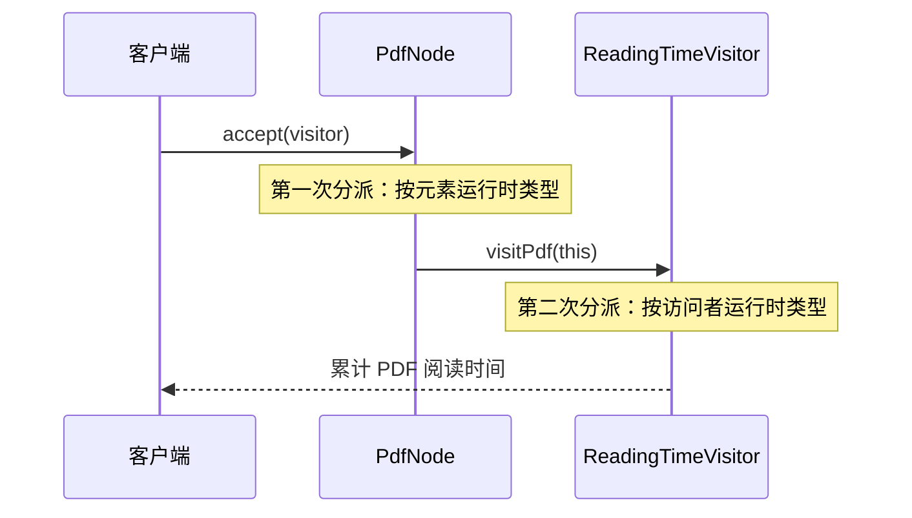
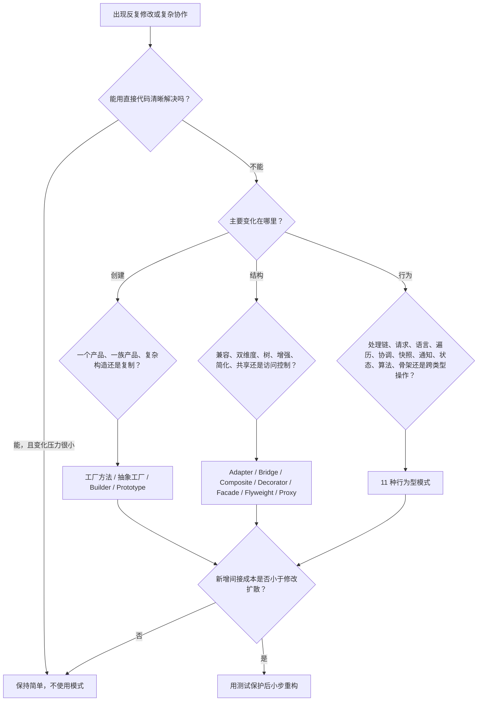

# 《软件设计模式》系统化学习资料

> 文档编号：07  
> 文档性质：可直接学习、授课、导入 AXIOM Space 的完整课程资料  
> 适用对象：具备基础编程经验的大学生、软件工程初学者  
> 示例语言：TypeScript  
> 课程主线：从“什么在变化、什么必须稳定”出发，而不是背诵类图

## 课程目标与学习成果

设计模式不是 23 个需要背下来的标准答案，而是 23 种经过反复验证的**变化隔离方式**。真正的问题永远先于模式名称：变化来自哪里？谁不应该被迫一起修改？为了隔离变化而引入的抽象，是否小于它带来的维护成本？

本课程把全部内容压缩成一张判断地图：

| 变化发生在哪里 | 希望保持什么稳定 | 对应模式族 | 核心提问 |
|---|---|---|---|
| 对象如何产生 | 对象的使用流程 | 创建型 | 谁应该知道具体类和构造过程？ |
| 对象如何组合 | 客户端调用方式 | 结构型 | 如何连接、包裹或简化已有对象？ |
| 对象如何协作 | 核心业务流程与数据结构 | 行为型 | 谁决定算法、状态、通知和职责传递？ |

学完后，学习者应能做到五件事：

1. 看到一段难以修改的代码，先定位变化轴，而不是先报模式名称；
2. 解释 23 个 GoF 模式各自保护什么、牺牲什么；
3. 比较结构相似但意图不同的模式，例如代理与装饰器、状态与策略；
4. 在真实需求变化中完成“坏代码—识别修改压力—小步重构—测试验证”；
5. 明确什么时候**不使用模式**，避免为了显得高级而制造间接层。

> **课程验收句：** 能从具体修改压力推出模式，也能从模式反推出它隔离的变化，才算真正掌握。

## 目录

### 第一篇　从第一性原理理解设计模式

1. [设计模式到底解决什么问题](#1-设计模式到底解决什么问题)
2. [模式成立所需的面向对象基础](#2-模式成立所需的面向对象基础)
3. [设计原则：模式背后的约束](#3-设计原则模式背后的约束)
4. [本课程的学习与掌握方法](#4-本课程的学习与掌握方法)
5. [读懂任何模式的统一协议](#5-读懂任何模式的统一协议)

### 第二篇　创建型模式：把对象如何产生隔离出去

6. [创建型模式总览](#6-创建型模式总览)
7. [工厂方法](#7-工厂方法-factory-method)
8. [抽象工厂](#8-抽象工厂-abstract-factory)
9. [建造者](#9-建造者-builder)
10. [原型](#10-原型-prototype)
11. [单例](#11-单例-singleton)

### 第三篇　结构型模式：让对象以可控方式组合

12. [结构型模式总览](#12-结构型模式总览)
13. [适配器](#13-适配器-adapter)
14. [桥接](#14-桥接-bridge)
15. [组合](#15-组合-composite)
16. [装饰器](#16-装饰器-decorator)
17. [外观](#17-外观-facade)
18. [享元](#18-享元-flyweight)
19. [代理](#19-代理-proxy)

### 第四篇　行为型模式：重新分配协作责任

20. [行为型模式总览](#20-行为型模式总览)
21. [责任链](#21-责任链-chain-of-responsibility)
22. [命令](#22-命令-command)
23. [解释器](#23-解释器-interpreter)
24. [迭代器](#24-迭代器-iterator)
25. [中介者](#25-中介者-mediator)
26. [备忘录](#26-备忘录-memento)
27. [观察者](#27-观察者-observer)
28. [状态](#28-状态-state)
29. [策略](#29-策略-strategy)
30. [模板方法](#30-模板方法-template-method)
31. [访问者](#31-访问者-visitor)

### 第五篇　从会背到会选

32. [高频模式对比](#32-高频模式对比)
33. [选择矩阵与决策流程](#33-选择矩阵与决策流程)
34. [模式组合：没有真实系统只用一个模式](#34-模式组合没有真实系统只用一个模式)
35. [从坏代码到模式的安全重构](#35-从坏代码到模式的安全重构)

### 第六篇　实践与考核

36. [综合项目：可扩展学习资源引擎](#36-综合项目可扩展学习资源引擎)
37. [练习题与实践任务](#37-练习题与实践任务)
38. [参考答案与评分量规](#38-参考答案与评分量规)
39. [课程检查清单与进一步学习](#39-课程检查清单与进一步学习)
40. [资料来源与内容口径](#40-资料来源与内容口径)

---

## 第一篇　从第一性原理理解设计模式

### 1. 设计模式到底解决什么问题

#### 1.1 不是“代码复用”，而是“修改成本控制”

软件之所以难，不是因为第一版写不出来，而是因为第二个、第三个需求到来时，原本无关的代码被迫一起修改。设计模式处理的基本矛盾是：

```text
业务必须变化
    ×
已有正确行为不能被随意破坏
    ↓
把变化限制在一个可理解、可替换、可测试的边界内
```

一个模式成立，至少需要三个条件：

1. **存在反复出现的修改压力。** 只有一次的简单需求，不足以证明需要模式。
2. **存在希望保持稳定的部分。** 如果所有部分都同时变化，抽象也没有稳定支点。
3. **间接层的成本小于修改扩散的成本。** 模式引入接口、对象和协作关系，也会增加理解成本。

所以，选择模式之前必须先写出一句话：

> 当 ______ 变化时，我希望 ______ 不需要一起修改。

例如：

- 当通知渠道从邮件扩展到短信、站内信时，我希望订单流程不需要修改；
- 当资源渲染为 PDF、PPTX、视频时，我希望资源生成的业务流程不需要修改；
- 当卡片状态从草稿变为审核中、已沉淀时，我希望客户端不再维护不断增长的条件分支。

#### 1.2 模式不是成品代码

设计模式描述的是一组角色、关系和取舍。它不规定：

- 类必须叫什么名字；
- 一定要有多少个文件；
- 必须使用继承还是语言特定语法；
- 所有相似结构都属于同一个模式。

同一段代码可以在结构上像代理和装饰器，但它的**意图**决定它是哪一种模式：访问控制是代理，职责增强是装饰器。模式名称是对设计意图的压缩，不是对代码形状的贴标签。

#### 1.3 三个层次的掌握

| 层次 | 能力 | 常见表现 |
|---|---|---|
| 识别 | 看到类图能说出名称 | 容易背定义，遇到新需求不会选 |
| 解释 | 能说明角色、协作和利弊 | 知道怎么实现，但可能过度设计 |
| 生成 | 能从修改压力推出恰当模式 | 能说明为什么用、为什么现在用、为什么不用别的 |

本课程以第三层为目标。

### 2. 模式成立所需的面向对象基础

#### 2.1 封装：隐藏的是变化原因

封装不只是把字段设为 `private`。真正有价值的封装，是把具有同一变化原因的状态与行为放在一起，并只暴露稳定契约。

```ts
class LearningCard {
  #content: string

  constructor(content: string) {
    this.#content = content
  }

  revise(next: string): void {
    if (!next.trim()) throw new Error('卡片内容不能为空')
    this.#content = next
  }

  snapshot(): string {
    return this.#content
  }
}
```

客户端不应知道内容怎样校验、怎样保存历史；这些规则改变时，应留在 `LearningCard` 边界内。

#### 2.2 抽象：只保留协作所需信息

抽象不是把所有类都加一个接口。它是在协作者之间只保留必要承诺。

```ts
interface ResourceRenderer {
  render(content: string): Promise<Uint8Array>
}
```

调用者只需要知道“能把内容渲染为字节”，不需要知道 Puppeteer、PptxGenJS 或其他实现细节。

#### 2.3 多态：让选择发生在对象边界

多态的价值是把“根据类型选择行为”的职责从不断增长的 `if/switch` 移到各自对象。

```ts
interface AssessmentRule {
  evaluate(answer: string): boolean
}

class DefinitionRule implements AssessmentRule {
  evaluate(answer: string): boolean {
    return answer.includes('定义')
  }
}

class TransferRule implements AssessmentRule {
  evaluate(answer: string): boolean {
    return answer.includes('新场景')
  }
}
```

#### 2.4 组合优于继承，但不是禁止继承

组合适合运行时替换能力、隔离多个变化轴；继承适合稳定的“是一种”关系和模板骨架。判断标准不是口号，而是变化方式：

- 行为需要按实例、按运行时切换：优先组合；
- 子类确实遵守父类契约，且骨架稳定：继承可以清晰；
- 继承只为复用几行代码：通常应改为组合或普通函数。

#### 2.5 静态类型与运行时类型

理解访问者模式前，必须区分：

```ts
const element: DocumentNode = new PdfNode()
```

- 变量 `element` 的静态类型是 `DocumentNode`；
- 它在运行时实际指向 `PdfNode`；
- 覆写方法通常按接收者运行时类型选择；
- 重载方法在许多语言中由编译期可见类型选择。

这一区别将在 Visitor 的双重分派中再次使用。

### 3. 设计原则：模式背后的约束

#### 3.1 单一职责原则（SRP）

一个模块应只有一个主要变化原因。单一职责不等于“一个类只能有一个方法”，而是属于不同变化来源的规则不要被捆在一起。

反例：一个 `CourseService` 同时负责课程规则、SQL、PDF 渲染、邮件发送和界面文案。任何基础设施变化都会触碰核心业务。

#### 3.2 开闭原则（OCP）

对扩展开放，对修改关闭。它不是要求零修改，而是让预期中的同类扩展通过新增实现完成，不反复改稳定流程。

策略、装饰器、工厂方法和访问者都可能服务 OCP，但保护的变化方向不同。

#### 3.3 里氏替换原则（LSP）

子类型必须能够在不破坏客户端正确性的前提下替换父类型。关键不是语法继承，而是行为契约：前置条件不能更苛刻，后置保证不能更弱，不应突然抛出父契约未声明的常规异常。

#### 3.4 接口隔离原则（ISP）

客户端不应依赖它不使用的方法。与其提供一个巨大 `LearningPlatform` 接口，不如根据协作角色拆成 `CardReader`、`CardWriter`、`AssessmentRunner`。

#### 3.5 依赖倒置原则（DIP）

高层策略不依赖低层细节，二者依赖抽象；抽象不依赖细节，细节依赖抽象。

```ts
class GenerateResource {
  constructor(private readonly renderer: ResourceRenderer) {}

  execute(content: string): Promise<Uint8Array> {
    return this.renderer.render(content)
  }
}
```

`GenerateResource` 不知道具体渲染器，使核心流程可以独立测试。

#### 3.6 DRY、KISS、YAGNI 与最少知识原则

| 原则 | 正确含义 | 误用风险 |
|---|---|---|
| DRY | 一条业务知识只有一个权威表达 | 仅因代码长得像就抽象，绑住不同变化原因 |
| KISS | 选择能解释当前问题的最简单设计 | 把“简单”误解为把所有逻辑塞进一个函数 |
| YAGNI | 不为尚不存在的变化提前建通用框架 | 以此拒绝处理已经反复发生的修改压力 |
| 最少知识 | 对象只与必要协作者通信 | 机械禁止任何链式调用，而不分析边界 |

#### 3.7 清晰、准确、必要

一个设计进入代码前，依次检查：

1. **清晰：** 角色名称和职责能否让新成员读懂？
2. **准确：** 抽象是否与真实业务变化一致？
3. **必要：** 删除这层间接后，当前修改压力是否仍可被安全处理？

### 4. 本课程的学习与掌握方法

#### 4.1 不把整本书当作最小学习单位

原始学习方法文档提出：不要把网上找到的文章或书当成基本学习单位，而应建立概念清单。本课程把设计模式拆成：变化轴、稳定面、角色、协作、代价、反例和迁移七类概念节点。

每学完一个模式，都应把它和至少两个相邻模式比较。孤立定义容易遗忘，差异关系才形成可调用的知识结构。

#### 4.2 苏格拉底式提问

学习顺序应是 AI 或教师主动提出一个必要问题，学习者回答，再根据回答决定下一问。推荐问题：

1. 当前代码最可能发生哪种变化？
2. 变化到来时，哪些文件会被迫一起改？
3. 哪一部分其实应该稳定？
4. 若引入接口或中间对象，它隔离了什么？
5. 它带来的新成本是什么？

#### 4.3 费曼输出

每个模式至少完成四种输出：

- 不使用模式名称，用自己的话解释问题；
- 给出一个适用例；
- 给出一个看似相似但不应使用的反例；
- 预测新增需求时哪些类修改、哪些类不动。

#### 4.4 掌握门槛

只有同时满足下列证据，才进入下一阶段：

- 能识别变化与稳定部分；
- 能画出最小角色关系；
- 能阅读并修改一个可运行例子；
- 能和相邻模式比较；
- 能解释代价；
- 能在新情境中迁移。

### 5. 读懂任何模式的统一协议

对每个模式按相同顺序学习：

| 步骤 | 必答问题 |
|---|---|
| 1. 情境 | 哪种代码或业务环境中出现问题？ |
| 2. 修改压力 | 哪种变化反复发生？ |
| 3. 意图 | 模式想保护什么？ |
| 4. 角色 | 哪些对象承担创建、组合或协作职责？ |
| 5. 协作 | 一次请求如何在角色之间流动？ |
| 6. 结果 | 新需求到来时修改范围怎样变化？ |
| 7. 代价 | 增加了哪些类、间接层、顺序或状态风险？ |
| 8. 边界 | 什么情况下直接代码更清晰？ |
| 9. 对比 | 最容易和哪个模式混淆？ |
| 10. 迁移 | 能否换一个领域仍推出同一结构？ |

模式学习卡模板：

```text
模式：
反复变化的是：
必须稳定的是：
新增需求时新增/修改：
不再需要修改：
主要代价：
不适用条件：
相邻模式：
```

---

## 第二篇　创建型模式：把对象如何产生隔离出去

### 6. 创建型模式总览

创建型模式把“对象如何被创建”从使用者手中移开。当构造过程、产品族或实例来源频繁变化时，调用者不应反复修改。

| 模式 | 主要变化 | 稳定部分 | 一句话判断 |
|---|---|---|---|
| 工厂方法 | 单个产品的具体类型 | 产品使用流程 | 让子类或实现决定创建哪一种产品 |
| 抽象工厂 | 一整组兼容产品 | 使用产品族的客户端 | 同一主题下的对象必须成套出现 |
| 建造者 | 复杂对象的构造步骤与表示 | 构造顺序或使用结果 | 同一流程分步构造不同表示 |
| 原型 | 实例的具体类型和初始化成本 | 复制协议 | 通过现有对象复制新对象 |
| 单例 | 唯一实例的创建与访问 | 进程内唯一性 | 系统确实只能有一个实例 |

### 7. 工厂方法（Factory Method）

#### 7.1 问题与意图

工厂方法把具体产品的创建延迟到子类或实现类。调用者依赖产品接口，不直接依赖某个构造函数。它适合产品类型会扩展、但使用流程相对稳定的场景。若产品只有一种且不会变化，工厂方法只会增加间接层。

变化句：

> 当资源的具体渲染器变化时，我希望“准备内容—渲染—保存”流程不需要修改。

#### 7.2 角色

- `Product`：客户端需要的稳定能力；
- `ConcreteProduct`：具体产品；
- `Creator`：声明工厂方法，并包含稳定业务流程；
- `ConcreteCreator`：决定创建哪个具体产品。

#### 7.3 TypeScript 示例

```ts
interface Preview {
  open(): string
}

class PdfPreview implements Preview {
  open(): string { return '打开 PDF 预览' }
}

class VideoPreview implements Preview {
  open(): string { return '打开视频预览' }
}

abstract class ResourceWorkflow {
  protected abstract createPreview(): Preview

  publish(): string {
    const preview = this.createPreview()
    return `校验完成；${preview.open()}`
  }
}

class PdfWorkflow extends ResourceWorkflow {
  protected createPreview(): Preview { return new PdfPreview() }
}

class VideoWorkflow extends ResourceWorkflow {
  protected createPreview(): Preview { return new VideoPreview() }
}
```

#### 7.4 使用、代价与检查

- **使用：** 产品类型会持续增加；稳定流程需要使用产品；创建逻辑不应散落。
- **不使用：** 只有一个简单产品；直接构造清晰且没有扩展压力。
- **代价：** 每种产品常伴随一个创建者，类数量增加。
- **易混：** 简单工厂通常是一个按参数返回对象的函数，并非 GoF 工厂方法。
- **检查题：** 新增 `MindmapPreview` 时，能否只新增产品和创建者，而不修改 `publish()`？

### 8. 抽象工厂（Abstract Factory）

#### 8.1 问题与意图

抽象工厂负责创建一组彼此兼容的产品。例如同一套界面主题需要同时创建按钮、输入框和弹窗。它保护的是“产品族的一致性”；代价是新增一种产品角色时，所有具体工厂都要修改。

变化句：

> 当整套 UI 主题变化时，我希望页面组装代码不需要逐个判断每个组件的主题。

#### 8.2 角色与示例

```ts
interface Button { paint(): string }
interface Dialog { paint(): string }

interface UiFactory {
  createButton(): Button
  createDialog(): Dialog
}

class DarkButton implements Button {
  paint(): string { return 'dark-button' }
}
class DarkDialog implements Dialog {
  paint(): string { return 'dark-dialog' }
}
class LightButton implements Button {
  paint(): string { return 'light-button' }
}
class LightDialog implements Dialog {
  paint(): string { return 'light-dialog' }
}

class DarkUiFactory implements UiFactory {
  createButton(): Button { return new DarkButton() }
  createDialog(): Dialog { return new DarkDialog() }
}

class LightUiFactory implements UiFactory {
  createButton(): Button { return new LightButton() }
  createDialog(): Dialog { return new LightDialog() }
}

function renderPage(factory: UiFactory): string[] {
  return [factory.createButton().paint(), factory.createDialog().paint()]
}
```

#### 8.3 使用、代价与检查

- **使用：** 多种产品必须保持同一主题、平台、数据库方言或协议版本。
- **不使用：** 产品之间没有兼容约束；只创建一个产品。
- **优势：** 切换产品族容易；阻止混用不兼容产品。
- **代价：** 新增 `Tooltip` 这种产品角色时，每个工厂都要增加方法。
- **易混：** 工厂方法关注一个产品的创建扩展；抽象工厂关注一族产品的一致性。
- **检查题：** 新增“高对比度主题”和新增“日期选择器”，哪个变化更便宜？为什么？

### 9. 建造者（Builder）

#### 9.1 问题与意图

建造者把复杂对象的分步构造过程与最终表示分离。它适合参数多、构造顺序重要、并且需要产生多种表示的对象。若对象只有少量参数，普通构造函数通常更清晰。

变化句：

> 当学习报告包含许多可选部分、且不同场景需要不同组合时，我希望调用者不直接维护巨大构造函数。

#### 9.2 示例

```ts
type LearningReport = {
  title: string
  summary?: string
  evidence: string[]
  nextActions: string[]
}

class LearningReportBuilder {
  private report: LearningReport = { title: '', evidence: [], nextActions: [] }

  titled(title: string): this {
    this.report.title = title
    return this
  }

  withSummary(summary: string): this {
    this.report.summary = summary
    return this
  }

  addEvidence(item: string): this {
    this.report.evidence.push(item)
    return this
  }

  addNextAction(item: string): this {
    this.report.nextActions.push(item)
    return this
  }

  build(): LearningReport {
    if (!this.report.title) throw new Error('报告必须有标题')
    return structuredClone(this.report)
  }
}

const report = new LearningReportBuilder()
  .titled('Visitor 学习报告')
  .addEvidence('能解释两次分派')
  .addNextAction('比较 Visitor 与 Strategy')
  .build()
```

#### 9.3 使用、代价与检查

- **使用：** 参数很多；构造存在顺序或校验；需要多个表示；希望代码呈现领域语言。
- **不使用：** 两三个独立参数即可表达对象；没有构造变体。
- **代价：** Builder 可能和产品字段同步变化；可变 Builder 还要处理复用和并发问题。
- **易混：** 抽象工厂创建一族对象，Builder 分步构造一个复杂对象。
- **检查题：** `build()` 应在何处保证不变量？为什么不能只依赖调用者正确调用？

### 10. 原型（Prototype）

#### 10.1 问题与意图

原型模式通过复制已有实例产生新对象，适合初始化成本高或运行时才知道具体类型的场景。关键风险是深拷贝、共享引用和对象身份语义。

变化句：

> 当模板类型在运行时才确定、初始化又很昂贵时，我希望客户端只依赖复制协议。

#### 10.2 示例

```ts
interface ResourceTemplate {
  clone(): ResourceTemplate
  rename(title: string): void
}

class QuizTemplate implements ResourceTemplate {
  constructor(
    private title: string,
    private questions: Array<{ prompt: string; tags: string[] }>,
  ) {}

  clone(): QuizTemplate {
    return new QuizTemplate(
      this.title,
      this.questions.map((q) => ({ ...q, tags: [...q.tags] })),
    )
  }

  rename(title: string): void {
    this.title = title
  }
}
```

#### 10.3 使用、代价与检查

- **使用：** 创建成本高；具体类型运行时才知道；以预配置模板快速生成对象。
- **不使用：** 普通构造便宜、清晰；对象含大量不可复制资源。
- **风险：** 浅拷贝导致嵌套数组共享；复制数据库 ID 导致身份冲突；外部句柄无法安全克隆。
- **易混：** Builder 控制构造过程；Prototype 复制已经形成的状态。
- **检查题：** 克隆卡片时，内容、标签、数据库 ID、创建时间分别应复制还是重建？

### 11. 单例（Singleton）

#### 11.1 问题与意图

单例模式保证一个类只有一个可控实例，并提供统一访问点。它适合确实必须唯一的进程级资源，例如配置注册表或硬件连接管理器。它也容易变成隐藏的全局状态，并引入并发初始化与测试隔离问题。

#### 11.2 示例

```ts
class ProcessMetrics {
  private static instance: ProcessMetrics | undefined
  private counters = new Map<string, number>()

  private constructor() {}

  static getInstance(): ProcessMetrics {
    return this.instance ??= new ProcessMetrics()
  }

  increment(name: string): void {
    this.counters.set(name, (this.counters.get(name) ?? 0) + 1)
  }
}
```

#### 11.3 严格使用条件

同时满足以下条件才考虑单例：

1. 业务或进程资源确实要求唯一；
2. 唯一性的作用域明确，是进程、请求、租户还是知识库；
3. 生命周期和初始化顺序可控；
4. 测试能够替换或重置；
5. 并发访问安全。

#### 11.4 使用、代价与检查

- **不使用：** 只是“现在只有一个”；希望方便地从任何地方访问；对象含用户或知识库状态。
- **代价：** 依赖被隐藏；测试互相污染；并发初始化复杂；多进程部署后不再全局唯一。
- **替代：** 在组合根中创建一个实例，再通过构造函数注入，通常比静态全局访问更清晰。
- **检查题：** 数据库客户端只有一个实例，是业务不变量，还是当前部署选择？两者设计含义有何不同？

---

## 第三篇　结构型模式：让对象以可控方式组合

### 12. 结构型模式总览

结构型模式关注类与对象如何组合成更大的结构。它解决接口不兼容、职责叠加、复杂子系统暴露过多等问题。

| 模式 | 主要结构问题 | 意图关键词 | 判断线索 |
|---|---|---|---|
| 适配器 | 接口不兼容 | 转换 | 已有对象能做事，但调用协议不同 |
| 桥接 | 两个维度同时扩展 | 分离 | 继承组合数量呈乘法增长 |
| 组合 | 部分—整体树 | 一致处理 | 叶子和容器需要统一操作 |
| 装饰器 | 运行时叠加职责 | 增强 | 多种可组合能力不适合子类爆炸 |
| 外观 | 子系统入口复杂 | 简化 | 客户端不应理解内部调用顺序 |
| 享元 | 大量细粒度重复对象 | 共享 | 可分离内在状态与外在状态 |
| 代理 | 访问真实对象需控制 | 控制 | 延迟、远程、权限、缓存或审计 |

### 13. 适配器（Adapter）

#### 13.1 问题与意图

适配器把已有接口转换成客户端期望的接口，让原本不兼容的对象能够协作。它不改变被适配对象的核心能力，只转换调用协议。若双方接口本来可以直接统一，就不应额外增加适配层。

变化句：

> 当第三方模型 SDK 的请求和响应格式变化时，我希望核心 AI 用例只依赖统一模型接口。

#### 13.2 示例

```ts
interface LanguageModel {
  complete(prompt: string): Promise<string>
}

class VendorSdk {
  async invoke(input: { messages: Array<{ text: string }> }): Promise<{ output: string }> {
    return { output: input.messages.at(-1)?.text ?? '' }
  }
}

class VendorModelAdapter implements LanguageModel {
  constructor(private readonly sdk: VendorSdk) {}

  async complete(prompt: string): Promise<string> {
    const result = await this.sdk.invoke({ messages: [{ text: prompt }] })
    return result.output
  }
}
```

#### 13.3 使用、代价与检查

- **使用：** 接入遗留代码、第三方 SDK、不同存储或模型供应商；客户端契约不能跟着每个供应商变化。
- **不使用：** 你同时控制两端并能直接统一接口；转换只是一次性数据清洗。
- **代价：** 适配器可能掩盖能力不对等；异常、流式事件和取消语义也必须正确映射。
- **易混：** Adapter 改变接口；Facade 简化接口；Decorator 保持接口并增强职责。
- **检查题：** 如果供应商不支持流式输出，适配器应该伪造流式事件，还是显式暴露能力差异？

### 14. 桥接（Bridge）

#### 14.1 问题与意图

桥接模式把抽象部分与实现部分拆成两个可独立变化的维度，再用组合把它们连接。它适合“功能类型”和“底层实现”都会扩展的场景，避免两个维度相乘产生大量子类。

变化句：

> 当通知种类和发送渠道都要独立扩展时，我希望不出现“紧急邮件通知、紧急短信通知、普通邮件通知……”的子类乘法。

#### 14.2 示例

```ts
interface Channel {
  send(message: string): Promise<void>
}

class EmailChannel implements Channel {
  async send(message: string): Promise<void> { console.log(`email:${message}`) }
}

class InAppChannel implements Channel {
  async send(message: string): Promise<void> { console.log(`in-app:${message}`) }
}

abstract class Notification {
  constructor(protected readonly channel: Channel) {}
  abstract deliver(text: string): Promise<void>
}

class UrgentNotification extends Notification {
  deliver(text: string): Promise<void> {
    return this.channel.send(`[紧急] ${text}`)
  }
}

class DigestNotification extends Notification {
  deliver(text: string): Promise<void> {
    return this.channel.send(`[摘要] ${text}`)
  }
}
```

#### 14.3 使用、代价与检查

- **使用：** 两个或更多正交维度独立增长；继承层级已经出现组合爆炸。
- **不使用：** 只有一个变化轴；两个维度实际上不能独立组合。
- **代价：** 客户端或组合根需要选择并连接两个对象；抽象关系更分散。
- **易混：** Adapter 通常用于事后兼容已有接口；Bridge 通常在设计阶段分离独立维度。
- **检查题：** “资源种类 × 文件格式”是否一定适合桥接？如果某些种类只支持特定格式，应怎样表达约束？

### 15. 组合（Composite）

#### 15.1 问题与意图

组合模式把单个对象和对象容器组织成树形结构，让客户端以一致方式处理叶子与组合对象。它适合文件树、界面组件树等“部分—整体”结构，但过度统一会弱化不同节点的业务约束。

变化句：

> 当学习路径可以包含单步和章节组时，我希望客户端用同一操作计算进度。

#### 15.2 示例

```ts
interface LearningItem {
  progress(): number
}

class LearningStep implements LearningItem {
  constructor(private readonly done: boolean) {}
  progress(): number { return this.done ? 1 : 0 }
}

class LearningChapter implements LearningItem {
  private children: LearningItem[] = []

  add(item: LearningItem): void {
    this.children.push(item)
  }

  progress(): number {
    if (this.children.length === 0) return 0
    return this.children.reduce((sum, item) => sum + item.progress(), 0)
      / this.children.length
  }
}
```

#### 15.3 透明式与安全式接口

- **透明式：** 叶子和组合都暴露 `add/remove`，客户端完全一致，但叶子方法可能无意义；
- **安全式：** 只有组合暴露子节点管理，约束准确，但客户端要知道当前是否为组合。

#### 15.4 使用、代价与检查

- **使用：** 天然树形结构；递归操作；客户端需要一致处理单项和集合。
- **不使用：** 结构不是部分—整体；叶子和容器业务规则差异太大。
- **代价：** 通用接口可能难以表达特定节点限制；循环引用必须防止。
- **易混：** Composite 组织对象树；Decorator 通常形成包裹链。
- **检查题：** 一个章节能否包含另一个章节？如何防止把节点加到自己的后代中？

### 16. 装饰器（Decorator）

#### 16.1 问题与意图

装饰器通过组合，在运行时为对象叠加职责。日志、缓存、权限校验等横切能力可以逐层包裹核心对象。它比继承更灵活，但装饰层过多会让调用链和调试变复杂。

变化句：

> 当检索服务需要按场景组合缓存、审计和权限时，我希望不为每种组合创建子类。

#### 16.2 示例

```ts
interface CardSearch {
  find(query: string): Promise<string[]>
}

class DatabaseCardSearch implements CardSearch {
  async find(query: string): Promise<string[]> { return [`db:${query}`] }
}

abstract class SearchDecorator implements CardSearch {
  constructor(protected readonly inner: CardSearch) {}
  find(query: string): Promise<string[]> { return this.inner.find(query) }
}

class CachedSearch extends SearchDecorator {
  private cache = new Map<string, string[]>()
  async find(query: string): Promise<string[]> {
    const hit = this.cache.get(query)
    if (hit) return hit
    const result = await this.inner.find(query)
    this.cache.set(query, result)
    return result
  }
}

class AuditedSearch extends SearchDecorator {
  async find(query: string): Promise<string[]> {
    console.log(`search:${query}`)
    return this.inner.find(query)
  }
}

const search = new AuditedSearch(new CachedSearch(new DatabaseCardSearch()))
```

#### 16.3 使用、代价与检查

- **使用：** 多个正交职责需要按实例组合；继承组合数爆炸；接口必须保持不变。
- **不使用：** 能力顺序固定且只有一种组合；简单函数包装已经足够。
- **代价：** 对象身份、装饰顺序和异常栈更难理解；取消、事务等语义要穿透整条链。
- **易混：** Decorator 增强职责；Proxy 控制访问；两者结构可能完全相同。
- **检查题：** 权限校验应在缓存之前还是之后？顺序改变会产生什么安全后果？

### 17. 外观（Facade）

#### 17.1 问题与意图

外观模式为复杂子系统提供一个简化入口。客户端只依赖稳定外观，不需要了解内部多个模块的协作顺序。外观不应变成包揽所有业务的“上帝对象”。

变化句：

> 当完成一次资料导入需要解析、切块、建卡、建图和索引时，我希望页面只调用一个清晰用例。

#### 17.2 示例

```ts
class Parser { parse(file: Uint8Array): string { return 'text' } }
class Chunker { split(text: string): string[] { return [text] } }
class CardWriter { save(chunks: string[]): string[] { return chunks.map((_, i) => `card-${i}`) } }
class Indexer { async index(ids: string[]): Promise<void> { void ids } }

class ImportLearningMaterialFacade {
  constructor(
    private readonly parser: Parser,
    private readonly chunker: Chunker,
    private readonly cards: CardWriter,
    private readonly indexer: Indexer,
  ) {}

  async import(file: Uint8Array): Promise<string[]> {
    const text = this.parser.parse(file)
    const ids = this.cards.save(this.chunker.split(text))
    await this.indexer.index(ids)
    return ids
  }
}
```

#### 17.3 使用、代价与检查

- **使用：** 子系统调用顺序复杂；多个客户端需要同一高层入口；希望形成分层边界。
- **不使用：** 子系统很小；客户端确实需要灵活使用细粒度能力。
- **代价：** 外观可能不断吸收无关用例；需保持一个入口对应一个清晰业务目标。
- **易混：** Facade 提供更简单的新接口；Adapter 提供客户端所需的兼容接口。
- **检查题：** `ImportLearningMaterialFacade` 应负责显示 Toast 吗？为什么？

### 18. 享元（Flyweight）

#### 18.1 问题与意图

享元模式共享大量细粒度对象中不变的内在状态，把会随场景变化的外在状态由调用方传入。它只在对象数量庞大且共享确实能显著降低内存成本时值得使用。

变化句：

> 当图谱需要渲染数万个样式相同的节点时，我希望共享几何和材质，而不是为每个节点复制重资源。

#### 18.2 示例

```ts
type NodeStyle = Readonly<{ color: string; shape: 'circle' | 'diamond' }>

class NodeStyleFactory {
  private readonly pool = new Map<string, NodeStyle>()

  get(color: string, shape: NodeStyle['shape']): NodeStyle {
    const key = `${color}:${shape}`
    const existing = this.pool.get(key)
    if (existing) return existing
    const style = Object.freeze({ color, shape })
    this.pool.set(key, style)
    return style
  }
}

type RenderedNode = {
  x: number       // 外在状态
  y: number       // 外在状态
  title: string   // 外在状态
  style: NodeStyle // 共享内在状态
}
```

#### 18.3 使用、代价与检查

- **使用：** 对象数量巨大；重复状态占用显著；内外状态可以清晰分离且可度量收益。
- **不使用：** 对象数量少；共享导致复杂性高于内存收益；状态经常独立修改。
- **代价：** 调用者必须提供外在状态；共享对象应不可变；缓存生命周期需控制。
- **易混：** Singleton 强调某类只有一个实例；Flyweight 强调按值共享许多实例。
- **检查题：** 节点标题为什么不应放进共享样式对象？

### 19. 代理（Proxy）

#### 19.1 问题与意图

代理与真实对象实现相同接口，并在访问前后增加远程调用、延迟加载、权限控制或缓存。代理强调访问控制；装饰器强调职责增强，两者结构相似但意图不同。

变化句：

> 当读取卡片前必须检查知识库权限并延迟加载正文时，我希望客户端仍依赖同一个卡片接口。

#### 19.2 示例

```ts
interface CardDocument {
  read(): Promise<string>
}

class RemoteCardDocument implements CardDocument {
  constructor(private readonly id: string) {}
  async read(): Promise<string> { return `remote:${this.id}` }
}

class AuthorizedCardProxy implements CardDocument {
  constructor(
    private readonly canRead: () => boolean,
    private readonly target: CardDocument,
  ) {}

  async read(): Promise<string> {
    if (!this.canRead()) throw new Error('无权读取当前知识库卡片')
    return this.target.read()
  }
}
```

#### 19.3 常见代理类型

- 远程代理：把本地调用转成网络请求；
- 虚拟代理：延迟创建昂贵对象；
- 保护代理：执行权限控制；
- 缓存代理：控制对真实对象的重复访问；
- 智能引用：计数、审计或生命周期管理。

#### 19.4 使用、代价与检查

- **使用：** 客户端必须在不感知具体访问机制的情况下使用目标对象。
- **不使用：** 可以在明确边界直接校验；代理会掩盖昂贵网络调用。
- **代价：** 延迟、失败和远程语义可能被同步接口掩盖；权限代理位置不当会留出旁路。
- **易混：** Proxy 控制是否、何时以及怎样访问；Decorator 让对象多做什么。
- **检查题：** 远程代理是否应该伪装成本地零成本调用？接口怎样表达网络失败？

---

## 第四篇　行为型模式：重新分配协作责任

### 20. 行为型模式总览

行为型模式关注对象之间如何分配职责、传递消息和选择行为。它处理算法替换、状态通知、请求封装与跨类型操作。

| 模式 | 核心问题 | 决策被放到哪里 |
|---|---|---|
| 责任链 | 谁来处理请求 | 一串可组合处理者 |
| 命令 | 如何表示和管理请求 | 命令对象 |
| 解释器 | 如何执行简单语言 | 文法规则对象 |
| 迭代器 | 如何遍历集合 | 迭代器对象 |
| 中介者 | 多对象怎样协调 | 中介者对象 |
| 备忘录 | 如何保存与恢复状态 | 不透明快照 |
| 观察者 | 变化后通知谁 | 订阅关系 |
| 状态 | 当前状态决定什么行为 | 状态对象 |
| 策略 | 同一目标选择哪种算法 | 可替换策略对象 |
| 模板方法 | 哪些步骤稳定、哪些延迟 | 父类算法骨架 |
| 访问者 | 如何给稳定元素族增加操作 | 访问者对象与双重分派 |

### 21. 责任链（Chain of Responsibility）

#### 21.1 问题与意图

责任链模式让请求沿处理者链传递，直到某个处理者接手或链条结束。发送者不需要知道最终处理者，但必须处理请求无人接手、顺序依赖和排查困难。

变化句：

> 当一个用户请求需要经过安全、意图、权限和业务规则等可组合检查时，我希望发送者不硬编码所有处理者及其顺序。

#### 21.2 示例

```ts
type Request = { text: string; authenticated: boolean }

abstract class Handler {
  private next?: Handler

  setNext(next: Handler): Handler {
    this.next = next
    return next
  }

  handle(request: Request): string {
    return this.next?.handle(request) ?? '无人处理'
  }
}

class AuthHandler extends Handler {
  handle(request: Request): string {
    if (!request.authenticated) return '请先登录'
    return super.handle(request)
  }
}

class ResourceIntentHandler extends Handler {
  handle(request: Request): string {
    if (request.text.includes('生成资源')) return '进入资源生成流程'
    return super.handle(request)
  }
}

const root = new AuthHandler()
root.setNext(new ResourceIntentHandler())
```

#### 21.3 使用、代价与检查

- **使用：** 多个处理者可动态组合；发送者不应知道接收者；处理顺序是配置的一部分。
- **不使用：** 处理者固定且只有两三个清晰分支；所有处理者都必须执行时，管道可能更准确。
- **代价：** 请求可能无人处理；顺序错误改变语义；日志和定位更困难。
- **易混：** 责任链常在某处停止；流水线通常每一步都执行并转换数据。
- **检查题：** 安全检查能否放在意图处理之后？怎样保证关键处理者不会被遗漏？

### 22. 命令（Command）

#### 22.1 问题与意图

命令模式把请求封装为对象，使请求可以排队、记录、撤销或重做。调用者只负责发出命令，不直接依赖接收者的执行细节。若请求非常简单且没有记录、组合或撤销需求，直接调用更合适。

变化句：

> 当卡片操作需要排队、审计、撤销或重试时，我希望界面按钮不直接绑定具体业务实现。

#### 22.2 示例

```ts
interface Command {
  execute(): void
  undo(): void
}

class CardEditor {
  constructor(public content: string) {}
}

class ReviseCardCommand implements Command {
  private before = ''

  constructor(
    private readonly editor: CardEditor,
    private readonly next: string,
  ) {}

  execute(): void {
    this.before = this.editor.content
    this.editor.content = this.next
  }

  undo(): void {
    this.editor.content = this.before
  }
}

class CommandHistory {
  private stack: Command[] = []
  run(command: Command): void {
    command.execute()
    this.stack.push(command)
  }
  undo(): void { this.stack.pop()?.undo() }
}
```

#### 22.3 使用、代价与检查

- **使用：** 撤销/重做、任务队列、事务日志、宏命令、延迟执行。
- **不使用：** 调用简单且即时；没有请求对象生命周期。
- **代价：** 命令数量增加；撤销必须保存足够状态；外部副作用未必可逆。
- **易混：** Strategy 封装“怎样完成目标”；Command 封装“一次要执行的请求”。
- **检查题：** “发送邮件”命令怎样撤销？不可逆副作用应使用补偿命令还是禁止撤销？

### 23. 解释器（Interpreter）

#### 23.1 问题与意图

解释器模式为简单语言定义文法表示，并为每条规则提供解释操作。它适合规则稳定、文法较小的领域语言；文法复杂时应使用专门的解析器工具。

变化句：

> 当用户需要组合少量稳定筛选规则时，我希望规则由可组合表达式表示，而不是散落字符串判断。

#### 23.2 示例

```ts
type Card = { type: 'fleeting' | 'literature' | 'permanent'; score: number }

interface Expression {
  interpret(card: Card): boolean
}

class TypeIs implements Expression {
  constructor(private readonly type: Card['type']) {}
  interpret(card: Card): boolean { return card.type === this.type }
}

class ScoreAtLeast implements Expression {
  constructor(private readonly min: number) {}
  interpret(card: Card): boolean { return card.score >= this.min }
}

class And implements Expression {
  constructor(private readonly left: Expression, private readonly right: Expression) {}
  interpret(card: Card): boolean {
    return this.left.interpret(card) && this.right.interpret(card)
  }
}

const mastered = new And(new TypeIs('permanent'), new ScoreAtLeast(80))
```

#### 23.3 使用、代价与检查

- **使用：** 文法小、规则稳定、表达式需要组合和解释。
- **不使用：** 语法包含复杂优先级、错误恢复、优化或大量规则；应采用解析器生成器或成熟 DSL 工具。
- **代价：** 每条文法规则一个类，复杂度随文法增长；解析和执行安全必须单独处理。
- **易混：** Specification 模式也组合业务谓词；Interpreter 更强调语言文法和表达式树。
- **检查题：** 一旦需要括号、否定、优先级和友好错误提示，现有设计还能保持清晰吗？

### 24. 迭代器（Iterator）

#### 24.1 问题与意图

迭代器模式在不暴露集合内部表示的前提下，提供顺序访问元素的统一方式。它把遍历策略从集合本身拆出，使同一结构可以有多种遍历方式。

变化句：

> 当知识图谱可按广度、深度或学习路径遍历时，我希望客户端不依赖节点内部存储结构。

#### 24.2 示例

```ts
class PathIterator implements Iterator<string> {
  private index = 0
  constructor(private readonly steps: string[]) {}

  next(): IteratorResult<string> {
    if (this.index >= this.steps.length) return { done: true, value: undefined }
    return { done: false, value: this.steps[this.index++] }
  }
}

class LearningPath implements Iterable<string> {
  constructor(private readonly steps: string[]) {}
  [Symbol.iterator](): Iterator<string> {
    return new PathIterator([...this.steps])
  }
}
```

#### 24.3 使用、代价与检查

- **使用：** 隐藏集合结构；需要多个遍历策略；遍历状态不能放在集合中。
- **不使用：** 语言原生数组迭代已经完全满足需求；无需自定义顺序。
- **代价：** 集合在遍历期间变化时，要定义快照、失败快速或弱一致语义。
- **易混：** Iterator 决定怎样逐个访问；Visitor 决定对不同元素类型执行什么操作。
- **检查题：** 遍历时删除一个学习步骤，迭代器应看到变化还是保持快照？

### 25. 中介者（Mediator）

#### 25.1 问题与意图

中介者模式用一个协调对象封装多个对象之间的交互，避免对象彼此直接引用。它能降低网状耦合，但若协调规则无限集中，中介者也会变成新的上帝对象。

变化句：

> 当路径、卡片、会话、图谱和画像在一次评估后需要协同更新时，我希望它们不彼此直接调用形成网状依赖。

#### 25.2 示例

```ts
interface WorkspaceParticipant {
  setMediator(mediator: LearningMediator): void
}

class LearningMediator {
  constructor(
    private readonly cards: { promote(id: string): void },
    private readonly paths: { completeStep(id: string): void },
    private readonly insights: { refresh(): void },
  ) {}

  assessmentPassed(cardId: string, stepId: string): void {
    this.cards.promote(cardId)
    this.paths.completeStep(stepId)
    this.insights.refresh()
  }
}
```

#### 25.3 使用、代价与检查

- **使用：** 多个同级对象形成复杂网状通信；交互规则本身是独立变化原因。
- **不使用：** 只是清晰的单向依赖；领域事件已能自然解耦且无需集中协调。
- **代价：** 中介者可能变大；必须按用例或领域拆分，而不是全系统只有一个中介者。
- **易混：** Facade 为外部提供简化入口；Mediator 组织内部同级对象协作。
- **检查题：** 如果中介者拥有所有业务规则，它是否只是换了名字的上帝对象？

### 26. 备忘录（Memento）

#### 26.1 问题与意图

备忘录模式在不破坏封装的前提下保存对象的历史状态，以便后续恢复。它常用于撤销、快照与检查点，同时需要控制快照大小、保留策略与敏感状态的访问边界。

变化句：

> 当画像假设需要展示历史并允许回看时，我希望外部历史仓库不直接修改画像内部状态。

#### 26.2 示例

```ts
class ProfileMemento {
  constructor(readonly state: Readonly<{ preference: string; confidence: number }>) {}
}

class LearningProfile {
  constructor(private preference = 'unknown', private confidence = 0) {}

  update(preference: string, confidence: number): void {
    this.preference = preference
    this.confidence = confidence
  }

  save(): ProfileMemento {
    return new ProfileMemento(Object.freeze({
      preference: this.preference,
      confidence: this.confidence,
    }))
  }

  restore(snapshot: ProfileMemento): void {
    this.preference = snapshot.state.preference
    this.confidence = snapshot.state.confidence
  }
}
```

#### 26.3 使用、代价与检查

- **使用：** 撤销、审计快照、工作流检查点；对象需要保持封装。
- **不使用：** 状态很小且普通不可变值已足够；需要事件溯源的完整变化原因而不只是状态快照。
- **代价：** 大快照占用存储；版本迁移困难；敏感信息可能被历史长期保留。
- **易混：** Memento 保存某时刻状态；Command 保存一次操作；Event Sourcing 保存导致状态变化的事件。
- **检查题：** 画像历史应保存完整原话，还是只保存推断结果？隐私和可解释性怎样权衡？

### 27. 观察者（Observer）

#### 27.1 问题与意图

观察者模式建立一对多的订阅关系。发布者状态变化时通知多个订阅者，但不依赖订阅者的具体业务。它解决“变化发生后需要通知谁”的问题。需要注意订阅释放、通知顺序和级联失败。

变化句：

> 当卡片保存后图谱、仪表板、画像和搜索索引都可能刷新时，我希望卡片领域不依赖每个下游实现。

#### 27.2 示例

```ts
type CardEvent = { type: 'saved' | 'promoted'; cardId: string }
type Listener = (event: CardEvent) => void | Promise<void>

class CardEvents {
  private listeners = new Set<Listener>()

  subscribe(listener: Listener): () => void {
    this.listeners.add(listener)
    return () => this.listeners.delete(listener)
  }

  async publish(event: CardEvent): Promise<void> {
    await Promise.all([...this.listeners].map((listener) => listener(event)))
  }
}
```

#### 27.3 关键语义必须明确

- 同步还是异步通知；
- 一个订阅者失败是否影响其他订阅者；
- 是否保证顺序；
- 是否允许重复事件；
- 订阅何时释放；
- 是否需要持久化和重放。

#### 27.4 使用、代价与检查

- **使用：** 一对多变化传播；订阅者动态变化；发布者不应依赖具体下游。
- **不使用：** 强一致事务中每一步都必须成功；调用顺序是核心业务规则且应显式编排。
- **代价：** 隐式控制流、级联更新、内存泄漏、重复通知和最终一致性。
- **易混：** Mediator 集中协调对象交互；Observer 广播状态变化。
- **检查题：** 卡片保存成功但搜索索引订阅者失败，用户看到什么？怎样重试？

### 28. 状态（State）

#### 28.1 问题与意图

状态模式把不同状态下的行为分散到状态对象中，让上下文在状态变化时替换行为。它适合行为明显依赖状态且条件分支持续增长的场景；若状态很少且不会扩展，简单分支更直观。

变化句：

> 当卡片在灵感、审核中、永久和归档状态下允许的操作明显不同，我希望行为规则不散落在多个 `if` 中。

#### 28.2 示例

```ts
interface CardState {
  edit(card: KnowledgeCard, content: string): void
  submit(card: KnowledgeCard): void
}

class DraftState implements CardState {
  edit(card: KnowledgeCard, content: string): void { card.content = content }
  submit(card: KnowledgeCard): void { card.transitionTo(new ReviewingState()) }
}

class ReviewingState implements CardState {
  edit(): void { throw new Error('审核中不可修改') }
  submit(): void { throw new Error('已经提交审核') }
}

class PermanentState implements CardState {
  edit(): void { throw new Error('永久卡需创建新草稿修订') }
  submit(): void { throw new Error('永久卡无需重复提交') }
}

class KnowledgeCard {
  constructor(public content: string, private state: CardState = new DraftState()) {}
  transitionTo(state: CardState): void { this.state = state }
  edit(content: string): void { this.state.edit(this, content) }
  submit(): void { this.state.submit(this) }
}
```

#### 28.3 使用、代价与检查

- **使用：** 同一对象行为强烈依赖状态；状态和转换规则会增长；分支散布多处。
- **不使用：** 状态少、行为简单、状态机稳定；一个清晰 `switch` 更容易审计。
- **代价：** 状态类增加；转换可能分散，应有显式状态图和非法转换测试。
- **易混：** State 的切换通常由上下文状态演化触发；Strategy 通常由客户端选择算法。
- **检查题：** 谁可以把 `ReviewingState` 变为 `PermanentState`？若任意状态对象都能转换，如何守住审核权限？

### 29. 策略（Strategy）

#### 29.1 问题与意图

策略模式把一组可互换算法封装为独立对象。上下文只依赖统一策略接口，运行时可以替换算法，而稳定业务流程无需改动。它解决“同一目标有多种算法”的变化。

变化句：

> 当不同学习阶段需要定义评估、迁移评估或代码评估时，我希望评估流程不因算法选择而修改。

#### 29.2 示例

```ts
interface AssessmentStrategy {
  score(answer: string): number
}

class DefinitionAssessment implements AssessmentStrategy {
  score(answer: string): number {
    return answer.length >= 80 ? 80 : 50
  }
}

class TransferAssessment implements AssessmentStrategy {
  score(answer: string): number {
    return /新场景|反例|边界/.test(answer) ? 90 : 40
  }
}

class AssessmentService {
  constructor(private strategy: AssessmentStrategy) {}
  use(strategy: AssessmentStrategy): void { this.strategy = strategy }
  evaluate(answer: string): boolean { return this.strategy.score(answer) >= 80 }
}
```

#### 29.3 使用、代价与检查

- **使用：** 多个可替换算法实现同一目标；需要运行时选择；希望独立测试算法。
- **不使用：** 算法只有一个且没有变化；差异只是两个简单参数。
- **代价：** 客户端必须知道怎样选择；策略之间共享上下文可能导致接口膨胀。
- **易混：** Strategy 改变算法；State 改变对象随生命周期表现出的行为；Command 表示一次请求。
- **检查题：** 如果选择策略本身很复杂，选择规则应该放在客户端、工厂还是另一个领域服务？

### 30. 模板方法（Template Method）

#### 30.1 问题与意图

模板方法在父类中定义算法骨架，把可变步骤交给子类实现。它保护稳定流程，但依赖继承且可能出现钩子过多的问题；需要运行时组合行为时应优先考虑策略模式。

变化句：

> 当不同文档导入都遵循“读取—解析—校验—保存”的稳定顺序，但解析步骤不同，我希望骨架只定义一次。

#### 30.2 示例

```ts
abstract class DocumentImporter {
  async import(bytes: Uint8Array): Promise<string[]> {
    const raw = await this.read(bytes)
    const text = this.parse(raw)
    this.validate(text)
    return this.save(text)
  }

  protected async read(bytes: Uint8Array): Promise<Uint8Array> { return bytes }
  protected abstract parse(bytes: Uint8Array): string
  protected validate(text: string): void {
    if (!text.trim()) throw new Error('文档内容为空')
  }
  protected async save(text: string): Promise<string[]> { return [text] }
}

class MarkdownImporter extends DocumentImporter {
  protected parse(bytes: Uint8Array): string {
    return new TextDecoder().decode(bytes)
  }
}
```

#### 30.3 使用、代价与检查

- **使用：** 算法骨架稳定；少量步骤因子类变化；继承关系自然且在编译期确定。
- **不使用：** 行为需要运行时组合；钩子很多；子类只为复用代码而存在。
- **代价：** 父类变化影响全部子类；钩子顺序形成隐式协议；继承层级可能僵化。
- **易混：** Template Method 用继承改变步骤；Strategy 用组合替换算法。
- **检查题：** 如果解析、校验和保存三个维度都独立变化，继续加子类会发生什么？

### 31. 访问者（Visitor）

#### 31.1 问题与适用方向

Visitor 适合元素类型相对稳定、但跨元素操作不断增加的系统。元素声明 `accept(visitor)`，访问者为每一种具体元素声明对应的 `visit` 方法。新增操作时增加访问者，不必把横切操作塞回所有元素类。

变化句：

> 当 PDF、PPTX、DOCX 等文档节点类型相对稳定，但统计、导出、审计、索引等跨类型操作持续增加时，我希望新增操作不修改每个元素类。

Visitor 保护的是**稳定元素结构**，不是频繁变化的元素类型。

#### 31.2 为什么普通多态还不够

假设有：

```ts
const element: DocumentNode = new PdfNode()
```

我们不仅要根据元素运行时类型选择行为，还要根据当前“操作类型”选择行为：同一个 `PdfNode` 面对统计访问者和导出访问者应做不同事情。最终行为由两个维度共同决定：

```text
元素运行时类型 × 访问者运行时类型 → 具体操作
```

#### 31.3 角色

- `Visitor`：为每一种具体元素声明访问方法；
- `ConcreteVisitor`：实现一项跨元素操作；
- `Element`：声明 `accept(visitor)`；
- `ConcreteElement`：在 `accept` 中调用与自己匹配的访问方法；
- `ObjectStructure`：保存并遍历元素，可选角色。

#### 31.4 完整 TypeScript 示例

```ts
interface DocumentVisitor {
  visitPdf(node: PdfNode): void
  visitSlides(node: SlidesNode): void
  visitNote(node: NoteNode): void
}

interface DocumentNode {
  accept(visitor: DocumentVisitor): void
}

class PdfNode implements DocumentNode {
  constructor(readonly pages: number) {}
  accept(visitor: DocumentVisitor): void {
    visitor.visitPdf(this)
  }
}

class SlidesNode implements DocumentNode {
  constructor(readonly slides: number) {}
  accept(visitor: DocumentVisitor): void {
    visitor.visitSlides(this)
  }
}

class NoteNode implements DocumentNode {
  constructor(readonly words: number) {}
  accept(visitor: DocumentVisitor): void {
    visitor.visitNote(this)
  }
}

class ReadingTimeVisitor implements DocumentVisitor {
  minutes = 0

  visitPdf(node: PdfNode): void {
    this.minutes += node.pages * 2
  }

  visitSlides(node: SlidesNode): void {
    this.minutes += node.slides * 0.75
  }

  visitNote(node: NoteNode): void {
    this.minutes += node.words / 250
  }
}

class IndexTextVisitor implements DocumentVisitor {
  chunks: string[] = []

  visitPdf(node: PdfNode): void {
    this.chunks.push(`PDF:${node.pages}页`)
  }

  visitSlides(node: SlidesNode): void {
    this.chunks.push(`PPT:${node.slides}页`)
  }

  visitNote(node: NoteNode): void {
    this.chunks.push(`NOTE:${node.words}词`)
  }
}

const documents: DocumentNode[] = [
  new PdfNode(20),
  new SlidesNode(12),
  new NoteNode(500),
]

const time = new ReadingTimeVisitor()
for (const document of documents) document.accept(time)
```

#### 31.5 双重分派：Visitor 的关键机制

Visitor 的关键不是“把方法挪到另一个类”，而是两次分派共同决定行为。

第一次分派：

```ts
document.accept(visitor)
```

由元素的运行时类型选择具体 `accept`。虽然变量静态类型是 `DocumentNode`，实际对象是 `PdfNode` 时，执行 `PdfNode.accept`。

第二次分派：

```ts
visitor.visitPdf(this)
```

具体元素明确调用匹配自己类型的访问方法；访问者的运行时类型再决定具体实现。最终行为同时取决于元素类型和访问者类型。



#### 31.6 Visitor 的方向性代价

新增一个操作 `AccessibilityAuditVisitor`：

- 新增一个访问者；
- 现有元素类不用增加审计方法；
- 适合操作频繁增加。

新增一个元素 `SpreadsheetNode`：

- `DocumentVisitor` 必须增加 `visitSpreadsheet`；
- 全部具体访问者都必须实现它；
- 元素类型频繁变化时，Visitor 成本很高。

#### 31.7 使用、代价与检查

- **使用：** 元素类型稳定；跨类型操作多且持续增加；操作需要访问具体元素数据。
- **不使用：** 元素类型经常增加；操作很少；元素能够自然承担行为；需要严格封装且访问者不应看内部数据。
- **代价：** 新增元素昂贵；访问者接口与全部实现同步修改；循环遍历和状态管理更复杂。
- **易混：** Strategy 对一个上下文替换算法；Visitor 对一组异构元素增加跨类型操作。
- **检查题：** 若未来每月新增一种文档节点、但一年只新增一次操作，Visitor 是否仍合适？

#### 31.8 掌握任务

不要只复述“双重分派”。完成以下输出：

1. 写出 `const element: DocumentNode = new PdfNode()` 的静态类型和运行时类型；
2. 逐行说明第一次和第二次分派分别发生在哪里；
3. 新增 `ExportVisitor`，不修改任何已有元素；
4. 再新增 `AudioNode`，记录被迫修改的文件；
5. 用修改数量解释 Visitor 保护了哪个方向、牺牲了哪个方向。

---

## 第五篇　从会背到会选

### 32. 高频模式对比

#### 32.1 工厂方法、抽象工厂、建造者、原型

| 比较项 | 工厂方法 | 抽象工厂 | 建造者 | 原型 |
|---|---|---|---|---|
| 关注对象 | 一个产品 | 一族兼容产品 | 一个复杂产品的构造过程 | 一个已有实例 |
| 主要动作 | 由实现决定创建类型 | 成套创建产品 | 分步骤组装 | 复制 |
| 变化优势 | 新增具体产品 | 切换产品族 | 新增表示或构造组合 | 运行时复制具体类型 |
| 主要代价 | 创建者类增加 | 新增产品角色昂贵 | Builder 与产品同步 | 深拷贝和身份语义 |
| 典型问题 | “到底 new 哪个？” | “这一套必须兼容吗？” | “参数和步骤太复杂吗？” | “已有模板复制更便宜吗？” |

#### 32.2 Adapter、Facade、Bridge

| 模式 | 发生时机 | 是否改变接口 | 核心意图 |
|---|---|---|---|
| Adapter | 常用于接入已有系统 | 转换为客户端需要的接口 | 兼容 |
| Facade | 为复杂子系统建立边界 | 提供更高层、更简单的新接口 | 简化 |
| Bridge | 常在设计阶段识别两个变化维度 | 抽象与实现通过组合连接 | 独立扩展 |

辨析方法：

- “它能工作，但接口不一样”——Adapter；
- “接口太多，客户端不该知道调用顺序”——Facade；
- “两个维度一扩展就产生子类乘法”——Bridge。

#### 32.3 Decorator、Proxy

两者都可以与真实对象实现相同接口，也都通过组合包裹对象。不要按类图判断，按意图判断：

| 问题 | Decorator | Proxy |
|---|---|---|
| 主要意图 | 动态叠加职责 | 控制访问 |
| 客户端是否主动组合 | 经常主动选择装饰层 | 经常不知道真实对象被代理 |
| 常见能力 | 日志、压缩、加密、缓存组合 | 权限、远程、延迟加载、访问缓存 |
| 层数 | 可以多层自由组合 | 通常围绕访问机制 |

缓存既可能是装饰器，也可能是代理。若重点是“为搜索叠加可选缓存能力”，更像装饰器；若重点是“控制对远程对象的访问并隐藏重复请求”，更像代理。

#### 32.4 Strategy、State、Command、Template Method

| 模式 | 被封装的是什么 | 谁触发变化 | 结构倾向 |
|---|---|---|---|
| Strategy | 同一目标的算法 | 客户端、配置或选择器 | 组合 |
| State | 生命周期状态下的行为 | 上下文状态转换 | 组合 |
| Command | 一次请求 | 调用者创建并执行 | 请求对象 |
| Template Method | 稳定算法骨架中的可变步骤 | 子类在编译期提供实现 | 继承 |

判断题：

- “同一份答案可以用不同评分算法”——Strategy；
- “卡片处于不同状态时可执行操作不同”——State；
- “这次修改要排队、记录和撤销”——Command；
- “所有导入器都遵循同一固定步骤”——Template Method。

#### 32.5 Observer、Mediator、责任链

| 模式 | 消息方向 | 发送者是否知道接收者 | 是否强调顺序 |
|---|---|---|---|
| Observer | 一对多广播 | 不知道具体订阅者 | 通常不应依赖，除非明确规定 |
| Mediator | 多方经中心协调 | 参与者知道中介者 | 协调规则可能有顺序 |
| 责任链 | 请求沿链单向传播 | 不知道最终处理者 | 顺序通常决定结果 |

#### 32.6 Iterator 与 Visitor

- Iterator 回答“怎样依次拿到元素”；
- Visitor 回答“拿到不同具体元素后做什么”；
- 两者常组合：集合提供迭代器，遍历过程中每个元素 `accept(visitor)`。

#### 32.7 Composite 与 Decorator

- Composite 是树：容器拥有多个子对象，目标是让部分和整体一致处理；
- Decorator 是链：每层通常包一个对象，目标是运行时叠加职责；
- 两者都使用递归组合，但数量关系和设计意图不同。

### 33. 选择矩阵与决策流程

#### 33.1 原始选择矩阵

| 变化来源 | 希望保持稳定的部分 | 更适合的模式 |
|---|---|---|
| 对象创建方式变化 | 对象的使用流程 | 工厂方法、抽象工厂、建造者、原型、单例 |
| 对象组合与接口变化 | 客户端调用方式 | 适配器、桥接、组合、装饰器、外观、享元、代理 |
| 算法或协作方式变化 | 核心业务流程与数据结构 | 责任链、命令、解释器、迭代器、中介者、备忘录、观察者、状态、策略、模板方法、Visitor |

选择模式前必须回答：变化来自哪里？谁不应该被迫一起修改？为了隔离变化引入的抽象，是否小于它带来的维护成本？

#### 33.2 决策流程



#### 33.3 模式候选评分卡

对候选模式按 0～2 分回答：

| 问题 | 0 分 | 1 分 | 2 分 |
|---|---|---|---|
| 修改压力是否已经发生 | 没有 | 可能发生 | 已多次发生 |
| 稳定部分是否明确 | 不明确 | 大致明确 | 可用契约描述 |
| 模式是否缩小修改范围 | 不会 | 部分 | 显著 |
| 团队是否能理解和测试 | 很困难 | 需要培训 | 已有能力 |
| 是否存在更简单方案 | 明显存在 | 不确定 | 没有同等清晰方案 |

总分低于 6 分时，优先保持简单或继续观察；高分也不意味着自动采用，仍需用真实变更场景验证。

### 34. 模式组合：没有真实系统只用一个模式

#### 34.1 资源生成流水线

一个可扩展资源引擎可以组合：

- **Strategy：** 选择讲解、练习、代码等生成策略；
- **Factory Method：** 创建具体渲染器；
- **Adapter：** 统一不同 AI 模型或文件渲染 SDK；
- **Facade：** 暴露“生成资源包”单一用例；
- **Observer：** 发布生成进度；
- **State：** 管理 waiting、generating、completed、failed；
- **Command：** 把单项生成放入后台队列并支持重试；
- **Decorator：** 为模型调用叠加审计、缓存和指标。

这些模式不是越多越好。每个模式必须对应一个真实变化方向，否则组合会变成模式动物园。

#### 34.2 文档对象处理

```text
Facade 接收一次导入请求
  -> Factory Method 选择解析器
  -> Adapter 统一第三方解析库
  -> Composite 表示章节树
  -> Iterator 遍历节点
  -> Visitor 执行索引、统计、导出等操作
  -> Observer 发布完成事件
```

#### 34.3 可撤销编辑器

```text
Command 表示每次编辑
  + Memento 保存必要快照
  + Composite 组合批量命令
  + Observer 刷新视图
```

#### 34.4 组合时的四条约束

1. 每个模式只解释一个主要变化原因；
2. 不让两个模式争夺同一职责；
3. 把对象组装放到组合根，不把创建散回业务代码；
4. 用端到端场景检查模式组合，而不是只测每个类。

### 35. 从坏代码到模式的安全重构

#### 35.1 不从模式开始，从测试和变化开始

推荐顺序：

1. 写下当前可观察行为；
2. 添加特征测试，锁住已有正确结果；
3. 找出造成修改扩散的条件分支、构造依赖或网状调用；
4. 写“变化—稳定”句；
5. 选最小候选模式；
6. 一次只移动一个职责；
7. 每一步运行测试；
8. 在真实新增需求中验证修改范围是否缩小；
9. 删除没有带来价值的抽象。

#### 35.2 示例：从 `switch` 到 Strategy

原始代码：

```ts
function score(type: string, answer: string): number {
  if (type === 'definition') return answer.length > 80 ? 80 : 50
  if (type === 'transfer') return answer.includes('新场景') ? 90 : 40
  throw new Error('unknown type')
}
```

不要看到 `switch` 就自动重构。先检查：

- 新评分类型是否已经多次增加？
- 每种算法是否有独立规则和测试？
- 选择算法与执行算法是否是不同变化原因？

若答案为是，再执行：

1. 为现有分支补测试；
2. 提取 `AssessmentStrategy`；
3. 先移动一个分支；
4. 让旧函数委托给策略，保持调用端不变；
5. 移动剩余分支；
6. 最后决定是否删除旧入口。

#### 35.3 常见重构失败

- 一次重写全部模块，无法判断哪一步改变行为；
- 先建立十几个空接口，真实变化仍未知；
- 用模式名称替换业务名称，代码变得更抽象却更难懂；
- 只测类，不测完整协作；
- 为了 OCP 拒绝任何修改，导致抽象层无限增长；
- 忽略并发、错误、权限和生命周期，只展示快乐路径类图。

---

## 第六篇　实践与考核

### 36. 综合项目：可扩展学习资源引擎

#### 36.1 项目背景

设计一个学习资源引擎。用户围绕某个知识缺口请求资源；系统可以生成讲解材料、知识导图、练习题、代码实操、关系图示和教学视频，并以 Markdown、DOCX、PDF、PPTX、Mermaid、SVG、HTML 或 MP4 等格式呈现。

#### 36.2 第一阶段需求

1. 接收主题、学习目标和资源计划；
2. 校验用户是否确认计划；
3. 为每个资源项选择生成提示与渲染实现；
4. 允许各资源并行生成；
5. 展示每项进度；
6. 单项失败不删除其他成功结果；
7. 生成完成后保存文件并发布活动。

#### 36.3 变化压力

| 未来变化 | 希望稳定的部分 | 候选模式 |
|---|---|---|
| 新增 AI 供应商 | 核心生成用例 | Adapter |
| 新增资源算法 | 资源流程 | Strategy |
| 新增具体渲染器 | 渲染器使用流程 | Factory Method |
| 生成、失败、重试状态变化 | 客户端操作规则 | State |
| 后台排队、重试和审计 | 发起请求的界面 | Command |
| 多个界面监听进度 | 生成器核心 | Observer |
| 日志、缓存、指标按环境组合 | 模型接口 | Decorator |
| 对外隐藏内部步骤 | API 或页面 | Facade |

#### 36.4 建议领域契约

```ts
type ResourceKind =
  | 'explanation'
  | 'mindmap'
  | 'quiz'
  | 'code-practice'
  | 'diagram'
  | 'video'

type ResourceFormat =
  | 'markdown'
  | 'json'
  | 'mermaid'
  | 'svg'
  | 'html'
  | 'mp4'
  | 'docx'
  | 'pdf'
  | 'pptx'

type ResourcePlanItem = {
  kind: ResourceKind
  formats: ResourceFormat[]
}

type GenerationEntry = {
  kind: ResourceKind
  format: ResourceFormat
  status: 'waiting' | 'generating' | 'completed' | 'failed'
  artifact?: Uint8Array | string
  error?: string
}
```

#### 36.5 必做迭代

##### 迭代 A：直接实现

只实现讲解材料和练习题。允许使用清晰的条件分支，不提前放入全部模式。

验收：两个资源均可生成；失败状态可见；有单元测试。

##### 迭代 B：加入第三种资源

新增教学视频，记录原设计被迫修改的位置。只有看到重复修改压力后，才提取策略或工厂。

验收：新增类型时稳定流程不再修改，或能够清楚说明为何仍应直接修改。

##### 迭代 C：加入第二家模型供应商

统一不同请求、流式事件、错误和取消语义。不得把供应商字段泄漏到核心用例。

验收：核心测试使用假模型；切换供应商不改领域层。

##### 迭代 D：后台执行与进度

把资源项封装为可排队命令，发布进度事件。定义重复执行和单项重试语义。

验收：同一幂等键不会重复生成；一个监听者失败不阻断其他进度消费方。

##### 迭代 E：反向审计

删除一个没有真实变化压力支撑的模式，并说明删除后为何更清晰。

#### 36.6 项目交付物

- 需求变化日志；
- “变化—稳定”分析表；
- 重构前后代码；
- 最小架构图；
- 自动化测试；
- 新增需求修改范围对比；
- 模式使用与拒绝清单；
- 一页复盘：最大的收益和最大的间接成本。

### 37. 练习题与实践任务

#### 37.1 基础理解题

1. 为什么“类很多”不能证明使用了设计模式？
2. 完成句子：当 ______ 变化时，我希望 ______ 不需要修改。
3. 封装和把字段设为 `private` 的区别是什么？
4. “组合优于继承”在哪些情况下不成立？
5. 为什么模式必须同时说明代价？
6. 产品只有一个且不会变化时，使用工厂方法有什么问题？
7. 抽象工厂新增产品族和新增产品角色，哪个更便宜？
8. 原型模式为什么必须讨论深拷贝和对象身份？
9. 单例为什么容易破坏测试隔离？
10. 享元的内在状态和外在状态分别由谁持有？

#### 37.2 辨析题

11. 第三方 SDK 接口与核心接口不同，应先考虑 Adapter 还是 Facade？
12. 为复杂导入子系统提供一个 `import()` 入口，应先考虑哪个模式？
13. 邮件通知和短信通知都需要“紧急/摘要”两个维度，为什么 Bridge 比四个子类更可扩展？
14. 日志包装和权限包装结构相同，为什么可能分别属于 Decorator 和 Proxy？
15. 文件夹和文件统一计算大小，适合 Composite 还是 Iterator？
16. 评估算法可由教师选择，适合 State 还是 Strategy？
17. 卡片进入审核状态后禁止编辑，适合 State 还是 Strategy？
18. 一次编辑要撤销，Command 与 Memento 怎样分工？
19. 卡片保存后多个页面刷新，Observer 与 Mediator 怎样选择？
20. 为什么 Visitor 新增操作便宜、新增元素昂贵？

#### 37.3 场景设计题

21. 一个课程平台支持 Web、移动端两种渲染平台和深色、浅色两套组件族，画出适合的创建结构。
22. 一个模型调用需要可选日志、缓存、限流和指标，给出组合顺序并解释顺序影响。
23. 一个审批请求可能被班长、教师、学院逐级处理，设计责任链并说明“无人处理”策略。
24. 一个知识图谱需要广度优先、深度优先、按路径三种遍历，设计迭代器契约。
25. 一个编辑器需要撤销文本修改，但文件上传不可撤销，设计命令与补偿边界。
26. 文档元素有 PDF、PPT、DOCX，操作有统计和导出。先画 Visitor；再假设每周新增元素，重新选择设计。
27. 一个学习路径状态机有 available、learning、completed、blocked、archived，画合法转换图并确定谁有转换权限。
28. 一个简单筛选 DSL 从 `type=permanent AND score>=80` 发展到括号、否定和函数，判断何时停止使用手写 Interpreter。

#### 37.4 代码审查题

29. 找出下列代码的变化轴，并判断是否值得引入模式：

```ts
function exportCard(type: 'md' | 'pdf', content: string): string {
  if (type === 'md') return content
  return `<pdf>${content}</pdf>`
}
```

30. 评审下列“单例”：

```ts
class CurrentUser {
  static instance = new CurrentUser()
  vaultId = ''
}
```

31. 评审一个含 14 个钩子方法的 `BaseImporter`。说明何时应从 Template Method 转向组合策略。
32. 评审一个发布者同步调用 12 个订阅者且没有错误隔离的 Observer 实现。

#### 37.5 迁移输出题

33. 不使用任何模式名称，向初学者解释 Strategy。
34. 用餐厅点单解释 Command，但同时指出类比在哪个位置会失效。
35. 用学校课程目录解释 Composite，并说明叶子和组合的业务约束差异。
36. 为 Visitor 给出一个不适用反例。
37. 选择任一模式，写出“适用例、反例、代价、相邻模式”四联卡。

### 38. 参考答案与评分量规

#### 38.1 基础题参考要点

1. 模式由问题、意图、角色关系和取舍共同定义；类数量只是结构表象。
2. 必须填入可观察的真实变化与稳定面，不能写“需求变化、代码稳定”这类空话。
3. `private` 只限制语法访问；有效封装还要把变化原因、不变量和稳定契约组织在一起。
4. 当继承表达稳定替换关系、算法骨架固定且运行时不需组合时，继承可能更清晰。
5. 模式引入间接层；不说明代价就无法判断收益是否大于成本。
6. 增加无收益的创建者和跳转层，直接构造更清晰。
7. 新增产品族通常只加具体工厂；新增产品角色要改抽象工厂和全部具体工厂，后者更贵。
8. 浅拷贝可能共享嵌套可变对象；复制 ID 会破坏身份唯一性。
9. 静态全局状态跨测试残留，依赖难替换，初始化顺序隐式。
10. 享元持有可共享、通常不可变的内在状态；调用方传入位置、上下文等外在状态。

#### 38.2 辨析题参考要点

11. 先考虑 Adapter，因为核心矛盾是接口不兼容；若还需简化多个 SDK 子系统，可再加 Facade。
12. Facade。它把复杂调用顺序变成一个业务入口。
13. Bridge 将通知类型和发送渠道拆成两个独立维度，新增任一维度呈加法而非乘法。
14. 日志重点是增强职责；权限重点是决定能否访问。结构相同，意图不同。
15. Composite 处理部分—整体；Iterator 只解决遍历方式，二者也可组合。
16. Strategy，算法由外部选择。
17. State，行为随对象生命周期状态改变。
18. Command 表示操作并提供 `undo` 入口；Memento 保存恢复所需且不破坏封装的状态。
19. 纯广播刷新可用 Observer；若更新顺序、事务和协作规则需集中编排，使用领域用例或 Mediator 更明确。
20. Visitor 接口已经为每种元素列出方法；新增访问者实现即可增加操作，新增元素则要求全部访问者补方法。

#### 38.3 场景题评价方向

21. 若两套产品必须成族兼容，用抽象工厂；若“平台”和“主题”还能独立组合，需先确认究竟是产品族还是两个变化轴，不能机械套模式。
22. 权限/限流通常应在可能命中缓存之前还是之后取决于安全和计费语义；日志与指标要明确记录尝试、命中还是实际供应商调用。
23. 必须定义顺序、每级是否可拒绝/放行、无人处理的显式结果和审计链。
24. 集合不暴露内部邻接表；每种遍历拥有独立游标、已访问集合和一致性语义。
25. 文本修改可用旧值撤销；上传可设计补偿删除，但若外部传播不可逆，应标记不可撤销而非假装恢复。
26. 元素稳定时 Visitor 合理；元素每周新增而操作很少时，可把操作放回多态元素、用注册表或代数数据类型配合穷尽匹配。
27. 需要显式列出合法边、转换守卫、执行者权限和并发版本检查。
28. 一旦文法复杂度、错误提示、安全或性能超出简单表达式树，应采用成熟解析器技术。

#### 38.4 代码审查参考要点

29. 当前只有两个短分支，未证明反复变化；保持直接代码并加测试通常更合适。只有格式持续增加且渲染规则独立时再提取策略或工厂。
30. `CurrentUser` 把用户和知识库状态放入进程全局，违反多用户/多知识库隔离，测试也会污染。应把当前用户放在请求或会话作用域，通过参数/上下文注入。
31. 14 个钩子意味着多个独立变化轴被迫继承。可把解析、校验、转换、保存拆为策略或流水线步骤，由导入用例组合。
32. 应明确同步/异步、错误隔离、超时、顺序、幂等、重试和退订；强一致步骤不应仅靠无约束 Observer。

#### 38.5 四级评分量规

| 等级 | 问题识别 | 设计选择 | 代码与验证 | 取舍表达 |
|---|---|---|---|---|
| 4 生成 | 准确定位变化轴和稳定面 | 能比较候选并拒绝不必要模式 | 可运行、测试充分，新增需求修改范围缩小 | 清楚说明成本、边界和失败方式 |
| 3 解释 | 能说明主要修改压力 | 选择基本合适 | 结构正确，有关键测试 | 能说明主要优缺点 |
| 2 识别 | 能匹配模式名称 | 依赖表面线索 | 示例可读但缺少真实变更验证 | 只会复述定义 |
| 1 记忆 | 问题描述模糊 | 套用模式或模式动物园 | 代码不可运行或没有测试 | 只说“解耦、扩展性好” |

课程通过建议：总分不低于 3 级，并且 Visitor、Strategy/State、Decorator/Proxy 三组辨析不得低于 3 级。

### 39. 课程检查清单与进一步学习

#### 39.1 原始检查清单

1. 能否先说清楚问题，再说模式名称？
2. 能否指出稳定部分和变化部分？
3. 能否把具体模式放回创建型、结构型或行为型领域？
4. 能否给出一个适用例和一个不适用反例？
5. 能否解释新增需求时，哪些类需要修改、哪些类保持不变？

掌握设计模式，不是记住更多术语，而是形成一张可以向下展开、可以追溯资料证据、也可以继续被学习和审核的知识图谱。

#### 39.2 提交作品检查清单

- [ ] 23 个 GoF 模式都能归入正确类别；
- [ ] 每个模式都有真实问题，不只有定义；
- [ ] 每个模式说明变化、稳定、代价和不适用条件；
- [ ] 至少完成三组相邻模式对比；
- [ ] Visitor 能逐步解释双重分派；
- [ ] 综合项目包含一次模式引入和一次模式删除；
- [ ] 重构前有测试，重构后行为保持；
- [ ] 能用新增需求的修改范围证明设计收益；
- [ ] 不以类数量、接口数量或术语数量作为优秀标准；
- [ ] 能承认直接代码更合适的场景。

#### 39.3 推荐学习顺序

不建议按 23 个模式线性背诵。推荐按认知负荷分四轮：

1. **第一轮：** Strategy、Factory Method、Adapter、Facade、Observer；先建立“隔离变化”直觉。
2. **第二轮：** State、Command、Decorator、Proxy、Composite；理解结构相似但意图不同。
3. **第三轮：** Abstract Factory、Builder、Bridge、Template Method、Mediator、Memento；处理更复杂协作。
4. **第四轮：** Prototype、Singleton、Flyweight、Interpreter、Iterator、责任链、Visitor；重点学习适用边界和代价。

每轮都应穿插一个真实重构，不要学完全部理论才写代码。

#### 39.4 在 AXIOM Space 中学习本资料的方法

1. 将本文档导入“软件设计模式”知识库；
2. 让系统按“第一性原理—创建型—结构型—行为型—综合实训”生成路径；
3. 每次只打开一个知识点的灵感卡；
4. 要求 Agent A 先问变化与稳定，不直接给模式答案；
5. 用自己的话写适用例、反例和代价；
6. 把相邻模式建立双向链接；
7. 完成检查题和迁移题后再申请沉淀；
8. 在知识图谱中检查 23 个模式是否形成三大领域和跨模式对比关系；
9. 在认知洞察中检查自己究竟卡在定义、结构、取舍还是迁移；
10. 让新证据决定下一章，而不是机械按页码推进。

### 40. 资料来源与内容口径

本课程以项目既有资料为真源，进行章节化、课程化和可考核化组织：

- `docs/03-宣传资料/设计模式教学资料.md`：23 个 GoF 模式的分类、核心定义、适用边界、选择矩阵和原始检查清单；其信息已完整进入第 6～33 章与第 39 章；
- `docs/00-灵感文档/3-学习方法文档.md`：概念清单、交互式学习、苏格拉底式提问、根据反馈调整难度等学习方法；
- `docs/00-灵感文档/1-基本灵感构建.md`：卡片、连接、持续学习和个人知识沉淀构想；
- `docs/01-SDD-文档驱动开发流程/05-PRD.md`：AXIOM Space 的学习场景、卡片和路径语义；
- `docs/02-决策与开发过程记录/01-技术选型.md`：分层、依赖和技术边界；
- `docs/02-决策与开发过程记录/07-画像学习闭环.md`：学习证据、反馈、掌握与补救路径；
- 当前项目中的资源生成、状态、适配、存储、测试和界面代码：用于构造与实际软件工程接近的示例语境。

本文档中的 TypeScript 代码以解释设计角色为主；进入生产环境前，还需补齐输入校验、错误模型、取消、超时、权限、并发、持久化和自动化测试。模式示例不是可直接复制的万能框架，最终设计必须回到真实需求和修改证据。

