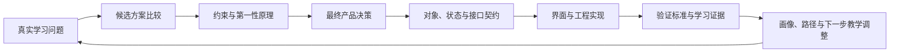
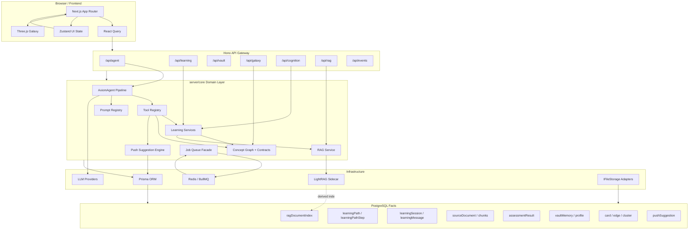

# AXIOM Space 产品创新与设计决策全记录

> 文档编号：10  
> 文档性质：产品创新设计与关键决策证据  
> 核心职责：完整呈现 AXIOM Space 从问题识别、方案比较、约束推导到产品与技术决策落地的全过程  
> 主要依据：`docs/02-决策与开发过程记录/` 全部 10 份原始设计记录  
> 关联文档：[02-软件需求规格说明书](./02-软件需求规格说明书.md)、[03-系统设计与开发说明书](./03-系统设计与开发说明书.md)、[04-测试说明书与测试报告](./04-测试说明书与测试报告.md)

## 文档定位

AXIOM Space 的创新不是若干功能名称的拼接，而是一组围绕“大学生如何真正学会”的连续设计决策。本记录以原始设计文档为主体，完整保存团队如何定义问题、比较方案、识别约束、作出取舍、建立契约并把决策落到界面与工程实现中。

本文回答三个核心问题：

1. **为什么做：** 每项设计针对什么真实学习问题和系统约束。
2. **为什么这样做：** 团队比较过哪些路径，依据什么淘汰其他方案。
3. **怎样形成体系：** 智能体、画像、路径、卡片、RAG、图谱、资源和评估如何互相提供证据并共同改变下一步教学。

本文采用设计证据体例。后续十个部分以原文为主，保留方案比较、边界、数据契约、算法、交互规则、成功标准和形成时点的状态记录。原文中涉及“当前状态”或“待实现”的表述，均作为**设计形成时点的过程证据**保留；当前版本的实现认定以《03-系统设计与开发说明书》为准，验证结论以《04-测试说明书与测试报告》为准。

## 创新设计总览

| 决策域 | 核心问题 | 最终形成的设计 | 创新价值 |
|---|---|---|---|
| 01 技术架构 | 如何支撑复杂学习闭环并保持长期可演进 | Clean Architecture 与领域驱动结合；Hono RPC 统一契约；数据库事实源与派生索引分离 | 将 AI 能力纳入稳定的软件工程边界，而不是依赖页面拼接 |
| 02 垂直领域 Agent | 普通聊天 Agent 为什么不足以承担个性化学习 | AXIOM Agent Harness；Agent1 前台教学、Agent2 后台取证；子 Agent 按需隔离 | 让模型输出持续改变卡片、画像、路径、资源、评估与图谱 |
| 03 产品形态 | 桌面端、插件、移动端与 Web 工作台如何取舍 | Web 工作台优先，其他形态作为后续入口扩展 | 优先承载完整学习闭环、多面板协同和快速验证 |
| 04 知识图谱 | 如何避免图谱沦为静态展示 | Card / Edge / Cluster 契约；显式与发现关系分层；多种认知投影 | 同一知识事实可按结构、任务、证据、来源和掌握状态重组 |
| 05 RAG | 如何召回个人知识而不制造第二事实源 | Postgres 保存事实；Qdrant 快速语义召回；LightRAG 后台图增强；索引可重建 | 将检索能力嵌入学习闭环，同时维持来源、隔离与可恢复性 |
| 06 知识准入 | 什么内容值得进入长期知识系统 | “清晰、准确、必要”三重准入与删除测试 | 把知识质量从主观好感转化为可判断、可审核的标准 |
| 07 画像闭环 | 如何让画像真正改变教学 | 固定六维主契约、AI 动态子维度、来源与置信度、历史快照、教学策略编译 | 画像从静态标签升级为下一问、讲法、节奏、资源和评估的决策输入 |
| 08 主动推送 | 如何主动帮助用户又不替用户作决定 | 连接推送盒与资源任务推送盒；统一候选契约；理由可见；用户确认后执行 | 将系统发现转成可解释、可撤销、可追踪的学习行动 |
| 09 工程治理 | 如何保证快速开发不破坏项目边界 | 根目录允许项、禁止项、命名边界和清理原则 | 把可维护性与可复现性作为产品交付能力的一部分 |
| 10 学习评估 | 如何区分“听过、写过”和“真正掌握” | 费曼对话评估、卡片准入审核、系统级学习健康评估 | 让评估结果反向调整教学、路径、资源和画像，形成闭环 |

## 设计决策证据链



十份记录不是彼此独立的点子。它们共同构成一条闭环：

- 技术选型提供可演进的系统骨架；
- Agent Harness 负责把学习意图变成受控行动；
- Web 工作台承载完整交互；
- 卡片、RAG 和图谱沉淀并重组知识；
- “清晰、准确、必要”控制长期知识质量；
- 六维画像将证据编译为教学策略；
- 推送机制把系统发现转成用户可决定的行动；
- 三层评估验证学习是否发生，并将结果重新送回画像、路径和教学。

## 全文目录

1. [01-技术架构说明](#01-技术架构说明)
2. [02-自研垂直领域-Agent](#02-自研垂直领域-agent)
3. [03-桌面优先还是-Web-优先](#03-桌面优先还是-web-优先)
4. [04-知识图谱创新](#04-知识图谱创新)
5. [05-RAG-增强体验](#05-rag-增强体验)
6. [06-清晰准确必要](#06-清晰准确必要)
7. [07-画像学习闭环](#07-画像学习闭环)
8. [08-资源推送机制](#08-资源推送机制)
9. [09-根目录结构规则](#09-根目录结构规则)
10. [10-学习效果评估](#10-学习效果评估)

---

> 原始记录：`docs/02-决策与开发过程记录/01-技术选型.md`  
> 编排处理：正文原文完整保留；仅统一标题层级，并将图片链接调整为提交文档中的相对路径。

## 01-技术架构说明

本文档面向技术评审和软件工程人员，说明 AXIOM Space 的技术架构、数据链路、运行时边界和关键技术选型。它不是产品介绍文档，而是回答一个工程问题：

> 系统底层数据如何被保存、索引、推理、编排，并最终形成前端可操作的学习工作台？

### 1. 系统定位

AXIOM Space 不是单页 AI Chat，也不是单纯的资料生成器。它是一个围绕“学习对象”运行的 Web 工作台：

```text
资料 / 对话 / 用户操作
  -> 卡片、路径、会话、图谱、画像、资源、评估
  -> Agent 读取和操作这些对象
  -> 页面把对象状态重新展示给用户
```

核心工程目标：

1. 所有学习数据必须可持久化、可追溯、可重新计算。
2. Agent 不能只生成文本，必须能调用工具操作系统数据。
3. RAG 只能作为知识增强层，不能替代业务数据库。
4. 前端页面必须能承载复杂工作流：路径规划、卡片编辑、AI 对话、图谱、画像、资源推送。
5. 长耗时任务不能阻塞用户主交互。

### 2. 技术栈总览

| 层级 | 技术 | 职责 |
|---|---|---|
| 前端框架 | Next.js 14 + React | App Router 页面、工作台 UI、客户端交互 |
| UI 组件 | Tailwind CSS + shadcn/radix + lucide-react | 工作台布局、控件、图标、弹窗、表单 |
| 3D/图谱渲染 | Three.js | Galaxy 知识图谱可视化 |
| 服务端 API | Hono | `/api/*` 统一路由、RPC 类型推导、薄网关 |
| 服务端语言 | TypeScript | 前后端共享类型习惯，降低接口漂移 |
| ORM | Prisma | 数据模型、查询、事务、关系约束 |
| 主数据库 | PostgreSQL | 业务事实源：用户、Vault、卡片、路径、会话、评估、图谱 |
| 前端服务端状态 | React Query | API 数据缓存、失效刷新、后台同步 |
| 前端 UI 状态 | Zustand | 当前模式、选中节点、会话、图谱布局、面板状态 |
| 认证 | Better Auth | 登录态、用户身份、会话鉴权 |
| AI 模型接入 | AIManager + pi-ai | LLM 调用、模型配置、流式输出、资源生成 |
| Agent 运行时 | pi-agent-core + AXIOM Agent Pipeline | 消息循环、工具调用、上下文注入、守卫、子 Agent |
| RAG | LightRAG | 卡片/资料的派生知识索引和语义召回 |
| 后台任务 | BullMQ + Redis | RAG 索引、重建、异步任务、失败重试 |
| 资源生成 | HTML/PPT/PDF/DOCX/视频渲染相关库 | 多类型学习资源产物 |

### 3. 从底层到应用的架构分层

系统按依赖方向分层：越底层越接近事实和基础设施，越上层越接近用户交互。

```text
浏览器 UI
  -> React hooks / Zustand / React Query
  -> Hono API
  -> server/core 领域服务
  -> Prisma / Redis / LightRAG / LLM
  -> PostgreSQL 事实源
```

#### 3.1 基础设施层

基础设施层负责外部系统和持久化能力：

- PostgreSQL：保存所有业务事实。
- Redis：作为 BullMQ 队列后端。
- LightRAG：作为可重建的知识索引服务。
- LLM Provider：提供对话、抽取、规划、评估、资源生成能力。
- 本地/DB 文件存储适配器：通过 `IFileStorage` 抽象卡片式文件读写。

对应代码：

- `lib/db.ts`
- `prisma/schema.prisma`
- `server/infra/storage/*`
- `server/infra/rag/lightrag-client.ts`
- `server/core/jobs/*`

#### 3.2 数据事实层

PostgreSQL 是系统唯一事实源。所有可被用户看到、编辑、追踪、审计的对象都必须落在数据库中。

主要模型：

| 数据对象 | Prisma 模型 | 说明 |
|---|---|---|
| 知识库 | `vault` | 用户工作空间 |
| 卡片 | `card` | 文献卡、灵感卡、永久卡的统一实体 |
| 图谱边 | `edge` | 卡片之间的 contains/related/prerequisite 等关系 |
| 星团 | `cluster` | Galaxy 中的知识域分组 |
| 学习路径 | `learningPath` | 一条可推进路径 |
| 路径步骤 | `learningPathStep` | 绑定卡片、状态、掌握度和前置条件 |
| Agent 会话 | `learningSession` | 普通对话、卡片线程、路径步骤线程 |
| 会话消息 | `learningMessage` | 用户/AI 消息持久化 |
| 来源资料 | `sourceDocument` / `sourceDocumentChunk` | 导入资料原文和分块追溯 |
| RAG 索引状态 | `ragDocumentIndex` | LightRAG 同步状态，不是事实源 |
| 学习评估 | `assessmentResult` | 练习、费曼、测评结果 |
| 用户观察 | `vaultMemory` | 画像观察、系统通知、提示词摘要等 |
| 推送建议 | `pushSuggestion` | 连接推送、资源/任务推送 |
| 路径调整 | `PathAdjustmentHistory` | 基于评估或进度的路径调整记录 |

关键原则：

```text
PostgreSQL 保存事实。
LightRAG 保存可重建索引。
Redis 保存任务队列状态。
前端缓存不能作为事实源。
```

#### 3.3 领域层

领域层放在 `server/core`，它不应该依赖 React，也不应该把业务规则写死在 API route 中。

主要领域模块：

| 模块 | 位置 | 职责 |
|---|---|---|
| Agent 引擎 | `server/core/agent` | 对话循环、工具调用、上下文注入、子 Agent、守卫 |
| AI Prompt 系统 | `server/core/ai/prompts` | 任务提示词、契约、输出格式约束 |
| 学习路径 | `server/core/learning` | 文档导入、路径调整、画像上下文、费曼记录 |
| 图谱/概念 | `server/core/domain/concept-graph.ts` | 根节点、contains 边、概念卡创建 |
| 质量契约 | `server/core/domain/contracts.ts` | 卡片质量、步骤状态、清晰准确必要标准 |
| 资源推送 | `server/core/push` | 连接建议、资源建议、任务组建议 |
| RAG 服务 | `server/core/rag` | LightRAG 同步、查询、生成上下文 |
| 后台任务 | `server/core/jobs` | BullMQ 队列和 worker |

领域层的目标是：同一套业务能力可以被页面、Agent 工具、后台任务共同复用。

#### 3.4 API 网关层

API 层使用 Hono。它的职责是鉴权、参数校验、调用领域服务、返回 JSON 或 SSE。

路由分组：

| Route | 职责 |
|---|---|
| `/api/agent` | Agent 对话、会话列表、卡片线程、工具确认、SSE 流 |
| `/api/learning` | 学习路径、资料导入、进度更新、评估、推送建议 |
| `/api/galaxy` | 知识图谱数据、卡片关系 |
| `/api/cognition` | 认知画像、观察记录、画像反馈 |
| `/api/rag` | RAG 状态、同步、重建 |
| `/api/vault` / `/api/vaults` | Vault 和卡片管理 |
| `/api/events` | 服务端通知事件流 |
| `/api/dashboard` | 工作台统计 |

前端不直接访问数据库，也不绕过 Hono route。

#### 3.5 前端应用层

前端是一个多面板工作台，而不是传统网页表单。

主要页面/组件：

| UI 区域 | 组件 | 技术职责 |
|---|---|---|
| Learn 路径规划 | `components/learn/learn-workspace.tsx` | 路径生成、资料导入、步骤推进、推送箱 |
| Forge 工作台 | `components/forge/forge-chat.tsx` / `forge-editor.tsx` | Agent 对话、卡片编辑、资源预览、自动保存 |
| Galaxy 图谱 | `components/three/galaxy-canvas.tsx` | Three.js 知识图谱 |
| Cognition 画像 | `components/cognition/*` | 六维画像、观察证据、用户反馈 |
| 资源展示 | `components/resources/resource-cards.tsx` | 文档、思维导图、测验、视频、PPT 等预览 |
| 全局布局 | `app/page.tsx` / `app/providers.tsx` | 模式切换、Provider、面板布局 |

状态分工：

```text
React Query:
  learning-paths / galaxy / cognition / rag status / push suggestions

Zustand:
  selectedNode / selectedPathId / activeLearningStepId / sessionId / layout state
```

### 4. 关键运行时链路

#### 4.1 资料导入链路

```text
用户粘贴文本或选择文件
  -> 前端转换为 Markdown 或内嵌附件 Markdown
  -> POST /api/learning/import-document
  -> document-import-service
  -> sourceDocument/sourceDocumentChunk 保存原始资料
  -> card(type=literature) 保存文献 MD 节点
  -> AI 尽力抽取概念和关系
  -> card(type=fleeting) 生成灵感草稿
  -> edge 写入 contains/related 等关系
  -> learningPath + learningPathStep 生成学习路径
  -> React Query 失效刷新 Learn/Galaxy/Cognition
```

工程边界：

- 文献卡必须先保存，AI 抽取失败不能导致原文丢失。
- 文件能转成 Markdown 就转；不能转则以内嵌附件形式保存到 Markdown。
- `sourceDocument` 保存可追溯原文，`card(type=literature)` 是用户可见节点。

#### 4.2 学习路径生成链路

```text
用户输入主题
  -> /api/learning/generate
  -> 读取已有 card/edge/capability/profile
  -> 可选读取 LightRAG 上下文
  -> AI 生成概念拆解和步骤
  -> 创建 cluster/card/edge
  -> 创建 learningPath/learningPathStep
  -> 触发 pushSuggestionEngine 扫描
  -> 前端刷新路径和图谱
```

学习路径不是纯文本结果，它会落成数据库对象。

#### 4.3 Agent 对话链路

```text
ForgeChat 发送消息
  -> POST /api/agent/chat
  -> 校验 learningSession
  -> hydrate 历史 learningMessage
  -> 注入画像、卡片、RAG、工具上下文
  -> AxiomAgent.runStream
  -> 工具调用 / LLM 流式输出
  -> SSE 返回 text/tool/resource/rag/profile_question
  -> learningMessage 持久化
  -> BackgroundAnalyzer 更新画像观察
  -> 前端刷新相关查询
```

Agent 的关键能力不是“回答”，而是“在受控工具系统内操作业务对象”。

#### 4.4 卡片保存与 RAG 同步链路

```text
用户编辑卡片
  -> /api/vault/cards/:id
  -> card.content 更新到 PostgreSQL
  -> enqueue rag.indexCard
  -> BullMQ/Redis
  -> worker 调用 syncCardToLightRAG
  -> LightRAG 建索引
  -> ragDocumentIndex 更新状态
  -> 前端显示 pending/indexing/indexed/failed
```

RAG 同步失败不会影响卡片保存。RAG 可重建，数据库不可丢。

#### 4.5 资源生成链路

```text
用户请求资源
  -> Agent 调用 push_resource 工具
  -> resource-generation orchestrator
  -> 读取用户画像、当前卡片、RAG 上下文
  -> 按资源类型调用对应 prompt/render pipeline
  -> 生成 document/mindmap/quiz/code/video/svg/ppt/pdf/docx 等
  -> 保存资源 manifest 和 literature/card 记录
  -> SSE resource_progress 推送进度
```

资源生成由 Agent 工具触发，结果必须能回到工作台，而不是只存在于对话文本里。

#### 4.6 画像与主动追问链路

```text
每轮 Agent 对话结束
  -> BackgroundAnalyzer 分析用户表达
  -> vaultMemory 写入 profile_* observation
  -> profile-context 聚合六维画像
  -> profile-questioner 判断是否必须追问
  -> 若当前是卡片线程：问题写入普通 Agent 会话
  -> 若当前是普通对话：问题追加在当前会话
```

主动追问的边界：

- 概念解释不追问。
- 路径、资源、推送、评估等高个性化任务才追问。
- 卡片会话不被画像问题污染。

#### 4.7 评估与路径调整链路

```text
Agent 工具生成测验 / 费曼评估
  -> assessmentResult 保存结果
  -> path-adjustment-engine 判断是否需要复习、跳过、降难度
  -> PathAdjustmentHistory 记录调整
  -> learningPathStep 状态和 mastery 更新
  -> 推送建议重新扫描
```

评估结果是路径调整和资源推送的输入，不只是一次性反馈。

### 5. AI 子系统结构

AI 子系统由五部分组成：

1. `AIManager`：统一 LLM 调用入口。
2. Prompt Registry：所有任务 prompt 有 ID、契约、输入、输出、正确/错误标准。
3. AxiomAgent Pipeline：负责消息循环、上下文构造、工具调用、压缩、守卫。
4. Tool Registry：把业务能力暴露给 Agent，例如卡片、路径、资源、评估、推送。
5. Guardrails：文件安全、输出结构、事实校验、工具确认。

Agent 工具不是前端按钮的替代品，而是让 LLM 在后端受控地调用系统能力。

### 6. RAG 的技术边界

RAG 在 AXIOM 中只解决“知识召回和上下文增强”。

它参与：

- Agent 回答时检索已有卡片和资料。
- 学习路径生成时提供参考上下文。
- 资源生成时提供用户已有知识和资料片段。
- 导入资料后作为后续问答的知识索引。

它不负责：

- 保存卡片事实。
- 保存路径状态。
- 保存用户画像。
- 判断步骤是否完成。
- 替代 PostgreSQL 查询。

因此 LightRAG 可以关闭、失败、重建；系统的主数据仍然完整。

### 7. 异步任务设计

异步任务使用 BullMQ + Redis。当前主要用于 RAG 索引：

```text
enqueueRagIndexCard(cardId)
  -> queue: axiom
  -> worker: rag.indexCard
  -> syncCardToLightRAG
  -> update ragDocumentIndex
```

设计原因：

- 卡片保存必须快速完成。
- RAG 索引可能慢、失败、重试。
- 用户需要看到索引状态，而不是等待一个长请求。

后续资源渲染、批量导入、全库重建也可以进入同一队列模型。

### 8. API 和类型边界

前端数据访问集中在 `hooks/*`：

- `use-learning.ts`
- `use-agent.ts`
- `use-galaxy.ts`
- `use-cognition.ts`
- `use-dashboard.ts`

这些 hook 通过 `lib/api-client.ts` 访问 Hono RPC。这样可以控制：

1. 页面不直接拼裸 fetch。
2. API 返回结构集中处理。
3. React Query 失效策略集中管理。
4. 前端组件只消费业务对象，不关心底层 API 细节。

### 9. 技术架构图草案

下面是用于后续生成技术架构图的结构草案：



### 10. 当前架构判断

AXIOM Space 的核心技术取舍是：

- 用 PostgreSQL 承担事实源，保证学习对象真实可追溯。
- 用 Hono RPC 管住 API 边界，避免前端和后端接口漂移。
- 用 `server/core` 承载领域逻辑，避免业务散落在 UI 或 route 中。
- 用 Agent 工具系统把 AI 接入真实数据操作。
- 用 LightRAG 增强召回，但不让它成为主数据库。
- 用 Redis/BullMQ 承接长耗时任务，保护用户交互流畅性。
- 用 React Query + Zustand 分开服务端数据和 UI 状态。

从技术角度看，系统是一个“数据库事实源 + Agent 工具编排 + RAG 派生索引 + 多面板前端工作台”的组合架构。

---

> 原始记录：`docs/02-决策与开发过程记录/02-自研垂直领域agnet.md`  
> 编排处理：正文原文完整保留；仅统一标题层级，并将图片链接调整为提交文档中的相对路径。

## 02-自研垂直领域 Agent

> 文件名保留原始命名。本文档说明 AXIOM Space 为什么没有只做一个普通聊天 Agent，而是设计成面向学习场景的 AXIOM Agent Harness。

### 这次决策要解决什么

A3 赛题要求的是“个性化资源生成与学习多智能体系统”，不是普通 AI 问答。系统至少要覆盖：

1. 对话式学习画像构建。
2. 多智能体协同资源生成。
3. 个性化学习路径规划。
4. 智能辅导。
5. 学习效果评估。

如果只做一个聊天机器人，它可以回答问题，但很难稳定完成这些任务。AXIOM 的目标是让用户从“看过资料”走向“真正掌握”，所以 Agent 必须参与路径、卡片、资源、评估、画像和图谱的持续更新。

### 最终决策

AXIOM Space 在 PI Agent 底座思路下实现自研 AXIOM Agent Harness，并在其中组织双 Agent 并行机制和教育场景专用子 Agent。

AXIOM Space 在 PI Agent 底座上自研了一套面向掌握学习场景的 Agent Harness。Agent1 负责前台教学对话，Agent2 负责后台记录、画像更新、证据分析和路径反馈，系统统一编排工具、知识库、路径、卡片和页面状态。

这里的 Agent Harness 指智能体编排与运行框架，不是大模型本身，也不是单个 Agent。它负责把 Agent、工具调用、RAG、知识图谱、长期画像、学习路径、卡片状态和页面反馈串成一个可运行、可追踪、可验证的学习系统。

### Harness 到底怎么“牵引”

`Harness` 的原意是马具或牵引装置。放在 AXIOM Space 里，它的意思不是“多放几个 Agent”，而是把大模型原本发散的生成能力牵引到掌握学习流程里。

AXIOM Agent Harness 牵引的不是模型参数，而是模型的行为边界、任务方向和结果落点。

具体体现在七个环节：

| 牵引环节 | 系统做法 | 页面证据 |
|---|---|---|
| 入口牵引 | 用户不是空白聊天，而是从 Learn 的任务步骤、Forge 的当前卡片或某个知识节点进入对话 | `Current Focus` 显示当前任务组、步骤、卡片 |
| 上下文牵引 | Harness 为 Agent 装配当前 Vault、任务、卡片、历史对话、RAG 召回和相关知识节点 | 回复围绕当前学习对象，不是泛泛回答 |
| 角色牵引 | Agent1 只负责前台教学和工具协调；Agent2 只负责后台证据提取、画像更新和路径反馈 | 用户只看到一个前台导师，后台变化体现在 Cognition / Dashboard |
| 工具牵引 | AI 不能直接改写系统事实，必须通过卡片保存、资源生成、路径评估、图谱链接等工具或领域对象落地 | 保存卡片、生成资源、建立链接、标记完成都有明确按钮和状态 |
| 证据牵引 | Agent2 把对话转成结构化观察：本轮摘要、薄弱点、掌握证据、画像变化、下一步建议 | `AI 观察记录`、知识缺口、认知维度变化 |
| 反馈牵引 | 观察结果反过来影响 Guide、Assess、Forge 和下一轮 Agent1 回复 | Learn 路径、评估结果、资源推荐随学习证据调整 |
| 知识牵引 | 用户保存的卡片进入 RAG 和知识图谱，成为后续回答和路径规划的长期依据 | RAG 状态、Galaxy 节点、关系边、相关卡片推荐 |

所以这套 Harness 的核心不是“两个 Agent 并行”这个表述，而是一条持续运行的牵引链路：

```text
用户意图 / Learn 当前步骤 / Forge 当前卡片
    -> Harness 装配任务上下文、学习证据和知识召回
    -> Agent1 前台教学、追问、解释、调用工具
    -> 用户输出卡片、回答或资源需求
    -> Agent2 后台提取证据、更新画像、识别薄弱点
    -> 写入 Cognition / Dashboard / Learn / Galaxy
    -> Guide、Assess、Forge 读取新状态
    -> 下一轮对话、路径和资源推荐被重新约束
```

简要说明：

> AXIOM Agent Harness 像一套智能体马具：它把大模型的生成能力牵引到具体学习对象上，用任务、卡片、工具、证据、RAG 和图谱约束它的方向，让 AI 的每次输出都进入可追踪的学习闭环，而不是停留在一次性聊天。

### Agent 架构图


架构图展示一个关键决策：用户只直接面对 Agent1；Agent2 在后台工作，通过 Cognition、Dashboard、Learn、Galaxy 的状态变化体现价值。


能力全景图补充技术实现层：AXIOM 不是把两个聊天机器人并排放在页面上，而是在一个 Agent Harness 里完成会话约束、上下文装配、意图判断、工具治理、后台证据分析、多模态资源生成和页面状态反馈。

### 用户视角：这些设计实际解决什么

Agent Harness 的每个设计都必须对应到学生的具体学习收益。下面这张表不按代码模块解释，而是按用户真实使用时遇到的问题解释：这个技术设计为什么存在，它最后在页面上帮助用户完成什么。

| 功能 / 技术设计 | 用户原本遇到的问题 | AXIOM 的设计 | 用户得到的具体帮助 | 页面落点 |
|---|---|---|---|---|
| 学习对象绑定 | 普通 AI 聊天每次都要重新交代背景，问答容易跑题 | 对话必须绑定 Vault、Session、Card Thread 或 Learn 当前步骤 | 用户在某个知识点、任务步骤或卡片中提问时，AI 自动知道当前讨论对象，回答不会脱离正在学的内容 | Forge `Current Focus`、Learn 步骤、卡片线程 |
| Agent1 前台教学 | 用户需要即时解释、追问、举例和纠错，不希望被后台分析打断 | Agent1 专注前台对话和教学工具调用 | 用户看到的是一个连续的学习导师，可以围绕当前概念一边问、一边写、一边修正 | Forge `AI Workspace`、流式回复、工具状态 |
| Agent2 后台分析 | 用户不会主动维护画像，也很难自己整理薄弱点 | Agent2 在每轮对话后提取证据、更新画像、识别知识缺口 | 用户不需要填表，系统会从真实表达中整理出薄弱点、学习偏好和下一步建议 | Cognition `AI 观察记录`、知识缺口、认知维度 |
| LightRAG 检索增强 | AI 只凭通用知识回答，容易忽略用户自己的资料和卡片 | 回答前检索当前 Vault 中的卡片、文件和知识上下文 | 用户问问题时，回答能引用自己保存过的内容，学习不会被割裂成一次次孤立聊天 | RAG 引用、相关卡片、资料来源 |
| 动态上下文装配 | 同一个问题对不同基础的学生应该有不同解释方式 | 每轮注入画像、最近活动、已掌握概念、到期复习、图谱路径 | 用户不用反复说明“我学到哪里了”，系统会按当前水平调整解释深度和例子 | Forge 回复、Learn 下一步、复习提醒 |
| 意图识别与工具筛选 | 用户一条输入里可能是提问、生成资料、创建卡片或调整路径 | `IntentRouter` 判断意图，并只开放本轮需要的工具集合 | 用户用自然语言表达需求即可；系统减少误操作，也避免把简单提问变成错误写入 | 工具执行状态、确认提示、资源生成入口 |
| 工具治理与写入前检查 | AI 如果直接改知识库，容易产生错误卡片、误删内容或污染长期记忆 | 工具调用经过 guardrail、checkpoint、脱敏、结果截断和审计 | 用户可以让 AI 协助整理资料，但关键写入有边界，知识库更稳定 | 保存按钮、工具结果、卡片质量检查 |
| 多模态资源生成管线 | 学生围绕一个知识点需要讲解、导图、练习、代码和脚本，不想分别找工具 | `push_resource` 统一进入资源编排、生成、校验、保存和预览流程 | 用户输入一个主题后，可以得到多种学习材料，并能直接预览、下载或沉淀为卡片 | Resource 进度、预览文件、资源摘要 |
| 学习路径与 Guide | 用户知道要学一个主题，但不知道先学什么、后学什么 | Guide 读取画像、已有知识、图谱关系和薄弱点来组织路径 | 用户得到的是可执行的学习顺序，而不是一堆散乱资料 | Learn 路径、步骤状态、下一步 |
| Assess 学习评估 | 用户点了完成不代表真的掌握，系统也不能只靠 AI 口头判断 | Assess 要求用户解释、做题或完成检查，再结合 Agent2 证据更新状态 | 用户能看到自己哪里会、哪里模糊，路径推进有依据 | Learn 评估结果、掌握状态、薄弱点 |
| GraphIntegration / Galaxy | 用户保存了很多卡片后，很难看清知识之间的关系 | 卡片、路径、RAG 关系和证据进入知识图谱 | 用户能看到当前概念周围有哪些前置、后续、证据和相关卡片，知道下一步往哪里走 | Galaxy 节点、关系边、证据视图 |
| Memory / Profile | 长期学习中，用户的目标、偏好和薄弱点会变化 | MemoryManager、BackgroundAnalyzer、Profile 共同维护长期画像 | 用户越用系统，后续解释、推荐和评估越贴近自己的学习状态 | Cognition 画像、Dashboard 活动、个性化推荐 |
| SSE 与页面同步刷新 | AI 生成耗时任务时，如果页面没反馈，用户不知道系统在做什么 | 流式输出 `text`、`tool_start`、`tool_end`、`resource_progress`，结束后刷新相关查询 | 用户能看到系统正在搜索、生成、保存还是评估；完成后其他页面同步更新 | 流式消息、资源进度、Dashboard / Learn / Galaxy 刷新 |
| 子 Agent 角色系统 | 讲解、路径、资源、画像、评估混在一个提示词里，结果容易不稳定 | Oracle、Profile、Forge、Guide、Assess 按能力边界分工，按需调用 | 用户仍然只面对一个工作台，但背后不同任务由对应能力处理，输出更稳定 | Forge、Learn、Cognition、Resources、Galaxy |

因此，AXIOM 的 Agent 设计不是为了展示复杂架构，而是为了让学生在一个连续流程里完成四件事：知道自己学到哪里、得到合适的解释和资源、把理解沉淀成卡片、用证据推动下一步学习。

### 实现链路：我们具体设计了什么

AXIOM 的 Agent 设计可以按一次真实交互来理解。用户在 Learn 打开一个步骤，或在 Forge 选中一张卡片后发问，系统并不是直接把当前输入丢给大模型，而是先把它放进一个可追踪的学习现场。

```text
页面学习对象
    -> Hono Agent API 校验 Vault / Session / Card Thread
    -> LightRAG 检索增强
    -> AxiomAgent Runtime 装配服务、工具、上下文
    -> AgentPipeline 判断意图、选择工具、注入记忆与图谱
    -> PI Agent 底座流式输出与执行工具
    -> Agent2 后台分析证据
    -> DB / Cognition / Dashboard / Learn / Galaxy / Resources 更新
```

这条链路就是 AXIOM Agent Harness 的真实边界。PI Agent 提供底层 Agent 运行能力；AXIOM 自研的是外层掌握学习 Harness，也就是把模型能力牵引到学习对象、系统工具、长期证据和页面闭环上的那一层。

#### 1. 页面入口：先绑定学习对象，再进入对话

前端入口在 `hooks/use-agent.ts`。它做的第一件事不是发送消息，而是确认这次对话属于哪个 Vault、哪个会话、哪个卡片线程。

关键设计：

| 设计点 | 实现方式 | 为什么这样做 |
|---|---|---|
| 必须有当前 Vault | 没有 `currentVaultId` 时直接提示用户选择知识库 | 防止 AI 输出无法落到任何知识库 |
| 卡片线程优先 | 选中节点后调用 `openCardThread(selectedNode)` | 让 Forge 对话围绕当前学习对象，不变成普通闲聊 |
| 永久卡片不可继续写旧线程 | 选中 permanent 卡片时提示新建 Fleeting 卡片继续讨论 | 避免已沉淀知识被随意改写 |
| SSE 逐步回放 | 前端手动读取 `/api/agent/chat` 流 | 页面可以同时展示文本、工具状态、资源进度和 RAG 引用 |
| 交互后刷新工作台 | 对话完成后 invalidate `galaxy`、`dashboard-stats`、`learning-paths`、`learning-profile`、`cognition`、`observations`、`knowledge-gaps` | Agent2 的后台结果能立刻反映到其他页面 |

这也是页面需要明确体现的交互：用户不是进一个空白 ChatGPT，而是从 Learn 的步骤、Forge 的卡片、Galaxy 的知识节点进入同一个 Agent 工作台。

#### 2. API 入口：会话、Vault 和 LightRAG 先行

后端入口在 `server/api/routes/agent.ts` 的 `/chat`。这里是 Harness 的第一道硬约束。

具体流程：

1. `requireAuth` 确认用户身份。
2. Zod 校验 `message`、`sessionId`、`oracleId`、`vaultId`。
3. `resolveAgentVaultId` 解析用户当前 Vault。
4. `runWithAgentContext({ userId, vaultId })` 把用户和知识库上下文绑定到本轮工具执行环境。
5. 如果没有显式 `sessionId`，直接拒绝：`Forge 对话必须绑定到具体卡片线程。请先选择一张卡片。`
6. 读取 `learningSession`，检查会话归属、状态和卡片线程合法性。
7. `hydrateAgentFromDb(agent, dbSessionId)` 读取最近 40 条历史消息，恢复上下文。
8. `persistMessage(dbSessionId, 'user', message)` 先落库用户消息。
9. `buildRagEnhancedMessage(message, vaultId)` 在环境变量 `LIGHTRAG_CHAT_CONTEXT=true` 时调用 LightRAG `mix` 检索，把召回内容注入到用户问题前。
10. `agent.runStream(ragEnhanced.message, callbacks)` 进入 AxiomAgent 主循环。
11. 将 `text`、`tool_start`、`tool_end`、`resource_progress`、`rag_context` 等事件用 SSE 回传前端。
12. 回复完成后把 assistant 消息落库，并对普通会话尝试自动命名。

这个入口决定了 AXIOM 的回答不是“只看当前输入”，而是同时被用户身份、Vault、会话线程、LightRAG 召回和历史消息约束。

#### 3. Runtime 组合根：Agent 不是一个类，而是一组服务

`server/core/agent/pipeline/AgentServices.ts` 的 `createAgentServices` 是 AXIOM Agent Harness 的组合根。它把一次 Agent 运行所需的能力装配到同一个服务对象中。

| 服务 | 具体能力 | 作用 |
|---|---|---|
| Config | 默认 system prompt、模型、thinkingLevel、toolExecution、maxRetries、maxIterations、contextLength | 统一运行参数 |
| StateMachine | `IDLE / PLANNING / EXECUTING / REFLECTING / DONE` 等状态流转 | 页面调试和审计可观测 |
| AuditLogger | 状态、工具、守卫日志 | 证明系统不是黑箱调用 |
| CheckpointManager | 写入前快照 | 降低文件/卡片写入风险 |
| UsageTracker / CredentialPool | 用量追踪、密钥池、辅助模型 | 支撑长会话和后台任务 |
| IterationBudget | 最大迭代和 grace call | 防止 Agent 无限循环 |
| ContextCompressor | 上下文压缩 | 处理长上下文 |
| MemoryManager | 记忆、能力追踪、知识图谱 provider | 让对话结果进入长期学习记忆 |
| PrismaLearningAdapter | 学习轨迹、路径、画像、图谱相关 DB 操作 | 让 Agent 结果可落库 |
| PatternExtractorAdapter | 学习模式提取 | 用用户行为反向影响后续教学 |
| GraphIntegrationManager | 概念图谱与学习路径推荐 | 把知识点连接关系注入下一轮对话 |
| LearningFacade | 学习系统统一门面 | 让 Agent 访问路径、评估、图谱能力 |

默认配置也体现了 Harness 的方向：`toolExecution` 是 `parallel`，`enableMemory`、`enableBudget`、`enableCompression`、`enableTrajectory` 默认开启，`contextLength` 默认按长上下文设计。这说明它不是一次性问答，而是面向持续学习过程。

#### 4. AxiomAgent：PI Agent 底座外的自研包装层

`server/core/agent/agent.ts` 里的 `AxiomAgent` 继承 `Interruptible`，内部创建 `@mariozechner/pi-agent-core` 的 `Agent`。PI Agent 负责底层消息循环和工具执行，AXIOM 在外面加了掌握学习所需的运行规则。

自研包装点包括：

| 包装点 | 代码位置 | 技术含义 |
|---|---|---|
| PromptService | `convertToLlm`、`transformContext` | 把 AXIOM 的 system prompt、项目上下文、画像、记忆整理成模型可用上下文 |
| Context-bound tools | `_getContextBoundTools()` | 工具执行时携带当前用户和 Vault，避免跨知识库写入 |
| beforeToolCall | `_onBeforeToolCall` | 执行工具前先经过 plugin hook、guardrail 和写入前 checkpoint |
| afterToolCall | `_onAfterToolCall` | 工具结果脱敏、截断、审计、错误重试 |
| BackgroundAnalyzer | `_backgroundAnalyzer` | 每轮之后异步抽取画像、技能、卡片和观察 |
| BackgroundReview | `_backgroundReview` | 每 N 轮 fork 一个后台审查过程，整理长期记忆和技能 |
| Subagent spawn | `spawnRoleAgent`、`sessions_spawn` | 在需要隔离上下文或并行处理时启动角色子 Agent |
| Pipeline 主循环 | `runStream()` | 不直接调用模型，而是先走四阶段 Pipeline |

所以 AXIOM 不是说“我们训练了一个新模型”，而是说“我们自研了一套垂直学习场景的 Agent Harness”，它包住 PI Agent 底座，把底层 Agent 牵引到业务闭环里。

#### 5. 四阶段 Pipeline：每轮怎么思考和决策

`server/core/agent/pipeline/Pipeline.ts` 把一次 Agent 回复拆成四个阶段。这个设计集中体现了系统的运行细节。

| 阶段 | 做什么 | 关键决策 |
|---|---|---|
| `prepareMessages` | 状态机进入 `PLANNING`，重置本轮 checkpoint 和空回复处理器 | 每轮都重新规划，不沿用上一轮的临时状态 |
| `prepareMessages` | 读取最近 3 条消息，调用 `classifyIntentSmart` 判断 `chat / learn / create / analyze / manage / profile` | 用规则快速判断，模糊时用辅助 LLM 仲裁并抽取 slots |
| `prepareMessages` | 低置信破坏性意图注入确认提示 | 创建、删除、写入类动作不能直接执行 |
| `prepareMessages` | 激活 `SkillEngine`：学习意图进入 `axiom-learning`，PPT/资源生成进入 `axiom-ppt` | 让 Agent 有阶段性任务意识，而不是每轮从零开始 |
| `prepareMessages` | `buildSystemPrompt()` 注入 active skill、项目上下文、用户画像和用户技能 | 前台导师会继承后台画像和历史技能 |
| `prepareMessages` | `selectToolsForTurn()` 按意图筛工具 | 学习、生成、分析、管理看到的工具不同，降低误调用 |
| `prepareMessages` | 预算检查、轨迹模式提取、记忆预取、动态上下文、图谱路径推荐 | 把“用户正在学什么、已经懂什么、哪里薄弱”放进本轮输入 |
| `callLLM` | 订阅 PI Agent 事件并流式输出 | 文本、思考、工具开始、工具结束都能被页面接收 |
| `executeTools` | 工具由 PI Agent 底座执行，但被 AXIOM 的工具钩子治理 | Harness 负责边界，底座负责执行循环 |
| `postTurnProcessing` | 同步记忆、触发自动评估、记录轨迹、更新图谱、启动 Agent2 | 本轮对话结束后立即进入后台证据沉淀 |

这一段可以解释“Agent 怎么思考”：它不是只有一个 prompt，而是先判断意图，再决定是否需要确认，再决定启用哪个 Skill 阶段，再决定给模型哪些工具，再把记忆、RAG、图谱和画像注入进去，最后才调用底层模型。

#### 6. 上下文装配：让模型进入学习现场

AXIOM 的上下文分三层装配。

第一层是 API 层 LightRAG。`buildRagEnhancedMessage` 会在 `LIGHTRAG_CHAT_CONTEXT=true` 时使用 `queryLightRAGContext`，以 `mix` 模式检索知识库，并把结果包进：

```text
【LightRAG 检索上下文】
...

【用户问题】
...
```

同时后端把 `references` 通过 `rag_context` SSE 事件发给前端，所以页面可以展示“这次回答参考了哪些卡片/文件”。

第二层是稳定 system prompt。`SystemPromptBuilder` 会装配：

- 基础 persona。
- active skill 内容。
- 项目上下文文件。
- BackgroundAnalyzer 产生的用户画像。
- 用户技能库。

第三层是每轮动态上下文。`ContextBuilder` 会装配：

| 动态块 | 内容 | 目的 |
|---|---|---|
| `<knowledge-overview>` | 卡片数量、知识域、图谱边、最近活跃卡片 | 让 Agent 知道用户知识库整体状态 |
| `<learning-context>` | 最近 7 天卡片活动、活跃知识域、学习节奏 | 让 Agent 感知学习进度 |
| `<user-profile>` | 学习目标、领域进展、困难区域、交互特点 | 个性化解释深度和例子 |
| review reminders | 到期 fleeting card | 提醒复习 |
| mastered concepts | 已掌握 permanent 概念 | 避免重复讲已掌握内容 |
| `<memory-context>` | MemoryManager 预取结果 | 让短期/长期记忆进入本轮 |
| `<learning-path>` | 图谱推荐的后续概念 | 让回答和 Learn 路径一致 |

因此前台 Agent1 的回复不是凭空生成，而是在“当前任务 + 当前卡片 + RAG 文献 + 学习画像 + 图谱路径 + 记忆证据”的约束下生成。

#### 7. 工具治理：工具不是外挂，而是能力边界

`server/core/agent/builtin-tools.ts` 注册了 AXIOM 的工具模块，包括文件、卡片、记忆、资源、会话、子 Agent、内容分析、图谱分析、学习路径、评估、推荐、学习管理、内容质量、Vault 维护和文档导入。

这些工具不只是“让 AI 能做更多事”，而是把 AI 的行动限制在可审计的领域对象里。

| 工具域 | 代表能力 | Harness 的约束 |
|---|---|---|
| Card | `create_fleeing_card`、`create_permanent_card`、`search_cards`、`add_graph_node`、`add_graph_edge` | 知识沉淀必须成为卡片或图谱对象 |
| Memory | `memory_search`、`write_memory`、`edit_memory`、`search_history` | 长期偏好和历史不能只留在聊天文本中 |
| Resource | `push_resource`、`extract_cards`、`generate_ppt` | 多模态资源走统一生成管线 |
| Learning Path | `create_learning_path`、`suggest_next_topic`、`set_learning_goal` | 路径规划落到 Learn 数据结构 |
| Assessment | `assess_understanding`、`feynman_test`、`generate_mcq`、`batch_assess` | 完成学习必须有评估证据 |
| Graph Analysis | `find_learning_path`、`detect_graph_gaps`、`suggest_links` | 图谱不是静态展示，而是参与路径推荐 |
| Content Quality | `check_card_quality`、`validate_markdown`、`detect_duplicates` | 防止低质量卡片直接进入知识库 |
| Subagent | `sessions_spawn`、`subagents` | 复杂任务可以隔离给角色子 Agent |

工具治理有三层：

1. 意图层：`IntentRouter` 为不同意图提供不同工具集合。
2. 本轮选择层：`selectToolsForTurn()` 在低置信或需要确认时只保留安全确认工具。
3. 执行钩子层：`beforeToolCall` 和 `afterToolCall` 做 guardrail、checkpoint、脱敏、结果截断、重试和审计。

还有一个很重要的学习边界：`update_learning_progress` 不能直接把步骤标记为 `completed` 或 `mastered`。它会要求用户先在 Learn 打开 Step，进入 Forge 留下解释，再通过 Learn 完成评估更新进度。这保证了“完成”不是 AI 口头判断，而是有用户表达和评估证据。

#### 8. Agent2：后台怎么记录、分析和落库

Agent2 不是一个可见聊天窗口，而是在 `postTurnProcessing` 里自动发生的后台分析链路。

每轮回复结束后，Pipeline 会做这些事：

1. `memoryService.syncAll()` 同步用户消息和 assistant 回复。
2. `queuePrefetchAll()` 为下一轮预取记忆。
3. `trySummarizeMemory()` 尝试摘要长记忆。
4. 对学习相关意图检查是否需要自动评估，必要时注入 `assess_understanding` 提示。
5. 把本轮对话写入学习轨迹。
6. `patternExtractor.addTrajectory()` 提取学习模式。
7. 根据用户消息更新图谱中正在学习的节点进度。
8. 启动 `BackgroundAnalyzer.analyze()`。
9. 更新教育画像快照。
10. 通知 `BackgroundReview`，每 N 轮进行更长上下文审查。

`BackgroundAnalyzer` 的具体做法是：

| 步骤 | 技术细节 |
|---|---|
| 增量分析 | 只取 `lastAnalyzedIndex` 之后的新消息，避免重复分析 |
| 证据采样 | 从最近用户消息中保留最多 3 条证据，每条截断到 300 字 |
| LLM 结构化输出 | 用后台分析 prompt 提取 `profile`、`skills`、`cards`、`observations` |
| 画像写入 | 通过 `profile-manager` 合并到用户画像，并发出 `profile` 通知 |
| 技能写入 | 写入 `prisma.vaultSkill`，来源为 `conversation`，保留 evidence |
| 卡片写入 | 对 permanent 卡片做定义、例子、链接、应用场景质量检查，通过后写入 `prisma.card` |
| 观察写入 | 写入 `prisma.vaultMemory`，category 为 `background-analysis` |

Agent2 的页面呈现不需要第二个聊天框。完整链路是：在 Forge 里问一个问题，让 Agent1 追问或解释；然后切到 Cognition 看 `AI 观察记录`、知识缺口、认知维度变化；再回到 Dashboard 或 Learn 看近期活动和下一步建议变化。

#### 9. 子 Agent：角色系统是按需隔离，不是页面上五个机器人

AXIOM 定义了五类教育子 Agent：

| 角色 | 职责 | 典型工具边界 |
|---|---|---|
| Oracle | 教学协调、苏格拉底式对话、专家结果汇总 | 可读卡片、搜索记忆、评估理解、必要时搜索 |
| Profile | 画像构建和更新 | 记忆、历史、技能读取和写入 |
| Forge | 资源生成 | `push_resource`、`generate_ppt`、`extract_cards`、卡片创建 |
| Guide | 路径规划和资源推荐 | 学习路径、推荐、图谱路径工具 |
| Assess | 学习评估和薄弱点分析 | 理解度评估、Feynman 测试、题目生成、质量检查 |

`SubagentLifecycle` 负责创建子 Agent、分配角色工具集、开启心跳、设置超时、收集输出、完成后清理。默认还会套一层工具沙箱，禁止 `bash`、`delete_file`、`rename_file`、`delete_card`、`cleanup_broken_links`、`merge_duplicate_cards`、`rebuild_index` 等高风险工具。

需要注意边界：代码里有 `SubagentRouter` 的意图到角色映射，但主循环不是每轮强制自动分派五个 Agent。当前真实运行机制是主 Agent 通过 `sessions_spawn` 或 `spawnRoleAgent` 在需要隔离上下文、并行处理或角色化任务时启动子 Agent。

#### 10. 多模态资源生成：从需求到可预览资源

多模态生成主要通过 `push_resource` 工具进入 `ResourceGenerationOrchestrator`。

##### 10 种资源类型

| 类型 | LLM 产出 | 渲染引擎 | 最终格式 | 前端展示 |
|------|---------|---------|---------|---------|
| document | HTML body | html-to-docx | `.docx` | 下载 |
| mindmap | Mermaid 代码 | 无（自描述） | Mermaid 文本 | 内嵌渲染 |
| quiz | JSON 题目 | 无（自描述） | JSON | 交互卡片 |
| code | JSON 题目 | 无（自描述） | JSON | 代码高亮 |
| video | HyperFrames JSON | hyperframesHTMLBuilder + Puppeteer | `.html` + `.mp4` | VideoCard 播放/下载/全屏 |
| svg | SVG 代码 | 无（自描述） | SVG | 内嵌渲染 |
| diagram | Mermaid 代码 | 无（自描述） | Mermaid 文本 | 内嵌渲染 |
| docx | HTML body | html-to-docx | `.docx` | 下载 |
| pdf | HTML body | Puppeteer | `.pdf` | 下载 |
| ppt | slide spec JSON | mckinsey-pptx (Python 桥接) | `.pptx` | 下载（deep-navy McKinsey 主题） |

##### 完整管线（每种类型）

1. **LLM 生成原始内容** — 每种类型有专用 prompt（`resource-generation.ts`），产出格式各不相同。
2. **内容校验**（`validateContent`）— 检查长度、格式、结构完整性。
3. **安全审查**（`FactualCheckGuardrail` + `ContentSafety` + `FileSafetyGuardrail`）。
4. **后处理 & 渲染** — 自描述格式（Mermaid / SVG / JSON）直接保存；需转换的格式（video / ppt / docx / pdf）走对应渲染器。
5. **保存到 Vault** — 写入 `resources/<topic>/` 目录，生成文献卡片（type: literature），内容嵌入 `<!-- axiom-resources:[...] -->` manifest 标记。
6. **进度通知** — `resource_progress` SSE 事件实时推送前端（generating → validating → rendering → saving → ready）。
7. **前端渲染** — ForgeEditor 检测 `axiom-resources` 标记 → `LearningResourcePanel` 分类渲染（内嵌 / 下载 / 播放）。

##### 视频生成（完整链路，非脚本）

LLM 产出 HyperFrames JSON（场景、动画、时长配置）→ `hyperframesHTMLBuilder.buildHTML()` 生成可预览 HTML 动画 → 保存到 Vault → Puppeteer 后台渲染 MP4 → ForgeEditor 检测标记 → `VideoCard` 组件播放。

##### PPT 生成（McKinsey 主题，2026-07-10 更新）

LLM 产出 slide spec JSON → `renderPptx()` 通过 `spawn` 调用 Python 桥接脚本 → `mckinsey-pptx` 引擎（40 模板，deep-navy 主题）渲染真实 `.pptx` 二进制。旧 PptxGenJS 方案已移除。

#### 11. 页面反馈：技术细节最后要落到可见证据

Agent Harness 的每个动作都要能在页面上证明。

| 技术动作 | 页面证据 | 用户得到的帮助 |
|---|---|---|
| API 绑定 session/card | Forge 的 Current Focus、卡片线程 | 用户知道当前对话服务于哪个任务或卡片，不需要在聊天里反复解释上下文 |
| SSE 流式输出 | AI Workspace 中逐字回复、工具执行状态 | 用户能看到系统正在思考、检索、调用工具还是生成资源，等待过程可理解 |
| LightRAG 注入 | RAG 引用、相关卡片/文件 | 用户能确认回答参考了自己的资料，而不是只给通用答案 |
| `push_resource` | 资源生成进度、资源摘要、可预览文件 | 用户能围绕同一知识点获得讲解、导图、练习、代码和教学视频等材料 |
| BackgroundAnalyzer | Cognition 的 AI 观察记录、画像变化、知识缺口 | 用户能看到系统根据真实对话更新了哪些学习判断 |
| Graph update | Galaxy 节点、关系边、证据链 | 用户能看到卡片之间的关系和证据来源，知道一个知识点如何连接到其他知识 |
| Learning path | Learn 路径步骤、评估状态、下一步 | 用户能把“我要学某个主题”变成可执行的步骤，并按掌握情况推进 |
| Query invalidation | 对话结束后 Dashboard / Cognition / Learn / Galaxy 同步刷新 | 用户结束一轮对话后，其他页面能立刻呈现新的学习状态 |

用户在 Learn 中进入一个学习步骤后，Forge 会绑定当前卡片线程。Agent1 前台解释并追问；系统同时把 Vault、LightRAG、画像、图谱和记忆注入上下文。回复结束后，Agent2 在后台提取用户真实表达，把画像、技能、观察和卡片建议写入数据库。页面上可以看到 Cognition 观察记录变化、Learn 下一步变化、Galaxy 关系变化，以及资源生成进度。

#### 12. 自研边界

准确边界是：

| 层级 | 是否自研 | 说明 |
|---|---|---|
| 底层大模型 | 否 | 使用外部模型能力 |
| PI Agent 底座 | 否，作为底层运行思路/库 | 提供 Agent 消息循环和工具执行能力 |
| AXIOM Agent Harness | 是 | 自研会话约束、上下文装配、意图路由、工具治理、后台证据分析、资源管线、页面反馈 |
| 教育领域能力 | 是 | 画像、路径、资源、辅导、评估都绑定到 AXIOM 的学习对象和页面 |
| 双 Agent 并行机制 | 是，属于 Harness 的一部分 | Agent1 前台教学，Agent2 后台分析，不是两个独立聊天窗口 |
| 子 Agent 角色系统 | 是，按需调用 | Oracle / Profile / Forge / Guide / Assess 作为角色化能力边界 |

总结：

> AXIOM 的自研点不是替代底层模型，而是把通用 Agent 能力改造成面向学习闭环的 Harness：它让每一次对话都被学习对象牵引、被工具边界约束、被后台证据记录，并最终反馈到路径、画像、图谱和资源生成结果里。

### 决策过程

#### 方案一：单 Agent 全包

最简单的方案是让一个 Agent 同时负责：

- 跟用户聊天。
- 更新画像。
- 生成资源。
- 判断掌握情况。
- 生成卡片。
- 规划路径。

这个方案实现成本低，但问题很快出现：

1. 前台对话必须保持流畅，如果它同时做后台分析，用户会感觉慢。
2. 教学回复和画像提取的目标不同。前者要自然、可读，后者要结构化、可追溯。
3. 单 Agent 容易把“给答案”当成完成任务，缺少对用户真实输出的约束。
4. 背景记忆、技能检测、卡片建议不应该打断当前对话。

所以单 Agent 不能满足“边教边记录、边记录边更新画像”的要求。

#### 方案二：多个独立 Agent 各做各的

另一种方案是每个能力都做成独立 Agent：画像 Agent、路径 Agent、资源 Agent、评估 Agent、图谱 Agent。

问题是：

1. 用户会被多个入口打散，不知道应该跟谁交互。
2. 多个 Agent 如果没有统一上下文，会产生重复判断和不一致结论。
3. 页面交互会变复杂，用户看到的可能是很多模块，而不是一个学习闭环。

因此需要一个统一前台入口，让用户只感知一个学习工作台；后台再进行分工。

#### 最终方案：Agent Harness + 双 Agent 底座 + 子 Agent 角色

最终采用三层结构：

```text
第一层：AXIOM Agent Harness / 双 Agent 底座
    Agent1：前台教学
    Agent2：后台分析

第二层：教育子 Agent
    Oracle / Profile / Forge / Guide / Assess

第三层：赛题业务能力
    画像构建 / 资源生成 / 路径规划 / 智能辅导 / 学习评估
```

这样做的好处是：

1. 用户只需要和 Agent1 对话，交互简单。
2. Agent2 在后台分析，不打断学习。
3. 子 Agent 只在需要时被调用，避免把所有逻辑塞进一个提示词。
4. 每个业务能力都能落到真实页面和真实数据对象。

### Agent1：前台教学 Agent

Agent1 是用户直接看到的 AI 工作台。

它负责：

- 围绕当前卡片解释概念。
- 进行苏格拉底式追问。
- 生成例子、关联建议和学习资源。
- 在 Forge 中流式回复。
- 调用工具完成资源生成、卡片建议、路径推进等任务。

页面表现：

- Forge 的 `AI Workspace`。
- `Current Focus` 显示当前任务组、当前步骤或当前卡片线程。
- 用户点击“发送”后出现流式状态：正在搜索记忆、正在分析关联、正在生成回复。

### Agent2：后台分析 Agent

Agent2 不表现为另一个聊天窗口，而是在后台持续记录和分析。

它实际包含两类后台机制：

#### BackgroundAnalyzer：每轮对话后触发

每次用户和 Agent1 完成一轮对话后，系统读取刚刚的对话，并分析：

- 用户画像：水平、偏好、薄弱点是否变化。
- 技能检测：用户是否展现出某种能力。
- 卡片建议：刚才的内容是否值得沉淀成卡片。
- 学习证据：这轮对话中有哪些用户真实表达可以作为评估依据。

#### BackgroundReview：每 N 轮触发

当对话积累到一定轮数后，系统 fork 一个独立分析过程，审查更长的对话历史：

- 是否有值得写入长期记忆的偏好、目标或行为模式。
- 是否形成了可复用的学习方法或技能。
- 是否需要反馈给路径规划或后续资源推荐。

关键点是：Agent2 完全不打断 Agent1。用户感觉不到后台分析，但页面里的画像、观察记录、知识缺口和下一步建议会变化。

页面表现：

- Cognition 中的 `AI 观察记录`。
- 认知维度变化。
- 知识缺口变化。
- Dashboard 最近活动中的 `ProfileUpdated`、`StepCompleted`、`CardUpdated` 等记录。

### 子 Agent 角色

| 子 Agent | 决策理由 | 页面对应 |
|---|---|---|
| Oracle | 学习不是直接给答案，需要解释、追问、换角度讲解 | Forge 聊天区 |
| Profile | 个性化必须来自结构化画像，而不是临时感觉 | Cognition 画像和维度 |
| Guide | 路径规划要根据用户已有知识和薄弱点动态安排 | Learn 任务路径 |
| Forge | 知识必须被用户输出并打磨成卡片 | Forge 编辑器 |
| Assess | 点击完成不等于掌握，需要评估用户回答和证据 | Learn 完成评估 |

这五个角色对应赛题要求的核心能力：画像构建、资源生成、路径规划、智能辅导和学习评估。

### 页面闭环

```text
Learn 输入主题
    -> Guide 生成路径
    -> 用户点击步骤进入 Forge
    -> Agent1 前台教学
    -> Agent2 后台记录与画像更新
    -> 用户编辑卡片
    -> Assess 判断掌握情况
    -> Galaxy / Cognition 展示沉淀结果
```

这个闭环体现了 AXIOM 和普通 AI 聊天的区别：AI 不只是说话，而是在推动学习对象从“任务”变成“卡片”，再变成“长期知识”。

### 展示细节

不要只放一张 Agent 架构图。页面流程需要展示：

1. Forge 中 Agent1 正在解释当前步骤。
2. 用户发出一条学习相关问题。
3. AI 流式回复，并追问用户。
4. 切到 Cognition 的 AI 观察记录，展示 Agent2 记录了本轮观察。
5. 展示认知维度或知识缺口发生变化。
6. 回到 Learn 或 Forge，继续推进当前步骤。

Agent1 是用户能看见的前台导师，Agent2 是用户看不见但持续工作的后台助教。

### 保留边界

1. Agent2 不是另一个聊天窗口，不要把它做成并排聊天。
2. Agent2 的价值要通过页面状态变化证明：观察记录、画像、缺口、活动事件。
3. 子 Agent 是能力分工，不是让用户手动切换五个机器人。
4. AI 不替用户完成学习，Forge 卡片仍需要用户亲自编辑和保存。

### 原始 Agent 架构文档接入细节

以下内容整合自早期非编号 Agent 架构文档，用于保留原始架构精度。

#### 从赛题要求反推 Agent 能力

赛题要求可以拆成 5 个能力：

| # | 赛题要求 | 产品化理解 | AXIOM 对应能力 |
|---|---|---|---|
| 1 | 对话式学习画像构建 | 通过聊天识别水平，不要求用户填复杂表单 | Agent1 对话 + Agent2 分析 + Profile 画像 |
| 2 | 多智能体协同资源生成 | 多个 AI 分工生成学习资料 | Agent1 协调，Oracle / Guide / Forge / Assess 等角色分工 |
| 3 | 个性化学习路径规划 | 根据已有知识和薄弱点安排学习顺序 | Guide 读取画像和知识库，生成 Learn 路径 |
| 4 | 智能辅导 | 学习过程中随时解释、追问、举例 | Oracle / Agent1 在 Forge 中实时辅导 |
| 5 | 学习效果评估 | 判断用户是否真的理解 | Assess 出题或评估，Agent2 分析回答质量 |

这也是三层 Agent Harness 的来源：底层解决运行编排方式，中层解决角色分工，上层对应赛题能力。

#### 三层 Agent 体系

```text
第三层：赛题业务能力
    画像构建 / 资源生成 / 路径规划 / 智能辅导 / 学习评估
        ↑
第二层：子 Agent 角色系统
    Oracle / Profile / Forge / Guide / Assess
        ↑
第一层：AXIOM Agent Harness / 双 Agent 底座
    Agent1 前台教学
    Agent2 后台分析
        ↑
底层支撑
    Tool System：文件、卡片、记忆、资源、会话、网络
    Cognitive Layer：记忆管理、上下文压缩、知识图谱、模式检测
```

三层关系：

- 第一层是 Agent Harness，保证前台教学、后台分析、工具调用和页面状态可以被统一编排。
- 第二层是专业角色系统，避免一个提示词承担所有任务。
- 第三层是业务能力映射，确保每个赛题要求都有实际 Agent 组合支撑。

#### Agent1 的真实职责

Agent1 对应原文中的 Agent A，代码位置指向 `server/core/agent/agent.ts`。

它承担用户能感知的前台教学：

1. 跟用户进行苏格拉底式教学对话。
2. 保持完整对话上下文，不因为后台分析被打断。
3. 调用工具系统读写卡片、查记忆、生成资源。
4. 在需要时召唤子 Agent 完成画像、路径、评估、资源等专业任务。

页面上体现为 Forge 的 `AI Workspace`、`Current Focus`、流式回复和工具调用结果。

#### Agent2 的真实职责

Agent2 对应原文中的 Agent B，它不是单个聊天窗口，而是两个后台机制：

##### BackgroundAnalyzer：每轮对话后触发

流程：

```text
Agent2 读取刚刚的对话
    -> 分析用户画像：水平变化、偏好、薄弱点
    -> 检测技能：是否表现出某种能力
    -> 判断卡片建议：是否值得沉淀成卡片
    -> 输出结构化 JSON
    -> 更新数据库或后续页面状态
```

它的关键价值是“每轮对话后画像都在悄悄更新”。用户不需要手动填画像表，系统从真实对话中提取证据。

##### BackgroundReview：每 N 轮对话后触发

流程：

```text
独立 AI 实例启动
    -> 审查更长历史对话
    -> 判断是否有值得记住的偏好、目标、行为模式
    -> 判断是否形成可复用技能或方法
    -> 有价值则写入长期记忆
    -> 无价值则不写入，避免污染记忆
```

这个机制不干扰 Agent1，因此前台体验仍是连续教学。

#### 双 Agent 时间线

```text
用户发消息
    -> Agent1 回复并教学
        -> Agent2 启动，分析本轮对话
        -> Agent2 更新画像 / 检测技能 / 建议卡片
用户发下一条消息
    -> Agent1 带着更新后的上下文继续回复
        -> Agent2 再次后台分析
每 N 轮
    -> BackgroundReview 审查更长历史对话
```

关键点：

- Agent2 完全不打断 Agent1。
- 用户在使用中感知不到 Agent2 作为独立窗口。
- 但用户能在 Cognition、Dashboard、Learn 推荐和资源推送中看到后台分析结果。

#### 子 Agent 与场景联动

| 角色 | 中文名 | 专业能力 | 触发场景 |
|---|---|---|---|
| Oracle | 巨匠导师 | 苏格拉底式教学对话 | 用户开始学习或需要解释时 |
| Profile | 画像分析师 | 从对话中提取用户特征 | 需要更新画像或比较画像时 |
| Forge | 卡片锻造师 | 引导用户打磨知识卡片 | 用户有闪念、文献或任务卡片时 |
| Guide | 学习向导 | 规划学习路径、推荐资源 | Learn 创建路径或路径调整时 |
| Assess | 评估专家 | 出题测试理解程度 | 标记步骤完成或检查掌握时 |

典型联动示例：

```text
用户学完一个概念
    -> Agent1 召唤 Assess
    -> Assess 要求用户用自己的话解释
    -> 用户回答
    -> Assess 判断掌握 / 模糊 / 不懂
    -> 结果返回 Agent1
    -> 掌握：进入下一个概念
    -> 模糊：召唤 Forge 打磨卡片
    -> 不懂：Oracle 换角度重新讲解
```

#### 五项赛题要求的 Agent 映射

##### 1. 对话式画像构建

组合：Agent1 + Agent2 + Profile。

```text
Agent1 跟用户聊天
    -> Agent2 分析对话
    -> Profile 整理为结构化画像
```

画像至少包含：知识基础、认知风格、学习偏好、薄弱环节、兴趣方向、理解深度。

##### 2. 多智能体协同资源生成

组合：Agent1 协调多个子 Agent。

原始文档中的资源分工示例：

```text
用户提出“我想学习神经网络”
    -> Agent1 理解需求并拆解任务
    -> Forge / Oracle 生成讲解文档
    -> Guide 生成知识点思维导图或路径
    -> Assess 生成练习题
    -> Oracle 推荐拓展阅读
    -> Forge 准备代码实操案例
    -> 汇总资源并写入 Vault / 文献盒
```

在当前页面流程中，对应资源类型可以落到：讲解文档、思维导图、练习题、代码案例、教学视频或动画。早期文档中的 Literature 角色能力，在当前实现中已经并入 Forge 资源生成专家与 `push_resource` / `ResourceGenerationOrchestrator` 管线。

##### 3. 个性化学习路径规划

组合：Guide + Agent2。

```text
Guide 读取画像和已有知识
    -> 判断已掌握概念和薄弱环节
    -> 规划学习顺序
    -> Agent1 按路径教学
    -> Agent2 监控学习效果
    -> 反馈给 Guide 调整路径
```

##### 4. 智能辅导

组合：Agent1 / Oracle。

这是日常 Forge 对话：解释、追问、举例、纠错、换角度讲解。

##### 5. 学习效果评估

组合：Assess + Agent2。

```text
Assess 出题或检查用户解释
    -> Agent2 分析回答质量
    -> 判断掌握程度
    -> 更新画像
    -> 反馈给路径和下一步建议
```

#### 用户实际看到的流程

原始文档强调：用户不需要理解三层架构。用户看到的应该是：

```text
打开网页
    -> 选择或创建学习主题
    -> Oracle / Agent1 开始辅导
    -> 每次对话后画像悄悄更新
    -> 系统生成学习资料
    -> Forge 引导打磨卡片
    -> Assess 检查掌握情况
    -> 越学越了解用户，推荐越精准
```

这条流程在当前 Web 页面中对应：

```text
Learn 输入主题
    -> Forge 对话
    -> Cognition 观察记录
    -> Forge 卡片编辑
    -> Learn 评估
    -> Galaxy / Cognition 沉淀
```

### 总结

AXIOM Space 的 Agent 系统不是单个大模型接口，而是一套面向学习场景设计的 AXIOM Agent Harness。它的核心运行机制是双 Agent 并行：Agent1 在前台承担教学、解释、资源生成和追问；Agent2 在后台提取证据、更新画像、识别薄弱点并反馈给路径和评估模块。Harness 的价值在于把这两类 Agent、工具、RAG、知识图谱和页面状态统一编排起来，让系统可以在不打断用户操作的情况下持续理解用户，让学习路径和资源推送越来越个性化。

---

> 原始记录：`docs/02-决策与开发过程记录/03-桌面优先还是web优先？.md`  
> 编排处理：正文原文完整保留；仅统一标题层级，并将图片链接调整为提交文档中的相对路径。

## 03-桌面优先还是 Web 优先？

### 这次决策要解决什么

AXIOM Space 的长期形态可以有很多种：Web、桌面端、浏览器插件、移动端。但 MVP 阶段必须先回答一个问题：

> 哪种形态最适合验证“从资料到掌握”的学习闭环？

SDD 已经把核心闭环定义清楚：

```text
输入主题或导入资料
    -> 生成学习路径
    -> 进入 Forge 卡片线程
    -> AI 引导、追问、资源生成
    -> 用户亲自编辑卡片
    -> 标记任务完成并评估
    -> Galaxy / Cognition 展示沉淀结果
```

因此这次决策不是否定桌面端，而是判断第一阶段应该把研发和展示重心放在哪里。

### 最终决策

当前 MVP 选择 Web 优先，不做桌面端优先。

原因不是桌面端不重要，而是 A3 赛题和当前 SDD 的核心验证目标是：

> 用户能否在一个可运行系统中完成“主题 / 资料 -> 路径 -> Forge -> 卡片输出 -> 评估 -> Galaxy / Cognition 沉淀”的学习闭环。

这个闭环最适合先用 Web 工作台承载。

### 产品形态决策图


图中表示：插件、桌面端、移动端都不是被否定，而是后置；当前阶段先用 Web 把完整学习闭环跑通。

### 决策过程

#### 方案一：桌面端优先

桌面端的优势很明显：

1. 更像长期学习伙伴，可以常驻本机。
2. 更容易和本地文件、资料夹、快捷键、剪贴板结合。
3. 对知识管理用户来说，桌面端有 Obsidian、Notion Desktop 这类心理模型。
4. 后续可以支持本地模型、本地索引和离线资料处理。

但桌面端也会放大第一版风险：

1. 需要处理安装包、更新、平台兼容和本地权限。
2. Electron / Tauri 会引入额外工程复杂度。
3. 桌面端并不会自动解决 Learn、Forge、Galaxy、Cognition 的业务复杂度。
4. 赛题评审关注系统流程、核心功能、多模态资源生成和 AI 技术成果，不会因为有桌面壳就加分。
5. 如果桌面端先行，容易把精力花在客户端工程，而不是学习闭环本身。

结论：桌面端适合后续增强，不适合作为当前 MVP 主路径。

#### 方案二：浏览器插件优先

插件很适合“资料输入”：

- 用户看论文、博客、课程时，可以一键保存到 Vault。
- 页面内容可以直接变成 literature 卡片。
- 插件可以成为 AXIOM 的外部输入入口。

但插件无法完整承载学习闭环：

1. 插件适合收集，不适合复杂路径规划。
2. Forge 的卡片编辑和 AI 多轮对话需要更大的工作区。
3. Galaxy 的 3D 图谱和 Cognition 的画像面板也不适合塞进插件。

结论：插件是很好的后续输入入口，但不是第一版主产品。

#### 方案三：移动端优先

移动端适合轻量复习、随手记录、碎片化学习，但不适合第一版主流程。

原因：

1. Forge 需要一边聊天、一边编辑卡片，手机屏幕不够。
2. Galaxy 图谱在移动端很难展示复杂关系。
3. Learn 的路径地图和任务详情需要较大的横向空间。

结论：移动端适合复习和提醒，不适合作为核心学习工作台。

#### 最终方案：Web 工作台优先

Web 端最适合当前阶段，因为它能同时承载：

- Dashboard：学习和知识概览。
- Learn：任务路径、资料导入、步骤推进。
- Forge：AI 工作台、卡片编辑、资源生成、RAG 状态。
- Galaxy：3D 知识图谱和多布局视角。
- Cognition：画像、知识缺口、观察记录和下一步建议。

这些页面构成一个完整工作台，能清楚展示系统不是单点功能，而是一个学习闭环。

### Web 优先的具体理由

#### 1. 更适合呈现完整流程

一个浏览器窗口就能承载完整路径：

```text
Dashboard
    -> Learn 新建任务
    -> 生成任务路径
    -> 点击 AI 工作台
    -> Forge 对话和编辑卡片
    -> 资源生成
    -> Learn 标记完成
    -> Galaxy 查看图谱
    -> Cognition 查看画像
```

这个流程和 A3 视频要求高度一致。

#### 2. 更适合多面板复杂交互

Forge 需要左侧会话 / 文件树，中间 AI 聊天，右侧 Card Editor。Learn 需要左侧任务组，中间 PATH MAP，右侧 TASK DETAIL。Galaxy 需要大画布和控制面板。这些都更适合 Web 大屏。

#### 3. 更适合后台 AI 能力串联

Web 端可以自然连接 Hono API、Postgres、Redis worker、LightRAG 和 AI 服务。用户在页面点击保存、生成、进入任务时，后端可以持续处理异步任务并刷新状态。

#### 4. 更适合快速迭代

当前系统仍在验证“学习闭环是否成立”。Web 端可以更快调整页面、路由、Agent 工具和数据模型，不需要被桌面端发布成本拖慢。

### 形态规划

| 阶段 | 产品形态 | 重点 |
|---|---|---|
| 当前 MVP | Web 工作台 | 证明学习闭环成立 |
| 后续扩展 | 浏览器插件 | 从网页、论文、课程中快速收集资料 |
| 后续扩展 | 桌面端 | 本地文件、快捷记录、长期陪伴、本地索引 |
| 后续扩展 | 移动端 | 轻量复习、随手记录、碎片化学习 |

当前不做桌面优先，并不否定这些形态的价值。它们应该在 Web 闭环被验证后再扩展。

### 对视频呈现的影响

视频脚本应该按 Web 页面交互来拍，不要用“产品愿景”替代操作流程。

页面流程需要覆盖：

1. 用户点击了哪个入口。
2. 页面状态发生了什么变化。
3. 系统生成了什么对象。
4. 这个对象如何进入下一个页面。

例如：

- Learn 点击“生成任务路径”，中间出现 PATH MAP。
- 点击“进入 AI 工作台处理”，页面自动切到 Forge。
- Forge 保存卡片后，RAG 状态变化。
- Galaxy 出现新增节点和关系。
- Cognition 出现画像、缺口和下一步。

### 总结

AXIOM Space 当前选择 Web 优先，是因为 Web 工作台最适合承载学习路径、AI 工作台、知识图谱和认知画像的完整闭环。桌面端、插件和移动端是后续输入入口和陪伴形态，但第一阶段必须先证明核心学习机制成立。

---

> 原始记录：`docs/02-决策与开发过程记录/04-知识图谱创新.md`  
> 编排处理：正文原文完整保留；仅统一标题层级，并将图片链接调整为提交文档中的相对路径。

## 04-知识图谱创新

### 这次决策要解决什么

AXIOM 的学习结果不是一段聊天记录，而是一组持续变化的对象：

- 用户导入的文献资料。
- 学习路径中的步骤。
- Forge 中被打磨的卡片。
- 卡片之间的显式和隐式关系。
- 评估结果、知识缺口和下一步建议。

如果这些结果只用列表展示，用户很难感受到“资料正在变成自己的知识结构”。所以需要 Galaxy 知识图谱。

但 Galaxy 也有一个风险：如果只是做成酷炫 3D 动画，它会变成装饰，而不是学习功能。因此本次决策要解决的是：

> Galaxy 到底是视觉效果，还是学习系统中的认知工具？

### 最终决策

AXIOM Space 的 Galaxy 不是装饰性 3D 背景，而是一套面向学习的知识观察系统。

它的核心价值不是“把点画得很酷”，而是让用户在不同学习情景下看见不同结构：

- 我整体学了什么。
- 哪些概念真正有关联。
- 当前概念周围有哪些一跳、二跳邻域。
- 下一步学习路线是什么。
- 某个结论背后有哪些资料和证据。

### 自研技术设计点

这里的自研重点不是 Three.js 本身，而是我们如何把学习对象设计成一套可计算、可反馈的知识图谱契约。

#### 1. Card / Edge / Cluster 三对象契约

Galaxy 的图谱不是从前端临时拼出来的，而是由三个领域对象稳定支撑：

| 对象 | 设计含义 | 为什么是自研点 |
|---|---|---|
| `Card` | 所有知识节点的统一载体，区分 `fleeting`、`literature`、`permanent` | 把“灵感、资料、稳定理解”纳入同一套知识生命周期 |
| `Edge` | 卡片之间的关系，包含 `wikilink`、`related`、`prerequisite`、`derived`、`supports`、`contradicts` 等类型 | 不只画线，而是把关系类型作为后续路径、证据和评估的输入 |
| `Cluster` | 用户知识域 / 星团，承载主题归属、颜色和排序 | 让图谱既能看全局主题，也能看某个领域内部结构 |

这个设计让 AXIOM 的知识图谱有明确边界：节点不是任意 UI 点，边也不是视觉装饰，都是可以被 Agent、Learn、Cognition 和 RAG 复用的业务对象。

#### 1.1 三类卡片的视觉契约

三类卡片不仅有不同的数据类型，也在 Forge、相关卡片、WikiLink 建议和 Galaxy 中使用同一套颜色。颜色表达的是知识对象所处的阶段，不是装饰，也不代表学生是否已经掌握。

| 卡片类型 | 中文含义 | 固定颜色 | Galaxy 中的意义 |
|---|---|---|---|
| `literature` | 文献证据 | 粉色 `#f472b6` | 外部资料、课程、网页、视频和生成资源的来源节点 |
| `fleeting` | 灵感草稿 | 青色 `#22d3ee` | 用户正在形成、仍可修改和否定的理解节点 |
| `permanent` | 永久知识 | 紫色 `#a855f7` | 通过知识质量审核、可以长期关联和复用的知识节点 |

颜色与空间位置承担不同信息：

```text
节点颜色回答：这是什么阶段的卡片？
星团位置回答：它属于哪个知识主题？
关系边回答：它与其他知识是什么关系？
掌握状态回答：学生是否已用独立评估证明会用？
```

因此，紫色永久卡只说明知识对象达到长期保存标准，不能被解释为学生能力已经 `mastered`。Galaxy 的星团中心仍使用各自的主题色，根节点使用白色；三类卡片节点则始终保持粉、青、紫三种类型色，图例和筛选器也使用同一映射。

#### 2. WikiLink 到 Edge 的自动同步

用户在 Forge 卡片里写 `[[概念名]]` 时，系统会解析 WikiLink，并同步为数据库里的 `wikilink` 边。

设计原则：

1. 只在同一个 Vault 内解析，避免跨知识库误连。
2. 只连接真实存在的目标卡片，不创建 dangling edge。
3. 卡片更新时先删除该卡片旧的 `wikilink` 出边，再根据最新内容重建。
4. 保存卡片和同步边应尽量保持同一业务动作，避免内容和图谱状态不一致。

因此用户写下的文本链接会自动变成 Galaxy 可视关系，也会成为 Cognition 计算关联能力、Graph 工具分析前置依赖、RAG 相关卡片推荐的可靠输入。

#### 3. 布局不是换皮肤，而是认知投影

Galaxy 的布局模式不是为了展示“很多动画”，而是把同一份图谱数据投影到不同认知问题上。

| 视角 | 自研投影逻辑 | 回答的问题 |
|---|---|---|
| 星系 | 按星团和节点类型展示整体知识宇宙 | 我整体学了什么 |
| 平面 | 基于真实边做关系展开，强连接更靠近 | 哪些知识点真的有关联 |
| 同心 | 以选中节点做中心，按一跳、二跳、三跳邻域展开 | 从这个概念出发，周围有什么 |
| 任务流 | 把学习路径步骤投影到图谱中，旁支显示相关资料和概念 | 下一步应该怎么走 |
| 证据 | 按文献、灵感、永久卡分层，突出资料如何支撑结论 | 这个知识凭什么可信 |
| 地形 / 掌握度 | 用学习路径状态和 mastery 影响高度 | 哪些知识已经站起来，哪些还在低处 |

这部分真正重要的是“图谱视角设计”：同一个数据结构被用来支持总览、关系分析、学习路径、证据链和掌握状态，而不是每个页面各自发明一套展示方式。

#### 4. 显式关系和系统发现关系分层

AXIOM 不把所有 AI 发现的关系都直接当成事实边。

当前正式沉淀优先使用：

- 用户写下的 `[[WikiLink]]`。
- Learn 生成学习路径时创建的步骤关系。
- 文档导入或卡片工具明确创建的 `related / prerequisite / derived` 边。

LightRAG 或 Agent 发现的隐含关系，可以作为“推荐关联”或“淡色辅助边”，但需要和显式边分层展示。这样可以避免图谱关系来源不清，也避免用户误以为系统推测就是事实。

#### 5. 图谱反哺 Cognition 和 Learn

知识图谱不是终点，它会反过来参与认知分析和路径规划。

Cognition 会基于真实图谱数据计算：

| 指标 | 计算依据 | 页面意义 |
|---|---|---|
| 理解深度 | permanent 卡比例、卡片内容长度 | 是否把资料沉淀成稳定理解 |
| 知识广度 | 星团数量、跨主题连接 | 是否覆盖多个知识域 |
| 关联能力 | 边密度、每个节点平均连接 | 是否形成网络而不是孤立笔记 |
| 表达清晰度 | 有内容且内容较丰富的卡片比例 | 用户是否能用自己的话表达 |
| 知识应用 | 标签使用、`prerequisite / derived` 等实践关系 | 是否能把知识用于结构化推理 |

知识缺口也来自图谱：

- 某个星团有多张 fleeting / literature，但没有 permanent，说明还没沉淀。
- 某张卡没有入边或出边，说明仍是孤立节点。
- 某张卡 RAG 状态失败或仍在索引，说明后续 AI 暂时召回不了它。

这就是 Galaxy 的自研价值：它不是“看起来酷”，而是把卡片、关系、路径、RAG 状态和认知指标连接成一个学习反馈系统。

### Galaxy 认知视角图


图中展示 Galaxy 的核心取舍：模式不是越多越好，必须按认知任务分组，每个模式回答一个明确问题。

### 决策过程

#### 方案一：普通卡片列表

最稳妥的方案是只做卡片列表、标签、搜索和过滤。

优点：

- 实现简单。
- 可读性强。
- 不容易出现 3D 性能和交互问题。

但它无法表达 AXIOM 的核心差异：

1. 用户看不到知识之间的连接。
2. 文献、灵感、永久卡之间的沉淀关系不明显。
3. 学习路径和知识结构是割裂的。
4. “个人知识宇宙”的产品气质无法建立。

因此列表可以存在，但不能替代 Galaxy。

#### 方案二：单一 3D 星系图

第二个方案是只做一个默认星系视图，让所有节点围绕星团分布。

优点：

- 第一眼效果强。
- 很适合呈现整体学习图景。
- 能表达知识库整体感。

问题是：

1. 星系视图适合看整体，不适合精确分析某条关系。
2. 用户想知道“这个节点为什么连接那个节点”时，星系图不够清晰。
3. 学习路径、证据关系、邻域关系需要不同布局表达。

因此不能只做一个星系图。

#### 方案三：很多布局平铺

当前实现中存在多种布局：星系、平面、环形、同心、分层、矩阵、任务流、时间线、地形、证据。

一开始把这些模式都放进 LAYOUTS 面板，看起来功能丰富，但审视后发现问题：

1. 模式边界不清，用户不知道为什么要切换。
2. 有些模式需要真实数据支撑，否则只是换一种摆放。
3. 矩阵如果没有横纵坐标，会像随机排布。
4. 时间线如果没有真实创建 / 更新时间，就不能叫时间线。
5. 地形如果不接掌握度、复习记录或路径进度，就不像学习状态。

所以最终不是“展示越多模式越好”，而是筛选能回答明确问题的模式。

### 最终保留的核心模式

页面展示优先覆盖 5 个模式。

| 模式 | 回答的问题 | 页面呈现 |
|---|---|---|
| 星系 | 我的知识库整体长什么样 | 默认进入 Galaxy，展示星团和整体结构 |
| 平面 | 哪些节点真正有关系 | 切换平面，观察连接清晰的关系网络 |
| 同心 | 当前概念周围有什么 | 选中“反向传播”，看一跳、二跳邻域 |
| 任务流 | 下一步应该怎么走 | 展示学习路径在图谱中的顺序 |
| 证据 | 结论凭什么可信 | 展示文献卡、资源卡和永久卡之间的支撑关系 |

其他模式作为扩展能力处理：

- 环形：适合跨主题连接，可选展示。
- 矩阵：需要补足横纵坐标含义。
- 时间线：必须接入真实创建 / 更新时间。
- 地形：必须接入真实掌握度、复习记录或路径进度。

### 节点和关系设计

#### 节点类型

| 类型 | 含义 | 用户感知 |
|---|---|---|
| fleeting | 灵感 / 待整理卡片 | 还没有完全沉淀，需要继续打磨 |
| literature | 文献 / 资料卡片 | 外部输入来源，可作为证据 |
| permanent | 永久知识卡片 | 用户已经输出并沉淀的理解 |

#### 关系来源

关系边可以来自：

- 用户手动建立的 WikiLink。
- 学习路径中的前后步骤。
- 文献导入时抽取出的概念关系。
- LightRAG 后续发现的语义相关或实体关系。

页面优先显示显式可靠的边，再叠加 RAG 隐含关系。

### 关键交互决策

#### 1. 星系是默认入口

首次进入 Galaxy 时，应该先看到整体知识宇宙，而不是一张复杂关系网。

#### 2. 切换模式不是换皮肤

每个模式都必须回答不同问题。用户切换模式时，要能明显感受到观察目标变化。

#### 3. 连线必须跟随节点

图谱的可信度来自关系稳定。切换布局时节点和连线必须同步变化，不能出现连线滞后。

原始审视里发现：节点位置动画和连线几何刷新是两套机制，如果每帧重建 geometry，节点多时会造成性能和同步风险。后续优化方向是使用动态 buffer 或动画期间轻量直线，保证关系不断裂。

#### 4. 装饰元素要有模式边界

银河带表达“知识宇宙”的背景氛围，不应该变成用户需要思考的开关。彗星适合星系模式，但在平面、任务流、证据等分析视图里会干扰阅读。

#### 5. 相机行为要按模式适配

星系这类 3D 视图可以靠近节点；平面、同心、任务流这类分析视图更适合保持全局视角，用高亮表达选中关系，而不是每次点击都大幅移动相机。

#### 6. 从图谱回到学习对象

用户点击节点后，应该能回到 Forge 继续处理对应卡片。Galaxy 不是终点，而是学习闭环中的沉淀视角。

### 和页面流程的关系

Galaxy 应该出现在学习闭环后半段：

```text
Learn 生成路径
    -> Forge 编辑并保存卡片
    -> RAG 索引和相关卡片推荐
    -> 建立链接 / 提炼为永久
    -> Galaxy 出现新增节点和关系
    -> Cognition 根据图谱结构给出缺口和下一步
```

### 展示检查项

需要展示：

1. Forge 保存或升级卡片后，Galaxy 出现新增节点。
2. 反向传播节点和链式法则、梯度下降、损失函数建立关系。
3. 左侧 LAYOUTS 切换星系、平面、同心、任务流、证据。
4. 右侧或控制栏展示永久 / 灵感 / 文献过滤。
5. 点击节点后能回到 Forge 继续学习。

### 原始知识图谱文档接入细节

以下内容整合自非编号文档 `知识图谱布局模式说明.md` 和 `知识图谱布局优化审视报告.md`，用于保留布局语义、当前问题、实现建议和验收标准。

#### 相关实现文件

原始审视报告明确关联这些实现文件：

| 文件 | 作用 |
|---|---|
| `components/three/galaxy-canvas.tsx` | Three.js 场景、节点、连线、布局算法、相机和交互 |
| `components/galaxy/galaxy-layout-panel.tsx` | `LAYOUTS` 按钮列表 |
| `components/galaxy/galaxy-controls.tsx` | 旋转、Bloom、彗星、银河带、过滤等控制 |
| `stores/mode-store.ts` | `GraphLayoutMode` 状态和持久化 |
| `server/api/routes/galaxy.ts` | 图谱节点、边、星团数据来源 |
| `types/galaxy.ts` | 前端图谱数据类型 |

这说明 Galaxy 决策不是单纯视觉文案，而是同时影响 Three.js 渲染、状态管理、API 数据结构和控件设计。

#### 当前实现的核心问题

原始审视报告把当前问题归纳为三类：

1. 布局模式产品边界不清。总览、关系分析、学习路径、状态比较被平铺成同一层级按钮。
2. 布局动画和连线渲染没有形成稳定一体化机制。节点位置由 GSAP 动画驱动，连线是独立几何体，需要手动刷新。
3. 相机交互没有按模式适配。点击节点后统一进入 3D focus，导致 2D / 2.5D 视图里视角不自然。

当前可观察的问题包括：

- 切换布局时，节点先变，线条慢半拍。
- 星系、平面、环形、同心、矩阵之间边界感不足。
- 矩阵看起来像“奇怪地排开”，而不是可理解的分析视图。
- 点击节点后，相机在某些模式中不该靠近却靠近。
- 银河带、彗星被做成开关，增加用户负担。

#### 当前场景对象

Three.js 场景大致包含：

- 背景星云 `nebulaGroup`。
- 远处星空 `starField`。
- 银河带 `milkyWay`。
- 彗星粒子。
- 节点组 `nodesGroup`。
- 连线组 `linksGroup`。
- 学习路径 `learningPath.group`。
- HTML 标签层 `labelOverlay`。

节点和连线不是同一个对象层级下的动态绑定关系。节点移动后，连线必须重新计算几何体。

#### 当前布局切换流程

```text
applyGraphLayout(mode)
    -> computeLayoutTargets(mode)
    -> animateNodesTo(targets, duration)
    -> layoutAnimating = true
    -> 每帧 refreshLinkGeometry()
    -> 动画结束后再刷新一次连线
```

这个方向是对的，但当前刷新方式代价高。每次刷新连线可能重新生成曲线点、dispose 旧 geometry、创建新的 `BufferGeometry`、`setFromPoints(points)`，如果有 flow 还要更新 flow points。节点多、边多时会造成 GC 压力和帧率下降。

#### 连线同步的技术建议

连线应该进入动态缓冲模式，而不是每帧销毁重建：

1. 每条线创建时固定一份 `BufferGeometry`。
2. 动画时只更新 position attribute 数组。
3. 不在动画循环里 dispose / create geometry。
4. 布局切换开始时，把需要显示的线立即切换为动态刷新状态。
5. 布局稳定后，再决定是否重算高质量曲线。

可以分两级：

- 动画期间：使用轻量直线或低分段曲线，保证贴合。
- 动画结束：重建更漂亮的曲线，用于静态展示。

#### 旋转策略

不能继续用一个 `PLANAR_LAYOUT_MODES` 集合粗暴决定是否旋转。原始建议是引入：

```ts
type RotationPolicy = 'camera-orbit' | 'graph-spin' | 'none'
```

建议策略：

| 模式 | 旋转策略 |
|---|---|
| 星系 | 缓慢 camera orbit 或整体场景展示旋转 |
| 平面 | 不旋转 |
| 环形 | 轻微围绕中心旋转 |
| 同心 | 围绕当前中心轻微旋转 |
| 分层 | 不旋转 |
| 矩阵 | 不旋转 |
| 任务流 | 不旋转 |
| 时间线 | 不旋转 |
| 地形 | 默认不旋转，可手动斜视 |
| 证据 | 不旋转 |

如果采用旋转 `nodesGroup` 和 `linksGroup` 的方式，标签渲染必须使用 `getWorldPosition()`，不能只读 `node.position`，否则节点转了，HTML 标签会留在旧位置。

#### 点击节点后的 focus 策略

当前 `focusNode()` 会统一调用 `frameSelection(selection, node, duration)`，计算包围盒后移动 `controls.target` 和 `camera.position`。这对 3D 星系合理，但对平面、任务流、时间线等视图不合理。

建议引入 `focusBehaviorByMode`：

| 模式 | 点击节点后的主行为 |
|---|---|
| 星系 | 相机靠近选中节点和邻居 |
| 平面 | 保持俯视，高亮一跳 / 二跳关系 |
| 环形 | 暂停旋转，高亮节点所在扇区和跨区连线 |
| 同心 | 以该节点为新中心，重新展开圈层 |
| 分层 | 保持视角，高亮上下层链路 |
| 矩阵 | 保持视角，高亮当前格子和相关节点 |
| 任务流 | 保持视角，高亮前置 / 后续步骤 |
| 时间线 | 保持视角，高亮前后时间上下文 |
| 地形 | 可轻微靠近，但保留高度视角 |
| 证据 | 保持视角，高亮证据链 |

实现方向：

```ts
handleNodeFocus(node, layoutMode)
    -> focusNodeIn3D()
    -> focusNodeInPlanar()
    -> recenterConcentricLayout()
    -> highlightEvidenceChain()
    -> highlightTaskContext()
```

#### 重置视角的边界

“重置视角”不应该总是回星系。需要拆成两个动作：

1. 重置当前视角：回到当前模式默认相机。
2. 返回星系总览：切回星系模式。

如果用户正在平面、矩阵或同心中，只是想回到当前模式默认视角，不应该被强制带回星系。

#### 十种模式的完整语义和边界

| 模式 | 使用场景 | 观察对象 | 使用边界 | 运动规则 | 视角说明 |
|---|---|---|---|---|---|
| 星系 | 刚进入图谱，看整体印象 | 星团、核心节点、游离节点、节点类型和星团归属 | 适合整体，不适合精读每条关系 | 默认慢速自转，点击或拖动后暂停；彗星只在此模式出现，银河带一直存在 | 我的知识库整体长什么样 |
| 平面 | 想认真看节点关系、孤立节点、关系密度 | 所有节点压到平面，强关系更靠近 | 不适合展示美感和星团氛围，节点多时需要过滤 | 默认不自转，拖拽平移、滚轮缩放，点击只高亮邻居 | 哪些知识点真正有关系 |
| 环形 | 看跨主题连接、桥接节点、闭环或断裂 | 节点围绕中心成环，跨扇区连线穿过圆内 | 适合跨区域关系，不适合局部细节 | 可轻微旋转，点击后暂停并高亮扇区和跨区关系 | 知识之间有没有形成跨主题闭环 |
| 同心 | 围绕一个节点看上下文 | 中心节点、一跳、二跳、外层关系 | 必须有中心节点，不适合比较多个星团 | 可围绕中心轻微旋转，点击节点后切换中心并重排 | 从这个知识点出发，它周围一圈圈是什么 |
| 分层 | 看知识如何从材料变成结论 | 上层永久卡，中层灵感，下层文献证据 | 适合知识加工过程，不适合自然聚类 | 默认静止 | 知识怎么从材料、灵感沉淀成结论 |
| 矩阵 | 做分类比较 | 星团、节点类型、连接强度构成格子 | 必须有坐标轴、格子、标签，否则像乱排 | 默认静止，点击只高亮当前格子 | 不同类别之间怎么比较 |
| 任务流 | 看下一步怎么学 | 主线节点按顺序排开，旁边是辅助资料 | 必须有学习路径、目标任务或先修关系；没有路径不应伪造队列 | 默认静止，点击高亮前置和后续 | 我接下来应该怎么走 |
| 时间线 | 回看知识积累过程 | 节点按创建 / 更新时间排列，不同类型分轨 | 必须有真实 `createdAt/updatedAt`，不能用 hash 伪装时间 | 默认静止，点击高亮前后上下文 | 我的知识是怎样一点点长出来的 |
| 地形 | 看掌握程度、成熟度或状态差异 | 高度、颜色、亮度表示掌握状态 | 必须接真实学习记录、测验、复习或路径进度 | 默认不自转，可手动斜视 | 哪些知识站起来了，哪些还在低处 |
| 证据 | 检查结论背后依据 | 结论在上，文献、引用、证据在下，连线表示支撑 | 必须区分观点和证据，不适合快速浏览全局 | 默认静止，点击突出证据链 | 这个知识为什么可信 |

#### 平面模式的边类型边界

平面模式应该优先使用真实语义边，而不是星团装饰边。适合参与平面关系的边包括：

- `wikilink`
- `related`
- `prerequisite`
- `derived`
- `counter`

星团归属可以影响初始位置或颜色，但不应该主导力导向。

#### 证据模式的边类型边界

证据模式必须重点使用 edge type：

- `prerequisite`
- `derived`
- `counter`
- `wikilink`
- `citation`
- `evidence`

点击永久卡时，只突出支撑它的文献和证据。点击文献时，突出它支撑的结论。

#### LAYOUTS 分组

布局 UI 不应该平铺 10 个按钮，而应该按用途分组：

```text
总览
- 星系

关系
- 平面
- 环形
- 同心

学习
- 分层
- 任务流
- 证据

分析
- 矩阵
- 时间线
- 地形
```

每个按钮最好有一句解释：

- 星系：看整体结构。
- 平面：看真实连接。
- 同心：看一个点的邻域。
- 任务流：看下一步路线。
- 证据：看结论依据。

#### 推荐默认行为

| 行为 | 推荐规则 |
|---|---|
| 初次进入 | 默认星系模式 |
| 银河带 | 永远显示，不放开关 |
| 彗星 | 默认开启，只在星系模式显示 |
| 自动旋转 | 星系、环形、同心可默认轻微旋转 |
| 分析视图 | 平面、矩阵、分层、任务流、时间线、证据默认静止 |
| 点击节点 | 3D 模式可移动相机，2D / 2.5D 模式以高亮为主 |
| 切换布局 | 节点和连线同步动画 |
| 重置视角 | 回到当前模式默认视角，不一定强制回星系 |

#### 建议的技术重构方向

##### 1. 引入布局配置表

```ts
const LAYOUT_PROFILES = {
  galaxy: {
    projection: '3d',
    motion: 'camera-orbit',
    atmosphere: { milkyWay: true, comets: true },
    focus: 'camera-selection',
    linkPolicy: 'overview',
  },
  flat: {
    projection: '2d',
    motion: 'none',
    atmosphere: { milkyWay: true, comets: false },
    focus: 'highlight-neighborhood',
    linkPolicy: 'semantic',
  },
}
```

每种模式同时定义：

- 布局算法。
- 相机默认位置。
- 点击行为。
- 旋转策略。
- 连线显示策略。
- 装饰元素规则。
- 是否需要真实业务数据。

##### 2. 把连线更新改成动态 buffer

目标：

- 动画期间不 dispose / create geometry。
- 节点和连线同一帧贴合。
- 大图切换时不掉帧。

建议实现：

1. 创建线时保留固定长度 points buffer。
2. 每帧只写 `position.array`。
3. `position.needsUpdate = true`。
4. 动画结束后再做高质量曲线。

##### 3. 把 focus 从相机逻辑里拆出来

当前 `focusNode()` 同时做停止旋转、计算选中集合、移动相机、设置高亮、设置标签。建议拆成：

- `selectNode(node)`。
- `highlightSelection(node, mode)`。
- `updateLabels(node, mode)`。
- `applyFocusCamera(node, mode)`。
- `maybeRecomputeLayoutFromSelection(node, mode)`。

##### 4. 视觉装饰进入模式规则

- 删除银河带开关。
- 删除彗星开关或放到高级设置。
- `applyGraphLayout()` 内统一控制彗星显示。
- 彗星默认只在星系模式显示。

##### 5. 布局 UI 按用途分组

把 `LAYOUTS` 从技术列表变成认知视角列表：总览、关系、学习、分析。

#### 推荐实施顺序

##### 第一阶段：先修用户马上能感知的问题

1. 连线和节点同步动画。
2. 彗星只在星系显示。
3. 银河带常开并移除开关。
4. 平面 / 任务流 / 时间线点击节点不再相机俯冲。
5. 环形 / 同心默认允许轻微中心旋转。

##### 第二阶段：修模式边界

1. LAYOUTS 按用途分组。
2. 同心模式点击节点后重新以该节点为中心排布。
3. 矩阵补坐标轴、格子边界和标签。
4. 时间线接入真实 `createdAt/updatedAt`。
5. 任务流没有路径时不伪造队列。

##### 第三阶段：修数据可信度

1. 地形接入真实掌握度。
2. 证据模式使用更明确的边类型。
3. 平面模式区分真实语义边和展示辅助边。
4. 每个模式提供对应 tooltip 或简短说明。

#### 验收标准

##### 布局切换

- 切换任意布局时，节点和连线必须同步移动。
- 不应出现线条明显滞后、断开或最后才跳到正确位置。
- 大于 100 个节点时，切换动画仍应保持可接受帧率。

##### 装饰元素

- 银河带始终存在。
- 彗星默认只在星系模式出现。
- 分析模式中没有彗星干扰。

##### 旋转

- 星系默认慢速自转。
- 环形和同心默认轻微中心旋转。
- 平面、矩阵、分层、任务流、时间线、证据默认静止。

##### 点击节点

- 星系点击节点可以相机靠近。
- 平面点击节点只高亮关系，不打乱俯视结构。
- 同心点击节点后，该节点成为新中心。
- 任务流点击节点高亮前后步骤。
- 证据点击节点高亮证据链。

##### 模式理解

- 用户能在 3 秒内理解当前模式是用来干什么的。
- 每个模式有明确的使用场景和边界。
- 矩阵、时间线、地形如果数据或视觉边界不完整，不应作为重点展示内容。

### 总结

AXIOM Space 的知识图谱不是静态展示，而是一套认知视角。星系视图展示整体知识宇宙，平面和同心视图帮助分析概念关系，任务流视图连接学习路径，证据视图展示资料如何支撑结论。用户不是在看一堆笔记，而是在观察自己的知识如何从资料、灵感逐步沉淀为永久理解。

---

> 原始记录：`docs/02-决策与开发过程记录/05-RAG增强体验.md`  
> 编排处理：正文原文完整保留；仅统一标题层级，并将图片链接调整为提交文档中的相对路径。

## 05-RAG 增强体验

### 这次决策要解决什么

AXIOM 的用户会不断创建卡片、导入资料、编辑理解、生成资源。如果这些内容只是存进数据库，系统仍然会遇到三个断点：

1. 用户明明写过某个概念，后续问 AI 时，AI 仍然像第一次见到。
2. 资料导入后只是被保存，没有真正进入问答、路径、图谱和画像。
3. 卡片之间的隐含关系只能靠用户手工写 WikiLink，系统不会主动发现。

因此需要 RAG 增强。但这里要明确：AXIOM 接入 LightRAG 不是为了做普通知识库问答，而是为了让用户写下的卡片和导入资料进入长期学习闭环。

### 最终决策

采用 Postgres + Redis + worker + LightRAG 的分层架构：


用户体验上的结果是：

> 用户写过的卡片，后续 AI 能想起来；用户导入的资料，能进入图谱和路径；用户更新卡片后，知识库也会重新同步。

### 卡片同步链路图


图中链路来自原始 LightRAG 架构文档的“真实链路”，重点是：保存卡片先落 Postgres，索引任务后台完成，页面通过状态看到结果。

### 自研技术设计点

AXIOM 的 RAG 自研点不在于“接了一个向量库”，而在于我们为学习系统设计了主数据、派生索引、引用回映射和页面反馈之间的契约。

#### 1. 事实源和派生索引分离

我们没有把 LightRAG 当成主数据库。AXIOM 的真实学习对象仍然保存在 Postgres：Card、Edge、Cluster、LearningPath、LearningSession、Assessment、DomainEvent 等。

LightRAG 只保存可重建的派生索引：

```text
Postgres Card / Edge / Cluster
    -> 格式化为 AXIOM RAG 文档
    -> LightRAG 切块、向量、实体、关系
    -> 检索时回映射到真实 Card
```

这个边界很关键：

| 设计问题 | AXIOM 的处理 |
|---|---|
| 用户改了卡片，旧向量怎么办 | 用内容 hash 判断变化，变化后删除旧派生文档再重新插入 |
| RAG 服务挂了怎么办 | Postgres 原文仍在，索引状态标记为 `disabled / failed / indexing`，可重建 |
| AI 引用了什么来源 | LightRAG reference 必须回映射到真实 Card，页面才能跳转 |
| 是否把聊天流水都入库 | 不直接进入 RAG，必须先被卡片化、记忆化或观察化 |

这使得 RAG 是学习系统的增强层，而不是另一个不可控的数据黑箱。

#### 2. AXIOM 文档身份设计

每张卡片进入 LightRAG 前，都会被转换成带 AXIOM 元数据的文档。

核心身份设计：

```text
workspace  = axiom_<vaultId>
documentId = axiom:<vaultId>:card:<cardId>
```

文档内容不是只丢原文，而是带上结构化头部：

```text
# 卡片标题

AXIOM_CARD_ID: ...
AXIOM_CARD_TYPE: fleeting / literature / permanent
AXIOM_CARD_PATH: ...
AXIOM_CLUSTER: ...
AXIOM_TAGS: ...

卡片正文
```

这几个字段是我们自己加的桥接协议。它们解决三件事：

1. 多 Vault 隔离：不同用户/知识库进入不同 workspace。
2. 引用可追踪：RAG 返回 `file_path` 时可以解析回 `vaultId` 和 `cardId`。
3. 检索有语义上下文：模型不仅看到正文，也知道这段内容是灵感卡、文献卡还是永久卡，属于哪个星团。

#### 3. 可重建、可跳过、可追踪的同步机制

卡片同步不是简单调用一次 LightRAG API。AXIOM 做了三层保护：

| 保护层 | 设计 |
|---|---|
| 幂等跳过 | 对格式化后的 RAG 文档计算 `contentHash`，如果内容没变且状态已 `indexed`，直接跳过 |
| 旧索引清理 | 内容变化时先查找旧 LightRAG 文档并删除，等待 pipeline 空闲后再插入新文档 |
| 真实状态追踪 | 插入后读取 `trackId`，轮询 `track_status`，只有文档状态进入 `processed` 才标记 indexed |

所以页面上看到的“已进入知识库”不是保存成功，也不是 LightRAG 返回 200，而是后台处理真正完成后的状态。

状态表 `ragDocumentIndex` 保存：

- provider。
- vaultId。
- cardId。
- workspace。
- documentId。
- contentHash。
- status。
- trackId。
- lastError。
- indexedAt / lastSyncedAt。

这个表让 RAG 变成可观察的系统，而不是看不见的后台副作用。

#### 4. 检索结果必须回到业务对象

AXIOM 查询 LightRAG 后，不直接把原始结果扔给前端，而是做一次回映射。

```text
LightRAG raw result
    -> extract answer
    -> extract references
    -> parse axiom:<vaultId>:card:<cardId>
    -> 校验属于当前 Vault
    -> 查询 Postgres 补 title / type
    -> 合并本地 indexed 卡片 fallback
    -> 返回 Agent / 前端
```

这也是为什么 Forge 对话可以展示 `rag_context` 引用，而不是只给一段无法追溯的增强文本。

设计重点：

1. reference 不属于当前 Vault 时丢弃。
2. reference 指向的 card 不存在时丢弃。
3. LightRAG 没返回足够引用时，用本地已 indexed 卡片做标题/正文匹配 fallback。
4. 多来源引用按 cardId 去重。

这使 RAG 的输出能回到 AXIOM 的真实卡片、Galaxy 节点和 Forge 编辑对象。

#### 5. 相关卡片推荐的三段式策略

Forge 中的“相关卡片”不是单靠向量相似度。

推荐顺序是：

```text
当前卡片标题 + 正文
    -> LightRAG mix 检索，找语义相关卡片
    -> 如果不足，再查显式 Edge，补已有图谱关系
    -> 如果还不足，再查同 Cluster 卡片，补主题上下文
```

这样做的原因是：RAG 擅长找语义相近，Edge 擅长表达用户明确建立的关系，Cluster 擅长表达主题归属。三者合起来，推荐结果既有 AI 发现，也不会脱离用户已经整理出的知识结构。

#### 6. RAG 进入学习闭环，而不是只做问答

AXIOM 的 RAG 输出会进入多个模块：

| 模块 | 如何使用 RAG |
|---|---|
| Agent 对话 | `buildRagEnhancedMessage` 把 LightRAG 结果注入前台 Agent 回复，并把引用通过 SSE 传给前端 |
| Learn 路径 | 生成学习路径前检索用户已有知识，避免从通用大纲开始 |
| Forge 推荐 | 打开卡片时推荐相关卡片，引导用户建立 WikiLink |
| Galaxy | RAG 发现的关系可以作为隐含关系层，但和显式边分开 |
| Cognition | RAG 索引失败、待同步会成为知识缺口的一部分 |
| 资源生成 | 资源不脱离当前卡片和知识库，生成后也可以继续进入 RAG |

因此 RAG 的价值不是“问资料库问题”，而是让用户写下的内容持续参与 Agent、图谱、路径、资源和认知反馈。

### 决策过程

#### 方案一：只用 Postgres 全文搜索

最简单的做法是把卡片内容保存在 Postgres，然后用标题搜索、全文搜索或关键词匹配。

优点：

- 数据统一。
- 实现简单。
- 容易审计和调试。

但问题是：

1. 关键词搜索无法稳定发现语义相近的卡片。
2. 很难抽取实体和关系。
3. 对话时只能找到字面匹配内容，不能真正增强“AI 想起我的知识”。
4. 知识图谱如果只靠手动链接，会变成用户维护负担。

所以仅靠 Postgres 不够。

#### 方案二：把所有内容直接丢进向量库

另一个方案是把卡片、资料、聊天记录全部直接向量化。

这个方案看起来强，但风险很大：

1. 聊天记录噪音高，很多临时想法不应该成为长期知识。
2. 每句话都入库，会污染检索结果。
3. 用户修改卡片后，旧向量如果没清干净，会造成 AI 回答旧内容。
4. 向量库如果承担事实源，后续迁移和审计都会困难。

所以不能“什么都进 RAG”。

#### 方案三：把 LightRAG 当主数据库

LightRAG 能做实体、关系和向量索引，但它不适合承担 AXIOM 的业务主数据。

AXIOM 的真实对象包括：

- Card：标题、内容、类型、Vault、星团。
- LearningPath / Step：路径、状态、顺序、掌握度。
- AgentSession / Message：对话和工具调用。
- AssessmentResult：评估结果和证据。
- PromotionAttempt：卡片升级尝试。
- DomainEvent：关键业务事件。
- Galaxy Edge：显式关系和图谱展示。

这些对象需要权限、审计、回滚、迁移和页面状态同步。LightRAG 更适合作为索引层，而不是业务事实源。

最终确定：

> Postgres 保存真实数据，LightRAG 保存可重建的派生索引。

#### 方案四：保存时同步等待 LightRAG 完成

如果用户点击保存卡片后，系统立即等待 LightRAG 完整处理，会造成明显卡顿。LightRAG 处理涉及：

- 文本切块。
- embedding 生成。
- 实体抽取。
- 关系抽取。
- 索引状态追踪。

这些都可能很慢。因此最终引入 Redis + worker，把 RAG 同步变成后台任务。

### 数据职责

| 组件 | 职责 | 边界 |
|---|---|---|
| Postgres | 保存卡片、路径、会话、评估、图谱等真实数据 | 唯一事实源 |
| Redis | 保存后台任务队列和处理状态 | 不保存长期知识 |
| LightRAG | 保存切块、向量、实体、关系和检索索引 | 派生索引，可重建 |
| Agent | 在对话、资源生成、路径规划中调用知识索引 | 不直接替代数据库 |

### 当前链路

卡片创建或更新后：

1. Postgres 保存卡片原文。
2. 系统触发 `rag.indexCard` 后台任务。
3. Redis 保存任务。
4. worker 消费任务。
5. LightRAG 接收卡片文本。
6. embedding 模型生成向量。
7. LLM 抽取实体和关系。
8. LightRAG 完成 processed。
9. Postgres 中的 `ragDocumentIndex` 状态更新为 indexed。

这条链路保留几个关键细节：

- 统一触发：所有 `card.create/update/upsert` 都应该进入 RAG 队列，不依赖某个页面。
- 后台执行：保存卡片不会被 RAG 阻塞。
- 状态可见：不是收到 200 就算完成，而是等待处理状态真正完成。
- 可重建：卡片更新时可以删除旧派生文档并重新插入，避免旧知识污染。

### 页面体验

#### 1. Forge 中显示 RAG 状态

在 Card Editor 状态栏显示：

- 等待同步。
- 索引中。
- 已进入知识库。
- 同步失败。

用户保存卡片后，可以看到知识库同步状态，而不是黑盒等待。

#### 2. Forge 中推荐相关卡片

当前卡片进入知识库后，系统可以推荐相关卡片。

页面表现：

- 展开“可能关联”。
- 显示 3-8 张相关卡片。
- 显示相关原因或所属星团。
- 点击“建立链接”后，在当前卡片插入 WikiLink。
- Galaxy 中出现显式关系边。

#### 3. AI 对话引用个人知识

Agent 回复前可以查询 LightRAG，将相关卡片作为上下文注入。

页面体现：

- AI 能引用自己写过的卡片。
- 回答不再像第一次见到这个主题。
- 学得越多，系统越懂自己。

#### 4. Galaxy 叠加隐含关系

LightRAG 抽取的实体和关系可以补充图谱：

- 显式链接：用户写下的 WikiLink。
- 语义相关：LightRAG 发现的相似概念。
- 前置关系：某概念是另一概念的基础。
- 同主题关系：属于同一知识簇的内容。

正式展示时优先显示显式边，隐含边作为辅助关系层，避免关系来源混在一起。

#### 5. Cognition 发现知识缺口

RAG 和图谱数据可以帮助系统发现：

- 只有文献卡，没有永久卡的区域。
- 只有灵感卡，还没有打磨的概念。
- 孤立节点。
- 某主题缺少前置概念。

这些缺口会回到 Cognition 的“知识缺口”和“建议下一步”。

### 和资源生成的关系

资源生成不应该脱离当前学习对象。

正确链路是：

```text
Forge 当前卡片
    -> Agent 读取卡片内容和相关知识
    -> 生成讲解文档、思维导图、练习题、代码案例、教学视频或动画
    -> 资源保存到 Vault
    -> 资源引用回当前卡片
    -> 后续可被 RAG 和图谱继续使用
```

这样资源不是一次性素材，而是进入用户个人知识系统。

### 为什么不把所有聊天流水直接写入 RAG

这是一个重要边界。

对话当然有价值，但原始聊天流水不等于知识。很多聊天内容只是：

- 临时提问。
- 重复确认。
- 错误理解。
- 未经用户确认的 AI 草稿。
- 上下文中的过渡语句。

如果全部写入 RAG，会导致后续 AI 检索到噪音甚至错误理解。

所以策略是：

```text
聊天先进入会话记录
    -> Agent2 判断是否有价值
    -> 用户确认或卡片化
    -> 保存为结构化卡片 / 观察 / 记忆
    -> 再进入长期知识索引
```

这符合 AXIOM 的学习理念：知识不是自动堆积，而是经过用户理解和打磨后的结构。

### 展示检查项

需要展示：

1. Forge 保存卡片后，RAG 状态显示等待同步 / 索引中 / 已进入知识库。
2. 用户让 Agent 基于当前卡片生成多类型资源。
3. Resource Generation 面板显示生成进度。
4. 资源生成后在卡片或资源预览区出现。
5. 展开“可能关联”，点击“建立链接”。
6. 切到 Galaxy，看到新关系边。
7. 切到 Cognition，看到知识缺口或下一步建议。

### 保留边界

1. Postgres 是事实源，LightRAG 只是索引层。
2. RAG 不替代用户输出，卡片仍要经过 Forge 打磨。
3. RAG 不直接决定用户掌握，评估仍要看会话证据和卡片内容。
4. 隐含关系可以辅助 Galaxy，但正式沉淀仍应区分显式链接和系统发现关系。

### 原始 LightRAG 文档接入细节

以下内容整合自非编号文档 `LightRAG 与后台知识增强架构.md` 和 `LightRAG 体验增强实施清单.md`，用于保留数据职责、当前链路、体验增强、接口和验收标准。

#### 结论

AXIOM 的主数据库负责保存用户真实数据，LightRAG 负责把卡片加工成可检索的知识索引，Redis 负责把耗时索引任务放到后台执行。

页面和流程变化：

> 用户写下的卡片和导入的资料，不只是被保存起来，而是会被系统理解、索引、关联，并在后续 AI 对话、路径规划、知识图谱和推荐中被重新调用。

#### 为什么需要增强层

传统笔记系统的问题是：资料存进去了，但系统不真正理解它。

原始文档明确列出三个断点：

1. 存了很多，但 AI 想不起来。用户明明写过某个概念，之后问 AI 时，AI 仍然像第一次见到这个主题。
2. 资料很多，但关系靠用户手工连。只有用户显式写了 `[[链接]]`，图谱才出现边；隐含关系难以被发现。
3. 导入资料后，没有真正进入学习闭环。文档只是被保存，不能稳定参与路径规划、个性化问答和知识缺口分析。

LightRAG 的作用就是补上这个断点：把 AXIOM 中的卡片和资料加工成可以被 AI 检索和推理的知识索引。

#### 三层数据职责细化

##### Postgres：主数据库

Postgres 是 AXIOM 的事实源。

保存内容：

- 用户、认证、Vault。
- 卡片原文、标题、类型、颜色、星团归属。
- 学习路径、学习步骤、学习消息。
- AI 对话记录。
- RAG 同步状态。

原则：

> Postgres 里的数据才是原始数据，LightRAG 可以重建。

##### LightRAG：知识索引层

LightRAG 保存派生数据。

加工和保存：

- 文本切块。
- embedding 向量。
- 实体。
- 关系。
- 检索索引。
- 文档处理状态。

它不是 AXIOM 的主数据库，而是 AI 用来“想起相关知识”的增强记忆层。

##### Redis：后台任务层

Redis 不存长期知识。

它保存临时任务：

- 哪张卡片需要同步到 LightRAG。
- 哪个 Vault 需要重新索引。
- 任务是否完成、失败、重试。

用户保存卡片时，不需要等待 LightRAG 完整抽取完成；任务进入 Redis，由后台 worker 处理。

#### 当前已经接入的真实链路

```text
用户创建 / 修改卡片
    -> Postgres 保存原始卡片
    -> Prisma card.create/update/upsert 自动触发 RAG 入队
    -> Redis 保存 rag.indexCard 后台任务
    -> worker 消费任务
    -> LightRAG 接收卡片文本
    -> Ollama bge-m3 生成向量
    -> DeepSeek 执行实体 / 关系抽取
    -> LightRAG 完成 processed
    -> Postgres ragDocumentIndex 标记 indexed
```

关键特性：

- 统一触发：所有 `card.create/update/upsert` 都会自动进入 RAG 队列，不依赖某一个前端页面。
- 后台执行：保存卡片不会被 RAG 处理阻塞。
- 真实完成状态：不是收到 LightRAG 200 就标记完成，而是等待 `track_status` 变成 processed。
- 更新可重建：卡片内容更新时，会删除旧 LightRAG 派生文档，再重新插入，避免旧知识污染。
- 对话可召回：AI 对话前可以查询 LightRAG，并把检索结果注入 Agent prompt。

#### 页面变化

##### 1. AI 对话更懂我的知识库

用户问“我之前写过的进程和线程的区别是什么？”时，系统不再只靠模型记忆或当前对话，而是先到 LightRAG 中查相关卡片，再带着检索结果回答。

页面体现：

- AI 能引用自己写过的卡片。
- AI 回答更贴近个人知识库。
- 学得越多，AI 越懂自己。

##### 2. 导入资料不只是保存，而是进入知识网络

用户导入文档后，系统可以把文档生成的卡片同步进 LightRAG。

后续可以支持：

- 问这份资料里的内容。
- 让 AI 找资料之间的共同概念。
- 从资料中发现适合打磨成永久卡的点。

##### 3. 卡片更新后，AI 会使用新内容

用户修改卡片后，旧索引会被替换，避免“用户明明改了卡片，但 AI 仍然回答旧内容”。

##### 4. 图谱不只靠手写链接

当前 AXIOM 图谱主要依赖数据库里的显式边，比如 `[[WikiLink]]` 和学习路径边。

LightRAG 后续可以提供隐含关系：

- 两张卡片讲同一个概念。
- 某个概念是另一个概念的前置知识。
- 某些卡片属于同一个主题簇。
- 某些资料之间存在冲突或互补。

这可以增强 2D / 3D 知识图谱，让它更像一个活的知识网络。

#### 可以继续增强的体验

| 体验 | 页面能力 | 用户价值 |
|---|---|---|
| 知识库问答 | 用户直接问整个 Vault；回答显示引用来源；引用跳回具体卡片 | 不需要记得资料放在哪里，系统从自己的知识库里找证据 |
| 相关卡片推荐 | 打开卡片时自动显示相关卡片；区分显式关联和语义关联；一键建立 WikiLink | 写卡片时系统主动提示“这张卡可能和哪些知识有关” |
| 知识缺口发现 | 检测某主题缺少关键概念；检测只有资料卡没有永久卡；检测孤立节点 | 系统不只展示已有知识，还指出哪里没学完整 |
| 路径规划增强 | Path 生成前读取已有知识；跳过已掌握概念；根据薄弱区域补复习步骤 | 路径不再像通用课程大纲，而是根据用户知识库生成 |
| 图谱增强 | 2D / 3D 图谱叠加隐含边；支持显式链接、语义相关、前置关系、同主题关系切换；按关系强度筛选 | 用户看到的不只是自己手动连出的图，也是系统发现的结构 |
| 对话沉淀 | 不把所有聊天流水直接进 RAG；只把重要对话总结为卡片或记忆；用户确认后沉淀 | 聊天不会变成噪音，真正重要的内容进入长期知识 |
| 重复与冲突检测 | 检测两张卡片是否表达相同概念；检测观点冲突；提供合并或保留差异建议 | 知识库越来越干净，而不是越写越乱 |

#### 和 AXIOM Agent 架构的关系

LightRAG 不是替代 AXIOM Agent，而是增强 AXIOM Agent 的长期知识能力。


AXIOM Agent 是智能体运行层，Postgres 是事实仓库，LightRAG 是长期知识检索层，Redis 是后台调度系统。四者组合后，系统不是一次性聊天工具，而是一个会随用户学习持续成长的认知系统。

#### 关键设计

##### 1. 主数据和派生索引分离

好处：

- 用户原始数据安全、可控。
- RAG 索引坏了可以重建。
- 不会被第三方索引结构锁死。
- 业务数据和 AI 检索数据边界清晰。

##### 2. 后台异步索引

RAG 处理涉及 LLM 抽取和向量生成，耗时较长。Redis + worker 带来的好处：

- 前端保存不卡顿。
- 任务失败可重试。
- 批量导入可以逐步处理。
- 后续可以扩展文档解析、图谱重算、画像更新。

##### 3. 本地免费 embedding

当前使用：

- DeepSeek 负责 LLM 抽取。
- Ollama + bge-m3 负责本地 embedding。

好处：

- embedding 不消耗外部 API 费用。
- 数据向量化在本地完成。
- 后续可替换更强的本地模型。

##### 4. RAG 不是简单向量搜索

LightRAG 不只是做 embedding 相似度搜索，还会抽取实体和关系。

这和 AXIOM 的知识图谱目标天然匹配：

- 卡片是知识节点。
- 链接是显式关系。
- LightRAG 可以补充隐含关系。
- 图谱可以成为学习路径和认知画像的基础。

#### 体验增强实施清单

##### P0：可见状态

###### 1. 卡片 RAG 状态

位置：Forge 编辑器右侧或卡片信息区。

显示：

- 未同步。
- 索引中。
- 已进入知识库。
- 同步失败。

交互：

- 失败时显示错误摘要。
- 支持手动重试。

涉及接口：

- `GET /api/rag/status`。
- `POST /api/rag/card/:id/sync`。

验收标准：

- 新建卡片后能看到状态从索引中变成已进入知识库。
- 更新卡片后状态会重新变化。
- LightRAG 失败时用户能看到失败，而不是静默失效。

###### 2. AI 对话知识库引用提示

位置：Forge AI 对话消息区域。

显示：

- 本次回答是否参考了知识库。
- 引用了哪些卡片。
- 点击引用跳转到卡片。

涉及改动：

- `buildRagEnhancedMessage` 不只拼接文本，还要保留 RAG 原始 references。
- SSE 返回中增加 `rag_context`，或在最终 `done` 事件中附带引用。
- 前端消息模型支持引用列表。

验收标准：

- 用户问知识库中存在的问题，AI 回复旁边能看到引用来源。
- 用户点击引用可以打开对应卡片。

##### P1：相关卡片推荐

###### 3. Forge 相关卡片面板

位置：Forge 编辑器侧边栏。

能力：

- 根据当前卡片内容查询 LightRAG。
- 返回语义相关卡片。
- 区分已经显式链接和只是语义相关。
- 一键插入 `[[WikiLink]]`。

涉及接口：

- 新增 `POST /api/rag/related-cards`。
- 输入：`cardId`。
- 输出：相关卡片列表、相关原因、相似度或关系类型。

验收标准：

- 打开一张卡片时，能看到 3-8 张相关卡片。
- 点击“建立链接”后，当前卡片内容出现 WikiLink，Galaxy 显示显式边。

##### P2：知识缺口发现

###### 4. Cognition 知识缺口面板

位置：Cognition 页面。

能力：

- 找出只有 fleeting / literature，没有 permanent 的主题。
- 找出孤立卡片。
- 找出某主题缺少前置概念。

涉及数据：

- Postgres 中 card / cluster / edge。
- LightRAG 检索和关系抽取结果。

验收标准：

- 页面能列出“建议打磨的卡片”。
- 页面能列出“建议补充的概念”。
- 建议可以跳转到 Forge 或 Path。

##### P3：图谱增强

###### 5. Galaxy 关系来源筛选

位置：Galaxy 控制栏。

模式：

- 显式链接。
- LightRAG 语义相关。
- LightRAG 实体关系。
- 学习路径关系。

体验：

- 默认显示显式链接。
- 用户可以叠加 LightRAG 隐含关系。
- 隐含关系用更细、更淡的边表示。

验收标准：

- 用户能看见“系统发现的关系”和“自己写下的关系”是不同层。
- 切换筛选不会造成明显卡顿。

##### P4：路径规划增强

###### 6. Path 生成前读取用户已有知识

位置：Path 页面生成学习路径流程。

能力：

- 生成路径前查询 LightRAG。
- 找出用户已经有的相关卡片。
- 找出缺失概念。
- 路径从缺口开始，而不是从通用大纲开始。

验收标准：

- 同一个主题，在空知识库和有知识库时生成路径不同。
- 已掌握概念不会重复作为起点。
- 每一步可以关联已有卡片或待创建卡片。

##### P5：对话沉淀

###### 7. 重要对话转卡片

位置：Forge 对话区。

能力：

- Agent 检测本轮对话是否值得沉淀。
- 生成卡片草稿。
- 用户确认后写入 Postgres。
- 自动进入 LightRAG。

设计原则：

- 不把所有聊天流水直接进 RAG。
- 只沉淀用户确认的结构化知识。

验收标准：

- 用户完成一次高价值对话后，系统建议生成卡片。
- 用户确认后，卡片进入 Forge 和 Galaxy。
- 后续 AI 能通过 LightRAG 召回这张卡。

#### 推荐开发顺序

1. 卡片 RAG 状态可视化。
2. AI 回答引用来源。
3. Forge 相关卡片推荐。
4. Galaxy 隐含关系叠加。
5. Path 路径规划增强。
6. 对话沉淀。

理由：

> 先证明 RAG 已经生效，再让 RAG 参与用户每天都会用到的工作流，最后再把它扩展到图谱和路径规划。

### 总结

AXIOM Space 的 RAG 增强不是简单向量搜索，而是把卡片和资料变成可召回、可关联、可持续更新的个人知识索引。Postgres 保存真实原文，Redis 负责后台任务，LightRAG 抽取实体关系和向量索引，Agent 在对话、资源生成、图谱和路径规划中调用这些结果。这样系统会随着用户学习不断积累上下文，形成真正个性化的学习智能体。

---

> 原始记录：`docs/02-决策与开发过程记录/06-清晰准确必要.md`  
> 编排处理：正文原文完整保留；仅统一标题层级，并将图片链接调整为提交文档中的相对路径。

## 06-清晰、准确、必要

### 为什么要讨论这三个词

AXIOM 会从一句话、资料、对话里生成很多节点和连线。

如果没有标准，系统会变成这样：

```text
节点很多
连线很多
但用户不知道它们到底是什么意思
```

所以我们需要三个准入词：

```text
清晰
准确
必要
```

这三个词不是修辞要求。

它们决定：

```text
一个概念能不能成为节点
一条关系能不能成为连线
一张卡片能不能进入学习路径
```

### 清晰

清晰这个词，可以先用维特根斯坦来理解。

维特根斯坦关心的不是“词背后有没有一个神秘本质”，而是：

```text
这个词在这里怎么用？
这个词的用法边界在哪里？
别人能不能按同一规则使用它？
```

放到 AXIOM 里，清晰的定义是：

```text
一个知识对象有确定的用法和边界。
```

也就是说，看到一个节点，用户和 AI 都应该能回答四个问题：

```text
它指什么？
它不指什么？
它在当前知识库里怎么使用？
它和相邻概念的边界在哪里？
```

#### 清晰不是名字短

名字短不等于清晰。

```text
性能
```

不清晰。

因为它可能指：

```text
CPU 性能
网络吞吐
数据库性能
学习表现
```

这些不是同一个对象。

更清晰的说法是：

```text
CPU 流水线吞吐率
TCP 连接吞吐率
页面置换命中率
学习路径完成率
```

这些词的用法更确定。

#### 清晰要求边界

一个概念清晰，必须知道它的边界。

例如：

```text
TLB
```

它指：

```text
用于缓存页表项的硬件结构
```

它不指：

```text
普通 Cache
页表本身
虚拟内存整体
```

所以 TLB 是清晰的。

因为它有对象，有用途，有边界。

#### 清晰要求位置

一个概念如果不知道放在哪里，它通常还不清晰。

例如在“计算机考研408”这个库里：

```text
TLB
```

它的主要位置是：

```text
操作系统 -> 内存管理
```

它也可以连接：

```text
计算机组成原理 -> Cache 局部性
```

但连接不是归属。

这句话很重要：

```text
归属说明它是什么。
连接说明它影响什么。
```

如果系统分不清归属和连接，图谱就不清晰。

#### 清晰要求例子和反例

一个概念如果只有定义，没有例子和反例，仍然可能不清晰。

例如：

```text
栈
```

例子：

```text
函数调用栈
括号匹配
表达式求值
```

反例：

```text
普通排队买票不是栈，而是队列
```

例子让用户知道它怎么用。

反例让用户知道它的边界。

#### 清晰的判定句

在 AXIOM 里，清晰可以这样判定：

```text
如果一个概念不能说出对象、用法、边界、位置，
它就不清晰。
```

更短地说：

```text
清晰 = 知道这个词在当前知识库里怎么用。
```

### 准确

准确和清晰很像，但不是一回事。

清晰解决的是：

```text
这句话有没有确定意思？
```

准确解决的是：

```text
这句确定的话是不是真的？
```

先有清晰，才谈准确。

如果一个词本身不清晰，就无法判断它准不准确。

#### 清晰但不准确

例如：

```text
TLB 属于计算机网络
```

这句话是清晰的。

因为我们知道它在说什么：

```text
它把 TLB 放进计算机网络
```

但它不准确。

因为 TLB 的定义不属于计算机网络。

它属于地址转换、页表、虚拟内存这一组问题。

#### 不清晰所以无法准确

例如：

```text
性能属于计算机组成原理
```

这句话不够清晰。

因为“性能”太宽。

它可能是：

```text
CPU 性能
网络性能
磁盘性能
学习表现
```

所以在澄清之前，不能判断它准确不准确。

#### 准确要求依据

准确不能只靠“看起来像”。

准确需要依据：

```text
资料依据
领域定义
用户自己的表达
系统已有结构
```

例如：

```text
页表 -> TLB
关系：前置
```

准确。

因为不理解页表项，就无法理解 TLB 缓存的是什么。

```text
页表 -> HTTP
关系：前置
```

不准确。

它们都属于计算机系统，但没有这个前置关系。

#### 准确的判定句

在 AXIOM 里，准确可以这样判定：

```text
如果一个节点的位置、定义、关系类型，
不能被资料、领域定义或用户表达支持，
它就不准确。
```

更短地说：

```text
准确 = 说法和依据一致。
```

### 必要

必要解决的是另一个问题：

```text
这个东西该不该存在？
```

有些东西清晰，也准确，但仍然不必要。

#### 清晰准确但不必要

例如：

```text
计算机 -> 数组
```

这条边大概是清晰的。

它也不一定是错的。

但它通常不必要。

因为它太宽，不能帮助用户学习。

它不能说明：

```text
为什么要先学它
为什么它支持另一个概念
为什么它是证据
为什么它是父子关系
```

#### 必要要求不可替代

一个节点必要，是因为它表达了一个不能被已有节点替代的概念。

例如：

```text
数组
链表
```

都必要。

因为它们都属于线性表，但存储方式和操作代价不同。

如果删掉链表，用户就失去一种重要存储方式。

#### 必要要求能改变理解

一条边必要，是因为它改变理解方式。

例如：

```text
数组 -> Cache 局部性
```

必要。

因为数组的连续存储可以解释空间局部性。

删掉这条边，用户就不容易看到“数据结构”和“组成原理”之间的机制连接。

#### 必要的判定句

在 AXIOM 里，必要可以这样判定：

```text
如果删掉它，
用户的理解、学习顺序、证据链或概念边界没有变差，
它就不必要。
```

更短地说：

```text
必要 = 删掉会损害理解。
```

### 三者的关系

三个词的顺序不能乱。

```text
先清晰
再准确
再必要
```

原因是：

```text
不清晰，就无法判断准确。
不准确，就没有必要保留。
不必要，就不该进入主结构。
```

所以准入顺序是：

```text
它说的是什么？
-> 它说得对吗？
-> 它必须存在吗？
```

### AXIOM 怎么保障

#### 1. 保障清晰

系统生成节点时，必须同时生成：

```text
名称
一句话定义
所属父节点
例子
反例或边界
```

如果生成不出来，就不直接进入主图谱。

它应该进入：

```text
待澄清
```

#### 2. 保障准确

系统生成节点或边时，必须说明依据：

```text
来自哪份资料
来自哪段用户表达
来自哪个领域定义
来自已有哪张卡
```

没有依据，就不能当成事实。

只能作为：

```text
候选建议
```

#### 3. 保障必要

系统生成节点或边时，必须做一次删除测试：

```text
如果删掉它，会丢掉什么？
```

如果答案只是：

```text
可能有点相关
```

那就不必要。

如果答案是：

```text
会丢掉一个概念边界
会丢掉一个前置条件
会丢掉一条证据链
会丢掉一个学习步骤
```

那它才必要。

### 用户界面怎么处理

这些判断不应该全部写进卡片正文。

卡片正文给用户学习：

```text
定义
例子
我的理解
我的疑问
待补全
```

判断理由给系统和 AI：

```text
为什么挂在这里
为什么连这条边
依据在哪里
置信度是多少
是否需要用户确认
```

用户需要时，可以点开看。

默认不打扰阅读。

### 最短定义

```text
清晰：知道它在当前知识库里怎么用。
准确：它的说法和依据一致。
必要：删掉它会损害理解。
```

这三个条件同时成立，一个知识对象才值得进入 AXIOM 的主结构。

---

> 原始记录：`docs/02-决策与开发过程记录/07-画像学习闭环.md`  
> 编排处理：正文原文完整保留；仅统一标题层级，并将图片链接调整为提交文档中的相对路径。

## 07-画像学习闭环

### 这次决策要解决什么

AXIOM Space 不是普通聊天机器人，也不是只展示一张能力雷达图的学习仪表盘。

系统真正要解决的是：

```text
用户和 AI 对话学习之后，
AI 如何从真实学习过程里总结用户画像；
总结出来的画像如何反过来影响后续教学；
后续教学产生的新证据如何继续更新画像；
最终形成越学越懂用户的学习闭环。
```

如果没有这套闭环，Cognition 页面只会变成静态报告，Forge 也只会像普通聊天页面一样每次重新开始。

因此本次决策要明确：

1. 用户画像到底包含什么。
2. 用户画像从哪里来。
3. AI 如何总结画像。
4. 总结后的画像如何进入 Agent 上下文。
5. 画像如何改变后续教学策略。
6. 新一轮教学反馈如何继续更新画像。

### 最终决策

AXIOM 的用户画像是一套证据驱动的动态学习模型。

它不是用户手动填写的偏好表，也不是 AI 随口生成的性格标签，而是由系统从 Forge 对话、卡片编辑、学习路径、评估结果、知识图谱和 RAG 召回中持续提取证据，并不断合并更新。

核心闭环是：

```text
Forge 对话 / 学习行为
    -> Agent2 后台提取学习证据
    -> 生成观察记录、知识缺口、画像变化和下一步建议
    -> 合并成 ProfileSnapshot
    -> 下次 Agent1 回复前注入画像上下文
    -> Agent1 调整讲解、追问、资源和路径建议
    -> 用户继续学习并产生新证据
    -> 画像继续更新
```

一句话：

> 用户画像不是展示结果，而是下一轮教学的输入。

### 为什么需要画像闭环

普通 AI 学习产品常见问题是：

1. 每次对话都像第一次见到用户。
2. AI 不知道用户已经掌握什么。
3. AI 不知道用户真正卡在哪里。
4. AI 的解释风格不会随着用户变化。
5. 学习路径像通用课程大纲，不像个人路径。
6. 能力雷达只是展示，不能影响教学。

AXIOM 的目标不是让用户多问几轮，而是让用户逐步把资料、灵感和对话沉淀成自己的知识结构。

所以系统必须记住并理解：

- 用户到底在学什么、为什么学。
- 用户现在会什么、不会什么。
- 用户用什么方式最容易听懂。
- 用户通常会在哪里卡住。
- 用户一次适合接收多少信息。
- 用户怎样才算真正学会。

这些信息如果不能回到下一轮教学上下文，画像就没有价值。

### 画像的数据来源

画像不能凭空生成，必须来自真实学习证据。

AXIOM 中可用于画像的来源包括：

| 来源 | 可提取的画像证据 |
|---|---|
| Forge 对话 | 用户提问方式、误解点、表达能力、追问深度、偏好的解释方式 |
| 卡片编辑 | 用户是否能用自己的话总结、是否补充例子、是否建立边界 |
| 卡片类型变化 | fleeting 是否被打磨成 permanent，literature 是否支撑结论 |
| 学习路径 | 哪些步骤完成、哪些步骤卡住、掌握度如何变化 |
| 评估结果 | 用户是否能迁移应用、是否只是复述定义 |
| Galaxy 图谱 | 孤立节点、边密度、星团覆盖、跨域连接 |
| RAG 状态 | 哪些知识已进入索引，哪些资料还未被长期召回 |
| 资源生成 | 用户更常请求文档、图解、代码、练习还是教学视频 |
| AI 观察记录 | Agent2 对一轮学习行为的结构化总结 |

这些来源都必须回到 Postgres 的真实业务对象，而不是只停留在临时 prompt 中。

### 画像包含哪些内容

AXIOM 的画像不是能力雷达，也不是偏好表。

画像要回答的是：

```text
为了让 AI 下一轮更会教这个用户，系统必须知道哪些稳定事实？
```

因此画像应该收敛成 6 个根本维度。每个维度都必须直接影响 AI 的讲解、追问、练习、节奏或验收方式。

#### 1. 学什么

原名：学习目标。

回答：用户为什么学，想把知识用到哪里。

它不是简单记录“用户在学什么课”，而是判断学习的用途。

包含：

```text
短期目标
长期目标
要解决的问题
使用场景
成果标准
当前最关心的主题
```

来源：

```text
用户在 Forge 中直接表达的目标
Learn 路径主题
用户反复追问的主题
用户创建或编辑的卡片主题
项目、考试、工作、研究等上下文
```

它如何影响教学：

```text
决定讲什么、不讲什么。
决定例子应该偏考试、项目、代码、研究还是表达。
决定学习路径从哪里开始，哪些内容可以跳过。
```

示例：

```text
如果用户目标是 408 考试，AI 要优先讲易错点、题型和判分点。
如果用户目标是做项目，AI 要优先讲应用边界、实现步骤和工程例子。
```

#### 2. 会什么

原名：当前基础。

回答：用户现在已经会什么，还缺什么。

这是个性化教学的起点。

包含：

```text
已掌握概念
薄弱概念
缺失前置知识
只听过但不稳定的知识
以为会但实际不会的知识
强领域
弱领域
```

来源：

```text
永久卡片
灵感卡片是否被沉淀
测评结果
学习路径完成情况
Forge 对话中的回答表现
Galaxy 图谱中的孤立节点和连接关系
```

它如何影响教学：

```text
决定从哪里开始讲。
决定哪些前置要补。
决定哪些基础内容可以省略。
决定下一轮追问应该检查哪个薄弱点。
```

示例：

```text
用户能说出 TLB 用于加速地址转换，但说不出 TLB 缓存的是页表项。
这说明“TLB 的作用”已初步理解，但“TLB 与页表项的关系”仍是缺口。
```

#### 3. 怎么讲最容易懂

原名：学习通道。

回答：AI 用什么解释路径，用户最快能理解。

这不是“用户喜欢什么风格”的浅层偏好，而是学习效率最高的进入方式。

包含：

```text
先例子还是先定义
先整体地图还是先局部步骤
先直觉场景还是先形式化表达
需要类比、反例、图解、代码、公式还是问答
适合 AI 先讲、先问、先测，还是先让用户尝试
```

来源：

```text
用户要求“举例”“画图”“换种说法”“用代码解释”
用户在哪种解释后明显推进
用户在哪种解释后仍然追问
资源生成偏好
对不同讲解方式的反馈记录
```

它如何影响教学：

```text
决定 AI 回复的解释顺序。
决定新概念是先给场景、例子、定义、图，还是先提问。
决定是否需要每次都配反例或对比例子。
```

示例：

```text
如果用户总是在看到反例后才理解边界，AI 以后解释相近概念时应默认加入反例。
```

#### 4. 哪里会卡住

原名：学习阻抗。

回答：用户通常因为什么学不动、误解或假懂。

这不是“薄弱点列表”，而是薄弱点背后的卡住机制。

包含：

```text
前置缺失
概念边界混淆
抽象和具体之间无法转换
步骤过多导致主线丢失
只记结论不理解条件
能听懂但无法表达
以为懂了但无法迁移
注意力跳到旁支
```

来源：

```text
Forge 对话中的重复误解
用户回答中的错误模式
测评失败原因
卡片中缺失的定义、边界、例子
学习路径反复中断的位置
AI 观察记录
```

它如何影响教学：

```text
决定 AI 要提前防什么。
决定解释时要不要加边界、反例、前置补丁或步骤拆分。
决定追问时要检查哪种假懂。
```

示例：

```text
如果用户经常把“机制”和“结果”混在一起，AI 后续要强制按“对象 -> 机制 -> 结果”拆开讲。
```

#### 5. 一次讲多少

原名：节奏负荷。

回答：用户一次能承受多少信息，AI 应该用多大的教学剂量。

它关注的不是“快慢”本身，而是对话密度是否适合当前用户。

包含：

```text
单次回答长度
一次可以引入几个概念
术语密度
是否需要分步确认
是否需要边讲边练
是否适合连续推进
是否容易在长回答里丢主线
```

来源：

```text
用户是否要求“慢一点”“简短一点”“展开讲”
用户在长回答后的追问质量
用户是否跳过中间步骤
用户是否能完成分步任务
对多概念回答的反馈
```

它如何影响教学：

```text
决定 AI 回复长度。
决定是否每讲一步就停下来确认。
决定一次任务给一题还是多题。
决定术语密度和抽象层级。
```

示例：

```text
如果用户在长回答后只能抓住开头，AI 应该改为短段解释，每段后做一次确认或小练习。
```

#### 6. 怎么算学会

原名：掌握判据。

回答：对这个用户来说，怎样验证他真的掌握了。

没有掌握判据，AI 只能不断讲，但不知道用户是否真的学会。

包含：

```text
能否复述
能否举例
能否做题
能否迁移到新场景
能否写成卡片
能否反驳错误说法
能否建立和旧知识的连接
```

来源：

```text
测评结果
用户复述
练习表现
用户创建的卡片质量
迁移题表现
WikiLink 质量
对错误说法的辨析能力
```

它如何影响教学：

```text
决定每轮教学后怎么检查。
决定是要求复述、做题、举例、写卡片，还是做迁移任务。
决定 Learn 中某一步是否可以标记为掌握。
```

示例：

```text
如果用户听懂解释但不能举出新例子，AI 不能把该概念标记为掌握，而应追加迁移练习。
```

### 这 6 个维度为什么足够

这 6 个维度分别对应 AI 私教每轮对话前必须做的 6 个决策：

| 维度 | AI 要做的教学决策 |
|---|---|
| 学什么 | 服务哪个目标，哪些内容优先 |
| 会什么 | 从哪里开始，补哪些前置 |
| 怎么讲最容易懂 | 用什么解释路径 |
| 哪里会卡住 | 提前防什么误解 |
| 一次讲多少 | 控制多大信息密度 |
| 怎么算学会 | 用什么方式验收 |

因此它们不是展示标签，而是教学控制参数。

其他看起来有用的信息，都应该归入这 6 个维度，而不是无限增加面板。

例如：

```text
喜欢图解 -> 怎么讲最容易懂
术语太多会卡住 -> 一次讲多少 / 哪里会卡住
线代基础弱 -> 会什么
想做项目 -> 学什么
能用自己的话解释 -> 怎么算学会
经常混淆两个概念 -> 哪里会卡住
```

### 固定六维与 AI 动态子维度

六个根本维度是产品和教学决策的稳定契约，不由 AI 临时增删。每个维度内部的子维度和画像节点则不能写成固定表单，应由 AI 根据长期学习证据自主发现、命名、合并和修正。

```text
固定层：学什么 / 会什么 / 怎么讲最容易懂 / 哪里会卡住 / 一次讲多少 / 怎么算学会
动态层：AI 根据当前用户形成的子维度，例如“目标与用途”“决策阶段合并”“新机制剂量”
证据层：对话、回答、测评、卡片、路径、图谱和用户校准产生的原始观察
```

文档中列出的“短期目标、前置缺失、先例子还是先定义、迁移失败”等项目，是 AI 的候选语义边界，不是要求页面永远显示的固定栏目。AI 可以创建文档中没有原名的新子维度，但必须归入六维之一，并说明它为什么会改变教学。

每条候选画像进入主面板前必须通过以下准入检查：

```text
1. 有来源：存在可追溯的用户行为或学习结果，不能只依据助手说过什么。
2. 有判断：不是原话摘抄，而是用户能看懂、可以校验的当前结论。
3. 有分析：必要时说明底层机制、竞争解释和仍待排除的可能。
4. 有干预：会具体改变讲解顺序、起点、剂量、防错动作或验收方式。
5. 可验证：后续可以通过预测、复述、反例、改错、迁移、卡片或间隔复测增强或推翻。
6. 不可合并：如果与已有节点表达同一教学决策，应合并证据，而不是新建重复卡片。
```

AI 生成动态子维度时至少返回：

```ts
interface DynamicProfileObservation {
  dimensionKey: ProfileDimensionKey
  subDimensionKey: string
  subDimensionLabel: string
  claim: string
  userFacingSummary: string
  observableBehavior: string
  mechanismHypothesis?: string
  competingHypotheses?: string[]
  discriminatingEvidence?: string
  teachingIntervention: string
  verificationCriterion: string
  scope: 'current_topic' | 'domain_pattern' | 'cross_domain_pattern'
  status: 'hypothesis' | 'supported' | 'confirmed' | 'weakened' | 'refuted' | 'improved' | 'needs_retest'
  confidence: number
  evidence: EvidenceRef[]
}
```

其中 `subDimensionKey` 用于把多轮同类观察合并；`subDimensionLabel` 是用户在画像卡片上看到的简短名称；`userFacingSummary` 必须使用克制、清楚、让用户安心的表达，不能写成心理诊断、人格定型或冷冰冰的系统术语。

例如下面三条原始观察：

```text
用户希望一步一步讲。
长回答后用户只继续追问第一个因果节点。
关键机制逐步解释后用户能立即完成迁移。
```

不应生成三张画像卡，而应合并为：

```text
子维度：新机制剂量
当前判断：你并不是所有内容都需要慢讲；遇到新的因果机制时，一次闭合一个关键节点最有效，节点闭合后可以恢复正常速度。
分析：问题更接近未闭合因果跨度过长，而不是整体理解速度偏慢。
干预：已掌握内容快速校验后跳过；新机制按单节点预测、解释和验证推进。
验证：连续两次陌生迁移成功后提高信息密度。
```

#### 主面板保留什么

长期使用后，一个维度可能积累几十条原始观察，但主面板默认只显示 3 至 5 条当前最必要的动态子维度。排序优先级为：

```text
用户确认 > 多条独立证据 > 能直接改变教学 > 最近仍有效 > 高置信度
```

以下内容不进入主面板：

```text
没有证据的模板结论。
只描述知识点但不影响下一轮教学的日志。
与已有节点同义的重复观察。
已经被用户否认或被后续证据推翻的旧结论。
与学习无关的隐私、情绪和人格标签。
```

被合并、削弱、推翻和过时的观察仍保留在证据与历史中，用于说明画像如何演化，但不再作为当前教学控制参数。

#### 面向用户的表达

画像主卡必须让用户快速看懂三件事：系统观察到了什么、目前怎样理解、接下来会怎样帮助我。

推荐结构：

```text
当前判断：你在关键因果前提没有闭合时，会很难继续吸收后面的内容。
我们的理解：这更像局部过程模型断裂，不等于你整体基础差或理解慢。
接下来会这样帮助你：保留解释深度，但一次只闭合一个因果节点；已掌握部分会快速跳过。
```

证据、竞争解释、鉴别依据、适用范围、置信度和验证标准放入详情面板。主卡不使用“系统判定你是……”等定型表达，而使用“当前证据更支持……”“我们会继续用后续任务确认……”等可修正表达。

#### 长期画像的六维必要子维度

以下是长期主面板的推荐最小结构，不是固定表单。AI 可以合并、替换或新增子维度，但每个节点仍需满足准入检查。

| 顶层维度 | 长期主面板优先保留的动态子维度 |
|---|---|
| 学什么 | 目标与用途、当前阶段、近期重点、成果标准 |
| 会什么 | 稳定掌握、当前掌握层级、不稳定边界、待补前置、近期修正 |
| 怎么讲最容易懂 | 最佳解释路径、关键讲解动作、有效媒介、应避免讲法、已验证范围 |
| 哪里会卡住 | 核心阻塞机制、典型错误模式、触发条件、鉴别结论、防错策略 |
| 一次讲多少 | 总体负荷原则、新内容剂量、已知内容节奏、确认频率、升降载条件 |
| 怎么算学会 | 当前理解标准、边界标准、迁移标准、沉淀标准、稳定掌握标准 |

#### 从画像到提示词的压缩

主面板内容不能原样全部塞入 Agent1。提示词汇总器按每个动态子维度选择最高价值的当前结论，并压缩成可执行教学规则：

```text
观察事实 -> 当前分析 -> 本轮干预 -> 验证动作
```

注入时必须保留 `subDimensionKey`、置信度、状态和来源 ID，以便教学行为可以回溯；同时只注入与当前问题有关、状态不是 `refuted`、且证据和置信度达到要求的节点。Agent1 不向用户机械复述画像，而是在讲解顺序、前置校验、信息剂量和验收动作上实际体现它。

### 画像总结的原则

画像总结必须遵守三个原则：清晰、准确、必要。

这和知识图谱节点、边的准入标准一致。

#### 清晰

画像判断必须说清楚它到底指什么。

错误示例：

```text
用户学习能力不错。
```

问题是太宽泛，不知道会怎样影响教学。

更好的写法：

```text
用户能快速复述定义，但解释机制链条时容易跳过中间条件。
```

#### 准确

画像判断必须有证据支持。

错误示例：

```text
用户适合项目驱动学习。
```

如果没有对话、资源选择或任务行为证据，这就是猜测。

更好的写法：

```text
用户连续三次要求用代码例子解释抽象概念，因此可暂时提高代码案例权重。
```

#### 必要

画像判断必须能改变教学策略。

如果一个判断不会影响讲解、追问、资源或路径，就没有必要进入主画像。

例如：

```text
用户喜欢晚上学习。
```

除非系统有提醒和复习排程，否则它对当前教学策略影响有限。

更必要的是：

```text
用户对图解反馈更积极，后续解释复杂流程时优先生成流程图。
```

### 画像对象设计

不要把所有画像内容塞进一个大字段。建议拆成四个后台对象。

#### 1. ProfileSnapshot

表示当前稳定画像。

```ts
interface ProfileSnapshot {
  dimensions: {
    learningGoal: ProfileDimension
    currentFoundation: ProfileDimension
    bestExplanationPath: ProfileDimension
    stuckPattern: ProfileDimension
    paceAndLoad: ProfileDimension
    masteryCheck: ProfileDimension
  }
  updatedAt: string
}

interface ProfileDimension {
  summary: string
  confidence: number
  observations: Observation[]
  teachingImpact: string
  userFeedback?: {
    verdict: 'correct' | 'partial' | 'wrong'
    confidence: number
    note?: string
  }
}
```

ProfileSnapshot 是给 Agent 和页面读取的当前版本。

#### 2. Observation

表示一次可追溯观察。

```ts
interface Observation {
  id: string
  text: string
  dimensionKey: 'learningGoal' | 'currentFoundation' | 'bestExplanationPath' | 'stuckPattern' | 'paceAndLoad' | 'masteryCheck'
  entryPoint: string
  evidence: {
    sourceType: 'message' | 'card' | 'assessment' | 'vaultMemory' | 'learningPath' | 'edge'
    sourceId: string
    quote?: string
  }
  confidence: number
  createdAt: string
}
```

Observation 是画像的证据来源。

#### 3. KnowledgeGap

表示当前学习缺口。

```ts
interface KnowledgeGap {
  id: string
  title: string
  detail: string
  severity: 'low' | 'medium' | 'high'
  relatedCardId?: string
  relatedClusterId?: string
  suggestedAction: string
  createdAt: string
}
```

KnowledgeGap 应该能直接驱动下一步。

#### 4. TeachingPolicy

表示给下一轮 Agent1 使用的教学策略。

```ts
interface TeachingPolicy {
  goalFocus: string
  startPoint: string
  explanationPath: string[]
  stuckPatternGuards: string[]
  paceAndLoad: {
    answerLength: 'short' | 'normal' | 'long'
    conceptsPerTurn: number
    shouldPauseForCheck: boolean
  }
  masteryCheck: string[]
  avoidPatterns: string[]
}
```

TeachingPolicy 是画像进入 prompt 前的压缩结果。

### 画像总结流程

一次 Forge 学习会话结束后，后台可以这样处理：

```text
1. 读取本轮用户消息、AI 回复、当前卡片、当前学习步骤。
2. 判断本轮是否产生长期画像价值。
3. 提取观察：用户表现、误解、解释路径、节奏负荷、掌握证据。
4. 判断是否形成知识缺口。
5. 判断是否改变 6 个画像维度。
6. 合并到 ProfileSnapshot。
7. 生成或更新 TeachingPolicy。
8. 写入 Observation / KnowledgeGap / DomainEvent。
9. 通知 Cognition 页面刷新。
```

重要边界：

```text
原始聊天不直接进入长期画像。
只有被 Agent2 提炼成观察、缺口、偏好或掌握证据后，才进入长期模型。
```

### 画像如何进入上下文

画像不能完整塞进 prompt。

每次 Agent1 回复前，需要构造一个精简的 Profile Context。

示例：

```text
Profile Context:
- 学什么：408 操作系统 / 内存管理，目标偏考试理解与题目应用
- 会什么：已掌握页表、虚拟地址、基本地址转换流程；TLB 与 Cache 边界仍不稳
- 怎么讲最容易懂：先给流程例子，再给抽象定义
- 哪里会卡住：容易说出结果，但跳过中间机制条件
- 一次讲多少：一次只推进一个机制链条，每段后做确认
- 怎么算学会：要求用户复述关键关系，并用一道变式题验证
- 最近真实证据：用户能说出 TLB 加速地址转换，但没有说明 TLB 缓存的是页表项
```

这个上下文应和当前任务、当前卡片、RAG 检索结果、Galaxy 邻域一起进入 Agent1。

完整上下文结构可以是：

```text
Current User Message
+ Current Card
+ Current Learning Step
+ Relevant RAG Cards
+ Graph Neighbors
+ Profile Context
+ Teaching Policy
+ Recent Observations
```

### 画像如何改变教学

画像进入上下文之后，必须改变 Agent1 的行为。

#### 如果“会什么”显示前置缺失

Agent 应该：

```text
少术语
多例子
先直觉后定义
一次只推进一个概念
多检查理解
```

#### 如果“学什么”显示目标偏项目

Agent 应该：

```text
减少考试型细节
优先讲使用场景、实现步骤和边界条件
给能落地的项目任务
把解释连接到当前项目上下文
```

#### 如果“怎么讲最容易懂”显示先例子后定义

Agent 应该：

```text
先给具体场景
再抽象出定义
加入反例说明边界
最后要求用户用自己的话总结
```

#### 如果“哪里会卡住”显示概念边界混淆

Agent 应该：

```text
每次引入相近概念时做对比
明确适用条件和不适用条件
给反例
追问用户两个概念的边界
```

#### 如果“一次讲多少”显示信息负荷低

Agent 应该：

```text
缩短回答
一次只讲一个概念
分步确认
每一步配一个小问题
```

#### 如果“怎么算学会”显示需要迁移验证

Agent 应该：

```text
不要只要求复述
给变式题
要求用户自己举新例子
检查能否迁移到陌生场景
```

这样画像才不是静态展示，而是教学控制参数。

### 教学反馈如何更新画像

画像不能只增不改。

每轮教学后，都应该观察用户的新表现：

```text
用户是否能复述
用户是否能举例
用户是否能纠错
用户是否能把概念连接到已有卡片
用户是否能完成练习
用户是否把草稿沉淀为永久卡
```

然后更新画像：

```text
如果用户能稳定解释一个薄弱概念
    -> 降低该 KnowledgeGap 严重度
    -> 更新“会什么”
    -> 更新 strongConcepts

如果用户继续混淆同一组概念
    -> 提高 gap 置信度
    -> 更新“哪里会卡住”，增加对比解释和练习

如果用户在长回答后丢失主线
    -> 更新“一次讲多少”
    -> 后续缩短回答并分步确认

如果用户能把知识迁移到新题
    -> 更新“怎么算学会”
    -> 后续可以提高验收难度
```

### 页面如何展示这套闭环

Cognition 页面不应该只是展示雷达图，而应该展示画像控制台。

建议面板：

| 面板 | 作用 |
|---|---|
| 学什么 | 用户目标、使用场景、成果标准 |
| 会什么 | 已掌握、未掌握、缺失前置 |
| 怎么讲最容易懂 | 最有效解释路径 |
| 哪里会卡住 | 高频误解和阻碍机制 |
| 一次讲多少 | 回答长度、节奏、信息密度 |
| 怎么算学会 | 验收方式和掌握标准 |

页面重点不是告诉用户“你是什么人”，而是告诉用户：

```text
系统为什么这样判断，下一轮 AI 会怎样改变教学。
```

### 和 Learn / Forge / Galaxy / RAG 的关系

画像闭环连接所有核心页面。

#### Forge

Forge 是画像证据的主要来源，也是画像影响教学的主要入口。

```text
画像影响 Forge 回复
Forge 对话产生新画像证据
```

#### Learn

Learn 使用画像生成个性化路径。

```text
画像中的薄弱点和已掌握概念
    -> 决定路径从哪里开始
    -> 决定哪些步骤跳过
    -> 决定哪些步骤需要复习或练习
```

#### Galaxy

Galaxy 提供结构证据。

```text
孤立节点
边密度
星团覆盖
文献 -> 灵感 -> 永久沉淀链
```

这些会反哺 cognition dimensions 和 knowledge gaps。

#### RAG

RAG 提供长期知识召回。

```text
当前卡片相关内容
历史卡片引用
资料证据
语义相关卡片
```

画像上下文和 RAG 上下文应该一起进入 Agent，而不是互相替代。

### 六维画像的字段契约

这一节定义每个画像维度的功能、边界、输入、处理、输出和校验标准。

这是系统实现时必须遵守的契约：

```text
画像维度不是 UI 标题。
画像维度是 Agent2 可以写入、Cognition 可以展示、用户可以校验、Agent1 可以使用的教学控制字段。
```

每个维度都必须满足：

```text
有来源：来自真实学习行为或用户手动添加。
有判断：AI 总结出一句可被验证的画像结论。
有证据：能追溯到对话、卡片、路径、测评、图谱或资源生成。
有置信度：系统知道这个判断有多可靠。
有校验：用户可以标记正确、部分正确或错误。
有作用：它会改变下一轮教学策略。
```

如果一个判断不能进入下一轮教学决策，它不应该成为主画像。

#### 1. 学什么：学习目标与使用场景

功能作用：

```text
判断用户当前学习的方向、动机和成果标准。
它回答“AI 下一轮应该服务哪个目标”。
```

边界：

```text
它不负责判断用户会不会。
它不负责判断讲解风格。
它不把所有最近出现的关键词都当成目标。
它只收纳能够改变内容优先级的目标信息。
```

输入来源：

| 来源 | 输入内容 |
|---|---|
| Forge 对话 | 用户直接说“我要学”“我想做”“我为了考试/项目/研究” |
| Learn 路径 | 路径主题、当前步骤、完成状态 |
| 卡片 | 最近高频编辑的主题、永久卡沉淀方向 |
| Galaxy | 活跃星团、主题聚集 |
| 用户手动画像 | 用户主动添加“我的目标是...” |
| Agent2 观察 | 从对话中提取的目标判断 |

输入格式：

```ts
{
  dimensionKey: 'learningGoal',
  text: '用户当前目标偏向 408 操作系统考试中的内存管理题型应用。',
  evidence: [
    { sourceObjectType: 'derived', sourceObjectId: 'message:0', summary: '用户反复追问 TLB、页表和题型' }
  ],
  confidence: 0.62
}
```

处理中间步骤：

```text
1. 抽取用户明确表达的目标。
2. 合并 Learn 路径和近期活跃主题。
3. 判断这个目标是否稳定，是否只是一次随口提问。
4. 区分“学习主题”和“使用场景”。
5. 只保留会影响教学内容优先级的目标。
```

输出：

```text
一句画像结论：
用户当前学习目标偏向「408 操作系统 / 内存管理」，更需要题型应用、判分点和易错边界。

教学影响：
后续解释优先围绕考试题型、机制链条和易错混淆点，不展开无关工程实现。
```

正确标准：

```text
目标来自用户明确表达、学习路径或持续行为。
目标足够具体，能改变 AI 讲什么。
目标和证据之间能对应。
如果证据不足，必须降低置信度或通过追问确认。
```

校验方式：

```text
用户可以确认“这个确实是我当前目标”。
用户可以修正目标，例如“不是考试，是项目实现”。
后续对话中，如果用户长期转向新主题，旧目标置信度下降。
```

错误样子：

```text
用户只问了一次 React，就判断用户目标是前端工程师。
把最近出现的所有主题都堆成目标列表。
只写“用户想学习知识”，没有教学指向。
目标和下一轮教学没有关系。
```

#### 2. 会什么：当前基础与知识边界

功能作用：

```text
判断用户已经掌握什么、薄弱什么、缺哪些前置。
它回答“AI 下一轮应该从哪里开始讲”。
```

边界：

```text
它不负责记录用户喜欢什么讲解方式。
它不等同于卡片数量统计。
它不把“用户听过”直接当作“用户掌握”。
它只描述会影响起点、前置补充和省略内容的知识状态。
```

输入来源：

| 来源 | 输入内容 |
|---|---|
| permanent 卡片 | 用户已经能稳定表达的概念 |
| fleeting 卡片 | 尚未沉淀的理解草稿 |
| 测评结果 | 通过、失败、掌握度、反馈 |
| Forge 对话 | 用户回答、复述、纠错表现 |
| Galaxy | 孤立节点、前置边、知识连接 |
| vaultCapability | 概念掌握度、强弱区域 |

输入格式：

```ts
{
  dimensionKey: 'currentFoundation',
  text: '用户能说出 TLB 用于加速地址转换，但对 TLB 缓存页表项这一点不稳定。',
  evidence: [
    { sourceObjectType: 'derived', sourceObjectId: 'message:1', summary: '用户复述时遗漏 TLB 缓存内容' }
  ],
  confidence: 0.7
}
```

处理中间步骤：

```text
1. 收集已掌握概念、薄弱概念和测评失败点。
2. 判断用户是“不会”“听过但不稳”“会定义但不会机制”“能迁移应用”。
3. 将卡片沉淀、测评和对话表现合并。
4. 避免只根据助手讲过的内容判断用户已经会。
5. 输出下一轮最合适的起点。
```

输出：

```text
一句画像结论：
用户已具备页表和虚拟地址转换的基础，但 TLB 与页表项、Cache 的边界仍不稳定。

教学影响：
后续先从地址转换链条切入，补 TLB 缓存对象和命中/未命中流程，再进入题目。
```

正确标准：

```text
区分“用户说出来的能力”和“AI 讲过的内容”。
薄弱点必须有回答、测评、卡片或图谱证据。
掌握判断要能说明掌握层级。
输出能决定是否补前置、跳过基础或提高难度。
```

校验方式：

```text
用户可以对某个掌握判断打分。
测评通过会提高对应概念置信度。
用户能写出高质量 permanent 卡会提高掌握判断。
后续对话暴露同一薄弱点会降低掌握判断。
```

错误样子：

```text
用户只是听了 AI 解释，就写“用户已经掌握”。
只列卡片标题，不说明会到什么程度。
把知识缺口写成泛泛的“基础薄弱”。
忽略测评失败证据。
```

#### 3. 怎么讲最容易懂：有效解释路径

功能作用：

```text
判断哪种解释顺序和媒介最能推动用户理解。
它回答“AI 下一轮应该怎么讲”。
```

边界：

```text
它不是浅层喜好标签。
它不记录无关审美偏好。
它不把一次“举个例子”永久固化成用户风格。
它只收纳能明显提高理解效率的解释路径。
```

输入来源：

| 来源 | 输入内容 |
|---|---|
| Forge 对话 | 用户要求举例、画图、换种说法、用代码解释 |
| 对话推进 | 哪种解释后用户明显理解或继续卡住 |
| 资源生成 | 用户常生成图解、练习、代码、总结 |
| 用户反馈 | 用户明确说“这样讲我懂了/没懂” |
| 手动画像 | 用户主动添加自己的理解方式 |

输入格式：

```ts
{
  dimensionKey: 'bestExplanationPath',
  text: '用户理解抽象机制时更依赖具体例子和反例边界，先定义后例子推进较慢。',
  evidence: [
    { sourceObjectType: 'derived', sourceObjectId: 'message:2', summary: '用户要求“换个例子”和“反过来说”后才继续推进' }
  ],
  confidence: 0.58
}
```

处理中间步骤：

```text
1. 识别用户主动要求的解释形式。
2. 识别哪种解释后用户的追问质量变高。
3. 识别哪种解释后用户仍然混淆。
4. 合并资源生成偏好，但不单独依赖它。
5. 输出一个可执行的讲解顺序，而不是风格形容词。
```

输出：

```text
一句画像结论：
用户更适合“具体场景 -> 机制步骤 -> 反例边界 -> 抽象定义”的解释顺序。

教学影响：
后续讲新机制时先给小例子，再拆步骤，并默认加入反例检查边界。
```

正确标准：

```text
结论描述的是教学动作，不是人格评价。
至少有一次明确反馈或多次行为证据。
能转化成 Agent1 的回复结构。
被用户否认后必须降低权重。
```

校验方式：

```text
用户可以打分“这种说法准不准”。
后续用该解释路径后，用户是否减少追问或能复述。
如果用户在该路径下仍然卡住，置信度下降。
```

错误样子：

```text
写“用户喜欢生动有趣”，但不知道下一轮怎么讲。
把一次请求“举例”当成永久偏好。
只根据 AI 自己使用过图解，就判断用户喜欢图解。
没有说明解释顺序。
```

#### 4. 哪里会卡住：学习阻抗与误解机制

功能作用：

```text
判断用户反复卡住的机制、边界或错误模式。
它回答“AI 下一轮应该提前防什么”。
```

边界：

```text
它不是薄弱概念列表。
它不只是记录错误题目。
它不把一次陌生概念造成的卡顿当成稳定阻抗。
它要说明卡住背后的原因。
```

输入来源：

| 来源 | 输入内容 |
|---|---|
| Forge 对话 | 重复追问、误解、反复要求换说法 |
| 测评失败 | 错误原因、反馈、掌握度低的概念 |
| 卡片质量 | 缺少定义、边界、例子、连接 |
| Galaxy | 孤立节点、缺少前置边 |
| Agent2 观察 | 后台提取的卡住模式 |

输入格式：

```ts
{
  dimensionKey: 'stuckPattern',
  text: '用户容易说出机制结果，但会跳过中间条件，导致相近概念边界混淆。',
  evidence: [
    { sourceObjectType: 'derived', sourceObjectId: 'message:3', summary: '用户能说结果，但解释不出命中/未命中条件' }
  ],
  confidence: 0.66
}
```

处理中间步骤：

```text
1. 从错误中抽象出模式，而不是只保存错题。
2. 判断这是前置缺失、边界混淆、机制链断裂、迁移失败还是表达不清。
3. 看该模式是否在多个证据中出现。
4. 与“会什么”区分：会什么描述知识状态，哪里会卡住描述失败机制。
5. 输出下一轮需要提前防守的教学动作。
```

输出：

```text
一句画像结论：
用户在机制类概念上容易从对象直接跳到结果，中间条件和边界需要被显式拆开。

教学影响：
后续解释相近机制时强制按“对象 -> 条件 -> 过程 -> 结果 -> 反例”展开。
```

正确标准：

```text
不是泛泛说“容易混淆”。
能指出混淆发生在哪个环节。
至少有错误表现、追问或测评失败证据。
能转化成防错策略。
```

校验方式：

```text
用户可以确认这个卡住机制是否准确。
后续小测如果同类错误减少，说明防错策略有效。
同一错误再次出现时，置信度上升。
用户标记错误后，该阻抗不能继续强注入。
```

错误样子：

```text
只写“基础差”“容易卡住”。
把所有未掌握概念都塞进这个维度。
没有说明卡住原因。
没有给出下一轮怎么防。
```

#### 5. 一次讲多少：节奏与认知负荷

功能作用：

```text
判断用户每轮适合接收多少信息、多少概念、是否需要停顿确认。
它回答“AI 下一轮应该用多大剂量推进”。
```

边界：

```text
它不是用户聪明不聪明。
它不等同于回答长短偏好。
它不把一次“说简单点”永久化。
它只描述教学剂量和推进节奏。
```

输入来源：

| 来源 | 输入内容 |
|---|---|
| Forge 对话 | 用户要求慢一点、简短一点、展开讲 |
| 对话表现 | 长回答后是否丢主线，短步骤后是否能推进 |
| Learn 路径 | 步骤推进速度、中断位置 |
| 练习表现 | 是否能连续完成多步任务 |
| 用户反馈 | 对节奏和信息密度的明确校验 |

输入格式：

```ts
{
  dimensionKey: 'paceAndLoad',
  text: '用户更适合每轮只推进一个机制链条，超过两个新概念时容易丢主线。',
  evidence: [
    { sourceObjectType: 'derived', sourceObjectId: 'message:4', summary: '用户要求“慢一点，一个一个来”' }
  ],
  confidence: 0.6
}
```

处理中间步骤：

```text
1. 识别用户对回答长度、术语密度和推进速度的反馈。
2. 观察长回答后用户能否准确复述或继续提问。
3. 结合学习路径推进状态判断是否需要分步。
4. 输出回答长度、概念数量和确认频率。
5. 避免把节奏判断写成人格或能力评价。
```

输出：

```text
一句画像结论：
用户当前更适合低密度推进：每轮一个机制链条，最多引入一个新术语，并在关键步骤后确认。

教学影响：
Agent1 应缩短回答、减少并列概念、用小问题确认后再推进。
```

正确标准：

```text
结论描述“教学剂量”，不是评价用户能力。
能具体到回答长度、概念数或确认频率。
有对话反馈或路径推进证据。
会随用户成长动态调整。
```

校验方式：

```text
用户可以直接调高或调低节奏。
后续若用户能稳定完成多步任务，系统提高负荷。
如果用户在长回答后继续丢主线，系统降低负荷。
```

错误样子：

```text
写“用户理解慢”。
只根据一次短反馈永久降低节奏。
不说明具体要短到什么程度。
忽略用户后来已经适应更高节奏。
```

#### 6. 怎么算学会：掌握判据与验收方式

功能作用：

```text
判断对当前用户和当前主题来说，怎样才算真正掌握。
它回答“AI 下一轮应该怎么验收”。
```

边界：

```text
它不只是测评分数。
它不只记录用户是否听懂。
它不把“能复述定义”等同于“能迁移应用”。
它定义下一轮要用什么动作验证掌握。
```

输入来源：

| 来源 | 输入内容 |
|---|---|
| 测评结果 | 通过/失败、掌握度、反馈 |
| Forge 对话 | 用户复述、举例、迁移、纠错 |
| 卡片 | 用户是否能写成 permanent 卡，是否有例子和边界 |
| Galaxy | 是否能建立正确连接 |
| Learn 路径 | 步骤完成、掌握状态 |

输入格式：

```ts
{
  dimensionKey: 'masteryCheck',
  text: '用户对机制概念不能只用复述验收，需要用变式题或反例辨析确认是否能迁移。',
  evidence: [
    { sourceObjectType: 'derived', sourceObjectId: 'message:5', summary: '用户能复述定义，但变式应用时出错' }
  ],
  confidence: 0.68
}
```

处理中间步骤：

```text
1. 判断用户当前掌握停留在复述、举例、应用、迁移还是纠错层级。
2. 分析测评和卡片质量。
3. 判断最能暴露假懂的验收方式。
4. 输出下一轮具体检查动作。
5. 避免把“讲过了”当作“学会了”。
```

输出：

```text
一句画像结论：
用户需要通过“自己举新例子 + 做一道变式题”来验收机制类概念，单纯复述定义不足以判定掌握。

教学影响：
Agent1 每讲完关键概念后，不只问“懂了吗”，而是给变式题或要求用户造例。
```

正确标准：

```text
验收方式和用户当前薄弱点相关。
能识别假懂。
能驱动 Learn 步骤是否完成。
能根据测评和输出质量更新。
```

校验方式：

```text
用户完成复述、例子、变式题或卡片沉淀后更新置信度。
用户可以标记某种验收方式不适合。
测评失败会降低“已掌握”判断，提高更严格验收权重。
```

错误样子：

```text
只写“用户需要多练习”。
每个概念都用同一种验收方式。
把“听懂了”当成掌握。
不根据用户目标区分考试题、项目应用和研究表达。
```

### 注入提示词生成契约

画像面板展示的是 AI 对用户的多个判断；这些判断不能原封不动全部塞进 Agent1。

中间必须有一次“总结提示词”的步骤，把画像判断、证据链、置信度和用户校验压缩成真正可注入的教学上下文。

输入：

```text
6 个画像维度的当前结论。
每个维度的证据链。
系统置信度。
用户对维度或画像节点的校验结果。
当前目标、已掌握概念、薄弱概念、最近观察。
```

处理规则：

```text
1. 优先使用用户校验为正确的判断。
2. 用户标记为错误的判断不得作为强指令注入，只能提示“需要重新收集证据”。
3. 缺少证据或置信度低的判断不能写成确定事实。
4. 多个证据冲突时，保留冲突状态，不强行合并成单一结论。
5. 只输出会改变教学的内容。
6. 不输出原始聊天全文，不泄露无关隐私。
7. 提示词要短、可执行、可追溯。
```

输出：

```text
<learning-profile-context>
说明：以下是 AXIOM 从真实学习证据中总结的用户画像。它用于调整教学，不要在回复中机械复述，不要把它当成固定标签。

TeachingProfile:
- 学什么：...
- 会什么：...
- 怎么讲最容易懂：...
- 哪里会卡住：...
- 一次讲多少：...
- 怎么算学会：...

CurrentFacts:
- 当前目标：...
- 已掌握概念：...
- 薄弱概念：...

RecentEvidence:
- ...

Instruction:
- 只根据 TeachingProfile 中有真实证据或用户校准支持的维度调整教学。
- 用户校准优先级高于系统推断。
- 如果证据不足，通过追问或小测收集证据。
</learning-profile-context>
```

正确标准：

```text
提示词中的每条教学判断都能追溯到维度画像。
错误或低置信判断不会被写成确定命令。
提示词影响 Agent1 的讲解、追问、节奏或验收方式。
提示词足够短，不压过用户当前问题、RAG 和当前卡片上下文。
```

错误样子：

```text
把所有面板内容不加筛选塞进 prompt。
把用户否认的画像继续作为强事实。
写成“用户就是某种人”的固定标签。
只生成展示文案，但 Agent1 实际没有读取。
按钮点击后只改前端状态，没有从后端真实数据重新汇总。
```

### Agent2 写入契约

Agent2 是画像闭环的后台观察者。

它不能只输出一段自然语言总结，而要输出可写入数据库的结构化观察。

允许写入的维度只有：

```text
learningGoal
currentFoundation
bestExplanationPath
stuckPattern
paceAndLoad
masteryCheck
```

Agent2 输出格式：

```json
{
  "observations": [
    {
      "dimensionKey": "bestExplanationPath",
      "claim": "用户理解抽象机制时更依赖具体例子和反例边界。",
      "evidence": "用户要求换一种说法，并在看到反例后继续推进。",
      "confidence": 0.58
    }
  ]
}
```

写入规则：

```text
dimensionKey 必须是六个维度之一。
claim 必须是一句可验证画像判断。
evidence 必须来自最近对话或真实业务对象。
confidence 范围为 0 到 1。
单轮对话形成的置信度通常不应超过 0.75。
没有证据时返回空对象。
不写人格标签、情绪标签、长期能力定性。
```

数据库落点：

```text
prisma.vaultMemory
category = observation
value.category = profile_${dimensionKey}
value.text = claim
value.evidence = evidence refs
```

这意味着：

```text
后台提取、用户手动添加、Cognition 页面展示、注入提示词生成，读的是同一类真实记录。
```

错误样子：

```text
Agent2 输出 observations: ["用户很努力"]。
没有 dimensionKey，系统无法知道它影响哪个画像维度。
没有 evidence，用户无法判断准不准。
confidence 过高，导致一次对话永久改变画像。
把助手讲过的内容当成用户已经掌握。
```

### 完整闭环

最终学习画像闭环是：

```text
用户输入主题 / 导入资料
    -> Learn 生成路径
    -> Forge 进入当前步骤
    -> Agent1 读取画像、RAG、图谱和当前卡片进行教学
    -> 用户提问、回答、编辑卡片
    -> Agent2 后台提取观察和画像变化
    -> ProfileSnapshot / KnowledgeGap / TeachingPolicy 更新
    -> Cognition 展示画像变化和证据
    -> Learn 根据新画像调整下一步
    -> Galaxy 展示知识结构变化
    -> 下一轮 Forge 使用更新后的画像继续教学
```

这个循环的价值是：

```text
越学习，系统越了解用户；
越了解用户，教学越贴合；
教学越贴合，用户越容易输出高质量卡片；
卡片和反馈越多，画像越准确。
```

### 展示检查项

视频或验收时，需要展示这条链路不是概念，而是真实发生：

1. 用户在 Forge 中学习一个概念。
2. 用户暴露一个误解或偏好。
3. AI 后台生成观察记录。
4. Cognition 出现画像变化或知识缺口。
5. 下一次 Forge 回复明显使用了该画像。
6. Learn 的下一步建议受到薄弱点影响。
7. 用户完成练习或沉淀卡片后，画像再次更新。

### 总结

AXIOM 的画像学习闭环不是“给用户打标签”。

它是一套持续运行的教学反馈系统：

```text
对话产生证据，
证据更新画像，
画像改变教学，
教学产生新反馈，
反馈继续修正画像。
```

这套闭环让 AXIOM 从普通 AI 问答变成个性化学习系统。用户不是每次重新向 AI 解释自己学到哪里，而是在一个不断积累、不断校正、不断反哺教学的认知系统中学习。

### 架构演进（2026-07-10）：Channel A/B 重构 — LLM 信号校验 + 按需触发

#### 决策背景

当前实现存在以下问题：

1. 通道 A 有 6 小时去重硬锁（`PROFILE_QUESTION_RECENT_MS = 6 * 60 * 60 * 1000`），用户跳过也算"问过"，浪费画像补充窗口。
2. 通道 B 每轮对话都触发 LLM 分析（`Pipeline.ts:753-772`），成本高且大多数轮次无需更新。
3. 通道 A 的画像提问只在 chat API 路由触发（`agent.ts:377-388`），card-thread 和 path-step-thread 不触发。
4. 置信度计算只统计 observation 数量（`sourceStrength = observations.length / 4`），没有叠加累计机制，多次低置信 observation 无法积累为高置信。
5. 用户回答画像问题后，回答只是混入对话流，没有专门回收入口。

#### 核心设计理念

**信号检测不由关键词做，而是由 Channel A 的 LLM 在每轮对话后直接产出结构化校验参数。** Channel A 的 LLM 本身已经在理解对话内容——它天然知道"这轮对话里用户有没有暴露新的学习目标/基础/偏好"。让它顺手产出一个校验参数，零额外 LLM 开销。

#### 最终架构

```
用户消息 → Channel A (LLM) 回复
  │
  └─ LLM 调用 profile_signal_check 工具，返回结构化参数:
       {
         needsUpdate: boolean,          // 本轮是否需要更新画像
         dimensions: ['learningGoal', ...],  // 哪些维度被触发了
         evidenceSummary: string         // 本轮发现的信号简述
       }
       │
       ├─ needsUpdate = false → 跳过 Channel B
       │
       ├─ needsUpdate = true → 调 Channel B (LLM)
       │    └─ 只分析 dimensions 中标记的维度（增量分析）
       │
       ├─ 每 10 轮完整往返 → 调 Channel B（全量综合分析）
       │    └─ 拉前 40 条消息，不限制维度，综合审视
       │
       └─ 页面切换 / 会话结束 → POST /api/agent/trigger-profile-analysis
            └─ 调 Channel B（全量保存性分析）
```

#### 三种触发 Channel B 的条件

| 触发条件 | 分析模式 | 分析范围 | 触发代码 |
|---------|---------|---------|---------|
| profile_signal_check 返回 needsUpdate=true | 增量分析 | 只分析标记的维度 | Pipeline.ts postTurnProcessing |
| 每 10 轮完整往返（10 条用户消息 + 10 条 AI 回复） | 全量综合分析 | 6 维度全量，拉前 40 条消息 | Pipeline.ts turnCounter % 10 === 0 |
| 页面切换 / 会话结束 | 全量保存性分析 | 6 维度全量 | agent.ts POST /trigger-profile-analysis |

#### profile_signal_check 工具

Agent 在 system prompt 中收到校验指令（`SystemPromptBuilder.ts buildProfileSignalCheckPolicy()`），每轮回复后调用内置工具：

- **工具名**：`profile_signal_check`
- **定义**：`server/core/agent/tool-impl/profile-tools.ts`
- **注册**：`server/core/agent/builtin-tools.ts`
- **参数**：
  ```typescript
  {
    needsUpdate: boolean,    // 是否有任一维度需要更新
    dimensions: string[],    // 需要更新的维度 key 列表
    evidenceSummary: string  // 简短说明
  }
  ```

**校验标准**（6 维度全覆盖，注入 system prompt）：

1. learningGoal（学什么）：用户是否表达了新的学习目标、使用场景、范围边界或优先级？
2. currentFoundation（会什么）：用户是否展示了已掌握、半懂、缺失前置或误解？
3. bestExplanationPath（怎么讲）：用户是否要求了特定的解释入口（举例/图解/代码/类比/先整体后局部）？
4. stuckPattern（哪里会卡）：用户是否表现出术语卡点、抽象跳跃、前置断点、概念混淆或迁移失败？
5. paceAndLoad（一次讲多少）：用户是否反馈了信息密度、推进速度或术语密度偏好？
6. masteryCheck（怎么算学会）：用户是否展现了复述、做题、改错、迁移或写卡的掌握证据？

只标记有真实证据的维度。如果没有新证据，needsUpdate 为 false。

#### Pipeline 读取 tool result

`Pipeline.ts postTurnProcessing()`：

1. `extractProfileSignalFromMessages()` 从消息流中提取最近一次 `profile_signal_check` 的 tool result
2. 检查 `needsUpdate` + `dimensions`
3. 检查 `turnCounter % 10 === 0`
4. 决定是否调 Channel B，以及用增量还是全量模式

#### 10 轮全量 vs 单轮增量的区别

| | 增量（signal 触发） | 全量（10 轮 / 会话结束） |
|---|---|---|
| 触发条件 | needsUpdate=true | turnCounter % 10 === 0 或 session_end / page_switch |
| 分析范围 | 只分析标记的维度 | 6 维度全量 |
| 对话窗口 | 本轮增量 | 前 40 条消息 |
| Prompt | 包含 focused context（限维度） | 无维度限制 |

#### 会话结束 / 页面切换触发

API 端点：`POST /api/agent/trigger-profile-analysis`

```json
{
  "vid": "vault-uuid",
  "reason": "session_end | page_switch"
}
```

前端在路由切换或显式结束对话时调用。后端获取 Agent 实例，运行 BackgroundAnalyzer 全量分析。

#### 置信度叠加公式

`profile-context.ts accumulateConfidence()`：

```
叠加置信度 = 1 - ∏(1 - c_i × decay_i)

decay_i = e^(-λ × days_since_created_i)
λ = 0.05（约 14 天半衰期）
```

- 1 条 c=0.35 → 0.35
- 3 条 c=0.35 → 0.725
- 5 条 c=0.35 → 0.884
- 用户确认的 observation（entryPoint = user_confirmed_profile_answer）权重 ×1.4
- 旧 observation 随时间衰减

#### 用户回答画像问题直接写入

`agent.ts maybeRecordProfileQuestionAnswer()`：用户回答画像问题后，直接写入 vaultMemory observation，confidence 基线 0.5（LLM 分析成功则使用 LLM 返回值），标记 `entryPoint: user_confirmed_profile_answer`。不等待 Channel B 下次分析。

#### 改动文件清单

| 文件 | 改动 |
|------|------|
| `server/core/agent/tool-impl/profile-tools.ts` | **新建** — `profile_signal_check` 工具定义 |
| `server/core/agent/builtin-tools.ts` | 注册 `registerProfileSignalTools()` |
| `server/core/agent/pipeline/SystemPromptBuilder.ts` | `buildProfileSignalCheckPolicy()` — 6 维度校验指令注入 system prompt |
| `server/core/agent/pipeline/Pipeline.ts` | turnCounter + `extractProfileSignalFromMessages()` + `buildFocusedAnalysisPrompt()` — 三种触发条件 |
| `server/api/routes/agent.ts` | `POST /trigger-profile-analysis` — 会话结束/页面切换触发 |
| `server/core/agent/profile-questioner.ts` | 移除 6h 去重（`PROFILE_QUESTION_RECENT_MS` + `getRecentlyAskedDimensions`） |
| `server/core/learning/profile-context.ts` | `accumulateConfidence()` — 置信度叠加公式 + 时间衰减 |
| `server/api/routes/agent.ts` | `maybeRecordProfileQuestionAnswer` — confidence 基线 0.3→0.5，加 `entryPoint` 标记 |

#### 6 维度 × 子维度定义表

| 维度 | 子维度 | 说明 | 触发信号示例 |
|------|--------|------|------------|
| **learningGoal** | 主要目标 | 应试拿分 / 补齐概念 / 做项目 / 面试考研 | "我要学/复习/搞懂"、学习路径创建 |
| | 目标产物 | 笔记 / 卡片 / 代码 / 项目 / 文章 | "我想做出..." |
| | 范围边界 | 学哪些主题、排除哪些 | "这次先讲某范围" |
| | 优先级 | 急迫程度、时间约束 | "马上要考试"、"deadline" |
| **currentFoundation** | 已掌握 | 可以跳过的概念 | 用户用自己的话准确解释 |
| | 半懂 | 知道但不稳 | "知道概念但不稳" |
| | 缺失前置 | 需要先补的基础 | 测评暴露前置缺口 |
| | 误解 | 稳定的错误认知 | 重复出现同一错误 |
| **bestExplanationPath** | 例子先行 | 希望从具体例子切入 | 要求"举例"、"比如" |
| | 图解流程 | 希望画图/流程图 | 要求"画图"、"流程图" |
| | 代码案例 | 希望看代码 | 要求"代码"、"实现" |
| | 类比 | 希望用类比解释 | 要求"类比"、"相当于" |
| | 先整体后局部 | 先框架再细节 | 要求"整体架构"、"先讲全景" |
| | 定义公式 | 希望精确表述 | 要求"定义"、"公式" |
| **stuckPattern** | 术语卡点 | 陌生词汇导致的阻塞 | "这个词什么意思"频繁出现 |
| | 抽象跳跃 | 概念层级跳太快 | "怎么突然讲到..." |
| | 前置断点 | 缺少前置知识 | 前置概念反复出现 |
| | 概念混淆 | 两个概念边界不清 | 混淆相似概念 |
| | 迁移失败 | 听得懂但不会用 | "听懂但做不出" |
| **paceAndLoad** | 信息块大小 | 一次讲多少 | "短一点"/"展开讲" |
| | 推进速度 | 慢/正常/快 | "慢一点"/"快一点" |
| | 术语密度 | 能接受多少新术语 | "术语太多" |
| | 当前负荷 | 是否已经饱和 | 频繁打断、长停顿 |
| **masteryCheck** | 复述 | 能用自己的话说 | 复述准确/有遗漏 |
| | 做题 | 能做对题目 | 测评通过/失败 |
| | 改错 | 能发现并修正错误 | "这个错在哪" |
| | 迁移应用 | 能用在新场景 | 变式题表现 |
| | 写卡沉淀 | 能写出知识卡 | 永久卡沉淀质量 |

#### 验证成功标准

1. **Channel A profile_signal_check 正常调用**：在 Forge 对话中发送消息后，Agent 在回复末尾调用 `profile_signal_check` 工具（可通过日志或 network 验证）。
2. **Channel B 触发精准**：
   - 无关消息（如"你好"）→ needsUpdate=false → 跳过 Channel B（日志：`No profile signal — skipping background analysis`）
   - 画像相关消息（如"我要学数据结构，目标是考研"）→ needsUpdate=true → Channel B 被调用（日志：`Profile analysis triggered: 信号触发`）
   - 第 10 轮对话 → 无论 signal 如何，Channel B 被全量调用（日志：`全量综合分析（第 10 轮）`）
   - 调 `POST /api/agent/trigger-profile-analysis` → Channel B 被调用
3. **画像增量累积**：同维度多条 observation 并存，新 observation 不覆盖旧 observation。用户回答画像问题后 observation 被直接写入。
4. **置信度叠加生效**：3 条 c=0.35 的独立 observation 叠加后置信度 ≥ 0.70。用户确认的 observation（`entryPoint: user_confirmed_profile_answer`）权重 ×1.4。
5. **10 轮全量综合分析**：每 10 轮自动触发，拉前 40 条消息综合审视所有 6 维度，不受 signal 维度限制。
6. **AI 教学调整可观测**：高置信画像维度出现在 `<learning-profile-context>` system prompt 块中，且 AI 的回复结构（examples / pace / reflection）与画像维度一致。

---

> 原始记录：`docs/02-决策与开发过程记录/08-资源推送机制.md`  
> 编排处理：正文原文完整保留；仅统一标题层级，并将图片链接调整为提交文档中的相对路径。

## 08-资源推送机制

### 这次决策要解决什么

AXIOM 的知识图谱不能只是展示已有内容。

它还要能发现：

```text
哪些节点之间应该有连接
哪些地方缺卡片
哪些地方缺资料
哪些板块需要一组任务来补齐
```

但 AI 不能发现什么就直接写进知识库。

最终决策是：

```text
AI 负责发现和提出建议。
推送箱负责承接和审核建议。
用户确认后，系统才真正写入卡片、图谱、资源或任务组。
```

### 两个盒子

资源推送分成两个盒子。

#### 1. 连接推送盒

只放“已有节点之间的关系建议”。

它回答：

```text
这两个已有节点之间，是否应该有一条边？
```

例如：

```text
TCP 拥塞控制 -> 滑动窗口
关系：前置 / 解释 / 因果 / 对比 / 组成 / 支持
理由：理解滑动窗口之后，才能解释拥塞控制如何限制发送速率。
```

用户接受后，系统创建图谱边。

#### 2. 资源与任务推送盒

放“需要新增内容”的建议。

它包含两种东西：

```text
卡片/资源推送
任务组推送
```

卡片/资源推送回答：

```text
这里是不是缺一张卡、一个解释、一份资料、一道练习、一个案例？
```

任务组推送回答：

```text
这里是不是缺一整个板块，需要一组任务一起补齐？
```

例如：

```text
任务组：补齐操作系统内存管理板块
包含：
1. 创建“虚拟内存”卡片
2. 创建“页表”卡片
3. 创建“TLB”卡片
4. 建立“页表 -> TLB”的解释关系
5. 生成一组页面置换练习题
```

### 推送项的统一契约

所有推送项都必须有这些字段。

```text
id
boxType: link | resource
itemType: link | card | resource | task_group
title
reason
evidence
confidence
status
payload
createdAt
updatedAt
```

含义：

| 字段 | 说明 |
|---|---|
| boxType | 进入哪个盒子：连接推送盒，或资源与任务推送盒 |
| itemType | 具体类型：连接、卡片、资源、任务组 |
| title | 用户能一眼看懂的标题 |
| reason | 为什么推送它 |
| evidence | 依据来自哪些卡片、节点、路径、对话或图谱分析 |
| confidence | 置信度，只表示建议强弱，不表示事实正确 |
| status | pending / accepted / rejected / edited / executed |
| payload | 真正执行时需要的结构化参数 |

### 连接推送契约

连接推送必须包含：

```text
sourceCardId
targetCardId
relationType
direction
reason
evidence
confidence
```

允许的 relationType：

```text
prerequisite  前置
explains      解释
causes        因果
part_of       组成
contrasts     对比
supports      支持
extends       延伸
example_of    示例
```

正确的连接推送：

```text
有明确的两个已有节点
关系类型明确
方向明确
理由能说清楚
能引用已有内容作为依据
图谱里还没有重复边
用户接受后能直接创建边
```

错误的连接推送：

```text
只说“相关”，不说明是什么关系
方向反了
把同名但不同含义的节点连起来
已有边已经存在，还重复推送
没有任何依据，只是词面相似
两个节点中有一个不是正式卡片
```

### 卡片/资源推送契约

卡片/资源推送必须包含：

```text
targetArea
missingType
suggestedTitle
suggestedFormat
reason
evidence
confidence
expectedOutput
```

missingType 可以是：

```text
missing_card       缺概念卡
thin_card          卡片内容太薄
missing_example    缺例子
missing_exercise   缺练习
missing_resource   缺资料
missing_definition 缺定义
missing_bridge     缺中间概念
```

suggestedFormat 可以是：

```text
fleeting_card
permanent_candidate
markdown_resource
exercise_json
code_practice
ppt
mindmap
video_script
```

正确的卡片/资源推送：

```text
能指出缺什么
能说明为什么缺
能说明补完后放在哪里
能说明应该生成什么格式
不会重复已有卡片
不会直接生成永久卡，默认先进入灵感草稿或资源候选
```

错误的卡片/资源推送：

```text
标题很大但没有边界，比如“计算机基础”
已有卡片已经覆盖，却重复生成
只生成空泛解释，没有定义、例子、关联或应用
不知道应该挂到哪个节点下面
不知道生成后用户要怎么用
把低置信度内容当成确定事实
```

### 任务组推送契约

任务组是资源与任务推送盒里的高级项。

它用于处理“一个板块整体缺内容”的情况。

任务组必须包含：

```text
goal
scope
tasks
dependencies
expectedResult
acceptanceCriteria
```

每个 task 必须能落到一个具体动作：

```text
创建卡片
生成资源
建立连接
补充例子
生成练习
更新学习路径
```

正确的任务组：

```text
目标明确
范围不大
每个任务都能执行
任务之间有顺序
完成后能让某个板块明显变完整
```

错误的任务组：

```text
目标太大，比如“学完整个 AI”
任务不可执行，比如“全面理解所有内容”
没有顺序
没有验收标准
和当前知识库目标无关
```

### 什么时候触发推送

推送可以由这些事件触发：

| 触发时机 | 可能产生的推送 |
|---|---|
| 新建或编辑卡片后 | 连接推送、薄卡补全、缺例子 |
| 导入文档后 | 新卡片推送、连接推送、任务组 |
| 生成学习路径后 | 缺前置、缺练习、缺资源 |
| 图谱分析后 | 孤立节点、断裂路径、稀疏板块 |
| 用户完成学习步骤后 | 下一步资源、练习、复习任务 |
| 某节点被多次引用但没有卡片 | 缺卡片推送 |
| 某板块节点很多但边很少 | 连接推送、任务组 |
| 用户要求“帮我补全/完善/规划” | 全量扫描并生成推送 |

### 生成流程

标准流程如下：

```text
1. 收集上下文
   当前 vault、根节点、已有卡片、已有边、学习路径、用户目标。

2. 发现缺口
   使用图谱分析、内容分析、学习路径分析和 Agent 判断。

3. 生成推送项
   只生成 pending 状态，不直接写入正式知识库。

4. 去重和校验
   过滤已有边、已有卡片、重复任务、空泛建议。

5. 放入对应盒子
   连接进入连接推送盒；卡片、资源、任务组进入资源与任务推送盒。

6. 用户审核
   用户可以接受、修改、忽略。

7. 执行
   接受后才调用工具创建边、卡片、资源或任务组。
```

### 执行后的结果

连接推送被接受后：

```text
创建 graph edge
刷新 Galaxy
刷新相关卡片的关联信息
记录这条推送已执行
```

卡片/资源推送被接受后：

```text
创建灵感草稿或资源文件
绑定到相关节点或学习路径
刷新草稿箱、资源箱、图谱
记录来源和依据
```

任务组推送被接受后：

```text
创建一组待办任务
按顺序执行或等待用户逐项确认
每个任务完成后更新任务组进度
最终形成一组卡片、资源和连接
```

### 质量判断

好的推送必须满足五个词：

```text
清晰
准确
必要
可追溯
可执行
```

| 标准 | 判断方式 |
|---|---|
| 清晰 | 用户能一眼看懂它建议做什么 |
| 准确 | 关系方向、概念边界、依据没有明显错误 |
| 必要 | 不做它，图谱或学习路径确实有缺口 |
| 可追溯 | 能看到来源卡片、节点、对话或分析结果 |
| 可执行 | 接受后能变成一个明确系统动作 |

不满足这些条件的推送不能自动进入正式知识库。

### 置信度规则

置信度只决定展示优先级，不决定自动执行。

```text
85-100：强建议，可以排在前面
65-84：普通建议，需要用户判断
40-64：弱建议，只能作为待确认线索
0-39：默认不推送，除非用户要求看低置信度结果
```

即使置信度很高，也必须经过用户确认。

### 边界规则

#### AI 可以做

```text
发现缺口
提出连接
建议新卡片
建议资源
建议任务组
解释理由
给出置信度
生成待审核内容
```

#### AI 不可以直接做

```text
直接把建议边写进图谱
直接把低质量内容写成永久卡
直接删除或合并用户内容
把没有依据的判断当作事实
绕过用户确认执行批量修改
```

### 与一级/二级节点的关系

中心白色节点是一级节点，应该绑定真实根卡片。

二级节点是一级节点的直接解释、组成、因果或应用延伸，也应该绑定真实卡片。

如果二级节点没有真实卡片：

```text
不能伪装成可打开节点
应该进入资源与任务推送盒
提示用户创建对应卡片
```

如果两个二级节点之间明显应该有关系：

```text
进入连接推送盒
用户确认后再创建边
```

### 最终效果

资源推送机制要达到的效果是：

```text
图谱会主动暴露缺口
AI 会把建议放进盒子
用户能快速判断是否接受
接受后系统才写入真实数据
知识库越来越完整，但不会被 AI 随便污染
```

一句话：

```text
推送箱是 AI 建议进入知识库之前的审核层。
```

### 架构演进（2026-07-10）：8 路子查找器 + 事件驱动触发

#### 8 路子查找器

推送扫描的核心是 `PushSuggestionEngine.findCandidates()`（`server/core/push/push-suggestion-engine.ts`）。
它不是靠一个 AI prompt 凭空生成建议，而是通过 **8 个并行子查找器** 从知识库的结构性数据中定位缺口。
每个查找器有独立的算法逻辑，不依赖 LLM。

##### ① WikiLink 缺失连接

**发现什么**：卡片正文中写了 `[[某个概念]]`，但知识图谱中没有对应的连线。

**算法**：遍历所有卡片 → 用正则提取 `[[...]]` 语法 → 在 `titleToCard` 映射中查找目标卡片 → 检查 `existingEdges` 是否已有边 → 没有则生成候选。

**产出**：`boxType: 'link'`, `itemType: 'link'`, confidence 0.74。payload 包含 `sourceCardId + targetCardId + relationType: 'wikilink'`。

**代码**：`findWikiLinkCandidates()` line 443

##### ② 缺失卡片

**发现什么**：卡片引用了某个概念名，但知识库中不存在对应卡片。

**算法**：遍历所有卡片 → 提取 `[[...]]` 语法中的概念名 → 在 `titleToCard` 映射中查找 → 不存在则生成候选。用 `seen` 集合去重，同一概念名只推一次。

**产出**：`boxType: 'resource'`, `itemType: 'card'`, confidence 0.78。payload 包含 `parentCardId + missingType: 'missing_card' + suggestedFormat: 'fleeting_card'`。

**代码**：`findMissingCardCandidates()` line 661

##### ③ 薄卡片 / 缺例子 / 缺连接

**发现什么**：卡片正文过短（<320 字）、缺少例子（没有"例如/比如"关键词）、或与其他卡片连接度过低（≤1 条边）。

**算法**：遍历前 100 张卡片 → 用 `stripMarkdown()` 计算纯文本长度 → 用 `extractWikiLinks()` 检查内部链接 → 用 `degree` Map 检查图谱连接度 → 任一条件不满足则生成候选。

**产出**：`boxType: 'resource'`, `itemType: 'resource'`, confidence 0.58~0.68。payload 包含 `cardId + missingType: 'thin_card'|'missing_example'|'missing_bridge'`。

**代码**：`findThinCardCandidates()` line 613

##### ④ 关键词相似

**发现什么**：两张卡片共享大量关键词或属于同一知识域，但在图谱中没有关系边。

**算法**：取内容 >80 字的前 60 张卡片 → 两两配对 → 用 `keywordOverlap()` 计算关键词交集 → 检查 `existingEdges` → 交集 ≥3 个或同簇的配对生成候选。按重叠度排序取前 12。

**产出**：`boxType: 'link'`, `itemType: 'link'`, confidence 0.45~0.70。payload 包含 `sourceCardId + targetCardId + relationType: 'related'`。

**代码**：`findSimilarityLinkCandidates()` line 694

##### ⑤ 学习路径缺口

**发现什么**：
- 路径步骤没有绑定卡片（`step.cardId === null`）
- 路径中相邻步骤的卡片之间缺少 `prerequisite` 关系边

**算法**：遍历学习路径 → 检查每个 step 是否有 cardId → 检查相邻 step 的卡片之间是否有 `prerequisite` 边。去重：`hasTypedEdge()` 精确匹配类型。

**产出**：

| 缺口类型 | boxType | itemType | confidence |
|---------|---------|----------|------------|
| 步骤缺卡片 | resource | card | 0.82 |
| 相邻缺前置边 | link | link | 0.70 |

**代码**：`findPathCandidates()` line 552

##### ⑥ 星团板块缺口

**发现什么**：某个知识板块（cluster）卡片数 ≥4 但内部连接密度 <0.08 或薄卡 ≥2 张。

**算法**：遍历所有 cluster → 过滤 literature 类型卡片 → 计算内部边/最大可能边数的密度 → 统计薄卡数量 → 密度不足或薄卡过多则生成任务组。

**产出**：`boxType: 'resource'`, `itemType: 'task_group'`, confidence 0.64。payload 包含 4 个任务：审查薄卡、补齐内部连接、生成总结材料、生成练习题。

**代码**：`findClusterTaskCandidates()` line 741

##### ⑦ 画像缺口驱动

**发现什么**：用户画像中存在剩余缺口（`weakConcepts` / `missingPrerequisites` / `isolatedNodes` / `weakDomains`），且能在知识库中定位到对应的卡片或缺失位置。

**算法**：
1. 从 `profile.knowledgeProfile` 提取 `remainingGaps`
2. 用 `refineGapTarget()` 将宽泛缺口（"操作系统"）细化到可执行的具体卡片
3. 查找已掌握的相关卡片（`matchCardsByEvidence()`）作为连接起点
4. 对每个缺口生成三种建议：
   - 任务组（`task_group`）：补齐该缺口的一组学习任务，confidence 0.68~0.90
   - 补充资源（`resource`）：LLM 生成针对该缺口的资料卡，confidence 0.76
   - 连接推送（`link`）：已掌握概念 → 缺口卡片之间的 `supports` 边，confidence 0.72~0.88

**产出**：每个缺口最多产生 3 条推送（task_group + resource + link）。`profileDriven: true` 标记。

**代码**：`findProfileGapCandidates()` line 320

##### ⑧ 证据驱动下一步

**发现什么**：用户已有证据表明掌握了某个概念（来源：画像的 `recentEvidence` + `masteredConcepts` + `dimensionInsights.observations`），但还存在边界/前提/适用条件等未解决的下一步问题。

**算法**：
1. 从画像收集最近证据（`collectPushEvidence()`）
2. 在卡片库中匹配证据来源卡片（`matchCardsByEvidence()`）
3. 查找包含"前提/条件/适用/边界/局限/反例"等关键词的下一步卡片（`findBoundaryNextStepCard()`）
4. 若找到且无边 → 生成连接推送，confidence 0.92
5. 同时生成任务组推送，鼓励用户深挖边界问题，confidence 0.91

**产出**：`displayLocked: true` 标记 —— 这类推送来自明确的证据链，AI 审核时 title/reason 不会被改掉。

**代码**：`findEvidenceDrivenNextStepCandidates()` line 478

#### AI 审核

8 路子查找器产生的候选在保存前会经过 LLM 审核（`judgeCandidates()` line 785）：

1. 按置信度排序，取前 24 个候选
2. 发送给 LLM，附带知识库名称和触发原因
3. LLM 返回每个候选的审核结果：`keep`（保留/丢弃）、`title`（可改写）、`reason`（可改写）、`confidence`（可调整）
4. 带有 `displayLocked: true` 标记的候选不被改写 title/reason
5. 审核后过滤 confidence < 0.4 的候选
6. LLM 不可用时降级：直接用规则候选（confidence 上限 0.72）
7. 最终最多保存 16 条

#### 触发机制：手动 + 增量自动

触发方式只有两种。

##### 手动触发

用户随时点击"扫描"按钮 → 立即全量扫描。

API：`POST /api/learning/push-suggestions/scan`（已有端点，不变）

##### 增量自动触发

知识库发生结构性变化 → 自动触发一次扫描。

**什么算结构性变化**：

| 操作 | 说明 | 代码位置 |
|------|------|---------|
| 创建卡片 | 新概念进入知识库（fleeting 或 permanent） | `card-tools.ts` |
| 创建图谱边 | 新连接建立 | `card-tools.ts` (add_graph_edge) |
| 导入文档 | 大量内容一次性涌入 | `import-document-tool.ts` |
| 卡片类型变更 | 灵感卡 → 永久卡（知识质变） | `vault.ts` (card PUT) |
| 执行推送建议 | 推送被接受并执行后，可能产生新缺口 | `push-suggestion-tools.ts` + `learning.ts` |

**实现**：每个操作完成后调用 `pushSuggestionEngine.scanAndPersist({ userId, vaultId, trigger: 'auto' })`。

**不设冷却期**：扫了没有新东西，对用户也没损失——dedup 机制保证了已存在的建议不会重复入库。知识库没变化 → 0 个新候选 → 用户看不到新推送。

##### 为什么只有这两种

推送的目标是**帮助用户发现知识库中他自己不会发现的结构性缺陷**。

- 手动按钮：用户想要的时候随时可以扫。
- 增量自动：知识库结构变了，系统重新审视缺口，把新建议推给用户。

不需要定时扫描——如果知识库没有变化，扫出来的结果和上次一样，没有任何新信息。不需要事件驱动的复杂调度——任何结构性操作本身就是"需要重新审视"的信号，直接在操作完成后扫一次即可。

---

> 原始记录：`docs/02-决策与开发过程记录/09-根目录结构规则.md`  
> 编排处理：正文原文完整保留；仅统一标题层级，并将图片链接调整为提交文档中的相对路径。

## 09-根目录结构规则

本项目根目录只保留会被开发者直接识别为“产品源码、运行配置、项目文档、开发脚本”的内容。临时产物、旧实验入口和一次性验证文件不得散落在根目录。

### 根目录允许项

| 路径 | 职责 |
| --- | --- |
| `app/` | Next.js App Router 页面入口。当前产品主入口是 `app/page.tsx` 的多模式工作台。 |
| `components/` | React UI 组件。按产品领域拆分，如 `forge`、`learn`、`cognition`、`galaxy`。 |
| `hooks/` | 前端数据和交互 Hook。服务端数据通过 Hono RPC / React Query 封装。 |
| `stores/` | Zustand 全局 UI 状态。 |
| `server/` | 后端 API、核心领域逻辑和基础设施实现。 |
| `lib/` | 跨层共享工具、客户端、平台适配。 |
| `types/` | 纯类型定义。 |
| `prisma/` | 数据库 schema、migration、seed。 |
| `public/` | 运行时静态资源。 |
| `scripts/` | 可重复执行的开发、种子、验证脚本。 |
| `docs/` | 设计、决策、演示、归档文档。 |
| `test/` | 验收、领域、场景测试源码。 |
| `e2e/` | Playwright 端到端测试源码。 |
| `skills/` | 项目级 Agent skill 文档。 |

### 根目录禁止项

- 运行产物：`playwright-report/`、`test-results/`、`test/artifacts/`、`artifacts/`。
- 构建缓存：`.next/`、`tsconfig.tsbuildinfo`、`node_modules/`。
- 临时截图、录屏、调试 JSON、一次性导出文件。
- 已被主入口替代的旧页面入口，例如旧版独立 `app/learn/learn-insights`。
- 没有产品引用的旧 UI 目录，例如旧版 `components/learning`。

### 命名边界

- `components/learn/`：路径规划、学习任务、推送箱等当前主线 UI。
- `components/cognition/`：认知洞察、画像、观察证据等当前主线 UI。
- `components/learning/`：已废弃，不再新增文件；旧逻辑应迁移到 `learn` 或 `cognition`。
- `test/artifacts/`：只存本地测试运行结果，不提交。
- `docs/02-决策与开发过程记录/`：记录结构调整、架构决策、废弃原因。

### 清理原则

1. 删除运行产物优先于归档。
2. 旧源码只有在仍有业务引用时保留；无引用旧入口应删除，并在文档中记录迁移方向。
3. 测试若引用旧文件路径，应更新为当前主线文件，不能为了测试保留过期结构。
4. 新增根目录文件前，先判断它是否属于配置、源码入口、文档或脚本；否则放进已有目录。
5. 不把 Browser Use、Playwright、AI live run 的结果提交进仓库。

---

> 原始记录：`docs/02-决策与开发过程记录/10-学习效果评估.md`  
> 编排处理：正文原文完整保留；仅统一标题层级，并将图片链接调整为提交文档中的相对路径。

## 10-学习效果评估

### 这次决策要解决什么

AXIOM 不是一个只给你推内容、然后不管你是否学会的系统。

它要回答的核心问题是：

```text
学生到底学会了没有？
不只是"听懂了"，而是有可验证证据支撑的"掌握了"。
```

传统学习系统通常只做单一维度的评估——出几道选择题，打一个分。这不够。

真正的学习评估应该回答三个不同层次的问题：

1. **理解层**：学生在对话中是否真正理解了概念，还是只是在复述？
2. **沉淀层**：学生能否把理解写成结构化的知识卡片？卡片的质量是否达到标准？
3. **系统层**：学生整体的知识图谱、画像维度、学习进度是否健康？

这三个层次从微观到宏观，从即时到长期，构成了完整的学习评估体系。

### 三层评估体系

#### 第一层：费曼对话式评估（理解层）

##### 它是什么

不是在对话结束后"出一张卷子"，而是在**自然对话过程中**嵌入评估。

费曼学习法的核心：如果你不能简单地解释一个东西，你就没有真正理解它。

系统在教学中会自然地要求学生：
- 用自己的话复述一个概念
- 举一个新例子
- 说明这个概念和另一个概念的区别
- 解释如果条件变了会怎样

学生在对话中的表现本身就是评估数据——不需要额外的"考试环节"。

##### 代码实现

| 组件 | 作用 | 代码 |
|------|------|------|
| 费曼测试工具 | 生成费曼式追问 | `assessment-tools.ts` → `feynmanTestTool` |
| 费曼解释捕获 | 把学生的解释沉淀到卡片 | `feynman-card-capture.ts` → `maybeCaptureFeynmanExplanation()` |
| 选择题生成 | 快速检测理解程度 | `assessment-tools.ts` → `generateMCQTool` |
| 代码挑战 | 检测编程应用能力 | `assessment-tools.ts` → `generateCodeChallengeTool` |
| 应用任务 | 检测迁移应用能力 | `assessment-tools.ts` → `generateApplicationTaskTool` |
| 辩论题 | 检测批判性思维 | `assessment-tools.ts` → `generateDebateTopicTool` |

##### 评估标准

| 表现 | 评估结论 |
|------|---------|
| 能复述定义 | 初步理解 |
| 能举出新例子 | 基本掌握 |
| 能指出边界条件和反例 | 深刻理解 |
| 能迁移到新场景 | 真正掌握 |
| 能用自己的话写成卡片 | 可以沉淀 |

##### 它如何影响后续教学

- 学生能复述但不能举例 → AI 追加迁移练习，不标记为掌握
- 学生反复在同一概念上出错 → 更新 `stuckPattern` 画像维度，降低推进节奏
- 学生能流畅解释 → 更新 `currentFoundation` 画像维度，可以跳过该前置

---

#### 第二层：卡片升级质量审核（沉淀层）

##### 它是什么

灵感卡片（fleeting）是草稿。学生觉得自己理解了、想把卡片升级为永久知识卡（permanent）时，系统**不是直接放行**，而是对它进行质量审核。

这次审核本身就是评估——它在问学生：你真的理解到可以写出合格知识卡的程度了吗？

##### 审核标准：清晰、准确、必要

| 标准 | 含义 | 检查方式 |
|------|------|---------|
| 清晰 | 定义明确，边界清楚 | 是否有足够的定义段落，是否避免了模糊表述 |
| 准确 | 没有事实错误 | 是否有例子支撑，例子是否正确 |
| 必要 | 有独立存在的价值 | 是否和其他卡片有区分度，是否值得长期保存 |

##### 代码实现

| 组件 | 作用 | 代码 |
|------|------|------|
| 内容质量校验 | 检查卡片是否满足升级标准 | `domain/contracts.ts` → `validatePermanentCardContent()` |
| 质量驳回对话框 | 告诉学生缺什么、为什么被驳回 | `forge-editor.tsx` → `QualityRejectionDialog` |
| 升级记录 | 记录每次升级/驳回事件 | `domain/events.ts` → `recordPromotionAttempt()` |

##### 驳回类型

| 驳回原因 | 含义 | 学生需要做什么 |
|---------|------|--------------|
| `PROMOTION_CRITERIA_FAILED` | 内容不够清晰、准确或必要 | 补充定义、例子、边界说明 |
| `PROMOTION_EVIDENCE_REQUIRED` | 缺少学习证据 | 在学习路径中完成对应步骤或通过费曼解释 |

##### 它如何影响后续教学

- 卡片被驳回 → 显示具体缺失项 → 学生针对性补充 → 重新提交
- 卡片被驳回多次 → 说明该概念是学生的薄弱点 → 更新画像
- 卡片通过审核 → 该概念被标记为已掌握 → 更新 `currentFoundation` 和 `masteryCheck`

---

#### 第三层：系统全面评估（系统层）

##### 它是什么

不只看单一指标，而是把所有信号综合起来，形成对学习状态的全局判断。

如果说第一层是"这道题会不会"，第二层是"这张卡能不能写好"，第三层就是在问：

```text
这个学生整体的知识结构健康吗？
哪些板块是强项，哪些是空心化的？
学习节奏是否合理？
有没有大量孤立的知识点没有连成网络？
```

##### 评估维度

| 维度 | 数据来源 | 健康指标 |
|------|---------|---------|
| 画像完整度 | `buildLearningProfileContext()` | 6 个维度至少有 3 个 confidence ≥ 0.5 |
| 知识图谱密度 | Galaxy edges / cards ratio | 平均每节点 ≥ 1.5 条边 |
| 卡片质量分布 | permanent vs fleeting 比例 | permanent 占比 ≥ 30% |
| 星团覆盖 | cluster 数量 + 内部连接密度 | 没有密度 < 0.08 的板块 |
| 学习路径完成率 | path steps done/total | 活跃路径完成率 ≥ 40% |
| 测评通过率 | assessment passed/total | ≥ 60% |
| 孤立节点比例 | 无任何边的节点 / 总节点 | ≤ 20% |
| 画像反馈 | 用户对画像维度的校验 | 没有被标记为 wrong 的维度 |

##### 代码实现

`profile-context.ts` → `buildLearningProfileContext()` 已经在做这件事——它读取所有上述数据源，计算出 `profileSummary`、`knowledgeProfile`、`teachingPolicy`。

但当前缺少一个**集中展示的界面**——这些数据被用于生成 system prompt，却没有在 UI 中可视化。

##### 预期界面

在 Cognition 页面（或 Learn 页面）展示一个"学习健康度"面板：

```
学习健康度
├── 画像完整度: ████████░░ 80% (5/6 维度稳定)
├── 知识图谱: ██████░░░░ 62% (平均 1.8 条边/节点)
├── 卡片质量: ██████░░░░ 55% (12 张永久 / 22 张灵感)
├── 学习进度: ████████░░ 75% (3/4 路径活跃)
├── 测评通过: ████████░░ 78% (7/9 通过)
└── 薄弱板块: 操作系统-内存管理 (密度 0.04)
```

点击每个维度可以下钻到具体的问题和建议。

---

### 三层评估的关系

```
第一层（理解层）── 回答"懂了没有"
  │  表现好 → 可以进入第二层
  │  表现差 → AI 调整教学策略，追加练习
  │
  ▼
第二层（沉淀层）── 回答"能不能写出来"
  │  通过 → 知识正式沉淀，图谱更新
  │  驳回 → 暴露真正不懂的地方，回第一层继续学
  │
  ▼
第三层（系统层）── 回答"整体健康吗"
  │  读取第一层和第二层的数据
  │  综合画像、图谱、路径、测评
  │  输出全局健康度判断和学习建议
```

它们不是独立的三个模块，而是**层层递进的数据流**。

- 第一层产生对话中的理解证据 → 写入 observations
- 第二层产生结构性知识资产 → 更新卡片和图谱
- 第三层消费所有数据 → 生成全局视图

---

### 评估结果如何反哺教学

评估不是终点。评估 → 调整教学 → 再评估 → 再调整，形成闭环。

| 评估发现 | 教学调整 |
|---------|---------|
| 费曼解释缺少边界说明 | AI 下次解释同类概念时默认加入反例 |
| 卡片被驳回（缺例子） | AI 推送"补充例子"任务 |
| 某板块图谱密度过低 | 推送一组连接建议 |
| 画像某维度长期低置信 | AI 主动追问收集证据 |
| 测评连续失败 | 路径插入复习阶段 |
| 孤立节点过多 | 推送 WikiLink 连接建议 |

---

### 验证成功标准

1. **费曼评估嵌入对话**：在自然对话中 AI 能够提出费曼式追问，学生的回答质量被记录为 observations。
2. **卡片审核有实际驳回**：不是所有卡片都能秒升 permanent，驳回时学生能看到具体的缺失项。
3. **系统健康度可量化**：存在一个面板（或至少一个 API），能够输出各维度的健康指标。
4. **评估 → 教学调整闭环**：一次评估发现的问题，能在下一轮教学中看到 AI 行为的变化。
5. **学生可以质疑评估**：如果学生认为评估不准确，可以标记 feedback，系统据此调整。

---

### 当前状态与待实现

> 本节为原始记录形成时点的状态快照，用于保留设计演进证据；当前版本实现与验证状态分别以 03、04 号文档为准。

| 层级 | 后端 | 前端 | 状态 |
|------|------|------|------|
| 费曼评估 | ✅ 工具 + 捕获 | ✅ Forge 对话中可见 | 可用 |
| 卡片审核 | ✅ 质量门禁 | ✅ 驳回对话框 | 可用 |
| 系统评估 | ✅ buildLearningProfileContext | ❌ 无集中展示界面 | 后端有数据，前端缺面板 |

**待讨论**：第三层的 UI 设计——在哪个页面展示、展示哪些指标、如何下钻到详情。
